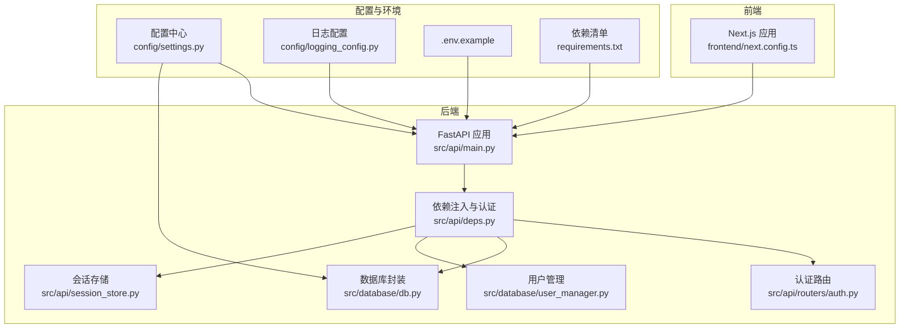
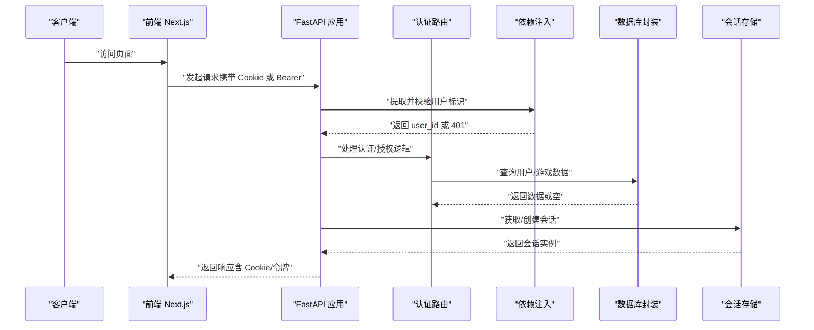
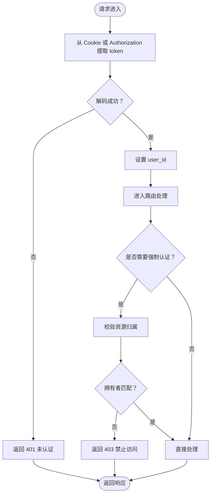
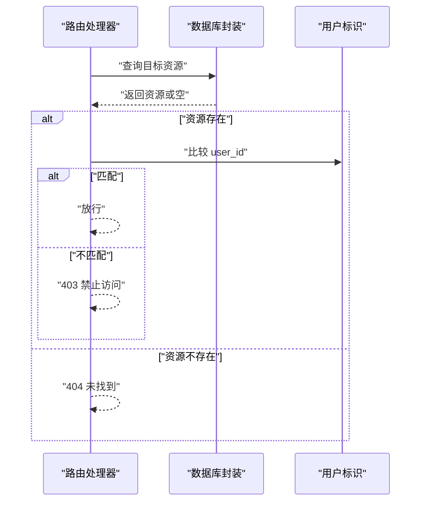
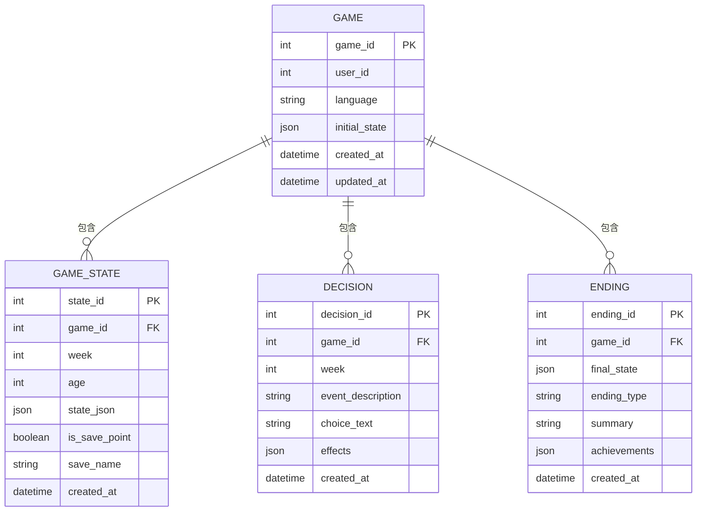
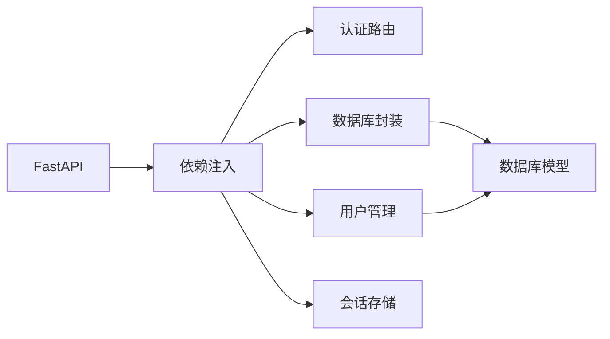

# 安全加固措施

<cite>
**本文引用的文件**
- [src/api/main.py](file://src/api/main.py)
- [src/api/deps.py](file://src/api/deps.py)
- [src/api/routers/auth.py](file://src/api/routers/auth.py)
- [src/api/session_store.py](file://src/api/session_store.py)
- [src/database/db.py](file://src/database/db.py)
- [src/database/user_manager.py](file://src/database/user_manager.py)
- [config/settings.py](file://config/settings.py)
- [config/logging_config.py](file://config/logging_config.py)
- [tests/security/test_api_security.py](file://tests/security/test_api_security.py)
- [.env.example](file://.env.example)
- [requirements.txt](file://requirements.txt)
- [Dockerfile](file://Dockerfile)
- [frontend/next.config.ts](file://frontend/next.config.ts)
- [阿里云部署指南.md](file://阿里云部署指南.md)
</cite>

## 目录
1. [引言](#引言)
2. [项目结构](#项目结构)
3. [核心组件](#核心组件)
4. [架构总览](#架构总览)
5. [详细组件分析](#详细组件分析)
6. [依赖分析](#依赖分析)
7. [性能考虑](#性能考虑)
8. [故障排查指南](#故障排查指南)
9. [结论](#结论)
10. [附录](#附录)

## 引言
本文件面向“安全加固措施”的目标，结合仓库中的现有实现与可扩展点，系统性地梳理并提出可落地的安全策略与最佳实践，覆盖 DDoS 防护、WAF 配置、数据加密、身份认证与授权、安全审计与合规检查、以及安全事件响应流程。由于本仓库未内置 WAF、DDoS 防护与加密中间件，本文在“现有能力”基础上给出“建议实现路径”，帮助团队在不破坏现有架构的前提下完成安全加固。

## 项目结构
后端基于 FastAPI，采用模块化路由与依赖注入；数据库层封装于 GameDatabase；会话管理采用内存会话存储；前端为 Next.js 应用，通过反向代理访问后端 API。整体结构清晰，便于在现有边界上扩展安全能力。

图示来源
- [src/api/main.py](file://src/api/main.py#L1-L134)
- [src/api/deps.py](file://src/api/deps.py#L1-L150)
- [src/api/routers/auth.py](file://src/api/routers/auth.py#L1-L125)
- [src/api/session_store.py](file://src/api/session_store.py#L1-L200)
- [src/database/db.py](file://src/database/db.py#L1-L200)
- [src/database/user_manager.py](file://src/database/user_manager.py#L1-L120)
- [config/settings.py](file://config/settings.py#L1-L168)
- [config/logging_config.py](file://config/logging_config.py#L1-L78)
- [.env.example](file://.env.example#L1-L22)
- [requirements.txt](file://requirements.txt#L1-L12)
- [frontend/next.config.ts](file://frontend/next.config.ts#L1-L30)

章节来源
- [src/api/main.py](file://src/api/main.py#L1-L134)
- [frontend/next.config.ts](file://frontend/next.config.ts#L1-L30)

## 核心组件
- 认证与会话
  - JWT 令牌签发与校验，支持 Cookie 与 Bearer Token 双通道认证，Cookie 默认启用 HttpOnly、SameSite、Secure（可配置）。
  - 会话存储具备超时清理与并发安全。
- 授权与访问控制
  - 依赖注入层统一提取用户标识，路由层对资源操作进行所有权校验。
- 数据持久化与审计
  - 数据库封装提供决策、状态、结局等持久化能力，并支持历史检索与关键词搜索，便于审计与合规核查。
- 配置与日志
  - 集中配置项支持数据库、模型、存储等参数；生产日志配置支持文件轮转与第三方库日志抑制。

章节来源
- [src/api/deps.py](file://src/api/deps.py#L1-L150)
- [src/api/routers/auth.py](file://src/api/routers/auth.py#L1-L125)
- [src/api/session_store.py](file://src/api/session_store.py#L1-L200)
- [src/database/db.py](file://src/database/db.py#L1-L200)
- [config/settings.py](file://config/settings.py#L1-L168)
- [config/logging_config.py](file://config/logging_config.py#L1-L78)

## 架构总览
下图展示了认证、授权、会话与数据流的关键交互，以及可扩展的安全增强点（WAF、DDoS、加密）。

图示来源
- [src/api/main.py](file://src/api/main.py#L1-L134)
- [src/api/deps.py](file://src/api/deps.py#L1-L150)
- [src/api/routers/auth.py](file://src/api/routers/auth.py#L1-L125)
- [src/api/session_store.py](file://src/api/session_store.py#L1-L200)
- [src/database/db.py](file://src/database/db.py#L1-L200)

## 详细组件分析

### 组件A：认证与会话（JWT + Cookie）
- 认证方式
  - 支持 Cookie 与 Bearer Token 双通道，优先从 Cookie 提取，提升移动端与 iPad Safari 的持久化体验。
  - Cookie 属性：HttpOnly、SameSite（可配置）、Secure（生产环境可开启）、路径全站。
- 令牌管理
  - HS256 算法、固定密钥（需在生产环境替换）、有效期 30 天。
- 会话生命周期
  - 内存会话超时 2 小时，定期清理过期会话，线程安全。

图示来源
- [src/api/deps.py](file://src/api/deps.py#L70-L133)
- [src/api/routers/auth.py](file://src/api/routers/auth.py#L1-L125)
- [src/api/session_store.py](file://src/api/session_store.py#L1-L200)

章节来源
- [src/api/deps.py](file://src/api/deps.py#L1-L150)
- [src/api/routers/auth.py](file://src/api/routers/auth.py#L1-L125)
- [src/api/session_store.py](file://src/api/session_store.py#L1-L200)

### 组件B：授权与访问控制
- 资源所有权校验
  - 在路由层对受保护资源进行 user_id 校验，防止越权访问。
- 错误处理
  - 统一异常处理返回内部错误摘要，避免泄露堆栈与敏感信息。

图示来源
- [src/database/db.py](file://src/database/db.py#L165-L184)
- [src/api/deps.py](file://src/api/deps.py#L107-L133)

章节来源
- [src/database/db.py](file://src/database/db.py#L165-L184)
- [src/api/main.py](file://src/api/main.py#L69-L77)

### 组件C：数据持久化与审计
- 持久化能力
  - 决策、状态、结局、角色预设等均持久化存储，支持加载、列表、删除等操作。
- 审计与合规
  - 提供历史检索与关键词搜索，可用于一致性验证、事实核查与合规审计。

图示来源
- [src/database/db.py](file://src/database/db.py#L1-L200)

章节来源
- [src/database/db.py](file://src/database/db.py#L1-L200)

### 组件D：配置与日志
- 配置中心
  - 统一管理数据库、模型、图像生成、语言等配置项，支持从环境变量读取。
- 日志配置
  - 生产环境启用文件轮转，抑制第三方库噪音，便于问题定位与合规归档。

章节来源
- [config/settings.py](file://config/settings.py#L1-L168)
- [config/logging_config.py](file://config/logging_config.py#L1-L78)

### 组件E：安全测试与风险评估
- 输入验证与注入测试
  - 针对登录接口进行 SQL 注入与 XSS 测试，验证错误码与响应稳定性。
- 认证与授权测试
  - 无效令牌、过期令牌、缺失令牌、越权访问等场景覆盖。
- 错误处理测试
  - 验证错误消息不泄露敏感信息与堆栈。

章节来源
- [tests/security/test_api_security.py](file://tests/security/test_api_security.py#L1-L323)

## 依赖分析
- 外部依赖
  - FastAPI、SQLAlchemy、Pydantic、python-jose、pytest 等。
- 关键耦合点
  - 依赖注入层集中处理认证与数据库访问，路由层仅关注业务逻辑，降低耦合度。
- 潜在风险
  - JWT 密钥硬编码在代码中，需在生产环境替换为安全密钥与密钥轮换机制。
  - 未实现速率限制与 WAF，易受暴力破解与常见 Web 攻击。

图示来源
- [src/api/deps.py](file://src/api/deps.py#L1-L150)
- [src/database/db.py](file://src/database/db.py#L1-L200)
- [src/database/user_manager.py](file://src/database/user_manager.py#L1-L120)

章节来源
- [requirements.txt](file://requirements.txt#L1-L12)
- [src/api/deps.py](file://src/api/deps.py#L1-L150)

## 性能考虑
- 会话超时与清理
  - 2 小时超时与周期性清理，避免内存泄漏；可根据业务并发调整清理间隔。
- 数据库事务与锁
  - 持久化操作使用 SQLAlchemy 会话，注意在高并发场景下的锁竞争与批量写入优化。
- 日志轮转
  - 文件轮转避免磁盘膨胀，建议结合系统日志收集工具统一归档。

[本节为通用指导，无需列出章节来源]

## 故障排查指南
- 认证失败
  - 检查 Cookie 是否正确设置（HttpOnly、SameSite、Secure），确认 Bearer Token 格式与有效期。
- 跨域问题
  - 核对 CORS 配置与环境变量，确保允许的来源列表与凭证设置正确。
- 错误消息泄露
  - 统一异常处理已屏蔽敏感信息，若仍出现，请检查自定义异常处理器。
- 日志定位
  - 生产环境启用文件日志，关注错误级别与第三方库日志抑制设置。

章节来源
- [src/api/main.py](file://src/api/main.py#L46-L66)
- [src/api/routers/auth.py](file://src/api/routers/auth.py#L16-L42)
- [config/logging_config.py](file://config/logging_config.py#L1-L78)

## 结论
本项目在认证与授权、会话管理、数据持久化与审计方面具备良好基础。建议在现有架构边界内引入 WAF、DDoS 防护、速率限制与传输/存储加密，以满足生产环境的安全与合规要求。同时完善密钥管理与事件响应流程，持续开展安全测试与渗透评估。

[本节为总结，无需列出章节来源]

## 附录

### A. DDoS 防护策略（建议实现）
- 流量清洗
  - 使用云厂商提供的 DDoS 防护服务，开启弹性带宽与黑洞路由。
- 带宽限制
  - 在反向代理层设置请求速率限制与连接数上限，结合 IP 黑名单/白名单。
- IP 白名单
  - 仅允许可信来源访问管理端点与后台接口，动态维护白名单。

[本节为概念性建议，无需列出章节来源]

### B. Web 应用防火墙（WAF）配置（建议实现）
- 规则定制
  - 基于 OWASP Top 10 定制规则，覆盖注入、XSS、CSRF、文件包含等。
- 攻击检测
  - 开启实时监控与告警，记录攻击特征与来源 IP。
- 自动封禁
  - 对高危 IP 实施短期封禁，配合人工复核与灰名单机制。

[本节为概念性建议，无需列出章节来源]

### C. 数据加密方案（建议实现）
- 传输加密
  - 强制 HTTPS，TLS 1.2+，禁用弱密码套件；前后端通信使用 HTTPS。
- 存储加密
  - 对敏感字段（如私有 ID）在数据库中加密存储，采用对称加密算法与密钥管理服务。
- 密钥管理
  - 使用 KMS 或密钥管理服务，定期轮换密钥，最小权限原则。

[本节为概念性建议，无需列出章节来源]

### D. 身份认证与授权强化（建议实现）
- 多因素认证（MFA）
  - 在登录流程增加短信/邮件验证码或 TOTP。
- 会话管理
  - 严格 Cookie 属性（HttpOnly、Secure、SameSite），短时会话与自动续期。
- 权限控制
  - RBAC/ABAC 模型细化权限粒度，最小权限原则与权限审计。

[本节为概念性建议，无需列出章节来源]

### E. 安全审计与合规检查（建议实现）
- 漏洞扫描
  - 定期对后端与前端进行静态与动态扫描，修复高危漏洞。
- 渗透测试
  - 由专业团队进行红蓝对抗，覆盖认证、授权、业务逻辑与数据层。
- 安全日志
  - 统一采集 API 访问日志、认证日志与审计日志，保留至少 90 天。

[本节为概念性建议，无需列出章节来源]

### F. 安全事件响应流程（建议实现）
- 分级与上报
  - 按影响范围分级，明确上报路径与处置时限。
- 处置与恢复
  - 快速隔离受影响服务，修复漏洞并验证，恢复业务。
- 复盘与改进
  - 形成事件报告，完善安全策略与应急预案。

[本节为概念性建议，无需列出章节来源]

### G. 现有安全配置要点与改进建议
- CORS 配置
  - 已明确允许来源列表与凭证设置，建议通过环境变量动态注入。
- Cookie 安全属性
  - 已启用 HttpOnly、SameSite，建议在生产环境开启 Secure 并设置合理过期时间。
- JWT 密钥
  - 当前密钥在代码中，需迁移到环境变量与密钥管理服务。
- 速率限制
  - 未实现速率限制，建议在反向代理或中间件层引入。
- 日志与错误处理
  - 已统一异常处理与日志配置，建议接入集中日志平台。

章节来源
- [src/api/main.py](file://src/api/main.py#L46-L66)
- [src/api/routers/auth.py](file://src/api/routers/auth.py#L16-L42)
- [src/api/deps.py](file://src/api/deps.py#L16-L18)
- [config/logging_config.py](file://config/logging_config.py#L1-L78)

### H. 部署与网络加固参考
- 反向代理与健康检查
  - Dockerfile 中已配置健康检查与端口暴露，建议在生产环境中加入 Nginx 反代与 SSL 终结。
- HTTPS 与证书
  - 参考部署指南中的 Nginx HTTPS 配置与证书申请流程。

章节来源
- [Dockerfile](file://Dockerfile#L1-L40)
- [阿里云部署指南.md](file://阿里云部署指南.md#L336-L500)