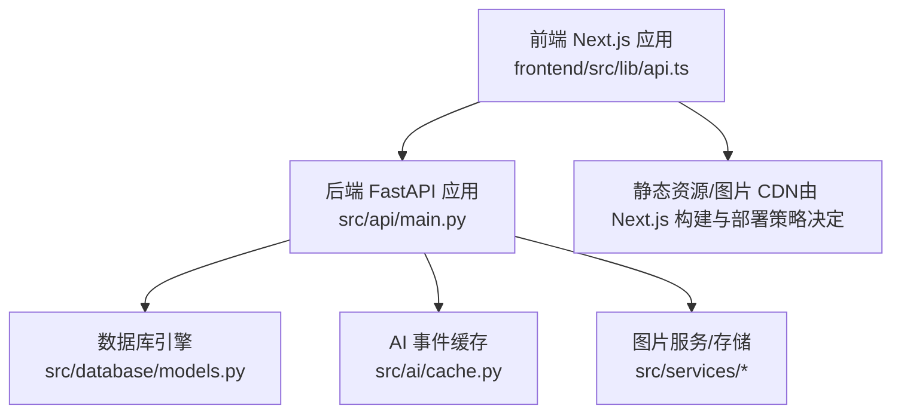
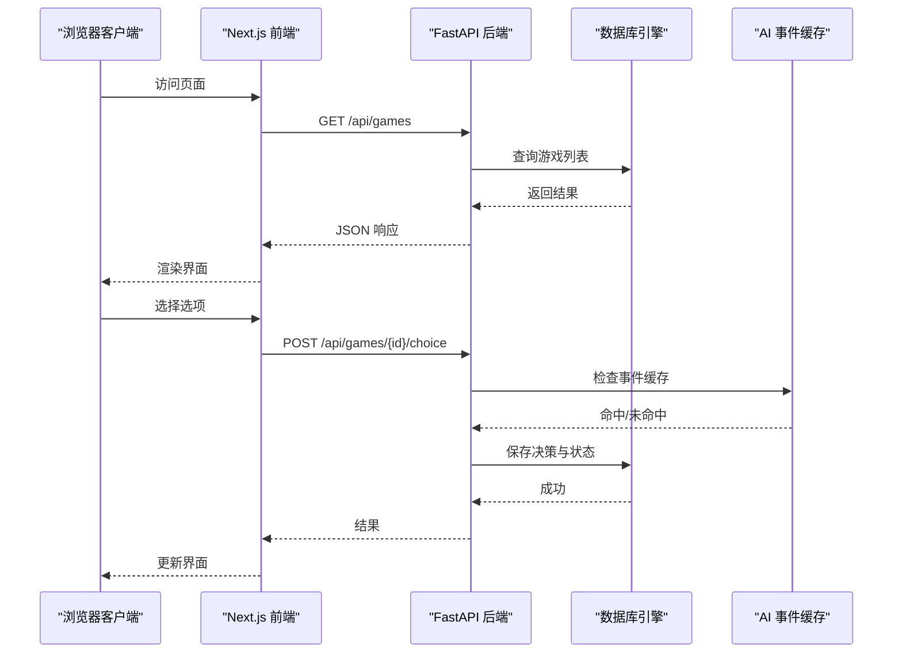
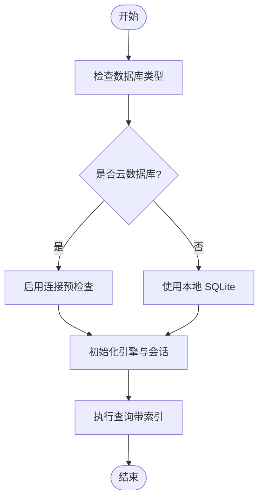
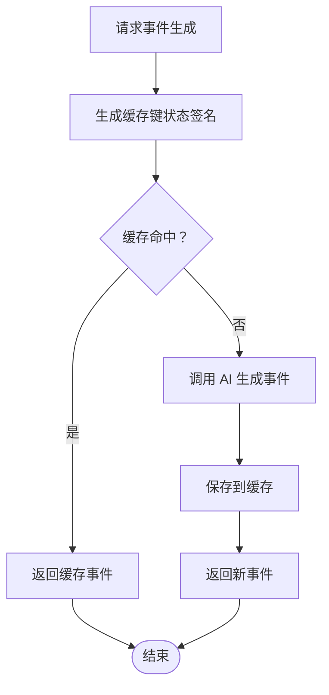
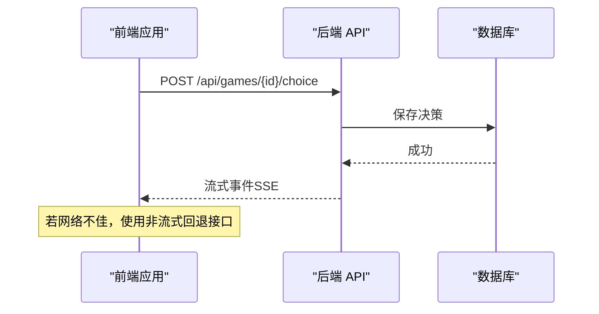
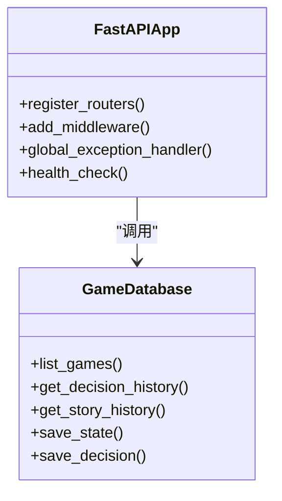
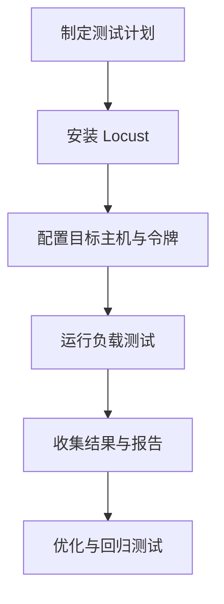
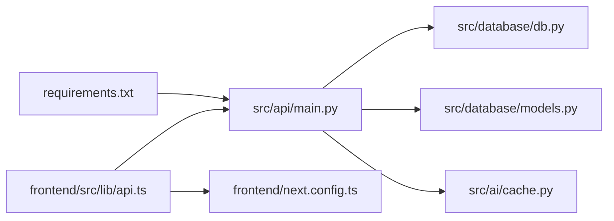

# 性能优化策略

<cite>
**本文档引用的文件**
- [config/settings.py](file://config/settings.py)
- [src/database/models.py](file://src/database/models.py)
- [src/database/db.py](file://src/database/db.py)
- [src/ai/cache.py](file://src/ai/cache.py)
- [src/api/main.py](file://src/api/main.py)
- [frontend/next.config.ts](file://frontend/next.config.ts)
- [frontend/src/lib/api.ts](file://frontend/src/lib/api.ts)
- [tests/performance/locustfile.py](file://tests/performance/locustfile.py)
- [docs/session-recovery-test-plan.md](file://docs/session-recovery-test-plan.md)
- [TEST_COVERAGE_REPORT.md](file://TEST_COVERAGE_REPORT.md)
- [requirements.txt](file://requirements.txt)
</cite>

## 目录
1. [简介](#简介)
2. [项目结构](#项目结构)
3. [核心组件](#核心组件)
4. [架构概览](#架构概览)
5. [详细组件分析](#详细组件分析)
6. [依赖分析](#依赖分析)
7. [性能考虑](#性能考虑)
8. [故障排查指南](#故障排查指南)
9. [结论](#结论)
10. [附录](#附录)

## 简介
本文件面向性能优化策略，结合仓库现有实现，系统梳理数据库查询优化、缓存策略、前端性能优化、后端性能优化、性能基准测试与监控指标，并提供可落地的配置与实践建议。目标是在保证功能正确性的前提下，显著降低响应延迟、提高吞吐能力、增强稳定性与可维护性。

## 项目结构
项目采用前后端分离架构：前端基于 Next.js，后端基于 FastAPI + SQLAlchemy；数据库支持本地 SQLite 与云数据库（通过配置切换）。AI 生成与缓存位于后端，图片生成与存储位于后端服务层，前端负责交互与流式渲染。

图表来源
- [src/api/main.py](file://src/api/main.py#L1-L134)
- [src/database/models.py](file://src/database/models.py#L1-L295)
- [src/ai/cache.py](file://src/ai/cache.py#L1-L139)
- [frontend/src/lib/api.ts](file://frontend/src/lib/api.ts#L1-L564)

章节来源
- [src/api/main.py](file://src/api/main.py#L1-L134)
- [src/database/models.py](file://src/database/models.py#L1-L295)
- [frontend/src/lib/api.ts](file://frontend/src/lib/api.ts#L1-L564)

## 核心组件
- 数据库层：统一通过 SQLAlchemy 初始化与会话管理，支持本地 SQLite 与云数据库（PostgreSQL/MySQL），具备连接池与预检查能力。
- 缓存层：AI 事件本地文件缓存，减少重复调用；前端具备 Cookie/Token 双重认证与流式回退策略。
- API 层：FastAPI 提供路由注册、CORS、全局异常处理与健康检查端点。
- 前端层：Next.js 配置代理超时、开发跨域、SSE 与非流式回退接口。

章节来源
- [src/database/models.py](file://src/database/models.py#L237-L295)
- [src/ai/cache.py](file://src/ai/cache.py#L1-L139)
- [src/api/main.py](file://src/api/main.py#L1-L134)
- [frontend/src/lib/api.ts](file://frontend/src/lib/api.ts#L1-L564)

## 架构概览
后端启动时初始化数据库，注册各路由模块；前端通过 /api 代理访问后端；数据库连接根据配置自动选择 SQLite 或云数据库；AI 事件通过本地缓存降低外部调用频率；图片生成与存储通过服务层抽象。

图表来源
- [src/api/main.py](file://src/api/main.py#L80-L90)
- [src/database/db.py](file://src/database/db.py#L186-L201)
- [src/ai/cache.py](file://src/ai/cache.py#L78-L101)

## 详细组件分析

### 数据库查询优化
- 连接与会话
  - 云数据库启用连接预检查，提升连接稳定性。
  - 提供上下文管理器与装饰器简化会话生命周期。
- 索引与查询
  - 用户表与游戏表均建立常用查询字段索引（如 user_id、public_id、private_id 等）。
  - 图片与场景图片表针对 game_id、image_type、entity_name 等组合建立复合索引，加速按游戏维度检索。
  - 查询接口按需排序与限制，避免全表扫描。
- 事务与一致性
  - 使用 with_db_session 装饰器确保会话正确关闭，避免连接泄漏。
  - 读写分离与批量插入策略（如保存状态、决策、结局）减少锁竞争。

图表来源
- [src/database/models.py](file://src/database/models.py#L237-L295)
- [src/database/db.py](file://src/database/db.py#L186-L201)

章节来源
- [src/database/models.py](file://src/database/models.py#L11-L295)
- [src/database/db.py](file://src/database/db.py#L1-L427)

### 缓存策略实施
- AI 事件缓存
  - 以玩家状态签名生成缓存键，包含年龄、情绪、知识、财富、周数与决策长度等关键特征，并进行离散化以降低键冲突。
  - 仅以一定概率命中缓存，保证多样性。
  - 缓存文件持久化至本地 JSON，便于重启后复用。
- 缓存失效策略
  - 通过随机命中率与键签名变化实现自然失效。
  - 提供清理接口，便于调试与容量管理。
- 缓存穿透防护
  - 通过键签名聚合与离散化，减少极端状态下的缓存穿透风险。
  - 未命中时直接回源生成，避免空值污染。

图表来源
- [src/ai/cache.py](file://src/ai/cache.py#L47-L128)

章节来源
- [src/ai/cache.py](file://src/ai/cache.py#L1-L139)

### 前端性能优化
- 代理与跨域
  - Next.js 配置代理超时，满足图片生成较长耗时场景。
  - 开发环境允许局域网访问，减少跨域警告。
- 认证与网络
  - 前端支持 Cookie 与 Authorization 双重认证，优先使用 Cookie，提升安全性与兼容性。
  - 统一封装请求与错误处理，统一上报客户端日志。
- 流式与回退
  - SSE 为主，提供非流式回退接口，适配移动端弱网环境。
- 构建与运行
  - Next.js 默认优化打包与缓存，结合 CDN 可进一步加速静态资源加载。

图表来源
- [frontend/src/lib/api.ts](file://frontend/src/lib/api.ts#L69-L124)
- [frontend/next.config.ts](file://frontend/next.config.ts#L16-L19)

章节来源
- [frontend/src/lib/api.ts](file://frontend/src/lib/api.ts#L1-L564)
- [frontend/next.config.ts](file://frontend/next.config.ts#L1-L31)

### 后端性能优化
- 连接池与会话
  - 云数据库启用连接预检查，降低连接失效带来的重试成本。
  - 使用上下文管理器与装饰器确保会话及时释放。
- 异步与流式
  - SSE 辅助模块与非流式回退接口，平衡实时性与兼容性。
- 异常与可观测性
  - 全局异常处理器统一返回错误信息，便于定位问题。
  - 健康检查端点暴露活动会话数，辅助运维监控。

图表来源
- [src/api/main.py](file://src/api/main.py#L35-L99)
- [src/database/db.py](file://src/database/db.py#L186-L240)

章节来源
- [src/api/main.py](file://src/api/main.py#L1-L134)
- [src/database/db.py](file://src/database/db.py#L1-L427)

### 性能基准测试与监控
- 基准测试
  - 使用 Locust 编写负载测试脚本，覆盖匿名用户、游戏进程用户与高压用户场景。
  - 支持 Web UI 与 Headless 模式，便于本地与 CI 集成。
- 监控指标
  - 健康检查端点返回活动会话数，可用于简单监控。
  - 建议扩展：引入指标采集（如响应时间、错误率、并发数）与告警策略。

图表来源
- [tests/performance/locustfile.py](file://tests/performance/locustfile.py#L1-L224)

章节来源
- [tests/performance/locustfile.py](file://tests/performance/locustfile.py#L1-L224)
- [src/api/main.py](file://src/api/main.py#L92-L99)

## 依赖分析
- 外部依赖
  - FastAPI、SQLAlchemy、Uvicorn、Pydantic 等构成后端核心栈。
  - Next.js 与前端工具链支撑前端构建与运行。
- 内部耦合
  - API 层依赖数据库模型与服务层；数据库层依赖配置模块；缓存层依赖配置与模型。
  - 前端通过统一 API 客户端访问后端，降低耦合度。

图表来源
- [src/api/main.py](file://src/api/main.py#L1-L134)
- [src/database/db.py](file://src/database/db.py#L1-L910)
- [src/database/models.py](file://src/database/models.py#L1-L295)
- [src/ai/cache.py](file://src/ai/cache.py#L1-L139)
- [frontend/src/lib/api.ts](file://frontend/src/lib/api.ts#L1-L564)
- [frontend/next.config.ts](file://frontend/next.config.ts#L1-L31)
- [requirements.txt](file://requirements.txt#L1-L12)

章节来源
- [requirements.txt](file://requirements.txt#L1-L12)

## 性能考虑
- 数据库层面
  - 为高频查询字段建立索引，避免全表扫描。
  - 使用连接预检查与上下文管理器，降低连接失效与泄漏风险。
  - 对长列表查询增加分页与限制，避免一次性返回大量数据。
- 缓存层面
  - 合理设置缓存命中率，兼顾性能与多样性。
  - 缓存键设计需考虑状态离散化，减少缓存抖动。
- 前端层面
  - 使用代理超时与非流式回退，提升弱网体验。
  - 采用 Cookie 认证减少 Token 传输开销。
- 后端层面
  - SSE 与非流式回退双通道，提升兼容性与稳定性。
  - 全局异常处理与健康检查，便于快速定位问题。

## 故障排查指南
- 会话恢复与事件一致性
  - 后端在内存会话缺失时自动从数据库恢复，避免“无当前事件”错误。
  - 前端在选择后清空 currentEvent，防止刷新后出现旧选项。
- 测试与验证
  - 使用调试端点清理会话，验证自动恢复流程。
  - 通过测试报告评估覆盖率，持续改进测试质量。

章节来源
- [docs/session-recovery-test-plan.md](file://docs/session-recovery-test-plan.md#L1-L158)
- [TEST_COVERAGE_REPORT.md](file://TEST_COVERAGE_REPORT.md#L1-L217)

## 结论
本项目已在数据库索引、AI 事件缓存、前后端协同与基准测试方面形成较为完善的性能基线。建议在现有基础上进一步完善指标采集、压力测试场景覆盖与自动化回归，持续迭代以应对更高并发与更复杂业务场景。

## 附录
- 配置参考
  - 数据库 URL 优先使用环境变量 DATABASE_URL，否则回退到本地 SQLite。
  - AI 与图片相关参数可通过环境变量调整，如超时与重试次数。
- 前端代理超时
  - Next.js 配置代理超时以适配图片生成较长耗时场景。
- API 健康检查
  - /api/health 返回活动会话数，便于运维监控。

章节来源
- [config/settings.py](file://config/settings.py#L107-L141)
- [frontend/next.config.ts](file://frontend/next.config.ts#L16-L19)
- [src/api/main.py](file://src/api/main.py#L92-L99)