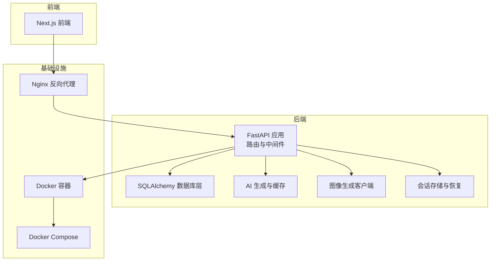
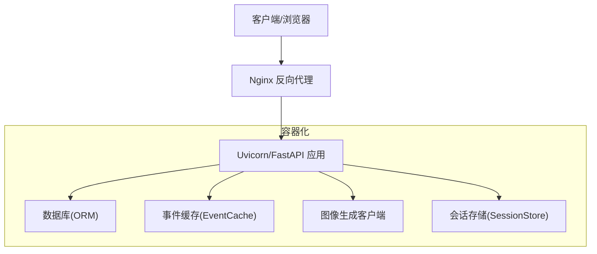
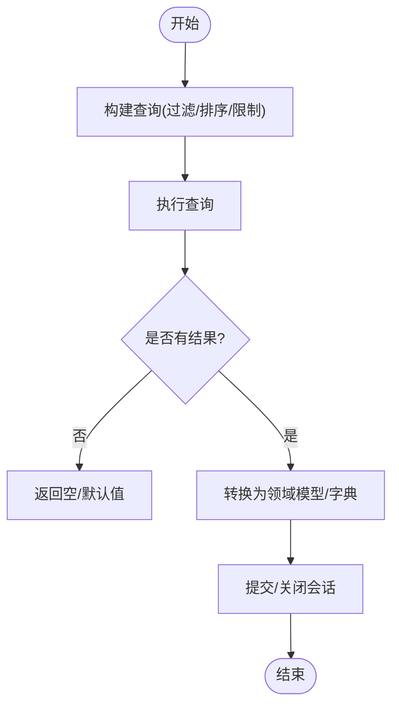
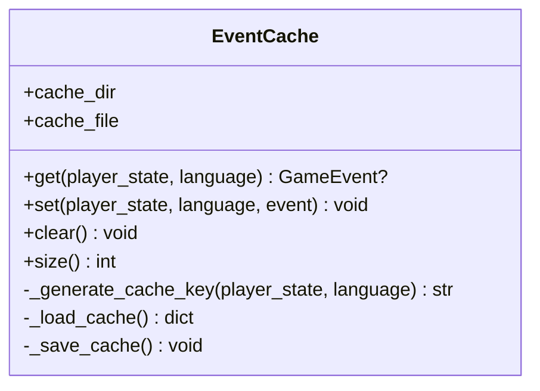
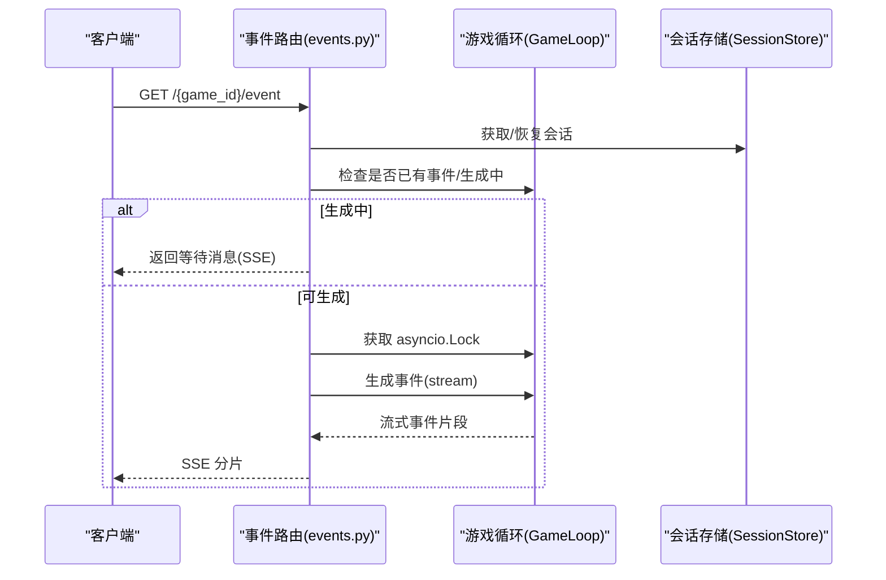
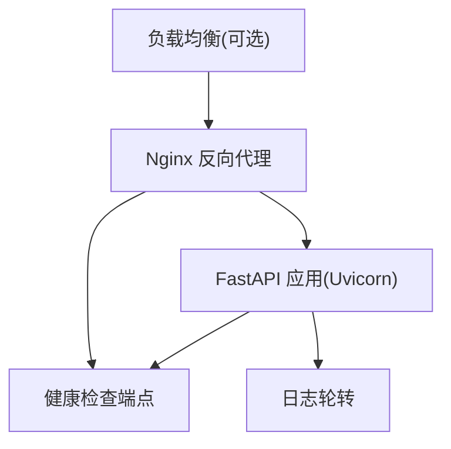
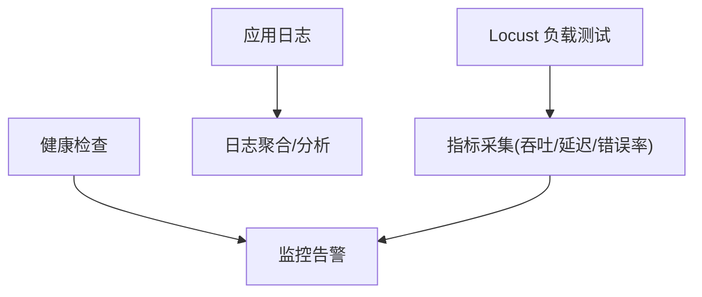
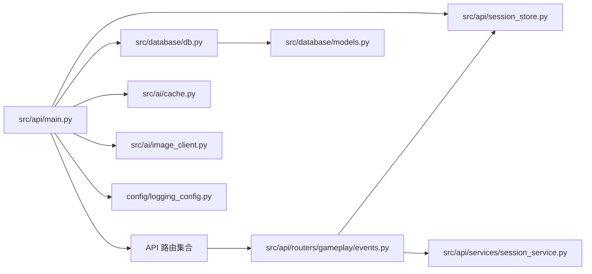

# 性能扩展与高可用

<cite>
**本文档引用的文件**
- [Dockerfile](file://Dockerfile)
- [docker-compose.yml](file://docker-compose.yml)
- [docker-compose.prod.yml](file://docker-compose.prod.yml)
- [requirements.txt](file://requirements.txt)
- [src/api/main.py](file://src/api/main.py)
- [src/database/db.py](file://src/database/db.py)
- [src/ai/cache.py](file://src/ai/cache.py)
- [config/settings.py](file://config/settings.py)
- [src/ai/generator.py](file://src/ai/generator.py)
- [src/ai/image_client.py](file://src/ai/image_client.py)
- [src/api/routers/gameplay/events.py](file://src/api/routers/gameplay/events.py)
- [src/api/session_store.py](file://src/api/session_store.py)
- [src/api/services/session_service.py](file://src/api/services/session_service.py)
- [config/logging_config.py](file://config/logging_config.py)
- [tests/performance/locustfile.py](file://tests/performance/locustfile.py)
- [DEPLOYMENT.md](file://DEPLOYMENT.md)
- [阿里云部署指南.md](file://阿里云部署指南.md)
</cite>

## 目录
1. [引言](#引言)
2. [项目结构](#项目结构)
3. [核心组件](#核心组件)
4. [架构总览](#架构总览)
5. [详细组件分析](#详细组件分析)
6. [依赖关系分析](#依赖关系分析)
7. [性能考量](#性能考量)
8. [故障排查指南](#故障排查指南)
9. [结论](#结论)
10. [附录](#附录)

## 引言
本文件面向“性能扩展与高可用”主题，结合代码库现状，系统梳理数据库查询优化、缓存策略、并发处理、高可用架构、水平扩展、监控与诊断、安全加固以及容量规划与基准测试等关键能力，并给出可操作的落地建议与最佳实践。

## 项目结构
项目采用前后端分离与后端服务化架构，后端基于 FastAPI 提供 API，数据库层使用 SQLAlchemy，AI 生成模块采用事件缓存与模型降级策略，容器化部署通过 Docker Compose 支持开发与生产环境。

图表来源
- [src/api/main.py](file://src/api/main.py#L1-L134)
- [src/database/db.py](file://src/database/db.py#L1-L910)
- [src/ai/generator.py](file://src/ai/generator.py#L1-L497)
- [src/ai/image_client.py](file://src/ai/image_client.py#L1-L1240)
- [src/api/session_store.py](file://src/api/session_store.py#L1-L200)
- [docker-compose.yml](file://docker-compose.yml#L1-L65)
- [docker-compose.prod.yml](file://docker-compose.prod.yml#L1-L43)

章节来源
- [src/api/main.py](file://src/api/main.py#L1-L134)
- [docker-compose.yml](file://docker-compose.yml#L1-L65)
- [docker-compose.prod.yml](file://docker-compose.prod.yml#L1-L43)

## 核心组件
- API 层：FastAPI 应用，CORS 配置、全局异常处理、健康检查、客户端日志收集。
- 数据库层：SQLAlchemy ORM，提供游戏状态、决策、结局、预设等持久化。
- AI 生成层：事件生成门面，包含故事生成、选项生成、摘要生成、重写与缓存。
- 图像生成层：OpenAI 兼容接口适配，支持模型降级与速率限制处理。
- 会话层：内存会话存储与自动恢复，支持 SSE 断线重连与并发锁。
- 部署层：Dockerfile、Compose 与生产配置，支持 Nginx 反代与健康检查。

章节来源
- [src/api/main.py](file://src/api/main.py#L1-L134)
- [src/database/db.py](file://src/database/db.py#L1-L910)
- [src/ai/generator.py](file://src/ai/generator.py#L1-L497)
- [src/ai/image_client.py](file://src/ai/image_client.py#L1-L1240)
- [src/api/session_store.py](file://src/api/session_store.py#L1-L200)
- [docker-compose.yml](file://docker-compose.yml#L1-L65)
- [docker-compose.prod.yml](file://docker-compose.prod.yml#L1-L43)

## 架构总览
系统采用“API + 业务服务 + 数据存储 + AI/图像”的分层设计，API 层负责接入与编排，业务服务负责游戏流程与状态管理，数据层负责持久化，AI/图像层负责内容生成与渲染。生产环境通过 Nginx 反向代理统一入口，配合健康检查与日志轮转实现高可用。

图表来源
- [src/api/main.py](file://src/api/main.py#L1-L134)
- [src/database/db.py](file://src/database/db.py#L1-L910)
- [src/ai/cache.py](file://src/ai/cache.py#L1-L139)
- [src/ai/image_client.py](file://src/ai/image_client.py#L1-L1240)
- [src/api/session_store.py](file://src/api/session_store.py#L1-L200)
- [docker-compose.prod.yml](file://docker-compose.prod.yml#L25-L43)

## 详细组件分析

### 数据库查询优化
- 连接与事务：使用 SQLAlchemy 会话管理，按需开启/关闭，避免长事务；在高频写入场景中减少不必要的提交。
- 查询路径：按需过滤与排序，使用 limit 控制返回条目；对历史查询使用索引友好的条件（如按时间倒序）。
- 关联与级联：合理使用级联删除/更新，避免孤儿数据；在批量操作中合并提交以降低开销。
- 读写分离与分页：对列表类接口使用分页与上限限制；对历史检索使用关键词匹配与限制结果数。

图表来源
- [src/database/db.py](file://src/database/db.py#L186-L201)
- [src/database/db.py](file://src/database/db.py#L213-L240)
- [src/database/db.py](file://src/database/db.py#L242-L282)

章节来源
- [src/database/db.py](file://src/database/db.py#L1-L910)

### 缓存策略
- 事件缓存：基于玩家状态签名的本地文件缓存，降低重复 AI 请求；随机命中率控制多样性。
- 配置缓存：通过设置开关控制是否启用事件缓存。
- SSE 缓存：会话层缓存流式事件片段，支持断线重连重放。

图表来源
- [src/ai/cache.py](file://src/ai/cache.py#L1-L139)

章节来源
- [src/ai/cache.py](file://src/ai/cache.py#L1-L139)
- [config/settings.py](file://config/settings.py#L70-L74)
- [src/api/session_store.py](file://src/api/session_store.py#L63-L98)

### 并发处理
- 会话并发：每游戏实例使用 asyncio.Lock 防止并发事件生成；同时维护生成标志位与超时检测。
- SSE 断线重连：通过 Last-Event-ID 与 SSE 缓存实现断线重放。
- 线程安全：会话存储使用线程锁与定期清理机制，避免内存泄漏。

图表来源
- [src/api/routers/gameplay/events.py](file://src/api/routers/gameplay/events.py#L48-L164)
- [src/api/session_store.py](file://src/api/session_store.py#L15-L98)

章节来源
- [src/api/routers/gameplay/events.py](file://src/api/routers/gameplay/events.py#L1-L212)
- [src/api/session_store.py](file://src/api/session_store.py#L1-L200)

### 高可用架构设计
- 健康检查：应用与 Nginx 均配置健康检查端点与探测间隔。
- 反向代理：Nginx 统一入口，支持 HTTP/HTTPS、升级头透传与缓冲关闭。
- 资源限制：Compose 中配置 CPU/内存限制，防止资源争用。
- 日志轮转：生产日志配置与文件轮转，便于运维与审计。

图表来源
- [Dockerfile](file://Dockerfile#L34-L36)
- [docker-compose.prod.yml](file://docker-compose.prod.yml#L25-L43)
- [config/logging_config.py](file://config/logging_config.py#L1-L78)

章节来源
- [Dockerfile](file://Dockerfile#L1-L40)
- [docker-compose.yml](file://docker-compose.yml#L28-L33)
- [docker-compose.prod.yml](file://docker-compose.prod.yml#L1-L43)
- [config/logging_config.py](file://config/logging_config.py#L1-L78)

### 水平扩展方案
- 微服务拆分：当前为单体服务，建议将 AI 生成与图像生成抽象为独立服务，通过 API 调用。
- 容器编排：使用 Compose/Orchestration 管理多副本与滚动更新。
- 自动扩缩容：基于 CPU/内存/请求量指标进行扩缩容（需结合监控系统）。
- 会话共享：内存会话不适合多副本，建议引入 Redis/共享存储实现会话共享或无状态化。

章节来源
- [docker-compose.yml](file://docker-compose.yml#L35-L42)
- [docker-compose.prod.yml](file://docker-compose.prod.yml#L1-L43)

### 监控与诊断
- 性能测试：提供 Locust 负载测试脚本，覆盖匿名与认证用户场景。
- 日志采集：生产日志配置与文件轮转；客户端日志上报接口便于移动端问题定位。
- 健康检查：应用与 Nginx 健康检查端点，便于自动化探活。

图表来源
- [tests/performance/locustfile.py](file://tests/performance/locustfile.py#L1-L224)
- [src/api/main.py](file://src/api/main.py#L102-L134)
- [config/logging_config.py](file://config/logging_config.py#L1-L78)

章节来源
- [tests/performance/locustfile.py](file://tests/performance/locustfile.py#L1-L224)
- [src/api/main.py](file://src/api/main.py#L102-L134)
- [config/logging_config.py](file://config/logging_config.py#L1-L78)

### 安全加固
- 部署安全：生产环境关闭 CORS 通配、启用 XSRF 保护、HTTPS 与证书管理。
- 访问控制：CORS 明确白名单，Cookie 认证需 allow_credentials。
- 资源限制：容器资源限制与健康检查，防止资源滥用。
- 传输安全：Nginx 反代启用 TLS，证书自动续期。

章节来源
- [src/api/main.py](file://src/api/main.py#L42-L66)
- [docker-compose.prod.yml](file://docker-compose.prod.yml#L11-L16)
- [阿里云部署指南.md](file://阿里云部署指南.md#L440-L566)

## 依赖关系分析

图表来源
- [src/api/main.py](file://src/api/main.py#L80-L89)
- [src/api/routers/gameplay/events.py](file://src/api/routers/gameplay/events.py#L14-L25)
- [src/api/services/session_service.py](file://src/api/services/session_service.py#L1-L158)
- [src/database/db.py](file://src/database/db.py#L1-L910)
- [src/ai/cache.py](file://src/ai/cache.py#L1-L139)
- [src/ai/image_client.py](file://src/ai/image_client.py#L1-L1240)
- [src/api/session_store.py](file://src/api/session_store.py#L1-L200)
- [config/logging_config.py](file://config/logging_config.py#L1-L78)

章节来源
- [src/api/main.py](file://src/api/main.py#L1-L134)
- [src/api/routers/gameplay/events.py](file://src/api/routers/gameplay/events.py#L1-L212)
- [src/api/services/session_service.py](file://src/api/services/session_service.py#L1-L158)
- [src/database/db.py](file://src/database/db.py#L1-L910)

## 性能考量
- 数据库层
  - 使用合适的索引与查询条件，避免全表扫描；对历史查询限制返回条数。
  - 批量写入合并提交，减少事务开销。
- 缓存层
  - 启用事件缓存以降低 AI 调用频率；对热点数据增加缓存命中率。
  - SSE 缓存限制大小，避免内存膨胀。
- 并发层
  - 使用 asyncio.Lock 与生成标志位防止并发生成；对长时间阻塞操作使用线程池。
- 图像生成
  - 模型降级与指数退避重试，应对限流与失败；合理设置超时与重试次数。
- 部署层
  - 资源限制与健康检查保障稳定性；Nginx 关闭缓冲提升实时性。

章节来源
- [src/database/db.py](file://src/database/db.py#L1-L910)
- [src/ai/cache.py](file://src/ai/cache.py#L1-L139)
- [src/api/routers/gameplay/events.py](file://src/api/routers/gameplay/events.py#L30-L164)
- [src/ai/image_client.py](file://src/ai/image_client.py#L190-L260)
- [docker-compose.yml](file://docker-compose.yml#L35-L42)

## 故障排查指南
- 健康检查失败
  - 检查应用与 Nginx 健康端点；查看容器日志与资源限制。
- 事件生成卡顿
  - 检查并发锁与生成标志位；确认 SSE 缓存大小与 Last-Event-ID。
- 图像生成失败
  - 查看限流与重试日志；确认 API Key 与基础 URL；检查模型降级链路。
- 客户端日志
  - 通过 /api/client-log 接收前端错误上下文，辅助移动端问题定位。

章节来源
- [Dockerfile](file://Dockerfile#L34-L36)
- [docker-compose.yml](file://docker-compose.yml#L28-L33)
- [src/api/routers/gameplay/events.py](file://src/api/routers/gameplay/events.py#L88-L120)
- [src/ai/image_client.py](file://src/ai/image_client.py#L235-L260)
- [src/api/main.py](file://src/api/main.py#L117-L133)

## 结论
本项目在性能与高可用方面具备良好基础：事件缓存、并发锁、SSE 断线重连、Nginx 反代与健康检查。建议进一步完善：AI/图像服务拆分、会话共享或无状态化改造、完善的监控与告警体系、自动扩缩容策略与 WAF/DDoS 防护配置，以支撑更大规模的用户并发与更复杂的业务场景。

## 附录
- 容量规划与基准测试
  - 使用 Locust 脚本进行压力测试，逐步提升并发与请求强度，记录 P50/P95 延迟与错误率。
  - 对关键路径（事件生成、图像生成、数据库读写）分别压测，识别瓶颈。
- 安全加固清单
  - 启用 HTTPS 与证书自动续期；限制 CORS 白名单；容器资源限制与健康检查；日志轮转与访问审计。

章节来源
- [tests/performance/locustfile.py](file://tests/performance/locustfile.py#L1-L224)
- [阿里云部署指南.md](file://阿里云部署指南.md#L440-L566)