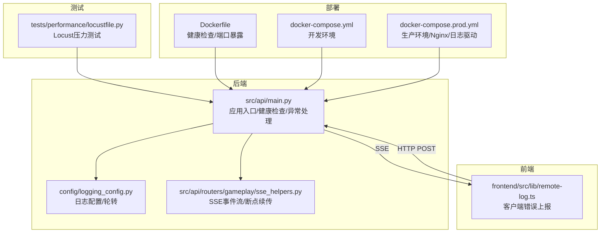
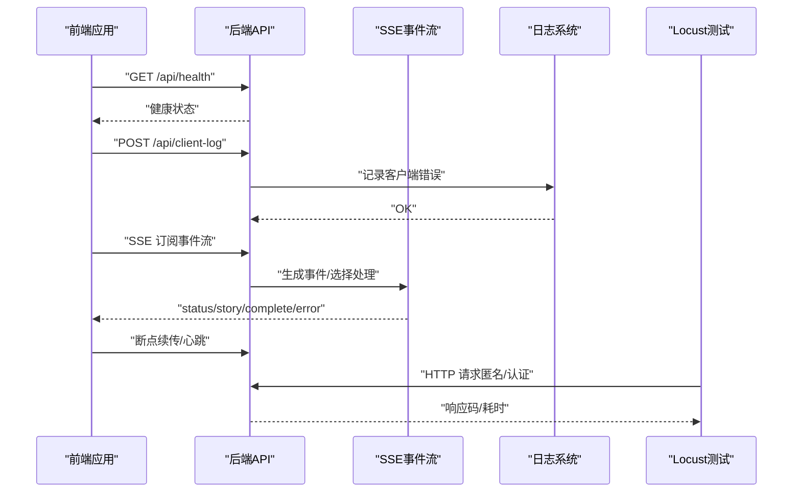
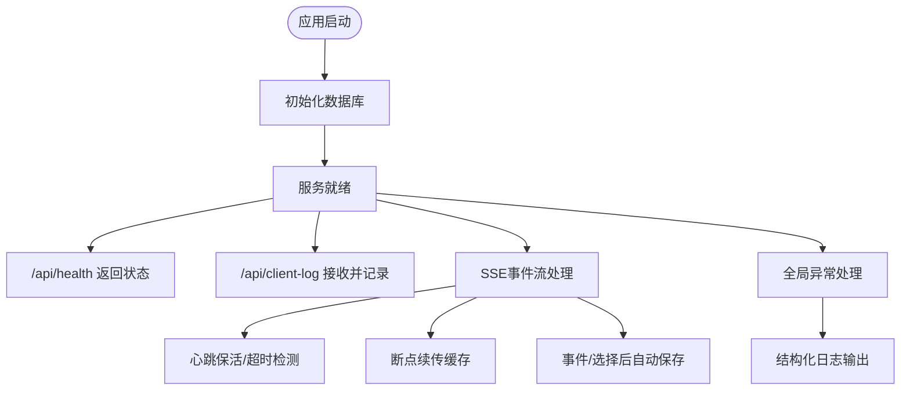
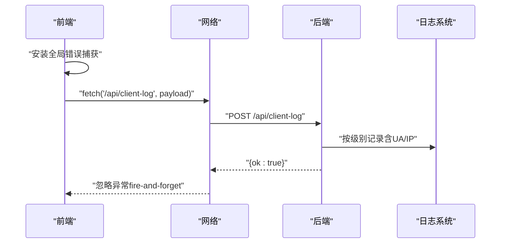
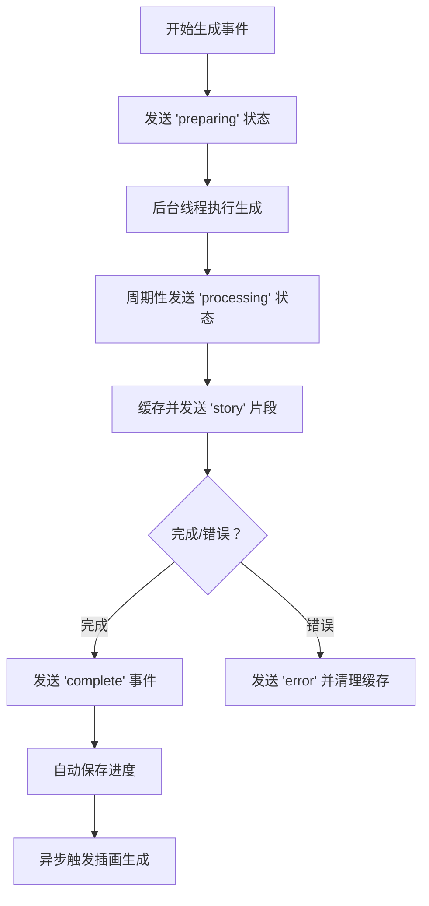
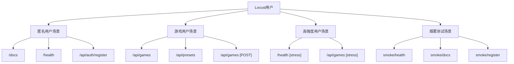
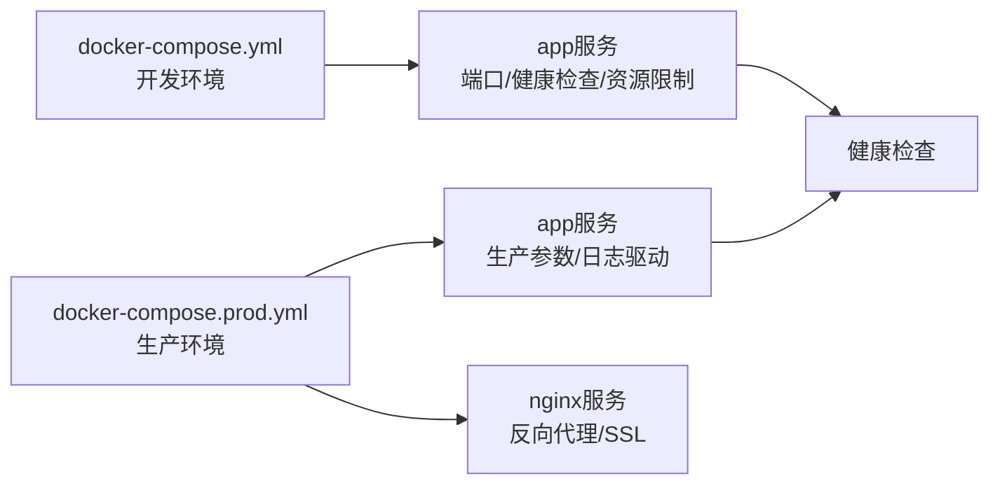
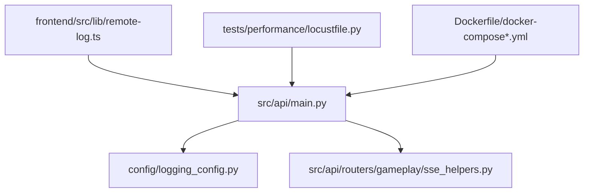

# 监控与诊断系统

<cite>
**本文引用的文件**
- [config/logging_config.py](file://config/logging_config.py)
- [config/settings.py](file://config/settings.py)
- [src/api/main.py](file://src/api/main.py)
- [src/api/routers/gameplay/sse_helpers.py](file://src/api/routers/gameplay/sse_helpers.py)
- [frontend/src/lib/remote-log.ts](file://frontend/src/lib/remote-log.ts)
- [tests/performance/locustfile.py](file://tests/performance/locustfile.py)
- [Dockerfile](file://Dockerfile)
- [docker-compose.yml](file://docker-compose.yml)
- [docker-compose.prod.yml](file://docker-compose.prod.yml)
- [DEPLOYMENT.md](file://DEPLOYMENT.md)
- [requirements.txt](file://requirements.txt)
</cite>

## 目录
1. [简介](#简介)
2. [项目结构](#项目结构)
3. [核心组件](#核心组件)
4. [架构总览](#架构总览)
5. [详细组件分析](#详细组件分析)
6. [依赖关系分析](#依赖关系分析)
7. [性能考量](#性能考量)
8. [故障排查指南](#故障排查指南)
9. [结论](#结论)
10. [附录](#附录)

## 简介
本文件面向“监控与诊断系统”的技术文档目标，聚焦于以下方面：
- APM工具集成：性能监控、错误追踪、用户体验监控
- 日志聚合与分析：结构化日志格式、ELK Stack配置思路、日志轮转策略
- 关键性能指标（KPI）监控：响应时间、吞吐量、错误率、资源利用率
- 告警机制配置：阈值设置、通知渠道、升级策略
- 性能基准测试框架：Locust压力测试与性能回归测试
- 监控仪表板配置与故障诊断流程

当前代码库已具备完善的日志采集与上报能力（后端日志、客户端错误上报）、SSE流式事件与断点续传能力、Docker与Compose部署与健康检查，以及Locust性能测试脚本。本文基于现有实现，给出可落地的监控与诊断实践建议。

## 项目结构
围绕监控与诊断的关键模块分布如下：
- 后端日志与健康检查：后端应用入口、日志配置、健康检查端点
- 前端错误上报：远程日志上报模块与全局错误捕获
- SSE事件流：断点续传、心跳、超时与自动保存
- 性能测试：Locust负载测试脚本
- 部署与容器化：Dockerfile、Compose与生产配置

**图表来源**
- [src/api/main.py](file://src/api/main.py#L1-L134)
- [config/logging_config.py](file://config/logging_config.py#L1-L78)
- [src/api/routers/gameplay/sse_helpers.py](file://src/api/routers/gameplay/sse_helpers.py#L1-L571)
- [frontend/src/lib/remote-log.ts](file://frontend/src/lib/remote-log.ts#L1-L88)
- [tests/performance/locustfile.py](file://tests/performance/locustfile.py#L1-L224)
- [Dockerfile](file://Dockerfile#L1-L40)
- [docker-compose.yml](file://docker-compose.yml#L1-L65)
- [docker-compose.prod.yml](file://docker-compose.prod.yml#L1-L43)

**章节来源**
- [src/api/main.py](file://src/api/main.py#L1-L134)
- [config/logging_config.py](file://config/logging_config.py#L1-L78)
- [src/api/routers/gameplay/sse_helpers.py](file://src/api/routers/gameplay/sse_helpers.py#L1-L571)
- [frontend/src/lib/remote-log.ts](file://frontend/src/lib/remote-log.ts#L1-L88)
- [tests/performance/locustfile.py](file://tests/performance/locustfile.py#L1-L224)
- [Dockerfile](file://Dockerfile#L1-L40)
- [docker-compose.yml](file://docker-compose.yml#L1-L65)
- [docker-compose.prod.yml](file://docker-compose.prod.yml#L1-L43)

## 核心组件
- 后端日志与健康检查
  - 应用生命周期钩子、CORS中间件、全局异常处理、健康检查端点、客户端日志接收端点
- 结构化日志与轮转
  - 控制台+文件双通道、RotatingFileHandler、第三方库日志级别抑制
- 前端错误上报
  - 全局错误捕获、去重上报、fire-and-forget请求
- SSE事件流与断点续传
  - 心跳保活、缓存与重放、自动保存、异步触发插画生成
- 性能测试
  - Locust多用户场景、认证头注入、错误分类与统计
- 容器化与健康检查
  - Dockerfile健康检查、Compose资源限制与日志驱动

**章节来源**
- [src/api/main.py](file://src/api/main.py#L1-L134)
- [config/logging_config.py](file://config/logging_config.py#L1-L78)
- [frontend/src/lib/remote-log.ts](file://frontend/src/lib/remote-log.ts#L1-L88)
- [src/api/routers/gameplay/sse_helpers.py](file://src/api/routers/gameplay/sse_helpers.py#L1-L571)
- [tests/performance/locustfile.py](file://tests/performance/locustfile.py#L1-L224)
- [Dockerfile](file://Dockerfile#L1-L40)
- [docker-compose.yml](file://docker-compose.yml#L1-L65)
- [docker-compose.prod.yml](file://docker-compose.prod.yml#L1-L43)

## 架构总览
下图展示监控与诊断系统的端到端交互：前端通过SSE接收事件流，同时上报客户端错误；后端记录结构化日志并暴露健康检查；容器层提供健康检查与日志轮转；性能测试脚本对后端进行压测。

**图表来源**
- [src/api/main.py](file://src/api/main.py#L92-L134)
- [frontend/src/lib/remote-log.ts](file://frontend/src/lib/remote-log.ts#L37-L88)
- [src/api/routers/gameplay/sse_helpers.py](file://src/api/routers/gameplay/sse_helpers.py#L145-L277)
- [tests/performance/locustfile.py](file://tests/performance/locustfile.py#L34-L224)

## 详细组件分析

### 后端日志与健康检查
- 日志配置
  - 控制台处理器与文件处理器并行输出，文件采用轮转策略，避免单文件过大
  - 第三方库日志级别降低，减少噪音
- 健康检查
  - 提供轻量级健康端点，返回活动会话数
- 全局异常处理
  - 捕获未处理异常并返回统一JSON响应，同时记录错误日志
- 客户端日志接收
  - 接收前端上报的错误信息，补充UA/IP上下文，按级别记录

**图表来源**
- [src/api/main.py](file://src/api/main.py#L24-L134)
- [config/logging_config.py](file://config/logging_config.py#L12-L78)

**章节来源**
- [src/api/main.py](file://src/api/main.py#L1-L134)
- [config/logging_config.py](file://config/logging_config.py#L1-L78)

### 前端错误上报与用户体验监控
- 全局错误捕获
  - 捕获同步异常与未处理Promise拒绝，构造上下文信息
- 去重与防抖
  - 同一消息在短时间内不重复上报，避免噪声
- 上报策略
  - fire-and-forget，不影响主线程与用户体验
- 上报字段
  - 级别、消息、上下文、页面URL、UA等，便于后端统一分析

**图表来源**
- [frontend/src/lib/remote-log.ts](file://frontend/src/lib/remote-log.ts#L37-L88)
- [src/api/main.py](file://src/api/main.py#L117-L134)

**章节来源**
- [frontend/src/lib/remote-log.ts](file://frontend/src/lib/remote-log.ts#L1-L88)
- [src/api/main.py](file://src/api/main.py#L102-L134)

### SSE事件流与断点续传
- 断点续传
  - 基于事件ID重放缓存片段，支持“重连后继续”
- 心跳保活
  - 定期发送status事件，超过阈值自动超时
- 自动保存
  - 事件生成与选择处理完成后自动保存进度
- 异步触发
  - 事件完成后异步触发场景插画生成，不阻塞主流程

**图表来源**
- [src/api/routers/gameplay/sse_helpers.py](file://src/api/routers/gameplay/sse_helpers.py#L145-L277)

**章节来源**
- [src/api/routers/gameplay/sse_helpers.py](file://src/api/routers/gameplay/sse_helpers.py#L1-L571)

### 性能基准测试框架（Locust）
- 用户类型
  - 匿名用户：访问文档、健康检查、注册
  - 游戏用户：获取存档、预设、创建游戏、获取状态
  - 高强度用户：快速健康检查与列表请求
  - 烟雾测试：最小化场景验证
- 认证与请求
  - 支持Bearer Token认证，统一错误分类（4xx/5xx）
- 运行方式
  - 支持Web UI与Headless模式，CI友好

**图表来源**
- [tests/performance/locustfile.py](file://tests/performance/locustfile.py#L34-L224)

**章节来源**
- [tests/performance/locustfile.py](file://tests/performance/locustfile.py#L1-L224)

### 容器化与部署（健康检查与日志）
- Dockerfile
  - 健康检查：访问Swagger文档，失败退出
  - 端口暴露与进程启动
- docker-compose
  - 开发环境：端口映射、资源限制、健康检查
- docker-compose.prod.yml
  - 生产环境：禁用CORS/XSRF保护、Nginx反向代理、容器日志驱动

**图表来源**
- [Dockerfile](file://Dockerfile#L34-L40)
- [docker-compose.yml](file://docker-compose.yml#L28-L43)
- [docker-compose.prod.yml](file://docker-compose.prod.yml#L11-L43)

**章节来源**
- [Dockerfile](file://Dockerfile#L1-L40)
- [docker-compose.yml](file://docker-compose.yml#L1-L65)
- [docker-compose.prod.yml](file://docker-compose.prod.yml#L1-L43)
- [DEPLOYMENT.md](file://DEPLOYMENT.md#L1-L352)

## 依赖关系分析
- 后端应用依赖日志配置模块，统一输出格式与轮转
- SSE辅助模块依赖数据库会话与AI/图像服务，负责事件流与断点续传
- 前端远程日志模块依赖后端API端点，提供错误上报
- 性能测试脚本依赖后端API端点，模拟真实用户行为
- 容器编排提供健康检查与日志驱动，保障运行可观测性

**图表来源**
- [frontend/src/lib/remote-log.ts](file://frontend/src/lib/remote-log.ts#L1-L88)
- [src/api/main.py](file://src/api/main.py#L1-L134)
- [config/logging_config.py](file://config/logging_config.py#L1-L78)
- [src/api/routers/gameplay/sse_helpers.py](file://src/api/routers/gameplay/sse_helpers.py#L1-L571)
- [tests/performance/locustfile.py](file://tests/performance/locustfile.py#L1-L224)
- [Dockerfile](file://Dockerfile#L1-L40)
- [docker-compose.yml](file://docker-compose.yml#L1-L65)
- [docker-compose.prod.yml](file://docker-compose.prod.yml#L1-L43)

**章节来源**
- [src/api/main.py](file://src/api/main.py#L1-L134)
- [config/logging_config.py](file://config/logging_config.py#L1-L78)
- [src/api/routers/gameplay/sse_helpers.py](file://src/api/routers/gameplay/sse_helpers.py#L1-L571)
- [frontend/src/lib/remote-log.ts](file://frontend/src/lib/remote-log.ts#L1-L88)
- [tests/performance/locustfile.py](file://tests/performance/locustfile.py#L1-L224)
- [Dockerfile](file://Dockerfile#L1-L40)
- [docker-compose.yml](file://docker-compose.yml#L1-L65)
- [docker-compose.prod.yml](file://docker-compose.prod.yml#L1-L43)

## 性能考量
- 响应时间
  - SSE事件流包含心跳与超时检测，有助于定位慢响应与连接中断
  - 健康检查端点可作为快速探测手段
- 吞吐量
  - Locust脚本覆盖匿名、游戏、高压场景，可用于评估峰值承载能力
- 错误率
  - 全局异常处理与客户端错误上报共同构成错误观测面
- 资源利用率
  - Compose中已配置CPU/内存限制，结合容器日志驱动可观察资源瓶颈

[本节为通用指导，无需具体文件分析]

## 故障排查指南
- 客户端错误无法重现
  - 使用前端全局错误捕获与去重机制，确认上报是否成功
  - 检查后端日志中“client”logger输出
- SSE连接中断或超时
  - 关注心跳事件与超时阈值，确认网络稳定性与服务器负载
  - 断点续传需正确传递last_event_id，避免重复播放
- 健康检查失败
  - 查看容器健康检查配置与日志
  - 确认端口映射与服务可达性
- 性能回归
  - 使用Locust烟雾测试快速验证核心路径
  - 对比历史测试报告，识别异常波动

**章节来源**
- [frontend/src/lib/remote-log.ts](file://frontend/src/lib/remote-log.ts#L1-L88)
- [src/api/main.py](file://src/api/main.py#L92-L134)
- [src/api/routers/gameplay/sse_helpers.py](file://src/api/routers/gameplay/sse_helpers.py#L200-L277)
- [Dockerfile](file://Dockerfile#L34-L40)
- [docker-compose.yml](file://docker-compose.yml#L28-L43)
- [tests/performance/locustfile.py](file://tests/performance/locustfile.py#L182-L224)

## 结论
本项目已具备完善的日志采集、客户端错误上报、SSE事件流与断点续传、容器健康检查与日志驱动、以及Locust性能测试能力。在此基础上，建议进一步引入APM工具（如OpenTelemetry或商业APM）以实现更细粒度的性能追踪与告警，并结合ELK Stack进行日志聚合与可视化，形成闭环的监控与诊断体系。

[本节为总结性内容，无需具体文件分析]

## 附录

### APM工具集成建议
- 性能监控
  - 为关键API端点与SSE事件流埋点，采集响应时间、吞吐量、错误率
  - 使用分布式追踪关联请求链路
- 错误追踪
  - 结合后端异常处理与前端错误上报，统一错误标签与上下文
- 用户体验监控
  - 基于SSE事件流统计首字节时间、断点续传成功率、重试次数

[本节为概念性建议，无需具体文件分析]

### 日志聚合与分析（ELK Stack）
- 结构化日志格式
  - 保持现有格式一致性，确保字段可解析
- ELK配置思路
  - Logstash/Fluent Bit收集容器日志与应用日志
  - Elasticsearch索引模板与字段映射
  - Kibana仪表板：错误趋势、SSE连接质量、性能分布
- 日志轮转策略
  - 基于现有RotatingFileHandler与容器日志驱动，控制单文件大小与保留份数

**章节来源**
- [config/logging_config.py](file://config/logging_config.py#L12-L78)
- [docker-compose.prod.yml](file://docker-compose.prod.yml#L18-L24)

### 关键性能指标（KPI）监控
- 响应时间
  - API端点P50/P95、SSE事件首字节时间
- 吞吐量
  - QPS、并发用户数、SSE连接数
- 错误率
  - 5xx/4xx错误率、客户端错误上报量
- 资源利用率
  - CPU/内存/磁盘IO、容器健康检查状态

**章节来源**
- [src/api/main.py](file://src/api/main.py#L92-L134)
- [src/api/routers/gameplay/sse_helpers.py](file://src/api/routers/gameplay/sse_helpers.py#L200-L277)
- [docker-compose.yml](file://docker-compose.yml#L35-L43)
- [docker-compose.prod.yml](file://docker-compose.prod.yml#L18-L24)

### 告警机制配置
- 阈值设置
  - 响应时间、错误率、SSE断线率、容器健康检查失败率
- 通知渠道
  - 邮件、IM、Pager等
- 升级策略
  - 多级升级与静默窗口

[本节为通用配置建议，无需具体文件分析]

### 性能基准测试与回归
- Locust场景
  - 匿名、游戏、高压、烟雾测试
- 回归测试
  - CI中运行Headless测试，对比关键指标变化

**章节来源**
- [tests/performance/locustfile.py](file://tests/performance/locustfile.py#L1-L224)

### 监控仪表板配置
- 日志仪表板
  - 错误趋势、客户端错误分布、第三方库日志级别
- 性能仪表板
  - API响应时间分布、SSE事件时序、断点续传成功率
- 运维仪表板
  - 容器健康状态、资源使用、日志轮转状态

**章节来源**
- [config/logging_config.py](file://config/logging_config.py#L12-L78)
- [src/api/main.py](file://src/api/main.py#L92-L134)
- [src/api/routers/gameplay/sse_helpers.py](file://src/api/routers/gameplay/sse_helpers.py#L145-L277)
- [docker-compose.prod.yml](file://docker-compose.prod.yml#L18-L24)