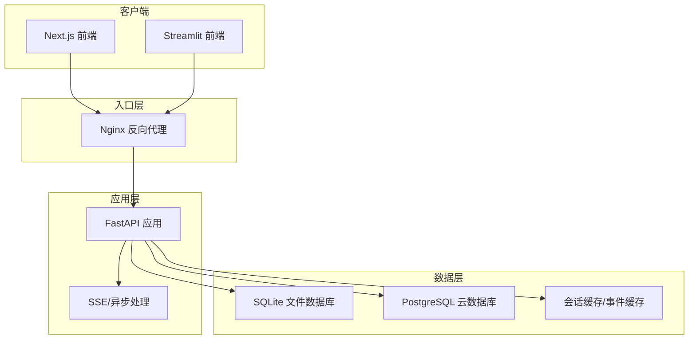
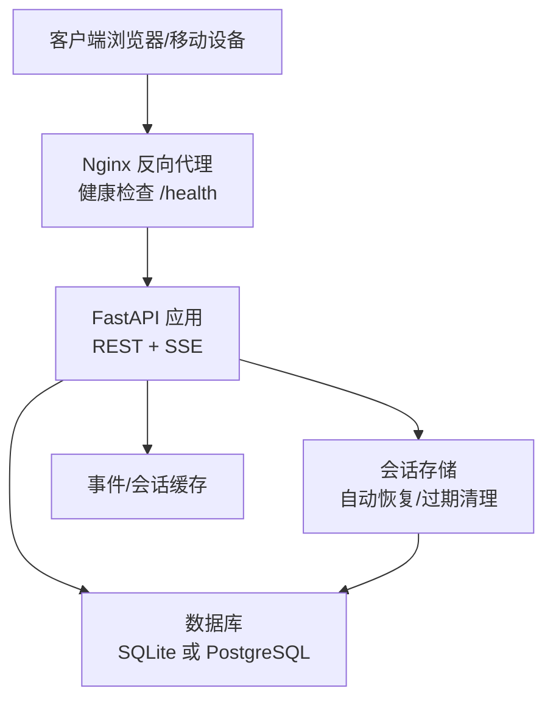
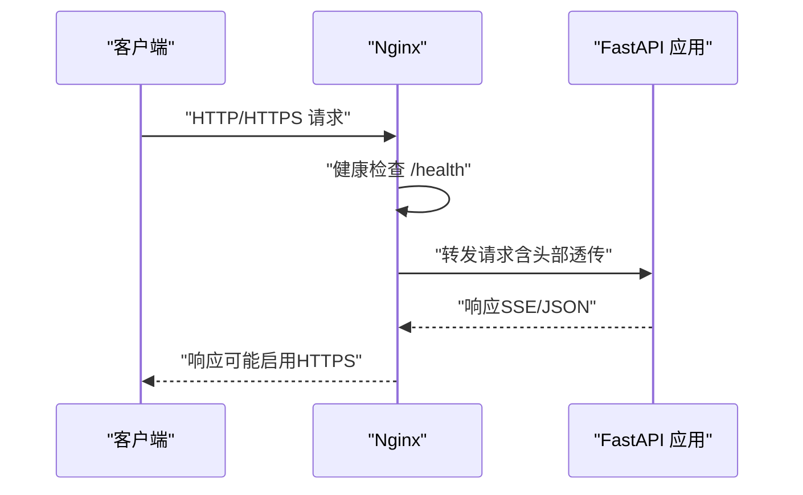
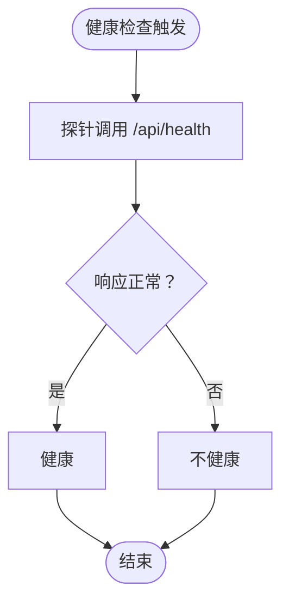
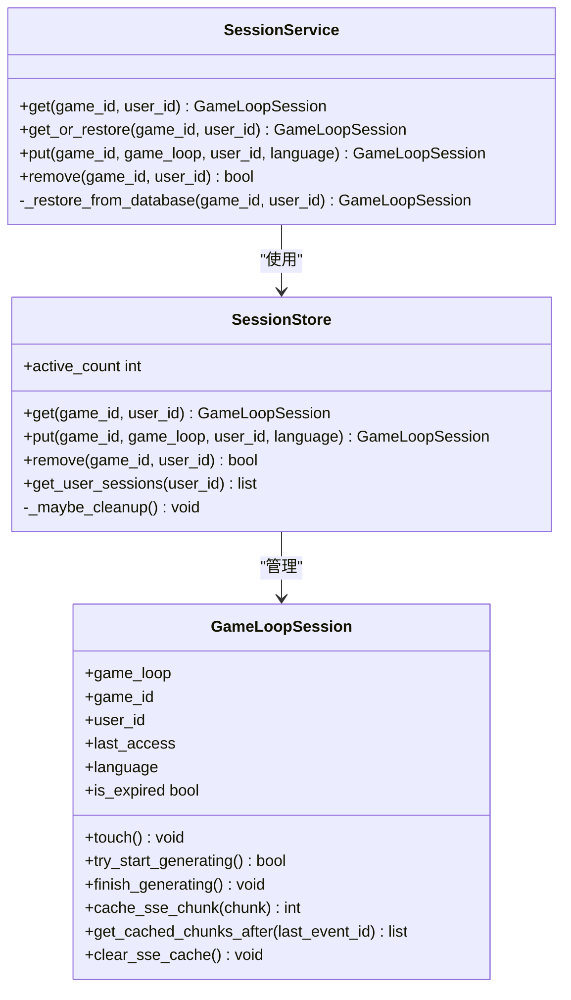
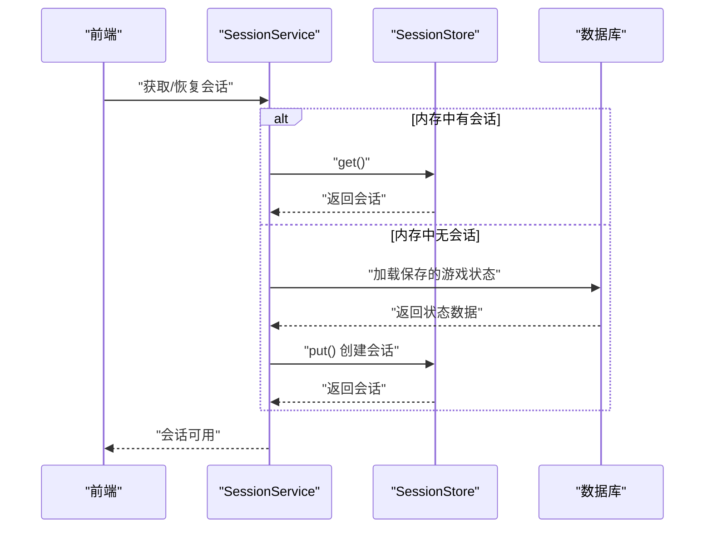
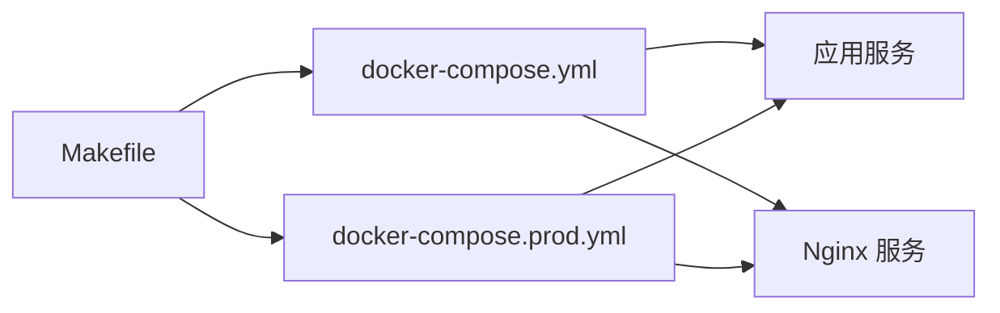
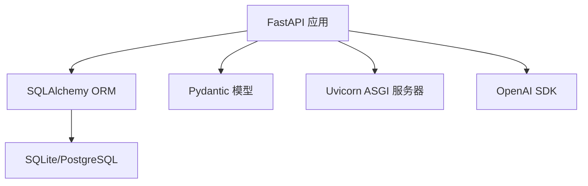

# 高可用性架构设计

<cite>
**本文引用的文件**
- [DEPLOYMENT.md](file://DEPLOYMENT.md)
- [阿里云部署指南.md](file://阿里云部署指南.md)
- [docker-compose.yml](file://docker-compose.yml)
- [docker-compose.prod.yml](file://docker-compose.prod.yml)
- [Dockerfile](file://Dockerfile)
- [Makefile](file://Makefile)
- [src/api/main.py](file://src/api/main.py)
- [src/api/services/session_service.py](file://src/api/services/session_service.py)
- [src/api/session_store.py](file://src/api/session_store.py)
- [src/api/routers/gameplay/__init__.py](file://src/api/routers/gameplay/__init__.py)
- [config/settings.py](file://config/settings.py)
- [requirements.txt](file://requirements.txt)
- [docs/session-recovery-test-plan.md](file://docs/session-recovery-test-plan.md)
</cite>

## 目录
1. [简介](#简介)
2. [项目结构](#项目结构)
3. [核心组件](#核心组件)
4. [架构总览](#架构总览)
5. [详细组件分析](#详细组件分析)
6. [依赖关系分析](#依赖关系分析)
7. [性能考量](#性能考量)
8. [故障排查指南](#故障排查指南)
9. [结论](#结论)
10. [附录](#附录)

## 简介
本技术文档面向“高可用性架构设计”的目标，结合当前代码库的实际实现，系统性地阐述负载均衡与反向代理、健康检查与会话保持策略、故障转移与自动恢复、容器编排与集群管理、微服务拆分与API网关、以及灾难恢复与业务连续性保障。文档同时提供可落地的部署配置文件与故障演练方案，帮助读者在不同规模与复杂度的环境中稳定运行该应用。

## 项目结构
该项目采用前后端分离与容器化部署的组织方式，后端基于FastAPI提供REST与SSE能力，前端通过Next.js或Streamlit提供交互界面；数据库可选SQLite或PostgreSQL；通过Docker Compose进行本地与生产环境编排，并可选Nginx作为反向代理与入口网关。

图表来源
- [docker-compose.yml](file://docker-compose.yml#L1-L65)
- [docker-compose.prod.yml](file://docker-compose.prod.yml#L1-L43)
- [Dockerfile](file://Dockerfile#L1-L40)
- [src/api/main.py](file://src/api/main.py#L1-L134)
- [config/settings.py](file://config/settings.py#L107-L141)

章节来源
- [docker-compose.yml](file://docker-compose.yml#L1-L65)
- [docker-compose.prod.yml](file://docker-compose.prod.yml#L1-L43)
- [Dockerfile](file://Dockerfile#L1-L40)
- [src/api/main.py](file://src/api/main.py#L1-L134)
- [config/settings.py](file://config/settings.py#L107-L141)

## 核心组件
- 应用入口与路由：FastAPI应用负责CORS、全局异常处理、健康检查端点、以及各模块路由注册。
- 会话管理：内存会话存储与自动恢复逻辑，支持SSE断线重连与事件缓存。
- 数据库配置：支持SQLite与PostgreSQL两种模式，通过环境变量动态切换。
- 反向代理与入口：Nginx作为统一入口，提供健康检查端点与HTTPS支持。
- 容器编排：Docker Compose定义应用与Nginx服务，支持开发与生产环境差异化配置。
- 部署与运维：Makefile提供常用命令，DEPLOYMENT与阿里云指南提供部署步骤与最佳实践。

章节来源
- [src/api/main.py](file://src/api/main.py#L35-L134)
- [src/api/session_store.py](file://src/api/session_store.py#L1-L200)
- [src/api/services/session_service.py](file://src/api/services/session_service.py#L1-L158)
- [config/settings.py](file://config/settings.py#L107-L141)
- [docker-compose.yml](file://docker-compose.yml#L1-L65)
- [docker-compose.prod.yml](file://docker-compose.prod.yml#L1-L43)
- [Dockerfile](file://Dockerfile#L1-L40)
- [Makefile](file://Makefile#L1-L93)

## 架构总览
下图展示了生产环境下的高可用架构：Nginx作为反向代理与入口网关，提供健康检查与HTTPS终止；应用层由FastAPI提供REST与SSE能力；数据层可选SQLite或PostgreSQL；会话存储在内存中并具备自动恢复能力。

图表来源
- [docker-compose.prod.yml](file://docker-compose.prod.yml#L25-L43)
- [src/api/main.py](file://src/api/main.py#L92-L99)
- [src/api/session_store.py](file://src/api/session_store.py#L100-L200)
- [config/settings.py](file://config/settings.py#L107-L141)

## 详细组件分析

### 负载均衡与反向代理（Nginx）
- 入口网关：Nginx监听80/443端口，将请求转发至后端应用服务。
- 健康检查：提供/health端点返回健康状态，便于外部探针检测。
- HTTPS支持：支持Let’s Encrypt自动证书或手动证书挂载。
- 会话保持：当前配置未启用sticky session，适用于无状态后端；若需启用，可在上游配置中加入ip_hash或基于Cookie的会话保持策略。

图表来源
- [docker-compose.prod.yml](file://docker-compose.prod.yml#L25-L43)
- [阿里云部署指南.md](file://阿里云部署指南.md#L336-L414)

章节来源
- [docker-compose.prod.yml](file://docker-compose.prod.yml#L25-L43)
- [阿里云部署指南.md](file://阿里云部署指南.md#L336-L414)

### 健康检查与可观测性
- 应用健康端点：/api/health返回活动会话数量，便于探针检测。
- 容器健康检查：应用容器与Nginx容器均配置健康检查指令，支持自动重启。
- 日志管理：生产环境配置JSON日志驱动与轮转大小，便于集中采集与分析。

图表来源
- [src/api/main.py](file://src/api/main.py#L92-L99)
- [docker-compose.yml](file://docker-compose.yml#L28-L33)
- [docker-compose.prod.yml](file://docker-compose.prod.yml#L18-L24)

章节来源
- [src/api/main.py](file://src/api/main.py#L92-L99)
- [docker-compose.yml](file://docker-compose.yml#L28-L33)
- [docker-compose.prod.yml](file://docker-compose.prod.yml#L18-L24)

### 会话保持与自动恢复
- 会话存储：基于内存的会话存储，支持超时清理与并发安全。
- 自动恢复：当会话过期或后端重启时，自动从数据库恢复会话与当前事件。
- SSE断线重连：缓存SSE事件片段，支持客户端断线后重连续播。

图表来源
- [src/api/session_store.py](file://src/api/session_store.py#L100-L200)
- [src/api/services/session_service.py](file://src/api/services/session_service.py#L24-L158)

章节来源
- [src/api/session_store.py](file://src/api/session_store.py#L1-L200)
- [src/api/services/session_service.py](file://src/api/services/session_service.py#L1-L158)
- [docs/session-recovery-test-plan.md](file://docs/session-recovery-test-plan.md#L1-L158)

### 故障转移与自动恢复
- 后端重启：会话自动从数据库恢复，保证用户无感继续游戏。
- 事件生成：在SSE生成过程中发生会话过期，自动恢复并重新生成事件。
- 选择阶段：若会话过期，尝试从数据库恢复current_event，失败则提示错误。

图表来源
- [src/api/services/session_service.py](file://src/api/services/session_service.py#L49-L122)
- [src/api/session_store.py](file://src/api/session_store.py#L123-L157)

章节来源
- [src/api/services/session_service.py](file://src/api/services/session_service.py#L1-L158)
- [src/api/session_store.py](file://src/api/session_store.py#L1-L200)
- [docs/session-recovery-test-plan.md](file://docs/session-recovery-test-plan.md#L1-L158)

### 容器编排与集群管理
- Docker Compose：定义应用与Nginx服务，支持开发与生产环境差异化配置。
- 资源限制：可配置CPU与内存上限，避免资源争抢。
- 健康检查：容器级别健康检查，支持自动重启。
- 多平台部署：支持本地Docker、云厂商平台与Railway/Render/Fly.io等平台直接部署。

图表来源
- [docker-compose.yml](file://docker-compose.yml#L1-L65)
- [docker-compose.prod.yml](file://docker-compose.prod.yml#L1-L43)
- [Makefile](file://Makefile#L48-L93)

章节来源
- [docker-compose.yml](file://docker-compose.yml#L1-L65)
- [docker-compose.prod.yml](file://docker-compose.prod.yml#L1-L43)
- [Makefile](file://Makefile#L48-L93)
- [DEPLOYMENT.md](file://DEPLOYMENT.md#L144-L157)

### 微服务拆分与API网关
- 当前架构：后端为单一FastAPI应用，未拆分为独立微服务。
- 建议演进：可将“游戏循环”、“事件生成”、“图像生成”、“用户管理”等功能模块化为独立服务，通过API网关统一接入与鉴权。
- API网关：可采用Nginx或专用网关（如Kong、Envoy）实现路由、限流、鉴权与监控。

章节来源
- [src/api/main.py](file://src/api/main.py#L80-L89)
- [src/api/routers/gameplay/__init__.py](file://src/api/routers/gameplay/__init__.py#L1-L25)

### 灾难恢复与业务连续性
- 数据备份：支持SQLite文件备份与PostgreSQL逻辑备份。
- 证书续期：Let’s Encrypt证书自动续期与Nginx重启联动。
- 备份恢复：提供数据目录与数据库的备份与恢复流程。
- DNS与域名：支持域名解析与ICP备案流程，保障中国大陆地区访问合规。

章节来源
- [DEPLOYMENT.md](file://DEPLOYMENT.md#L226-L308)
- [阿里云部署指南.md](file://阿里云部署指南.md#L656-L677)

## 依赖关系分析
- 应用依赖：FastAPI、SQLAlchemy、Pydantic、Uvicorn、OpenAI等。
- 数据库驱动：支持SQLite与PostgreSQL，运行时通过环境变量切换。
- 健康检查与日志：应用与容器均配置健康检查与日志轮转。

图表来源
- [requirements.txt](file://requirements.txt#L1-L12)
- [config/settings.py](file://config/settings.py#L107-L141)

章节来源
- [requirements.txt](file://requirements.txt#L1-L12)
- [config/settings.py](file://config/settings.py#L107-L141)

## 性能考量
- 数据库：生产环境建议使用PostgreSQL替代SQLite，提升并发与可靠性。
- 缓存：启用事件缓存与会话缓存，减少重复计算与I/O。
- CDN：静态资源可通过CDN加速，降低边缘延迟。
- 资源限制：合理设置容器CPU与内存上限，避免资源争抢。
- SSE：针对长连接场景，适当增大读取超时与缓冲区大小。

## 故障排查指南
- 健康检查失败：检查Nginx与应用容器健康检查配置，查看容器日志。
- 会话过期：确认SessionStore超时时间与自动恢复逻辑，检查数据库状态。
- 事件生成异常：关注SSE断线重连与事件缓存，必要时重新生成事件。
- HTTPS证书：确保证书路径正确与续期计划有效，检查Nginx配置。
- 备份与恢复：按备份策略执行数据与数据库备份，验证恢复流程。

章节来源
- [src/api/main.py](file://src/api/main.py#L92-L99)
- [src/api/session_store.py](file://src/api/session_store.py#L40-L98)
- [docs/session-recovery-test-plan.md](file://docs/session-recovery-test-plan.md#L1-L158)
- [阿里云部署指南.md](file://阿里云部署指南.md#L637-L654)

## 结论
本项目已具备高可用架构的基础能力：反向代理、健康检查、会话管理与自动恢复、容器化编排与多平台部署。建议在生产环境中进一步完善微服务拆分、API网关、监控告警与自动化运维体系，以满足更高可用性与可扩展性的需求。

## 附录
- 部署命令与流程参考：Makefile与DEPLOYMENT文档。
- 生产环境配置：docker-compose.prod.yml与Nginx配置模板。
- 会话恢复测试方案：session-recovery-test-plan.md。

章节来源
- [Makefile](file://Makefile#L74-L93)
- [DEPLOYMENT.md](file://DEPLOYMENT.md#L171-L234)
- [阿里云部署指南.md](file://阿里云部署指南.md#L423-L439)
- [docs/session-recovery-test-plan.md](file://docs/session-recovery-test-plan.md#L54-L158)