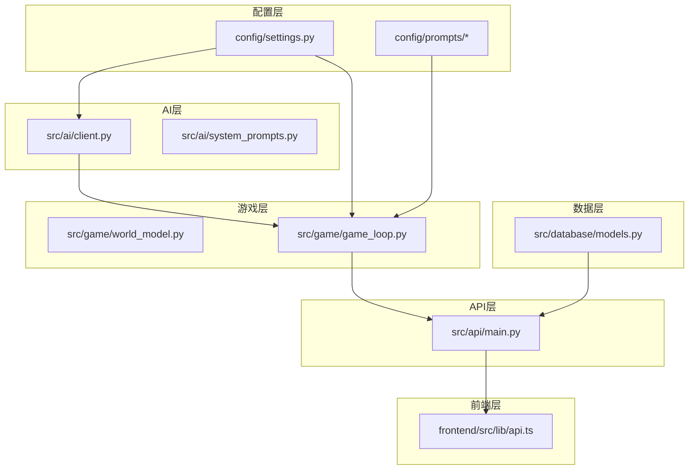
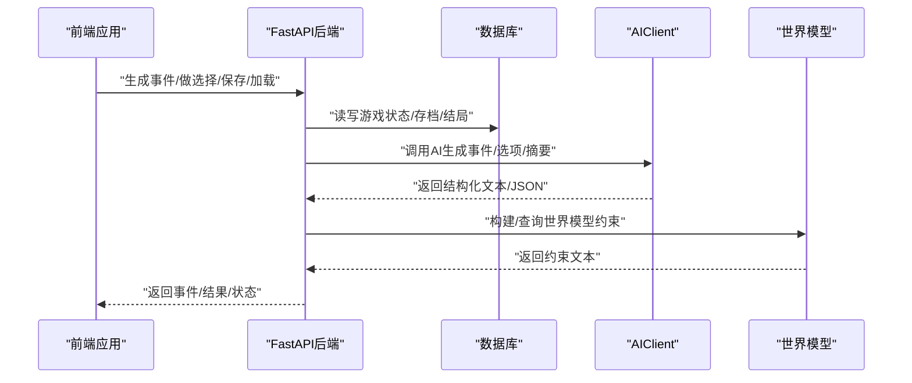
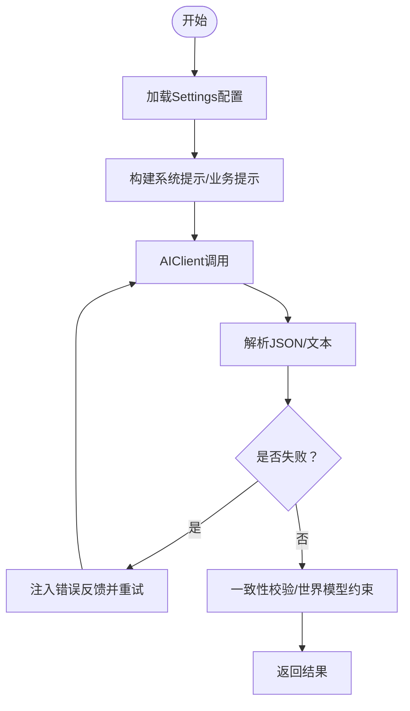
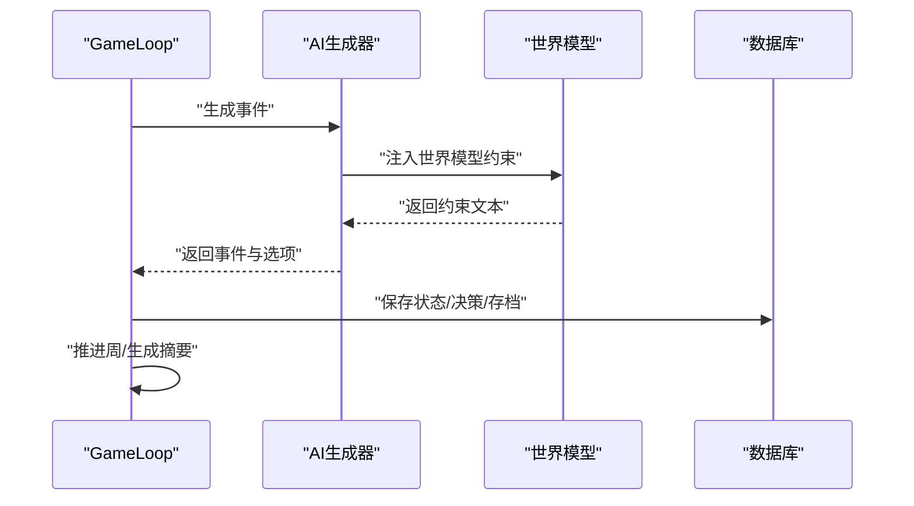
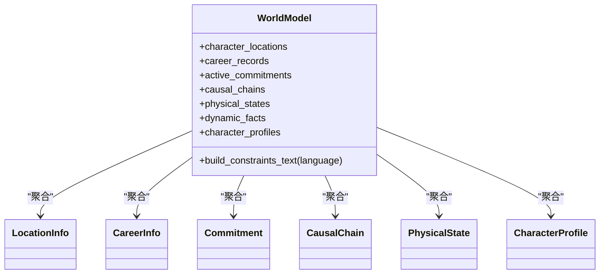
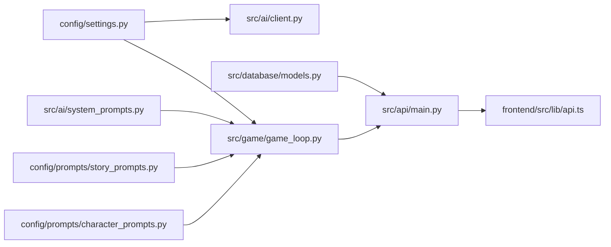

# 扩展与定制

<cite>
**本文引用的文件**
- [README.md](file://README.md)
- [settings.py](file://config/settings.py)
- [system_prompts.py](file://src/ai/system_prompts.py)
- [client.py](file://src/ai/client.py)
- [models.py](file://src/database/models.py)
- [world_model.py](file://src/game/world_model.py)
- [game_loop.py](file://src/game/game_loop.py)
- [story_prompts.py](file://config/prompts/story_prompts.py)
- [character_prompts.py](file://config/prompts/character_prompts.py)
- [api.ts](file://frontend/src/lib/api.ts)
- [main.py](file://src/api/main.py)
</cite>

## 目录
1. [简介](#简介)
2. [项目结构](#项目结构)
3. [核心组件](#核心组件)
4. [架构总览](#架构总览)
5. [详细组件分析](#详细组件分析)
6. [依赖分析](#依赖分析)
7. [性能考量](#性能考量)
8. [故障排查指南](#故障排查指南)
9. [结论](#结论)
10. [附录](#附录)

## 简介
本指南面向希望对“人生草稿本”进行扩展与定制的开发者与运营人员。文档围绕以下目标展开：
- 插件系统设计：AI服务扩展、图像服务扩展、数据库扩展的实现路径
- 自定义AI模型集成：提示模板定制、模型参数调整、响应处理优化
- 新增游戏功能：事件类型、资源系统、结局类型扩展方法
- 第三方服务集成：新的AI模型、图像API、存储服务接入
- 配置文件定制：提示模板修改、游戏规则调整、界面定制
- 世界模型扩展：场景、NPC、事件系统的扩展
- 性能扩展与高可用：并发、缓存、超时与降级策略
- 最佳实践与向后兼容：版本管理、迁移策略与兼容性保障

## 项目结构
项目采用分层架构：
- 配置层：集中化配置与提示模板
- AI层：统一的AI调用抽象、系统提示注册、事件与故事生成
- 数据层：数据库模型与会话管理
- 游戏层：游戏循环、状态管理、世界模型与事件生成
- API层：FastAPI后端路由与中间件
- 前端层：Next.js应用与API封装

图表来源
- [settings.py](file://config/settings.py#L1-L168)
- [system_prompts.py](file://src/ai/system_prompts.py#L1-L279)
- [client.py](file://src/ai/client.py#L1-L233)
- [models.py](file://src/database/models.py#L1-L295)
- [world_model.py](file://src/game/world_model.py#L1-L697)
- [game_loop.py](file://src/game/game_loop.py#L1-L592)
- [main.py](file://src/api/main.py#L1-L134)
- [api.ts](file://frontend/src/lib/api.ts#L1-L564)

章节来源
- [README.md](file://README.md#L74-L87)

## 核心组件
- 配置与设置：集中化环境变量与默认值，支持多模型与图像服务配置、数据库连接、语言与缓存开关
- AI调用抽象：统一的AIClient，封装OpenAI客户端、错误反馈注入与重试机制
- 系统提示注册：集中化提示模板，KV缓存稳定性与一致性
- 数据库模型：用户、好友、游戏、状态、决策、结局、图片与场景图片模型
- 世界模型：结构化约束（地理、职业、承诺、因果链、身体状态、动态事实、行为画像）
- 游戏循环：事件生成、决策处理、周推进、摘要生成、里程碑与回退事件
- API与前端：FastAPI路由、CORS与异常处理、前端API封装与双认证

章节来源
- [settings.py](file://config/settings.py#L27-L168)
- [client.py](file://src/ai/client.py#L22-L233)
- [system_prompts.py](file://src/ai/system_prompts.py#L1-L279)
- [models.py](file://src/database/models.py#L1-L295)
- [world_model.py](file://src/game/world_model.py#L196-L697)
- [game_loop.py](file://src/game/game_loop.py#L25-L592)
- [main.py](file://src/api/main.py#L1-L134)
- [api.ts](file://frontend/src/lib/api.ts#L1-L564)

## 架构总览
后端通过FastAPI提供REST接口，前端通过封装的API模块调用。AI服务通过统一客户端调用，数据库模型支持本地SQLite与云数据库切换。世界模型在事件生成与一致性校验中注入约束。

图表来源
- [api.ts](file://frontend/src/lib/api.ts#L69-L124)
- [main.py](file://src/api/main.py#L79-L90)
- [models.py](file://src/database/models.py#L237-L262)
- [client.py](file://src/ai/client.py#L51-L124)
- [world_model.py](file://src/game/world_model.py#L392-L448)

## 详细组件分析

### 插件系统设计与扩展点
- AI服务扩展
  - 统一入口：AIClient提供统一的调用接口，支持模型覆盖、温度、最大令牌数与流式回调
  - 错误反馈注入与重试：call_with_retry在失败时注入上次错误，提升输出质量与稳定性
  - 系统提示注册：system_prompts集中管理提示模板，便于KV缓存与一致性
  - 扩展建议：新增AI模型时，优先通过Settings配置项与AIClient参数注入，避免硬编码

- 图像服务扩展
  - 配置项：图像API密钥、基础URL、模型、存储类型与OSS配置
  - 服务边界：图像生成与场景插画生成在API层暴露，前端通过API模块调用
  - 扩展建议：新增图像模型时，通过Settings.TEXT_TO_IMAGE_MODELS与IMAGE_EDIT_MODELS配置，结合降级策略

- 数据库扩展
  - 连接策略：优先DATABASE_URL（云数据库），否则回退SQLite
  - 模型设计：支持用户、好友、游戏、状态、决策、结局、图片与场景图片，具备索引与外键约束
  - 扩展建议：新增表时遵循现有索引与外键模式，使用with_db_session装饰器简化事务

章节来源
- [client.py](file://src/ai/client.py#L22-L233)
- [system_prompts.py](file://src/ai/system_prompts.py#L242-L279)
- [settings.py](file://config/settings.py#L30-L141)
- [models.py](file://src/database/models.py#L237-L295)

### 自定义AI模型集成
- 提示模板定制
  - 系统提示：通过system_prompts注册中心集中管理，按语言返回对应模板
  - 事件生成提示：story_prompts提供事件生成、结果续写、选项生成与纯故事生成的模板
  - 角色创建提示：character_prompts提供角色设定、关系人物、初始属性与开场故事的模板
  - 扩展建议：新增模板时，遵循现有键值规范，确保语言分支完备

- 模型参数调整
  - Settings中提供OPENAI_MODEL、IMAGE_MODEL、SCENE_ANALYZER_MODEL等配置项
  - AIClient支持model参数覆盖与温度、最大令牌数调参
  - 扩展建议：通过环境变量或Settings.validate()校验，确保参数合法

- 响应处理优化
  - JSON解析：AIClient.call_json统一抽取JSON，降低解析错误
  - 错误反馈注入：call_with_retry在重试时注入错误信息，提升模型自我修正能力
  - 扩展建议：针对特定业务场景增加响应后处理钩子（如格式规范化、字段映射）

图表来源
- [settings.py](file://config/settings.py#L27-L168)
- [system_prompts.py](file://src/ai/system_prompts.py#L264-L279)
- [client.py](file://src/ai/client.py#L159-L233)
- [story_prompts.py](file://config/prompts/story_prompts.py#L21-L58)
- [world_model.py](file://src/game/world_model.py#L392-L448)

章节来源
- [system_prompts.py](file://src/ai/system_prompts.py#L1-L279)
- [story_prompts.py](file://config/prompts/story_prompts.py#L21-L823)
- [character_prompts.py](file://config/prompts/character_prompts.py#L1-L823)
- [client.py](file://src/ai/client.py#L51-L156)

### 新增游戏功能：事件、资源与结局
- 事件类型扩展
  - 事件生成：GameLoop.generate_weekly_event调用AI生成事件，支持里程碑事件与回退事件
  - 选项生成：通过选项生成提示模板与系统提示约束，确保选项与故事上下文一致
  - 回退机制：_generate_fallback_event提供稳定回退，保障用户体验

- 资源系统扩展
  - 资源定义：Settings中定义初始值、上下界与衰减
  - 应用：GameLoop.apply_weekly_decay按条件衰减资源
  - 扩展建议：新增资源类型时，同步更新提示模板与一致性校验

- 结局类型扩展
  - 结局记录：数据库模型包含Ending表，支持结局类型、摘要与成就
  - 生成流程：YearlySummaryGenerator与NarrativeManager参与结局生成
  - 扩展建议：新增结局类型时，维护结局类型枚举与生成逻辑

图表来源
- [game_loop.py](file://src/game/game_loop.py#L161-L265)
- [world_model.py](file://src/game/world_model.py#L392-L448)
- [models.py](file://src/database/models.py#L129-L143)

章节来源
- [game_loop.py](file://src/game/game_loop.py#L161-L592)
- [models.py](file://src/database/models.py#L129-L143)

### 第三方服务集成
- 新的AI模型
  - 通过Settings配置OPENAI_BASE_URL与OPENAI_MODEL，或独立配置SCENE_ANALYZER_*项
  - AIClient自动适配基础URL与模型，支持多模型切换与降级

- 图像API
  - 通过IMAGE_API_*与IMAGE_MODEL配置图像生成服务
  - 支持本地存储与OSS存储，通过IMAGE_STORAGE_TYPE切换
  - 前端通过images模块调用生成/重新生成/批量生成等接口

- 存储服务
  - 本地：IMAGE_LOCAL_PATH
  - 云端：OSS_ACCESS_KEY_ID/SECRET/ENDPOINT/BUCKET_NAME
  - 扩展建议：新增存储后端时，实现统一接口并更新Settings与存储服务

章节来源
- [settings.py](file://config/settings.py#L30-L168)
- [api.ts](file://frontend/src/lib/api.ts#L401-L547)

### 配置文件定制指南
- 提示模板修改
  - 系统提示：system_prompts注册中心，按key与语言返回模板
  - 业务提示：story_prompts与character_prompts提供事件、选项、角色创建等模板
  - 修改建议：遵循现有键值与语言分支，避免破坏一致性

- 游戏规则调整
  - 资源上下限：INITIAL_*、MIN_RESOURCE、MAX_RESOURCE、MAX_WEALTH
  - 周期与衰减：WEEKS_PER_YEAR、TOTAL_WEEKS、ENERGY_DECAY、MOOD_DECAY
  - 生成超时：GENERATION_TIMEOUT
  - 扩展建议：调整规则时同步更新提示模板与一致性校验

- 界面定制
  - 前端通过api.ts封装调用，支持Cookie与Header双重认证
  - CORS配置支持多Origin，便于局域网访问
  - 扩展建议：新增接口时在前端api.ts中补充方法与类型声明

章节来源
- [settings.py](file://config/settings.py#L70-L168)
- [system_prompts.py](file://src/ai/system_prompts.py#L242-L279)
- [story_prompts.py](file://config/prompts/story_prompts.py#L21-L823)
- [character_prompts.py](file://config/prompts/character_prompts.py#L1-L823)
- [api.ts](file://frontend/src/lib/api.ts#L48-L67)

### 世界模型扩展
- 数据结构
  - LocationInfo、CareerInfo、Commitment、CausalChain、PhysicalState、CharacterProfile
  - CAREER_LEVELS与等级跳跃限制、最小晋升周数

- 约束生成
  - build_constraints_text将地理、职业、承诺、因果链、身体状态、动态事实与行为画像整合为约束文本
  - _build_*_constraints系列方法负责各维度约束的格式化

- 扩展建议
  - 新增维度时，定义数据结构并在build_constraints_text中纳入
  - 通过DynamicFact与CharacterProfile实现AI驱动的动态约束

图表来源
- [world_model.py](file://src/game/world_model.py#L196-L697)

章节来源
- [world_model.py](file://src/game/world_model.py#L196-L697)

## 依赖分析
- 配置层依赖AI层与游戏层：Settings为AIClient与GameLoop提供参数
- AI层依赖配置层：AIClient读取OPENAI_*与IMAGE_*配置
- 数据层为API层提供ORM模型与会话管理
- 游戏层依赖AI层与数据库层：事件生成与状态持久化
- API层为前端提供统一接口，前端依赖API封装

图表来源
- [settings.py](file://config/settings.py#L27-L168)
- [client.py](file://src/ai/client.py#L22-L48)
- [system_prompts.py](file://src/ai/system_prompts.py#L1-L279)
- [story_prompts.py](file://config/prompts/story_prompts.py#L21-L823)
- [character_prompts.py](file://config/prompts/character_prompts.py#L1-L823)
- [models.py](file://src/database/models.py#L237-L295)
- [game_loop.py](file://src/game/game_loop.py#L25-L68)
- [main.py](file://src/api/main.py#L79-L90)
- [api.ts](file://frontend/src/lib/api.ts#L69-L124)

章节来源
- [settings.py](file://config/settings.py#L27-L168)
- [client.py](file://src/ai/client.py#L22-L48)
- [models.py](file://src/database/models.py#L237-L295)
- [game_loop.py](file://src/game/game_loop.py#L25-L68)
- [main.py](file://src/api/main.py#L79-L90)
- [api.ts](file://frontend/src/lib/api.ts#L69-L124)

## 性能考量
- 并发与超时
  - 生成超时：GENERATION_TIMEOUT防止长时间占用
  - 图像生成超时与重试：IMAGE_GENERATION_TIMEOUT与IMAGE_MAX_RETRIES
  - 建议：为长耗时操作引入异步队列与进度回调

- 缓存与一致性
  - 系统提示KV缓存：system_prompts集中注册，提升提示命中率
  - 事件缓存：CACHE_EVENTS控制事件缓存开关
  - 建议：为热点提示与生成结果增加缓存层

- 数据库性能
  - 索引：Image与SceneImage表建立复合索引，加速查询
  - 连接池：云数据库启用pool_pre_ping
  - 建议：对高频查询建立复合索引，定期清理历史存档

- 前端性能
  - SSE回退：移动端提供非流式接口
  - 认证优化：Cookie优先，减少Header开销
  - 建议：对图片与场景图增加懒加载与CDN

章节来源
- [settings.py](file://config/settings.py#L56-L111)
- [models.py](file://src/database/models.py#L197-L234)
- [api.ts](file://frontend/src/lib/api.ts#L354-L377)

## 故障排查指南
- AI调用失败
  - 现象：call_with_retry最终抛出异常
  - 处理：检查OPENAI_API_KEY与BASE_URL，查看日志与错误反馈注入
  - 建议：增加熔断与降级策略，回退到本地模板

- 数据库连接失败
  - 现象：init_db报错或连接异常
  - 处理：检查DATABASE_URL或SQLite路径，确认权限与网络
  - 建议：使用连接池与健康检查

- CORS与认证问题
  - 现象：跨域失败或Cookie认证无效
  - 处理：核对CORS_ORIGINS与credentials配置，确认Cookie可用性
  - 建议：在生产环境固定允许的Origin列表

- 生成超时与卡顿
  - 现象：事件生成长时间无响应
  - 处理：调整GENERATION_TIMEOUT，检查网络与模型响应
  - 建议：引入异步生成与进度上报

章节来源
- [client.py](file://src/ai/client.py#L159-L233)
- [models.py](file://src/database/models.py#L250-L262)
- [main.py](file://src/api/main.py#L46-L66)
- [api.ts](file://frontend/src/lib/api.ts#L48-L67)

## 结论
通过集中化配置、统一AI抽象、结构化世界模型与完善的数据库设计，“人生草稿本”提供了清晰的扩展路径。开发者可在不破坏向后兼容的前提下，灵活接入新AI模型、图像服务与存储后端，同时通过提示模板与规则配置实现玩法定制与性能优化。

## 附录
- 环境变量与默认值：OPENAI_*、IMAGE_*、SCENE_ANALYZER_*、DATABASE_URL、DEFAULT_LANGUAGE、CACHE_EVENTS
- 数据库连接策略：云数据库优先，本地SQLite回退
- CORS与认证：支持Cookie与Header双重认证，固定允许的Origin列表
- 前端API封装：统一的请求封装与错误处理，支持SSE与回退接口

章节来源
- [settings.py](file://config/settings.py#L30-L168)
- [main.py](file://src/api/main.py#L46-L66)
- [api.ts](file://frontend/src/lib/api.ts#L1-L564)