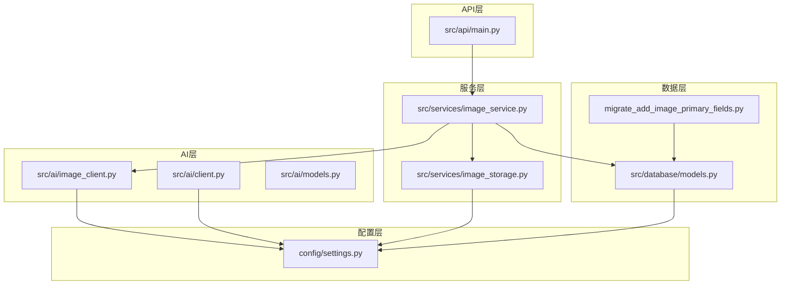
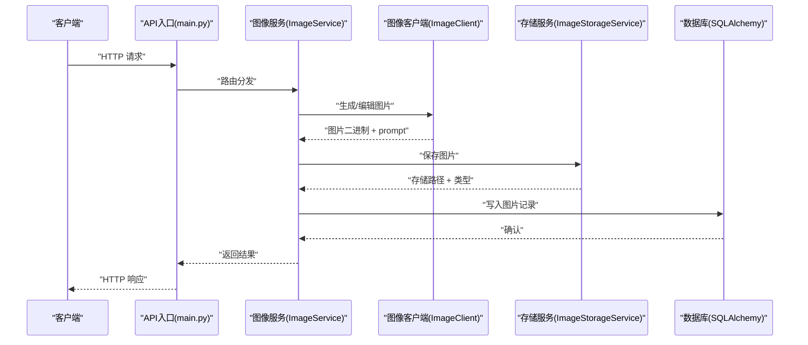
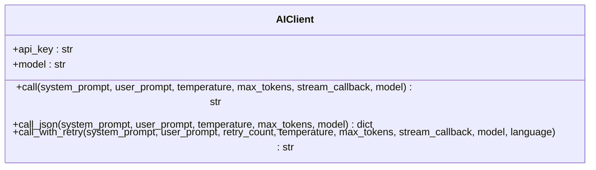
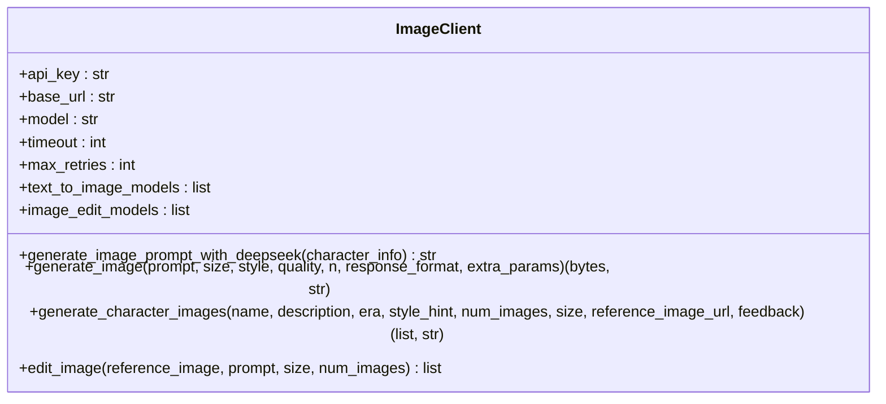
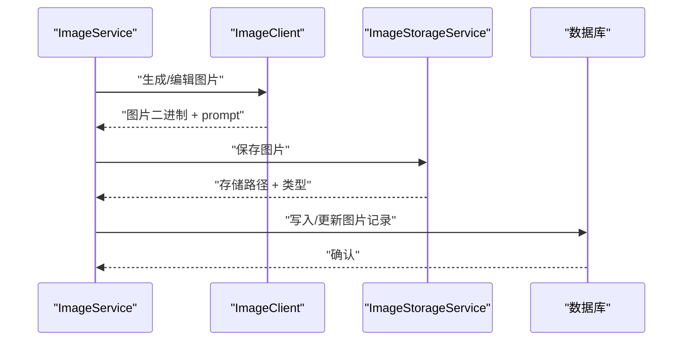
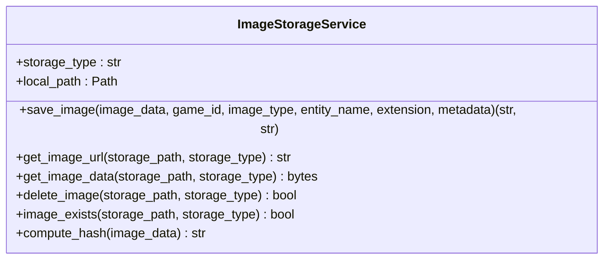
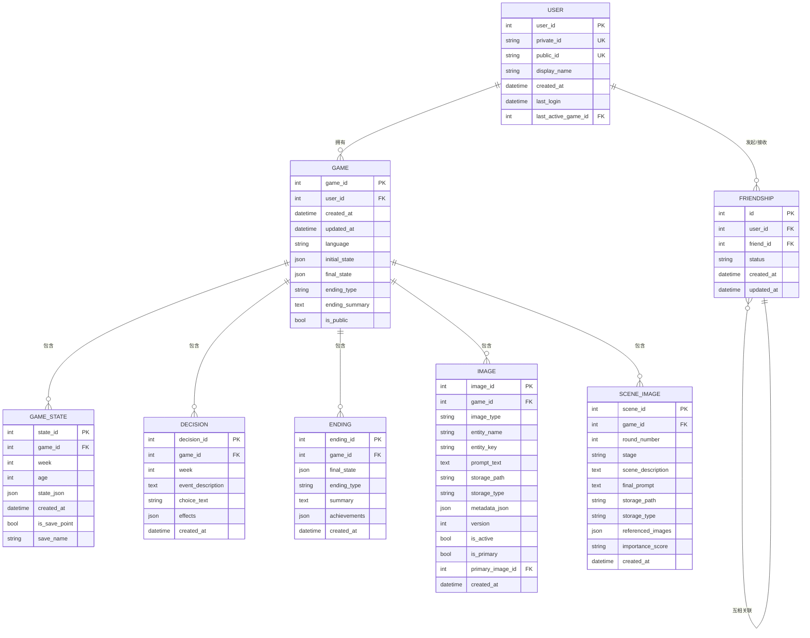
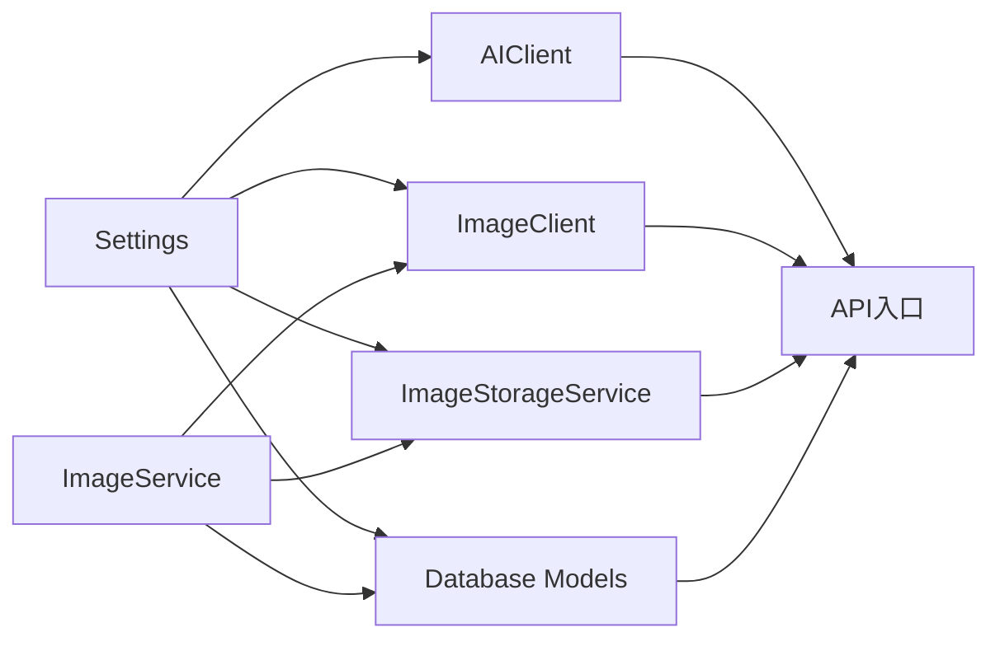

# 插件系统设计

<cite>
**本文引用的文件**
- [src/ai/client.py](file://src/ai/client.py)
- [src/ai/image_client.py](file://src/ai/image_client.py)
- [src/ai/models.py](file://src/ai/models.py)
- [src/database/models.py](file://src/database/models.py)
- [src/services/image_service.py](file://src/services/image_service.py)
- [src/services/image_storage.py](file://src/services/image_storage.py)
- [config/settings.py](file://config/settings.py)
- [src/api/main.py](file://src/api/main.py)
- [migrate_add_image_primary_fields.py](file://migrate_add_image_primary_fields.py)
</cite>

## 目录
1. [简介](#简介)
2. [项目结构](#项目结构)
3. [核心组件](#核心组件)
4. [架构总览](#架构总览)
5. [详细组件分析](#详细组件分析)
6. [依赖分析](#依赖分析)
7. [性能考量](#性能考量)
8. [故障排查指南](#故障排查指南)
9. [结论](#结论)
10. [附录](#附录)

## 简介
本文件面向“插件系统设计”，聚焦于三类扩展能力：
- AI服务扩展：新增AI模型支持、模型参数配置与API适配器实现
- 图像服务扩展：新增图像生成API集成、存储后端适配与性能优化策略
- 数据库扩展：新增数据模型定义、迁移脚本编写与查询优化

同时，文档阐述插件注册机制、生命周期管理、错误处理、插件间依赖管理、版本兼容性与安全考虑，并提供完整的插件开发示例与最佳实践。

## 项目结构
项目采用分层与按功能域组织的结构：
- 配置层：集中化配置管理，统一读取环境变量与常量
- API层：FastAPI应用入口，路由注册与生命周期管理
- 服务层：图像生成调度与存储抽象
- 数据层：数据库模型与迁移脚本
- AI层：统一AI调用抽象、图像生成客户端与数据模型

图表来源
- [src/api/main.py](file://src/api/main.py#L24-L40)
- [src/services/image_service.py](file://src/services/image_service.py#L30-L50)
- [src/ai/image_client.py](file://src/ai/image_client.py#L30-L66)
- [src/ai/client.py](file://src/ai/client.py#L22-L48)
- [src/database/models.py](file://src/database/models.py#L237-L262)
- [migrate_add_image_primary_fields.py](file://migrate_add_image_primary_fields.py#L16-L54)

章节来源
- [src/api/main.py](file://src/api/main.py#L24-L40)
- [config/settings.py](file://config/settings.py#L27-L167)

## 核心组件
- 统一AI调用抽象（AIClient）：封装OpenAI兼容接口，提供统一调用、JSON解析、重试与错误反馈注入
- 图像生成客户端（ImageClient）：支持文生图/图生图，具备模型降级、速率限制处理与内容审核错误分类
- 图像服务（ImageService）：编排图像生成、存储与数据库记录，提供人物/地点/物品/场景/开场插画等生成与重生成能力
- 存储服务（ImageStorageService）：抽象本地与OSS存储，统一路径生成、URL生成与数据读取
- 数据库模型（SQLAlchemy）：定义用户、好友、游戏、状态、决策、结局、图片与场景图片等模型，支持索引与关系映射
- 配置中心（Settings）：集中管理API密钥、基础URL、模型降级列表、存储类型、数据库URL等

章节来源
- [src/ai/client.py](file://src/ai/client.py#L22-L233)
- [src/ai/image_client.py](file://src/ai/image_client.py#L30-L149)
- [src/services/image_service.py](file://src/services/image_service.py#L30-L800)
- [src/services/image_storage.py](file://src/services/image_storage.py#L23-L375)
- [src/database/models.py](file://src/database/models.py#L11-L295)
- [config/settings.py](file://config/settings.py#L27-L167)

## 架构总览
插件系统通过“配置中心 + 抽象客户端 + 服务编排 + 数据持久化”的方式实现扩展：
- 配置中心负责API密钥、基础URL、模型降级与存储类型等参数
- AI与图像客户端提供统一接口，屏蔽底层差异
- 服务层负责编排与错误处理，确保流程可控
- 数据层提供模型与迁移脚本，保障数据一致性与演进

图表来源
- [src/api/main.py](file://src/api/main.py#L79-L90)
- [src/services/image_service.py](file://src/services/image_service.py#L30-L182)
- [src/ai/image_client.py](file://src/ai/image_client.py#L160-L261)
- [src/services/image_storage.py](file://src/services/image_storage.py#L57-L92)
- [src/database/models.py](file://src/database/models.py#L162-L201)

## 详细组件分析

### 组件A：统一AI调用抽象（AIClient）
- 设计要点
  - 单一入口：所有AI调用经由AIClient，便于统一错误处理、重试与日志
  - JSON解析：提供call_json方法，自动抽取并解析JSON片段
  - 重试与反馈：call_with_retry在失败时注入上次错误信息，提升成功率
  - 配置来源：从配置中心读取API密钥与基础URL，支持OpenAI兼容接口
- 数据结构与复杂度
  - 调用开销主要受网络与模型响应时间影响；JSON解析为线性复杂度
- 错误处理
  - 参数校验缺失API密钥时抛出异常；流式与非流式两种调用路径
- 性能建议
  - 合理设置max_tokens与温度；对长文本输出进行截断告警

图表来源
- [src/ai/client.py](file://src/ai/client.py#L22-L233)

章节来源
- [src/ai/client.py](file://src/ai/client.py#L22-L233)
- [config/settings.py](file://config/settings.py#L30-L45)

### 组件B：图像生成客户端（ImageClient）
- 设计要点
  - OpenAI兼容接口：统一文生图/图生图调用，支持DashScope等第三方服务
  - 模型降级：TEXT_TO_IMAGE_MODELS与IMAGE_EDIT_MODELS按序尝试，提升可用性
  - 速率限制处理：检测429并进行模型切换或指数退避
  - 内容审核：区分ContentInspectionError，便于前端提示与重试
  - DeepSeek提示词增强：在不可用时提供回退策略
- 数据结构与复杂度
  - API调用为I/O密集；降级与重试为线性搜索与等待
- 错误处理
  - 非速率限制错误不进行模型降级；最终失败抛出ImageGenerationError
- 性能建议
  - 合理设置超时与最大重试次数；对负向提示词进行统一管理

图表来源
- [src/ai/image_client.py](file://src/ai/image_client.py#L30-L800)
- [config/settings.py](file://config/settings.py#L35-L69)

章节来源
- [src/ai/image_client.py](file://src/ai/image_client.py#L30-L800)
- [config/settings.py](file://config/settings.py#L35-L69)

### 组件C：图像服务（ImageService）
- 设计要点
  - 统一编排：生成人物/地点/物品/场景/开场插画，支持主图与变体管理
  - 重生成策略：支持基于反馈的局部重生成与完全重新生成
  - 审核与错误：捕获内容审核错误并上抛，避免数据库污染
  - 数据库一致性：停用旧图片、更新主图关联、提交事务
- 数据结构与复杂度
  - 查询活跃图片与批量图片为O(n)扫描；主图关联更新为O(k)写入
- 错误处理
  - 生成失败回滚；存储失败回滚；内容审核错误不回滚
- 性能建议
  - 使用索引加速活跃图片查询；批量提交减少IO

图表来源
- [src/services/image_service.py](file://src/services/image_service.py#L30-L182)
- [src/ai/image_client.py](file://src/ai/image_client.py#L413-L627)
- [src/services/image_storage.py](file://src/services/image_storage.py#L57-L92)
- [src/database/models.py](file://src/database/models.py#L162-L201)

章节来源
- [src/services/image_service.py](file://src/services/image_service.py#L30-L800)
- [src/database/models.py](file://src/database/models.py#L162-L234)

### 组件D：存储服务（ImageStorageService）
- 设计要点
  - 抽象存储：支持本地与OSS两种后端，统一路径生成与URL生成
  - OSS签名：生成带有效期的签名URL，便于前端直链访问
  - 健壮性：目录创建、文件读写、对象删除与存在性检查均进行异常捕获
- 数据结构与复杂度
  - 文件操作为O(1)；OSS签名与下载为I/O
- 错误处理
  - OSS SDK缺失时提供明确提示；初始化失败抛出ImageStorageError
- 性能建议
  - OSS使用签名URL缓存；本地路径尽量短且稳定

图表来源
- [src/services/image_storage.py](file://src/services/image_storage.py#L23-L375)

章节来源
- [src/services/image_storage.py](file://src/services/image_storage.py#L23-L375)

### 组件E：数据库模型与迁移（SQLAlchemy）
- 设计要点
  - 模型覆盖用户、好友、游戏、状态、决策、结局、图片与场景图片
  - 关系映射与索引：如图片表的实体组合索引、主图关联外键
  - 初始化与会话：统一engine、SessionLocal与with_db_session装饰器
- 数据结构与复杂度
  - 查询复杂度取决于索引与WHERE条件；批量插入/更新为O(n)
- 错误处理
  - 会话自动关闭；装饰器处理显式传入db参数
- 性能建议
  - 为高频查询字段建立索引；使用批量写入

图表来源
- [src/database/models.py](file://src/database/models.py#L11-L295)

章节来源
- [src/database/models.py](file://src/database/models.py#L11-L295)
- [migrate_add_image_primary_fields.py](file://migrate_add_image_primary_fields.py#L16-L54)

## 依赖分析
- 配置依赖：所有客户端与服务均依赖配置中心，确保密钥与URL集中管理
- 服务耦合：图像服务依赖图像客户端与存储服务，同时持久化至数据库
- 数据耦合：图片模型与场景图片模型通过外键关联游戏，支持主图/变体关系
- 外部依赖：图像客户端依赖第三方API（DashScope等），存储服务依赖OSS SDK

图表来源
- [config/settings.py](file://config/settings.py#L27-L167)
- [src/ai/client.py](file://src/ai/client.py#L16-L48)
- [src/ai/image_client.py](file://src/ai/image_client.py#L33-L66)
- [src/services/image_storage.py](file://src/services/image_storage.py#L26-L47)
- [src/database/models.py](file://src/database/models.py#L237-L262)
- [src/api/main.py](file://src/api/main.py#L79-L90)

章节来源
- [src/api/main.py](file://src/api/main.py#L79-L90)
- [src/services/image_service.py](file://src/services/image_service.py#L30-L50)
- [src/database/models.py](file://src/database/models.py#L162-L234)

## 性能考量
- 模型降级与重试：在速率限制与失败时自动切换模型或等待，提升可用性
- 缓存与索引：数据库为高频查询字段建立索引；前端可缓存图片URL
- I/O优化：OSS签名URL减少后端压力；批量提交降低事务开销
- 超时与并发：合理设置超时与最大重试次数，避免阻塞

## 故障排查指南
- AI调用失败
  - 检查API密钥与基础URL是否配置；查看重试日志与错误反馈
  - 参考：[src/ai/client.py](file://src/ai/client.py#L159-L233)
- 图像生成失败
  - 区分内容审核错误与API错误；根据错误类型决定是否重试
  - 参考：[src/ai/image_client.py](file://src/ai/image_client.py#L18-L28)
- 存储失败
  - 本地目录权限与OSS凭证；检查SDK安装与签名URL生成
  - 参考：[src/services/image_storage.py](file://src/services/image_storage.py#L181-L203)
- 数据库异常
  - 确认引擎初始化与会话管理；检查迁移脚本是否执行
  - 参考：[src/database/models.py](file://src/database/models.py#L250-L294)，[migrate_add_image_primary_fields.py](file://migrate_add_image_primary_fields.py#L16-L54)

章节来源
- [src/ai/client.py](file://src/ai/client.py#L159-L233)
- [src/ai/image_client.py](file://src/ai/image_client.py#L18-L28)
- [src/services/image_storage.py](file://src/services/image_storage.py#L181-L203)
- [src/database/models.py](file://src/database/models.py#L250-L294)
- [migrate_add_image_primary_fields.py](file://migrate_add_image_primary_fields.py#L16-L54)

## 结论
本插件系统通过统一配置、抽象客户端与服务编排，实现了对AI与图像服务的灵活扩展。数据库模型与迁移脚本保障了数据演进的稳定性。通过合理的错误处理、性能优化与安全策略，系统能够在多环境下可靠运行。

## 附录

### 插件注册机制与生命周期
- 注册机制
  - API路由集中注册：在应用启动时加载并注册各模块路由
  - 参考：[src/api/main.py](file://src/api/main.py#L79-L90)
- 生命周期
  - 应用启动时初始化数据库；关闭时优雅退出
  - 参考：[src/api/main.py](file://src/api/main.py#L24-L40)

章节来源
- [src/api/main.py](file://src/api/main.py#L24-L40)
- [src/api/main.py](file://src/api/main.py#L79-L90)

### 插件间依赖管理与版本兼容
- 依赖管理
  - 通过配置中心集中管理密钥与URL，避免硬编码
  - 参考：[config/settings.py](file://config/settings.py#L30-L69)
- 版本兼容
  - 模型降级列表支持不同API版本；存储后端可切换
  - 参考：[src/ai/image_client.py](file://src/ai/image_client.py#L53-L59)，[src/services/image_storage.py](file://src/services/image_storage.py#L38-L47)

章节来源
- [config/settings.py](file://config/settings.py#L30-L69)
- [src/ai/image_client.py](file://src/ai/image_client.py#L53-L59)
- [src/services/image_storage.py](file://src/services/image_storage.py#L38-L47)

### 安全考虑
- CORS配置：明确允许的origin，启用凭据支持Cookie认证
  - 参考：[src/api/main.py](file://src/api/main.py#L46-L66)
- 客户端日志收集：统一收集前端错误，便于定位问题
  - 参考：[src/api/main.py](file://src/api/main.py#L109-L134)
- 内容审核：区分内容审核错误，避免将违规内容入库
  - 参考：[src/ai/image_client.py](file://src/ai/image_client.py#L23-L28)，[src/services/image_service.py](file://src/services/image_service.py#L168-L181)

章节来源
- [src/api/main.py](file://src/api/main.py#L46-L66)
- [src/api/main.py](file://src/api/main.py#L109-L134)
- [src/ai/image_client.py](file://src/ai/image_client.py#L23-L28)
- [src/services/image_service.py](file://src/services/image_service.py#L168-L181)

### 插件开发示例与最佳实践
- 新增AI模型支持
  - 在配置中心添加模型降级列表；在AI客户端中按序尝试
  - 参考：[config/settings.py](file://config/settings.py#L60-L68)，[src/ai/client.py](file://src/ai/client.py#L159-L233)
- 新增图像生成API
  - 实现OpenAI兼容接口的调用方法；处理速率限制与内容审核错误
  - 参考：[src/ai/image_client.py](file://src/ai/image_client.py#L305-L404)
- 新增存储后端
  - 实现统一接口（保存/读取/删除/存在性检查/URL生成），并在配置中心切换
  - 参考：[src/services/image_storage.py](file://src/services/image_storage.py#L57-L92)，[config/settings.py](file://config/settings.py#L46-L55)
- 新增数据模型
  - 定义模型与关系；编写迁移脚本；在初始化函数中创建表
  - 参考：[src/database/models.py](file://src/database/models.py#L11-L295)，[migrate_add_image_primary_fields.py](file://migrate_add_image_primary_fields.py#L16-L54)

章节来源
- [config/settings.py](file://config/settings.py#L60-L68)
- [src/ai/client.py](file://src/ai/client.py#L159-L233)
- [src/ai/image_client.py](file://src/ai/image_client.py#L305-L404)
- [src/services/image_storage.py](file://src/services/image_storage.py#L57-L92)
- [src/database/models.py](file://src/database/models.py#L11-L295)
- [migrate_add_image_primary_fields.py](file://migrate_add_image_primary_fields.py#L16-L54)