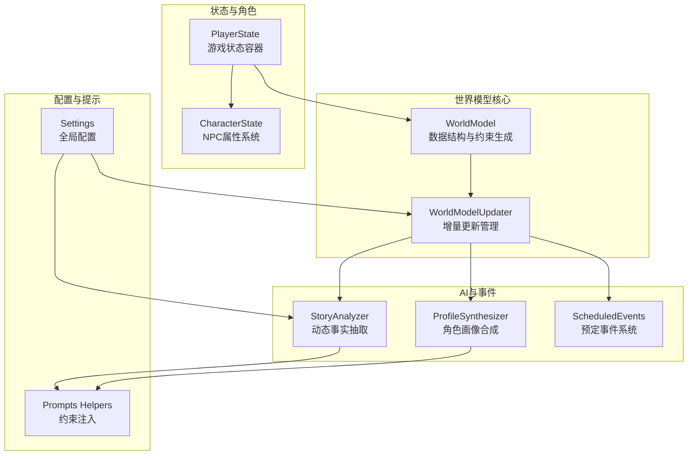
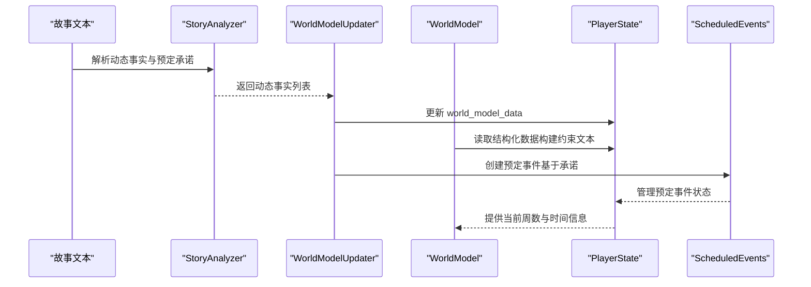
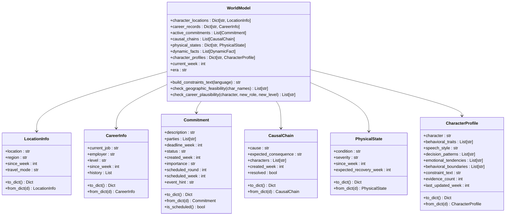
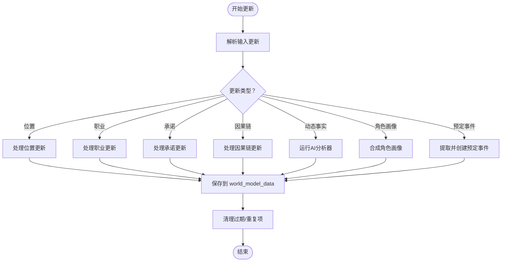
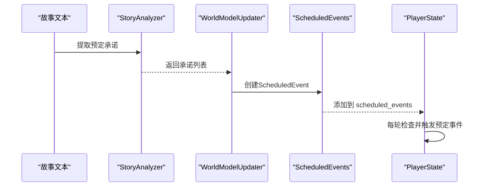
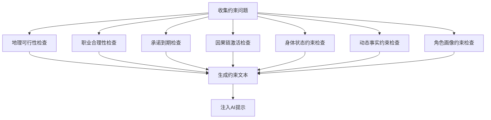
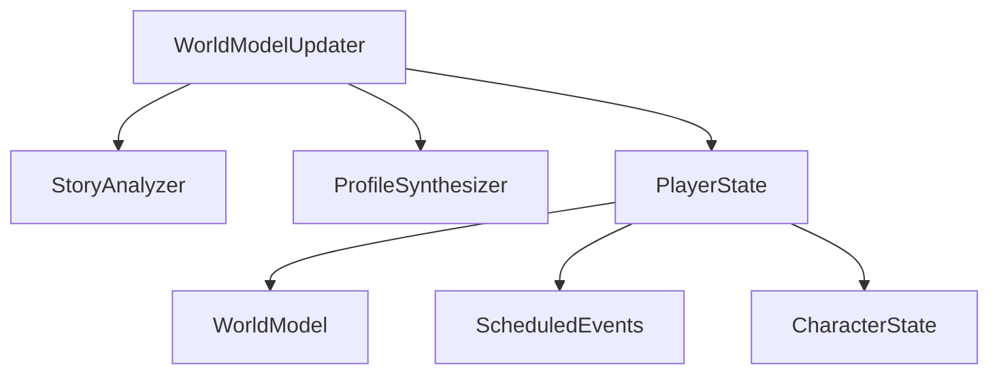

# 世界模型扩展

<cite>
**本文档引用的文件**
- [src/game/world_model.py](file://src/game/world_model.py)
- [src/game/world_model_updater.py](file://src/game/world_model_updater.py)
- [src/game/state/player_state.py](file://src/game/state/player_state.py)
- [src/game/state/character_state.py](file://src/game/state/character_state.py)
- [src/game/scheduled_events.py](file://src/game/scheduled_events.py)
- [src/ai/story_analyzer.py](file://src/ai/story_analyzer.py)
- [src/ai/profile_synthesizer.py](file://src/ai/profile_synthesizer.py)
- [config/settings.py](file://config/settings.py)
- [config/prompts/_helpers.py](file://config/prompts/_helpers.py)
- [tests/test_world_model.py](file://tests/test_world_model.py)
- [tests/test_world_model_updater.py](file://tests/test_world_model_updater.py)
</cite>

## 目录
1. [简介](#简介)
2. [项目结构](#项目结构)
3. [核心组件](#核心组件)
4. [架构概览](#架构概览)
5. [详细组件分析](#详细组件分析)
6. [依赖关系分析](#依赖关系分析)
7. [性能考虑](#性能考虑)
8. [故障排除指南](#故障排除指南)
9. [结论](#结论)
10. [附录](#附录)

## 简介
本指南面向希望扩展世界模型功能的开发者，系统讲解如何在现有架构基础上添加新的世界元素（如新场景类型、NPC行为和交互系统）、扩展世界模型的数据结构、实现约束验证机制与一致性检查、管理世界状态的动态更新与事件跟踪、设计序列化方案与查询接口，并提供性能优化、数据压缩存储与版本兼容性的最佳实践。文档还包含完整的扩展示例与一致性验证方法。

## 项目结构
世界模型相关的核心模块分布如下：
- 数据结构与模型层：`src/game/world_model.py`（世界模型数据结构与约束文本生成）
- 更新管理器：`src/game/world_model_updater.py`（位置、职业、承诺、因果链、动态事实与角色画像的增量更新）
- 状态管理：`src/game/state/player_state.py`（玩家状态容器，承载世界模型数据）
- NPC角色系统：`src/game/state/character_state.py`（NPC属性与行为）
- 预定事件系统：`src/game/scheduled_events.py`（基于承诺的强制触发事件）
- AI分析与画像：`src/ai/story_analyzer.py`（动态事实抽取）、`src/ai/profile_synthesizer.py`（角色行为画像合成）
- 配置与提示：`config/settings.py`（全局配置）、`config/prompts/_helpers.py`（世界模型约束注入辅助）

**图表来源**
- [src/game/world_model.py](file://src/game/world_model.py#L198-L672)
- [src/game/world_model_updater.py](file://src/game/world_model_updater.py#L15-L712)
- [src/game/state/player_state.py](file://src/game/state/player_state.py#L15-L590)
- [src/game/state/character_state.py](file://src/game/state/character_state.py#L13-L243)
- [src/game/scheduled_events.py](file://src/game/scheduled_events.py#L19-L426)
- [src/ai/story_analyzer.py](file://src/ai/story_analyzer.py#L108-L472)
- [src/ai/profile_synthesizer.py](file://src/ai/profile_synthesizer.py#L16-L85)
- [config/settings.py](file://config/settings.py#L27-L168)
- [config/prompts/_helpers.py](file://config/prompts/_helpers.py#L622-L643)

**章节来源**
- [src/game/world_model.py](file://src/game/world_model.py#L1-L697)
- [src/game/world_model_updater.py](file://src/game/world_model_updater.py#L1-L712)
- [src/game/state/player_state.py](file://src/game/state/player_state.py#L1-L590)
- [src/game/state/character_state.py](file://src/game/state/character_state.py#L1-L243)
- [src/game/scheduled_events.py](file://src/game/scheduled_events.py#L1-L426)
- [src/ai/story_analyzer.py](file://src/ai/story_analyzer.py#L1-L472)
- [src/ai/profile_synthesizer.py](file://src/ai/profile_synthesizer.py#L1-L85)
- [config/settings.py](file://config/settings.py#L1-L168)
- [config/prompts/_helpers.py](file://config/prompts/_helpers.py#L622-L643)

## 核心组件
- 世界模型数据结构：位置信息、职业记录、承诺、因果链、身体状态、动态事实、角色行为画像等。
- 世界模型约束文本生成：将上述结构化数据转化为可注入AI提示的约束文本。
- 增量更新管理器：从故事压缩结果中提取并更新各类世界事实，支持动态事实与角色画像的AI合成。
- 状态容器：PlayerState承载世界模型数据与回合历史，支持多轮次与预定事件管理。
- NPC角色系统：CharacterState提供丰富的角色属性与关系动态。
- 预定事件系统：基于承诺的强制触发机制，确保故事一致性与可执行性。

**章节来源**
- [src/game/world_model.py](file://src/game/world_model.py#L19-L697)
- [src/game/world_model_updater.py](file://src/game/world_model_updater.py#L15-L712)
- [src/game/state/player_state.py](file://src/game/state/player_state.py#L105-L122)
- [src/game/state/character_state.py](file://src/game/state/character_state.py#L13-L243)
- [src/game/scheduled_events.py](file://src/game/scheduled_events.py#L19-L426)

## 架构概览
世界模型的扩展遵循“数据结构—约束生成—增量更新—状态容器—AI合成—事件触发”的闭环：

**图表来源**
- [src/ai/story_analyzer.py](file://src/ai/story_analyzer.py#L125-L472)
- [src/game/world_model_updater.py](file://src/game/world_model_updater.py#L295-L712)
- [src/game/world_model.py](file://src/game/world_model.py#L215-L300)
- [src/game/state/player_state.py](file://src/game/state/player_state.py#L105-L122)
- [src/game/scheduled_events.py](file://src/game/scheduled_events.py#L127-L171)

## 详细组件分析

### 世界模型数据结构与约束生成
- 数据结构扩展点：
  - 新增场景类型：可在位置信息中扩展区域/环境/场景类别字段，或新增场景实体类型。
  - NPC行为扩展：在角色画像中增加新的行为维度（如社交偏好、学习能力、创造力等）。
  - 交互系统：新增交互事件类型（如合作任务、情感冲突、知识传授等）及其状态机。
- 约束文本生成：
  - 通过`WorldModel.build_constraints_text()`将各类事实汇总为可注入AI的约束文本。
  - 支持中英文切换与分节组织，便于AI理解和遵循。

**图表来源**
- [src/game/world_model.py](file://src/game/world_model.py#L17-L175)
- [src/game/world_model.py](file://src/game/world_model.py#L198-L672)

**章节来源**
- [src/game/world_model.py](file://src/game/world_model.py#L19-L697)

### 增量更新管理器（WorldModelUpdater）
- 位置更新：支持移动与确认两种动作，自动推导区域并记录来源与原因。
- 职业更新：支持新工作与升职，自动记录历史变迁。
- 承诺更新：支持新建、完成、破裂、过期等状态变更，具备模糊匹配与去重清理。
- 因果链更新：支持新建与解决，自动清理过期链。
- 动态事实抽取：调用AI分析器从故事中提取关键事实，支持取代与过期策略。
- 角色画像合成：每周从回合历史中提取行为证据，合成角色画像并限制数量与证据数。
- 预定事件创建：从故事中的承诺提取具体时间点，创建预定事件并管理合并与清理。

**图表来源**
- [src/game/world_model_updater.py](file://src/game/world_model_updater.py#L22-L712)

**章节来源**
- [src/game/world_model_updater.py](file://src/game/world_model_updater.py#L15-L712)

### 状态容器与查询接口
- PlayerState作为世界模型数据的载体，提供：
  - 结构化字段：`world_model_data`（位置、职业、承诺、因果链、身体状态、动态事实、角色画像）
  - 查询方法：按周/轮次获取回合历史、构建回合上下文、获取当前日期信息
  - 预定事件管理：添加、获取、标记与清理预定事件
- 查询接口示例路径：
  - 获取当前周回合上下文：[src/game/state/player_state.py](file://src/game/state/player_state.py#L275-L316)
  - 获取当前日期信息：[src/game/state/player_state.py](file://src/game/state/player_state.py#L239-L273)
  - 预定事件管理：[src/game/state/player_state.py](file://src/game/state/player_state.py#L499-L589)

**章节来源**
- [src/game/state/player_state.py](file://src/game/state/player_state.py#L105-L122)
- [src/game/state/player_state.py](file://src/game/state/player_state.py#L275-L316)
- [src/game/state/player_state.py](file://src/game/state/player_state.py#L239-L273)
- [src/game/state/player_state.py](file://src/game/state/player_state.py#L499-L589)

### NPC角色系统与交互扩展
- CharacterState提供角色的丰富属性与关系动态，支持：
  - 情绪与稳定性、社会地位与影响力、能力与专长
  - 亲密度、信任度、尊重度等与主角的关系属性
  - 互动记录与事件触发阈值，支持事件检查与触发
- 扩展建议：
  - 新增场景类型：在角色画像中加入“场景偏好”维度，用于描述角色在不同场景下的行为倾向。
  - 交互系统：新增交互事件类型（如“合作任务”、“情感冲突”、“知识传授”），并定义状态机与效果。

**章节来源**
- [src/game/state/character_state.py](file://src/game/state/character_state.py#L13-L243)

### 预定事件系统
- 从承诺中提取具体时间点，创建ScheduledEvent并强制在对应轮次触发。
- 支持事件合并、优先级排序、过期检测与清理。
- 与WorldModelUpdater协作，实现承诺到事件的自动化落地。

**图表来源**
- [src/ai/story_analyzer.py](file://src/ai/story_analyzer.py#L359-L472)
- [src/game/world_model_updater.py](file://src/game/world_model_updater.py#L565-L677)
- [src/game/scheduled_events.py](file://src/game/scheduled_events.py#L127-L171)
- [src/game/state/player_state.py](file://src/game/state/player_state.py#L499-L589)

**章节来源**
- [src/game/scheduled_events.py](file://src/game/scheduled_events.py#L19-L426)
- [src/game/world_model_updater.py](file://src/game/world_model_updater.py#L565-L677)

### 一致性验证与约束文本生成
- 约束文本生成：WorldModel将各类事实汇总为约束文本，注入到AI提示中。
- 一致性检查：提供地理可行性检查、职业合理性检查等方法。
- 世界模型约束注入：通过配置助手将WorldModel约束文本注入到生成流程。

**图表来源**
- [src/game/world_model.py](file://src/game/world_model.py#L304-L658)
- [config/prompts/_helpers.py](file://config/prompts/_helpers.py#L622-L643)

**章节来源**
- [src/game/world_model.py](file://src/game/world_model.py#L304-L658)
- [config/prompts/_helpers.py](file://config/prompts/_helpers.py#L622-L643)

## 依赖关系分析
- WorldModelUpdater依赖AI分析器与画像合成器，负责将故事内容转化为结构化世界事实。
- PlayerState承载世界模型数据并提供查询接口，与ScheduledEvents协同管理预定事件。
- CharacterState为NPC行为扩展提供基础，支持与世界模型的交互。

**图表来源**
- [src/game/world_model_updater.py](file://src/game/world_model_updater.py#L295-L559)
- [src/game/state/player_state.py](file://src/game/state/player_state.py#L105-L122)
- [src/game/scheduled_events.py](file://src/game/scheduled_events.py#L19-L426)
- [src/game/state/character_state.py](file://src/game/state/character_state.py#L13-L243)

**章节来源**
- [src/game/world_model_updater.py](file://src/game/world_model_updater.py#L15-L712)
- [src/game/state/player_state.py](file://src/game/state/player_state.py#L105-L122)

## 性能考虑
- 动态事实上限控制：最多保留500条活跃事实，按重要性与来源周排序裁剪，避免内存膨胀。
- 角色画像数量限制：最多保留8个角色画像，按证据数排序裁剪。
- 并行合成：角色画像合成使用线程池并行处理，限制并发数量以平衡成本与性能。
- 历史数据清理：定期清理过期的承诺与因果链，减少查询开销。
- 配置优化：通过Settings集中管理超时、轮次、里程碑等参数，便于云端与本地部署的统一配置。

**章节来源**
- [src/game/world_model_updater.py](file://src/game/world_model_updater.py#L363-L376)
- [src/game/world_model_updater.py](file://src/game/world_model_updater.py#L545-L556)
- [src/game/world_model_updater.py](file://src/game/world_model_updater.py#L524-L531)
- [src/game/world_model_updater.py](file://src/game/world_model_updater.py#L221-L228)
- [src/game/world_model_updater.py](file://src/game/world_model_updater.py#L282-L289)
- [config/settings.py](file://config/settings.py#L70-L102)

## 故障排除指南
- 动态事实解析失败：AI响应无法解析为JSON时，记录警告并跳过，不影响主流程。
- 角色画像合成失败：捕获异常并记录错误，不影响主流程。
- 承诺匹配失败：当精确匹配与模糊匹配均失败时，记录警告并跳过。
- 预定事件解析失败：时间表述解析失败时，记录错误并跳过。
- 约束注入失败：构建约束文本时异常，返回空字符串以避免阻断生成。

**章节来源**
- [src/ai/story_analyzer.py](file://src/ai/story_analyzer.py#L180-L182)
- [src/ai/story_analyzer.py](file://src/ai/story_analyzer.py#L353-L355)
- [src/game/world_model_updater.py](file://src/game/world_model_updater.py#L218-L220)
- [src/game/world_model_updater.py](file://src/game/world_model_updater.py#L408-L409)
- [src/game/world_model.py](file://src/game/world_model.py#L447-L448)

## 结论
通过将世界模型扩展为“数据结构—约束生成—增量更新—状态容器—AI合成—事件触发”的完整闭环，开发者可以安全地添加新的世界元素（场景类型、NPC行为、交互系统），并在不破坏一致性的情况下实现动态演进。配合严格的约束验证、历史清理与性能优化策略，系统能够在复杂叙事中保持连贯与可维护性。

## 附录

### 世界模型扩展的完整示例（步骤指南）
- 步骤1：定义新数据结构
  - 在`src/game/world_model.py`中新增数据类或扩展现有类字段。
  - 示例路径：[src/game/world_model.py](file://src/game/world_model.py#L17-L175)
- 步骤2：实现序列化与反序列化
  - 为新结构实现`to_dict()`与`from_dict()`方法，确保可持久化。
  - 示例路径：[src/game/world_model.py](file://src/game/world_model.py#L25-L84)
- 步骤3：扩展约束文本生成
  - 在`WorldModel.build_constraints_text()`中添加新节，输出人类可读的约束说明。
  - 示例路径：[src/game/world_model.py](file://src/game/world_model.py#L394-L448)
- 步骤4：实现增量更新
  - 在`WorldModelUpdater`中添加对应的更新方法，从故事压缩结果中提取并更新新结构。
  - 示例路径：[src/game/world_model_updater.py](file://src/game/world_model_updater.py#L22-L75)
- 步骤5：集成AI分析与画像
  - 如需AI自动识别，扩展`StoryAnalyzer`的抽取逻辑；如需角色画像，扩展`ProfileSynthesizer`。
  - 示例路径：[src/ai/story_analyzer.py](file://src/ai/story_analyzer.py#L125-L183)、[src/ai/profile_synthesizer.py](file://src/ai/profile_synthesizer.py#L22-L81)
- 步骤6：维护状态容器
  - 在`PlayerState.world_model_data`中添加新字段，确保序列化与查询接口可用。
  - 示例路径：[src/game/state/player_state.py](file://src/game/state/player_state.py#L105-L122)
- 步骤7：一致性验证与测试
  - 编写单元测试覆盖新增逻辑，参考现有测试文件。
  - 示例路径：[tests/test_world_model.py](file://tests/test_world_model.py#L1-L200)、[tests/test_world_model_updater.py](file://tests/test_world_model_updater.py#L1-L200)

### 一致性验证方法
- 使用`WorldModel.check_geographic_feasibility()`与`check_career_plausibility()`进行规则校验。
- 通过`build_constraints_text()`生成约束文本并注入AI提示，利用AI进行二次验证。
- 在测试中模拟边界情况（如无效级别、过期承诺、重复事件等），确保健壮性。

**章节来源**
- [src/game/world_model.py](file://src/game/world_model.py#L304-L362)
- [src/game/world_model.py](file://src/game/world_model.py#L394-L448)
- [tests/test_world_model.py](file://tests/test_world_model.py#L422-L451)