# 事件系统扩展

<cite>
**本文档引用的文件**
- [src/game/round/event_generator.py](file://src/game/round/event_generator.py)
- [src/game/scheduled_events.py](file://src/game/scheduled_events.py)
- [src/game/relationship_events.py](file://src/game/relationship_events.py)
- [src/ai/models.py](file://src/ai/models.py)
- [src/game/state/player_state.py](file://src/game/state/player_state.py)
- [src/game/state/character_state.py](file://src/game/state/character_state.py)
- [src/game/decisions.py](file://src/game/decisions.py)
- [src/game/world_model_updater.py](file://src/game/world_model_updater.py)
- [src/api/routers/gameplay/events.py](file://src/api/routers/gameplay/events.py)
- [data/presets/events.json](file://data/presets/events.json)
- [tests/test_events.py](file://tests/test_events.py)
- [tests/test_relationship_events.py](file://tests/test_relationship_events.py)
- [tests/test_scheduled_events.py](file://tests/test_scheduled_events.py)
</cite>

## 目录
1. [简介](#简介)
2. [项目结构](#项目结构)
3. [核心组件](#核心组件)
4. [架构概览](#架构概览)
5. [详细组件分析](#详细组件分析)
6. [依赖分析](#依赖分析)
7. [性能考虑](#性能考虑)
8. [故障排除指南](#故障排除指南)
9. [结论](#结论)
10. [附录](#附录)

## 简介

本指南为事件系统扩展提供了全面的开发文档，涵盖事件类型的添加、事件分类系统的扩展、概率权重系统、事件链设计、事件数据结构扩展、事件触发器实现、事件效果应用和事件状态管理。通过详细的架构分析和实际代码示例，帮助开发者安全有效地扩展事件系统。

## 项目结构

事件系统采用分层架构设计，主要包含以下核心模块：

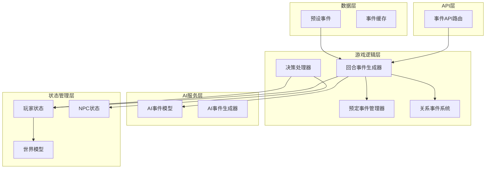

**图表来源**
- [src/api/routers/gameplay/events.py](file://src/api/routers/gameplay/events.py#L1-L212)
- [src/game/round/event_generator.py](file://src/game/round/event_generator.py#L1-L521)
- [src/game/scheduled_events.py](file://src/game/scheduled_events.py#L1-L426)

**章节来源**
- [src/api/routers/gameplay/events.py](file://src/api/routers/gameplay/events.py#L1-L212)
- [src/game/round/event_generator.py](file://src/game/round/event_generator.py#L1-L521)

## 核心组件

### 事件数据模型

事件系统基于Pydantic模型构建，确保数据的完整性和类型安全：

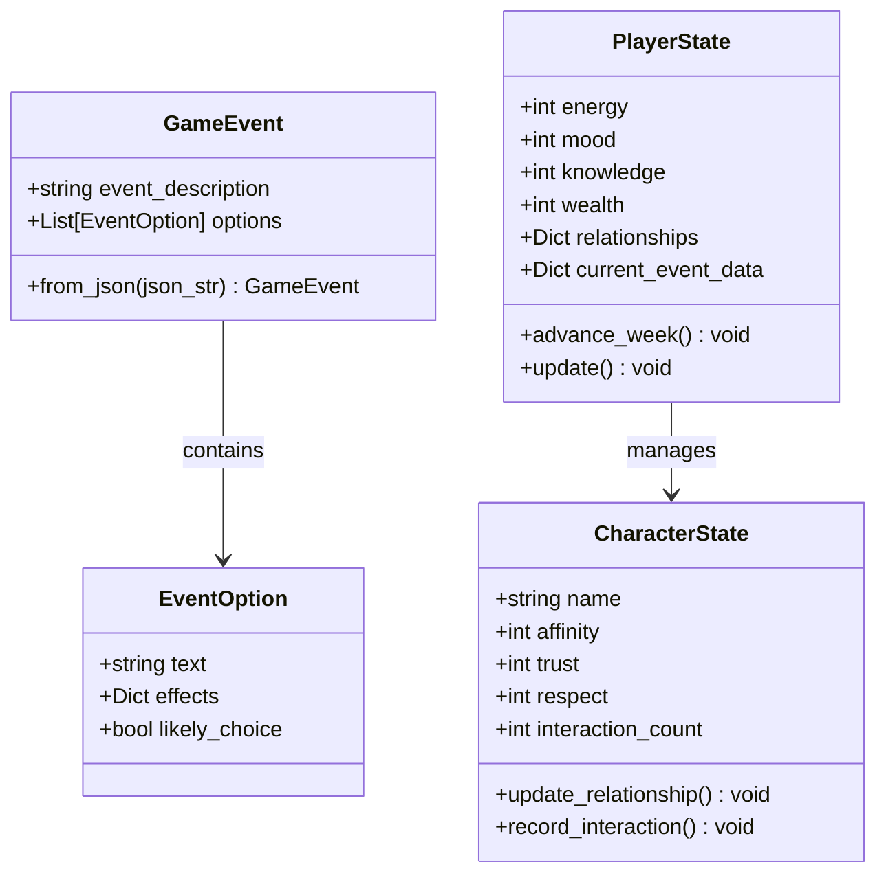

**图表来源**
- [src/ai/models.py](file://src/ai/models.py#L1-L27)
- [src/game/state/player_state.py](file://src/game/state/player_state.py#L1-L200)
- [src/game/state/character_state.py](file://src/game/state/character_state.py#L1-L200)

### 事件生成流程

事件生成采用异步流式处理，支持断线重连和并发控制：

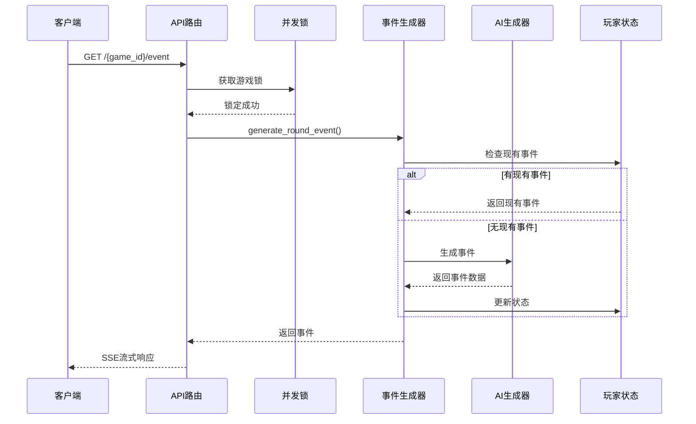

**图表来源**
- [src/api/routers/gameplay/events.py](file://src/api/routers/gameplay/events.py#L48-L164)
- [src/game/round/event_generator.py](file://src/game/round/event_generator.py#L75-L261)

**章节来源**
- [src/ai/models.py](file://src/ai/models.py#L1-L27)
- [src/game/state/player_state.py](file://src/game/state/player_state.py#L1-L200)

## 架构概览

事件系统采用模块化设计，各组件职责清晰：

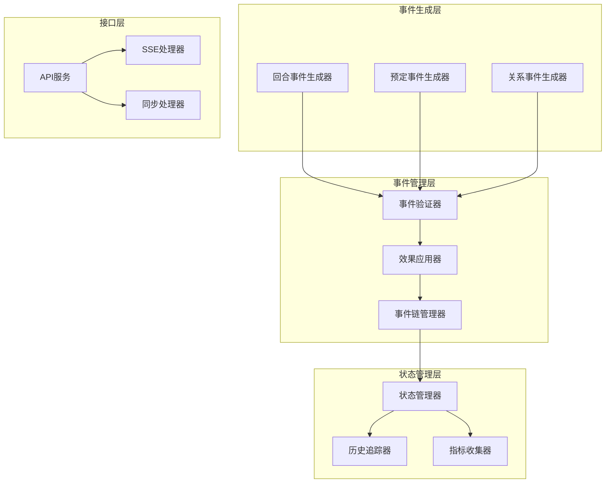

**图表来源**
- [src/game/round/event_generator.py](file://src/game/round/event_generator.py#L1-L521)
- [src/game/scheduled_events.py](file://src/game/scheduled_events.py#L1-L426)
- [src/game/relationship_events.py](file://src/game/relationship_events.py#L1-L354)

## 详细组件分析

### 事件分类系统扩展

事件系统支持三种主要分类：日常事件、重大事件和随机事件。

#### 日常事件（Round Events）

日常事件是每回合自动触发的基础事件：

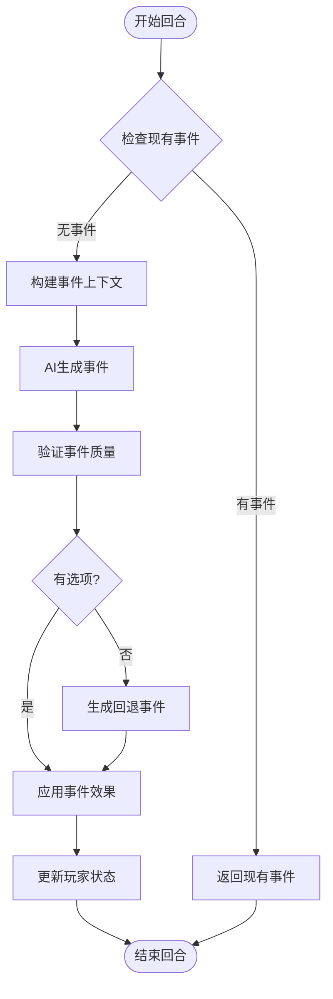

**图表来源**
- [src/game/round/event_generator.py](file://src/game/round/event_generator.py#L75-L261)

#### 重大事件（Milestone Events）

重大事件在特定周数触发，具有重要影响：

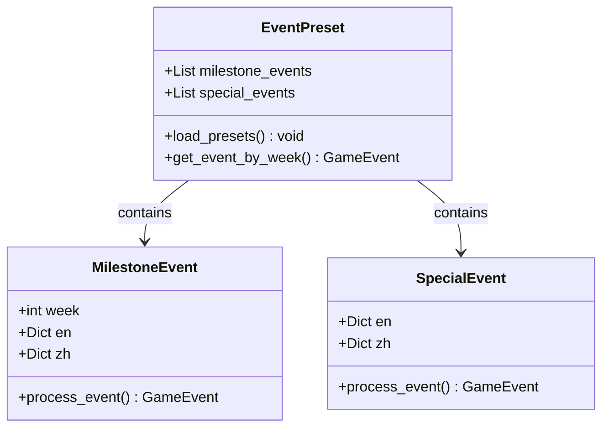

**图表来源**
- [data/presets/events.json](file://data/presets/events.json#L1-L239)

#### 随机事件（Random Events）

随机事件通过概率权重系统动态生成：

**章节来源**
- [src/game/round/event_generator.py](file://src/game/round/event_generator.py#L1-L521)
- [data/presets/events.json](file://data/presets/events.json#L1-L239)

### 事件概率权重系统

事件系统采用多层次的概率权重机制：

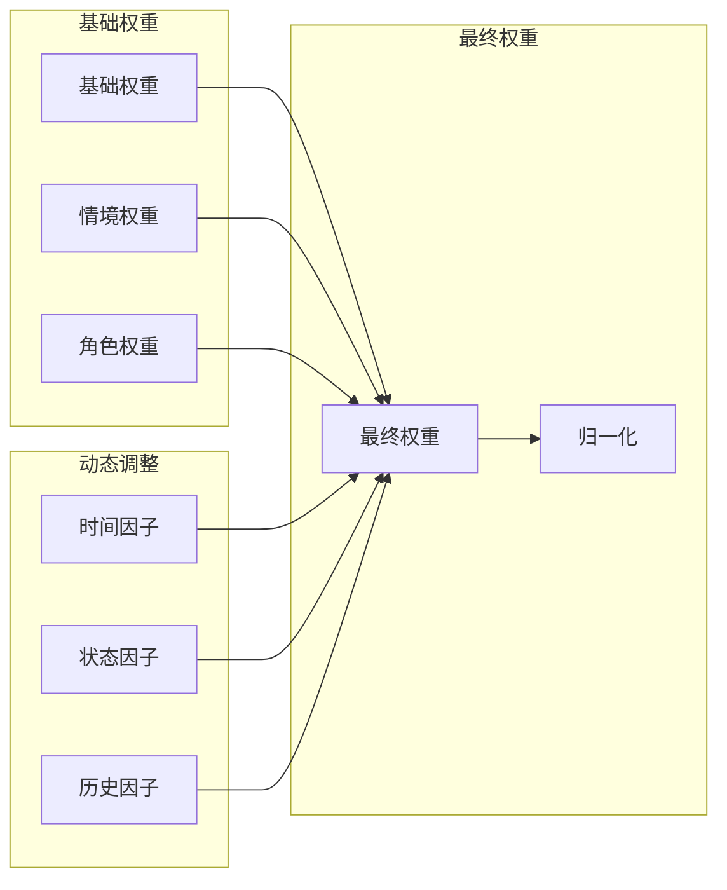

**图表来源**
- [src/game/narrative_manager.py](file://src/game/narrative_manager.py#L228-L263)

### 事件链设计和连锁反应机制

事件链通过因果关系和伏笔系统实现：

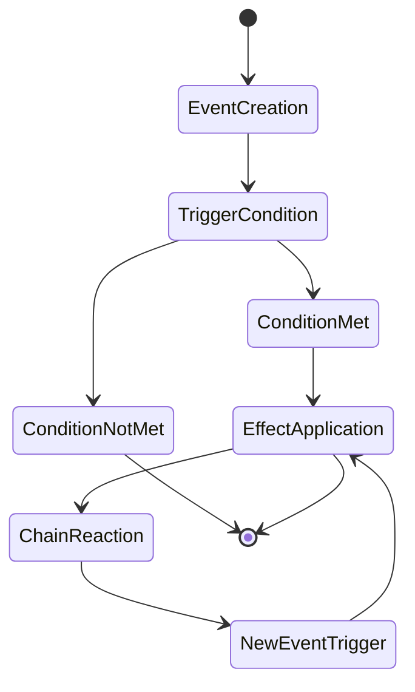

**图表来源**
- [src/game/world_model_updater.py](file://src/game/world_model_updater.py#L142-L200)

### 事件数据结构扩展

#### 新增字段添加

要向事件系统添加新字段，需要修改以下组件：

1. **AI模型扩展**：更新`EventOption`和`GameEvent`模型
2. **状态管理扩展**：更新`PlayerState`和`CharacterState`
3. **序列化处理**：更新`to_dict()`和`from_dict()`方法

#### 验证规则

事件系统包含多层次的验证机制：

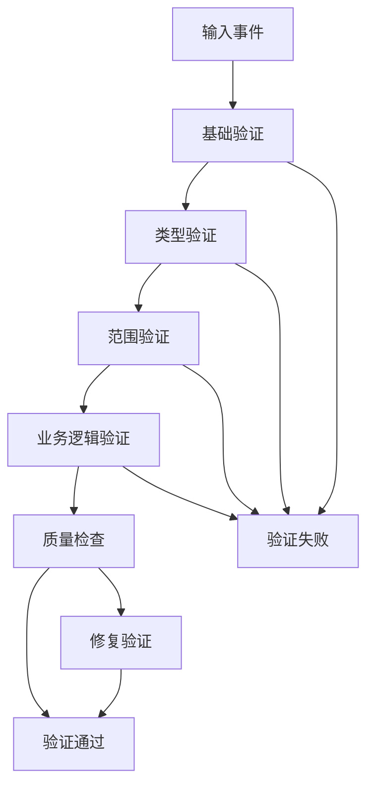

**图表来源**
- [src/ai/option_generator.py](file://src/ai/option_generator.py#L226-L263)

#### 序列化处理

事件数据的序列化遵循以下原则：

**章节来源**
- [src/ai/models.py](file://src/ai/models.py#L1-L27)
- [src/game/state/player_state.py](file://src/game/state/player_state.py#L1-L200)
- [src/game/state/character_state.py](file://src/game/state/character_state.py#L1-L200)

### 事件触发器实现

#### 关系事件触发器

关系事件系统基于角色状态和阈值条件：

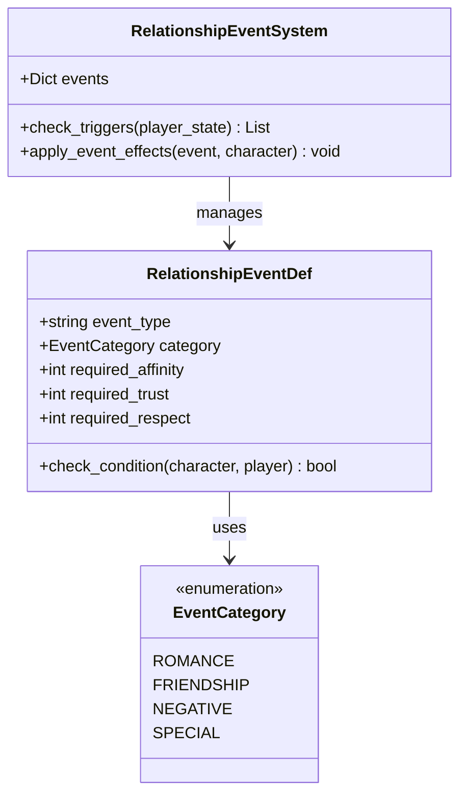

**图表来源**
- [src/game/relationship_events.py](file://src/game/relationship_events.py#L10-L354)

#### 预定事件触发器

预定事件确保承诺在特定时间强制触发：

**章节来源**
- [src/game/relationship_events.py](file://src/game/relationship_events.py#L1-L354)
- [src/game/scheduled_events.py](file://src/game/scheduled_events.py#L1-L426)

### 事件效果应用

事件效果通过统一的处理管道应用：

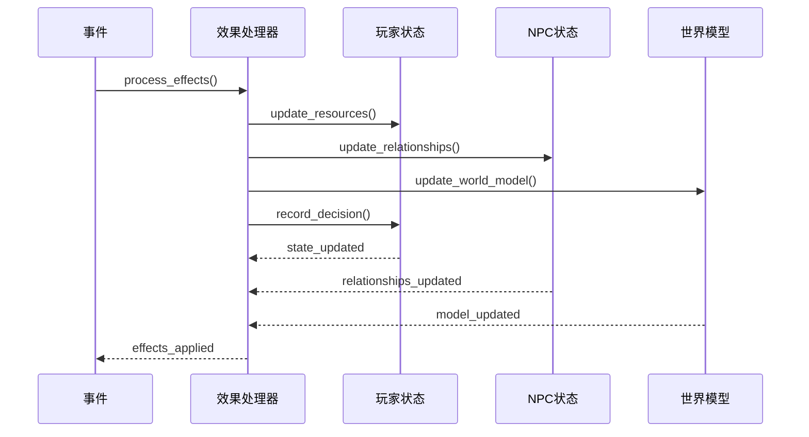

**图表来源**
- [src/game/decisions.py](file://src/game/decisions.py#L135-L271)

**章节来源**
- [src/game/decisions.py](file://src/game/decisions.py#L135-L271)

### 事件状态管理

事件状态管理确保系统的一致性和可恢复性：

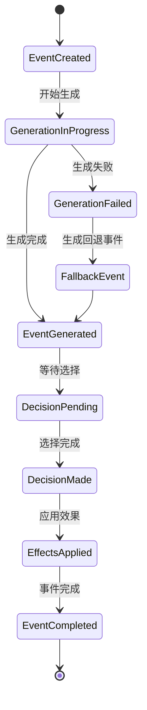

**图表来源**
- [src/game/round/event_generator.py](file://src/game/round/event_generator.py#L100-L115)

## 依赖分析

事件系统的关键依赖关系如下：

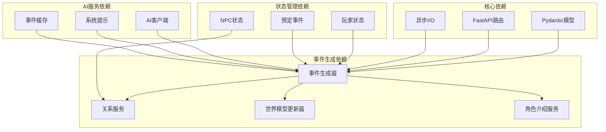

**图表来源**
- [src/game/round/event_generator.py](file://src/game/round/event_generator.py#L1-L521)
- [src/api/routers/gameplay/events.py](file://src/api/routers/gameplay/events.py#L1-L212)

**章节来源**
- [src/game/round/event_generator.py](file://src/game/round/event_generator.py#L1-L521)
- [src/api/routers/gameplay/events.py](file://src/api/routers/gameplay/events.py#L1-L212)

## 性能考虑

事件系统在设计时充分考虑了性能优化：

### 并发控制
- 使用异步锁防止并发事件生成
- SSE流式响应减少内存占用
- 事件缓存机制提升响应速度

### 内存管理
- 事件对象的及时清理
- 状态数据的增量更新
- 缓存大小的动态调整

### 网络优化
- 断线重连支持
- 流式传输减少延迟
- 错误重试机制

## 故障排除指南

### 常见问题及解决方案

#### 事件生成超时
**症状**：事件生成长时间无响应
**解决方案**：
1. 检查AI服务可用性
2. 验证网络连接
3. 查看日志中的超时信息

#### 并发冲突
**症状**：多个请求同时访问导致状态不一致
**解决方案**：
1. 检查异步锁状态
2. 验证生成标志位
3. 实施重试机制

#### 数据验证错误
**症状**：事件数据格式不正确
**解决方案**：
1. 检查Pydantic模型定义
2. 验证数据类型和范围
3. 实施数据修复逻辑

**章节来源**
- [src/api/routers/gameplay/events.py](file://src/api/routers/gameplay/events.py#L88-L121)
- [src/game/round/event_generator.py](file://src/game/round/event_generator.py#L100-L115)

## 结论

事件系统扩展提供了完整的框架来支持新的事件类型、分类和机制。通过模块化的架构设计、严格的验证机制和高效的性能优化，系统能够安全地支持各种事件扩展需求。开发者可以按照本文档的指导，安全地添加新的事件类型、扩展事件分类系统，并实现复杂的事件链和连锁反应机制。

## 附录

### 扩展开发最佳实践

1. **模型设计**：始终使用Pydantic模型确保数据完整性
2. **状态管理**：维护状态的一致性和可恢复性
3. **错误处理**：实施全面的异常处理和回退机制
4. **性能监控**：持续监控系统性能指标
5. **测试覆盖**：编写全面的单元测试和集成测试

### 测试策略

事件系统的测试策略包括：

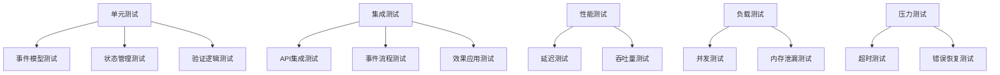

**图表来源**
- [tests/test_events.py](file://tests/test_events.py#L1-L81)
- [tests/test_relationship_events.py](file://tests/test_relationship_events.py#L1-L165)
- [tests/test_scheduled_events.py](file://tests/test_scheduled_events.py#L1-L426)