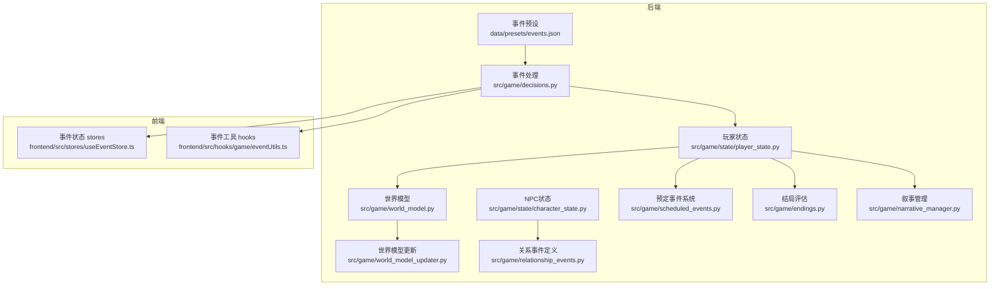
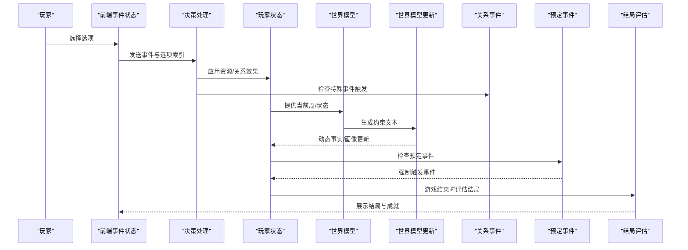
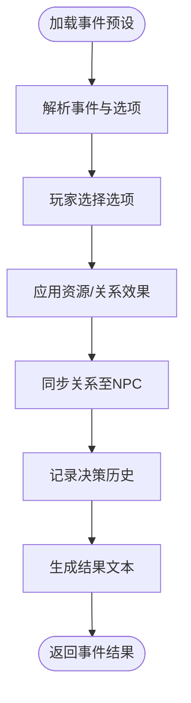
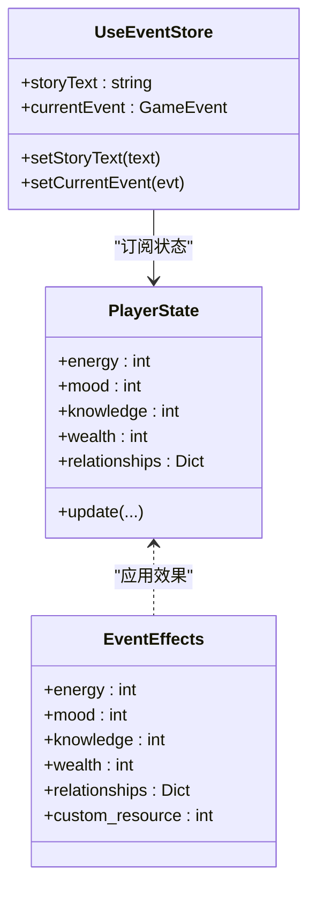
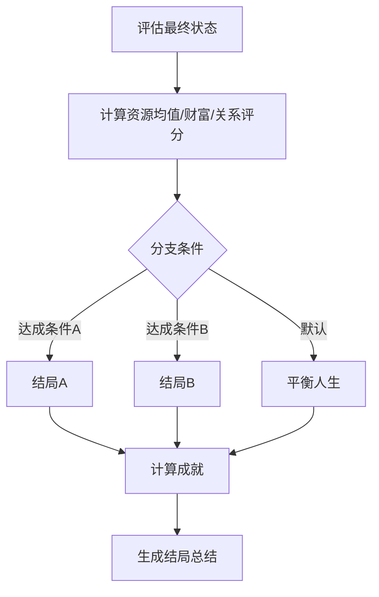
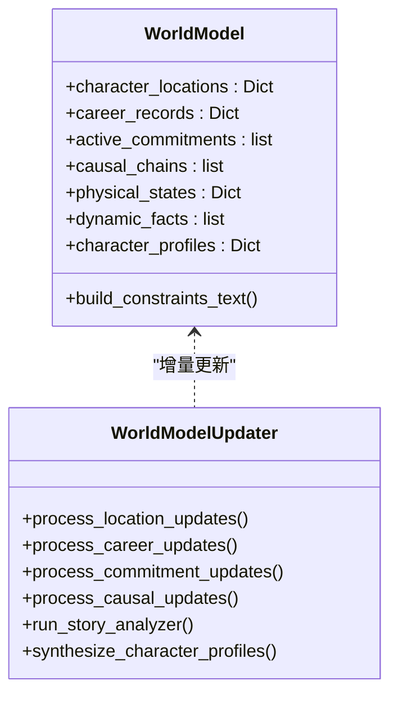
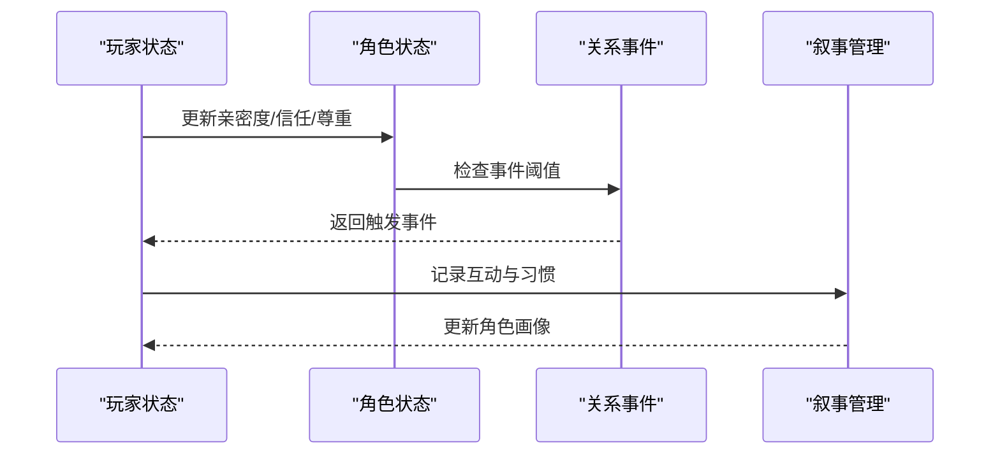
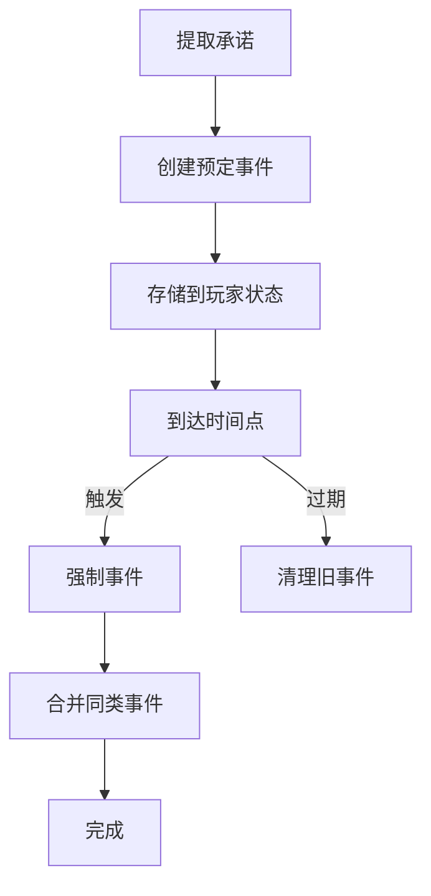
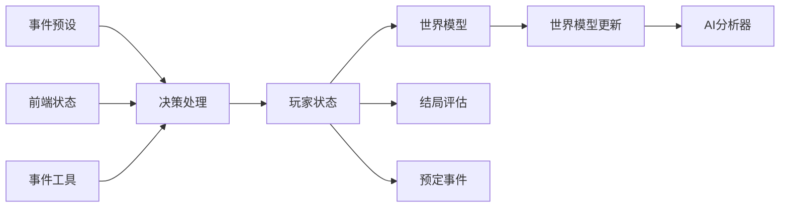

# 游戏功能扩展

<cite>
**本文引用的文件**
- [事件预设数据 events.json](file://data/presets/events.json)
- [世界模型 world_model.py](file://src/game/world_model.py)
- [结局评估 endings.py](file://src/game/endings.py)
- [玩家状态 player_state.py](file://src/game/state/player_state.py)
- [NPC状态 character_state.py](file://src/game/state/character_state.py)
- [世界模型更新 world_model_updater.py](file://src/game/world_model_updater.py)
- [关系事件 relationship_events.py](file://src/game/relationship_events.py)
- [预定事件 scheduled_events.py](file://src/game/scheduled_events.py)
- [决策处理 decisions.py](file://src/game/decisions.py)
- [叙事管理 narrative_manager.py](file://src/game/narrative_manager.py)
- [前端事件状态 stores/useEventStore.ts](file://frontend/src/stores/useEventStore.ts)
- [前端事件工具 hooks/game/eventUtils.ts](file://frontend/src/hooks/game/eventUtils.ts)
</cite>

## 目录
1. [简介](#简介)
2. [项目结构](#项目结构)
3. [核心组件](#核心组件)
4. [架构总览](#架构总览)
5. [详细组件分析](#详细组件分析)
6. [依赖关系分析](#依赖关系分析)
7. [性能考虑](#性能考虑)
8. [故障排查指南](#故障排查指南)
9. [结论](#结论)
10. [附录](#附录)

## 简介
本指南面向希望扩展“故事驱动人生”游戏功能的开发者与策划，围绕以下主题提供系统化的扩展方法论与实操路径：
- 新增事件类型：事件定义格式、触发条件与效果处理
- 资源系统扩展：新增资源类型、计算公式调整与UI显示更新
- 结局系统定制：新结局条件、分支逻辑与解锁机制
- 世界模型扩展：新场景类型、NPC行为与交互系统
- 游戏规则定制：平衡性调整与可玩性优化
- 功能扩展示例与测试策略

## 项目结构
后端采用Python模块化设计，前端基于Next.js + Zustand状态管理。核心扩展点分布在事件、状态、世界模型、NPC关系、结局与叙事管理等模块。

**图表来源**
- [事件预设数据 events.json](file://data/presets/events.json#L1-L239)
- [决策处理 decisions.py](file://src/game/decisions.py#L135-L241)
- [世界模型 world_model.py](file://src/game/world_model.py#L198-L300)
- [世界模型更新 world_model_updater.py](file://src/game/world_model_updater.py#L15-L712)
- [NPC状态 character_state.py](file://src/game/state/character_state.py#L13-L243)
- [玩家状态 player_state.py](file://src/game/state/player_state.py#L15-L590)
- [关系事件 relationship_events.py](file://src/game/relationship_events.py#L18-L354)
- [预定事件 scheduled_events.py](file://src/game/scheduled_events.py#L19-L426)
- [结局评估 endings.py](file://src/game/endings.py#L12-L287)
- [叙事管理 narrative_manager.py](file://src/game/narrative_manager.py#L15-L584)
- [前端事件状态 stores/useEventStore.ts](file://frontend/src/stores/useEventStore.ts#L1-L83)
- [前端事件工具 hooks/game/eventUtils.ts](file://frontend/src/hooks/game/eventUtils.ts#L1-L243)

**章节来源**
- [事件预设数据 events.json](file://data/presets/events.json#L1-L239)
- [玩家状态 player_state.py](file://src/game/state/player_state.py#L15-L590)
- [世界模型 world_model.py](file://src/game/world_model.py#L198-L300)
- [世界模型更新 world_model_updater.py](file://src/game/world_model_updater.py#L15-L712)
- [NPC状态 character_state.py](file://src/game/state/character_state.py#L13-L243)
- [关系事件 relationship_events.py](file://src/game/relationship_events.py#L18-L354)
- [预定事件 scheduled_events.py](file://src/game/scheduled_events.py#L19-L426)
- [结局评估 endings.py](file://src/game/endings.py#L12-L287)
- [叙事管理 narrative_manager.py](file://src/game/narrative_manager.py#L15-L584)
- [前端事件状态 stores/useEventStore.ts](file://frontend/src/stores/useEventStore.ts#L1-L83)
- [前端事件工具 hooks/game/eventUtils.ts](file://frontend/src/hooks/game/eventUtils.ts#L1-L243)

## 核心组件
- 事件系统：事件预设加载、选项效果应用、结果文本生成
- 资源系统：能量、情绪、学识、财富等基础资源与关系资源
- 世界模型：地理、职业、承诺、因果链、身体状态、动态事实与角色画像
- NPC关系：关系阈值、时代适配、特殊事件触发
- 预定事件：承诺转事件、时间点强制触发、合并与清理
- 结局系统：结局类型判定、成就计算、总结生成
- 叙事管理：剧情线、世界事实、伏笔种子、角色习惯

**章节来源**
- [事件预设数据 events.json](file://data/presets/events.json#L1-L239)
- [决策处理 decisions.py](file://src/game/decisions.py#L135-L241)
- [世界模型 world_model.py](file://src/game/world_model.py#L198-L300)
- [世界模型更新 world_model_updater.py](file://src/game/world_model_updater.py#L15-L712)
- [NPC状态 character_state.py](file://src/game/state/character_state.py#L13-L243)
- [关系事件 relationship_events.py](file://src/game/relationship_events.py#L18-L354)
- [预定事件 scheduled_events.py](file://src/game/scheduled_events.py#L19-L426)
- [结局评估 endings.py](file://src/game/endings.py#L12-L287)
- [叙事管理 narrative_manager.py](file://src/game/narrative_manager.py#L15-L584)

## 架构总览
事件从预设加载，经决策处理应用效果，更新玩家/NPC状态，驱动世界模型与叙事管理，最终影响结局与UI呈现。

**图表来源**
- [前端事件状态 stores/useEventStore.ts](file://frontend/src/stores/useEventStore.ts#L27-L83)
- [前端事件工具 hooks/game/eventUtils.ts](file://frontend/src/hooks/game/eventUtils.ts#L117-L217)
- [决策处理 decisions.py](file://src/game/decisions.py#L135-L241)
- [玩家状态 player_state.py](file://src/game/state/player_state.py#L15-L590)
- [世界模型 world_model.py](file://src/game/world_model.py#L394-L448)
- [世界模型更新 world_model_updater.py](file://src/game/world_model_updater.py#L295-L386)
- [关系事件 relationship_events.py](file://src/game/relationship_events.py#L341-L354)
- [预定事件 scheduled_events.py](file://src/game/scheduled_events.py#L313-L328)
- [结局评估 endings.py](file://src/game/endings.py#L47-L95)

## 详细组件分析

### 事件系统扩展
- 事件定义格式
  - 预设文件结构：里程碑事件与特殊事件两类，每项包含事件描述与选项数组，选项包含文本与效果字典
  - 效果字段：基础资源变化（能量、情绪、学识、财富）、关系资源变化、可选角色关系变化、行动点消耗等
  - 语言支持：英文与中文双语描述
- 触发条件
  - 里程碑事件：按周数触发（如第20周、第40周）
  - 特殊事件：随机或由剧情驱动触发
- 效果处理
  - 决策处理模块负责应用效果、同步关系、记录决策历史，并可生成结果文本
  - 角色效果计算模块将关系变化转换为角色亲密度、信任度、尊重度与情绪变化

**图表来源**
- [事件预设数据 events.json](file://data/presets/events.json#L1-L239)
- [决策处理 decisions.py](file://src/game/decisions.py#L135-L241)
- [NPC状态 character_state.py](file://src/game/state/character_state.py#L13-L243)

**章节来源**
- [事件预设数据 events.json](file://data/presets/events.json#L1-L239)
- [决策处理 decisions.py](file://src/game/decisions.py#L135-L241)
- [NPC状态 character_state.py](file://src/game/state/character_state.py#L13-L243)

### 资源系统扩展
- 新增资源类型
  - 在事件效果字典中新增字段（如“声望”、“健康”），并在玩家状态更新接口中纳入处理
  - 在前端状态 stores 中扩展显示字段，确保UI实时更新
- 计算公式调整
  - 在决策处理模块中扩展效果计算逻辑，支持复合公式与阈值联动
  - 在世界模型约束文本中加入新资源的合理性校验
- UI显示更新
  - 前端 stores 与组件订阅状态变更，自动刷新资源面板与进度条

**图表来源**
- [玩家状态 player_state.py](file://src/game/state/player_state.py#L15-L590)
- [决策处理 decisions.py](file://src/game/decisions.py#L135-L241)
- [前端事件状态 stores/useEventStore.ts](file://frontend/src/stores/useEventStore.ts#L1-L83)

**章节来源**
- [玩家状态 player_state.py](file://src/game/state/player_state.py#L15-L590)
- [决策处理 decisions.py](file://src/game/decisions.py#L135-L241)
- [前端事件状态 stores/useEventStore.ts](file://frontend/src/stores/useEventStore.ts#L1-L83)

### 结局系统定制
- 新结局条件
  - 在结局评估模块中扩展判定逻辑，结合资源均值、财富阈值、关系评分等综合指标
  - 新增结局类型枚举与本地化名称
- 分支逻辑
  - 基于最终状态与关键决策历史生成分支路径
- 解锁机制
  - 成就系统与结局解锁联动，满足条件即时解锁

**图表来源**
- [结局评估 endings.py](file://src/game/endings.py#L47-L123)
- [结局评估 endings.py](file://src/game/endings.py#L251-L287)

**章节来源**
- [结局评估 endings.py](file://src/game/endings.py#L12-L287)

### 世界模型扩展
- 新场景类型
  - 在世界模型数据结构中新增场景维度（如“虚拟空间”、“回忆片段”），并扩展地理区域提取逻辑
- NPC行为
  - 通过角色画像与动态事实增强NPC行为一致性，避免前后矛盾
- 交互系统
  - 通过承诺与因果链管理NPC间的交互约束，确保故事连贯

**图表来源**
- [世界模型 world_model.py](file://src/game/world_model.py#L198-L672)
- [世界模型更新 world_model_updater.py](file://src/game/world_model_updater.py#L22-L386)

**章节来源**
- [世界模型 world_model.py](file://src/game/world_model.py#L198-L672)
- [世界模型更新 world_model_updater.py](file://src/game/world_model_updater.py#L22-L386)

### NPC关系与交互扩展
- 关系阈值与时代适配
  - 关系事件定义支持不同阈值与时代名称映射，确保文化适配
- 特殊事件触发
  - 基于角色属性与互动历史触发浪漫、友谊、负面与特殊关系事件
- 交互记录与画像
  - 通过叙事管理模块记录互动，驱动角色画像合成

**图表来源**
- [NPC状态 character_state.py](file://src/game/state/character_state.py#L13-L243)
- [关系事件 relationship_events.py](file://src/game/relationship_events.py#L18-L354)
- [叙事管理 narrative_manager.py](file://src/game/narrative_manager.py#L420-L584)

**章节来源**
- [NPC状态 character_state.py](file://src/game/state/character_state.py#L13-L243)
- [关系事件 relationship_events.py](file://src/game/relationship_events.py#L18-L354)
- [叙事管理 narrative_manager.py](file://src/game/narrative_manager.py#L420-L584)

### 预定事件系统
- 承诺转事件
  - 从故事中提取带有具体时间点的承诺，创建预定事件并存储
- 强制触发
  - 在指定周与轮次自动触发，支持优先级与合并
- 清理与维护
  - 过期事件清理，保留最近N周的历史

**图表来源**
- [预定事件 scheduled_events.py](file://src/game/scheduled_events.py#L127-L172)
- [预定事件 scheduled_events.py](file://src/game/scheduled_events.py#L313-L328)
- [预定事件 scheduled_events.py](file://src/game/scheduled_events.py#L391-L414)

**章节来源**
- [预定事件 scheduled_events.py](file://src/game/scheduled_events.py#L19-L426)

## 依赖关系分析
- 模块耦合
  - 决策处理依赖玩家状态与NPC状态；世界模型更新依赖AI分析器；结局评估依赖玩家状态与AI生成器
- 数据流向
  - 事件预设 → 决策处理 → 状态更新 → 世界模型约束 → 结局评估
- 外部依赖
  - 前端通过Zustand订阅状态，事件工具处理流式文本与重试逻辑

**图表来源**
- [事件预设数据 events.json](file://data/presets/events.json#L1-L239)
- [决策处理 decisions.py](file://src/game/decisions.py#L135-L241)
- [玩家状态 player_state.py](file://src/game/state/player_state.py#L15-L590)
- [世界模型 world_model.py](file://src/game/world_model.py#L198-L300)
- [世界模型更新 world_model_updater.py](file://src/game/world_model_updater.py#L295-L386)
- [结局评估 endings.py](file://src/game/endings.py#L47-L95)
- [预定事件 scheduled_events.py](file://src/game/scheduled_events.py#L313-L328)
- [前端事件状态 stores/useEventStore.ts](file://frontend/src/stores/useEventStore.ts#L1-L83)
- [前端事件工具 hooks/game/eventUtils.ts](file://frontend/src/hooks/game/eventUtils.ts#L1-L243)

**章节来源**
- [事件预设数据 events.json](file://data/presets/events.json#L1-L239)
- [决策处理 decisions.py](file://src/game/decisions.py#L135-L241)
- [玩家状态 player_state.py](file://src/game/state/player_state.py#L15-L590)
- [世界模型 world_model.py](file://src/game/world_model.py#L198-L300)
- [世界模型更新 world_model_updater.py](file://src/game/world_model_updater.py#L295-L386)
- [结局评估 endings.py](file://src/game/endings.py#L47-L95)
- [预定事件 scheduled_events.py](file://src/game/scheduled_events.py#L313-L328)
- [前端事件状态 stores/useEventStore.ts](file://frontend/src/stores/useEventStore.ts#L1-L83)
- [前端事件工具 hooks/game/eventUtils.ts](file://frontend/src/hooks/game/eventUtils.ts#L1-L243)

## 性能考虑
- AI调用成本控制
  - 限制动态事实与角色画像数量，采用并行合成与优先级排序
- 状态序列化与缓存
  - 世界模型数据结构化存储，减少重复计算
- 前端渲染优化
  - 流式文本追加与最小化重渲染，避免大段DOM更新

[本节为通用指导，无需特定文件引用]

## 故障排查指南
- 事件选项无效
  - 检查选项索引合法性与效果字段完整性
- 资源越界
  - 校验状态验证器与边界处理逻辑
- 世界模型约束冲突
  - 查看约束文本构建与AI提取的事实
- 前端故事不一致
  - 检查重试标记与流式补充逻辑

**章节来源**
- [决策处理 decisions.py](file://src/game/decisions.py#L163-L165)
- [玩家状态 player_state.py](file://src/game/state/player_state.py#L318-L338)
- [世界模型 world_model.py](file://src/game/world_model.py#L394-L448)
- [前端事件工具 hooks/game/eventUtils.ts](file://frontend/src/hooks/game/eventUtils.ts#L224-L243)

## 结论
通过模块化扩展与清晰的数据流设计，系统支持在不破坏一致性与可玩性的前提下快速迭代事件、资源、结局与世界模型。建议在扩展过程中遵循“先设计、后实现、再测试”的闭环流程，确保新功能与现有机制协同演进。

[本节为总结，无需特定文件引用]

## 附录

### 功能扩展示例清单
- 新增事件类型
  - 在事件预设中添加新事件项，定义描述与选项
  - 在决策处理中完善效果应用与结果生成
- 新增资源类型
  - 在玩家状态与前端状态中增加字段
  - 在事件效果与UI组件中使用
- 新增结局类型
  - 在结局评估中扩展判定逻辑与成就计算
- 新增场景类型
  - 在世界模型数据结构中扩展场景维度
- 新增NPC关系事件
  - 在关系事件定义中添加新事件与阈值
- 新增预定事件
  - 在故事中提取承诺并创建事件，设置时间点与重要度

[本节为概览，无需特定文件引用]

### 测试策略
- 单元测试
  - 事件效果应用、状态验证、世界模型约束构建
- 集成测试
  - 事件完整流程（加载→选择→应用→状态更新→UI）
- 端到端测试
  - 前后端协作与SSE流式输出一致性
- 性能测试
  - AI调用频率与状态序列化开销

[本节为通用指导，无需特定文件引用]