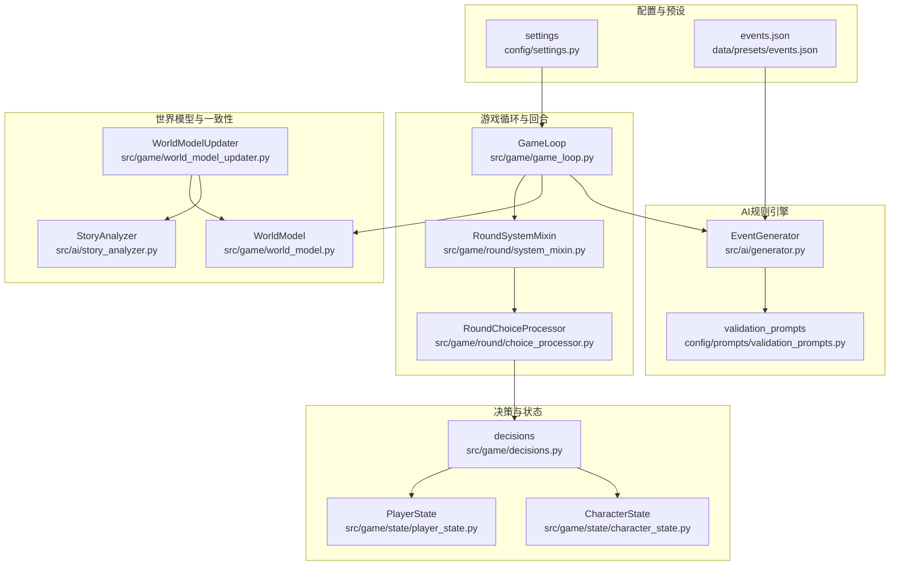
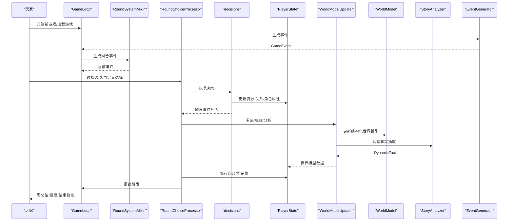
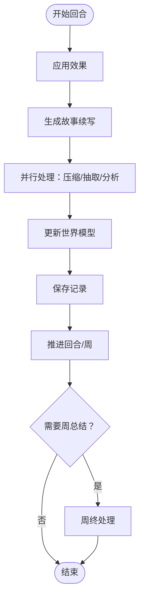
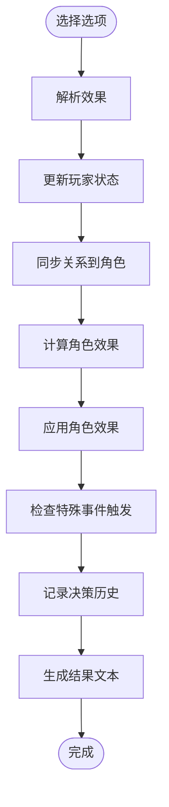
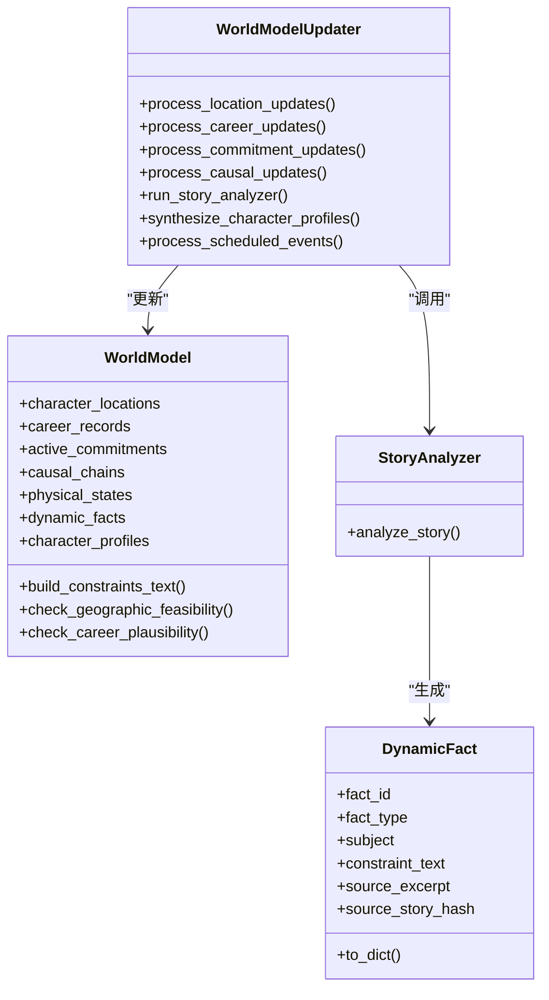
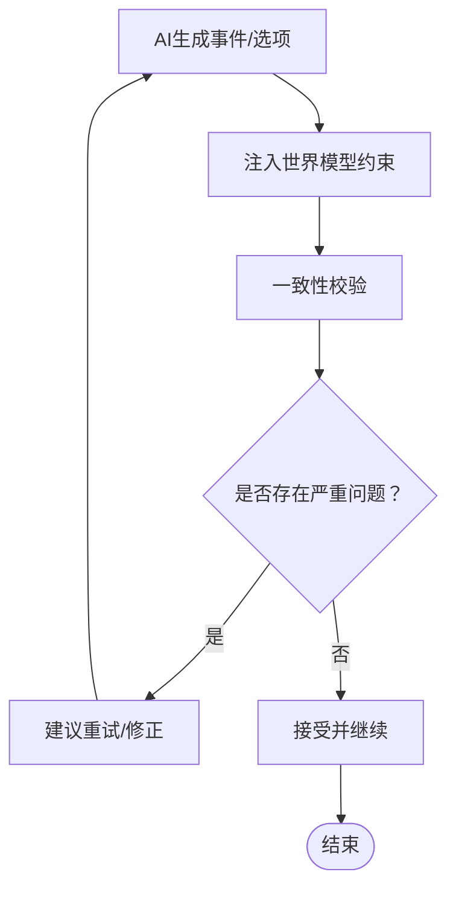
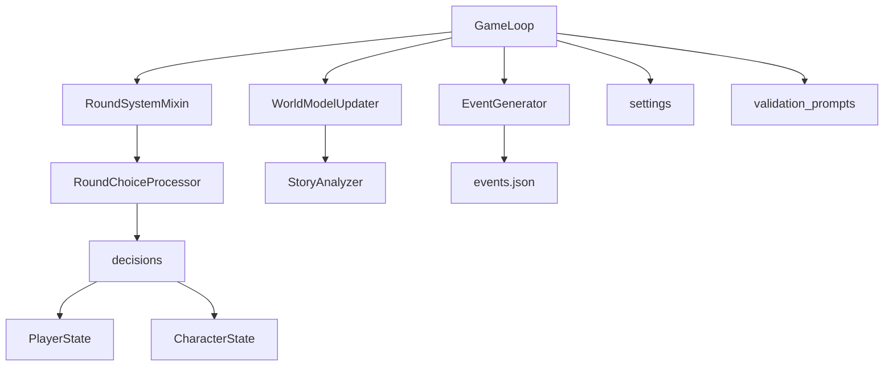

# 游戏规则定制

<cite>
**本文档引用的文件**
- [src/game/game_loop.py](file://src/game/game_loop.py)
- [src/game/decisions.py](file://src/game/decisions.py)
- [src/game/state/player_state.py](file://src/game/state/player_state.py)
- [src/game/state/character_state.py](file://src/game/state/character_state.py)
- [src/game/world_model.py](file://src/game/world_model.py)
- [src/game/world_model_updater.py](file://src/game/world_model_updater.py)
- [src/game/round/system_mixin.py](file://src/game/round/system_mixin.py)
- [src/game/round/choice_processor.py](file://src/game/round/choice_processor.py)
- [src/ai/generator.py](file://src/ai/generator.py)
- [src/ai/story_analyzer.py](file://src/ai/story_analyzer.py)
- [config/settings.py](file://config/settings.py)
- [config/prompts/validation_prompts.py](file://config/prompts/validation_prompts.py)
- [data/presets/events.json](file://data/presets/events.json)
- [tests/test_game_loop.py](file://tests/test_game_loop.py)
</cite>

## 目录
1. [简介](#简介)
2. [项目结构](#项目结构)
3. [核心组件](#核心组件)
4. [架构总览](#架构总览)
5. [详细组件分析](#详细组件分析)
6. [依赖关系分析](#依赖关系分析)
7. [性能考量](#性能考量)
8. [故障排查指南](#故障排查指南)
9. [结论](#结论)
10. [附录](#附录)

## 简介
本指南面向希望深度定制“游戏规则”的开发者与策划人员，围绕事件生成、决策处理、状态变更、世界模型一致性、规则引擎设计与冲突化解、平衡性与难度调节、规则配置与验证测试等方面，提供从架构到实现的完整开发指南。文档以代码为依据，结合可视化图示，帮助读者快速理解并扩展游戏规则系统。

## 项目结构
本项目采用分层与模块化设计：
- 游戏循环与回合系统：GameLoop、RoundSystemMixin、RoundChoiceProcessor
- 决策与状态：decisions、PlayerState、CharacterState
- 世界模型与一致性：WorldModel、WorldModelUpdater、StoryAnalyzer
- AI规则引擎：EventGenerator、validation_prompts
- 配置与预设：settings、events.json
- 测试与验证：tests/test_game_loop.py

**图表来源**
- [src/game/game_loop.py](file://src/game/game_loop.py#L25-L592)
- [src/game/round/system_mixin.py](file://src/game/round/system_mixin.py#L34-L255)
- [src/game/round/choice_processor.py](file://src/game/round/choice_processor.py#L16-L387)
- [src/game/decisions.py](file://src/game/decisions.py#L135-L240)
- [src/game/state/player_state.py](file://src/game/state/player_state.py#L15-L590)
- [src/game/state/character_state.py](file://src/game/state/character_state.py#L13-L243)
- [src/game/world_model.py](file://src/game/world_model.py#L196-L697)
- [src/game/world_model_updater.py](file://src/game/world_model_updater.py#L15-L712)
- [src/ai/story_analyzer.py](file://src/ai/story_analyzer.py#L108-L200)
- [src/ai/generator.py](file://src/ai/generator.py#L30-L200)
- [config/settings.py](file://config/settings.py#L27-L168)
- [data/presets/events.json](file://data/presets/events.json#L1-L239)

**章节来源**
- [src/game/game_loop.py](file://src/game/game_loop.py#L25-L592)
- [src/game/round/system_mixin.py](file://src/game/round/system_mixin.py#L34-L255)
- [src/game/round/choice_processor.py](file://src/game/round/choice_processor.py#L16-L387)
- [src/game/decisions.py](file://src/game/decisions.py#L135-L240)
- [src/game/state/player_state.py](file://src/game/state/player_state.py#L15-L590)
- [src/game/state/character_state.py](file://src/game/state/character_state.py#L13-L243)
- [src/game/world_model.py](file://src/game/world_model.py#L196-L697)
- [src/game/world_model_updater.py](file://src/game/world_model_updater.py#L15-L712)
- [src/ai/story_analyzer.py](file://src/ai/story_analyzer.py#L108-L200)
- [src/ai/generator.py](file://src/ai/generator.py#L30-L200)
- [config/settings.py](file://config/settings.py#L27-L168)
- [data/presets/events.json](file://data/presets/events.json#L1-L239)

## 核心组件
- 游戏循环与回合系统
  - GameLoop：负责周/回合推进、事件生成、决策处理、周总结与结束检测
  - RoundSystemMixin：多回合系统门面，委派至角色引入、事件生成、选择处理、周终处理
  - RoundChoiceProcessor：回合选择处理、故事续写、世界模型更新、记录保存与周终触发
- 决策与状态
  - decisions：决策效果计算、角色关系变化、触发特殊事件、结果文本生成
  - PlayerState：玩家核心状态、资源边界、时间推进、回合/周管理、世界模型数据容器
  - CharacterState：NPC角色属性、关系阈值、事件触发、互动风格与上下文
- 世界模型与一致性
  - WorldModel：结构化世界模型（位置、职业、承诺、因果链、身体状态、动态事实、角色画像）
  - WorldModelUpdater：增量更新位置/职业/承诺/因果链/动态事实/角色画像，支持预定事件
  - StoryAnalyzer：AI驱动的事实抽取，支持超集替换、过期清理、溯源字段
- AI规则引擎
  - EventGenerator：事件生成门面，拆分为故事生成、选项生成、摘要生成、重写
  - validation_prompts：故事分析与一致性校验提示词，支持动态事实溯源与严重级别判断
- 配置与预设
  - settings：全局配置（语言、常量、衰减、回合数、里程碑周、超时等）
  - events.json：里程碑事件与特例事件预设

**章节来源**
- [src/game/game_loop.py](file://src/game/game_loop.py#L25-L592)
- [src/game/round/system_mixin.py](file://src/game/round/system_mixin.py#L34-L255)
- [src/game/round/choice_processor.py](file://src/game/round/choice_processor.py#L16-L387)
- [src/game/decisions.py](file://src/game/decisions.py#L135-L240)
- [src/game/state/player_state.py](file://src/game/state/player_state.py#L15-L590)
- [src/game/state/character_state.py](file://src/game/state/character_state.py#L13-L243)
- [src/game/world_model.py](file://src/game/world_model.py#L196-L697)
- [src/game/world_model_updater.py](file://src/game/world_model_updater.py#L15-L712)
- [src/ai/story_analyzer.py](file://src/ai/story_analyzer.py#L108-L200)
- [src/ai/generator.py](file://src/ai/generator.py#L30-L200)
- [config/settings.py](file://config/settings.py#L27-L168)
- [data/presets/events.json](file://data/presets/events.json#L1-L239)

## 架构总览
游戏规则定制围绕“事件-决策-状态-世界模型”闭环展开。AI生成事件与选项，玩家选择产生即时与延时效果，状态更新驱动角色关系与世界模型，一致性校验保障叙事连贯。

**图表来源**
- [src/game/game_loop.py](file://src/game/game_loop.py#L69-L159)
- [src/game/round/system_mixin.py](file://src/game/round/system_mixin.py#L101-L215)
- [src/game/round/choice_processor.py](file://src/game/round/choice_processor.py#L66-L349)
- [src/game/decisions.py](file://src/game/decisions.py#L135-L240)
- [src/game/world_model_updater.py](file://src/game/world_model_updater.py#L295-L386)
- [src/ai/generator.py](file://src/ai/generator.py#L178-L200)

## 详细组件分析

### 游戏循环与回合系统
- GameLoop
  - 周推进：advance_to_next_week 负责保存上一轮故事、应用每周衰减、推进周数、生成4周/年度总结、清理当前事件、检测游戏结束
  - 事件生成：generate_weekly_event 支持里程碑事件优先、上下文注入（4周/年度摘要、角色设置、承诺、习惯等）、错误回退
  - 决策处理：make_choice 委托 decisions，应用效果并回调结果
- RoundSystemMixin
  - 作为门面，统一初始化角色引入、事件生成、选择处理、周终处理服务
- RoundChoiceProcessor
  - 并行管线：压缩叙事、抽取世界更新、AI分析动态事实
  - 世界模型更新：位置、职业、承诺、因果链、动态事实、角色画像
  - 记录保存：回合/周/决策历史
  - 周终触发：finalize_week 回调

**图表来源**
- [src/game/round/choice_processor.py](file://src/game/round/choice_processor.py#L205-L349)

**章节来源**
- [src/game/game_loop.py](file://src/game/game_loop.py#L161-L358)
- [src/game/round/system_mixin.py](file://src/game/round/system_mixin.py#L101-L215)
- [src/game/round/choice_processor.py](file://src/game/round/choice_processor.py#L66-L349)

### 决策处理与状态变更
- 效果计算
  - calculate_character_effects：将 relationships 与 character_effects 聚合为角色属性变化
  - apply_character_effects：更新角色关系并检查特殊事件触发
- 决策处理
  - process_decision：应用资源变化、同步关系到角色、记录决策历史、生成结果文本（AI或回退）
- 状态验证
  - PlayerState.validate：资源范围与周/年龄边界校验
  - PlayerState.update：边界裁剪与关系同步

**图表来源**
- [src/game/decisions.py](file://src/game/decisions.py#L135-L240)
- [src/game/state/player_state.py](file://src/game/state/player_state.py#L159-L196)

**章节来源**
- [src/game/decisions.py](file://src/game/decisions.py#L14-L133)
- [src/game/decisions.py](file://src/game/decisions.py#L135-L240)
- [src/game/state/player_state.py](file://src/game/state/player_state.py#L159-L196)

### 世界模型与一致性
- WorldModel
  - 结构化数据：位置、职业、承诺、因果链、身体状态、动态事实、角色画像
  - 约束文本构建：build_constraints_text 将各类约束注入AI提示词
  - 校验方法：地理可行性、职业合理性、承诺到期、因果链、身体状态一致性
- WorldModelUpdater
  - 增量更新：位置/职业/承诺/因果链/动态事实/角色画像
  - AI分析：run_story_analyzer 动态事实抽取与超集替换
  - 预定事件：process_scheduled_events 从承诺提取并创建 ScheduledEvent
- StoryAnalyzer
  - DynamicFact：事实溯源（fact_id、constraint_text、source_excerpt、source_story_hash）
  - 分析流程：构建现有事实上下文、调用AI、解析响应、超集替换、过期清理

**图表来源**
- [src/game/world_model.py](file://src/game/world_model.py#L196-L697)
- [src/game/world_model_updater.py](file://src/game/world_model_updater.py#L15-L712)
- [src/ai/story_analyzer.py](file://src/ai/story_analyzer.py#L108-L200)

**章节来源**
- [src/game/world_model.py](file://src/game/world_model.py#L196-L697)
- [src/game/world_model_updater.py](file://src/game/world_model_updater.py#L15-L712)
- [src/ai/story_analyzer.py](file://src/ai/story_analyzer.py#L108-L200)

### 规则引擎设计与冲突化解
- 规则来源
  - AI生成：EventGenerator 事件与选项生成、JSON抽取、流式输出
  - 预设事件：events.json 的里程碑与特例事件
  - 世界模型约束：WorldModel.build_constraints_text 注入AI提示词
- 冲突化解
  - 动态事实超集替换：新事实可取代旧事实（supersedes）
  - 承诺模糊匹配：基于描述与人物名关键词匹配
  - 一致性校验：validation_prompts 的 seven 维度检查与严重级别判断

**图表来源**
- [src/ai/generator.py](file://src/ai/generator.py#L178-L200)
- [src/game/world_model.py](file://src/game/world_model.py#L394-L447)
- [config/prompts/validation_prompts.py](file://config/prompts/validation_prompts.py#L203-L410)

**章节来源**
- [src/ai/generator.py](file://src/ai/generator.py#L30-L200)
- [data/presets/events.json](file://data/presets/events.json#L1-L239)
- [src/game/world_model.py](file://src/game/world_model.py#L394-L447)
- [config/prompts/validation_prompts.py](file://config/prompts/validation_prompts.py#L203-L410)

### 游戏平衡性与难度调节
- 资源衰减
  - 每周衰减：能量/情绪低于阈值时衰减，模拟压力与疲劳
- 周期性总结
  - 4周/48周总结：引导玩家回顾与策略调整
- 里程碑事件
  - milestones：在关键周提供重大选择，影响长期走向
- 配置参数
  - settings：初始值、边界、衰减、回合数、里程碑周、总周数、超时等

**章节来源**
- [src/game/game_loop.py](file://src/game/game_loop.py#L445-L457)
- [src/game/game_loop.py](file://src/game/game_loop.py#L360-L444)
- [config/settings.py](file://config/settings.py#L70-L106)

### 规则配置管理、验证与测试
- 规则配置
  - settings：集中管理游戏常量与行为参数
  - events.json：里程碑与特例事件预设，支持多语言
- 规则验证
  - validation_prompts：一致性校验提示词，支持动态事实溯源
  - WorldModel.check_*：结构化约束校验
- 规则测试
  - tests/test_game_loop：新游戏、加载、周推进、结束检测、进度查询

**章节来源**
- [config/settings.py](file://config/settings.py#L27-L168)
- [data/presets/events.json](file://data/presets/events.json#L1-L239)
- [config/prompts/validation_prompts.py](file://config/prompts/validation_prompts.py#L203-L410)
- [src/game/world_model.py](file://src/game/world_model.py#L302-L361)
- [tests/test_game_loop.py](file://tests/test_game_loop.py#L12-L76)

### 规则定制实践指南
- 自定义事件
  - 在 events.json 中添加里程碑事件或特例事件，定义效果与选项
  - 通过 EventGenerator 的 preset 机制加载
- 自定义规则
  - 通过 WorldModelUpdater 增加新的结构化数据（如新增实体类型）
  - 在 decisions 中扩展效果计算与触发逻辑
- 动态调整
  - 通过 WorldModelUpdater.run_story_analyzer 动态抽取新约束
  - 通过 WorldModel.build_constraints_text 注入AI提示词
- 用户自定义
  - RoundChoiceProcessor.make_custom_choice 支持用户输入生成合理的效果与结果
- 向后兼容
  - state 向后兼容模块与 PlayerState 的迁移路径
  - settings 的默认值与环境变量优先级

**章节来源**
- [data/presets/events.json](file://data/presets/events.json#L1-L239)
- [src/game/world_model_updater.py](file://src/game/world_model_updater.py#L295-L386)
- [src/game/world_model.py](file://src/game/world_model.py#L394-L447)
- [src/game/round/choice_processor.py](file://src/game/round/choice_processor.py#L136-L203)
- [src/game/state/player_state.py](file://src/game/state/player_state.py#L1-L18)

## 依赖关系分析
- 组件耦合
  - GameLoop 依赖 RoundSystemMixin、EventGenerator、PlayerState、WorldModelUpdater、StoryService 等
  - RoundChoiceProcessor 依赖 StoryService、WorldModelUpdater、NarrativeManager
  - decisions 依赖 PlayerState、CharacterState、EventGenerator
  - WorldModelUpdater 依赖 StoryAnalyzer、ProfileSynthesizer
- 外部依赖
  - settings 提供全局配置
  - events.json 提供预设事件
  - validation_prompts 提供一致性校验提示词

**图表来源**
- [src/game/game_loop.py](file://src/game/game_loop.py#L25-L60)
- [src/game/round/system_mixin.py](file://src/game/round/system_mixin.py#L44-L83)
- [src/game/round/choice_processor.py](file://src/game/round/choice_processor.py#L26-L53)
- [src/game/decisions.py](file://src/game/decisions.py#L1-L10)
- [src/game/world_model_updater.py](file://src/game/world_model_updater.py#L15-L20)
- [src/ai/story_analyzer.py](file://src/ai/story_analyzer.py#L108-L124)
- [config/settings.py](file://config/settings.py#L27-L168)
- [data/presets/events.json](file://data/presets/events.json#L1-L239)
- [config/prompts/validation_prompts.py](file://config/prompts/validation_prompts.py#L12-L200)

**章节来源**
- [src/game/game_loop.py](file://src/game/game_loop.py#L25-L60)
- [src/game/round/system_mixin.py](file://src/game/round/system_mixin.py#L44-L83)
- [src/game/round/choice_processor.py](file://src/game/round/choice_processor.py#L26-L53)
- [src/game/decisions.py](file://src/game/decisions.py#L1-L10)
- [src/game/world_model_updater.py](file://src/game/world_model_updater.py#L15-L20)
- [src/ai/story_analyzer.py](file://src/ai/story_analyzer.py#L108-L124)
- [config/settings.py](file://config/settings.py#L27-L168)
- [data/presets/events.json](file://data/presets/events.json#L1-L239)
- [config/prompts/validation_prompts.py](file://config/prompts/validation_prompts.py#L12-L200)

## 性能考量
- 并行处理
  - RoundChoiceProcessor 使用线程池并行执行压缩、抽取与分析，减少延迟
- 缓存与重试
  - EventGenerator 支持事件缓存与重试机制，降低API开销
- 数据上限控制
  - 动态事实与角色画像数量限制，避免提示词膨胀
- 轮回与周终
  - 合理的回合数与周终触发，避免频繁生成与校验

**章节来源**
- [src/game/round/choice_processor.py](file://src/game/round/choice_processor.py#L231-L248)
- [src/ai/generator.py](file://src/ai/generator.py#L55-L66)
- [src/game/world_model_updater.py](file://src/game/world_model_updater.py#L363-L374)
- [src/game/world_model_updater.py](file://src/game/world_model_updater.py#L545-L556)

## 故障排查指南
- 事件生成失败
  - 检查 AI 客户端配置与网络
  - 使用回退事件：_generate_fallback_event
- 决策处理异常
  - 校验 PlayerState.validate
  - 检查选项索引合法性
- 一致性校验失败
  - 查看 validation_prompts 的七维检查维度
  - 检查 WorldModel 的约束文本构建
- 预定事件未触发
  - 检查 process_scheduled_events 的匹配逻辑
  - 清理已触发的旧事件

**章节来源**
- [src/game/game_loop.py](file://src/game/game_loop.py#L254-L264)
- [src/game/decisions.py](file://src/game/decisions.py#L163-L164)
- [config/prompts/validation_prompts.py](file://config/prompts/validation_prompts.py#L203-L410)
- [src/game/world_model_updater.py](file://src/game/world_model_updater.py#L565-L634)

## 结论
本指南提供了从架构到实现的完整规则定制路径：通过事件生成、决策处理、状态变更与世界模型一致性闭环，结合AI规则引擎与预设配置，实现可扩展、可验证、可演进的游戏规则系统。建议在定制过程中遵循“先约束、后扩展、再验证”的原则，确保规则的稳定性与可维护性。

## 附录
- 完整示例路径
  - 里程碑事件预设：[data/presets/events.json](file://data/presets/events.json#L1-L131)
  - 周推进与总结：[src/game/game_loop.py](file://src/game/game_loop.py#L309-L358)
  - 决策处理与角色效果：[src/game/decisions.py](file://src/game/decisions.py#L135-L240)
  - 世界模型约束注入：[src/game/world_model.py](file://src/game/world_model.py#L394-L447)
  - 一致性校验提示词：[config/prompts/validation_prompts.py](file://config/prompts/validation_prompts.py#L203-L410)
- 测试参考
  - 游戏循环测试：[tests/test_game_loop.py](file://tests/test_game_loop.py#L12-L76)