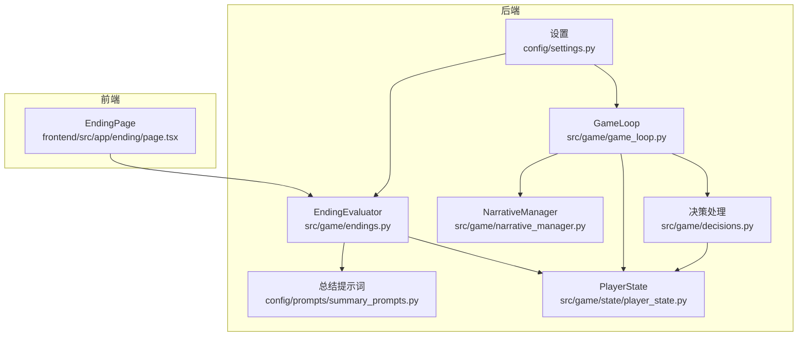
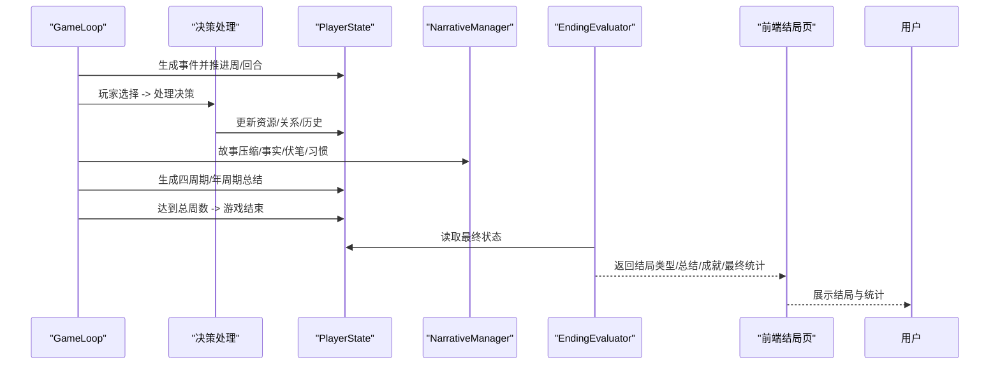
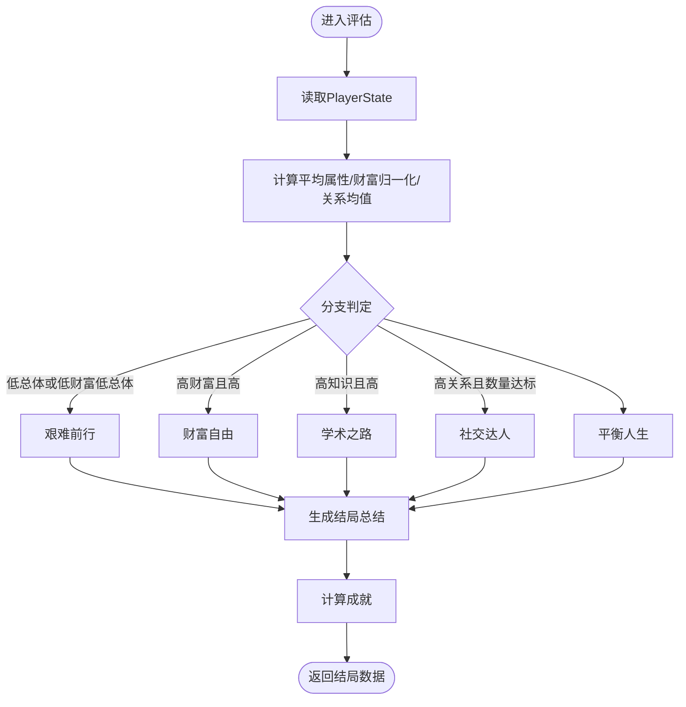
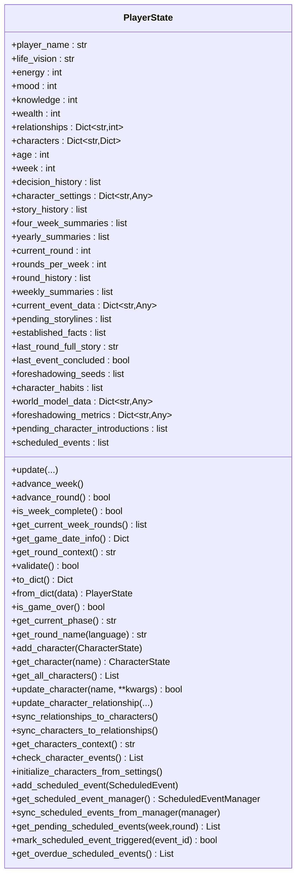
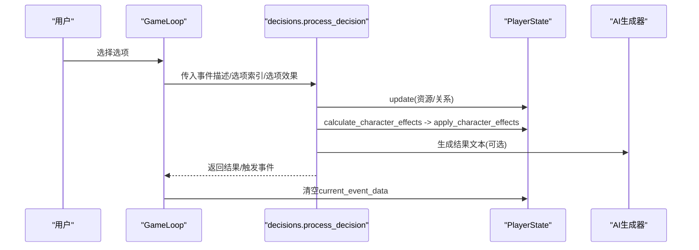
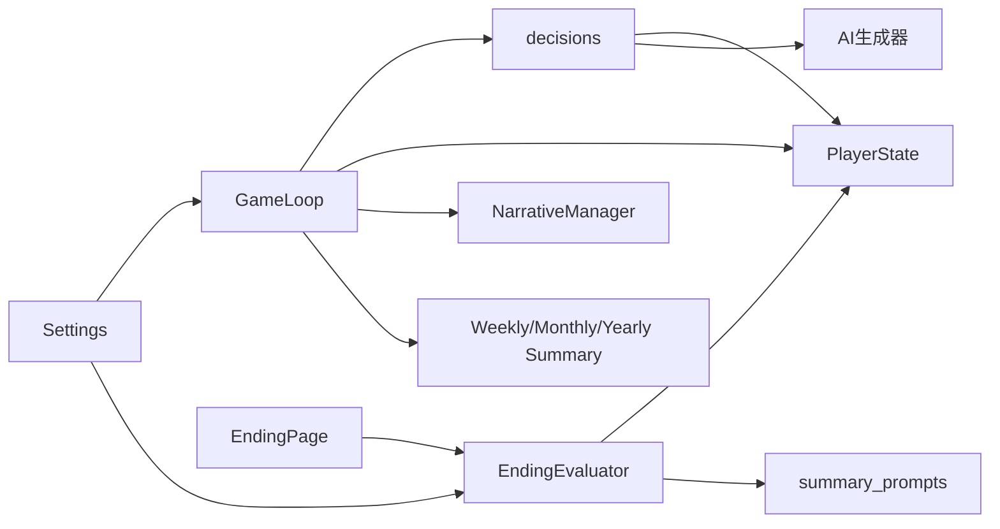

# 结局系统扩展

<cite>
**本文档引用的文件**
- [src/game/endings.py](file://src/game/endings.py)
- [src/game/state/player_state.py](file://src/game/state/player_state.py)
- [src/game/state/character_state.py](file://src/game/state/character_state.py)
- [src/game/decisions.py](file://src/game/decisions.py)
- [src/game/game_loop.py](file://src/game/game_loop.py)
- [src/game/narrative_manager.py](file://src/game/narrative_manager.py)
- [src/game/weekly_summary.py](file://src/game/weekly_summary.py)
- [src/game/monthly_summary.py](file://src/game/monthly_summary.py)
- [src/game/yearly_summary.py](file://src/game/yearly_summary.py)
- [config/settings.py](file://config/settings.py)
- [config/prompts/summary_prompts.py](file://config/prompts/summary_prompts.py)
- [frontend/src/app/ending/page.tsx](file://frontend/src/app/ending/page.tsx)
- [src/game/achievements.py](file://src/game/achievements.py)
</cite>

## 目录
1. [简介](#简介)
2. [项目结构](#项目结构)
3. [核心组件](#核心组件)
4. [架构总览](#架构总览)
5. [详细组件分析](#详细组件分析)
6. [依赖关系分析](#依赖关系分析)
7. [性能考量](#性能考量)
8. [故障排查指南](#故障排查指南)
9. [结论](#结论)
10. [附录](#附录)

## 简介
本指南面向希望扩展“结局系统”的开发者，围绕结局条件定制、分支逻辑、解锁机制、结局类型设计、权重系统、触发器、序列化机制、多结局系统、统计分析与收集、数据结构扩展、验证规则、展示组件、平衡性与多样性策略、以及完整示例与测试方法进行系统化说明。目标是在不破坏现有架构的前提下，安全、可维护地增加新的结局类型与机制。

## 项目结构
结局系统位于后端 Python 模块与前端页面之间，通过统一的状态对象 PlayerState 串联：
- 后端核心：src/game/endings.py（结局评估与生成）、src/game/state/player_state.py（全局状态）、src/game/decisions.py（决策与角色影响）、src/game/game_loop.py（主循环与事件生成）、src/game/narrative_manager.py（叙事与世界模型）、config/prompts/summary_prompts.py（结局提示词）、config/settings.py（全局常量）。
- 前端展示：frontend/src/app/ending/page.tsx（结局页渲染）。

**图表来源**
- [src/game/endings.py](file://src/game/endings.py#L1-L287)
- [src/game/state/player_state.py](file://src/game/state/player_state.py#L1-L590)
- [src/game/decisions.py](file://src/game/decisions.py#L1-L271)
- [src/game/game_loop.py](file://src/game/game_loop.py#L1-L592)
- [src/game/narrative_manager.py](file://src/game/narrative_manager.py#L1-L584)
- [config/prompts/summary_prompts.py](file://config/prompts/summary_prompts.py#L1-L972)
- [config/settings.py](file://config/settings.py#L1-L168)
- [frontend/src/app/ending/page.tsx](file://frontend/src/app/ending/page.tsx#L1-L172)

**章节来源**
- [src/game/endings.py](file://src/game/endings.py#L1-L287)
- [src/game/state/player_state.py](file://src/game/state/player_state.py#L1-L590)
- [src/game/decisions.py](file://src/game/decisions.py#L1-L271)
- [src/game/game_loop.py](file://src/game/game_loop.py#L1-L592)
- [src/game/narrative_manager.py](file://src/game/narrative_manager.py#L1-L584)
- [config/prompts/summary_prompts.py](file://config/prompts/summary_prompts.py#L1-L972)
- [config/settings.py](file://config/settings.py#L1-L168)
- [frontend/src/app/ending/page.tsx](file://frontend/src/app/ending/page.tsx#L1-L172)

## 核心组件
- 结局评估器（EndingEvaluator）：负责根据 PlayerState 的最终状态判定结局类型、生成结局总结与成就列表。
- 玩家状态（PlayerState）：承载全局状态（资源、关系、时间、决策历史、四周期/年周期总结、角色系统等），是结局评估的唯一输入。
- 决策系统（decisions）：将玩家选择转化为对自身与角色的影响，驱动结局条件。
- 游戏循环（game_loop）：控制事件生成、周推进、总结生成，间接影响结局。
- 前端结局页（EndingPage）：接收并展示结局数据。

**章节来源**
- [src/game/endings.py](file://src/game/endings.py#L12-L96)
- [src/game/state/player_state.py](file://src/game/state/player_state.py#L15-L347)
- [src/game/decisions.py](file://src/game/decisions.py#L135-L240)
- [src/game/game_loop.py](file://src/game/game_loop.py#L26-L98)
- [frontend/src/app/ending/page.tsx](file://frontend/src/app/ending/page.tsx#L14-L171)

## 架构总览
结局系统的关键流程如下：

**图表来源**
- [src/game/game_loop.py](file://src/game/game_loop.py#L161-L358)
- [src/game/decisions.py](file://src/game/decisions.py#L135-L240)
- [src/game/narrative_manager.py](file://src/game/narrative_manager.py#L22-L95)
- [src/game/endings.py](file://src/game/endings.py#L47-L95)
- [frontend/src/app/ending/page.tsx](file://frontend/src/app/ending/page.tsx#L21-L32)

## 详细组件分析

### 结局评估器（EndingEvaluator）
- 结局类型：内置“平衡人生”“财富自由”“学术之路”“社交达人”“艰难前行”，可通过 ENDING_TYPES 扩展。
- 评分维度：平均属性、财富归一化、关系均值。
- 分支逻辑：按阈值判定，优先级为“艰难前行”“财富自由”“学术之路”“社交达人”“平衡人生”。
- 总结生成：优先使用 AI 生成，失败回退模板。
- 成就计算：基于财富、知识、关系数量、决策数、完美周数等。

**图表来源**
- [src/game/endings.py](file://src/game/endings.py#L47-L122)
- [src/game/endings.py](file://src/game/endings.py#L124-L286)

**章节来源**
- [src/game/endings.py](file://src/game/endings.py#L12-L122)
- [src/game/endings.py](file://src/game/endings.py#L124-L286)

### 玩家状态（PlayerState）
- 核心字段：能量、情绪、学识、财富、年龄、周数、决策历史、角色系统、四周期/年周期总结、回合系统、世界模型数据、伏笔系统、习惯追踪、预定事件等。
- 方法：更新资源、推进周/回合、构建回合上下文、校验状态、序列化/反序列化、判断游戏结束、获取当前阶段与回合名等。
- 与结局的关系：作为 EndingEvaluator 的唯一输入，承载所有结局判定依据。

**图表来源**
- [src/game/state/player_state.py](file://src/game/state/player_state.py#L15-L590)

**章节来源**
- [src/game/state/player_state.py](file://src/game/state/player_state.py#L15-L590)

### 决策系统（decisions）
- 将玩家选择的效果映射到自身资源与角色关系变化。
- 计算角色影响：从 effects 中提取 relationships 与 character_effects，转换为 affinity/trust/respect/mood 的变化。
- 应用角色影响：调用 PlayerState 的关系更新方法，并检查角色特殊事件触发。
- 记录决策历史：包含周数、事件、选择、效果与角色效果。
- 生成结果文本：优先 AI，失败回退模板。

**图表来源**
- [src/game/decisions.py](file://src/game/decisions.py#L135-L240)
- [src/game/game_loop.py](file://src/game/game_loop.py#L266-L307)

**章节来源**
- [src/game/decisions.py](file://src/game/decisions.py#L14-L107)
- [src/game/decisions.py](file://src/game/decisions.py#L135-L240)

### 游戏循环（game_loop）
- 控制事件生成、周推进、四周期/年周期总结生成、衰减、里程碑事件等。
- 在周推进时保存故事、应用衰减、生成周期总结。
- 通过 AI 生成器调用各类总结生成器（周/月/年）。

**章节来源**
- [src/game/game_loop.py](file://src/game/game_loop.py#L161-L444)
- [src/game/game_loop.py](file://src/game/game_loop.py#L458-L504)

### 前端结局页（EndingPage）
- 通过 API 获取结局数据（包含结局类型、名称、总结、成就、最终统计）。
- 渲染结局故事、最终状态指标、人际关系、成就列表。
- 提供“返回首页/开始新人生”操作。

**章节来源**
- [frontend/src/app/ending/page.tsx](file://frontend/src/app/ending/page.tsx#L14-L171)

## 依赖关系分析
- EndingEvaluator 依赖 PlayerState、AI 生成器与提示词模块，输出结局数据。
- decisions 依赖 PlayerState 与 AI 生成器，更新状态并触发角色事件。
- game_loop 协调事件生成、周推进、总结生成与状态持久化。
- narrative_manager 负责故事线、事实、伏笔与习惯的维护，间接影响结局的叙事层面。
- 设置模块提供全局常量（如周数、回合数、衰减等），影响结局的触发条件与权重。

**图表来源**
- [src/game/endings.py](file://src/game/endings.py#L1-L287)
- [src/game/decisions.py](file://src/game/decisions.py#L1-L271)
- [src/game/game_loop.py](file://src/game/game_loop.py#L1-L592)
- [src/game/narrative_manager.py](file://src/game/narrative_manager.py#L1-L584)
- [config/prompts/summary_prompts.py](file://config/prompts/summary_prompts.py#L1-L972)
- [config/settings.py](file://config/settings.py#L1-L168)
- [frontend/src/app/ending/page.tsx](file://frontend/src/app/ending/page.tsx#L1-L172)

**章节来源**
- [src/game/endings.py](file://src/game/endings.py#L1-L287)
- [src/game/decisions.py](file://src/game/decisions.py#L1-L271)
- [src/game/game_loop.py](file://src/game/game_loop.py#L1-L592)
- [src/game/narrative_manager.py](file://src/game/narrative_manager.py#L1-L584)
- [config/prompts/summary_prompts.py](file://config/prompts/summary_prompts.py#L1-L972)
- [config/settings.py](file://config/settings.py#L1-L168)
- [frontend/src/app/ending/page.tsx](file://frontend/src/app/ending/page.tsx#L1-L172)

## 性能考量
- AI 生成成本：结局总结与中间总结均可能调用大模型，建议在生产环境启用缓存与合理的温度/令牌限制。
- 状态规模：PlayerState 字段众多，序列化/反序列化与网络传输需注意体积控制。
- 周期总结：四周期/年周期总结在长期内会累积，应定期清理或限制长度。
- 并发与超时：设置模块提供生成超时配置，避免长时间阻塞。

[本节为通用指导，无需列出具体文件来源]

## 故障排查指南
- AI 生成失败：EndingEvaluator 会在生成总结失败时回退到模板，同时记录警告日志。检查提示词与系统提示是否正确加载。
- 状态越界：PlayerState 的 validate 方法会抛出异常，检查 update 与衰减逻辑。
- 事件未完结：NarrativeManager 的故事压缩会判断事件是否完结，若为 false，可能影响后续叙事与结局的连贯性。
- 前端数据缺失：EndingPage 依赖 API 获取结局数据，检查路由与 store 初始化。

**章节来源**
- [src/game/endings.py](file://src/game/endings.py#L124-L223)
- [src/game/state/player_state.py](file://src/game/state/player_state.py#L318-L338)
- [src/game/narrative_manager.py](file://src/game/narrative_manager.py#L187-L285)
- [frontend/src/app/ending/page.tsx](file://frontend/src/app/ending/page.tsx#L21-L32)

## 结论
结局系统以 PlayerState 为核心，通过 EndingEvaluator 将最终状态转化为结局类型、总结与成就。扩展时应遵循“状态驱动、规则清晰、可回退、可验证”的原则，确保新结局类型与权重不会破坏现有平衡。通过合理利用决策系统、周期总结与前端展示组件，可实现多样化的结局体验与良好的玩家反馈。

[本节为总结性内容，无需列出具体文件来源]

## 附录

### 定制新的结局条件步骤
- 扩展结局类型：在 ENDING_TYPES 中新增键值对，包含英文与中文名称。
- 新增判定分支：在 _determine_ending_type 中添加新的阈值与优先级逻辑。
- 新增权重系统：在评估函数中引入新权重变量，结合现有平均属性/财富/关系进行加权计算。
- 新增触发器：在决策处理或游戏循环中，基于 PlayerState 的新字段触发新结局条件。
- 新增序列化机制：在 PlayerState 中新增字段并在 to_dict/from_dict 中处理。
- 新增统计与收集：在 EndingEvaluator 或 AchievementTracker 中新增统计项与收集逻辑。
- 新增验证规则：在 PlayerState.validate 或自定义校验函数中加入新字段约束。
- 新增展示组件：在前端 EndingPage 中新增对应 UI 与数据绑定。

**章节来源**
- [src/game/endings.py](file://src/game/endings.py#L15-L122)
- [src/game/state/player_state.py](file://src/game/state/player_state.py#L340-L347)
- [src/game/achievements.py](file://src/game/achievements.py#L14-L75)
- [frontend/src/app/ending/page.tsx](file://frontend/src/app/ending/page.tsx#L82-L140)

### 多结局系统实现要点
- 条件并行：允许多个结局条件同时存在，通过权重排序确定最终结局。
- 分支隔离：确保不同结局分支互不影响，避免条件竞争。
- 数据隔离：为每种结局类型维护独立的统计与收集字段。
- 可观测性：在前端与后端均提供结局分支的可视化与调试信息。

[本节为概念性内容，无需列出具体文件来源]

### 结局平衡性与多样性策略
- 平衡性：通过设置模块调整衰减、回合数与阈值，使结局分布符合预期。
- 多样性：引入随机因素（如随机权重扰动）、角色事件触发、伏笔系统等，增加结局变体。
- 玩家体验：提供结局预览、成就提示与统计面板，增强反馈与重玩价值。

**章节来源**
- [config/settings.py](file://config/settings.py#L75-L105)
- [src/game/narrative_manager.py](file://src/game/narrative_manager.py#L187-L285)

### 结局扩展完整示例（步骤化）
- 步骤1：在 ENDING_TYPES 中新增类型键值对。
- 步骤2：在 _determine_ending_type 中添加判定分支。
- 步骤3：在 EndingEvaluator.evaluate_ending 中扩展最终统计字段。
- 步骤4：在 PlayerState 中新增必要字段并完善 to_dict/from_dict。
- 步骤5：在前端 EndingPage 中新增展示逻辑。
- 步骤6：编写单元测试与集成测试，验证新结局类型在不同状态下的表现。

**章节来源**
- [src/game/endings.py](file://src/game/endings.py#L15-L95)
- [src/game/state/player_state.py](file://src/game/state/player_state.py#L340-L347)
- [frontend/src/app/ending/page.tsx](file://frontend/src/app/ending/page.tsx#L46-L140)

### 结局测试验证方法
- 单元测试：针对 EndingEvaluator 的分支逻辑与统计计算进行断言。
- 集成测试：模拟不同 PlayerState 输入，验证结局类型与总结文本。
- 回归测试：在新增结局类型后运行既有测试，确保不破坏原有逻辑。
- 前端测试：验证 EndingPage 对新结局字段的渲染与交互。

**章节来源**
- [src/game/endings.py](file://src/game/endings.py#L47-L95)
- [frontend/src/app/ending/page.tsx](file://frontend/src/app/ending/page.tsx#L14-L171)