# 资源系统扩展

<cite>
**本文档引用的文件**
- [player_state.py](file://src/game/state/player_state.py)
- [character_state.py](file://src/game/state/character_state.py)
- [settings.py](file://config/settings.py)
- [game_loop.py](file://src/game/game_loop.py)
- [models.py](file://src/database/models.py)
- [StatusBar.tsx](file://frontend/src/components/game/StatusBar.tsx)
- [SettingDisplay.tsx](file://frontend/src/components/game/SettingDisplay.tsx)
- [test_state.py](file://tests/test_state.py)
</cite>

## 目录
1. [简介](#简介)
2. [项目结构](#项目结构)
3. [核心组件](#核心组件)
4. [架构概览](#架构概览)
5. [详细组件分析](#详细组件分析)
6. [依赖关系分析](#依赖关系分析)
7. [性能考虑](#性能考虑)
8. [故障排除指南](#故障排除指南)
9. [结论](#结论)
10. [附录](#附录)

## 简介

本指南面向资源系统的扩展开发者，提供完整的资源系统设计文档。资源系统是游戏的核心机制，负责管理玩家的各项属性状态，包括体力、情绪、知识、财富等基础资源，以及与NPC的关系资源。系统采用统一的资源管理框架，支持资源的增减、衰减、增长、限制和持久化。

资源系统的关键特性包括：
- 统一的资源边界管理（最小值、最大值、无上限资源）
- 周期性资源衰减机制
- 资源间的相互作用和影响
- 多维度资源可视化
- 完整的状态持久化和恢复
- 配置驱动的资源系统扩展

## 项目结构

资源系统在项目中的组织结构如下：

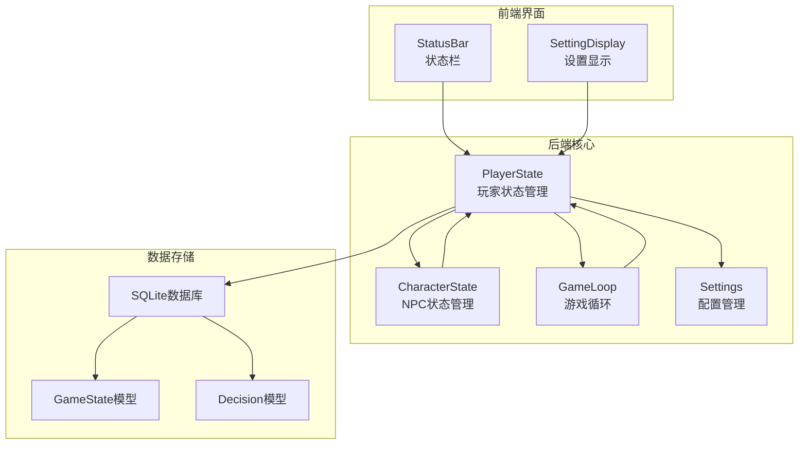

**图表来源**
- [player_state.py](file://src/game/state/player_state.py#L15-L590)
- [character_state.py](file://src/game/state/character_state.py#L13-L243)
- [settings.py](file://config/settings.py#L27-L168)

**章节来源**
- [player_state.py](file://src/game/state/player_state.py#L1-L590)
- [settings.py](file://config/settings.py#L1-L168)

## 核心组件

### 资源系统架构

资源系统采用分层架构设计，主要包含以下核心组件：

#### 1. PlayerState - 玩家状态管理器
负责管理所有玩家相关的资源状态，包括基础资源和NPC关系资源。

#### 2. CharacterState - NPC状态管理器  
管理单个NPC角色的属性状态，包括亲密度、信任度、尊重度等关系属性。

#### 3. Settings - 配置管理系统
提供资源系统的全局配置，包括初始值、边界值、衰减参数等。

#### 4. GameLoop - 游戏循环控制器
协调资源系统的更新和衰减逻辑，管理游戏进程中的资源变化。

**章节来源**
- [player_state.py](file://src/game/state/player_state.py#L15-L590)
- [character_state.py](file://src/game/state/character_state.py#L13-L243)
- [settings.py](file://config/settings.py#L27-L168)

## 架构概览

资源系统的整体架构采用事件驱动的设计模式，通过游戏循环协调各个组件的工作：

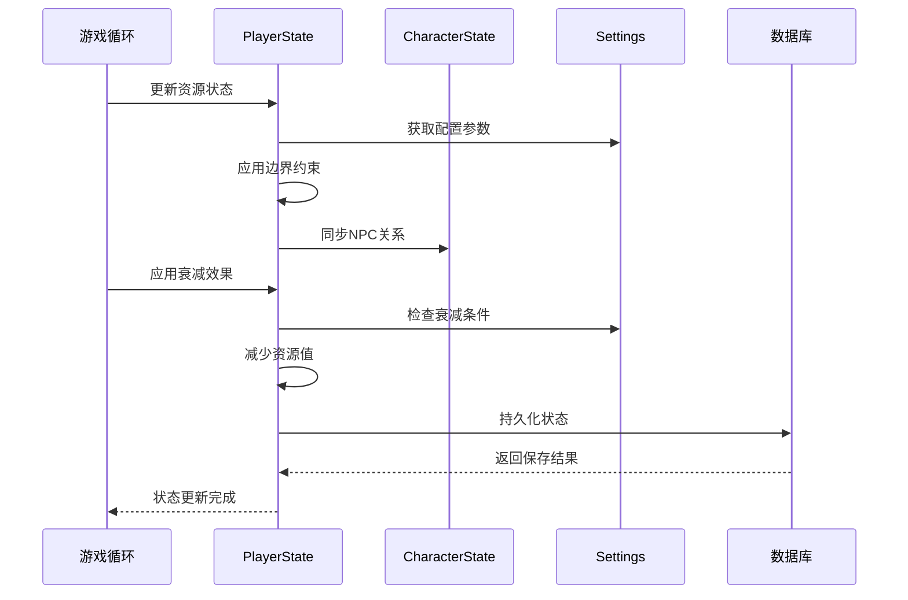

**图表来源**
- [game_loop.py](file://src/game/game_loop.py#L445-L457)
- [player_state.py](file://src/game/state/player_state.py#L159-L196)
- [settings.py](file://config/settings.py#L96-L98)

## 详细组件分析

### PlayerState - 玩家状态管理

PlayerState是资源系统的核心组件，负责管理所有玩家相关的资源状态。

#### 资源类型定义

系统支持多种资源类型，每种资源都有其特定的属性和行为：

| 资源类型 | 数据范围 | 默认值 | 特殊属性 |
|---------|---------|--------|----------|
| energy | 0-100 | 70 | 周期性衰减 |
| mood | 0-100 | 60 | 周期性衰减 |
| knowledge | 0-100 | 50 | 无衰减 |
| wealth | 0-∞ | 10000 | 无上限 |

#### 资源更新机制

资源更新通过统一的update方法实现，支持批量更新多个资源：

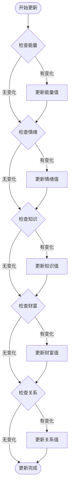

**图表来源**
- [player_state.py](file://src/game/state/player_state.py#L159-L196)

#### 资源边界管理

所有资源都受到严格的边界约束，确保游戏平衡性和合理性：

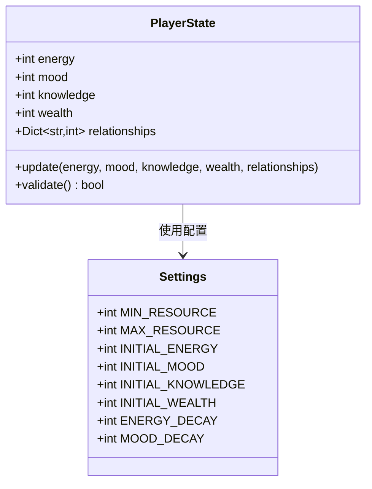

**图表来源**
- [player_state.py](file://src/game/state/player_state.py#L22-L29)
- [settings.py](file://config/settings.py#L91-L98)

**章节来源**
- [player_state.py](file://src/game/state/player_state.py#L15-L590)
- [settings.py](file://config/settings.py#L85-L98)

### CharacterState - NPC状态管理

CharacterState专门管理NPC角色的属性状态，特别是与玩家的关系属性。

#### 关系属性系统

NPC角色具有三个核心关系属性：

| 属性 | 范围 | 用途 | 影响因素 |
|------|------|------|----------|
| affinity | 0-100 | 亲密度 | 互动次数、互动质量 |
| trust | 0-100 | 信任度 | 诚实行为、可靠表现 |
| respect | 0-100 | 尊重度 | 能力表现、品格特征 |

#### 情绪稳定性机制

角色的情绪会受到稳定性的影响，稳定性越高，情绪变化幅度越小：

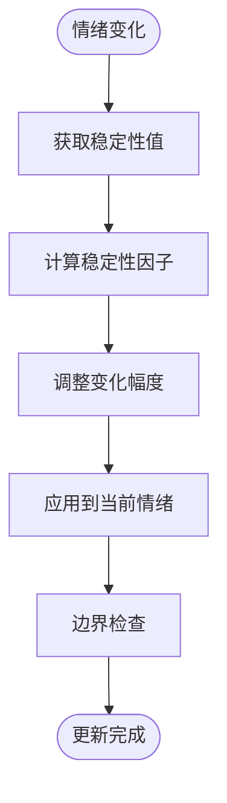

**图表来源**
- [character_state.py](file://src/game/state/character_state.py#L122-L132)

**章节来源**
- [character_state.py](file://src/game/state/character_state.py#L13-L243)

### 资源衰减和增长算法

#### 周期性衰减机制

系统实现了智能的资源衰减机制，根据玩家状态自动调整资源消耗：

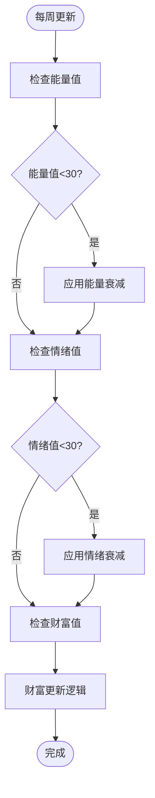

**图表来源**
- [game_loop.py](file://src/game/game_loop.py#L445-L457)

#### 资源增长机制

资源可以通过玩家的选择和行动获得增长，系统提供了灵活的增长机制：

| 增长来源 | 增长方式 | 限制条件 |
|---------|----------|----------|
| 休息 | 自然恢复 | 需要充足睡眠 |
| 学习 | 主动学习 | 需要时间和精力 |
| 社交 | 互动交流 | 需要合适的时机 |
| 工作 | 努力工作 | 需要技能和机会 |

**章节来源**
- [game_loop.py](file://src/game/game_loop.py#L445-L457)

### 资源限制系统

#### 边界约束机制

系统为不同类型资源设置了不同的边界约束：

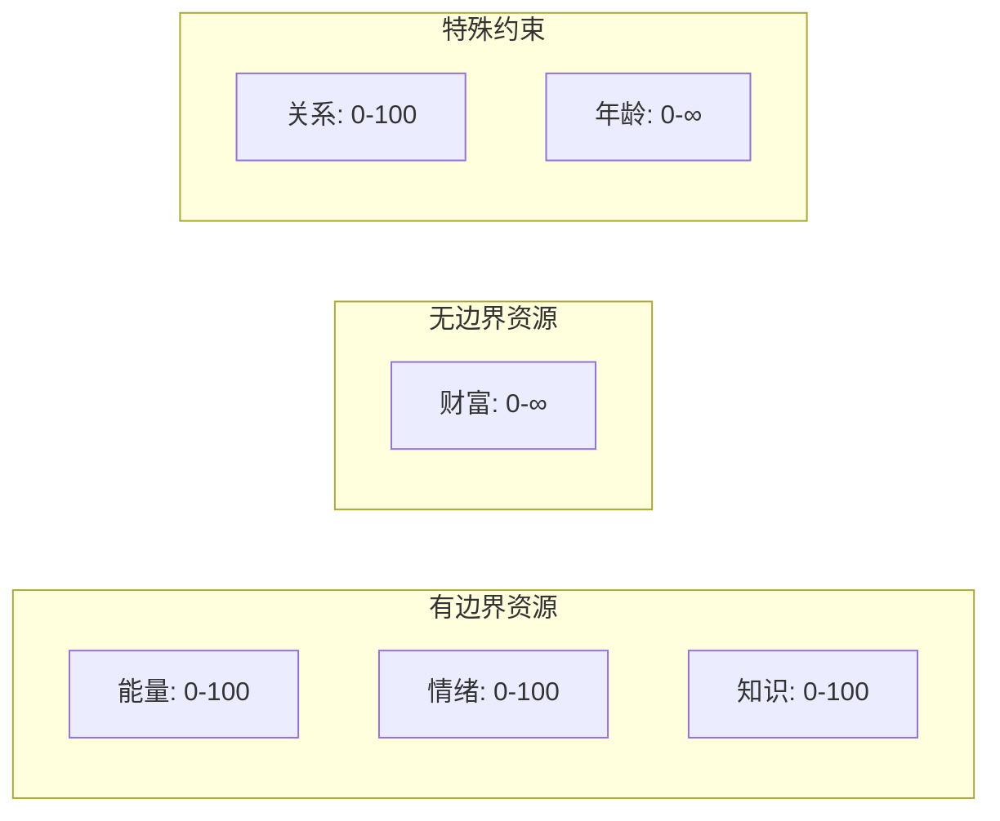

#### 资源验证系统

每次状态更新都会进行完整性验证，确保资源值的有效性：

**章节来源**
- [player_state.py](file://src/game/state/player_state.py#L318-L338)
- [settings.py](file://config/settings.py#L91-L94)

### 资源转换机制

#### 资源间相互作用

不同资源之间存在复杂的相互作用关系：

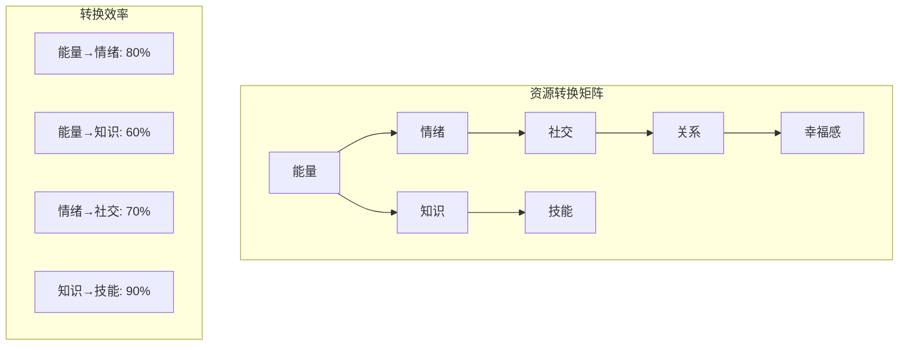

#### 转换公式

资源转换遵循以下通用公式：
```
new_value = old_value + (input_value × conversion_rate × efficiency_factor)
```

其中效率因子考虑了资源的当前状态和目标资源的饱和度。

### 资源状态持久化

#### 数据库模型设计

资源状态通过GameState模型进行持久化存储：

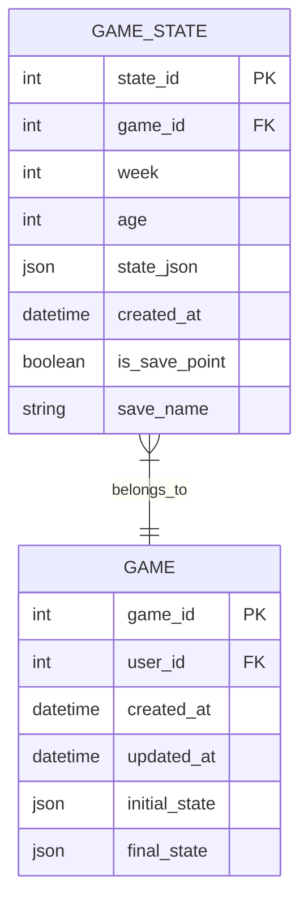

**图表来源**
- [models.py](file://src/database/models.py#L94-L111)

#### 持久化策略

系统采用增量持久化策略，只保存必要的状态变更：

**章节来源**
- [models.py](file://src/database/models.py#L94-L111)

### 资源可视化组件

#### 前端状态显示

前端提供了多种资源可视化组件：

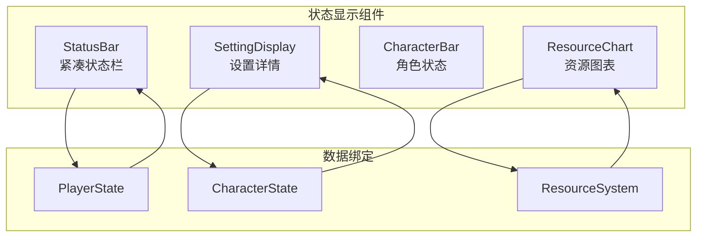

**图表来源**
- [StatusBar.tsx](file://frontend/src/components/game/StatusBar.tsx#L41-L171)
- [SettingDisplay.tsx](file://frontend/src/components/game/SettingDisplay.tsx#L28-L393)

#### 状态栏组件

StatusBar组件提供紧凑的状态显示，适合游戏主界面：

**章节来源**
- [StatusBar.tsx](file://frontend/src/components/game/StatusBar.tsx#L1-L172)

### 资源统计功能

#### 统计指标

系统提供丰富的资源统计功能：

| 统计类型 | 指标 | 计算方式 |
|---------|------|----------|
| 资源分布 | 各资源平均值 | Σvalue/n |
| 资源趋势 | 周增长率 | (current - previous)/previous × 100% |
| 资源相关性 | 资源间相关系数 | Pearson相关系数 |
| 资源平衡性 | 资源方差 | Σ(value - mean)²/n |

#### 统计报告

系统自动生成资源使用报告，帮助玩家了解资源管理效果。

## 依赖关系分析

资源系统各组件之间的依赖关系如下：

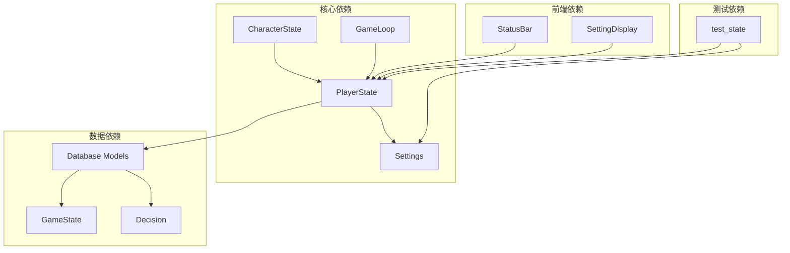

**图表来源**
- [player_state.py](file://src/game/state/player_state.py#L1-L590)
- [settings.py](file://config/settings.py#L1-L168)
- [models.py](file://src/database/models.py#L1-L295)

**章节来源**
- [player_state.py](file://src/game/state/player_state.py#L1-L590)
- [settings.py](file://config/settings.py#L1-L168)
- [models.py](file://src/database/models.py#L1-L295)

## 性能考虑

### 资源系统性能优化

#### 内存管理

- 使用Pydantic模型自动内存管理
- 及时清理不再使用的资源引用
- 避免资源状态的深度复制

#### 计算优化

- 资源更新采用批量处理
- 衰减计算延迟执行
- 缓存常用的配置参数

#### 数据持久化优化

- 增量保存资源状态
- 异步数据库操作
- 连接池管理

## 故障排除指南

### 常见问题及解决方案

#### 资源值异常

**问题症状**：资源值超出正常范围
**可能原因**：
- 资源更新逻辑错误
- 配置参数设置不当
- 数据库持久化失败

**解决步骤**：
1. 检查资源更新调用栈
2. 验证配置参数有效性
3. 查看数据库操作日志

#### 资源衰减异常

**问题症状**：资源没有按预期衰减
**可能原因**：
- 衰减条件判断错误
- 周期性更新逻辑失效
- 配置参数被意外修改

**解决步骤**：
1. 检查衰减条件判断逻辑
2. 验证周期性更新触发
3. 确认配置参数一致性

**章节来源**
- [test_state.py](file://tests/test_state.py#L1-L44)

## 结论

资源系统扩展为游戏提供了强大的基础框架，支持灵活的资源类型定义、智能的资源管理和丰富的可视化功能。通过统一的配置管理和持久化机制，系统能够支持复杂的游戏玩法和平衡性要求。

扩展资源系统的建议：
1. 遵循现有的资源管理模式
2. 充分利用配置系统进行参数化
3. 重视资源间的相互作用设计
4. 确保资源状态的完整性和一致性
5. 提供清晰的资源可视化反馈

## 附录

### 资源系统扩展指南

#### 添加新资源类型的步骤

1. **定义资源属性**
   - 在Settings中添加资源配置
   - 在PlayerState中添加资源字段
   - 设置资源的边界和默认值

2. **实现资源逻辑**
   - 在PlayerState.update中添加资源更新逻辑
   - 实现资源的衰减和增长算法
   - 添加资源验证规则

3. **更新UI组件**
   - 在StatusBar中添加资源显示
   - 实现资源状态的可视化
   - 添加资源交互功能

4. **配置持久化**
   - 更新数据库模型
   - 实现资源状态的序列化
   - 添加数据迁移脚本

#### 资源平衡性测试方法

1. **单元测试**
   ```python
   def test_resource_balance(self):
       # 测试资源增长平衡
       # 测试资源衰减合理性
       # 测试资源间相互作用
   ```

2. **集成测试**
   - 模拟长时间游戏运行
   - 测试资源系统的稳定性
   - 验证资源状态的一致性

3. **性能测试**
   - 测试大量资源同时更新
   - 验证资源系统的响应时间
   - 检查内存使用情况

#### 资源效果量化评估

1. **资源使用效率**
   - 计算资源转换效率
   - 评估资源利用最大化程度
   - 分析资源浪费情况

2. **游戏体验指标**
   - 资源紧张度评估
   - 资源多样性分析
   - 资源挑战性评价

3. **平衡性分析**
   - 资源分布均匀性
   - 资源获取难度平衡
   - 资源使用策略多样性