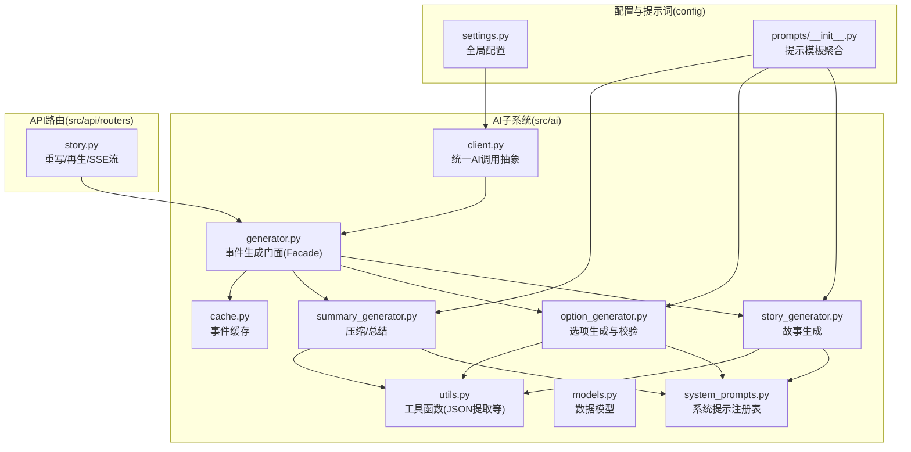
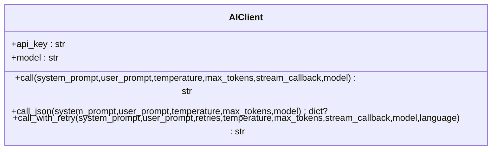
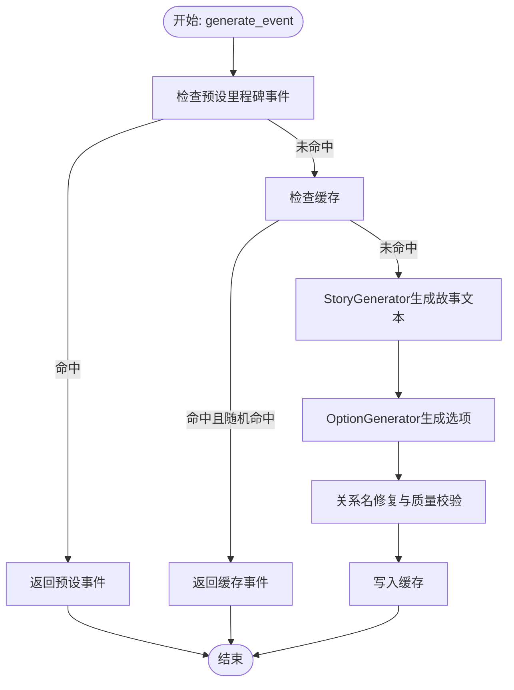
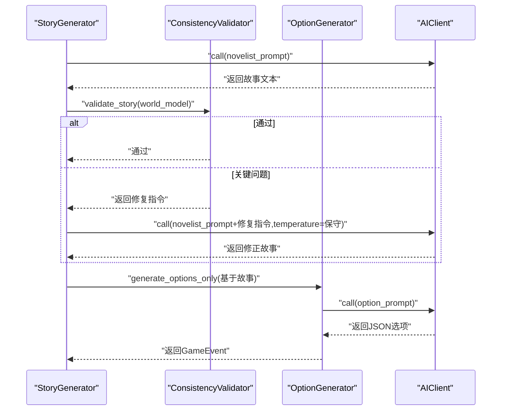
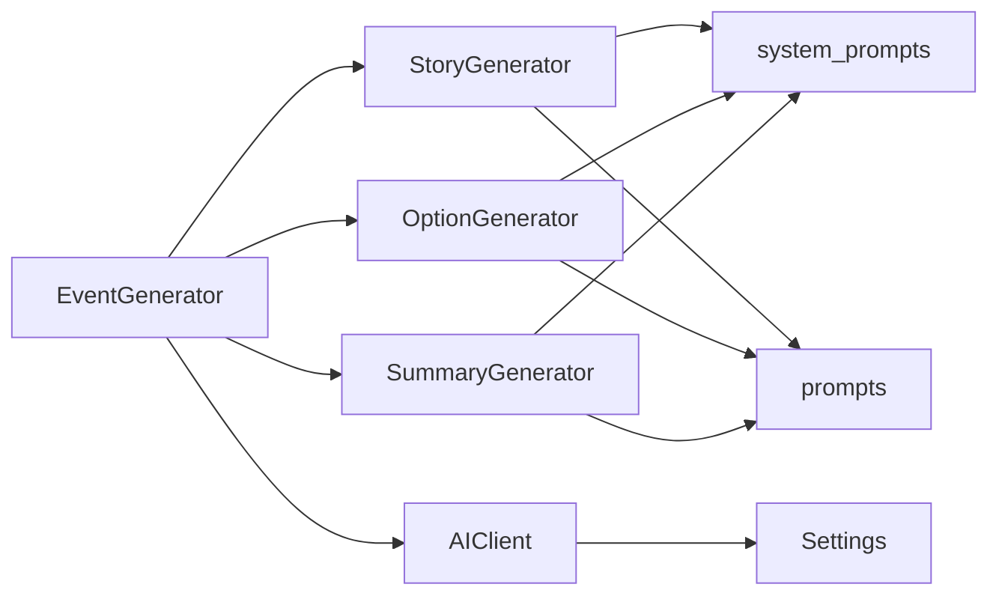

# AI模型集成

<cite>
**本文引用的文件**
- [src/ai/__init__.py](file://src/ai/__init__.py)
- [src/ai/client.py](file://src/ai/client.py)
- [src/ai/models.py](file://src/ai/models.py)
- [src/ai/generator.py](file://src/ai/generator.py)
- [src/ai/system_prompts.py](file://src/ai/system_prompts.py)
- [src/ai/story_generator.py](file://src/ai/story_generator.py)
- [src/ai/option_generator.py](file://src/ai/option_generator.py)
- [src/ai/summary_generator.py](file://src/ai/summary_generator.py)
- [src/ai/utils.py](file://src/ai/utils.py)
- [src/ai/cache.py](file://src/ai/cache.py)
- [config/settings.py](file://config/settings.py)
- [config/prompts/__init__.py](file://config/prompts/__init__.py)
- [src/api/routers/story.py](file://src/api/routers/story.py)
</cite>

## 目录
1. [简介](#简介)
2. [项目结构](#项目结构)
3. [核心组件](#核心组件)
4. [架构总览](#架构总览)
5. [详细组件分析](#详细组件分析)
6. [依赖分析](#依赖分析)
7. [性能考虑](#性能考虑)
8. [故障排查指南](#故障排查指南)
9. [结论](#结论)
10. [附录](#附录)

## 简介
本技术文档面向“AI模型集成”目标，系统化梳理项目中AI子系统的架构设计、模块职责、数据流与处理逻辑，重点覆盖以下方面：
- 统一AI调用抽象层与多模型适配策略
- 提示词工程与系统提示注册表
- 参数配置与性能优化手段
- 认证机制、限流与错误重试策略
- 版本管理、提示词工程与响应解析
- 模型切换、热更新与A/B测试实施方案

该体系以“事件生成”为主线，采用两阶段流水线：先生成故事文本，再基于故事生成选项；同时提供压缩、总结、重写、再生等能力，并内置缓存与一致性校验。

## 项目结构
AI相关代码集中在 src/ai 目录，配置与提示词在 config 下，API路由在 src/api/routers 中。整体组织遵循“按功能域分层”的模块化原则，便于扩展与维护。



图表来源
- [src/ai/client.py](file://src/ai/client.py#L1-L233)
- [src/ai/generator.py](file://src/ai/generator.py#L1-L497)
- [src/ai/system_prompts.py](file://src/ai/system_prompts.py#L1-L279)
- [src/ai/story_generator.py](file://src/ai/story_generator.py#L1-L439)
- [src/ai/option_generator.py](file://src/ai/option_generator.py#L1-L264)
- [src/ai/summary_generator.py](file://src/ai/summary_generator.py#L1-L589)
- [src/ai/utils.py](file://src/ai/utils.py#L1-L77)
- [src/ai/cache.py](file://src/ai/cache.py#L1-L139)
- [config/settings.py](file://config/settings.py#L1-L168)
- [config/prompts/__init__.py](file://config/prompts/__init__.py#L1-L121)
- [src/api/routers/story.py](file://src/api/routers/story.py#L1-L210)

章节来源
- [src/ai/__init__.py](file://src/ai/__init__.py#L1-L18)
- [config/prompts/__init__.py](file://config/prompts/__init__.py#L1-L121)

## 核心组件
- 统一AI调用抽象层(AIClient)
  - 封装OpenAI客户端，提供同步/流式调用、JSON解析、带错误反馈的重试机制
  - 支持动态model覆盖与base_url配置，便于适配不同供应商
- 事件生成门面(EventGenerator)
  - 聚合故事生成、选项生成、压缩/总结、重写/再生等能力
  - 对外暴露向后兼容接口，内部委托至各子服务
- 子服务
  - StoryGenerator：故事文本生成，含一致性校验与重试
  - OptionGenerator：选项生成与关系名修复、质量校验
  - SummaryGenerator：故事压缩、周/四周期/年总结
- 系统提示注册(system_prompts)
  - 统一管理各类系统提示，支持中英文键值对，保障KV缓存稳定性
- 工具与缓存
  - utils.extract_json：鲁棒JSON提取
  - cache.EventCache：事件缓存，降低重复调用成本

章节来源
- [src/ai/client.py](file://src/ai/client.py#L1-L233)
- [src/ai/generator.py](file://src/ai/generator.py#L1-L497)
- [src/ai/story_generator.py](file://src/ai/story_generator.py#L1-L439)
- [src/ai/option_generator.py](file://src/ai/option_generator.py#L1-L264)
- [src/ai/summary_generator.py](file://src/ai/summary_generator.py#L1-L589)
- [src/ai/system_prompts.py](file://src/ai/system_prompts.py#L1-L279)
- [src/ai/utils.py](file://src/ai/utils.py#L1-L77)
- [src/ai/cache.py](file://src/ai/cache.py#L1-L139)

## 架构总览
下图展示从API到AI子系统的调用链路与关键处理节点：

```mermaid
sequenceDiagram
participant Client as "客户端"
participant API as "API路由(story.py)"
participant Gen as "事件生成门面(EventGenerator)"
participant Story as "故事生成(StoryGenerator)"
participant Opt as "选项生成(OptionGenerator)"
participant Sum as "总结生成(SummaryGenerator)"
participant AI as "统一AI调用(AIClient)"
Client->>API : "POST /{game_id}/rewrite 或 /regenerate"
API->>Gen : "调用重写/再生/聊天"
Gen->>Story : "generate_event/generate_round_event"
Story->>AI : "call(system_prompt,user_prompt,temperature,...)"
AI-->>Story : "返回故事文本"
Story->>Opt : "generate_options_only(基于故事)"
Opt->>AI : "call(system_prompt,user_prompt,temperature)"
AI-->>Opt : "返回JSON选项"
Opt-->>Story : "返回GameEvent"
Story-->>Gen : "返回GameEvent"
Gen->>Sum : "可选：压缩/总结"
Sum->>AI : "call(system_prompt,user_prompt,temperature)"
AI-->>Sum : "返回JSON/文本"
Sum-->>Gen : "返回汇总结果"
Gen-->>API : "返回处理结果"
API-->>Client : "JSON/SSE响应"
```

图表来源
- [src/api/routers/story.py](file://src/api/routers/story.py#L1-L210)
- [src/ai/generator.py](file://src/ai/generator.py#L1-L497)
- [src/ai/story_generator.py](file://src/ai/story_generator.py#L1-L439)
- [src/ai/option_generator.py](file://src/ai/option_generator.py#L1-L264)
- [src/ai/summary_generator.py](file://src/ai/summary_generator.py#L1-L589)
- [src/ai/client.py](file://src/ai/client.py#L1-L233)

## 详细组件分析

### 统一AI调用抽象层 AIClient
- 职责
  - 封装底层OpenAI SDK，屏蔽供应商差异
  - 提供call/call_json/call_with_retry三种调用方式
  - 支持流式回调与最大token限制
- 关键特性
  - 错误反馈注入：重试时将上次错误追加到用户提示，提升模型自我修正能力
  - 动态模型覆盖：允许单次调用覆盖默认模型
  - 截断告警：当finish_reason为length时发出警告，提示增大max_tokens
- 适配策略
  - 通过OPENAI_BASE_URL与OPENAI_MODEL配置实现“OpenAI兼容”供应商的无缝切换
  - 可扩展为多供应商适配器（当前仅OpenAI）



图表来源
- [src/ai/client.py](file://src/ai/client.py#L1-L233)

章节来源
- [src/ai/client.py](file://src/ai/client.py#L1-L233)
- [config/settings.py](file://config/settings.py#L30-L45)

### 事件生成门面 EventGenerator
- 职责
  - 作为对外唯一入口，聚合故事/选项/压缩/总结/重写/再生等能力
  - 保持向后兼容的公共方法签名
  - 管理缓存与预设事件
- 两阶段流水线
  - Step 1：StoryGenerator生成纯故事文本
  - Step 2：OptionGenerator基于故事生成选项
- 缓存与预设
  - 基于EventCache与预设events.json进行命中与回退



图表来源
- [src/ai/generator.py](file://src/ai/generator.py#L210-L268)
- [src/ai/cache.py](file://src/ai/cache.py#L78-L101)

章节来源
- [src/ai/generator.py](file://src/ai/generator.py#L1-L497)
- [src/ai/cache.py](file://src/ai/cache.py#L1-L139)

### 故事生成 StoryGenerator
- 两阶段流程
  - Step 1：生成故事文本（novelist系统提示）
  - Step 2：生成选项（option_generator系统提示）
- 一致性校验与重试
  - 当提供world_model时，对故事进行一致性验证
  - 仅对“关键问题”触发一次性重试，重试时注入修复指令
- 温度策略
  - 初次生成使用较高温度，随重试次数递减，提升准确性
- 流式输出
  - 首次尝试支持流式回调，重试时不使用流式回调



图表来源
- [src/ai/story_generator.py](file://src/ai/story_generator.py#L334-L426)
- [src/ai/option_generator.py](file://src/ai/option_generator.py#L25-L133)
- [src/ai/client.py](file://src/ai/client.py#L51-L124)

章节来源
- [src/ai/story_generator.py](file://src/ai/story_generator.py#L1-L439)

### 选项生成 OptionGenerator
- 输入：已有故事文本
- 输出：GameEvent（保留原故事，附加选项列表）
- 关系名修复
  - 基于character_settings中的key_people与family_members进行匹配与修复
  - 支持大小写不敏感与角色身份匹配
- 质量校验
  - 确保至少两个选项，为缺失字段补默认值
  - 检查效果数值合理性，避免过大异常值
- 失败回退
  - 无法解析JSON或选项不足时，返回默认选项

章节来源
- [src/ai/option_generator.py](file://src/ai/option_generator.py#L1-L264)

### 压缩与总结 SummaryGenerator
- 故事压缩
  - 返回summary与多项更新字段（剧情线、事实、预示种子、习惯等）
  - 多次重试与回退提取策略，最终保证可读摘要
- 并行压缩
  - narrative压缩与world抽取可并行执行
- 周/四周期/年总结
  - 基于历史回合与决策生成周/年总结文本

章节来源
- [src/ai/summary_generator.py](file://src/ai/summary_generator.py#L1-L589)

### 系统提示注册 system_prompts
- 设计目标
  - 统一管理所有系统提示，保障KV缓存前缀稳定
  - 易于审计与维护，跨调用点一致
- 使用方式
  - 通过get_system_prompt(key, language)获取对应提示
  - 支持中英文双语提示

章节来源
- [src/ai/system_prompts.py](file://src/ai/system_prompts.py#L1-L279)

### 工具与缓存
- JSON提取工具 extract_json
  - 支持纯JSON、代码块包裹、正则提取等多种模式
- 事件缓存 EventCache
  - 基于玩家状态签名生成MD5键，定期随机命中
  - 事件序列化/反序列化，持久化至events_cache.json

章节来源
- [src/ai/utils.py](file://src/ai/utils.py#L1-L77)
- [src/ai/cache.py](file://src/ai/cache.py#L1-L139)

## 依赖分析
- 模块耦合
  - EventGenerator聚合多个子服务，保持高内聚、低耦合
  - 所有AI调用统一经由AIClient，便于替换与扩展
- 外部依赖
  - OpenAI SDK（当前实现）
  - 环境变量与配置(Settings)
  - 提示词模板(prompts)
- 循环依赖
  - 未发现循环导入；各模块职责清晰



图表来源
- [src/ai/generator.py](file://src/ai/generator.py#L1-L66)
- [src/ai/story_generator.py](file://src/ai/story_generator.py#L1-L25)
- [src/ai/option_generator.py](file://src/ai/option_generator.py#L1-L12)
- [src/ai/summary_generator.py](file://src/ai/summary_generator.py#L1-L12)
- [src/ai/client.py](file://src/ai/client.py#L1-L17)
- [config/settings.py](file://config/settings.py#L27-L168)
- [config/prompts/__init__.py](file://config/prompts/__init__.py#L1-L121)

章节来源
- [src/ai/generator.py](file://src/ai/generator.py#L1-L66)
- [src/ai/story_generator.py](file://src/ai/story_generator.py#L1-L25)
- [src/ai/option_generator.py](file://src/ai/option_generator.py#L1-L12)
- [src/ai/summary_generator.py](file://src/ai/summary_generator.py#L1-L12)
- [src/ai/client.py](file://src/ai/client.py#L1-L17)
- [config/settings.py](file://config/settings.py#L27-L168)
- [config/prompts/__init__.py](file://config/prompts/__init__.py#L1-L121)

## 性能考虑
- 温度与令牌上限
  - 故事生成采用渐进式温度衰减，兼顾创意与准确性
  - max_tokens按场景调优，避免截断；截断时给出告警建议
- 流式输出
  - 首次尝试支持流式回调，改善前端交互体验
- 缓存策略
  - 事件缓存按状态签名生成键，定期随机命中，降低API调用频率
- 并行化
  - narrative压缩与world抽取可并行执行，缩短总耗时
- 超时与降级
  - 全局生成超时设置，必要时进行截断回退

章节来源
- [src/ai/story_generator.py](file://src/ai/story_generator.py#L106-L134)
- [src/ai/summary_generator.py](file://src/ai/summary_generator.py#L144-L226)
- [src/ai/cache.py](file://src/ai/cache.py#L78-L101)
- [config/settings.py](file://config/settings.py#L104-L106)

## 故障排查指南
- 常见问题与定位
  - JSON解析失败：检查extract_json是否能正确提取包裹在代码块中的JSON
  - 选项不足或格式错误：查看OptionGenerator的回退逻辑与日志
  - 一致性校验失败：关注ConsistencyValidator的critical/warning级别问题
  - 截断告警：适当提高max_tokens或优化提示词长度
- 日志与可观测性
  - 各模块均输出详细日志，包含输入长度、输出长度、关键中间结果
- 重试策略
  - call_with_retry自动注入上次错误，最多重试指定次数
  - 故事一致性校验仅对关键问题触发一次性重试

章节来源
- [src/ai/utils.py](file://src/ai/utils.py#L10-L77)
- [src/ai/option_generator.py](file://src/ai/option_generator.py#L114-L132)
- [src/ai/story_generator.py](file://src/ai/story_generator.py#L334-L426)
- [src/ai/client.py](file://src/ai/client.py#L159-L233)

## 结论
本AI模型集成为“事件驱动”的叙事系统提供了稳健、可扩展的基础设施。通过统一抽象层、系统化提示词、完善的重试与校验机制，以及缓存与并行化优化，能够在保证质量的同时提升性能与用户体验。未来可在此基础上扩展至多供应商适配器、A/B测试与热更新方案。

## 附录

### 模型选择策略与参数配置
- 模型选择
  - 通过OPENAI_MODEL与OPENAI_BASE_URL配置实现OpenAI兼容供应商的无缝切换
  - 支持在同一环境下按需覆盖单次调用的model参数
- 参数配置
  - 温度：故事生成采用渐进式衰减；压缩/总结采用较低温度
  - 最大tokens：按任务复杂度调整，避免截断
  - 流式输出：首轮尝试启用，重试不使用

章节来源
- [src/ai/client.py](file://src/ai/client.py#L25-L47)
- [src/ai/story_generator.py](file://src/ai/story_generator.py#L106-L134)
- [src/ai/summary_generator.py](file://src/ai/summary_generator.py#L72-L77)

### 认证机制、限流与错误重试
- 认证
  - OPENAI_API_KEY必填，未配置将触发校验异常
- 限流
  - 未内置显式限流逻辑，建议结合上游服务或网关实现
- 错误重试
  - call_with_retry：自动注入错误反馈，最多重试指定次数
  - 故事一致性校验：仅对关键问题触发一次性重试

章节来源
- [config/settings.py](file://config/settings.py#L143-L149)
- [src/ai/client.py](file://src/ai/client.py#L159-L233)
- [src/ai/story_generator.py](file://src/ai/story_generator.py#L334-L426)

### 版本管理、提示词工程与响应解析
- 版本管理
  - system_prompts集中管理，变更需同步更新键值与语言映射
- 提示词工程
  - 通过config/prompts聚合各领域模板，保持提示词复用与一致性
- 响应解析
  - extract_json支持多种包裹形式，增强鲁棒性

章节来源
- [src/ai/system_prompts.py](file://src/ai/system_prompts.py#L242-L279)
- [config/prompts/__init__.py](file://config/prompts/__init__.py#L1-L121)
- [src/ai/utils.py](file://src/ai/utils.py#L10-L77)

### 模型切换、热更新与A/B测试实施方案
- 模型切换
  - 在AIClient层面支持model覆盖；通过配置中心动态下发模型名称
- 热更新
  - system_prompts与提示模板可通过配置文件热加载；事件缓存支持清理与重建
- A/B测试
  - 建议在EventGenerator中引入实验组标识，分别调用不同提示模板或模型参数，收集指标对比效果

章节来源
- [src/ai/generator.py](file://src/ai/generator.py#L52-L66)
- [src/ai/system_prompts.py](file://src/ai/system_prompts.py#L242-L279)
- [src/ai/cache.py](file://src/ai/cache.py#L130-L139)