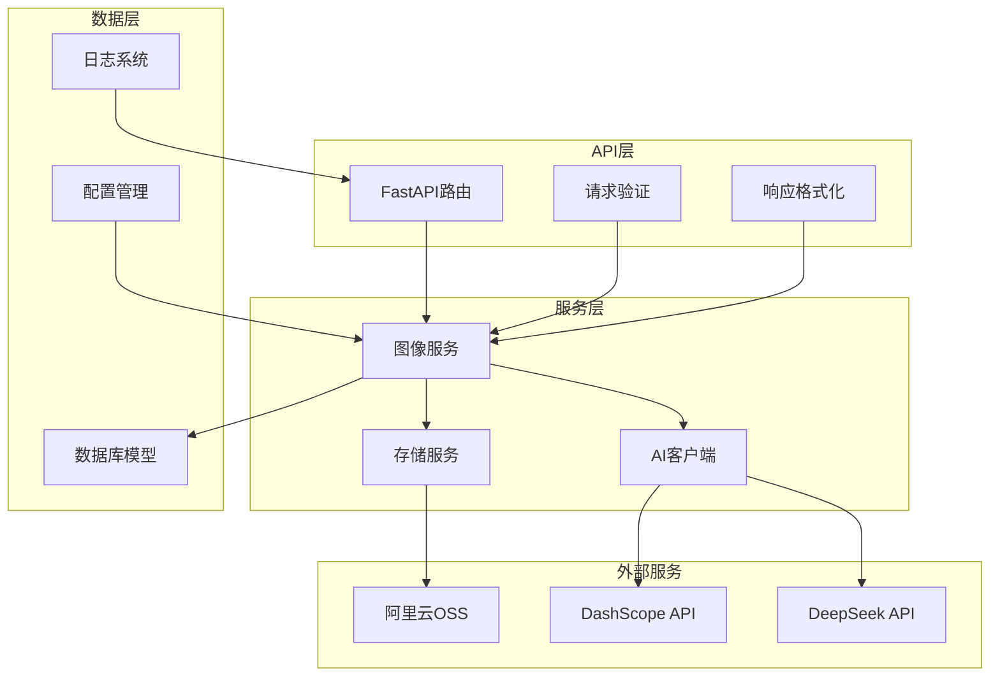
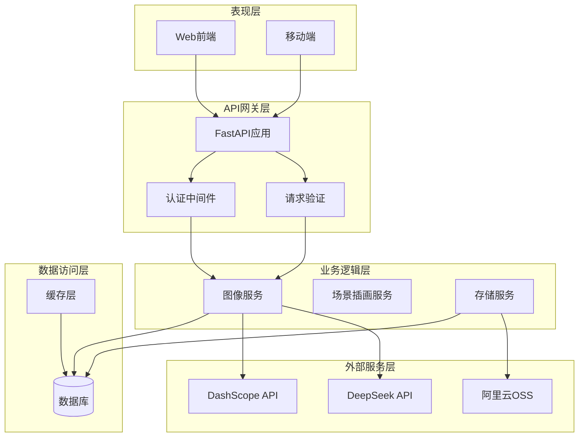
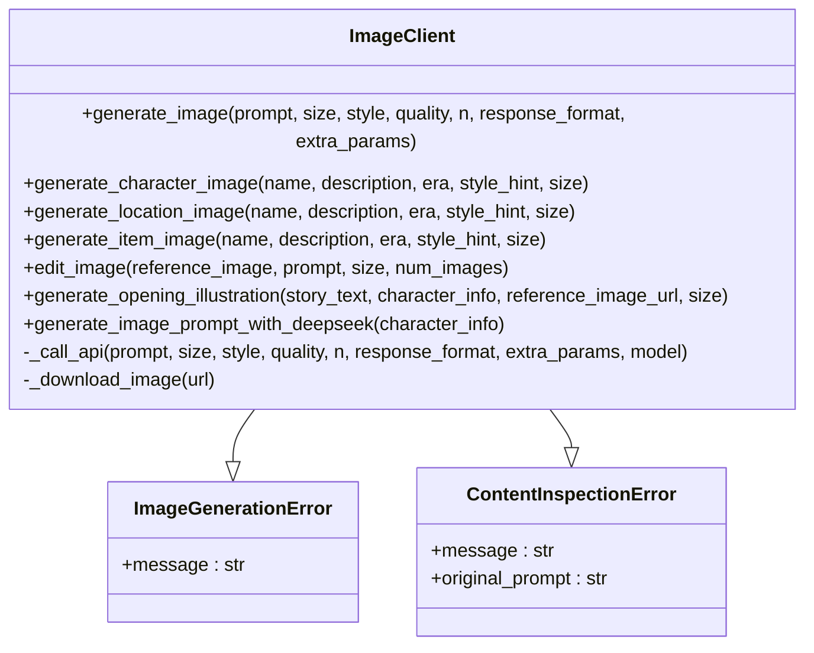
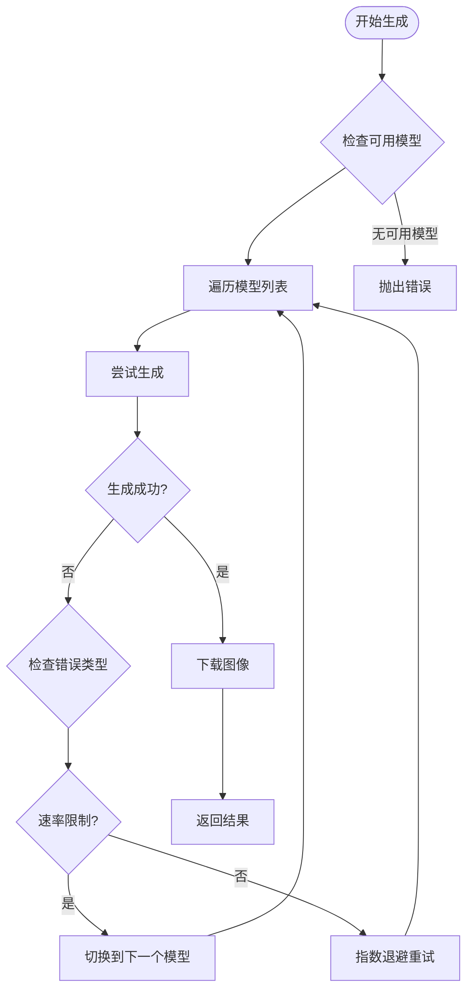
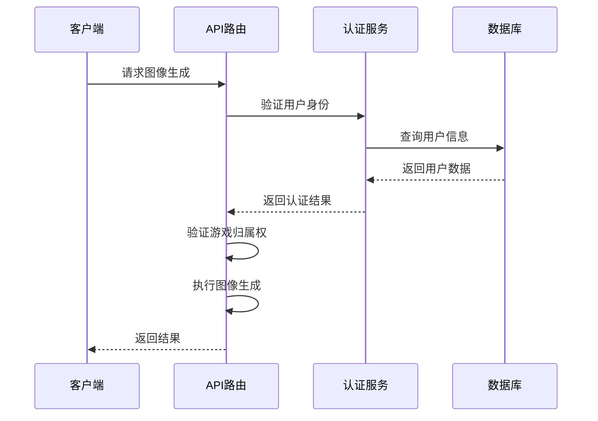
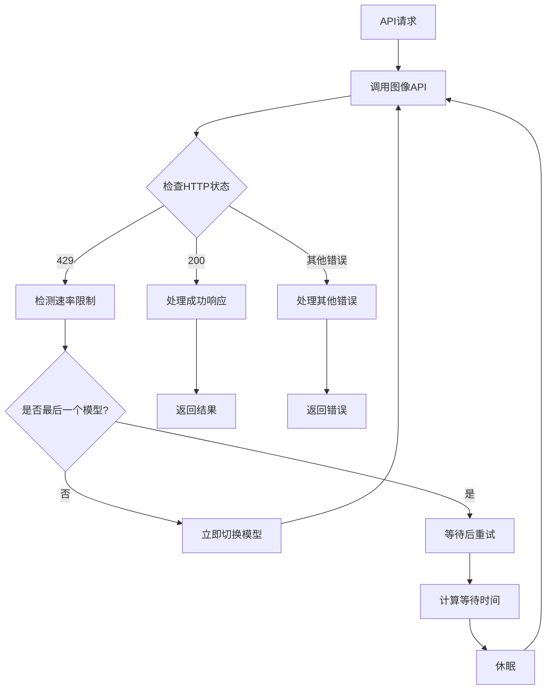
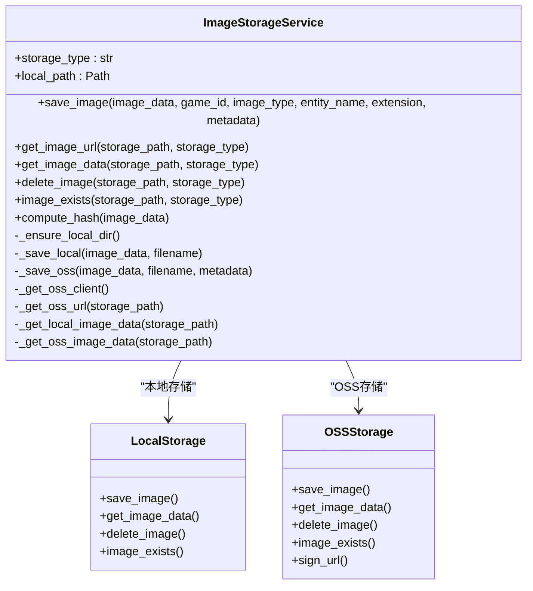
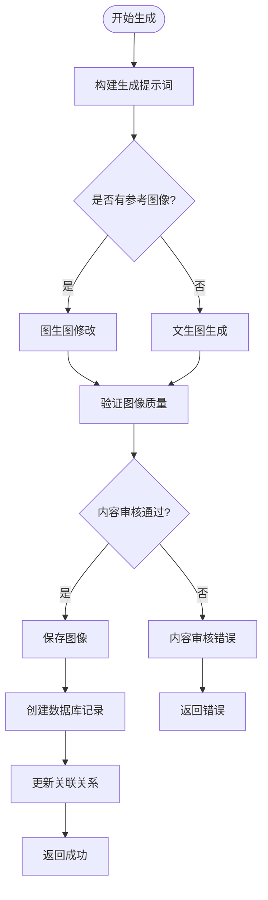
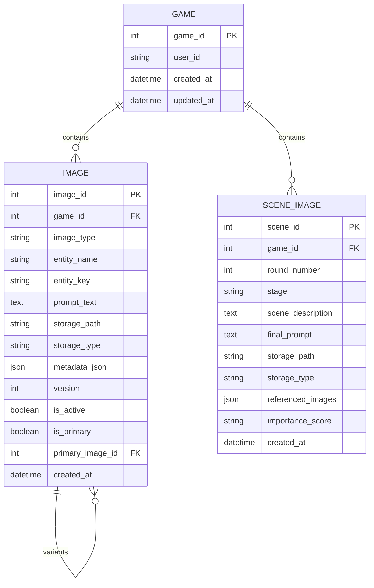
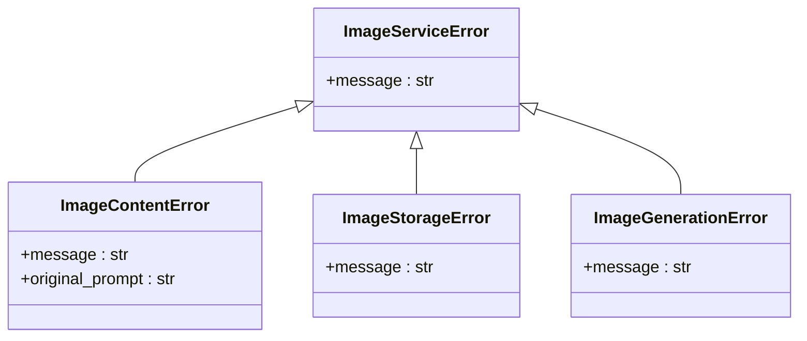

# 图像API集成

<cite>
**本文档引用的文件**
- [src/api/routers/images.py](file://src/api/routers/images.py)
- [src/services/image_service.py](file://src/services/image_service.py)
- [src/services/image_storage.py](file://src/services/image_storage.py)
- [src/ai/image_client.py](file://src/ai/image_client.py)
- [config/settings.py](file://config/settings.py)
- [src/database/models.py](file://src/database/models.py)
- [src/api/schemas.py](file://src/api/schemas.py)
- [src/game/round/illustration_service.py](file://src/game/round/illustration_service.py)
- [config/logging_config.py](file://config/logging_config.py)
- [requirements.txt](file://requirements.txt)
</cite>

## 目录
1. [简介](#简介)
2. [项目结构](#项目结构)
3. [核心组件](#核心组件)
4. [架构概览](#架构概览)
5. [详细组件分析](#详细组件分析)
6. [依赖关系分析](#依赖关系分析)
7. [性能考虑](#性能考虑)
8. [故障排除指南](#故障排除指南)
9. [结论](#结论)

## 简介

本项目是一个完整的图像API集成解决方案，专注于为叙事游戏提供高质量的图像生成、存储和管理服务。系统集成了多种图像生成API适配器，实现了智能的内容审核、限流处理、版本管理和缓存策略，支持本地存储和云存储（阿里云OSS）的无缝切换。

该系统的核心目标是为用户提供流畅的图像生成体验，包括人物形象、场景插画、物品图片等多种类型的图像生成，并确保内容的安全性和合规性。

## 项目结构

项目采用模块化设计，主要分为以下几个层次：



**图表来源**
- [src/api/routers/images.py](file://src/api/routers/images.py#L1-L800)
- [src/services/image_service.py](file://src/services/image_service.py#L1-L800)
- [src/services/image_storage.py](file://src/services/image_storage.py#L1-L375)

**章节来源**
- [src/api/routers/images.py](file://src/api/routers/images.py#L1-L800)
- [src/services/image_service.py](file://src/services/image_service.py#L1-L800)
- [src/services/image_storage.py](file://src/services/image_storage.py#L1-L375)

## 核心组件

### 图像生成路由器

图像API的核心入口，提供了完整的图像生成、管理和检索功能：

- **生成API**: 支持人物、地点、物品三种类型的图像生成
- **重新生成API**: 基于用户反馈和历史版本的智能重新生成
- **批量生成API**: 支持关键人物的批量图像生成
- **场景插画API**: 自动生成每轮对话的场景插画

### 图像服务层

协调图像生成、存储和数据库操作的中枢服务：

- **统一调度**: 统一管理图像生成流程和错误处理
- **版本控制**: 支持图像版本管理和历史追踪
- **权限验证**: 基于游戏和用户身份的访问控制
- **内容审核**: 集成内容安全检查和错误处理

### 存储抽象层

提供统一的图像存储接口，支持多种存储后端：

- **本地存储**: 开发和测试环境的默认选择
- **云存储**: 阿里云OSS的生产环境支持
- **路径管理**: 统一的文件路径和URL生成

**章节来源**
- [src/api/routers/images.py](file://src/api/routers/images.py#L104-L800)
- [src/services/image_service.py](file://src/services/image_service.py#L30-L800)
- [src/services/image_storage.py](file://src/services/image_storage.py#L23-L375)

## 架构概览

系统采用分层架构设计，确保各层职责明确、耦合度低：



**图表来源**
- [src/api/main.py](file://src/api/main.py)
- [src/services/image_service.py](file://src/services/image_service.py#L30-L800)
- [src/services/image_storage.py](file://src/services/image_storage.py#L23-L375)

## 详细组件分析

### 图像生成适配器

系统实现了对多种图像生成API的适配器开发：

#### DashScope API适配器



**图表来源**
- [src/ai/image_client.py](file://src/ai/image_client.py#L30-L800)

系统支持以下图像生成能力：

1. **文生图**: 基于文本描述生成图像
2. **图生图**: 基于参考图像进行修改和扩展
3. **批量生成**: 支持多张图像的并行生成
4. **模型降级**: 自动在多个可用模型间切换

#### 模型降级机制

系统实现了智能的模型降级策略：



**图表来源**
- [src/ai/image_client.py](file://src/ai/image_client.py#L190-L260)

**章节来源**
- [src/ai/image_client.py](file://src/ai/image_client.py#L1-L800)

### 认证机制

系统实现了多层次的认证和授权机制：

#### 用户认证流程



**图表来源**
- [src/api/routers/images.py](file://src/api/routers/images.py#L42-L123)

#### 权限验证策略

系统采用双重验证机制：

1. **用户身份验证**: 确保请求来自有效用户
2. **游戏归属验证**: 确保用户有权访问指定游戏的数据

**章节来源**
- [src/api/routers/images.py](file://src/api/routers/images.py#L42-L123)

### 限流处理

系统实现了多层级的限流和重试机制：

#### 速率限制检测



**图表来源**
- [src/ai/image_client.py](file://src/ai/image_client.py#L240-L258)

#### 重试策略

系统采用指数退避的重试策略：

- **最大重试次数**: 3次
- **等待时间**: 15秒、30秒、45秒递增
- **模型降级**: 在最后模型上遇到速率限制时才进行等待

**章节来源**
- [src/ai/image_client.py](file://src/ai/image_client.py#L190-L260)

### 图像存储后端

系统提供了灵活的存储后端配置：

#### 存储抽象层



**图表来源**
- [src/services/image_storage.py](file://src/services/image_storage.py#L23-L375)

#### 存储配置

系统支持两种存储模式：

1. **本地存储模式**
   - 适用于开发和测试环境
   - 自动创建存储目录
   - 相对路径管理

2. **OSS存储模式**
   - 适用于生产环境
   - 自动签名URL生成
   - 支持CDN加速

**章节来源**
- [src/services/image_storage.py](file://src/services/image_storage.py#L23-L375)
- [config/settings.py](file://config/settings.py#L46-L55)

### 图像处理流程

系统实现了完整的图像处理流水线：

#### 图像生成流程



**图表来源**
- [src/services/image_service.py](file://src/services/image_service.py#L98-L181)

#### 内容审核机制

系统集成了多层内容审核：

1. **AI内容检查**: 通过图像生成API的内置审核
2. **反向提示词**: 使用负面提示词避免不良内容
3. **错误分类**: 区分内容审核错误和其他技术错误

**章节来源**
- [src/services/image_service.py](file://src/services/image_service.py#L98-L181)
- [src/ai/image_client.py](file://src/ai/image_client.py#L344-L383)

### 图像版本管理和缓存策略

#### 版本管理系统



**图表来源**
- [src/database/models.py](file://src/database/models.py#L162-L234)

#### 缓存策略

系统实现了多层缓存机制：

1. **数据库缓存**: 使用SQLAlchemy ORM缓存
2. **文件系统缓存**: 本地存储的文件缓存
3. **URL缓存**: OSS签名URL的短期缓存

**章节来源**
- [src/database/models.py](file://src/database/models.py#L162-L234)

### 错误处理、重试机制和性能监控

#### 错误处理架构



**图表来源**
- [src/services/image_service.py](file://src/services/image_service.py#L18-L28)

#### 性能监控

系统集成了全面的性能监控：

1. **日志记录**: 使用Python标准logging模块
2. **错误追踪**: 详细的异常信息记录
3. **性能指标**: 关键操作的执行时间统计

**章节来源**
- [src/services/image_service.py](file://src/services/image_service.py#L18-L28)
- [config/logging_config.py](file://config/logging_config.py#L1-L78)

## 依赖关系分析

系统的关键依赖关系如下：

```mermaid
graph TB
subgraph "核心依赖"
FastAPI[FastAPI >= 0.115.0]
SQLAlchemy[SQLAlchemy >= 2.0.0]
Pydantic[Pydantic >= 2.0.0]
end
subgraph "AI服务依赖"
OpenAI[openai >= 2.0.0]
HTTPX[httpx == 0.27.0]
end
subgraph "存储依赖"
DotEnv[python-dotenv >= 1.0.0]
OSS2[oss2 (阿里云OSS SDK)]
end
subgraph "安全依赖"
JWT[jose >= 3.3.0]
Cryptography[cryptography >= 3.3.0]
end
subgraph "测试依赖"
PyTest[pytest >= 7.0.0]
end
FastAPI --> SQLAlchemy
FastAPI --> Pydantic
OpenAI --> HTTPX
SQLAlchemy --> DotEnv
OSS2 --> DotEnv
JWT --> Cryptography
```

**图表来源**
- [requirements.txt](file://requirements.txt#L1-L12)

**章节来源**
- [requirements.txt](file://requirements.txt#L1-L12)

## 性能考虑

### 并发处理

系统采用了异步处理机制来提升性能：

1. **异步场景插画生成**: 使用线程池避免阻塞主流程
2. **批量图像生成**: 支持多张图像的并行处理
3. **延迟机制**: 在批量操作中添加适当的延迟避免API限流

### 资源管理

1. **数据库连接池**: 使用SQLAlchemy的连接池管理
2. **内存优化**: 及时释放图像数据和临时文件
3. **缓存策略**: 合理的缓存失效和更新策略

### 扩展性设计

1. **插件化架构**: 存储后端和AI服务的可插拔设计
2. **配置驱动**: 通过环境变量和配置文件控制行为
3. **监控友好**: 内置性能指标和错误追踪

## 故障排除指南

### 常见问题及解决方案

#### 图像生成失败

**症状**: API返回500错误，图像生成失败

**可能原因**:
1. API密钥配置错误
2. 网络连接问题
3. 速率限制触发

**解决步骤**:
1. 检查环境变量配置
2. 验证API密钥有效性
3. 查看日志中的错误详情

#### 内容审核错误

**症状**: API返回400错误，提示内容不合规

**解决方法**:
1. 修改描述文本，避免敏感词汇
2. 使用更具体的描述而非模糊表达
3. 参考系统提供的修改建议

#### 存储访问失败

**症状**: 图像无法访问或加载失败

**排查步骤**:
1. 检查存储配置（本地/OSS）
2. 验证文件权限和路径
3. 确认CDN配置（如使用）

**章节来源**
- [src/api/routers/images.py](file://src/api/routers/images.py#L204-L217)
- [src/services/image_service.py](file://src/services/image_service.py#L168-L181)

## 结论

本图像API集成方案提供了一个完整、可扩展且高性能的图像生成解决方案。系统的主要优势包括：

1. **多API适配**: 支持多种图像生成服务，具备智能降级能力
2. **安全可靠**: 完整的内容审核机制和错误处理
3. **灵活存储**: 支持本地和云端存储的无缝切换
4. **版本管理**: 完善的图像版本控制和历史追踪
5. **性能优化**: 异步处理、缓存策略和限流机制

该系统为叙事游戏提供了强大的视觉支持，能够满足从个人创作到商业应用的各种需求。通过合理的架构设计和完善的监控机制，系统具备良好的可维护性和扩展性。