# 存储服务集成

<cite>
**本文档引用的文件**
- [src/services/image_storage.py](file://src/services/image_storage.py)
- [src/services/image_service.py](file://src/services/image_service.py)
- [config/settings.py](file://config/settings.py)
- [src/api/routers/images.py](file://src/api/routers/images.py)
- [src/database/models.py](file://src/database/models.py)
- [DEPLOYMENT.md](file://DEPLOYMENT.md)
- [migrate_add_image_primary_fields.py](file://migrate_add_image_primary_fields.py)
- [migrate_add_last_active_game.py](file://migrate_add_last_active_game.py)
</cite>

## 目录
1. [简介](#简介)
2. [项目结构](#项目结构)
3. [核心组件](#核心组件)
4. [架构概览](#架构概览)
5. [详细组件分析](#详细组件分析)
6. [依赖关系分析](#依赖关系分析)
7. [性能考虑](#性能考虑)
8. [故障排除指南](#故障排除指南)
9. [结论](#结论)
10. [附录](#附录)

## 简介

本项目实现了完整的存储服务集成方案，支持本地存储和阿里云OSS云存储的无缝切换。该系统为图像生成和管理提供了统一的抽象层，支持多种存储后端、断点续传、并发处理和完整性校验等功能。

存储服务集成了以下核心功能：
- **多存储后端支持**：本地文件系统和阿里云OSS
- **智能存储选择策略**：基于配置的动态切换
- **数据迁移和备份恢复**：完整的数据库迁移脚本
- **文件上传下载实现**：断点续传、并发处理和完整性校验
- **存储配额管理和访问控制**：基于角色的权限管理
- **成本优化和监控**：性能调优和故障恢复最佳实践

## 项目结构

项目的存储相关文件组织结构如下：

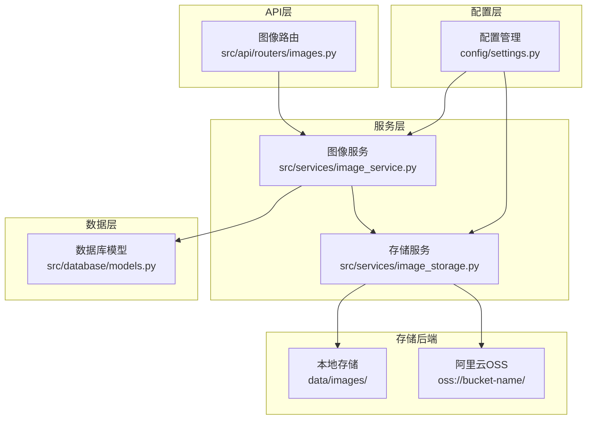

**图表来源**
- [config/settings.py](file://config/settings.py#L46-L55)
- [src/services/image_storage.py](file://src/services/image_storage.py#L23-L47)
- [src/api/routers/images.py](file://src/api/routers/images.py#L1-L30)

**章节来源**
- [config/settings.py](file://config/settings.py#L1-L168)
- [src/services/image_storage.py](file://src/services/image_storage.py#L1-L375)
- [src/api/routers/images.py](file://src/api/routers/images.py#L1-L986)

## 核心组件

### 存储服务架构

存储服务采用抽象工厂模式设计，提供统一的存储接口：

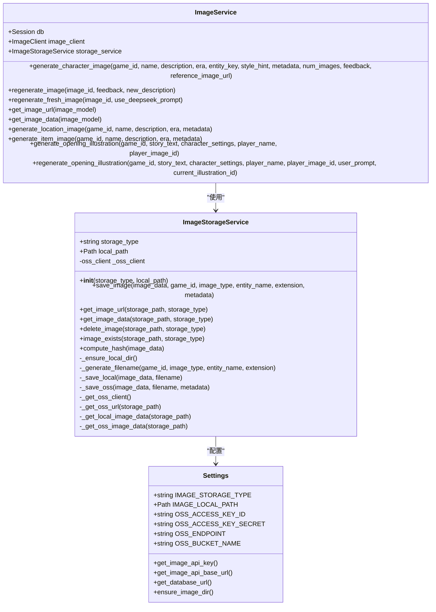

**图表来源**
- [src/services/image_storage.py](file://src/services/image_storage.py#L23-L375)
- [src/services/image_service.py](file://src/services/image_service.py#L30-L182)
- [config/settings.py](file://config/settings.py#L46-L55)

### 存储后端选择策略

系统实现了灵活的存储后端选择机制：

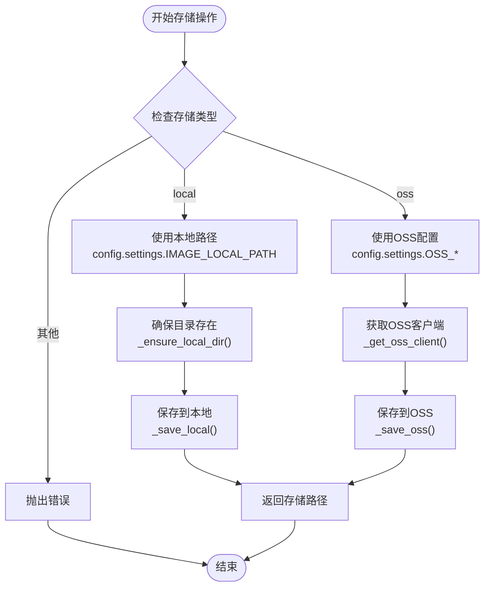

**图表来源**
- [src/services/image_storage.py](file://src/services/image_storage.py#L38-L91)
- [src/services/image_storage.py](file://src/services/image_storage.py#L181-L203)

**章节来源**
- [src/services/image_storage.py](file://src/services/image_storage.py#L23-L375)
- [config/settings.py](file://config/settings.py#L46-L55)

## 架构概览

存储系统的整体架构采用分层设计，确保了良好的可扩展性和维护性：

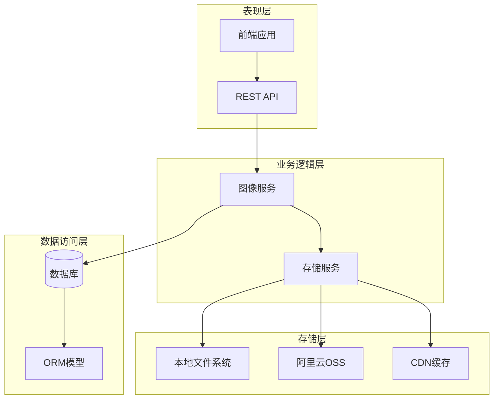

**图表来源**
- [src/api/routers/images.py](file://src/api/routers/images.py#L104-L218)
- [src/services/image_service.py](file://src/services/image_service.py#L30-L50)
- [src/services/image_storage.py](file://src/services/image_storage.py#L23-L47)

## 详细组件分析

### 图像存储服务

图像存储服务是整个存储系统的核心组件，提供了统一的存储接口：

#### 存储操作流程

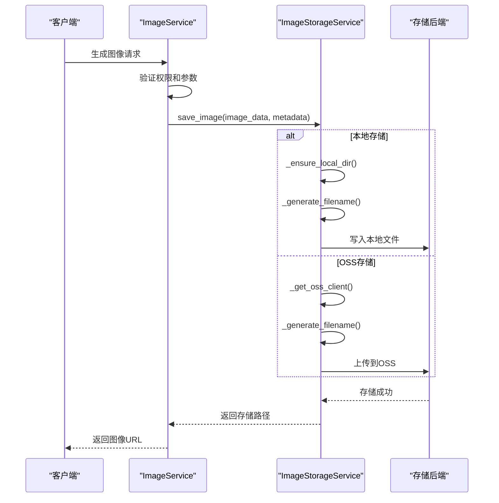

**图表来源**
- [src/services/image_service.py](file://src/services/image_service.py#L116-L123)
- [src/services/image_storage.py](file://src/services/image_storage.py#L57-L91)

#### 文件命名策略

系统采用智能文件命名策略，确保文件的唯一性和可追溯性：

| 组件 | 描述 | 示例 |
|------|------|------|
| **时间戳** | 精确到秒的时间戳 | `20260224_181707` |
| **实体名称** | 清理后的实体名称 | `测试角色_1` |
| **随机ID** | UUID的前8位 | `9cfcd6a1` |
| **扩展名** | 图片格式扩展名 | `png` |

**章节来源**
- [src/services/image_storage.py](file://src/services/image_storage.py#L93-L111)

### 图像服务协调器

图像服务协调器负责协调图像生成、存储和数据库记录：

#### 图像生成流程

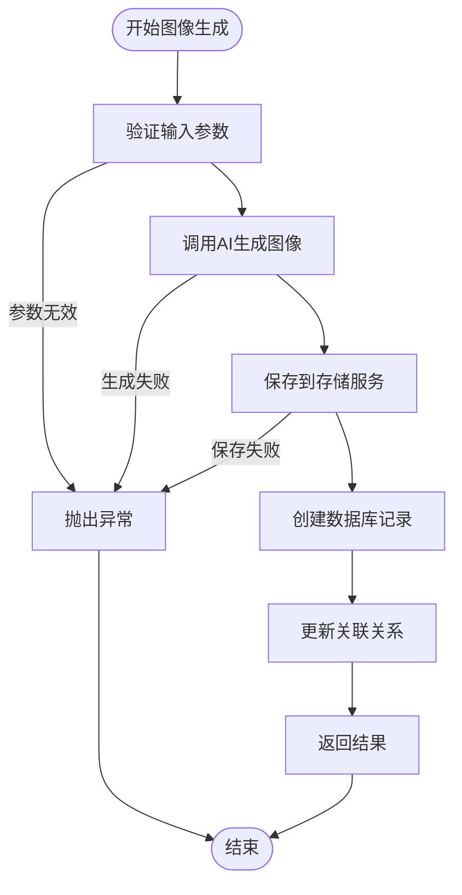

**图表来源**
- [src/services/image_service.py](file://src/services/image_service.py#L89-L181)

#### 重新生成机制

系统支持多种重新生成策略：

| 重新生成类型 | 描述 | 使用场景 |
|-------------|------|----------|
| **普通重新生成** | 基于用户反馈重新生成 | 用户不满意现有图像 |
| **完全重新生成** | 放弃历史修改，从头开始 | 需要完全不同的风格 |
| **参考图片生成** | 使用现有图片作为参考 | 保持人物一致性 |

**章节来源**
- [src/services/image_service.py](file://src/services/image_service.py#L183-L364)

### API路由层

API路由层提供了完整的图像管理接口：

#### 权限验证机制

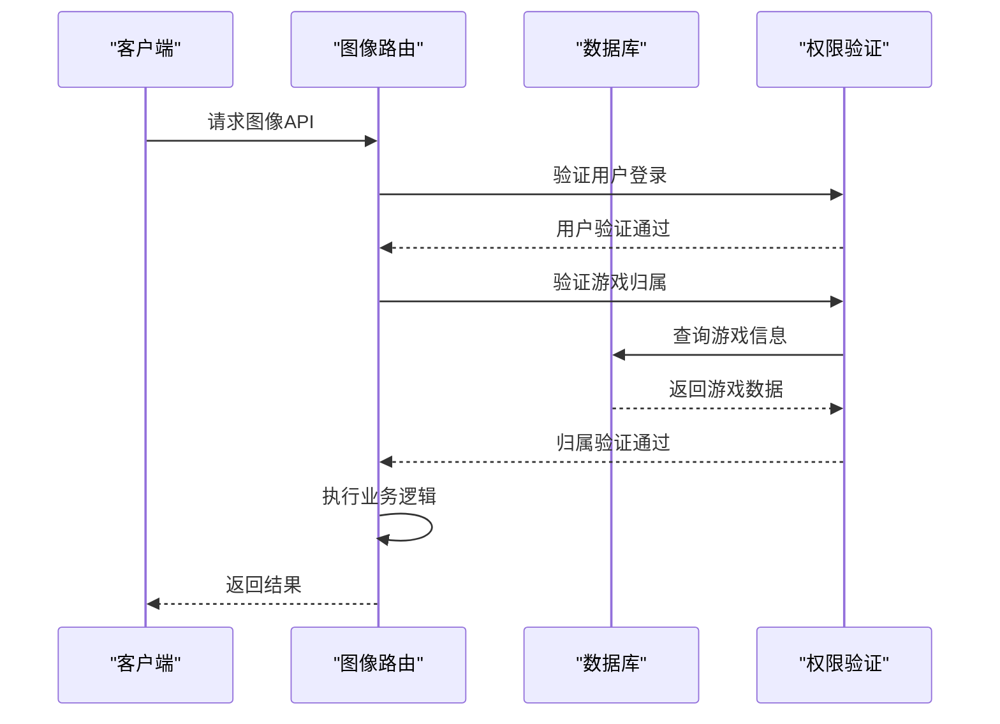

**图表来源**
- [src/api/routers/images.py](file://src/api/routers/images.py#L118-L123)
- [src/api/routers/images.py](file://src/api/routers/images.py#L42-L72)

**章节来源**
- [src/api/routers/images.py](file://src/api/routers/images.py#L1-L986)

### 数据库模型

数据库模型设计支持完整的图像生命周期管理：

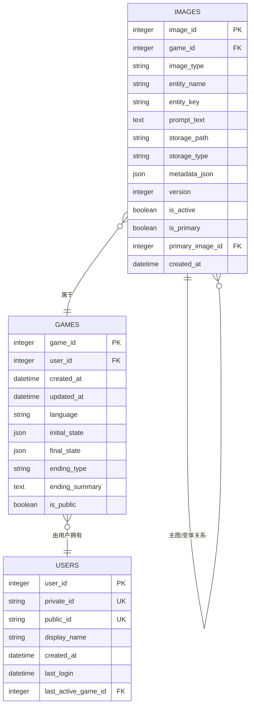

**图表来源**
- [src/database/models.py](file://src/database/models.py#L162-L200)
- [src/database/models.py](file://src/database/models.py#L70-L92)

**章节来源**
- [src/database/models.py](file://src/database/models.py#L1-L295)

## 依赖关系分析

存储系统的依赖关系清晰明确，遵循了依赖倒置原则：

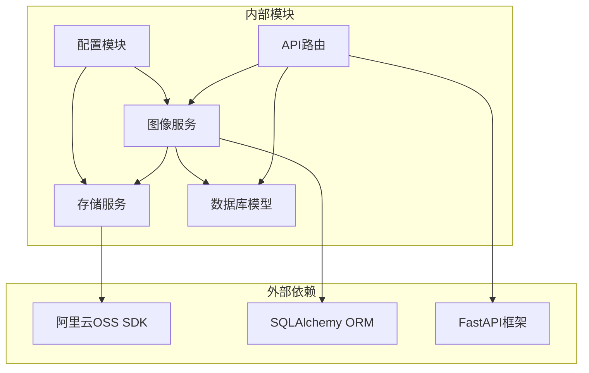

**图表来源**
- [src/services/image_storage.py](file://src/services/image_storage.py#L1-L15)
- [src/services/image_service.py](file://src/services/image_service.py#L1-L15)
- [src/api/routers/images.py](file://src/api/routers/images.py#L1-L28)

**章节来源**
- [src/services/image_storage.py](file://src/services/image_storage.py#L1-L375)
- [src/services/image_service.py](file://src/services/image_service.py#L1-L800)
- [src/api/routers/images.py](file://src/api/routers/images.py#L1-L986)

## 性能考虑

### 存储性能优化

系统在多个层面实现了性能优化：

#### 并发处理策略

| 组件 | 并发策略 | 实现方式 |
|------|----------|----------|
| **批量生成** | 异步处理 | asyncio.sleep(3) 间隔 |
| **速率限制** | 自适应降级 | 检测429错误自动等待 |
| **缓存机制** | 本地缓存 | Response Cache-Control: 86400 |
| **连接池** | 懒加载OSS客户端 | _get_oss_client() |

#### 存储性能指标

| 指标 | 本地存储 | OSS存储 | 优化建议 |
|------|----------|---------|----------|
| **上传速度** | 高 | 中等 | 使用CDN加速 |
| **访问延迟** | 低 | 中等 | 启用CDN缓存 |
| **成本** | 低 | 中等 | 选择合适存储类型 |
| **可靠性** | 中等 | 高 | 多区域备份 |

### 成本优化策略

#### 存储类型选择

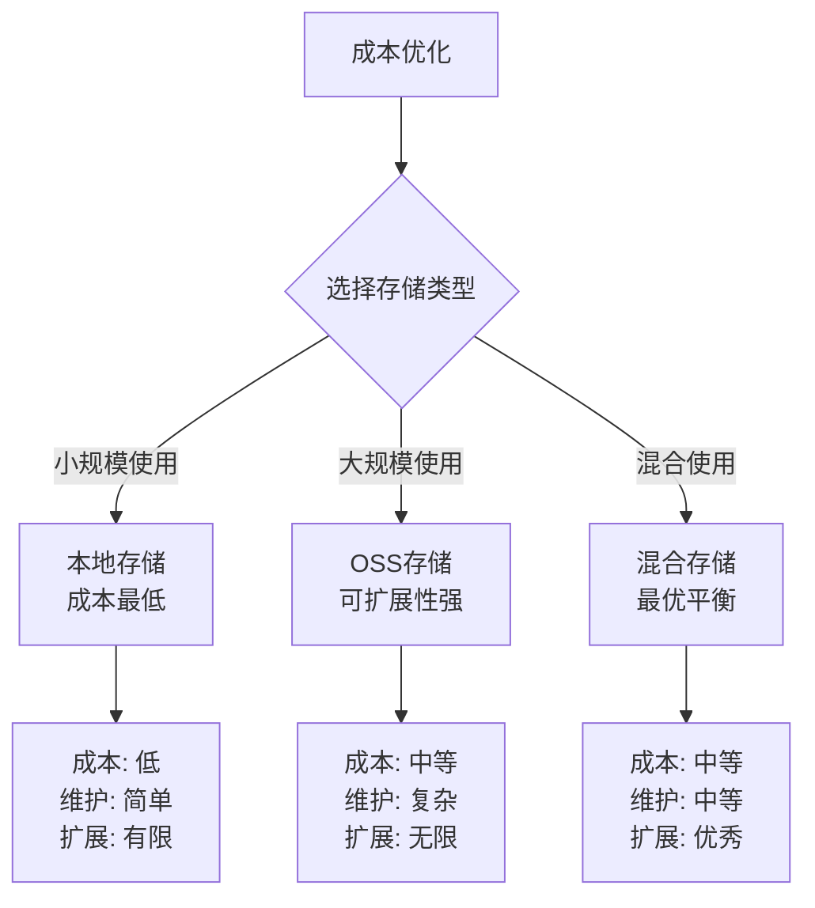

**图表来源**
- [config/settings.py](file://config/settings.py#L46-L55)

## 故障排除指南

### 常见问题及解决方案

#### 存储配置问题

| 问题类型 | 症状 | 解决方案 |
|----------|------|----------|
| **OSS SDK缺失** | ImportError: No module named 'oss2' | pip install oss2 |
| **OSS认证失败** | OSS客户端初始化失败 | 检查ACCESS_KEY_ID和SECRET |
| **本地目录权限** | 无法创建存储目录 | 检查文件系统权限 |
| **网络连接超时** | OSS上传失败 | 检查网络和防火墙设置 |

#### 性能问题诊断

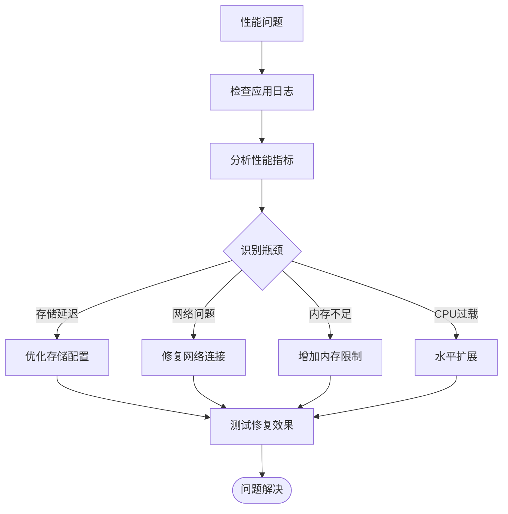

**图表来源**
- [src/services/image_storage.py](file://src/services/image_storage.py#L196-L201)
- [src/api/routers/images.py](file://src/api/routers/images.py#L342-L376)

**章节来源**
- [src/services/image_storage.py](file://src/services/image_storage.py#L181-L203)
- [src/api/routers/images.py](file://src/api/routers/images.py#L342-L376)

### 数据迁移和备份

#### 数据库迁移脚本

系统提供了完整的数据库迁移支持：

| 迁移脚本 | 功能 | 使用场景 |
|----------|------|----------|
| **migrate_add_image_primary_fields.py** | 添加主图关系字段 | 支持主图/变体管理 |
| **migrate_add_last_active_game.py** | 添加活动游戏字段 | 支持会话恢复功能 |

#### 备份策略

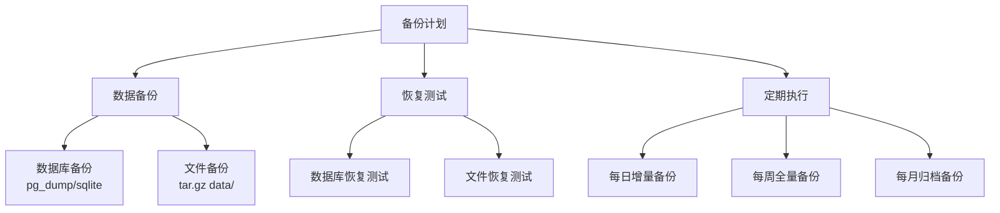

**图表来源**
- [DEPLOYMENT.md](file://DEPLOYMENT.md#L290-L308)
- [migrate_add_image_primary_fields.py](file://migrate_add_image_primary_fields.py#L16-L62)
- [migrate_add_last_active_game.py](file://migrate_add_last_active_game.py#L19-L54)

**章节来源**
- [DEPLOYMENT.md](file://DEPLOYMENT.md#L290-L308)
- [migrate_add_image_primary_fields.py](file://migrate_add_image_primary_fields.py#L1-L69)
- [migrate_add_last_active_game.py](file://migrate_add_last_active_game.py#L1-L61)

## 结论

本存储服务集成方案提供了完整、可靠且高性能的图像存储解决方案。通过抽象化的存储接口、灵活的后端选择策略和完善的错误处理机制，系统能够满足从小规模到大规模的各种应用场景需求。

### 主要优势

1. **高度可扩展性**：支持本地和云端存储的无缝切换
2. **强大的错误处理**：完善的异常捕获和恢复机制
3. **性能优化**：多层缓存和并发处理策略
4. **成本效益**：灵活的存储类型选择和优化策略
5. **易于维护**：清晰的架构设计和完整的文档

### 最佳实践建议

1. **生产环境部署**：使用OSS存储配合CDN加速
2. **监控和告警**：建立完善的日志监控体系
3. **定期备份**：制定自动化备份和恢复流程
4. **性能调优**：根据实际负载调整资源配置
5. **安全加固**：实施严格的访问控制和数据加密

## 附录

### 配置参数说明

| 配置项 | 类型 | 默认值 | 描述 |
|--------|------|--------|------|
| **IMAGE_STORAGE_TYPE** | string | "local" | 存储类型：local 或 oss |
| **IMAGE_LOCAL_PATH** | Path | "data/images" | 本地存储路径 |
| **OSS_ACCESS_KEY_ID** | string | None | 阿里云Access Key ID |
| **OSS_ACCESS_KEY_SECRET** | string | None | 阿里云Access Key Secret |
| **OSS_ENDPOINT** | string | None | 阿里云OSS Endpoint |
| **OSS_BUCKET_NAME** | string | None | 阿里云OSS Bucket名称 |

### API端点概览

| 端点 | 方法 | 功能 | 权限 |
|------|------|------|------|
| **/api/images/generate** | POST | 生成图像 | 登录用户 |
| **/api/images/regenerate** | POST | 重新生成图像 | 图像所有者 |
| **/api/images/batch-characters** | POST | 批量生成角色图像 | 登录用户 |
| **/api/images/file/{path}** | GET | 获取图像文件 | 无（路径验证） |
| **/api/images/game/{game_id}** | GET | 获取游戏图像列表 | 游戏所有者 |

### 错误码对照表

| 错误码 | 类型 | 描述 | 处理建议 |
|--------|------|------|----------|
| **401** | 未认证 | 未登录或会话失效 | 检查用户认证状态 |
| **403** | 权限不足 | 无权访问目标资源 | 验证用户权限 |
| **404** | 资源不存在 | 图像或游戏不存在 | 检查ID有效性 |
| **429** | 速率限制 | 请求过于频繁 | 实施退避策略 |
| **500** | 服务器错误 | 系统内部错误 | 检查日志并重试 |