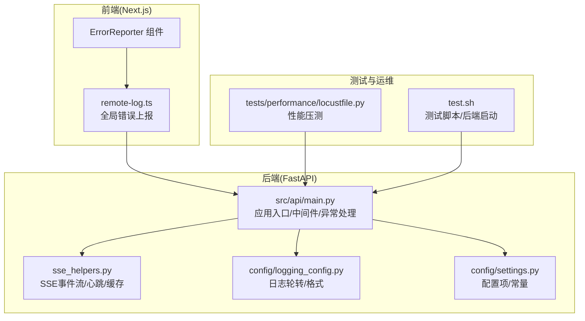
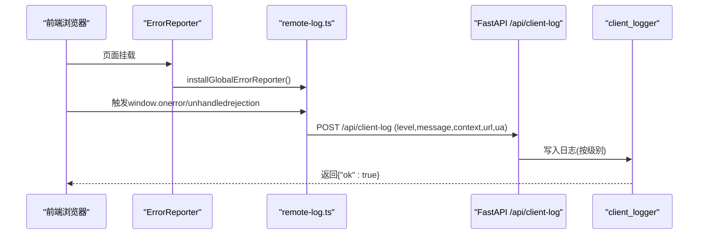
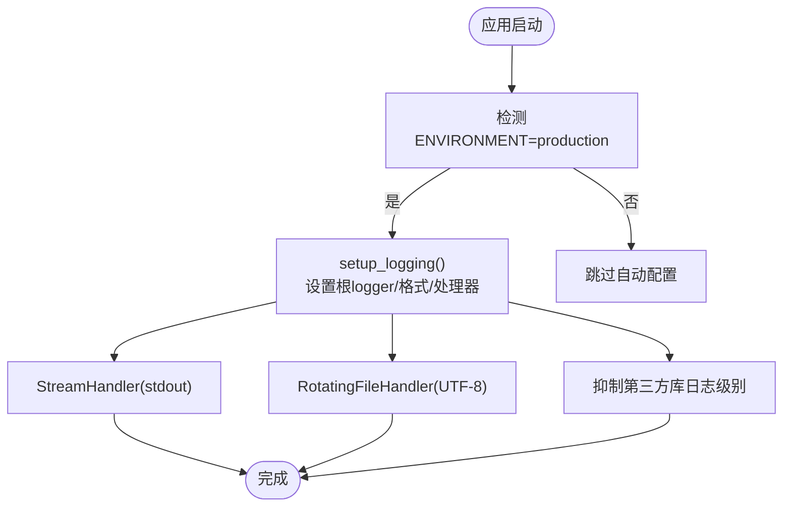
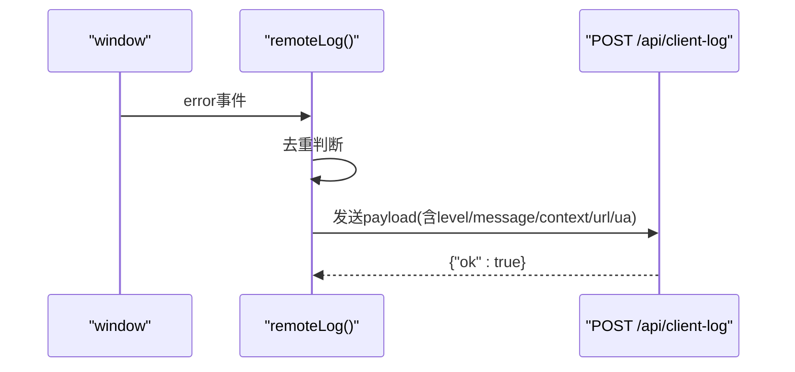
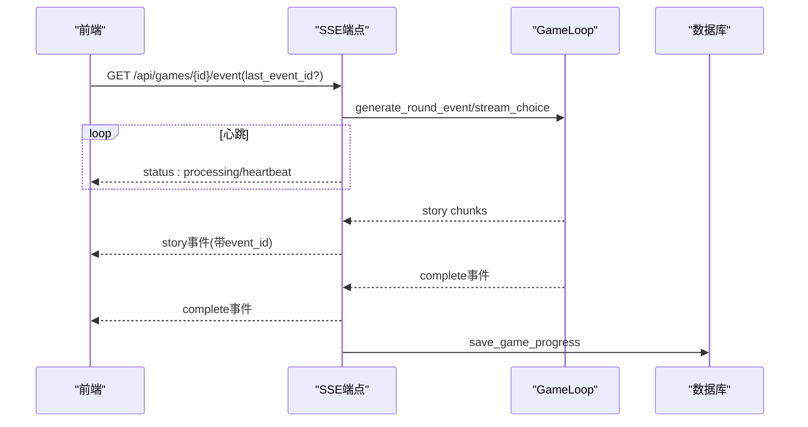
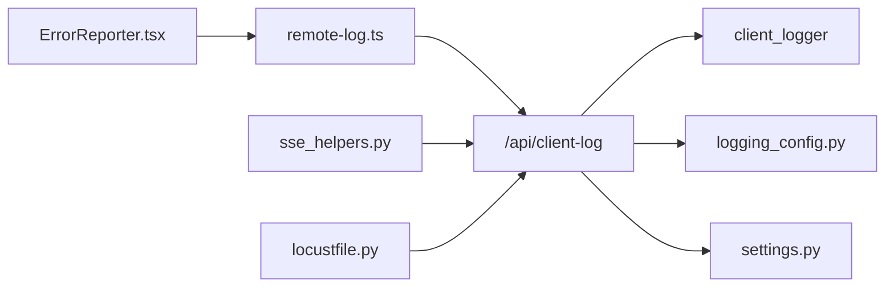

# 监控日志集成

<cite>
**本文档引用的文件**
- [config/logging_config.py](file://config/logging_config.py)
- [config/settings.py](file://config/settings.py)
- [src/api/main.py](file://src/api/main.py)
- [src/api/routers/gameplay/sse_helpers.py](file://src/api/routers/gameplay/sse_helpers.py)
- [frontend/src/lib/remote-log.ts](file://frontend/src/lib/remote-log.ts)
- [frontend/src/components/ErrorReporter.tsx](file://frontend/src/components/ErrorReporter.tsx)
- [tests/performance/locustfile.py](file://tests/performance/locustfile.py)
- [test.sh](file://test.sh)
</cite>

## 目录
1. [简介](#简介)
2. [项目结构](#项目结构)
3. [核心组件](#核心组件)
4. [架构总览](#架构总览)
5. [详细组件分析](#详细组件分析)
6. [依赖关系分析](#依赖关系分析)
7. [性能考量](#性能考量)
8. [故障排查指南](#故障排查指南)
9. [结论](#结论)
10. [附录](#附录)

## 简介
本技术文档面向“监控日志集成”，围绕以下目标展开：
- 性能指标采集方案：覆盖关键业务指标、系统资源监控与用户行为分析
- 错误追踪系统：异常捕获、堆栈跟踪与告警通知
- 日志聚合与分析：结构化日志、日志轮转与长期存储
- 分布式追踪与APM：OpenTelemetry集成、跨服务链路追踪与监控仪表板
- 告警规则与通知渠道：基于阈值与异常模式的告警策略与排障实践

本项目已具备生产级日志配置、前端错误上报、SSE流式事件与健康检查等能力，可作为构建监控体系的基础。

## 项目结构
后端采用FastAPI，前端基于Next.js；监控日志集成涉及：
- 后端日志配置与客户端日志汇聚
- 前端错误捕获与上报
- SSE事件流与超时/重连机制
- 性能压测脚本与CI集成

图表来源
- [src/api/main.py](file://src/api/main.py#L1-L134)
- [config/logging_config.py](file://config/logging_config.py#L1-L78)
- [frontend/src/lib/remote-log.ts](file://frontend/src/lib/remote-log.ts#L1-L88)
- [frontend/src/components/ErrorReporter.tsx](file://frontend/src/components/ErrorReporter.tsx#L1-L16)
- [src/api/routers/gameplay/sse_helpers.py](file://src/api/routers/gameplay/sse_helpers.py#L1-L571)
- [tests/performance/locustfile.py](file://tests/performance/locustfile.py#L1-L224)
- [test.sh](file://test.sh#L101-L137)

章节来源
- [src/api/main.py](file://src/api/main.py#L1-L134)
- [config/logging_config.py](file://config/logging_config.py#L1-L78)
- [frontend/src/lib/remote-log.ts](file://frontend/src/lib/remote-log.ts#L1-L88)
- [frontend/src/components/ErrorReporter.tsx](file://frontend/src/components/ErrorReporter.tsx#L1-L16)
- [src/api/routers/gameplay/sse_helpers.py](file://src/api/routers/gameplay/sse_helpers.py#L1-L571)
- [tests/performance/locustfile.py](file://tests/performance/locustfile.py#L1-L224)
- [test.sh](file://test.sh#L101-L137)

## 核心组件
- 生产日志配置：控制台+文件轮转、第三方库日志级别抑制、生产环境自动初始化
- 前端错误上报：去重、上下文标签、UA/IP注入、全局监听
- 后端客户端日志汇聚：统一logger、按级别落盘
- SSE事件流：心跳、断点续传、缓存、错误事件
- 性能压测：Locust场景、错误响应统计

章节来源
- [config/logging_config.py](file://config/logging_config.py#L12-L69)
- [frontend/src/lib/remote-log.ts](file://frontend/src/lib/remote-log.ts#L16-L60)
- [src/api/main.py](file://src/api/main.py#L102-L133)
- [src/api/routers/gameplay/sse_helpers.py](file://src/api/routers/gameplay/sse_helpers.py#L145-L277)
- [tests/performance/locustfile.py](file://tests/performance/locustfile.py#L34-L61)

## 架构总览
整体监控日志架构由“前端错误捕获—后端日志汇聚—SSE事件流—性能压测”构成，并预留分布式追踪与APM扩展点。

图表来源
- [frontend/src/components/ErrorReporter.tsx](file://frontend/src/components/ErrorReporter.tsx#L10-L14)
- [frontend/src/lib/remote-log.ts](file://frontend/src/lib/remote-log.ts#L68-L87)
- [src/api/main.py](file://src/api/main.py#L117-L133)

## 详细组件分析

### 后端日志配置与轮转
- 控制台与文件双通道输出，文件采用RotatingFileHandler
- 格式含时间戳、模块名、级别与消息
- 第三方库日志级别抑制，避免噪声
- 生产环境自动初始化

图表来源
- [config/logging_config.py](file://config/logging_config.py#L12-L69)

章节来源
- [config/logging_config.py](file://config/logging_config.py#L12-L69)

### 前端错误捕获与上报
- 全局安装：window.onerror、unhandledrejection
- 去重：30秒内相同消息不重复上报
- 上下文：context字段区分来源（如sse、api、global）
- UA/IP：后端自动注入，便于定位设备与来源

图表来源
- [frontend/src/lib/remote-log.ts](file://frontend/src/lib/remote-log.ts#L68-L87)
- [src/api/main.py](file://src/api/main.py#L117-L133)

章节来源
- [frontend/src/lib/remote-log.ts](file://frontend/src/lib/remote-log.ts#L16-L60)
- [frontend/src/lib/remote-log.ts](file://frontend/src/lib/remote-log.ts#L68-L87)
- [src/api/main.py](file://src/api/main.py#L102-L133)

### SSE事件流与断点续传
- 心跳：每5秒status事件保持连接
- 缓存：前端last_event_id支持断点续传
- 错误：统一以"error"事件返回，支持message/error字段
- 自动保存：事件生成/选择后持久化进度

图表来源
- [src/api/routers/gameplay/sse_helpers.py](file://src/api/routers/gameplay/sse_helpers.py#L145-L277)
- [src/api/routers/gameplay/sse_helpers.py](file://src/api/routers/gameplay/sse_helpers.py#L279-L388)

章节来源
- [src/api/routers/gameplay/sse_helpers.py](file://src/api/routers/gameplay/sse_helpers.py#L145-L277)
- [src/api/routers/gameplay/sse_helpers.py](file://src/api/routers/gameplay/sse_helpers.py#L279-L388)

### 健康检查与会话管理
- /api/health返回活跃会话数，便于容器编排与负载均衡
- 全局异常处理统一返回500与错误摘要

章节来源
- [src/api/main.py](file://src/api/main.py#L92-L99)
- [src/api/main.py](file://src/api/main.py#L69-L76)

### 性能压测与报告
- Locust场景：匿名用户、游戏玩家、压力测试用户
- 错误响应统计：4xx/5xx标记失败
- CI友好：支持无头模式与参数化

章节来源
- [tests/performance/locustfile.py](file://tests/performance/locustfile.py#L34-L61)
- [tests/performance/locustfile.py](file://tests/performance/locustfile.py#L107-L124)
- [tests/performance/locustfile.py](file://tests/performance/locustfile.py#L182-L197)

## 依赖关系分析
- 前端ErrorReporter在根布局挂载一次，全局生效
- remote-log依赖后端/api/client-log端点
- SSE辅助模块被游戏玩法路由复用
- 日志配置与设置模块贯穿前后端

图表来源
- [frontend/src/components/ErrorReporter.tsx](file://frontend/src/components/ErrorReporter.tsx#L10-L14)
- [frontend/src/lib/remote-log.ts](file://frontend/src/lib/remote-log.ts#L37-L60)
- [src/api/main.py](file://src/api/main.py#L117-L133)
- [config/logging_config.py](file://config/logging_config.py#L12-L69)
- [config/settings.py](file://config/settings.py#L1-L168)
- [src/api/routers/gameplay/sse_helpers.py](file://src/api/routers/gameplay/sse_helpers.py#L1-L571)
- [tests/performance/locustfile.py](file://tests/performance/locustfile.py#L1-L224)

章节来源
- [frontend/src/components/ErrorReporter.tsx](file://frontend/src/components/ErrorReporter.tsx#L1-L16)
- [frontend/src/lib/remote-log.ts](file://frontend/src/lib/remote-log.ts#L1-L88)
- [src/api/main.py](file://src/api/main.py#L1-L134)
- [config/logging_config.py](file://config/logging_config.py#L1-L78)
- [config/settings.py](file://config/settings.py#L1-L168)
- [src/api/routers/gameplay/sse_helpers.py](file://src/api/routers/gameplay/sse_helpers.py#L1-L571)
- [tests/performance/locustfile.py](file://tests/performance/locustfile.py#L1-L224)

## 性能考量
- SSE心跳与超时：避免连接空闲断开，提升移动端稳定性
- 断点续传：last_event_id配合缓存，减少重放成本
- 前端去重：降低重复错误上报对后端的压力
- 压测场景：覆盖注册、健康检查、游戏创建与事件生成等关键路径

章节来源
- [src/api/routers/gameplay/sse_helpers.py](file://src/api/routers/gameplay/sse_helpers.py#L201-L220)
- [frontend/src/lib/remote-log.ts](file://frontend/src/lib/remote-log.ts#L16-L32)
- [tests/performance/locustfile.py](file://tests/performance/locustfile.py#L63-L105)

## 故障排查指南
- 前端错误未上报
  - 检查ErrorReporter是否在根布局挂载
  - 确认/api/client-log可达且未被CORS拦截
  - 查看后端client_logger输出
- SSE连接中断
  - 关注"error"事件与超时提示
  - 使用last_event_id验证断点续传
- 性能异常
  - 使用Locust无头模式运行短时压测
  - 关注4xx/5xx失败率与响应时间
- 日志轮转
  - 检查日志目录权限与磁盘空间
  - 确认轮转参数与备份数量符合预期

章节来源
- [frontend/src/components/ErrorReporter.tsx](file://frontend/src/components/ErrorReporter.tsx#L10-L14)
- [src/api/main.py](file://src/api/main.py#L117-L133)
- [src/api/routers/gameplay/sse_helpers.py](file://src/api/routers/gameplay/sse_helpers.py#L211-L218)
- [tests/performance/locustfile.py](file://tests/performance/locustfile.py#L13-L17)
- [config/logging_config.py](file://config/logging_config.py#L52-L62)

## 结论
本项目已具备完善的日志与错误上报基础设施，结合SSE事件流与性能压测，可作为监控体系的坚实基础。建议在此基础上进一步引入分布式追踪与APM，完善指标采集与告警通知，形成闭环的可观测性平台。

## 附录
- 建议的后续扩展方向
  - 分布式追踪：在SSE与API端点埋点，使用OpenTelemetry导出至集中式追踪系统
  - APM仪表板：集成Prometheus/Grafana或云厂商APM，展示关键指标与告警
  - 告警规则：基于SSE超时、错误率、响应时间、CPU/内存阈值等建立规则
  - 通知渠道：邮件、IM、Webhook等多渠道告警