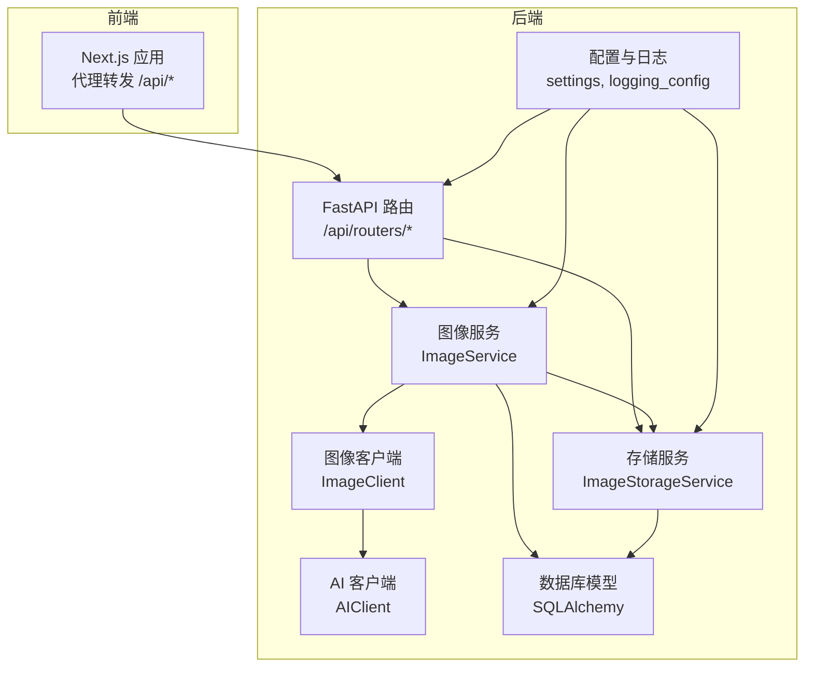
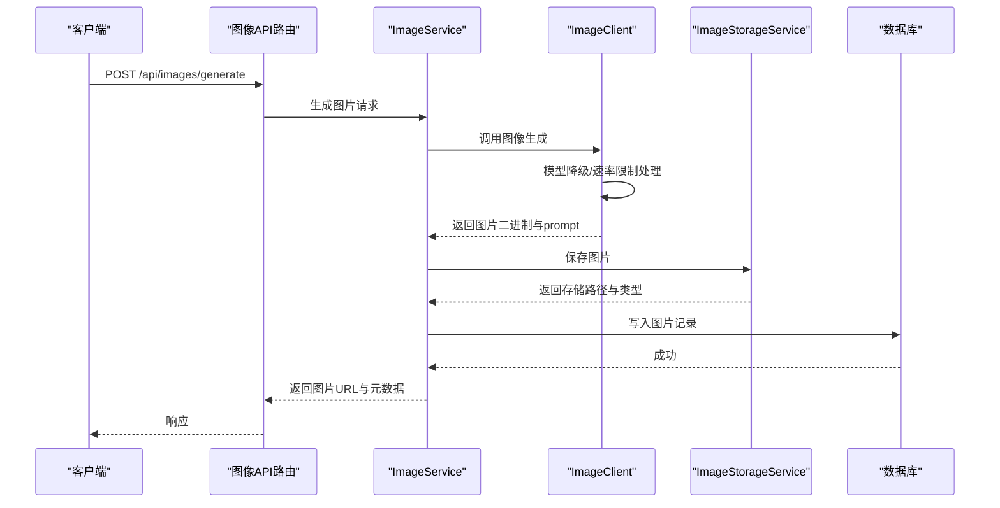
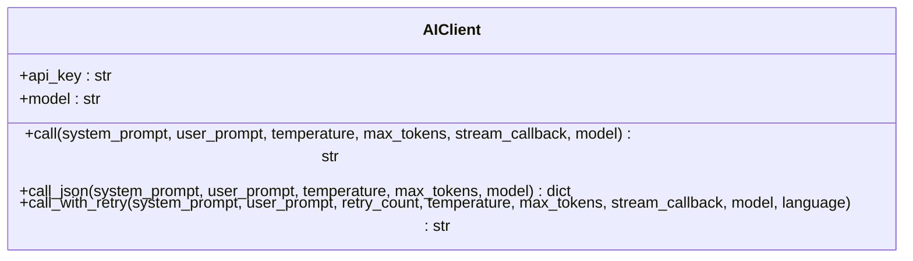
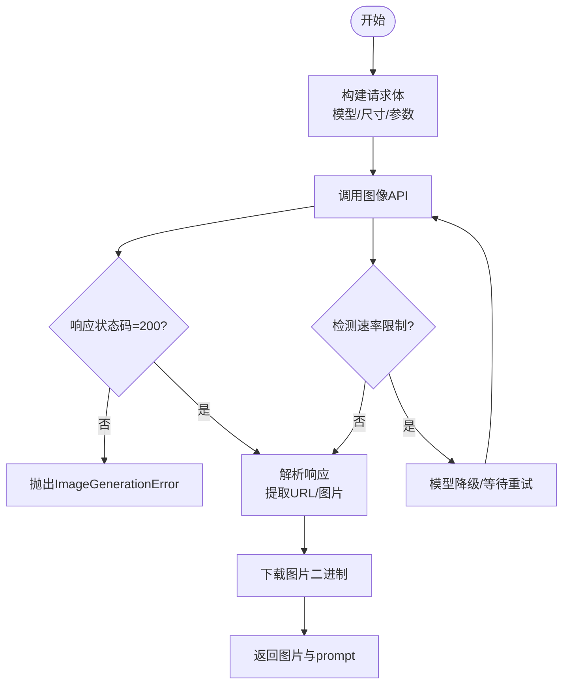
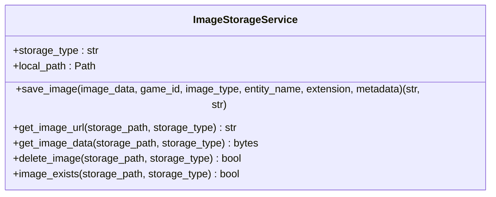
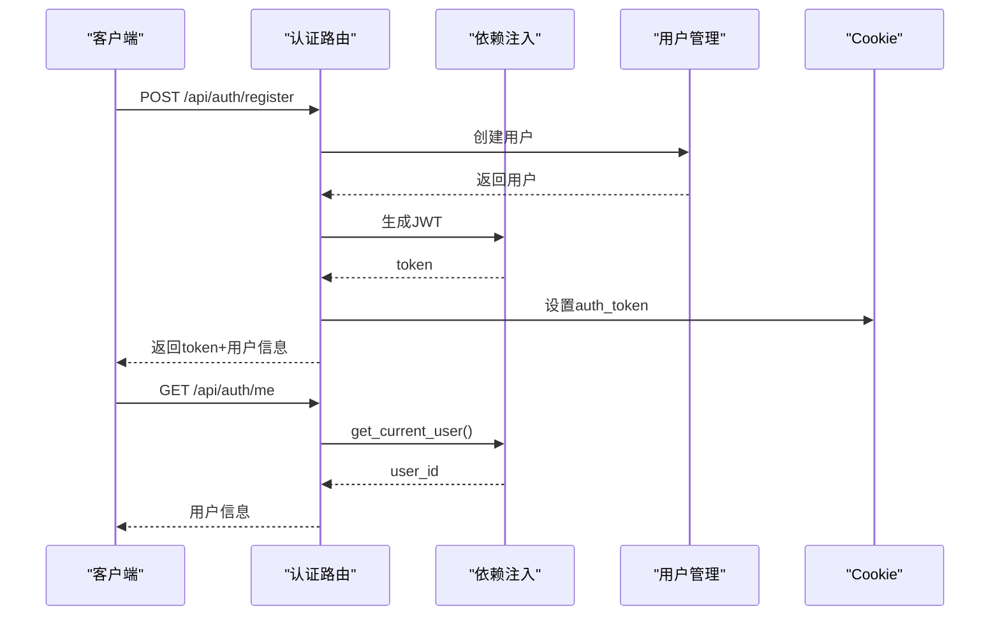
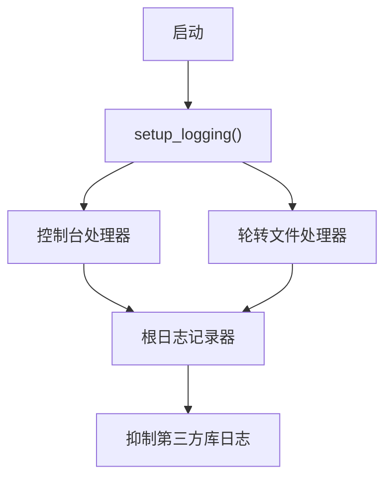
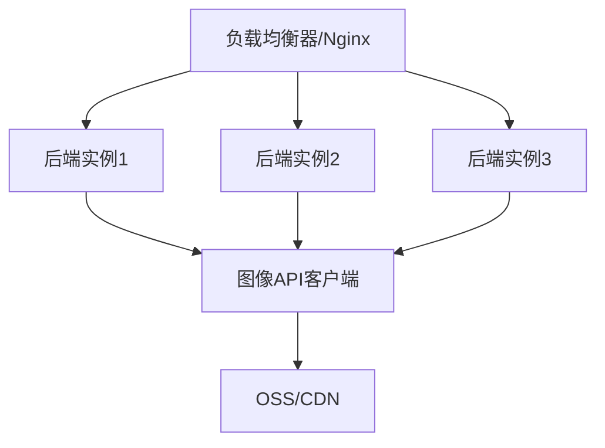
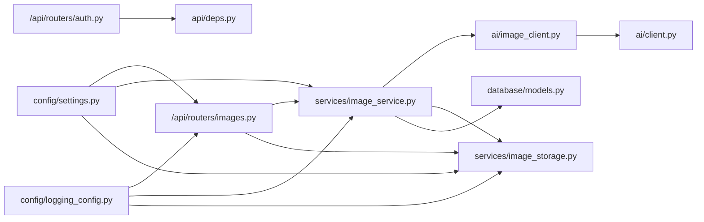

# 第三方服务集成

<cite>
**本文档引用的文件**
- [src/ai/client.py](file://src/ai/client.py)
- [src/ai/image_client.py](file://src/ai/image_client.py)
- [src/services/image_service.py](file://src/services/image_service.py)
- [src/services/image_storage.py](file://src/services/image_storage.py)
- [src/api/routers/images.py](file://src/api/routers/images.py)
- [src/api/deps.py](file://src/api/deps.py)
- [src/api/routers/auth.py](file://src/api/routers/auth.py)
- [config/settings.py](file://config/settings.py)
- [config/logging_config.py](file://config/logging_config.py)
- [src/database/models.py](file://src/database/models.py)
- [frontend/next.config.ts](file://frontend/next.config.ts)
- [requirements.txt](file://requirements.txt)
</cite>

## 目录
1. [简介](#简介)
2. [项目结构](#项目结构)
3. [核心组件](#核心组件)
4. [架构总览](#架构总览)
5. [详细组件分析](#详细组件分析)
6. [依赖关系分析](#依赖关系分析)
7. [性能考虑](#性能考虑)
8. [故障排除指南](#故障排除指南)
9. [结论](#结论)
10. [附录](#附录)

## 简介
本文件面向第三方服务集成，围绕AI模型集成、图像API集成、存储服务集成、认证与权限管理、监控与日志、以及服务发现与容错等方面，提供系统化的技术文档。内容基于仓库现有实现，涵盖API适配器开发、认证机制、限流处理、图像生成与存储、CDN配置建议、监控与日志体系，并给出服务发现、负载均衡与容错的实现方案。

## 项目结构
项目采用分层架构：API层（FastAPI）、业务服务层（ImageService、ImageStorageService）、AI适配层（AIClient、ImageClient）、配置与日志层（settings、logging_config）、数据库层（SQLAlchemy模型）。前端Next.js通过代理访问后端API。

**图表来源**
- [src/api/routers/images.py](file://src/api/routers/images.py#L1-L986)
- [src/services/image_service.py](file://src/services/image_service.py#L1-L1411)
- [src/services/image_storage.py](file://src/services/image_storage.py#L1-L375)
- [src/ai/client.py](file://src/ai/client.py#L1-L233)
- [src/ai/image_client.py](file://src/ai/image_client.py#L1-L1240)
- [config/settings.py](file://config/settings.py#L1-L168)
- [config/logging_config.py](file://config/logging_config.py#L1-L78)

**章节来源**
- [src/api/routers/images.py](file://src/api/routers/images.py#L1-L986)
- [src/services/image_service.py](file://src/services/image_service.py#L1-L1411)
- [src/services/image_storage.py](file://src/services/image_storage.py#L1-L375)
- [src/ai/client.py](file://src/ai/client.py#L1-L233)
- [src/ai/image_client.py](file://src/ai/image_client.py#L1-L1240)
- [config/settings.py](file://config/settings.py#L1-L168)
- [config/logging_config.py](file://config/logging_config.py#L1-L78)

## 核心组件
- AI适配器（AIClient）：统一OpenAI兼容接口调用，支持流式与非流式、JSON解析、重试与错误反馈注入。
- 图像客户端（ImageClient）：支持DashScope/Qwen等OpenAI兼容图像服务，具备模型降级、速率限制检测与指数退避、内容审核异常处理。
- 图像服务（ImageService）：编排图像生成、存储与数据库记录，支持人物全身像一致性、重新生成与完全重新生成、开场插画生成。
- 存储服务（ImageStorageService）：抽象本地与OSS存储，提供统一的保存、读取、URL生成与删除能力。
- 认证与权限（JWT + Cookie）：支持Cookie与Bearer Token两种认证方式，提供注册、登录、登出与用户信息查询。
- 配置与日志（settings、logging_config）：集中管理API密钥、模型、存储与日志配置，生产环境日志轮转。

**章节来源**
- [src/ai/client.py](file://src/ai/client.py#L22-L233)
- [src/ai/image_client.py](file://src/ai/image_client.py#L30-L405)
- [src/services/image_service.py](file://src/services/image_service.py#L30-L761)
- [src/services/image_storage.py](file://src/services/image_storage.py#L23-L375)
- [src/api/deps.py](file://src/api/deps.py#L44-L133)
- [src/api/routers/auth.py](file://src/api/routers/auth.py#L1-L125)
- [config/settings.py](file://config/settings.py#L27-L168)
- [config/logging_config.py](file://config/logging_config.py#L12-L78)

## 架构总览
下图展示了图像生成与存储的端到端流程，包括API路由、服务编排、AI客户端、存储与数据库交互。

**图表来源**
- [src/api/routers/images.py](file://src/api/routers/images.py#L104-L218)
- [src/services/image_service.py](file://src/services/image_service.py#L51-L182)
- [src/ai/image_client.py](file://src/ai/image_client.py#L160-L261)
- [src/services/image_storage.py](file://src/services/image_storage.py#L57-L92)
- [src/database/models.py](file://src/database/models.py#L162-L235)

## 详细组件分析

### AI模型集成方案（AIClient）
- 统一调用入口：封装OpenAI兼容SDK，支持流式与非流式响应、温度与最大token控制。
- JSON解析：内置JSON提取工具，便于结构化输出。
- 错误重试与反馈注入：多轮重试并在后续尝试中注入上次错误，提升稳定性。
- 配置来源：从settings读取API密钥与基础URL，支持自定义模型。

**图表来源**
- [src/ai/client.py](file://src/ai/client.py#L22-L233)

**章节来源**
- [src/ai/client.py](file://src/ai/client.py#L22-L233)
- [config/settings.py](file://config/settings.py#L30-L44)

### 图像API集成（ImageClient）
- OpenAI兼容接口：支持DashScope/Qwen等服务，统一请求体与响应解析。
- 模型降级：按配置顺序尝试多个文生图/图生图模型，遇到速率限制立即切换。
- 速率限制检测：识别429/RateQuota/rate limit，对最后模型进行指数退避等待。
- 内容审核异常：抛出自定义异常，便于上层区分处理。
- DeepSeek提示词增强：可选使用DeepSeek优化人物描述prompt。
- 图生图与一致性：支持基于主图生成变体，保证人物一致性。

**图表来源**
- [src/ai/image_client.py](file://src/ai/image_client.py#L305-L404)
- [src/ai/image_client.py](file://src/ai/image_client.py#L190-L260)

**章节来源**
- [src/ai/image_client.py](file://src/ai/image_client.py#L30-L405)
- [config/settings.py](file://config/settings.py#L35-L69)

### 存储服务集成（ImageStorageService）
- 存储类型：支持local与oss两种后端，通过配置切换。
- 本地存储：确保目录存在，按游戏ID/类型/时间戳命名，返回相对路径。
- OSS存储：延迟初始化客户端，上传后返回oss://路径，URL生成采用签名URL。
- 统一接口：提供保存、读取、URL生成、删除与存在性检查。

**图表来源**
- [src/services/image_storage.py](file://src/services/image_storage.py#L23-L375)

**章节来源**
- [src/services/image_storage.py](file://src/services/image_storage.py#L23-L375)
- [config/settings.py](file://config/settings.py#L46-L55)

### 认证服务集成（JWT + Cookie）
- Token生成与解码：支持HS256算法，默认30天过期。
- 双通道认证：优先从Cookie读取auth_token，其次从Authorization Bearer头。
- 注册/登录：返回token与用户信息，设置Cookie；登出清除Cookie。
- 权限校验：API路由中对游戏归属进行验证，防止越权访问。

**图表来源**
- [src/api/routers/auth.py](file://src/api/routers/auth.py#L44-L125)
- [src/api/deps.py](file://src/api/deps.py#L44-L133)

**章节来源**
- [src/api/routers/auth.py](file://src/api/routers/auth.py#L1-L125)
- [src/api/deps.py](file://src/api/deps.py#L1-L150)

### 监控与日志服务集成
- 生产环境日志：控制台与轮转文件处理器，第三方库日志级别抑制。
- 应用日志：INFO级别及以上，包含时间、模块、级别与消息。
- 建议：可扩展接入OpenTelemetry（指标/链路追踪）与APM（错误追踪）。

**图表来源**
- [config/logging_config.py](file://config/logging_config.py#L12-L78)

**章节来源**
- [config/logging_config.py](file://config/logging_config.py#L1-L78)

### 服务发现、负载均衡与容错
- 服务发现：通过环境变量配置后端地址（如NEXT_PUBLIC_API_BASE），容器编排中使用服务名。
- 负载均衡：Nginx/Ingress将请求分发至多个后端实例。
- 容错：图像API客户端具备模型降级与速率限制检测，前端代理超时延长（Next.js配置）。
- CDN建议：OSS签名URL可配合CDN缓存静态资源；图片URL可由前端缓存策略优化。

**图表来源**
- [frontend/next.config.ts](file://frontend/next.config.ts#L16-L28)
- [src/ai/image_client.py](file://src/ai/image_client.py#L240-L258)

**章节来源**
- [frontend/next.config.ts](file://frontend/next.config.ts#L1-L30)
- [src/ai/image_client.py](file://src/ai/image_client.py#L190-L260)

## 依赖关系分析
- API路由依赖服务层，服务层依赖AI客户端与存储服务，存储服务依赖数据库模型。
- 配置层贯穿各层，提供API密钥、模型、存储与日志参数。
- 认证依赖JWT与Cookie，API路由通过依赖注入获取当前用户。

**图表来源**
- [src/api/routers/images.py](file://src/api/routers/images.py#L1-L986)
- [src/services/image_service.py](file://src/services/image_service.py#L1-L1411)
- [src/services/image_storage.py](file://src/services/image_storage.py#L1-L375)
- [src/ai/image_client.py](file://src/ai/image_client.py#L1-L1240)
- [src/ai/client.py](file://src/ai/client.py#L1-L233)
- [src/api/routers/auth.py](file://src/api/routers/auth.py#L1-L125)
- [src/api/deps.py](file://src/api/deps.py#L1-L150)
- [config/settings.py](file://config/settings.py#L1-L168)
- [config/logging_config.py](file://config/logging_config.py#L1-L78)
- [src/database/models.py](file://src/database/models.py#L1-L295)

**章节来源**
- [src/api/routers/images.py](file://src/api/routers/images.py#L1-L986)
- [src/services/image_service.py](file://src/services/image_service.py#L1-L1411)
- [src/services/image_storage.py](file://src/services/image_storage.py#L1-L375)
- [src/ai/image_client.py](file://src/ai/image_client.py#L1-L1240)
- [src/ai/client.py](file://src/ai/client.py#L1-L233)
- [src/api/routers/auth.py](file://src/api/routers/auth.py#L1-L125)
- [src/api/deps.py](file://src/api/deps.py#L1-L150)
- [config/settings.py](file://config/settings.py#L1-L168)
- [config/logging_config.py](file://config/logging_config.py#L1-L78)
- [src/database/models.py](file://src/database/models.py#L1-L295)

## 性能考虑
- 图像生成超时：配置项支持较长超时（如60秒），前端代理超时延长至2分钟，避免长时间任务被中断。
- 速率限制退避：指数退避与模型降级降低API限流影响。
- 存储与URL：OSS签名URL可配合CDN缓存，减少源站压力。
- 日志轮转：生产环境日志文件大小与备份数量可控，避免磁盘膨胀。

**章节来源**
- [config/settings.py](file://config/settings.py#L56-L58)
- [frontend/next.config.ts](file://frontend/next.config.ts#L16-L19)
- [src/ai/image_client.py](file://src/ai/image_client.py#L240-L258)
- [config/logging_config.py](file://config/logging_config.py#L12-L78)

## 故障排除指南
- 内容审核错误：图像API返回内容安全相关错误时，上层捕获并返回400，提示用户调整描述。
- 速率限制：检测到429/RateQuota时，优先切换模型；最后模型则等待后重试。
- 存储异常：本地或OSS写入失败抛出ImageStorageError，检查路径权限与OSS凭证。
- 认证失败：Cookie与Bearer均无效时返回401，确认Token是否过期或被篡改。
- 日志定位：生产环境日志位于logs目录，按日期轮转，注意第三方库日志级别已抑制。

**章节来源**
- [src/api/routers/images.py](file://src/api/routers/images.py#L204-L217)
- [src/ai/image_client.py](file://src/ai/image_client.py#L240-L258)
- [src/services/image_storage.py](file://src/services/image_storage.py#L181-L203)
- [src/api/deps.py](file://src/api/deps.py#L118-L132)
- [config/logging_config.py](file://config/logging_config.py#L12-L78)

## 结论
本项目通过统一的AI适配器与图像客户端，实现了对多种图像服务的兼容与降级策略；通过服务编排与存储抽象，提供了稳定可靠的图像生成与存储能力；借助JWT与Cookie实现了便捷的认证与权限控制；日志与配置模块保障了生产环境的可观测性与可维护性。建议在生产环境中结合负载均衡、CDN与APM进一步完善高可用与可观测性。

## 附录
- 环境依赖：FastAPI、Uvicorn、SQLAlchemy、Pydantic、OpenAI SDK、JWKS等。
- 建议新增：OpenTelemetry指标与链路追踪、错误追踪（Sentry）、服务网格（Istio）与自动扩缩容（HPA）。

**章节来源**
- [requirements.txt](file://requirements.txt#L1-L12)