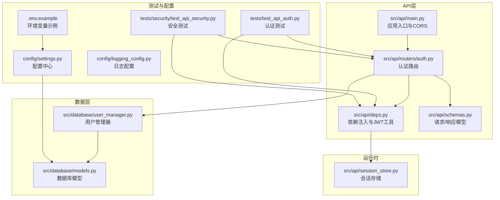
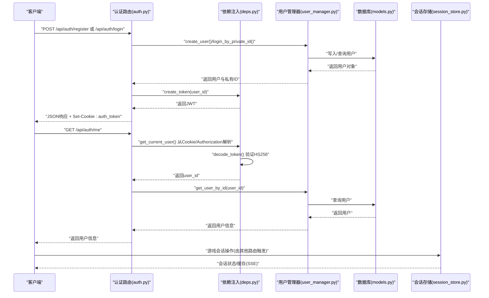
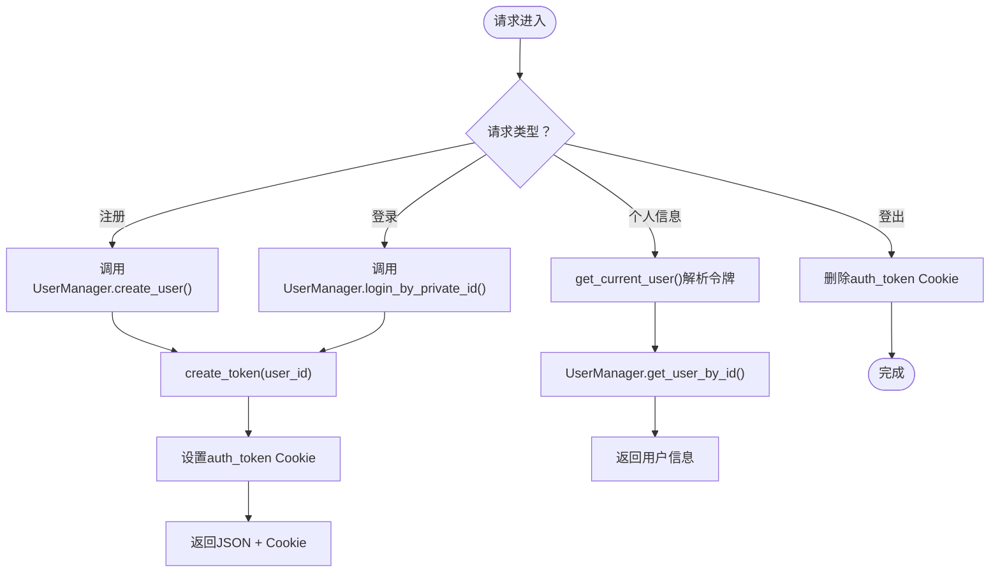
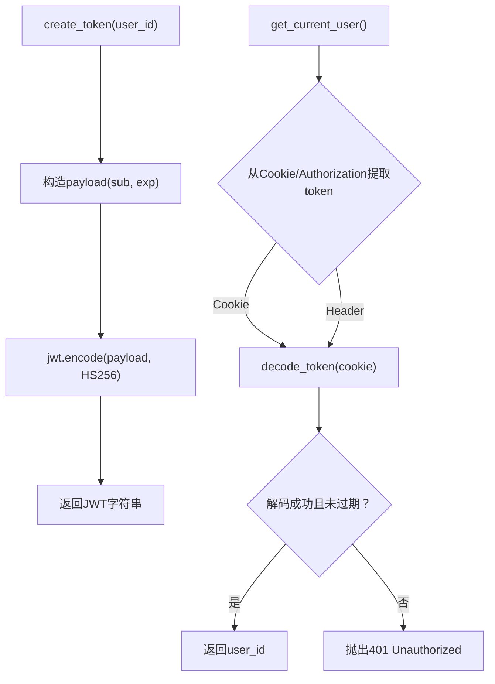
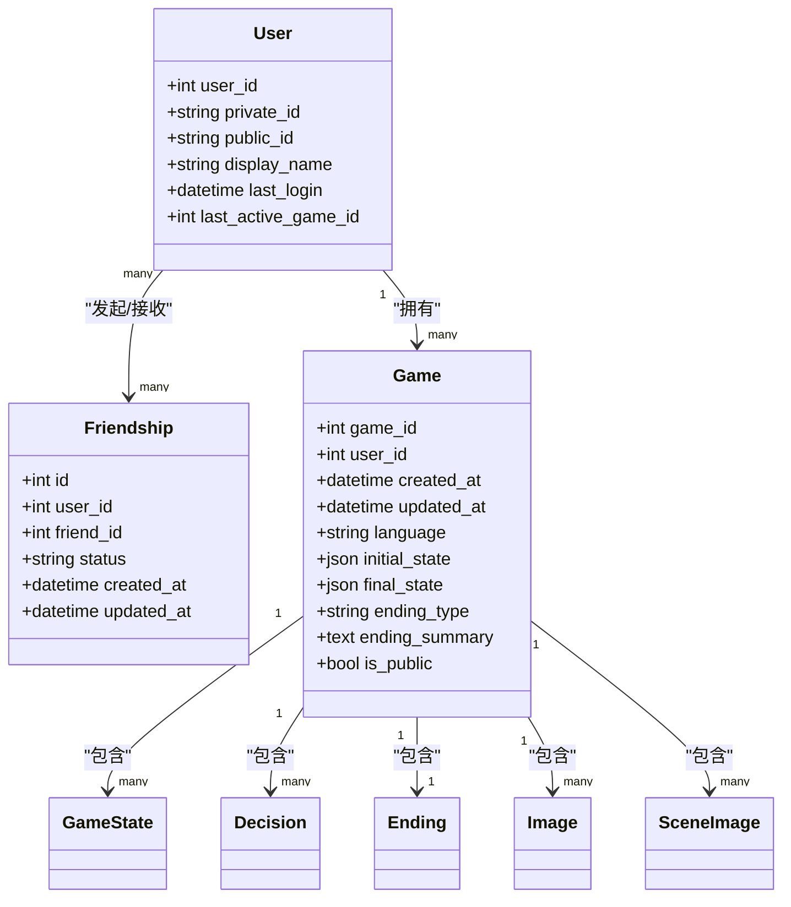
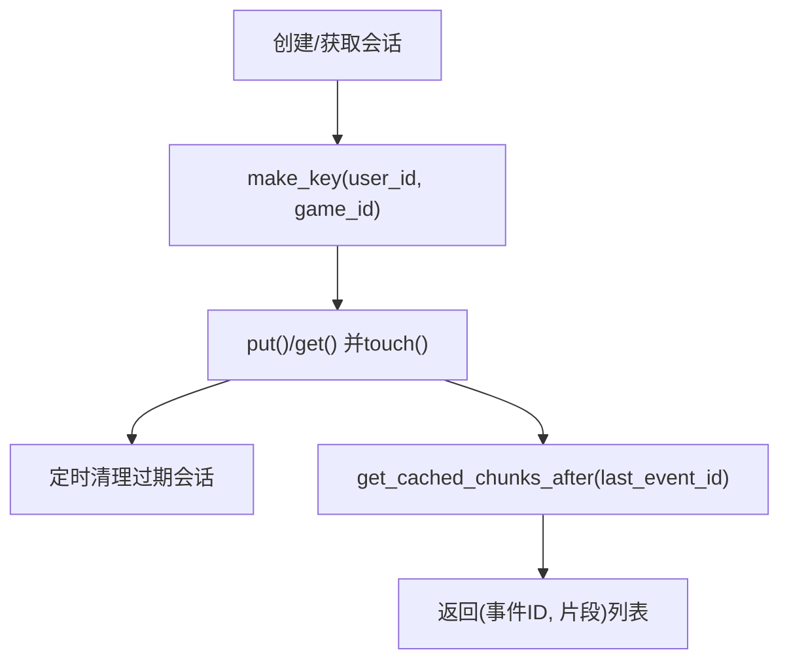
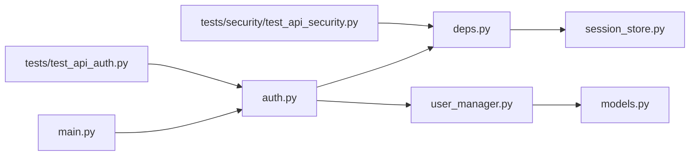

# 认证服务集成

<cite>
**本文档引用的文件**
- [src/api/routers/auth.py](file://src/api/routers/auth.py)
- [src/api/deps.py](file://src/api/deps.py)
- [src/database/user_manager.py](file://src/database/user_manager.py)
- [src/database/models.py](file://src/database/models.py)
- [src/api/main.py](file://src/api/main.py)
- [src/api/schemas.py](file://src/api/schemas.py)
- [src/api/session_store.py](file://src/api/session_store.py)
- [tests/test_api_auth.py](file://tests/test_api_auth.py)
- [tests/security/test_api_security.py](file://tests/security/test_api_security.py)
- [.env.example](file://.env.example)
- [config/settings.py](file://config/settings.py)
- [config/logging_config.py](file://config/logging_config.py)
</cite>

## 目录
1. [简介](#简介)
2. [项目结构](#项目结构)
3. [核心组件](#核心组件)
4. [架构总览](#架构总览)
5. [详细组件分析](#详细组件分析)
6. [依赖关系分析](#依赖关系分析)
7. [性能考虑](#性能考虑)
8. [故障排除指南](#故障排除指南)
9. [结论](#结论)

## 简介
本文件面向“认证服务集成”的技术目标，基于仓库现有实现，系统化梳理并扩展以下能力：
- OAuth第三方认证接入方案（以Google、GitHub为例）
- JWT令牌的生成、验证与刷新机制（签名算法、过期时间与安全策略）
- 权限管理设计（角色、权限分配与访问控制）
- 多租户认证、单点登录与会话管理
- 安全审计、异常处理与性能优化

说明：当前仓库采用基于私有ID的本地认证流程，未内置OAuth集成。本文在不改变现有实现的前提下，提供可扩展的OAuth接入蓝图与配套的安全增强建议。

## 项目结构
认证相关模块主要分布在API路由、依赖注入、数据库模型与用户管理、会话存储以及测试与配置中：

**图表来源**
- [src/api/routers/auth.py](file://src/api/routers/auth.py#L1-L125)
- [src/api/deps.py](file://src/api/deps.py#L1-L150)
- [src/database/user_manager.py](file://src/database/user_manager.py#L1-L401)
- [src/database/models.py](file://src/database/models.py#L1-L296)
- [src/api/main.py](file://src/api/main.py#L1-L134)
- [src/api/schemas.py](file://src/api/schemas.py#L1-L335)
- [src/api/session_store.py](file://src/api/session_store.py#L1-L200)
- [tests/test_api_auth.py](file://tests/test_api_auth.py#L1-L276)
- [tests/security/test_api_security.py](file://tests/security/test_api_security.py#L1-L323)
- [.env.example](file://.env.example#L1-L22)
- [config/settings.py](file://config/settings.py#L1-L168)
- [config/logging_config.py](file://config/logging_config.py#L1-L78)

**章节来源**
- [src/api/routers/auth.py](file://src/api/routers/auth.py#L1-L125)
- [src/api/deps.py](file://src/api/deps.py#L1-L150)
- [src/database/user_manager.py](file://src/database/user_manager.py#L1-L401)
- [src/database/models.py](file://src/database/models.py#L1-L296)
- [src/api/main.py](file://src/api/main.py#L1-L134)
- [src/api/schemas.py](file://src/api/schemas.py#L1-L335)
- [src/api/session_store.py](file://src/api/session_store.py#L1-L200)
- [tests/test_api_auth.py](file://tests/test_api_auth.py#L1-L276)
- [tests/security/test_api_security.py](file://tests/security/test_api_security.py#L1-L323)
- [.env.example](file://.env.example#L1-L22)
- [config/settings.py](file://config/settings.py#L1-L168)
- [config/logging_config.py](file://config/logging_config.py#L1-L78)

## 核心组件
- 认证路由与控制器
  - 注册/登录/个人信息/登出接口，统一通过Cookie与JSON响应返回JWT。
  - Cookie配置支持安全标志、同站策略与最大存活时间。
- 依赖注入与JWT工具
  - 提供创建/解码JWT、从Cookie或Authorization头提取令牌、获取当前用户等依赖。
  - 默认使用HS256算法，过期时间为30天。
- 用户管理器
  - 负责用户创建（生成私有ID与公有ID）、登录校验、用户信息查询与更新。
- 数据库模型
  - 用户表包含私有ID、公有ID、显示名、最后登录时间等字段；支持好友关系与游戏会话关联。
- 会话存储
  - 内存会话存储，支持超时清理、SSE断线重连缓存、并发安全。
- 测试与配置
  - 认证与安全测试覆盖输入校验、鉴权绕过、敏感信息暴露、速率限制等。
  - 环境变量与配置中心支持数据库、日志与运行参数。

**章节来源**
- [src/api/routers/auth.py](file://src/api/routers/auth.py#L1-L125)
- [src/api/deps.py](file://src/api/deps.py#L1-L150)
- [src/database/user_manager.py](file://src/database/user_manager.py#L1-L401)
- [src/database/models.py](file://src/database/models.py#L1-L296)
- [src/api/session_store.py](file://src/api/session_store.py#L1-L200)
- [tests/test_api_auth.py](file://tests/test_api_auth.py#L1-L276)
- [tests/security/test_api_security.py](file://tests/security/test_api_security.py#L1-L323)
- [.env.example](file://.env.example#L1-L22)
- [config/settings.py](file://config/settings.py#L1-L168)
- [config/logging_config.py](file://config/logging_config.py#L1-L78)

## 架构总览
下图展示认证服务的关键交互流程：注册/登录生成JWT并写入Cookie；后续请求优先从Cookie读取令牌；依赖注入解析令牌获取用户身份；用户管理器执行业务逻辑；会话存储支撑游戏会话生命周期。

**图表来源**
- [src/api/routers/auth.py](file://src/api/routers/auth.py#L44-L125)
- [src/api/deps.py](file://src/api/deps.py#L46-L133)
- [src/database/user_manager.py](file://src/database/user_manager.py#L68-L144)
- [src/database/models.py](file://src/database/models.py#L11-L47)
- [src/api/session_store.py](file://src/api/session_store.py#L100-L196)

**章节来源**
- [src/api/routers/auth.py](file://src/api/routers/auth.py#L1-L125)
- [src/api/deps.py](file://src/api/deps.py#L1-L150)
- [src/database/user_manager.py](file://src/database/user_manager.py#L1-L401)
- [src/database/models.py](file://src/database/models.py#L1-L296)
- [src/api/session_store.py](file://src/api/session_store.py#L1-L200)

## 详细组件分析

### 组件A：认证路由与Cookie策略
- 注册与登录
  - 成功后同时返回JWT与设置auth_token Cookie，Cookie具备HttpOnly、Secure、SameSite等安全属性。
  - 登录失败返回401，注册异常返回400。
- 个人信息与登出
  - /api/auth/me通过依赖注入解析当前用户；/api/auth/logout清除Cookie并返回消息。
- Cookie配置要点
  - 名称、最大存活时间（与JWT过期一致）、Secure（生产环境）、SameSite（推荐lax）。

**图表来源**
- [src/api/routers/auth.py](file://src/api/routers/auth.py#L44-L125)
- [src/api/deps.py](file://src/api/deps.py#L46-L133)
- [src/database/user_manager.py](file://src/database/user_manager.py#L68-L144)

**章节来源**
- [src/api/routers/auth.py](file://src/api/routers/auth.py#L1-L125)
- [src/api/deps.py](file://src/api/deps.py#L1-L150)
- [src/database/user_manager.py](file://src/database/user_manager.py#L1-L401)

### 组件B：JWT生成、验证与刷新机制
- 生成
  - 使用HS256算法，载荷包含sub（用户ID）与exp（过期时间，默认30天）。
- 验证
  - 从Cookie或Authorization头提取令牌；解码失败或过期均返回401。
- 刷新
  - 当前实现为无状态JWT，未提供专用刷新令牌；可在Cookie过期后重新登录获取新令牌。

**图表来源**
- [src/api/deps.py](file://src/api/deps.py#L46-L133)

**章节来源**
- [src/api/deps.py](file://src/api/deps.py#L1-L150)

### 组件C：用户管理与数据库模型
- 用户管理
  - create_user：生成唯一私有ID与公有ID，持久化用户并返回私有ID明文（仅注册时返回）。
  - login_by_private_id：标准化格式后查询用户并更新最后登录时间。
  - get_user_by_id：按用户ID查询。
- 数据模型
  - User：包含私有ID、公有ID、显示名、最后登录时间等；与Game/Friendship关联。
  - Friendship：好友关系，支持pending/accepted/rejected状态。
  - Game/GameState/Decision/Ending/Image/SceneImage：游戏相关数据模型。

**图表来源**
- [src/database/models.py](file://src/database/models.py#L11-L236)

**章节来源**
- [src/database/user_manager.py](file://src/database/user_manager.py#L1-L401)
- [src/database/models.py](file://src/database/models.py#L1-L296)

### 组件D：会话管理与SSE重连
- 会话存储
  - 以“user_game”键管理GameLoop实例，支持超时清理、并发安全、活动计数。
- SSE缓存
  - 缓存故事片段与事件ID，支持断线重连回放。
- 与认证的关系
  - 会话通常绑定用户ID与游戏ID；结合JWT可实现“登录态+会话态”。

**图表来源**
- [src/api/session_store.py](file://src/api/session_store.py#L100-L196)

**章节来源**
- [src/api/session_store.py](file://src/api/session_store.py#L1-L200)

### 组件E：权限管理设计（角色、权限与ACL）
- 当前实现
  - 采用基于令牌的无状态认证；资源访问控制在各路由中通过user_id与资源归属校验实现。
- 设计建议
  - 引入角色枚举与权限集合，建立用户-角色-权限映射表，配合中间件统一校验。
  - 对于游戏资源，增加“公开/私有”字段与“所属用户”约束，结合角色实现跨用户可见性控制。
  - ACL策略：资源拥有者具备全部权限；好友可读取公开资源；管理员具备全局权限。

[本节为概念性设计，不直接分析具体文件]

### 组件F：OAuth第三方认证接入方案
- Google/GitHub接入步骤（蓝图）
  - 注册应用，获取clientId与clientSecret，配置回调地址。
  - 新增OAuth路由：/api/auth/oauth/google、/api/auth/oauth/github。
  - 重定向到授权服务器，交换code为access_token/id_token，解析用户信息。
  - 若首次登录，创建本地用户；若已存在，返回本地用户并签发JWT。
  - 登录成功后设置auth_token Cookie并返回用户信息。
- 安全策略
  - 回调地址白名单校验；CSRF防护（state参数）；ID Token使用RS256签名验证。
  - 严格限制scope，避免过度授权；对第三方返回的用户信息进行二次校验与脱敏。

[本节为概念性设计，不直接分析具体文件]

### 组件G：多租户认证、单点登录与会话
- 多租户
  - 在User模型中引入tenant_id字段，登录时绑定租户上下文；所有资源查询增加租户过滤。
- 单点登录（SSO）
  - 基于JWT的跨域Cookie（SameSite=None + Secure）与CORS白名单；前端在多个子域共享auth_token。
- 会话同步
  - 会话存储支持按user_id聚合，登出时可广播清理或引入Redis实现分布式会话。

[本节为概念性设计，不直接分析具体文件]

## 依赖关系分析
- 模块耦合
  - 认证路由依赖依赖注入模块（JWT工具、当前用户解析）与用户管理器。
  - 用户管理器依赖数据库模型与会话存储（间接）。
  - 应用入口负责CORS与全局异常处理，影响跨域Cookie行为。
- 外部依赖
  - FastAPI、SQLAlchemy、python-jose（JWT）、Pydantic（模型校验）。
- 潜在风险
  - Cookie与Header双通道解析需确保一致性；CORS allow_credentials必须开启以支持Cookie。

**图表来源**
- [src/api/routers/auth.py](file://src/api/routers/auth.py#L1-L125)
- [src/api/deps.py](file://src/api/deps.py#L1-L150)
- [src/database/user_manager.py](file://src/database/user_manager.py#L1-L401)
- [src/database/models.py](file://src/database/models.py#L1-L296)
- [src/api/main.py](file://src/api/main.py#L1-L134)
- [src/api/session_store.py](file://src/api/session_store.py#L1-L200)
- [tests/test_api_auth.py](file://tests/test_api_auth.py#L1-L276)
- [tests/security/test_api_security.py](file://tests/security/test_api_security.py#L1-L323)

**章节来源**
- [src/api/routers/auth.py](file://src/api/routers/auth.py#L1-L125)
- [src/api/deps.py](file://src/api/deps.py#L1-L150)
- [src/database/user_manager.py](file://src/database/user_manager.py#L1-L401)
- [src/database/models.py](file://src/database/models.py#L1-L296)
- [src/api/main.py](file://src/api/main.py#L1-L134)
- [src/api/session_store.py](file://src/api/session_store.py#L1-L200)
- [tests/test_api_auth.py](file://tests/test_api_auth.py#L1-L276)
- [tests/security/test_api_security.py](file://tests/security/test_api_security.py#L1-L323)

## 性能考虑
- 令牌过期与Cookie同步
  - JWT过期时间较长（30天），建议在Cookie层面也设置相应maxAge，避免客户端缓存过期令牌。
- 会话清理
  - 会话存储定期清理过期会话，减少内存占用；SSE缓存上限控制在合理范围。
- 数据库连接
  - 使用连接池与预检查（pool_pre_ping）提升高并发稳定性；SQLite适合开发，生产建议PostgreSQL。
- 前端缓存
  - 建议在前端对用户信息与权限进行轻量缓存，减少重复请求。

[本节提供通用指导，不直接分析具体文件]

## 故障排除指南
- 常见问题
  - 401未认证：检查Cookie是否正确设置、CORS是否允许凭据、Authorization头格式是否正确。
  - 401令牌无效/过期：确认JWT签名算法与密钥一致、时间同步、未被篡改。
  - 403访问被拒：核对资源归属与权限校验逻辑。
  - XSS/注入：输入校验与输出转义，避免在前端直接渲染不受信任内容。
- 审计与日志
  - 生产环境启用RotatingFileHandler，记录关键事件与错误堆栈；避免泄露敏感信息。
- 测试验证
  - 使用测试套件验证注册/登录/登出、Cookie优先级、令牌解析、越权访问等场景。

**章节来源**
- [tests/test_api_auth.py](file://tests/test_api_auth.py#L1-L276)
- [tests/security/test_api_security.py](file://tests/security/test_api_security.py#L1-L323)
- [config/logging_config.py](file://config/logging_config.py#L1-L78)

## 结论
本项目已实现基于JWT与Cookie的本地认证体系，具备良好的安全性基线（HttpOnly、SameSite、Secure）。为满足OAuth集成、权限管理、多租户与SSO需求，建议：
- 引入OAuth路由与第三方SDK，完善Google/GitHub登录流程；
- 建立角色-权限-ACL模型，统一资源访问控制；
- 在User模型中加入租户字段，实现多租户隔离；
- 采用分布式会话与跨域Cookie，支持SSO与多子域共享；
- 持续通过测试与日志强化安全与稳定性。