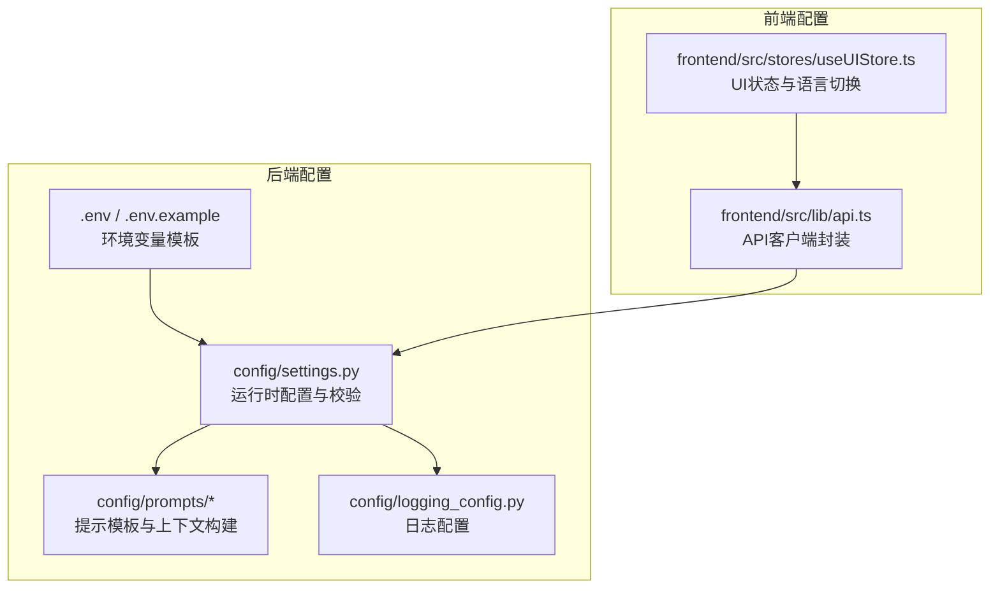
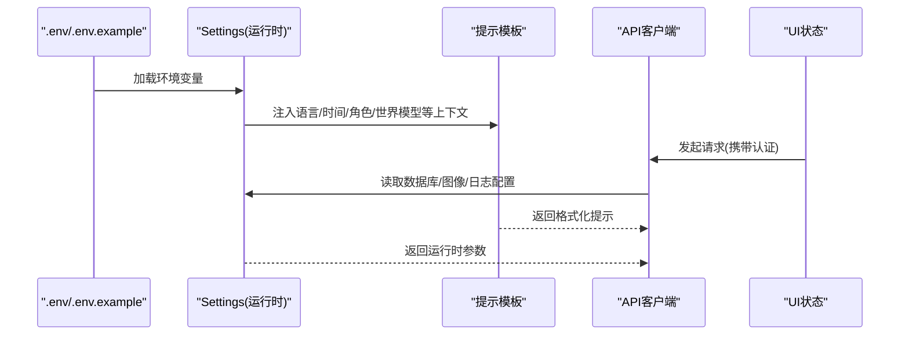
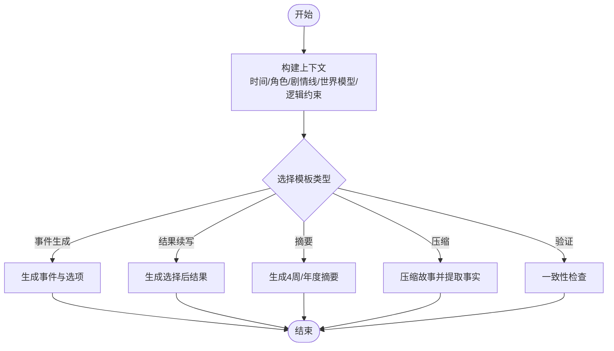
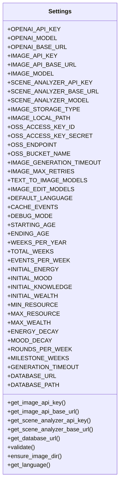
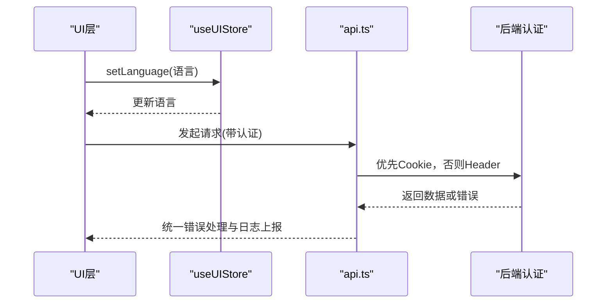
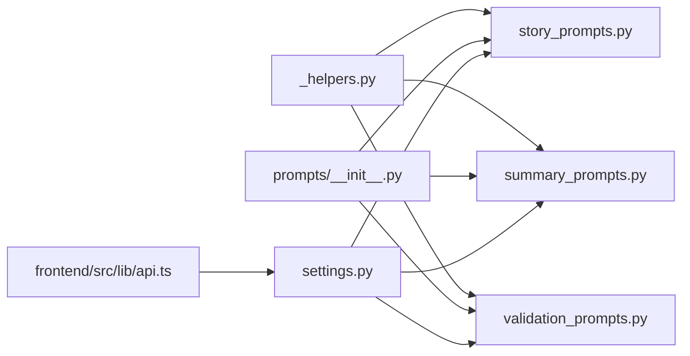

# 配置文件定制

<cite>
**本文档引用的文件**
- [config/settings.py](file://config/settings.py)
- [config/prompts/__init__.py](file://config/prompts/__init__.py)
- [config/prompts/_helpers.py](file://config/prompts/_helpers.py)
- [config/prompts/story_prompts.py](file://config/prompts/story_prompts.py)
- [config/prompts/summary_prompts.py](file://config/prompts/summary_prompts.py)
- [config/prompts/validation_prompts.py](file://config/prompts/validation_prompts.py)
- [config/logging_config.py](file://config/logging_config.py)
- [.env.example](file://.env.example)
- [.env](file://.env)
- [frontend/src/lib/api.ts](file://frontend/src/lib/api.ts)
- [frontend/src/stores/useUIStore.ts](file://frontend/src/stores/useUIStore.ts)
</cite>

## 目录
1. [简介](#简介)
2. [项目结构](#项目结构)
3. [核心组件](#核心组件)
4. [架构总览](#架构总览)
5. [详细组件分析](#详细组件分析)
6. [依赖分析](#依赖分析)
7. [性能考量](#性能考量)
8. [故障排查指南](#故障排查指南)
9. [结论](#结论)
10. [附录](#附录)

## 简介
本指南面向需要定制配置文件的开发者与运营人员，覆盖提示模板修改技术、游戏规则调整、界面定制选项、环境变量配置、版本管理与环境隔离、安全考虑，以及配置验证、热重载与回滚机制的实现方案。文档以仓库现有配置模块为基础，结合前端UI状态与API封装，提供可操作的定制路径与最佳实践。

## 项目结构
配置相关的核心位置集中在 config/ 与 .env* 文件，前端UI状态与API封装位于 frontend/。整体采用“配置集中管理 + 环境变量隔离”的设计，便于多环境部署与快速切换。

**图表来源**
- [config/settings.py](file://config/settings.py#L1-L168)
- [config/prompts/__init__.py](file://config/prompts/__init__.py#L1-L121)
- [config/logging_config.py](file://config/logging_config.py#L1-L78)
- [.env.example](file://.env.example#L1-L22)
- [.env](file://.env#L1-L29)
- [frontend/src/lib/api.ts](file://frontend/src/lib/api.ts#L1-L564)
- [frontend/src/stores/useUIStore.ts](file://frontend/src/stores/useUIStore.ts#L1-L65)

**章节来源**
- [config/settings.py](file://config/settings.py#L1-L168)
- [config/prompts/__init__.py](file://config/prompts/__init__.py#L1-L121)
- [config/logging_config.py](file://config/logging_config.py#L1-L78)
- [.env.example](file://.env.example#L1-L22)
- [.env](file://.env#L1-L29)
- [frontend/src/lib/api.ts](file://frontend/src/lib/api.ts#L1-L564)
- [frontend/src/stores/useUIStore.ts](file://frontend/src/stores/useUIStore.ts#L1-L65)

## 核心组件
- 运行时配置与校验：集中于 Settings 类，负责加载 .env、数据库连接、API密钥、图像服务、语言与缓存开关、调试模式、游戏常量与资源边界、时间控制等。
- 提示模板体系：按功能域拆分 story_prompts、summary_prompts、validation_prompts、world_prompts、character_prompts，并通过 _helpers 提供上下文构建工具。
- 日志配置：生产环境日志级别、文件滚动与第三方库抑制。
- 前端API与UI：API客户端封装认证与错误处理，UI状态管理支持语言切换与模态框。

**章节来源**
- [config/settings.py](file://config/settings.py#L27-L167)
- [config/prompts/__init__.py](file://config/prompts/__init__.py#L1-L121)
- [config/logging_config.py](file://config/logging_config.py#L12-L69)
- [frontend/src/lib/api.ts](file://frontend/src/lib/api.ts#L69-L124)
- [frontend/src/stores/useUIStore.ts](file://frontend/src/stores/useUIStore.ts#L16-L39)

## 架构总览
配置体系通过 Settings 单例在运行时生效，提示模板通过函数组合上下文，前端通过 API 客户端访问后端服务。环境变量提供跨环境隔离，日志配置保障可观测性。

**图表来源**
- [.env.example](file://.env.example#L1-L22)
- [.env](file://.env#L1-L29)
- [config/settings.py](file://config/settings.py#L112-L141)
- [config/prompts/story_prompts.py](file://config/prompts/story_prompts.py#L21-L58)
- [frontend/src/lib/api.ts](file://frontend/src/lib/api.ts#L69-L124)
- [frontend/src/stores/useUIStore.ts](file://frontend/src/stores/useUIStore.ts#L32-L38)

## 详细组件分析

### 提示模板定制技术
提示模板分为四类：故事生成、摘要生成、验证与一致性检查、世界状态与结局、角色创建与档案。通过 _helpers 提供统一的上下文构建能力，支持中英文双语与严格的逻辑约束注入。

- 故事生成提示
  - get_event_generation_prompt：根据玩家状态、角色设定、时间、未完结剧情线、世界模型约束、逻辑约束等生成事件与选项。
  - get_result_generation_prompt：在选择后生成结果续写。
  - get_options_only_prompt / get_story_only_prompt：仅生成选项或纯故事文本。
- 摘要生成提示
  - get_four_week_summary_prompt / get_yearly_summary_prompt：生成4周/年度回顾。
  - get_story_compression_prompt / get_narrative_compression_prompt：压缩故事、判断事件完结、提取世界事实与伏笔回响。
- 验证提示
  - get_story_analysis_prompt：从故事中抽取未来叙事约束的事实。
  - get_consistency_validation_prompt：检查地理、职业、性格、时间、承诺、因果、编造事实等维度的一致性。
- 世界与角色
  - world_prompts：世界提取与结局提示。
  - character_prompts：角色档案合成、设定、关系、初始属性、开场故事等。

**图表来源**
- [config/prompts/story_prompts.py](file://config/prompts/story_prompts.py#L21-L58)
- [config/prompts/summary_prompts.py](file://config/prompts/summary_prompts.py#L33-L77)
- [config/prompts/validation_prompts.py](file://config/prompts/validation_prompts.py#L12-L19)
- [config/prompts/_helpers.py](file://config/prompts/_helpers.py#L1-L800)

**章节来源**
- [config/prompts/story_prompts.py](file://config/prompts/story_prompts.py#L21-L361)
- [config/prompts/summary_prompts.py](file://config/prompts/summary_prompts.py#L33-L718)
- [config/prompts/validation_prompts.py](file://config/prompts/validation_prompts.py#L12-L409)
- [config/prompts/_helpers.py](file://config/prompts/_helpers.py#L1-L800)
- [config/prompts/__init__.py](file://config/prompts/__init__.py#L1-L121)

### 游戏规则调整
Settings 中定义了游戏常量、资源边界、衰减、回合与里程碑、生成超时、数据库连接策略等。可通过环境变量或直接修改源码进行调整。

- 常量与边界
  - 年龄区间、周数、总周数、每周事件数、初始资源、资源上下限、财富上限、衰减系数、每回合数、里程碑周。
- 生成与超时
  - 生成超时时间（秒）。
- 数据库
  - 优先 DATABASE_URL（云数据库），否则回退到本地 SQLite 路径。
- 图像与模型
  - 文生图/编辑模型降级列表、图像生成超时与重试次数、存储类型与OSS配置。
- 语言与缓存
  - 默认语言、事件缓存开关、调试模式。

**图表来源**
- [config/settings.py](file://config/settings.py#L27-L167)

**章节来源**
- [config/settings.py](file://config/settings.py#L30-L141)

### 界面定制选项
前端通过 useUIStore 管理语言、模态框、处理状态与侧边栏；API 客户端封装认证与错误处理，支持 Cookie 与 Authorization Header 双重认证。

- 语言切换
  - UIStore.language 控制前端显示语言；提示模板根据语言参数生成中/英内容。
- 模态框与处理状态
  - 支持登录/注册/保存预设/加载预设/确认删除/故事调整器/游戏菜单等。
- 认证与错误处理
  - 自动注入 Bearer Token 或使用 Cookie；统一捕获与远程上报错误。

**图表来源**
- [frontend/src/stores/useUIStore.ts](file://frontend/src/stores/useUIStore.ts#L16-L39)
- [frontend/src/lib/api.ts](file://frontend/src/lib/api.ts#L69-L124)

**章节来源**
- [frontend/src/stores/useUIStore.ts](file://frontend/src/stores/useUIStore.ts#L16-L39)
- [frontend/src/lib/api.ts](file://frontend/src/lib/api.ts#L69-L124)

### 环境变量配置
- .env.example 提供示例键位，包括 OpenAI/DashScope API 密钥与基础地址、图像服务配置、数据库连接、应用语言与缓存开关、生产环境日志级别等。
- .env 为实际部署密钥与参数，建议在 CI/CD 中注入敏感信息，避免提交到版本库。

常用键位与用途
- OPENAI_API_KEY / OPENAI_BASE_URL / OPENAI_MODEL：主模型API配置。
- IMAGE_API_KEY / IMAGE_API_BASE_URL / IMAGE_MODEL：图像生成服务配置。
- DATABASE_URL：云数据库连接（可选）。
- DEFAULT_LANGUAGE / CACHE_EVENTS / DEBUG_MODE：应用行为控制。
- IMAGE_STORAGE_TYPE / IMAGE_LOCAL_PATH / OSS_*：图像存储与对象存储配置。
- IMAGE_GENERATION_TIMEOUT / IMAGE_MAX_RETRIES：图像生成超时与重试策略。

**章节来源**
- [.env.example](file://.env.example#L1-L22)
- [.env](file://.env#L1-L29)

### 配置验证、热重载与回滚机制
- 配置验证
  - Settings.validate 在启动时校验必要密钥是否存在，防止运行时缺项。
  - 日志配置在生产环境自动启用，第三方库日志级别抑制，降低噪音。
- 热重载
  - 后端：建议通过容器编排或进程管理器监听配置文件变更并重启服务；对于 Python 应用可在开发环境使用自动重启工具。
  - 前端：Next.js 开发服务器支持热更新，修改 UIStore 与 API 客户端可即时生效。
- 回滚机制
  - 建议配合版本控制系统与发布流水线，保留最近N个配置快照；数据库迁移脚本与图像存储路径变更需纳入回滚清单。
  - API 客户端支持统一错误处理与远程日志上报，便于定位回滚原因。

**章节来源**
- [config/settings.py](file://config/settings.py#L143-L149)
- [config/logging_config.py](file://config/logging_config.py#L72-L77)
- [frontend/src/lib/api.ts](file://frontend/src/lib/api.ts#L94-L123)

## 依赖分析
提示模板模块通过统一的 _helpers 导入，形成清晰的依赖关系；Settings 作为运行时配置中心，被各模块间接依赖。

**图表来源**
- [config/prompts/_helpers.py](file://config/prompts/_helpers.py#L1-L800)
- [config/prompts/story_prompts.py](file://config/prompts/story_prompts.py#L4-L18)
- [config/prompts/summary_prompts.py](file://config/prompts/summary_prompts.py#L4-L7)
- [config/prompts/validation_prompts.py](file://config/prompts/validation_prompts.py#L9-L10)
- [config/prompts/__init__.py](file://config/prompts/__init__.py#L21-L77)
- [config/settings.py](file://config/settings.py#L112-L141)
- [frontend/src/lib/api.ts](file://frontend/src/lib/api.ts#L69-L124)

**章节来源**
- [config/prompts/__init__.py](file://config/prompts/__init__.py#L1-L121)
- [config/prompts/_helpers.py](file://config/prompts/_helpers.py#L1-L800)
- [config/prompts/story_prompts.py](file://config/prompts/story_prompts.py#L4-L18)
- [config/prompts/summary_prompts.py](file://config/prompts/summary_prompts.py#L4-L7)
- [config/prompts/validation_prompts.py](file://config/prompts/validation_prompts.py#L9-L10)
- [config/settings.py](file://config/settings.py#L112-L141)
- [frontend/src/lib/api.ts](file://frontend/src/lib/api.ts#L69-L124)

## 性能考量
- 生成超时与重试
  - 通过 IMAGE_GENERATION_TIMEOUT 与 IMAGE_MAX_RETRIES 控制图像生成的稳定性与用户体验。
- 数据库连接
  - 优先使用 DATABASE_URL（云数据库）以提升并发与可靠性；本地回退 SQLite 适合开发与小规模部署。
- 日志级别
  - 生产环境降低第三方库日志级别，减少IO开销与磁盘占用。

[本节为通用指导，无需特定文件引用]

## 故障排查指南
- 启动报错：OPENAI_API_KEY 未配置
  - 现象：启动即抛出缺失密钥异常。
  - 排查：检查 .env 是否存在 OPENAI_API_KEY；确认 .env.example 与 .env 内容。
- 图像生成失败
  - 现象：图像生成超时或重试耗尽。
  - 排查：检查 IMAGE_API_KEY/IMAGE_API_BASE_URL/IMAGE_MODEL；调整 IMAGE_GENERATION_TIMEOUT 与 IMAGE_MAX_RETRIES。
- 数据库连接异常
  - 现象：无法连接数据库。
  - 排查：若 DATABASE_URL 为空，确认 SQLite 路径存在且可写；确保项目根目录权限正确。
- 日志未输出
  - 现象：生产环境无日志文件。
  - 排查：确认 ENVIRONMENT=production 且 LOG_LEVEL 设置；检查 logs/ 目录权限。

**章节来源**
- [config/settings.py](file://config/settings.py#L143-L149)
- [config/logging_config.py](file://config/logging_config.py#L72-L77)
- [.env.example](file://.env.example#L1-L22)
- [.env](file://.env#L1-L29)

## 结论
通过集中化的 Settings 与模块化的提示模板，本项目提供了灵活的配置扩展点。结合 .env 环境变量与前端 UI 状态管理，可在不改动核心逻辑的前提下实现多维度定制。建议在团队内建立配置变更流程、版本与回滚策略，确保可追踪与可恢复。

[本节为总结，无需特定文件引用]

## 附录

### A. 提示模板定制清单
- 故事生成
  - 修改 get_event_generation_prompt 的生成要求与输出格式约束。
  - 调整 _get_chinese_prompt/_get_english_prompt 的叙事长度、对话轮次与决策点要求。
- 摘要生成
  - 调整 get_four_week_summary_prompt / get_yearly_summary_prompt 的时间上下文与总结长度。
  - 优化 get_story_compression_prompt 的事实抽取与伏笔回响规则。
- 验证与一致性
  - 优化 get_story_analysis_prompt 的事实类型与约束文本生成。
  - 调整 get_consistency_validation_prompt 的检查维度与严重级别判断。
- 上下文构建
  - 利用 _helpers 的时间、人物、剧情线、世界模型、逻辑约束、习惯与伏笔回响等工具函数。

**章节来源**
- [config/prompts/story_prompts.py](file://config/prompts/story_prompts.py#L21-L361)
- [config/prompts/summary_prompts.py](file://config/prompts/summary_prompts.py#L33-L718)
- [config/prompts/validation_prompts.py](file://config/prompts/validation_prompts.py#L12-L409)
- [config/prompts/_helpers.py](file://config/prompts/_helpers.py#L1-L800)

### B. 游戏规则调整清单
- 常量与边界
  - STARTING_AGE / ENDING_AGE / WEEKS_PER_YEAR / TOTAL_WEEKS / EVENTS_PER_WEEK
  - INITIAL_* / MIN_RESOURCE / MAX_RESOURCE / MAX_WEALTH / ENERGY_DECAY / MOOD_DECAY
  - ROUNDS_PER_WEEK / MILESTONE_WEEKS
- 生成与超时
  - GENERATION_TIMEOUT
- 数据库与图像
  - DATABASE_URL / DATABASE_PATH
  - IMAGE_* 与 OSS_* 配置

**章节来源**
- [config/settings.py](file://config/settings.py#L70-L141)

### C. 界面定制清单
- 语言切换
  - UIStore.language 与提示模板语言参数联动。
- 模态框与导航
  - activeModal / modalData / sidebarOpen 状态管理。
- 认证与错误处理
  - Cookie 与 Header 双重认证策略；统一错误捕获与远程日志上报。

**章节来源**
- [frontend/src/stores/useUIStore.ts](file://frontend/src/stores/useUIStore.ts#L16-L39)
- [frontend/src/lib/api.ts](file://frontend/src/lib/api.ts#L69-L124)

### D. 环境变量清单
- OpenAI/DashScope API：OPENAI_API_KEY / OPENAI_BASE_URL / OPENAI_MODEL
- 图像服务：IMAGE_API_KEY / IMAGE_API_BASE_URL / IMAGE_MODEL / IMAGE_GENERATION_TIMEOUT / IMAGE_MAX_RETRIES
- 数据库：DATABASE_URL（可选）
- 应用：DEFAULT_LANGUAGE / CACHE_EVENTS / DEBUG_MODE
- 图像存储：IMAGE_STORAGE_TYPE / IMAGE_LOCAL_PATH / OSS_*

**章节来源**
- [.env.example](file://.env.example#L1-L22)
- [.env](file://.env#L1-L29)

### E. 安全与合规建议
- 密钥管理
  - 使用 .env 管理密钥，CI/CD 注入；禁止提交至仓库。
- 日志与审计
  - 生产环境日志级别与文件滚动；避免在日志中输出敏感信息。
- 认证与授权
  - 优先使用 Cookie 认证；确保 HTTPS 传输；限制前端暴露的敏感接口。

**章节来源**
- [config/logging_config.py](file://config/logging_config.py#L72-L77)
- [frontend/src/lib/api.ts](file://frontend/src/lib/api.ts#L69-L124)