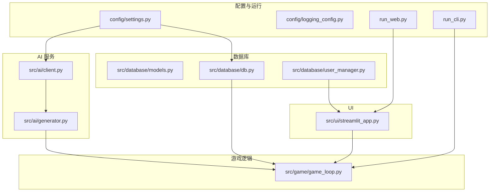
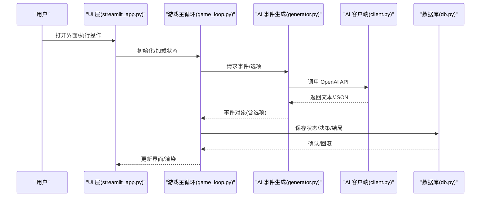
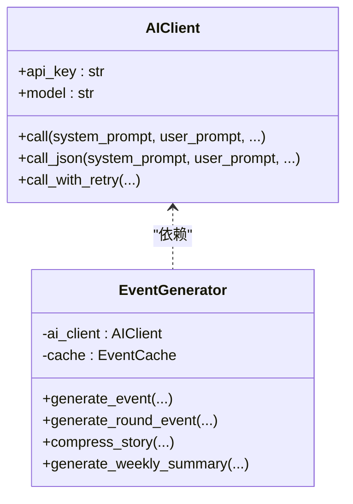
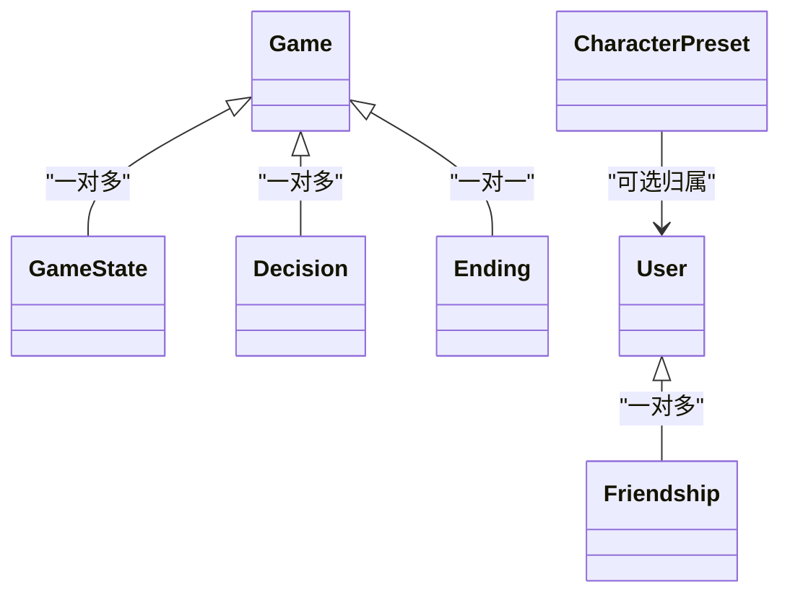
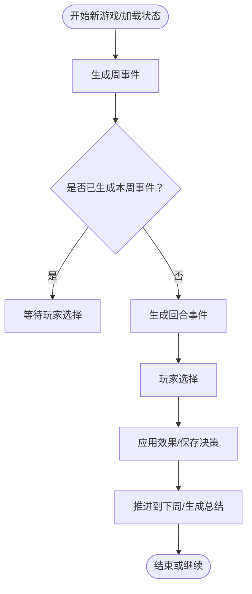
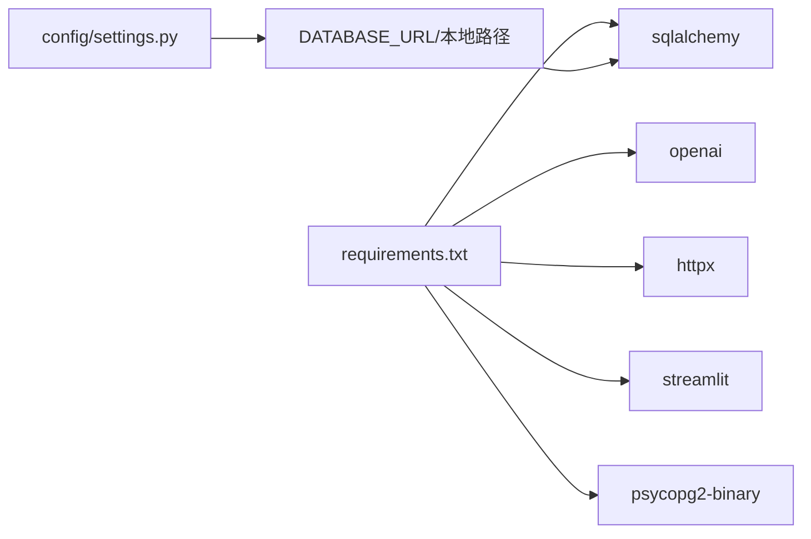

# 故障排除

<cite>
**本文引用的文件**
- [README.md](file://README.md)
- [requirements.txt](file://requirements.txt)
- [config/settings.py](file://config/settings.py)
- [config/logging_config.py](file://config/logging_config.py)
- [src/database/db.py](file://src/database/db.py)
- [src/database/models.py](file://src/database/models.py)
- [src/database/user_manager.py](file://src/database/user_manager.py)
- [src/ai/client.py](file://src/ai/client.py)
- [src/ai/generator.py](file://src/ai/generator.py)
- [src/game/game_loop.py](file://src/game/game_loop.py)
- [src/ui/streamlit_app.py](file://src/ui/streamlit_app.py)
- [run_web.py](file://run_web.py)
- [run_cli.py](file://run_cli.py)
- [tests/test_database.py](file://tests/test_database.py)
- [tests/test_ai_modules.py](file://tests/test_ai_modules.py)
- [logs/test.log](file://logs/test.log)
- [streamlit.log](file://streamlit.log)
</cite>

## 目录
1. [简介](#简介)
2. [项目结构](#项目结构)
3. [核心组件](#核心组件)
4. [架构总览](#架构总览)
5. [详细组件分析](#详细组件分析)
6. [依赖关系分析](#依赖关系分析)
7. [性能考虑](#性能考虑)
8. [故障排除指南](#故障排除指南)
9. [结论](#结论)
10. [附录](#附录)

## 简介
本指南面向使用者与开发者，提供系统化的故障排除方法，覆盖 AI API 连接问题、数据库连接失败、UI 渲染错误、网络与权限配置、环境兼容性、日志分析与错误解读、性能排查与优化建议，并给出调试工具使用与问题上报流程，以及问题分类与优先级处理机制。

## 项目结构
该项目为一个基于文本的生涯模拟游戏，包含配置层、AI 服务层、数据库层、游戏逻辑层与 UI 层。关键模块如下：
- 配置与日志：环境变量加载、日志配置、数据库连接策略
- AI 服务：统一客户端封装、事件生成、缓存与重试
- 数据库：ORM 模型、持久化操作、用户管理
- 游戏逻辑：主循环、回合系统、事件与选项生成
- UI：Streamlit Web 界面、CLI 入口、页面视图与状态管理

**图表来源**
- [config/settings.py](file://config/settings.py#L1-L100)
- [config/logging_config.py](file://config/logging_config.py#L1-L78)
- [src/ai/client.py](file://src/ai/client.py#L1-L214)
- [src/ai/generator.py](file://src/ai/generator.py#L1-L407)
- [src/database/db.py](file://src/database/db.py#L1-L517)
- [src/database/models.py](file://src/database/models.py)
- [src/database/user_manager.py](file://src/database/user_manager.py)
- [src/game/game_loop.py](file://src/game/game_loop.py#L1-L800)
- [src/ui/streamlit_app.py](file://src/ui/streamlit_app.py#L1-L215)
- [run_web.py](file://run_web.py#L1-L11)
- [run_cli.py](file://run_cli.py#L1-L7)

**章节来源**
- [README.md](file://README.md#L1-L84)
- [config/settings.py](file://config/settings.py#L1-L100)
- [config/logging_config.py](file://config/logging_config.py#L1-L78)
- [src/ai/client.py](file://src/ai/client.py#L1-L214)
- [src/ai/generator.py](file://src/ai/generator.py#L1-L407)
- [src/database/db.py](file://src/database/db.py#L1-L517)
- [src/database/models.py](file://src/database/models.py)
- [src/database/user_manager.py](file://src/database/user_manager.py)
- [src/game/game_loop.py](file://src/game/game_loop.py#L1-L800)
- [src/ui/streamlit_app.py](file://src/ui/streamlit_app.py#L1-L215)
- [run_web.py](file://run_web.py#L1-L11)
- [run_cli.py](file://run_cli.py#L1-L7)

## 核心组件
- 配置与设置：集中管理环境变量、数据库连接策略、语言与缓存开关、调试模式等
- AI 客户端与事件生成：统一调用 OpenAI SDK，封装流式回调、JSON 解析、重试与错误反馈注入
- 数据库与用户管理：ORM 模型定义、会话管理、增删改查、级联删除、用户登录与好友系统
- 游戏主循环：周/回合事件生成、决策处理、资源衰减、里程碑与总结生成
- UI 层：Streamlit 页面路由、会话状态、调试控制台、入口脚本

**章节来源**
- [config/settings.py](file://config/settings.py#L30-L100)
- [src/ai/client.py](file://src/ai/client.py#L22-L214)
- [src/ai/generator.py](file://src/ai/generator.py#L30-L407)
- [src/database/db.py](file://src/database/db.py#L10-L517)
- [src/database/models.py](file://src/database/models.py)
- [src/database/user_manager.py](file://src/database/user_manager.py)
- [src/game/game_loop.py](file://src/game/game_loop.py#L23-L800)
- [src/ui/streamlit_app.py](file://src/ui/streamlit_app.py#L139-L215)

## 架构总览
系统采用分层架构：UI 层负责交互与状态；游戏逻辑层协调事件与决策；AI 服务层提供内容生成；数据库层负责持久化与用户管理；配置与日志贯穿各层。

**图表来源**
- [src/ui/streamlit_app.py](file://src/ui/streamlit_app.py#L139-L215)
- [src/game/game_loop.py](file://src/game/game_loop.py#L153-L256)
- [src/ai/generator.py](file://src/ai/generator.py#L159-L214)
- [src/ai/client.py](file://src/ai/client.py#L51-L105)
- [src/database/db.py](file://src/database/db.py#L17-L144)

## 详细组件分析

### AI 客户端与事件生成
- 统一客户端封装 OpenAI SDK，支持流式回调、JSON 解析、重试与错误反馈注入
- 事件生成器采用门面模式，委托给故事生成、选项生成、摘要生成与重写器
- 支持事件缓存与预设事件，提升稳定性与性能

**图表来源**
- [src/ai/client.py](file://src/ai/client.py#L22-L214)
- [src/ai/generator.py](file://src/ai/generator.py#L30-L407)

**章节来源**
- [src/ai/client.py](file://src/ai/client.py#L22-L214)
- [src/ai/generator.py](file://src/ai/generator.py#L30-L407)

### 数据库与用户管理
- ORM 模型定义 Game、GameState、Decision、Ending、CharacterPreset、User、Friendship
- GameDatabase 提供创建/保存/加载/删除等操作，支持用户权限校验与级联删除
- UserManager 提供用户创建、登录、显示名更新、好友请求与关系管理

**图表来源**
- [src/database/models.py](file://src/database/models.py)
- [src/database/db.py](file://src/database/db.py#L10-L517)
- [tests/test_database.py](file://tests/test_database.py#L11-L643)

**章节来源**
- [src/database/db.py](file://src/database/db.py#L10-L517)
- [src/database/models.py](file://src/database/models.py)
- [src/database/user_manager.py](file://src/database/user_manager.py)
- [tests/test_database.py](file://tests/test_database.py#L258-L410)

### 游戏主循环与回合系统
- 周期性事件生成、回合事件生成、决策处理、资源衰减、里程碑与总结
- 支持回退事件生成与异常兜底，保证稳定性

**图表来源**
- [src/game/game_loop.py](file://src/game/game_loop.py#L153-L350)

**章节来源**
- [src/game/game_loop.py](file://src/game/game_loop.py#L153-L350)

### UI 层与入口
- Streamlit 应用入口，加载环境变量、初始化数据库与样式、会话状态与调试控制台
- Web 启动脚本允许局域网访问，CLI 启动脚本直连游戏逻辑

**章节来源**
- [src/ui/streamlit_app.py](file://src/ui/streamlit_app.py#L1-L215)
- [run_web.py](file://run_web.py#L1-L11)
- [run_cli.py](file://run_cli.py#L1-L7)

## 依赖关系分析
- 运行时依赖：OpenAI SDK、httpx、Streamlit、SQLAlchemy、psycopg2-binary、pytest 等
- 配置依赖：dotenv 加载 .env 环境变量
- 数据库依赖：根据 DATABASE_URL 决定云数据库或本地 SQLite

**图表来源**
- [requirements.txt](file://requirements.txt#L1-L9)
- [config/settings.py](file://config/settings.py#L68-L82)

**章节来源**
- [requirements.txt](file://requirements.txt#L1-L9)
- [config/settings.py](file://config/settings.py#L68-L82)

## 性能考虑
- AI 生成：启用事件缓存与预设事件，减少重复调用；合理设置温度与最大令牌数
- 数据库：批量写入、事务回滚、索引与查询优化；避免不必要的级联删除
- UI：按需渲染、流式回调、调试控制台仅在调试模式启用
- 网络：重试与退避策略，避免频繁重试造成拥塞

[本节为通用指导，不直接分析具体文件]

## 故障排除指南

### 一、AI API 连接问题
- 症状
  - 日志中出现连接错误与重试信息
  - 事件生成失败，回退到规则生成
- 排查步骤
  1) 检查 OPENAI_API_KEY 是否设置
     - 在 .env 中设置 OPENAI_API_KEY，或在运行环境中导出
  2) 检查网络连通性与代理设置
     - 若使用自定义 base_url，请确认地址可达
  3) 查看日志中的重试与错误反馈
     - 日志中包含 Retrying 与 Connection error 的条目
  4) 验证模型名称与限额
     - OPENAI_MODEL 与配额限制可能导致调用失败
- 解决方案
  - 正确配置 OPENAI_API_KEY 与 OPENAI_MODEL
  - 如需私有部署，设置 OPENAI_BASE_URL
  - 适当降低并发与频率，启用缓存
  - 使用 call_with_retry 并关注错误反馈注入

**章节来源**
- [config/settings.py](file://config/settings.py#L33-L41)
- [src/ai/client.py](file://src/ai/client.py#L40-L47)
- [src/ai/client.py](file://src/ai/client.py#L140-L214)
- [streamlit.log](file://streamlit.log#L20-L35)
- [streamlit.log](file://streamlit.log#L398-L427)

### 二、数据库连接失败
- 症状
  - 初始化数据库时报错
  - 查询/保存失败，事务回滚
- 排查步骤
  1) 确认 DATABASE_URL 或本地 SQLite 路径
     - 云环境使用 DATABASE_URL，本地使用 data/game.db
  2) 检查数据目录权限
     - data 目录需可写，否则可能在云环境失败
  3) 查看 ORM 操作日志
     - 保存状态/决策/结局时的异常与回滚
- 解决方案
  - 在云环境设置 DATABASE_URL
  - 本地确保 data 目录存在且可写
  - 使用事务包裹批量写入，捕获异常并回滚

**章节来源**
- [config/settings.py](file://config/settings.py#L68-L82)
- [src/database/db.py](file://src/database/db.py#L22-L27)
- [src/database/db.py](file://src/database/db.py#L395-L409)

### 三、UI 渲染错误
- 症状
  - 页面无法加载或空白
  - 字符串拼接错误（如序列项类型不匹配）
- 排查步骤
  1) 检查日志中的错误信息
     - 如“序列项 0: 期望 str 实例，得到 dict”
  2) 确认会话状态与路由
     - 确保 init_session_state 与状态机路由正确
  3) 检查调试控制台
     - 仅在 DEBUG_MODE 下启用
- 解决方案
  - 修复数据类型，确保 UI 接收字符串
  - 重置会话状态，重新加载游戏
  - 在调试模式下查看控制台输出

**章节来源**
- [src/ui/streamlit_app.py](file://src/ui/streamlit_app.py#L160-L164)
- [src/ui/streamlit_app.py](file://src/ui/streamlit_app.py#L141-L147)
- [streamlit.log](file://streamlit.log#L111-L111)
- [streamlit.log](file://streamlit.log#L248-L248)

### 四、网络连接问题
- 症状
  - 无法访问 Web UI（局域网不可见）
- 排查步骤
  1) 确认 run_web.py 的服务器地址参数
     - 默认绑定到 0.0.0.0，允许局域网访问
  2) 检查防火墙与端口占用
- 解决方案
  - 使用 run_web.py 启动，或直接 streamlit 运行
  - 确保 8501 端口未被占用

**章节来源**
- [run_web.py](file://run_web.py#L7-L10)

### 五、权限配置问题
- 症状
  - 用户登录/保存失败
  - 无法加载他人存档
- 排查步骤
  1) 检查用户 ID 与权限校验
     - GameDatabase.get_game(user_id) 与删除权限
  2) 查看 UserManager 的登录与好友流程
- 解决方案
  - 确保 user_id 与 game_id 匹配
  - 使用正确的私有 ID 登录

**章节来源**
- [src/database/db.py](file://src/database/db.py#L174-L194)
- [src/database/db.py](file://src/database/db.py#L366-L391)
- [src/database/user_manager.py](file://src/database/user_manager.py)

### 六、环境兼容性问题
- 症状
  - 依赖版本冲突或导入失败
- 排查步骤
  1) 对照 requirements.txt 的版本范围
  2) 确认 Python 版本与虚拟环境
- 解决方案
  - 使用推荐的依赖版本
  - 在独立虚拟环境中安装

**章节来源**
- [requirements.txt](file://requirements.txt#L1-L9)

### 七、日志分析与错误解读
- 日志位置
  - Streamlit 应用日志：streamlit.log
  - 生产日志：logs/app.log（按需启用）
- 常见错误模式
  - “Retrying request to /chat/completions”：网络波动或速率限制
  - “Connection error.”：网络不通或 API Key 错误
  - “sequence item 0: expected str instance, dict found”：UI 数据类型错误
- 建议
  - 结合日志时间戳与模块名定位问题
  - 逐步缩小范围：AI -> 数据库 -> UI

**章节来源**
- [config/logging_config.py](file://config/logging_config.py#L12-L78)
- [streamlit.log](file://streamlit.log#L1-L800)

### 八、性能问题排查与优化
- AI 生成慢
  - 启用事件缓存，复用预设事件
  - 降低温度与最大令牌数
- 数据库写入慢
  - 批量写入，减少事务次数
  - 优化查询与索引
- UI 响应慢
  - 减少一次性渲染的数据量
  - 使用流式回调与分页

**章节来源**
- [src/ai/generator.py](file://src/ai/generator.py#L54-L66)
- [src/database/db.py](file://src/database/db.py#L395-L409)

### 九、调试工具使用与问题上报流程
- 调试工具
  - Streamlit 调试控制台（仅调试模式）
  - 日志文件与日志级别设置
- 问题上报
  - 步骤
    1) 复现问题并记录操作步骤
    2) 截取相关日志片段（含时间戳与模块名）
    3) 提供环境信息（Python 版本、依赖版本、数据库类型）
    4) 描述期望行为与实际行为
  - 提交渠道
    - 使用仓库的问题跟踪系统提交 Issue

**章节来源**
- [src/ui/streamlit_app.py](file://src/ui/streamlit_app.py#L160-L164)
- [config/logging_config.py](file://config/logging_config.py#L12-L78)

### 十、问题分类与优先级处理机制
- 分类
  - 配置类：API Key、数据库 URL、语言设置
  - 运行类：网络、端口、权限
  - 业务类：AI 生成、存档/读档、UI 渲染
  - 性能类：缓存、并发、IO
- 优先级
  - P0：影响启动与核心功能（如 API Key 缺失、数据库不可用）
  - P1：影响主要流程（如事件生成失败、UI 白屏）
  - P2：影响体验（如加载缓慢、日志过多）
  - P3：文档与辅助功能（如调试控制台）

[本节为通用指导，不直接分析具体文件]

## 结论
通过本指南，您可以系统化地定位与解决项目中的常见问题。建议在开发与运维过程中：
- 始终检查配置与日志
- 优先处理 P0/P1 问题
- 使用缓存与重试提升稳定性
- 保持依赖版本一致与环境隔离

[本节为总结，不直接分析具体文件]

## 附录

### A. 常见错误对照表
- OPENAI_API_KEY 未设置：检查 .env 与运行环境
- 数据库 URL 未设置：云环境需 DATABASE_URL
- 连接错误：网络/代理/API Key/速率限制
- UI 类型错误：数据类型不匹配，修复 UI 输入
- 会话异常：重置会话状态或重启应用

**章节来源**
- [config/settings.py](file://config/settings.py#L84-L90)
- [src/ai/client.py](file://src/ai/client.py#L40-L47)
- [src/database/db.py](file://src/database/db.py#L22-L27)
- [streamlit.log](file://streamlit.log#L111-L111)

### B. 快速检查清单
- 环境变量：OPENAI_API_KEY、OPENAI_MODEL、DATABASE_URL
- 网络：可访问 OpenAI 接口，端口 8501 可用
- 数据库：data 目录可写，SQLite 文件存在或云数据库可达
- UI：DEBUG_MODE 正确，浏览器打开 http://localhost:8501
- 日志：查看 streamlit.log 与 app.log

**章节来源**
- [config/settings.py](file://config/settings.py#L33-L41)
- [run_web.py](file://run_web.py#L7-L10)
- [config/logging_config.py](file://config/logging_config.py#L12-L78)