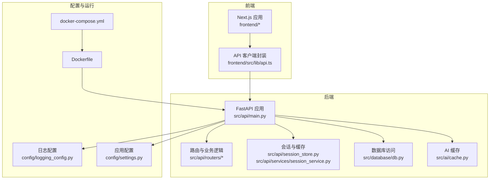
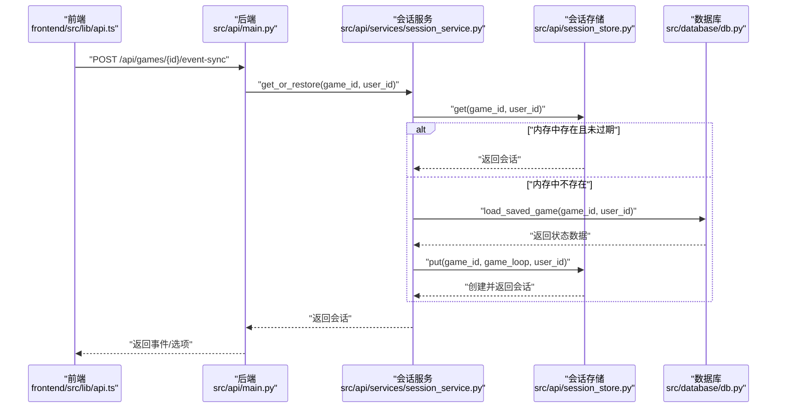
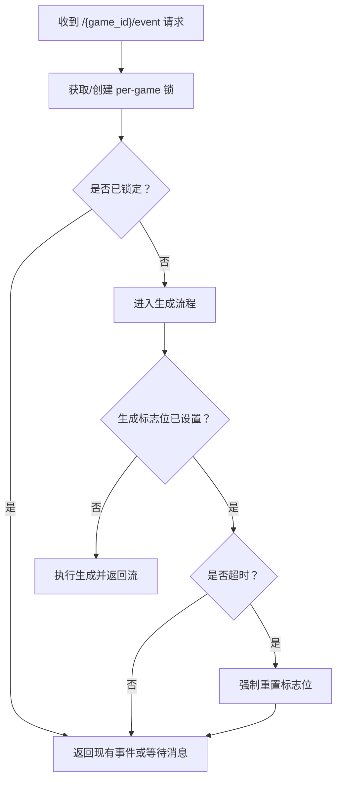
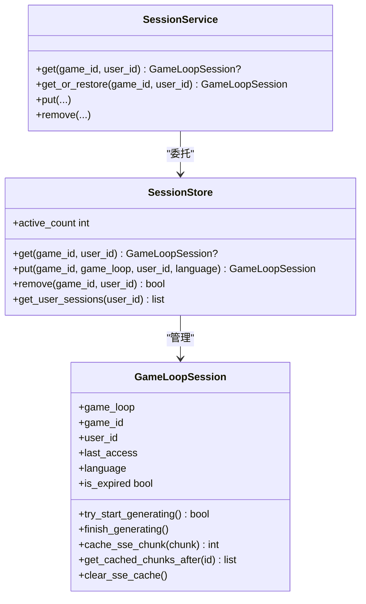
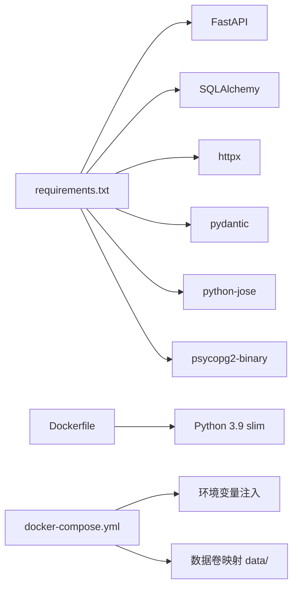

# 故障排除与调试

<cite>
**本文引用的文件**
- [README.md](file://README.md)
- [config/logging_config.py](file://config/logging_config.py)
- [config/settings.py](file://config/settings.py)
- [src/api/main.py](file://src/api/main.py)
- [src/api/routers/gameplay/events.py](file://src/api/routers/gameplay/events.py)
- [src/api/session_store.py](file://src/api/session_store.py)
- [src/api/services/session_service.py](file://src/api/services/session_service.py)
- [src/database/db.py](file://src/database/db.py)
- [src/ai/cache.py](file://src/ai/cache.py)
- [frontend/src/lib/api.ts](file://frontend/src/lib/api.ts)
- [logs/api_restart.log](file://logs/api_restart.log)
- [requirements.txt](file://requirements.txt)
- [Dockerfile](file://Dockerfile)
- [docker-compose.yml](file://docker-compose.yml)
</cite>

## 目录
1. [简介](#简介)
2. [项目结构](#项目结构)
3. [核心组件](#核心组件)
4. [架构总览](#架构总览)
5. [详细组件分析](#详细组件分析)
6. [依赖关系分析](#依赖关系分析)
7. [性能考量](#性能考量)
8. [故障排除指南](#故障排除指南)
9. [结论](#结论)
10. [附录](#附录)

## 简介
本指南面向“人生草稿本”项目的运维与开发人员，聚焦于启动失败、API 错误、数据库连接问题、日志分析、断点调试、性能优化、缓存问题、网络连接排查、第三方服务集成问题以及生产环境应急响应流程。文档结合仓库实际代码与日志，提供可操作的排障步骤与最佳实践。

## 项目结构
项目采用后端 FastAPI + 前端 Next.js 的双栈架构，配合 SQLAlchemy 数据库与 AI 事件生成模块。日志系统支持控制台与文件输出，配置集中于 settings 与 logging_config；容器化通过 Dockerfile 与 docker-compose 提供一键部署能力。

图表来源
- [src/api/main.py](file://src/api/main.py#L1-L134)
- [src/api/routers/gameplay/events.py](file://src/api/routers/gameplay/events.py#L1-L212)
- [src/api/session_store.py](file://src/api/session_store.py#L1-L200)
- [src/api/services/session_service.py](file://src/api/services/session_service.py#L1-L158)
- [src/database/db.py](file://src/database/db.py#L1-L910)
- [src/ai/cache.py](file://src/ai/cache.py#L1-L139)
- [frontend/src/lib/api.ts](file://frontend/src/lib/api.ts#L1-L564)
- [config/logging_config.py](file://config/logging_config.py#L1-L78)
- [config/settings.py](file://config/settings.py#L1-L168)
- [Dockerfile](file://Dockerfile#L1-L40)
- [docker-compose.yml](file://docker-compose.yml#L1-L65)

章节来源
- [README.md](file://README.md#L74-L87)
- [config/logging_config.py](file://config/logging_config.py#L1-L78)
- [config/settings.py](file://config/settings.py#L1-L168)
- [src/api/main.py](file://src/api/main.py#L1-L134)
- [src/database/db.py](file://src/database/db.py#L1-L910)
- [src/ai/cache.py](file://src/ai/cache.py#L1-L139)
- [frontend/src/lib/api.ts](file://frontend/src/lib/api.ts#L1-L564)
- [Dockerfile](file://Dockerfile#L1-L40)
- [docker-compose.yml](file://docker-compose.yml#L1-L65)

## 核心组件
- 日志系统：统一日志初始化与第三方库日志级别控制，支持文件轮转与控制台输出。
- 配置中心：集中管理 API 密钥、数据库连接、图像服务、缓存开关与调试模式等。
- 会话与缓存：内存会话存储、SSE 断线重连缓存、数据库自动恢复。
- 数据库访问：ORM 封装，提供存档、回溯、查询与一致性校验辅助功能。
- AI 事件缓存：本地 JSON 缓存，降低外部 API 调用频率。
- 前端 API 客户端：统一 fetch 封装、Cookie/Token 双重认证、远程日志上报。

章节来源
- [config/logging_config.py](file://config/logging_config.py#L12-L69)
- [config/settings.py](file://config/settings.py#L27-L167)
- [src/api/session_store.py](file://src/api/session_store.py#L15-L98)
- [src/api/services/session_service.py](file://src/api/services/session_service.py#L24-L157)
- [src/database/db.py](file://src/database/db.py#L13-L684)
- [src/ai/cache.py](file://src/ai/cache.py#L13-L139)
- [frontend/src/lib/api.ts](file://frontend/src/lib/api.ts#L69-L124)

## 架构总览
后端通过 FastAPI 提供 REST 与 SSE 接口，前端通过统一 API 客户端发起请求。会话服务负责内存与数据库之间的状态恢复，数据库模块提供持久化与查询能力，AI 缓存减少外部依赖压力。

图表来源
- [frontend/src/lib/api.ts](file://frontend/src/lib/api.ts#L357-L376)
- [src/api/main.py](file://src/api/main.py#L166-L175)
- [src/api/services/session_service.py](file://src/api/services/session_service.py#L49-L121)
- [src/api/session_store.py](file://src/api/session_store.py#L123-L156)
- [src/database/db.py](file://src/database/db.py#L385-L426)

## 详细组件分析

### 后端入口与全局异常处理
- 生命周期钩子负责数据库初始化与优雅停机日志。
- 全局异常处理器捕获未处理异常并返回统一 JSON。
- 健康检查端点暴露活动会话数，便于监控。

章节来源
- [src/api/main.py](file://src/api/main.py#L24-L33)
- [src/api/main.py](file://src/api/main.py#L69-L76)
- [src/api/main.py](file://src/api/main.py#L92-L99)

### 事件生成与并发控制（SSE）
- 使用 per-game asyncio.Lock 防止并发生成。
- 支持 Last-Event-ID 断线重连，内置 SSE 缓存与等待消息。
- 超时检测与强制重置，避免生成状态悬挂。

图表来源
- [src/api/routers/gameplay/events.py](file://src/api/routers/gameplay/events.py#L35-L41)
- [src/api/routers/gameplay/events.py](file://src/api/routers/gameplay/events.py#L88-L120)
- [src/api/routers/gameplay/events.py](file://src/api/routers/gameplay/events.py#L122-L147)

章节来源
- [src/api/routers/gameplay/events.py](file://src/api/routers/gameplay/events.py#L48-L164)
- [src/api/routers/gameplay/events.py](file://src/api/routers/gameplay/events.py#L167-L212)

### 会话存储与自动恢复
- 内存会话带超时清理，支持 SSE 缓存与事件 ID。
- 会话服务在内存缺失时从数据库恢复状态，创建 GameLoop 并写回内存。
- 异常路径统一抛出 404/401，前端据此提示用户加载或登录。

图表来源
- [src/api/session_store.py](file://src/api/session_store.py#L100-L196)
- [src/api/session_store.py](file://src/api/session_store.py#L15-L98)
- [src/api/services/session_service.py](file://src/api/services/session_service.py#L24-L157)

章节来源
- [src/api/session_store.py](file://src/api/session_store.py#L100-L196)
- [src/api/services/session_service.py](file://src/api/services/session_service.py#L49-L121)

### 数据库访问与一致性校验
- 提供存档、回溯、查询与搜索历史故事的能力。
- 支持关键词检索与一致性校验辅助，便于审计与问题定位。
- 事务回滚与错误日志记录，保障数据一致性。

章节来源
- [src/database/db.py](file://src/database/db.py#L13-L684)
- [src/database/db.py](file://src/database/db.py#L213-L282)

### AI 事件缓存
- 基于签名的键生成，降低重复请求。
- 本地 JSON 文件持久化，支持清空与统计。
- 随机命中率控制，保证多样性。

章节来源
- [src/ai/cache.py](file://src/ai/cache.py#L13-L139)

### 前端 API 客户端与认证
- 双重认证：Cookie（优先，支持 iPad Safari）+ Authorization Header（localStorage token）。
- 统一错误处理与远程日志上报，便于移动端问题追踪。
- 提供非流式回退接口，适配移动网络弱环境。

章节来源
- [frontend/src/lib/api.ts](file://frontend/src/lib/api.ts#L69-L124)
- [frontend/src/lib/api.ts](file://frontend/src/lib/api.ts#L166-L201)
- [frontend/src/lib/api.ts](file://frontend/src/lib/api.ts#L357-L376)

## 依赖关系分析
- 后端依赖：FastAPI、SQLAlchemy、httpx、pydantic、python-jose、psycopg2（云部署）。
- 容器化：Dockerfile 指定健康检查与端口暴露；docker-compose 提供环境变量与资源限制。

图表来源
- [requirements.txt](file://requirements.txt#L1-L12)
- [Dockerfile](file://Dockerfile#L1-L40)
- [docker-compose.yml](file://docker-compose.yml#L1-L65)

章节来源
- [requirements.txt](file://requirements.txt#L1-L12)
- [Dockerfile](file://Dockerfile#L1-L40)
- [docker-compose.yml](file://docker-compose.yml#L1-L65)

## 性能考量
- 内存会话与 SSE 缓存：合理设置缓存上限与会话超时，避免内存膨胀。
- 事件生成并发：使用 per-game 锁避免竞态与重复计算。
- 数据库查询：利用 ORM 查询链与排序限制，避免全表扫描。
- AI 缓存：适度命中率与键签名，平衡多样性与成本。
- 容器资源：通过 docker-compose 限制 CPU 与内存，防止突发流量导致 OOM。

章节来源
- [src/api/session_store.py](file://src/api/session_store.py#L11-L12)
- [src/api/session_store.py](file://src/api/session_store.py#L20-L21)
- [src/api/routers/gameplay/events.py](file://src/api/routers/gameplay/events.py#L30-L41)
- [src/database/db.py](file://src/database/db.py#L186-L201)
- [src/ai/cache.py](file://src/ai/cache.py#L93-L94)
- [docker-compose.yml](file://docker-compose.yml#L35-L42)

## 故障排除指南

### 启动失败
- 症状：Uvicorn 启动报错、端口占用、依赖缺失。
- 排查步骤：
  - 检查端口占用与防火墙设置。
  - 确认 Python 版本与虚拟环境激活。
  - 安装依赖：pip install -r requirements.txt。
  - Docker 启动：docker-compose up，查看健康检查与日志。
- 关联日志：参考 api_restart.log 中的启动与停止节点。

章节来源
- [Dockerfile](file://Dockerfile#L35-L36)
- [docker-compose.yml](file://docker-compose.yml#L28-L33)
- [logs/api_restart.log](file://logs/api_restart.log#L1-L450)

### API 错误（401/404/500）
- 401 未授权：前端未正确携带 Cookie 或 Token；检查登录流程与 set-cookie。
- 404 未找到：游戏不存在或不属于当前用户；检查 get_or_restore 逻辑与数据库状态。
- 500 服务器错误：全局异常处理器已捕获，查看后端日志定位具体异常。
- 建议：开启 DEBUG_MODE 并检查 settings 与日志级别。

章节来源
- [frontend/src/lib/api.ts](file://frontend/src/lib/api.ts#L166-L201)
- [src/api/services/session_service.py](file://src/api/services/session_service.py#L95-L99)
- [src/api/main.py](file://src/api/main.py#L69-L76)
- [config/settings.py](file://config/settings.py#L72-L73)

### 数据库连接问题
- 本地 SQLite：确认 data/game.db 存在与权限。
- 云数据库：检查 DATABASE_URL；如需 PostgreSQL，安装 psycopg2-binary。
- 连接失败：查看数据库日志与容器健康检查；必要时迁移或重建表。

章节来源
- [config/settings.py](file://config/settings.py#L107-L140)
- [requirements.txt](file://requirements.txt#L6-L6)
- [docker-compose.yml](file://docker-compose.yml#L17-L18)

### 日志分析与问题定位
- 日志格式：时间戳 + 级别 + 名称 + 消息；文件轮转默认 10MB × 5 份。
- 生产环境：通过环境变量设置 LOG_LEVEL；第三方库日志级别已下调。
- 常见线索：会话恢复、事件生成、一致性校验、图像服务、客户端日志上报。
- 客户端日志：后端 /api/client-log 接收前端上报，便于移动端问题定位。

章节来源
- [config/logging_config.py](file://config/logging_config.py#L12-L69)
- [src/api/main.py](file://src/api/main.py#L102-L133)
- [logs/api_restart.log](file://logs/api_restart.log#L344-L348)

### 断点调试与性能分析
- 断点调试：在本地开发环境使用 IDE attach 到 Uvicorn 进程；或在关键函数入口打印参数与返回值。
- 性能分析：使用 cProfile/Py-Spy 对热点函数采样；关注事件生成、数据库查询与 AI 服务调用。
- 前端调试：开启浏览器开发者工具 Network 面板，观察请求耗时与重试策略。

### 缓存问题与解决方案
- AI 事件缓存：
  - 现象：事件重复或缺乏变化。
  - 解决：检查缓存命中率与键签名；必要时清空缓存或调整随机命中阈值。
- 前端缓存：
  - 现象：页面状态不更新或离线后异常。
  - 解决：禁用 Service Worker 或清理浏览器缓存；确保 API 响应头不强制缓存敏感数据。
- 会话缓存（SSE）：
  - 现象：断线重连丢失部分事件。
  - 解决：确认 Last-Event-ID 传递与 sse_cache 大小限制。

章节来源
- [src/ai/cache.py](file://src/ai/cache.py#L93-L94)
- [src/api/session_store.py](file://src/api/session_store.py#L63-L97)
- [src/api/routers/gameplay/events.py](file://src/api/routers/gameplay/events.py#L61-L86)

### 网络连接问题排查
- 移动端弱网：使用非流式回退接口（/event-sync）与重试策略。
- CORS 问题：确认 get_allowed_origins 与 allow_credentials=True。
- 第三方服务：OpenAI/DeepSeek 接口超时或限流，增加重试与降级策略。

章节来源
- [frontend/src/lib/api.ts](file://frontend/src/lib/api.ts#L357-L376)
- [src/api/main.py](file://src/api/main.py#L46-L66)
- [config/settings.py](file://config/settings.py#L30-L44)

### 第三方服务集成问题
- 文案：图像生成、场景分析、一致性校验均依赖外部模型；若失败需检查密钥、基础 URL 与超时配置。
- 建议：实现指数退避重试与备用模型切换；记录每次请求的 trace_id 以便追踪。

章节来源
- [config/settings.py](file://config/settings.py#L30-L68)
- [logs/api_restart.log](file://logs/api_restart.log#L29-L349)

### 生产环境故障处理流程与应急响应预案
- 快速止损：拉闸限流、降级非关键功能、启用只读模式。
- 诊断步骤：
  - 查看健康检查与容器日志；确认数据库连接与第三方服务可用性。
  - 回放关键请求（事件生成、会话恢复、图像生成）定位瓶颈。
  - 检查缓存与磁盘空间，必要时清理。
- 应急预案：
  - 会话恢复失败：回滚到最近一次成功存档；检查数据库一致性。
  - API 大面积 500：临时关闭高负载端点，修复后再开放。
  - 客户端日志：通过 /api/client-log 快速收集移动端错误上下文。

章节来源
- [src/api/main.py](file://src/api/main.py#L92-L99)
- [src/api/services/session_service.py](file://src/api/services/session_service.py#L114-L121)
- [src/database/db.py](file://src/database/db.py#L385-L426)
- [src/api/main.py](file://src/api/main.py#L117-L133)

## 结论
通过统一的日志体系、严谨的会话与数据库设计、合理的缓存策略与容器化部署，项目具备良好的可观测性与可维护性。建议在生产环境中持续完善监控告警、自动化巡检与演练，以提升故障响应效率与用户体验。

## 附录
- 常用命令与端点
  - 启动后端：python run_api.py 或 docker-compose up
  - 健康检查：GET /api/health
  - 客户端日志上报：POST /api/client-log
- 环境变量参考
  - OPENAI_API_KEY、OPENAI_MODEL、DEFAULT_LANGUAGE、CACHE_EVENTS、DEBUG_MODE
  - DATABASE_URL（云数据库）、IMAGE_*（图像服务）、SCENE_ANALYZER_*（场景分析）

章节来源
- [README.md](file://README.md#L46-L64)
- [config/settings.py](file://config/settings.py#L30-L73)
- [src/api/main.py](file://src/api/main.py#L92-L99)
- [src/api/main.py](file://src/api/main.py#L117-L133)