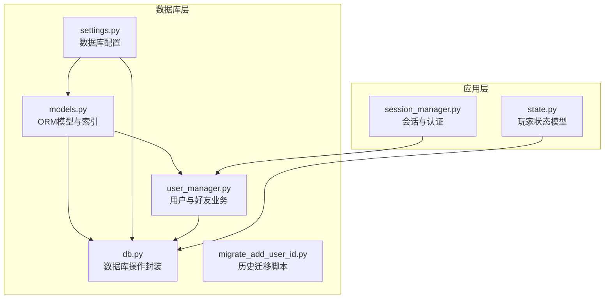
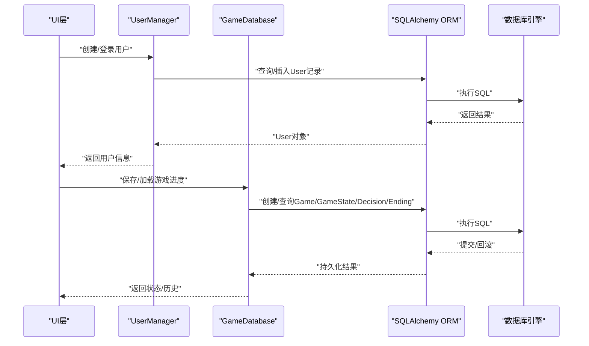
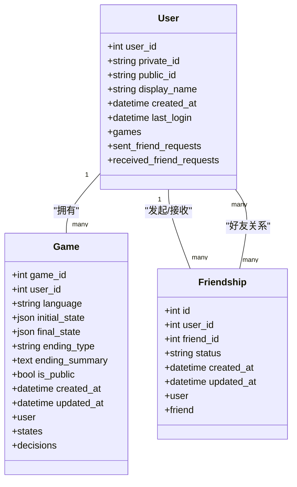
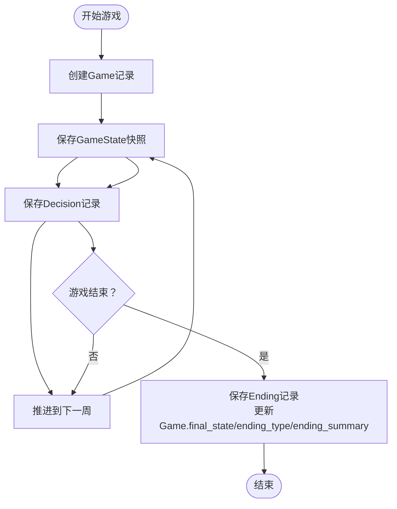
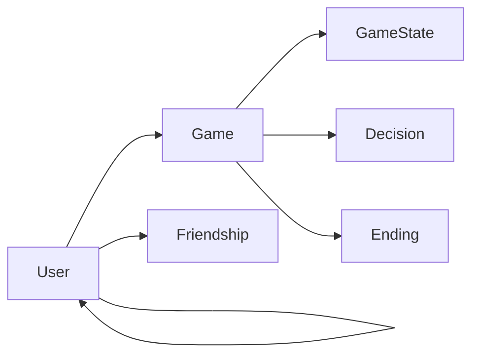

# 数据库设计

<cite>
**本文引用的文件**
- [models.py](file://src/database/models.py)
- [db.py](file://src/database/db.py)
- [user_manager.py](file://src/database/user_manager.py)
- [settings.py](file://config/settings.py)
- [migrate_add_user_id.py](file://migrate_add_user_id.py)
- [test_database.py](file://tests/test_database.py)
- [state.py](file://src/game/state.py)
- [session_manager.py](file://src/ui/session_manager.py)
</cite>

## 目录
1. [简介](#简介)
2. [项目结构](#项目结构)
3. [核心组件](#核心组件)
4. [架构总览](#架构总览)
5. [详细组件分析](#详细组件分析)
6. [依赖关系分析](#依赖关系分析)
7. [性能考虑](#性能考虑)
8. [故障排除指南](#故障排除指南)
9. [结论](#结论)
10. [附录](#附录)

## 简介
本文件面向数据库设计与实现，围绕用户表、游戏表、事件表、状态表之间的关系映射与约束规则进行系统化梳理，并结合ORM模型设计、数据结构规划、索引策略、查询优化、数据访问模式、事务处理与并发控制、认证与会话管理、数据迁移与版本升级方案，以及数据库性能优化建议与监控指标展开。目标是帮助开发者与运维人员快速理解并高效维护该数据库层。

## 项目结构
数据库相关代码集中在 src/database 目录，采用 SQLAlchemy ORM + SQLite/PostgreSQL 双栈支持：
- models.py：定义用户、好友关系、游戏、状态快照、决策、结局、角色预设等模型及索引
- db.py：封装数据库操作（增删改查、事务、级联删除、查询优化）
- user_manager.py：用户创建、登录、好友系统、游戏公开设置等业务逻辑
- settings.py：数据库连接配置（本地SQLite与云数据库URL优先级）
- migrate_add_user_id.py：历史迁移脚本（为旧表添加 user_id、is_public、updated_at 等列与索引）

图表来源
- [models.py](file://src/database/models.py#L1-L171)
- [db.py](file://src/database/db.py#L1-L517)
- [user_manager.py](file://src/database/user_manager.py#L1-L401)
- [settings.py](file://config/settings.py#L68-L82)
- [migrate_add_user_id.py](file://migrate_add_user_id.py#L1-L78)
- [state.py](file://src/game/state.py#L244-L561)
- [session_manager.py](file://src/ui/session_manager.py#L1-L65)

章节来源
- [models.py](file://src/database/models.py#L1-L171)
- [db.py](file://src/database/db.py#L1-L517)
- [user_manager.py](file://src/database/user_manager.py#L1-L401)
- [settings.py](file://config/settings.py#L68-L82)
- [migrate_add_user_id.py](file://migrate_add_user_id.py#L1-L78)

## 核心组件
- 用户模型（User）：支持私有ID登录与公有ID展示，具备唯一性约束与索引；与游戏、好友请求双向关联
- 好友关系模型（Friendship）：双向好友关系，状态枚举（pending/accepted/rejected），唯一性索引确保每对用户仅一条关系
- 游戏模型（Game）：会话记录，支持用户归属、语言、初始/最终状态JSON、结局类型与摘要、公开标记；与状态快照、决策、结局级联
- 状态快照模型（GameState）：按周/年龄快照存储JSON状态，支持回溯与恢复
- 决策模型（Decision）：记录每周事件、选择与效果
- 结局模型（Ending）：游戏结局记录，一对一绑定至Game
- 角色预设模型（CharacterPreset）：保存角色创建设置，支持用户归属

章节来源
- [models.py](file://src/database/models.py#L11-L144)

## 架构总览
数据库层通过 SQLAlchemy ORM 实现，支持本地 SQLite 与云数据库（如 PostgreSQL）。初始化时根据配置选择数据库URL，创建表结构并提供会话工厂。应用层通过 GameDatabase 与 UserManager 进行数据持久化与业务处理，配合 UI 层的会话管理完成认证与会话持久化。

图表来源
- [user_manager.py](file://src/database/user_manager.py#L68-L102)
- [db.py](file://src/database/db.py#L17-L172)
- [models.py](file://src/database/models.py#L61-L127)

## 详细组件分析

### 用户与好友系统
- 用户创建：自动生成唯一私有ID与公有ID，首次登录更新 last_login
- 登录机制：标准化输入（去空格、大写、统一分隔符），匹配私有ID并更新登录时间
- 好友系统：发送/响应好友请求，自动接受互相关注，支持查询待处理请求与好友列表，删除好友
- 权限控制：游戏公开/私密设置，仅好友可查看公开游戏

图表来源
- [models.py](file://src/database/models.py#L11-L127)

章节来源
- [user_manager.py](file://src/database/user_manager.py#L68-L401)
- [models.py](file://src/database/models.py#L11-L127)

### 游戏与状态快照
- 游戏会话：记录语言、初始状态、最终状态、结局类型与摘要、公开标记
- 状态快照：按周/年龄存储完整状态JSON，支持回退与恢复
- 决策记录：记录事件描述、选择文本与效果，按周排序
- 结局记录：保存最终状态、结局类型、摘要与成就

图表来源
- [db.py](file://src/database/db.py#L17-L144)
- [models.py](file://src/database/models.py#L61-L127)

章节来源
- [db.py](file://src/database/db.py#L17-L144)
- [models.py](file://src/database/models.py#L61-L127)

### 数据访问模式与事务处理
- 会话管理：每个操作创建独立会话，使用 try/finally 确保关闭，异常时回滚
- 级联删除：Game 删除时自动删除其 GameState 与 Decision
- 查询优化：按主键/外键/索引字段查询，必要时使用 order_by 与 limit 控制结果集
- 并发控制：基于 SQLAlchemy 会话隔离与数据库默认隔离级别；建议在高并发场景引入乐观锁或应用层重试

章节来源
- [db.py](file://src/database/db.py#L34-L46)
- [db.py](file://src/database/db.py#L145-L172)
- [db.py](file://src/database/db.py#L195-L210)
- [models.py](file://src/database/models.py#L76-L79)

### 字段定义、索引策略与查询优化
- 用户表（users）
  - 字段：user_id（PK）、private_id（唯一+索引）、public_id（唯一+索引）、display_name、created_at、last_login
  - 索引：private_id、public_id（唯一性约束即隐式索引）
- 好友关系表（friendships）
  - 字段：id（PK）、user_id、friend_id、status、created_at、updated_at
  - 索引：(user_id, friend_id) 唯一性索引，避免重复关系
- 游戏表（games）
  - 字段：game_id（PK）、user_id（FK，带索引）、language、initial_state、final_state、ending_type、ending_summary、is_public、created_at、updated_at
  - 索引：user_id（加速按用户查询）
- 状态快照表（game_states）
  - 字段：state_id（PK）、game_id（FK）、week、age、state_json、created_at
  - 索引：按需查询 week/age，建议在高频查询字段上建立复合索引
- 决策表（decisions）
  - 字段：decision_id（PK）、game_id（FK）、week、event_description、choice_text、effects、created_at
  - 索引：按周查询 week
- 结局表（endings）
  - 字段：ending_id（PK）、game_id（FK，唯一）、final_state、ending_type、summary、achievements、created_at
  - 索引：game_id（唯一约束即索引）
- 角色预设表（character_presets）
  - 字段：preset_id（PK）、user_id（FK，可空）、preset_name、player_name、life_vision、character_settings、created_at、updated_at
  - 索引：user_id（加速按用户查询）

章节来源
- [models.py](file://src/database/models.py#L15-L58)
- [models.py](file://src/database/models.py#L65-L143)
- [migrate_add_user_id.py](file://migrate_add_user_id.py#L54-L66)

### 认证机制与会话管理
- 私有ID登录：用户创建时生成一次性私有ID，登录时标准化输入并匹配
- 公有ID展示：用于添加好友与公开游戏展示
- 会话持久化：UI 层通过 URL 参数与 localStorage 存储用户ID，实现跨页面会话保持
- 安全建议：私有ID仅在创建时返回一次，需妥善保存；登录流程中应校验输入格式并记录日志

章节来源
- [user_manager.py](file://src/database/user_manager.py#L104-L126)
- [session_manager.py](file://src/ui/session_manager.py#L552-L584)

### 数据迁移策略与版本升级
- 历史迁移脚本：为旧表添加 user_id、is_public、updated_at 列，并创建索引
- 连接策略：settings 中优先 DATABASE_URL（云数据库），否则回退到本地 SQLite 文件
- 升级建议：新增列时使用 ALTER TABLE + DEFAULT 值；批量迁移时分批处理并记录进度；迁移前后备份数据

章节来源
- [migrate_add_user_id.py](file://migrate_add_user_id.py#L9-L74)
- [settings.py](file://config/settings.py#L68-L82)

## 依赖关系分析
- 模型间依赖：User 与 Game 一对多；Game 与 GameState/Decision/Ending 一对多；Friendship 与 User 双向多对一
- 操作层依赖：GameDatabase 依赖 models 定义的表结构；UserManager 依赖 models 与 SQLAlchemy 查询
- 配置依赖：settings 提供数据库URL与路径，决定运行环境（本地/云）

图表来源
- [models.py](file://src/database/models.py#L11-L127)

章节来源
- [models.py](file://src/database/models.py#L11-L127)

## 性能考虑
- 索引优化
  - 在高频过滤字段（如 user_id、game_id、week）上建立索引
  - 复合索引：(user_id, created_at)、(game_id, week) 等
- 查询优化
  - 使用 select 加载必要字段，避免 SELECT *
  - 使用 order_by + limit 控制结果集大小
  - 对复杂查询使用原生 SQL 或 SQLAlchemy 原生表达式
- 事务与并发
  - 将多个写操作放入单个事务，减少锁竞争
  - 高并发场景建议引入乐观锁（版本号/时间戳）或应用层重试
- 存储与序列化
  - JSON 字段适合灵活扩展，但不利于索引；对常用查询字段可拆分或冗余
  - 大量快照时考虑压缩或归档策略
- 连接池与引擎
  - 云数据库启用 pool_pre_ping 与连接池参数，提升稳定性
  - 本地 SQLite 适合开发/测试，生产建议迁移到 PostgreSQL/MySQL

## 故障排除指南
- 登录失败
  - 检查私有ID格式标准化逻辑（去除空格、统一大写、分隔符）
  - 核对唯一性约束与索引是否生效
- 好友请求异常
  - 确认重复请求检测与状态转换逻辑
  - 校验互相关注自动接受分支
- 游戏进度保存失败
  - 检查会话关闭与异常回滚逻辑
  - 核对状态快照字段完整性与 JSON 序列化
- 迁移失败
  - 确认数据库文件路径与权限
  - 分步执行迁移脚本，记录错误并回滚

章节来源
- [user_manager.py](file://src/database/user_manager.py#L104-L126)
- [user_manager.py](file://src/database/user_manager.py#L165-L224)
- [db.py](file://src/database/db.py#L285-L321)
- [migrate_add_user_id.py](file://migrate_add_user_id.py#L70-L74)

## 结论
该数据库设计以清晰的实体关系与合理的索引策略为基础，结合 ORM 封装实现了良好的可维护性与扩展性。通过明确的认证与会话管理、完善的迁移策略与性能优化建议，能够支撑从本地开发到云端生产的多种部署场景。建议在生产环境中进一步完善索引与查询计划分析、引入连接池与监控告警，并持续演进数据模型以适配业务增长。

## 附录
- 测试覆盖点
  - 模型唯一性约束与级联删除
  - 数据库操作的增删改查与事务回滚
  - 用户管理的登录、好友请求与权限控制
  - 迁移脚本的列添加与索引创建

章节来源
- [test_database.py](file://tests/test_database.py#L39-L78)
- [test_database.py](file://tests/test_database.py#L124-L168)
- [test_database.py](file://tests/test_database.py#L269-L303)
- [test_database.py](file://tests/test_database.py#L411-L440)
- [test_database.py](file://tests/test_database.py#L442-L643)