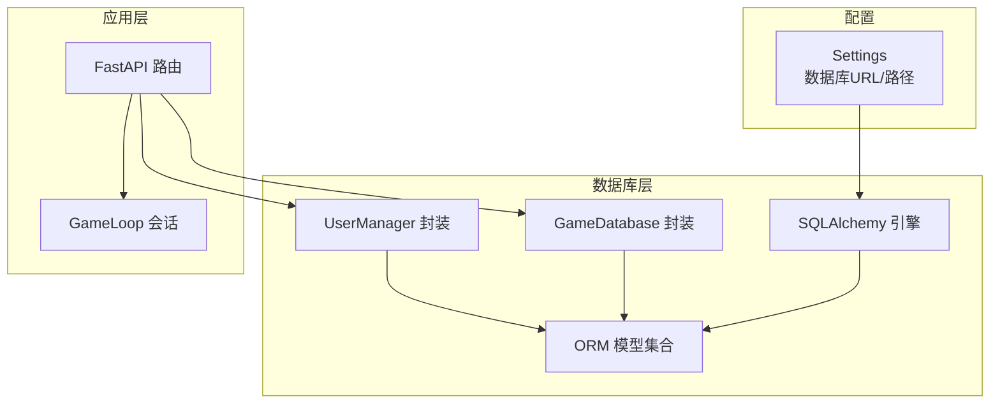
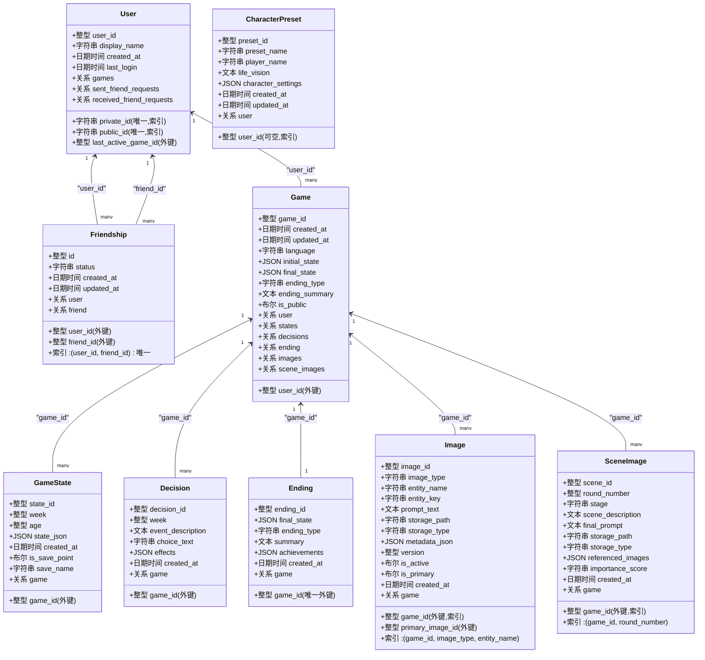
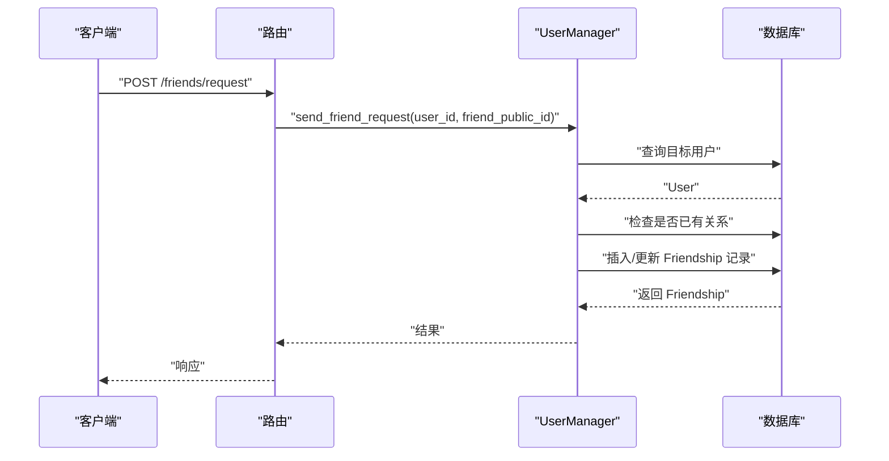
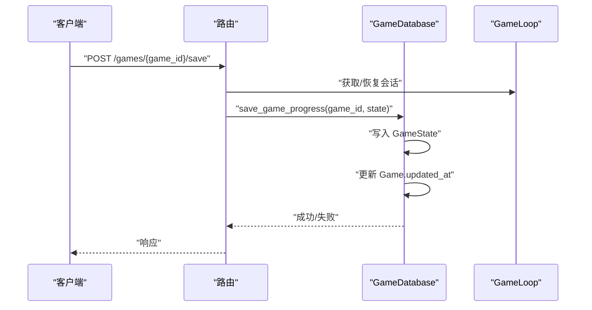
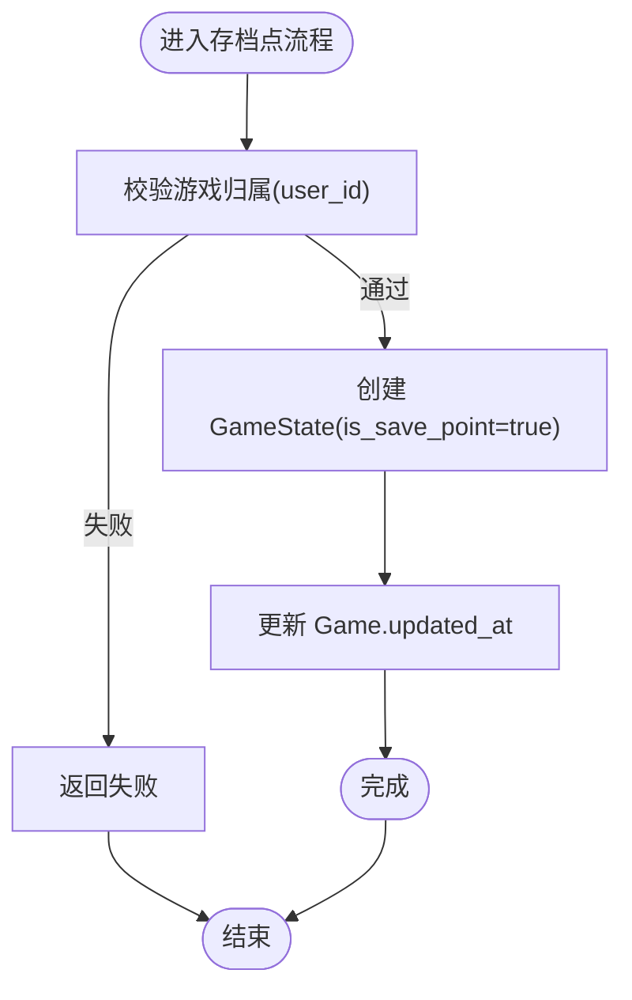
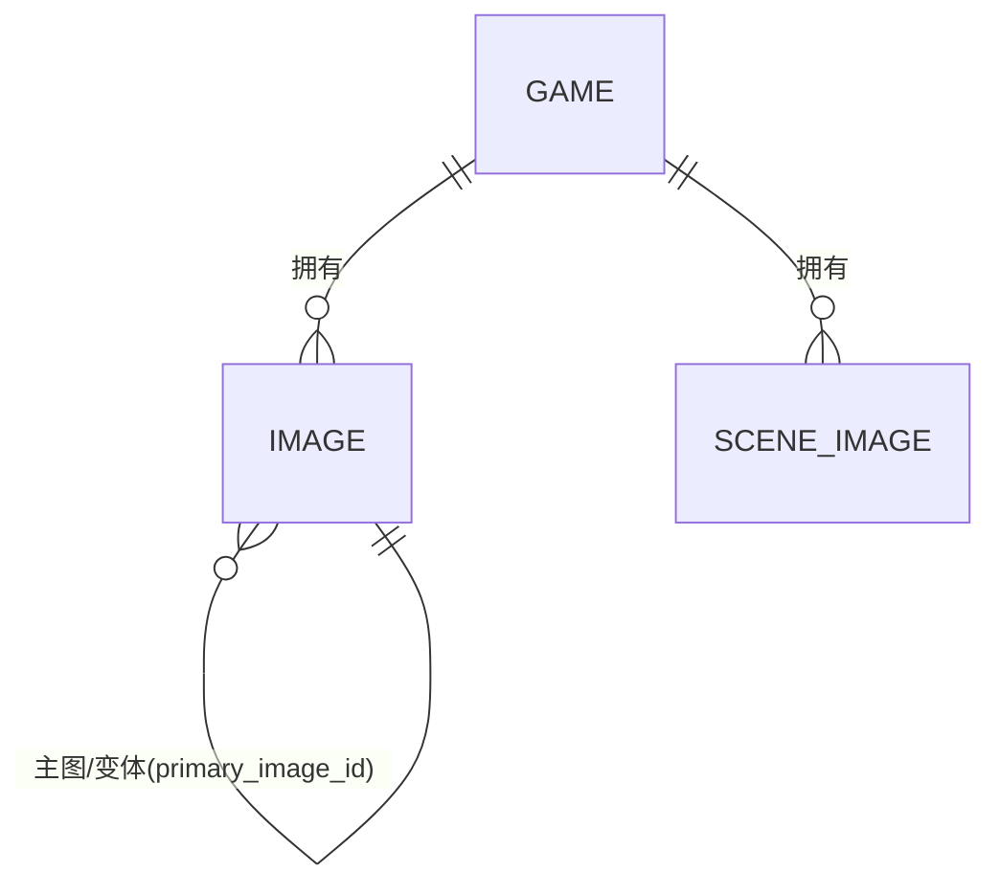
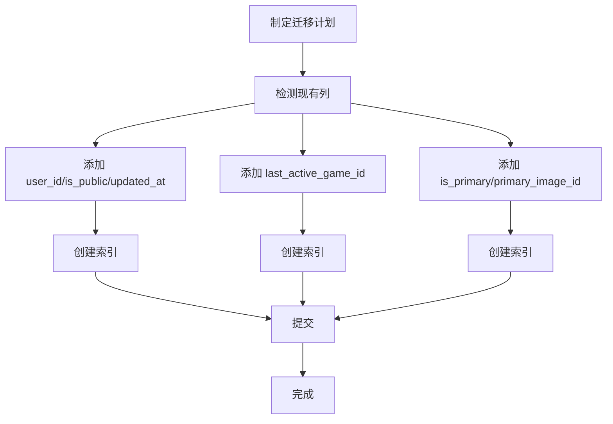
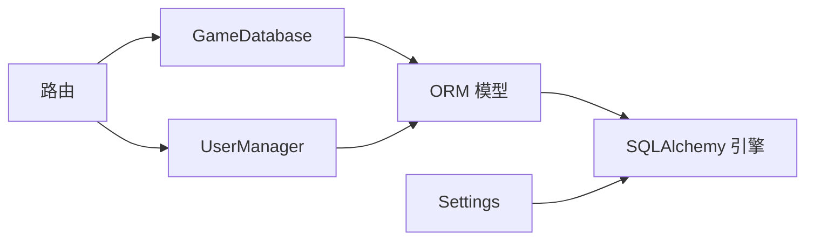

# 数据库设计

<cite>
**本文引用的文件**
- [models.py](file://src/database/models.py)
- [db.py](file://src/database/db.py)
- [user_manager.py](file://src/database/user_manager.py)
- [settings.py](file://config/settings.py)
- [games.py](file://src/api/routers/games.py)
- [migrate_add_user_id.py](file://migrate_add_user_id.py)
- [migrate_add_last_active_game.py](file://migrate_add_last_active_game.py)
- [migrate_add_image_primary_fields.py](file://migrate_add_image_primary_fields.py)
- [test_database.py](file://tests/test_database.py)
</cite>

## 目录
1. [简介](#简介)
2. [项目结构](#项目结构)
3. [核心组件](#核心组件)
4. [架构总览](#架构总览)
5. [详细组件分析](#详细组件分析)
6. [依赖分析](#依赖分析)
7. [性能考量](#性能考量)
8. [故障排查指南](#故障排查指南)
9. [结论](#结论)
10. [附录](#附录)

## 简介
本文件面向“人生草稿本”的数据库层，系统化梳理ORM模型、表结构、关系映射、外键约束与数据完整性保障；阐述数据迁移与版本控制策略；总结数据访问模式、查询优化与缓存策略；明确数据生命周期管理、保留与归档规则；说明数据安全与隐私要求及访问控制机制；并提供Schema图表与示例数据说明，辅以性能建议与最佳实践。

## 项目结构
数据库相关代码集中在以下模块：
- ORM模型与引擎：src/database/models.py
- 数据库操作封装：src/database/db.py
- 用户管理与好友系统：src/database/user_manager.py
- 配置与数据库连接：config/settings.py
- API路由与会话集成：src/api/routers/games.py
- 数据库迁移脚本：migrate_add_user_id.py、migrate_add_last_active_game.py、migrate_add_image_primary_fields.py
- 单元测试：tests/test_database.py

**图表来源**
- [settings.py](file://config/settings.py#L107-L141)
- [models.py](file://src/database/models.py#L237-L295)
- [db.py](file://src/database/db.py#L13-L19)
- [user_manager.py](file://src/database/user_manager.py#L34-L65)
- [games.py](file://src/api/routers/games.py#L26-L58)

**章节来源**
- [models.py](file://src/database/models.py#L1-L295)
- [db.py](file://src/database/db.py#L1-L19)
- [user_manager.py](file://src/database/user_manager.py#L1-L65)
- [settings.py](file://config/settings.py#L107-L141)
- [games.py](file://src/api/routers/games.py#L26-L58)

## 核心组件
- ORM模型与表结构
  - 用户表 users：唯一私有ID、唯一公有ID、显示名、登录时间、最后活跃游戏ID（外键）、创建时间
  - 好友关系表 friendships：双向外键 user_id/friend_id、状态、时间戳、唯一索引 pair
  - 游戏表 games：语言、初始状态JSON、最终状态JSON、结局类型、结局摘要、公开标记、用户ID外键、时间戳
  - 游戏状态表 game_states：周数、年龄、状态JSON、是否存档点、存档名、时间戳
  - 决策表 decisions：事件描述、选择文本、效果JSON、周数、时间戳
  - 结局表 endings：唯一外键 game_id、最终状态、结局类型、摘要、成就JSON
  - 角色预设表 character_presets：名称、玩家名、人生愿景、设置JSON、用户ID外键
  - 图片表 images：类型、实体名/键、提示词、存储路径/类型、元数据JSON、版本/激活、主图/变体关系、时间戳
  - 场景图片表 scene_images：轮次、阶段、场景描述、最终提示词、存储路径/类型、引用图片列表、重要性评分、时间戳
- 数据库引擎与会话
  - 支持本地SQLite与云数据库（PostgreSQL/MySQL等），自动创建表，提供上下文会话注入
- 数据库操作封装
  - GameDatabase：游戏创建、状态保存/加载、决策记录、结局保存、故事检索、存档点管理、活跃游戏管理
  - UserManager：用户创建/登录、显示名更新、好友请求、接受/拒绝、删除好友、公开游戏设置
- 配置与迁移
  - Settings 提供 DATABASE_URL 与 DATABASE_PATH，支持云/本地切换
  - 迁移脚本：添加 user_id/is_public/updated_at、添加 last_active_game_id、添加图片主图字段

**章节来源**
- [models.py](file://src/database/models.py#L11-L234)
- [db.py](file://src/database/db.py#L13-L295)
- [user_manager.py](file://src/database/user_manager.py#L34-L401)
- [settings.py](file://config/settings.py#L107-L141)
- [migrate_add_user_id.py](file://migrate_add_user_id.py#L9-L78)
- [migrate_add_last_active_game.py](file://migrate_add_last_active_game.py#L19-L54)
- [migrate_add_image_primary_fields.py](file://migrate_add_image_primary_fields.py#L16-L62)

## 架构总览
数据库层采用“模型-服务-路由”三层协作：
- 模型层：声明式ORM定义表结构、索引与外键
- 服务层：GameDatabase/UserManager封装业务操作，统一事务与权限校验
- 路由层：FastAPI路由对接会话存储与服务层，实现REST接口

**图表来源**
- [models.py](file://src/database/models.py#L11-L234)

**章节来源**
- [models.py](file://src/database/models.py#L11-L234)

## 详细组件分析

### 用户与好友系统
- 用户模型
  - 唯一性：private_id、public_id 唯一且带索引
  - 关系：与 Game、Friendship 的双向关联，支持级联删除孤儿
  - last_active_game_id 外键：支持服务端会话恢复
- 好友关系
  - status 状态机：pending/accepted/rejected
  - 唯一索引 pair(user_id, friend_id)：避免重复关系
  - 权限：仅接受/删除已建立的 accepted 关系

**图表来源**
- [user_manager.py](file://src/database/user_manager.py#L165-L224)
- [games.py](file://src/api/routers/games.py#L26-L58)

**章节来源**
- [models.py](file://src/database/models.py#L11-L67)
- [user_manager.py](file://src/database/user_manager.py#L165-L336)
- [games.py](file://src/api/routers/games.py#L26-L58)

### 游戏与状态管理
- 游戏表
  - user_id 外键：绑定用户，支持公开标记
  - initial_state/updated_at：初始状态与更新时间
- 状态快照
  - 自动快照：每次保存进度生成
  - 手动存档点：is_save_point + save_name
- 决策与结局
  - 决策记录：事件描述、选择、效果
  - 结局记录：唯一外键，最终状态与摘要

**图表来源**
- [db.py](file://src/database/db.py#L336-L383)
- [games.py](file://src/api/routers/games.py#L163-L183)

**章节来源**
- [models.py](file://src/database/models.py#L70-L143)
- [db.py](file://src/database/db.py#L336-L383)
- [games.py](file://src/api/routers/games.py#L163-L183)

### 时间回溯存档系统
- 存档点
  - is_save_point=true，支持命名 save_name
  - list/save/load/delete 完整生命周期
- 时间线
  - 展示所有快照（自动+手动），用于回溯

**图表来源**
- [db.py](file://src/database/db.py#L687-L741)

**章节来源**
- [db.py](file://src/database/db.py#L687-L741)
- [db.py](file://src/database/db.py#L743-L786)
- [db.py](file://src/database/db.py#L788-L824)
- [db.py](file://src/database/db.py#L826-L861)
- [db.py](file://src/database/db.py#L863-L910)

### 图片与场景管理
- 图片表
  - 类型区分：人物/地点/物品
  - 主图/变体：is_primary + primary_image_id 外键自引用
  - 索引：(game_id, image_type, entity_name)
- 场景图片
  - 轮次与阶段(stage)，引用实体图片列表

**图表来源**
- [models.py](file://src/database/models.py#L162-L201)
- [models.py](file://src/database/models.py#L203-L234)

**章节来源**
- [models.py](file://src/database/models.py#L162-L234)
- [migrate_add_image_primary_fields.py](file://migrate_add_image_primary_fields.py#L16-L62)

### 数据访问模式与查询优化
- 会话注入
  - with_db_session/get_db 提供上下文会话，避免泄漏
- 索引策略
  - users: private_id/public_id/last_active_game_id
  - games: user_id
  - images: (game_id, image_type, entity_name)
  - scene_images: (game_id, round_number)
  - friendships: (user_id, friend_id) 唯一
- 查询模式
  - 权限校验：所有涉及 user_id 的查询均进行归属校验
  - 回退策略：load_game_state 无快照时回退到 initial_state
  - 时间线：按 created_at desc 分页

**章节来源**
- [models.py](file://src/database/models.py#L16-L67)
- [models.py](file://src/database/models.py#L198-L200)
- [models.py](file://src/database/models.py#L232-L234)
- [db.py](file://src/database/db.py#L139-L163)
- [db.py](file://src/database/db.py#L186-L201)
- [db.py](file://src/database/db.py#L213-L240)

### 数据完整性与约束
- 外键约束
  - users → games(user_id)
  - games → game_states(game_id)
  - games → decisions(game_id)
  - games → endings(game_id)
  - games → images(game_id)
  - games → scene_images(game_id)
  - images → images(primary_image_id)
- 唯一性
  - users.private_id、users.public_id
  - friendships(pair) 唯一
  - endings.game_id 唯一
- 级联删除
  - Game 删除时级联删除其 states/decisions/endings/images/scene_images

**章节来源**
- [models.py](file://src/database/models.py#L27-L46)
- [models.py](file://src/database/models.py#L86-L91)
- [models.py](file://src/database/models.py#L134-L142)
- [models.py](file://src/database/models.py#L198-L200)
- [models.py](file://src/database/models.py#L232-L234)

### 数据迁移与版本控制
- 迁移策略
  - 本地SQLite：直接ALTER TABLE，创建索引
  - 云数据库：通过脚本执行DDL，注意兼容性
- 迁移清单
  - 添加 games.user_id/is_public/updated_at，并创建索引
  - 添加 users.last_active_game_id，并创建索引
  - 为 images 添加 is_primary/primary_image_id，并创建索引

**图表来源**
- [migrate_add_user_id.py](file://migrate_add_user_id.py#L9-L78)
- [migrate_add_last_active_game.py](file://migrate_add_last_active_game.py#L19-L54)
- [migrate_add_image_primary_fields.py](file://migrate_add_image_primary_fields.py#L16-L62)

**章节来源**
- [migrate_add_user_id.py](file://migrate_add_user_id.py#L9-L78)
- [migrate_add_last_active_game.py](file://migrate_add_last_active_game.py#L19-L54)
- [migrate_add_image_primary_fields.py](file://migrate_add_image_primary_fields.py#L16-L62)

### 数据生命周期管理、保留与归档
- 生命周期
  - 游戏：创建 → 进行中 → 结局（可公开） → 删除
  - 状态：自动快照持续累积，手动存档点可回溯
  - 图片：按实体维度管理，支持版本与主图
- 保留策略
  - 建议：用户删除游戏时，级联清理；未结束游戏可按用户策略清理
- 归档规则
  - 结局完成后可标记为公开；未结束游戏可归档至冷存储（需扩展）

**章节来源**
- [models.py](file://src/database/models.py#L70-L91)
- [db.py](file://src/database/db.py#L428-L452)

### 数据安全、隐私与访问控制
- 认证与授权
  - 所有读写操作均校验 user_id 归属
  - 好友系统仅对已接受关系可见公开游戏
- 会话恢复
  - last_active_game_id 支持跨设备恢复，但不泄露他人数据
- 隐私保护
  - 用户ID与显示名分离；图片存储路径与元数据可控

**章节来源**
- [user_manager.py](file://src/database/user_manager.py#L379-L401)
- [games.py](file://src/api/routers/games.py#L83-L126)

## 依赖分析
- 组件耦合
  - GameDatabase 依赖 models 与 GameLoop 会话
  - UserManager 依赖 models 与 SQLAlchemy 会话
  - 路由层依赖服务层与会话存储
- 外部依赖
  - SQLAlchemy ORM/引擎
  - FastAPI 路由与依赖注入
  - Settings 提供数据库URL

**图表来源**
- [db.py](file://src/database/db.py#L13-L19)
- [user_manager.py](file://src/database/user_manager.py#L34-L65)
- [settings.py](file://config/settings.py#L133-L141)

**章节来源**
- [db.py](file://src/database/db.py#L13-L19)
- [user_manager.py](file://src/database/user_manager.py#L34-L65)
- [settings.py](file://config/settings.py#L133-L141)

## 性能考量
- 索引优化
  - 为高频过滤字段建立索引（user_id、game_id、public_id、private_id、last_active_game_id）
  - 复合索引：(game_id, image_type, entity_name)、(game_id, round_number)
- 查询优化
  - 使用 order_by + limit 控制结果集大小
  - 回退策略减少JOIN复杂度（无快照回退 initial_state）
- 连接池与会话
  - 使用 SessionLocal 与上下文注入，避免长事务
- 缓存策略
  - 会话存储（session_store）短期缓存游戏状态，数据库持久化
  - 建议：对热点查询（好友列表、公开游戏）增加应用层缓存

[本节为通用指导，无需具体文件分析]

## 故障排查指南
- 常见问题
  - 登录失败：检查 private_id 格式标准化与唯一性
  - 好友请求异常：确认 status 状态与 pair 唯一性
  - 游戏加载失败：确认 user_id 归属与存档点有效性
  - 迁移失败：检查列是否存在与索引创建
- 日志与调试
  - GameDatabase 与 UserManager 中包含详细日志
  - 单测覆盖模型、权限、迁移等关键路径

**章节来源**
- [user_manager.py](file://src/database/user_manager.py#L104-L126)
- [db.py](file://src/database/db.py#L378-L382)
- [test_database.py](file://tests/test_database.py#L451-L798)

## 结论
本数据库设计以清晰的实体关系与外键约束为基础，结合服务端会话恢复、时间回溯存档与好友公开策略，满足“人生草稿本”的核心业务需求。通过索引与查询优化、迁移脚本与单元测试，确保了可维护性与稳定性。建议在生产环境进一步完善缓存与归档策略，并持续监控查询性能与数据一致性。

## 附录

### Schema 图（文字版）
- users
  - 字段：user_id(PK,自增)、private_id(唯一,索引)、public_id(唯一,索引)、display_name、created_at、last_login、last_active_game_id(FK)
  - 关系：1..* games、1..* sent_friend_requests、1..* received_friend_requests
- friendships
  - 字段：id(PK,自增)、user_id(FK)、friend_id(FK)、status、created_at、updated_at
  - 索引：(user_id, friend_id) 唯一
  - 关系：user(FK)、friend(FK)
- games
  - 字段：game_id(PK,自增)、user_id(FK)、created_at、updated_at、language、initial_state、final_state、ending_type、ending_summary、is_public
  - 关系：user(FK)、1..* states、1..* decisions、1..1 ending、1..* images、1..* scene_images
- game_states
  - 字段：state_id(PK,自增)、game_id(FK)、week、age、state_json、created_at、is_save_point、save_name
  - 关系：game(FK)
- decisions
  - 字段：decision_id(PK,自增)、game_id(FK)、week、event_description、choice_text、effects、created_at
  - 关系：game(FK)
- endings
  - 字段：ending_id(PK,自增)、game_id(FK,唯一)、final_state、ending_type、summary、achievements、created_at
  - 关系：game(FK)
- character_presets
  - 字段：preset_id(PK,自增)、user_id(FK)、preset_name、player_name、life_vision、character_settings、created_at、updated_at
  - 关系：user(FK)
- images
  - 字段：image_id(PK,自增)、game_id(FK)、image_type、entity_name、entity_key、prompt_text、storage_path、storage_type、metadata_json、version、is_active、is_primary、primary_image_id(FK)、created_at
  - 索引：(game_id, image_type, entity_name)
  - 关系：game(FK)
- scene_images
  - 字段：scene_id(PK,自增)、game_id(FK)、round_number、stage、scene_description、final_prompt、storage_path、storage_type、referenced_images、importance_score、created_at
  - 索引：(game_id, round_number)
  - 关系：game(FK)

**章节来源**
- [models.py](file://src/database/models.py#L11-L234)

### 示例数据（说明性）
- 用户
  - private_id: "ABCD-1234-EFGH-5678-IJKL-9012-MNOP-3456"
  - public_id: "AB12CD34"
  - display_name: "玩家A"
- 游戏
  - language: "zh"
  - initial_state: {"age": 22, "week": 0, "player_name": "李逍遥"}
  - is_public: false
- 状态快照
  - week: 5, age: 23, state_json: {"energy": 80, "mood": 70}, is_save_point: true, save_name: "新手村通关"
- 决策
  - event_description: "遇到神秘老人"
  - choice_text: "请教武艺"
  - effects: {"energy": -10, "knowledge": +5}
- 结局
  - ending_type: "balanced"
  - summary: "平凡而充实的一生"
- 图片
  - image_type: "character"
  - entity_name: "李逍遥"
  - storage_path: "/data/images/.../xxx.png"
  - is_primary: true
- 场景图片
  - round_number: 1
  - stage: "event"
  - scene_description: "村庄入口"
  - referenced_images: [1, 2]

**章节来源**
- [models.py](file://src/database/models.py#L11-L234)
- [db.py](file://src/database/db.py#L336-L383)