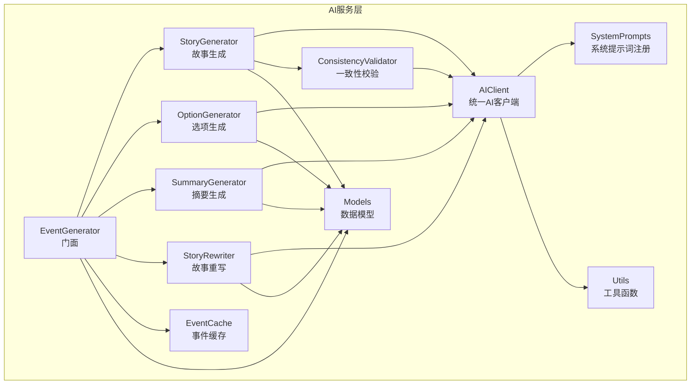
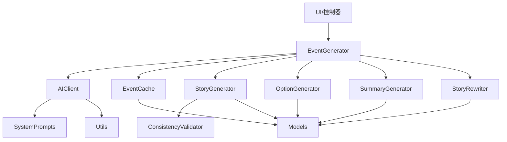
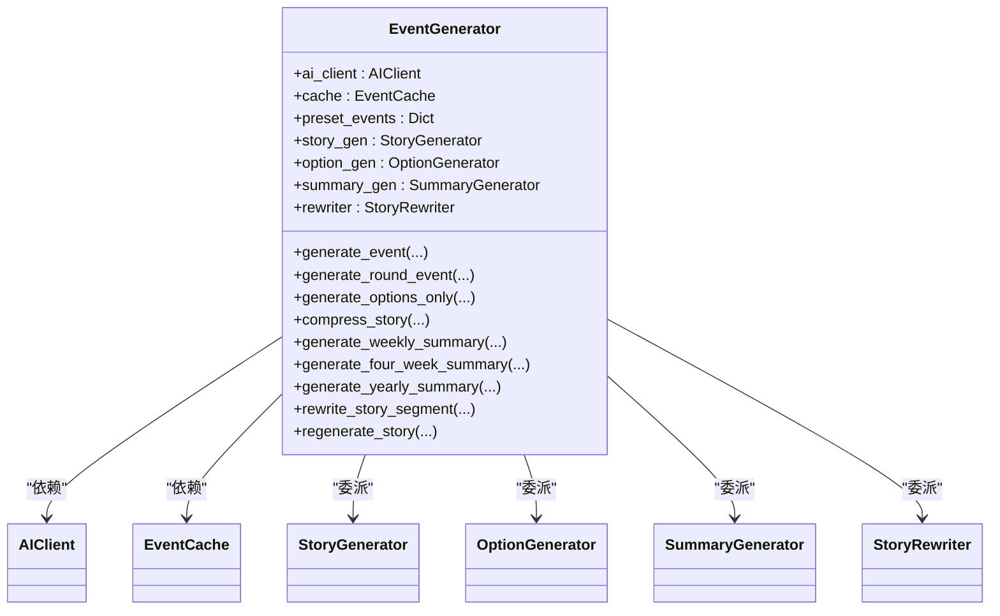
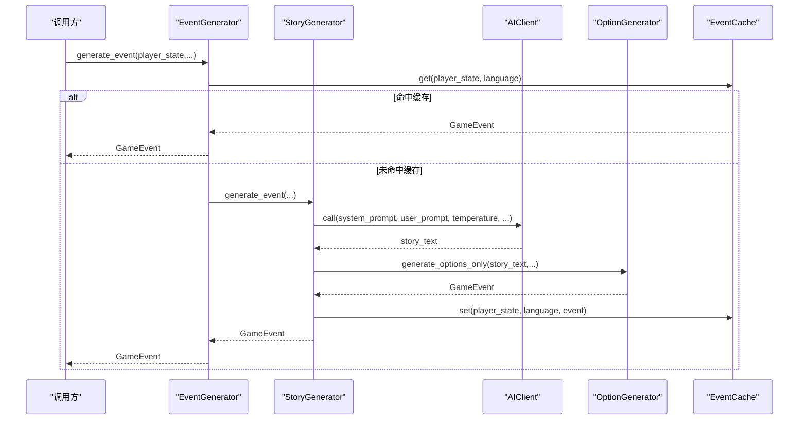
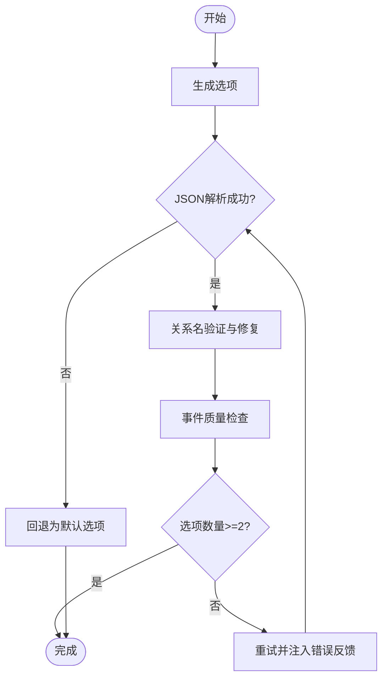
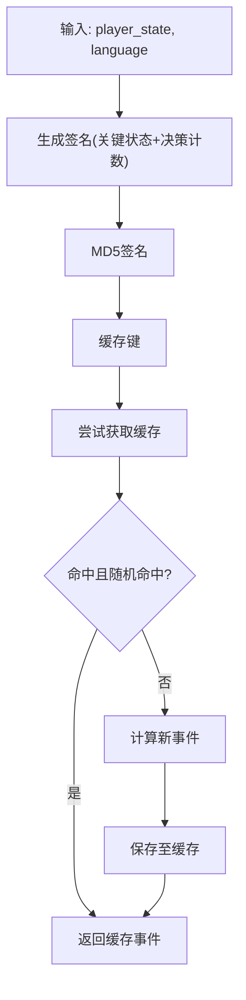
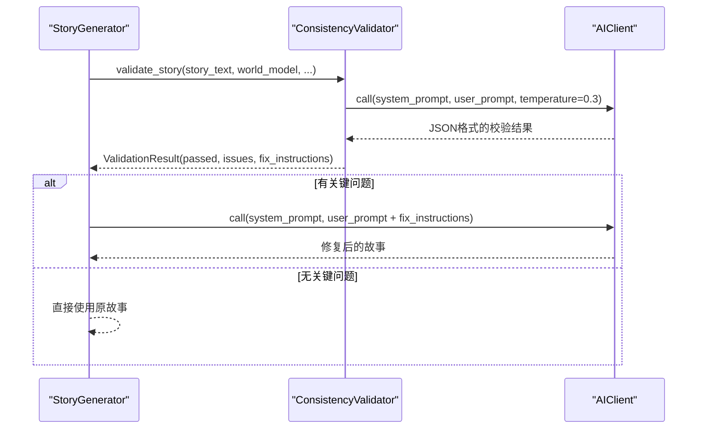
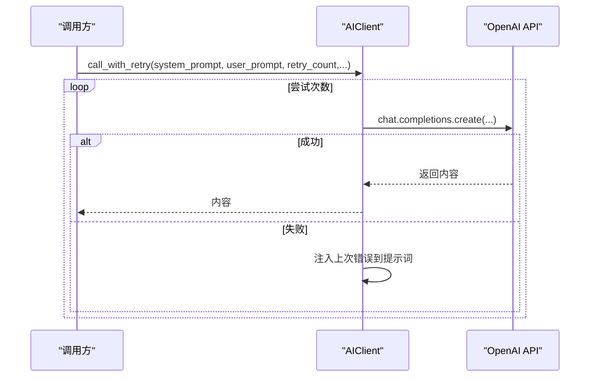
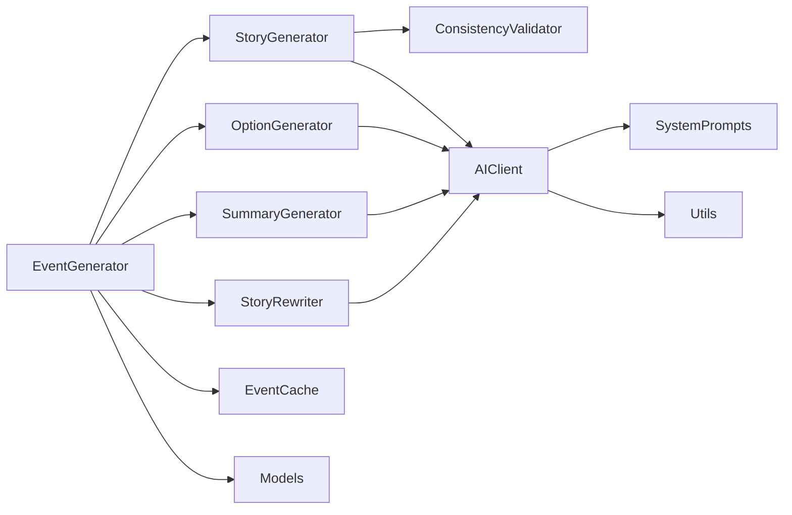

# AI服务层设计

<cite>
**本文档引用的文件**
- [src/ai/__init__.py](file://src/ai/__init__.py)
- [src/ai/client.py](file://src/ai/client.py)
- [src/ai/generator.py](file://src/ai/generator.py)
- [src/ai/story_generator.py](file://src/ai/story_generator.py)
- [src/ai/option_generator.py](file://src/ai/option_generator.py)
- [src/ai/summary_generator.py](file://src/ai/summary_generator.py)
- [src/ai/story_rewriter.py](file://src/ai/story_rewriter.py)
- [src/ai/cache.py](file://src/ai/cache.py)
- [src/ai/models.py](file://src/ai/models.py)
- [src/ai/system_prompts.py](file://src/ai/system_prompts.py)
- [src/ai/consistency_validator.py](file://src/ai/consistency_validator.py)
- [src/ai/utils.py](file://src/ai/utils.py)
- [config/settings.py](file://config/settings.py)
- [config/prompts.py](file://config/prompts.py)
</cite>

## 目录
1. [简介](#简介)
2. [项目结构](#项目结构)
3. [核心组件](#核心组件)
4. [架构总览](#架构总览)
5. [详细组件分析](#详细组件分析)
6. [依赖关系分析](#依赖关系分析)
7. [性能考虑](#性能考虑)
8. [故障排除指南](#故障排除指南)
9. [结论](#结论)

## 简介
本设计文档面向AI服务层，重点阐述OpenAI集成层的架构实现，包括门面模式(EventGenerator统一接口)、服务抽象、API调用封装、故事生成器、选项生成器、缓存系统以及一致性保障机制。文档旨在帮助开发者快速理解各模块职责边界、接口定义与集成模式，并提供可视化图示与排障建议。

## 项目结构
AI服务层位于src/ai目录，采用“门面 + 多子服务”的分层设计：
- 门面层：EventGenerator，对外暴露统一接口，内部委派给各子服务
- 核心服务：StoryGenerator(故事生成)、OptionGenerator(选项生成)、SummaryGenerator(摘要生成)、StoryRewriter(故事重写)
- 基础设施：AIClient(API调用封装)、EventCache(事件缓存)、SystemPrompts(系统提示词注册表)、ConsistencyValidator(一致性校验)、Utils(JSON提取工具)
- 数据模型：GameEvent、EventOption

图表来源
- [src/ai/generator.py](file://src/ai/generator.py#L30-L66)
- [src/ai/client.py](file://src/ai/client.py#L22-L48)
- [src/ai/cache.py](file://src/ai/cache.py#L13-L27)
- [src/ai/system_prompts.py](file://src/ai/system_prompts.py#L196-L226)
- [src/ai/models.py](file://src/ai/models.py#L7-L27)

章节来源
- [src/ai/__init__.py](file://src/ai/__init__.py#L1-L18)

## 核心组件
- AIClient：统一的AI调用抽象，封装OpenAI SDK调用、流式回调、JSON解析、重试与错误反馈注入
- EventGenerator：门面模式实现，聚合多个子服务，提供向后兼容的公共接口
- StoryGenerator：两阶段流水线第一步，生成纯故事文本，随后委派选项生成与质量校验
- OptionGenerator：两阶段流水线第二步，从已有故事生成选项，进行关系名校正与质量检查
- SummaryGenerator：故事压缩、周/四周期/年总结生成，具备容错与清理策略
- StoryRewriter：段落级重写与整段再生，保持上下文一致性
- EventCache：事件缓存，基于签名的MD5键，定期随机命中率以平衡稳定与多样性
- SystemPrompts：集中式系统提示词注册，KV缓存前缀稳定性与跨调用一致性
- ConsistencyValidator：基于世界模型的多维度一致性校验，支持关键问题触发重试
- Utils：通用JSON提取工具，提升鲁棒性

章节来源
- [src/ai/client.py](file://src/ai/client.py#L22-L214)
- [src/ai/generator.py](file://src/ai/generator.py#L30-L66)
- [src/ai/story_generator.py](file://src/ai/story_generator.py#L24-L52)
- [src/ai/option_generator.py](file://src/ai/option_generator.py#L17-L32)
- [src/ai/summary_generator.py](file://src/ai/summary_generator.py#L17-L22)
- [src/ai/story_rewriter.py](file://src/ai/story_rewriter.py#L16-L21)
- [src/ai/cache.py](file://src/ai/cache.py#L13-L27)
- [src/ai/system_prompts.py](file://src/ai/system_prompts.py#L196-L226)
- [src/ai/consistency_validator.py](file://src/ai/consistency_validator.py#L42-L59)
- [src/ai/utils.py](file://src/ai/utils.py#L10-L77)

## 架构总览
AI服务层采用“门面 + 服务子域”的架构，门面负责参数整合、缓存与流程编排；子服务专注单一职责；基础设施层提供统一调用、提示词与缓存能力。

图表来源
- [src/ai/generator.py](file://src/ai/generator.py#L183-L238)
- [src/ai/client.py](file://src/ai/client.py#L51-L104)
- [src/ai/cache.py](file://src/ai/cache.py#L78-L101)
- [src/ai/story_generator.py](file://src/ai/story_generator.py#L105-L157)
- [src/ai/option_generator.py](file://src/ai/option_generator.py#L25-L132)
- [src/ai/summary_generator.py](file://src/ai/summary_generator.py#L25-L140)
- [src/ai/story_rewriter.py](file://src/ai/story_rewriter.py#L24-L117)

## 详细组件分析

### 门面模式：EventGenerator
- 职责边界
  - 对外提供向后兼容的公共接口，屏蔽内部子服务细节
  - 负责参数预处理、缓存命中、预设事件优先级、两阶段生成编排
- 接口定义
  - 文本生成：generate_completion、generate_completion_json
  - 事件生成：generate_event、generate_round_event
  - 选项生成：generate_options_only
  - 摘要生成：compress_story、generate_weekly_summary、generate_four_week_summary、generate_yearly_summary
  - 故事重写：rewrite_story_segment、regenerate_story
- 集成模式
  - 通过AIClient统一封装OpenAI调用
  - 通过EventCache进行事件缓存
  - 通过子服务实现功能解耦

图表来源
- [src/ai/generator.py](file://src/ai/generator.py#L30-L66)

章节来源
- [src/ai/generator.py](file://src/ai/generator.py#L30-L431)

### 故事生成器：两阶段流水线
- 第一阶段：StoryGenerator.generate_event
  - 依据玩家状态与上下文生成纯故事文本
  - 支持错误反馈注入与重试
  - 可选世界模型一致性校验与自动重试
- 第二阶段：OptionGenerator.generate_options_only
  - 基于第一阶段故事生成选项
  - 关系名验证与修复、事件质量检查
- 质量控制
  - 关系名匹配策略（精确/大小写不敏感/角色语义/上下文最近邻）
  - 选项效果合理性检查与trade-off评估

图表来源
- [src/ai/generator.py](file://src/ai/generator.py#L203-L238)
- [src/ai/story_generator.py](file://src/ai/story_generator.py#L32-L157)
- [src/ai/option_generator.py](file://src/ai/option_generator.py#L25-L132)
- [src/ai/cache.py](file://src/ai/cache.py#L78-L128)

章节来源
- [src/ai/story_generator.py](file://src/ai/story_generator.py#L24-L387)
- [src/ai/option_generator.py](file://src/ai/option_generator.py#L17-L280)

### 选项生成器：候选生成、验证与排序
- 候选生成
  - 从现有故事抽取选项，返回标准化的GameEvent
- 验证与过滤
  - 关系名校正：精确匹配、大小写不敏感、角色语义、上下文最近邻
  - 事件质量检查：选项数量、效果合理性、trade-off差异
- 排序算法
  - 基于效果总量差异评估选项均衡性，避免明显优劣选项过多

图表来源
- [src/ai/option_generator.py](file://src/ai/option_generator.py#L25-L132)

章节来源
- [src/ai/option_generator.py](file://src/ai/option_generator.py#L17-L280)

### 缓存系统：事件缓存、性能优化与一致性
- 键生成策略
  - 基于年龄、能量、情绪、知识、财富、周数、决策历史长度等关键状态
  - 数值按区间取整降低微小波动导致的缓存失效
- 命中策略
  - 仅30%概率命中，保证故事多样性
- 保存与加载
  - 文件持久化(events_cache.json)，异常时安全降级
- 一致性保证
  - 强制一致性：相同输入必返回相同事件
  - 多样性策略：随机命中率平衡稳定与新鲜感

图表来源
- [src/ai/cache.py](file://src/ai/cache.py#L47-L101)
- [src/ai/cache.py](file://src/ai/cache.py#L103-L128)

章节来源
- [src/ai/cache.py](file://src/ai/cache.py#L13-L139)

### 一致性校验：多维度约束与自动修复
- 校验维度
  - 地理位置、职业、个性、时间、承诺、因果关系
- 升级策略
  - 涉及已建立行为画像的角色时，个性问题升级为关键问题
- 自动修复
  - 关键问题触发重试，将修复要求注入提示词

图表来源
- [src/ai/story_generator.py](file://src/ai/story_generator.py#L310-L370)
- [src/ai/consistency_validator.py](file://src/ai/consistency_validator.py#L60-L118)
- [src/ai/consistency_validator.py](file://src/ai/consistency_validator.py#L119-L231)

章节来源
- [src/ai/consistency_validator.py](file://src/ai/consistency_validator.py#L42-L231)

### API调用封装：AIClient
- 统一入口
  - call：普通文本生成，支持流式回调
  - call_json：解析JSON响应
  - call_with_retry：带错误反馈注入的重试机制
- 错误处理
  - 多次尝试，将上次错误注入提示词，帮助模型避免重复错误
  - 流式回调仅在首次尝试使用

图表来源
- [src/ai/client.py](file://src/ai/client.py#L140-L214)

章节来源
- [src/ai/client.py](file://src/ai/client.py#L22-L214)

### 数据模型与提示词
- 数据模型
  - GameEvent：包含故事描述与选项列表
  - EventOption：包含文本、效果与倾向标记
- 提示词注册
  - SystemPrompts集中管理各类系统提示词，KV缓存前缀稳定，便于跨调用复用

章节来源
- [src/ai/models.py](file://src/ai/models.py#L7-L27)
- [src/ai/system_prompts.py](file://src/ai/system_prompts.py#L196-L226)

## 依赖关系分析
- 松耦合
  - EventGenerator通过依赖注入使用各子服务，便于替换与测试
  - AIClient向上屏蔽底层SDK差异
- 依赖方向
  - 子服务依赖AIClient与SystemPrompts
  - StoryGenerator依赖ConsistencyValidator进行一致性校验
  - EventGenerator依赖EventCache与Models
- 循环依赖
  - 未发现循环依赖，模块间单向依赖清晰

图表来源
- [src/ai/generator.py](file://src/ai/generator.py#L62-L66)
- [src/ai/story_generator.py](file://src/ai/story_generator.py#L27-L28)
- [src/ai/option_generator.py](file://src/ai/option_generator.py#L20-L21)
- [src/ai/summary_generator.py](file://src/ai/summary_generator.py#L20-L21)
- [src/ai/story_rewriter.py](file://src/ai/story_rewriter.py#L19-L20)
- [src/ai/client.py](file://src/ai/client.py#L47-L47)

章节来源
- [src/ai/generator.py](file://src/ai/generator.py#L30-L66)
- [src/ai/story_generator.py](file://src/ai/story_generator.py#L24-L52)
- [src/ai/option_generator.py](file://src/ai/option_generator.py#L17-L32)
- [src/ai/summary_generator.py](file://src/ai/summary_generator.py#L17-L22)
- [src/ai/story_rewriter.py](file://src/ai/story_rewriter.py#L16-L21)
- [src/ai/client.py](file://src/ai/client.py#L22-L48)

## 性能考虑
- API成本控制
  - 使用EventCache减少重复调用，键生成降低缓存抖动
  - 合理设置max_tokens与temperature，平衡质量与成本
- 生成稳定性
  - call_with_retry在失败时注入错误反馈，提高成功率
  - ConsistencyValidator关键问题触发重试，避免低质量输出
- I/O与序列化
  - 缓存文件采用UTF-8与缩进格式，便于调试与版本控制
  - JSON提取工具处理多种AI输出格式，减少解析失败

## 故障排除指南
- 常见问题
  - JSON解析失败：使用Utils.extract_json进行多策略提取
  - 选项格式不合规：OptionGenerator回退为默认选项
  - 一致性校验失败：ConsistencyValidator自动注入修复要求并重试
  - 缓存读写异常：EventCache捕获异常并安全降级
- 排查步骤
  - 检查AIClient初始化参数与环境变量
  - 查看日志中“Attempt X failed”与“Last error”定位问题
  - 验证SystemPrompts键是否存在，语言参数是否正确
  - 确认缓存文件权限与磁盘空间

章节来源
- [src/ai/utils.py](file://src/ai/utils.py#L10-L77)
- [src/ai/option_generator.py](file://src/ai/option_generator.py#L114-L132)
- [src/ai/consistency_validator.py](file://src/ai/consistency_validator.py#L114-L118)
- [src/ai/cache.py](file://src/ai/cache.py#L34-L46)

## 结论
该AI服务层通过门面模式实现了高层接口与底层实现的解耦，结合统一的API封装、系统提示词注册、事件缓存与一致性校验，形成了稳定、可扩展且易于维护的生成式AI集成架构。两阶段流水线确保了故事质量与选项合理性，而缓存与重试机制有效平衡了性能与多样性。建议在后续迭代中持续优化提示词模板与校验规则，进一步提升生成稳定性与用户体验。