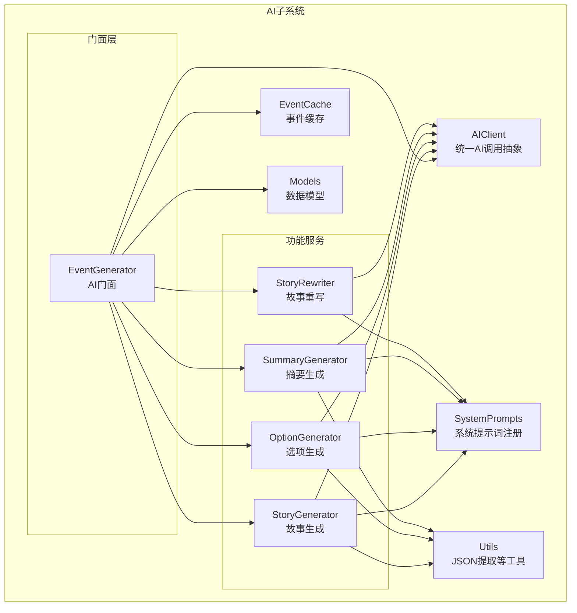
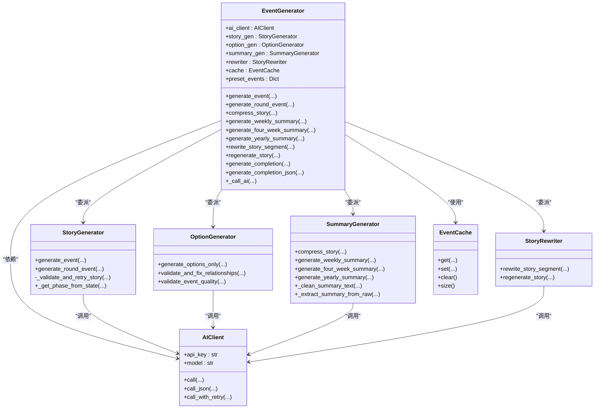
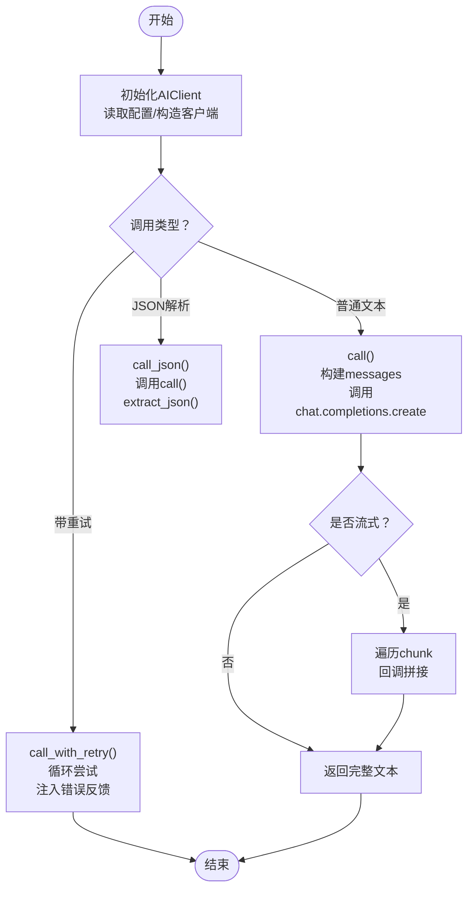
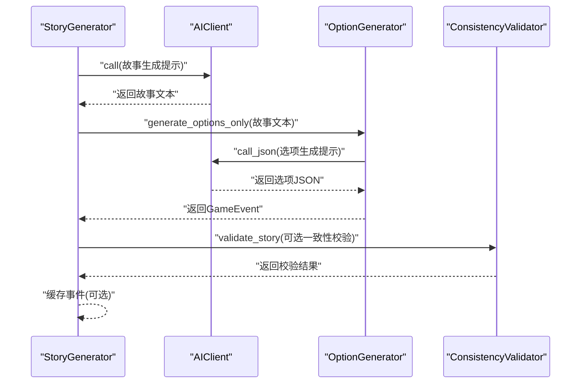
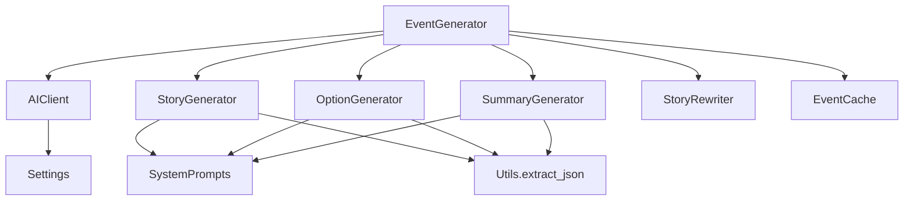

# AI门面设计

<cite>
**本文档引用的文件**
- [src/ai/generator.py](file://src/ai/generator.py)
- [src/ai/client.py](file://src/ai/client.py)
- [src/ai/story_generator.py](file://src/ai/story_generator.py)
- [src/ai/option_generator.py](file://src/ai/option_generator.py)
- [src/ai/summary_generator.py](file://src/ai/summary_generator.py)
- [src/ai/story_rewriter.py](file://src/ai/story_rewriter.py)
- [src/ai/cache.py](file://src/ai/cache.py)
- [src/ai/models.py](file://src/ai/models.py)
- [src/ai/utils.py](file://src/ai/utils.py)
- [src/ai/system_prompts.py](file://src/ai/system_prompts.py)
- [src/ai/__init__.py](file://src/ai/__init__.py)
- [config/settings.py](file://config/settings.py)
- [src/game/story_service.py](file://src/game/story_service.py)
- [tests/test_ai_modules.py](file://tests/test_ai_modules.py)
- [tests/test_ai_extended.py](file://tests/test_ai_extended.py)
</cite>

## 目录
1. [简介](#简介)
2. [项目结构](#项目结构)
3. [核心组件](#核心组件)
4. [架构总览](#架构总览)
5. [详细组件分析](#详细组件分析)
6. [依赖关系分析](#依赖关系分析)
7. [性能考虑](#性能考虑)
8. [故障排除指南](#故障排除指南)
9. [结论](#结论)
10. [附录](#附录)

## 简介
本文件系统化阐述AI门面设计，重点围绕EventGenerator类的门面模式实现，展示如何通过单一接口封装复杂的AI服务调用。文档涵盖AIClient抽象层设计、向后兼容性保证、服务委托机制、错误处理与重试策略、以及从原始God Class到现代化架构的演进过程。同时提供最佳实践与扩展指导，帮助开发者在保持现有API稳定的同时，持续优化AI服务的可维护性与可扩展性。

## 项目结构
AI子系统采用分层模块化设计，核心文件组织如下：
- 抽象层：AIClient统一AI调用入口，屏蔽底层SDK差异
- 门面层：EventGenerator对外提供统一接口，内部委派给各子服务
- 功能服务：StoryGenerator、OptionGenerator、SummaryGenerator、StoryRewriter
- 支撑能力：EventCache缓存、JSON提取工具、系统提示词注册表、数据模型



**图表来源**
- [src/ai/generator.py](file://src/ai/generator.py#L30-L66)
- [src/ai/client.py](file://src/ai/client.py#L22-L48)
- [src/ai/story_generator.py](file://src/ai/story_generator.py#L24-L28)
- [src/ai/option_generator.py](file://src/ai/option_generator.py#L17-L21)
- [src/ai/summary_generator.py](file://src/ai/summary_generator.py#L17-L21)
- [src/ai/story_rewriter.py](file://src/ai/story_rewriter.py#L16-L20)
- [src/ai/cache.py](file://src/ai/cache.py#L13-L26)
- [src/ai/system_prompts.py](file://src/ai/system_prompts.py#L196-L226)
- [src/ai/utils.py](file://src/ai/utils.py#L10-L77)
- [src/ai/models.py](file://src/ai/models.py#L7-L27)

**章节来源**
- [src/ai/__init__.py](file://src/ai/__init__.py#L1-L18)

## 核心组件
- EventGenerator门面：对外暴露统一接口，内部委派至StoryGenerator、OptionGenerator、SummaryGenerator、StoryRewriter；支持预设事件、缓存、向后兼容方法
- AIClient抽象层：集中管理OpenAI客户端初始化、统一调用协议、流式回调、JSON解析、重试与错误反馈注入
- 子服务职责分离：故事生成、选项生成与校验、摘要压缩与汇总、故事重写与再生
- 缓存与工具：EventCache降低API调用成本，extract_json提升鲁棒性，系统提示词注册表保障一致性

**章节来源**
- [src/ai/generator.py](file://src/ai/generator.py#L30-L66)
- [src/ai/client.py](file://src/ai/client.py#L22-L48)
- [src/ai/story_generator.py](file://src/ai/story_generator.py#L24-L28)
- [src/ai/option_generator.py](file://src/ai/option_generator.py#L17-L21)
- [src/ai/summary_generator.py](file://src/ai/summary_generator.py#L17-L21)
- [src/ai/story_rewriter.py](file://src/ai/story_rewriter.py#L16-L20)
- [src/ai/cache.py](file://src/ai/cache.py#L13-L26)
- [src/ai/utils.py](file://src/ai/utils.py#L10-L77)
- [src/ai/system_prompts.py](file://src/ai/system_prompts.py#L196-L226)
- [src/ai/models.py](file://src/ai/models.py#L7-L27)

## 架构总览
EventGenerator作为门面，向上提供简洁API，向下委派至各子服务并通过AIClient统一访问LLM。系统通过配置中心settings控制API密钥、模型、缓存开关等全局参数，通过系统提示词注册表确保提示词一致性与KV缓存命中率。



**图表来源**
- [src/ai/generator.py](file://src/ai/generator.py#L30-L66)
- [src/ai/client.py](file://src/ai/client.py#L22-L48)
- [src/ai/story_generator.py](file://src/ai/story_generator.py#L24-L28)
- [src/ai/option_generator.py](file://src/ai/option_generator.py#L17-L21)
- [src/ai/summary_generator.py](file://src/ai/summary_generator.py#L17-L21)
- [src/ai/story_rewriter.py](file://src/ai/story_rewriter.py#L16-L20)
- [src/ai/cache.py](file://src/ai/cache.py#L13-L26)

## 详细组件分析

### EventGenerator门面设计
- 单一职责：对外提供统一接口，隐藏内部复杂性与多阶段流程
- 向后兼容：保留原有方法签名，确保现有调用方无需修改
- 委托机制：将不同功能委派给对应子服务，保持高内聚低耦合
- 预设事件与缓存：优先匹配预设里程碑事件，其次查询缓存，最后生成新事件
- 参数透传：将调用参数按需传递给子服务，必要时进行预处理或后处理

```mermaid
sequenceDiagram
participant Caller as "调用方"
participant Facade as "EventGenerator"
participant Cache as "EventCache"
participant Story as "StoryGenerator"
participant Opt as "OptionGenerator"
participant AI as "AIClient"
Caller->>Facade : "generate_event(...)"
Facade->>Facade : "检查预设事件"
alt "存在预设"
Facade-->>Caller : "返回预设事件"
else "不存在预设"
Facade->>Cache : "get(player_state, language)"
alt "命中缓存"
Cache-->>Facade : "返回缓存事件"
Facade-->>Caller : "返回缓存事件"
else "未命中缓存"
Facade->>Story : "generate_event(...)"
Story->>AI : "call(system_prompt, user_prompt)"
AI-->>Story : "返回故事文本"
Story->>Opt : "generate_options_only(story)"
Opt->>AI : "call_json(...)"
AI-->>Opt : "返回选项JSON"
Opt-->>Story : "返回GameEvent"
Story->>Cache : "set(player_state, language, event)"
Story-->>Facade : "返回GameEvent"
Facade-->>Caller : "返回GameEvent"
end
end
```

**图表来源**
- [src/ai/generator.py](file://src/ai/generator.py#L183-L238)
- [src/ai/cache.py](file://src/ai/cache.py#L78-L101)
- [src/ai/story_generator.py](file://src/ai/story_generator.py#L32-L175)
- [src/ai/option_generator.py](file://src/ai/option_generator.py#L25-L132)
- [src/ai/client.py](file://src/ai/client.py#L51-L104)

**章节来源**
- [src/ai/generator.py](file://src/ai/generator.py#L30-L66)
- [src/ai/generator.py](file://src/ai/generator.py#L183-L238)
- [src/ai/generator.py](file://src/ai/generator.py#L240-L280)
- [src/ai/generator.py](file://src/ai/generator.py#L282-L297)
- [src/ai/generator.py](file://src/ai/generator.py#L299-L367)
- [src/ai/generator.py](file://src/ai/generator.py#L369-L409)
- [src/ai/generator.py](file://src/ai/generator.py#L411-L431)

### AIClient抽象层设计
- 统一初始化：从配置中心读取API密钥、模型、基础URL，构造OpenAI客户端
- 标准化调用：提供call、call_json、call_with_retry三种调用方式
- 流式回调：支持流式响应增量推送，便于UI实时渲染
- 错误反馈注入：重试时将上次错误注入提示词，引导模型避免重复错误
- JSON解析：内置extract_json工具，增强鲁棒性



**图表来源**
- [src/ai/client.py](file://src/ai/client.py#L25-L47)
- [src/ai/client.py](file://src/ai/client.py#L51-L104)
- [src/ai/client.py](file://src/ai/client.py#L108-L136)
- [src/ai/client.py](file://src/ai/client.py#L140-L213)
- [src/ai/utils.py](file://src/ai/utils.py#L10-L77)

**章节来源**
- [src/ai/client.py](file://src/ai/client.py#L22-L48)
- [src/ai/client.py](file://src/ai/client.py#L51-L104)
- [src/ai/client.py](file://src/ai/client.py#L108-L136)
- [src/ai/client.py](file://src/ai/client.py#L140-L213)
- [src/ai/utils.py](file://src/ai/utils.py#L10-L77)

### 子服务职责与协作
- StoryGenerator：两阶段流水线第一步，先生成故事文本，再委派OptionGenerator生成选项并进行关系名校验与质量检查
- OptionGenerator：生成选项并执行关系名修复、效果合理性校验
- SummaryGenerator：故事压缩、周/四周/年总结生成，包含多轮重试与回退策略
- StoryRewriter：段落级重写与整篇再生，支持上下文注入与回退



**图表来源**
- [src/ai/story_generator.py](file://src/ai/story_generator.py#L32-L175)
- [src/ai/option_generator.py](file://src/ai/option_generator.py#L25-L132)
- [src/ai/summary_generator.py](file://src/ai/summary_generator.py#L25-L140)
- [src/ai/story_rewriter.py](file://src/ai/story_rewriter.py#L24-L116)

**章节来源**
- [src/ai/story_generator.py](file://src/ai/story_generator.py#L24-L28)
- [src/ai/story_generator.py](file://src/ai/story_generator.py#L32-L175)
- [src/ai/option_generator.py](file://src/ai/option_generator.py#L17-L21)
- [src/ai/option_generator.py](file://src/ai/option_generator.py#L25-L132)
- [src/ai/summary_generator.py](file://src/ai/summary_generator.py#L17-L21)
- [src/ai/summary_generator.py](file://src/ai/summary_generator.py#L25-L140)
- [src/ai/story_rewriter.py](file://src/ai/story_rewriter.py#L16-L20)
- [src/ai/story_rewriter.py](file://src/ai/story_rewriter.py#L24-L116)

### 数据模型与系统提示词
- GameEvent/EventOption：Pydantic模型定义，确保输入输出结构化与验证
- 系统提示词注册表：集中管理各类系统提示词，保障KV缓存稳定性与跨模块一致性

**章节来源**
- [src/ai/models.py](file://src/ai/models.py#L7-L27)
- [src/ai/system_prompts.py](file://src/ai/system_prompts.py#L196-L226)

### 使用示例与集成点
- StoryService通过EventGenerator实现故事续写、压缩与自定义选择效果生成，体现门面在业务层的应用

**章节来源**
- [src/game/story_service.py](file://src/game/story_service.py#L11-L17)
- [src/game/story_service.py](file://src/game/story_service.py#L18-L74)
- [src/game/story_service.py](file://src/game/story_service.py#L118-L134)
- [src/game/story_service.py](file://src/game/story_service.py#L135-L220)

## 依赖关系分析
- 低耦合高内聚：EventGenerator仅依赖AIClient与各子服务接口，避免直接依赖具体实现
- 配置驱动：settings集中管理API密钥、模型、缓存开关等，便于环境切换
- 工具复用：extract_json在多个模块共享，提升一致性与健壮性



**图表来源**
- [src/ai/generator.py](file://src/ai/generator.py#L30-L66)
- [src/ai/client.py](file://src/ai/client.py#L25-L47)
- [src/ai/story_generator.py](file://src/ai/story_generator.py#L12-L20)
- [src/ai/option_generator.py](file://src/ai/option_generator.py#L9-L12)
- [src/ai/summary_generator.py](file://src/ai/summary_generator.py#L10-L12)
- [src/ai/utils.py](file://src/ai/utils.py#L10-L77)
- [config/settings.py](file://config/settings.py#L34-L41)

**章节来源**
- [src/ai/generator.py](file://src/ai/generator.py#L30-L66)
- [src/ai/client.py](file://src/ai/client.py#L25-L47)
- [src/ai/story_generator.py](file://src/ai/story_generator.py#L12-L20)
- [src/ai/option_generator.py](file://src/ai/option_generator.py#L9-L12)
- [src/ai/summary_generator.py](file://src/ai/summary_generator.py#L10-L12)
- [src/ai/utils.py](file://src/ai/utils.py#L10-L77)
- [config/settings.py](file://config/settings.py#L34-L41)

## 性能考虑
- 缓存策略：EventCache按玩家状态签名缓存事件，随机概率启用以平衡多样性与成本
- 提示词KV缓存：系统提示词注册表确保相同提示词命中率，减少LLM前缀开销
- 流式渲染：AIClient支持流式回调，前端可渐进式显示，改善用户体验
- 重试与回退：多处实现重试与回退逻辑，降低失败率并保证可用性

**章节来源**
- [src/ai/cache.py](file://src/ai/cache.py#L47-L101)
- [src/ai/system_prompts.py](file://src/ai/system_prompts.py#L196-L226)
- [src/ai/client.py](file://src/ai/client.py#L80-L96)
- [src/ai/summary_generator.py](file://src/ai/summary_generator.py#L60-L140)
- [src/ai/story_generator.py](file://src/ai/story_generator.py#L105-L175)

## 故障排除指南
- API密钥缺失：AIClient初始化即校验密钥，确保配置中心settings正确加载
- JSON解析失败：使用extract_json增强鲁棒性，多处实现回退策略
- 一致性校验失败：StoryGenerator在检测到严重问题时自动重试一次
- 缓存异常：EventCache加载/保存异常时记录告警并降级为不使用缓存

**章节来源**
- [src/ai/client.py](file://src/ai/client.py#L40-L47)
- [src/ai/utils.py](file://src/ai/utils.py#L10-L77)
- [src/ai/story_generator.py](file://src/ai/story_generator.py#L310-L374)
- [src/ai/cache.py](file://src/ai/cache.py#L28-L46)

## 结论
EventGenerator通过门面模式实现了从God Class到现代化架构的演进：以单一接口封装复杂流程，以AIClient抽象屏蔽底层差异，以子服务职责分离提升可维护性，以缓存与重试策略保障性能与可靠性。该设计在保持向后兼容的前提下，为未来扩展提供了清晰路径。

## 附录

### 最佳实践与扩展指导
- 保持门面接口稳定：新增功能通过子服务实现，避免破坏既有签名
- 统一错误处理：优先使用AIClient的重试与回退，减少重复逻辑
- 提示词治理：通过系统提示词注册表集中管理，确保一致性与可审计性
- 缓存策略：结合业务特性调整缓存命中率与回退策略
- 可观测性：在关键节点记录日志与指标，便于定位问题与性能分析

### 关键API参考
- 事件生成：EventGenerator.generate_event(...)、generate_round_event(...)
- 选项生成：generate_options_only(...)
- 摘要生成：compress_story(...)、generate_weekly_summary(...)、generate_four_week_summary(...)、generate_yearly_summary(...)
- 故事重写：rewrite_story_segment(...)、regenerate_story(...)
- 文本生成：generate_completion(...)、generate_completion_json(...)

**章节来源**
- [src/ai/generator.py](file://src/ai/generator.py#L183-L409)
- [src/ai/client.py](file://src/ai/client.py#L51-L136)