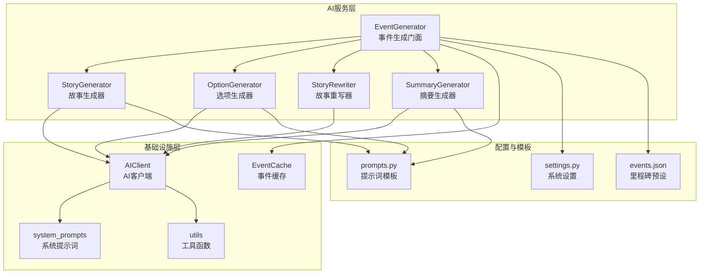
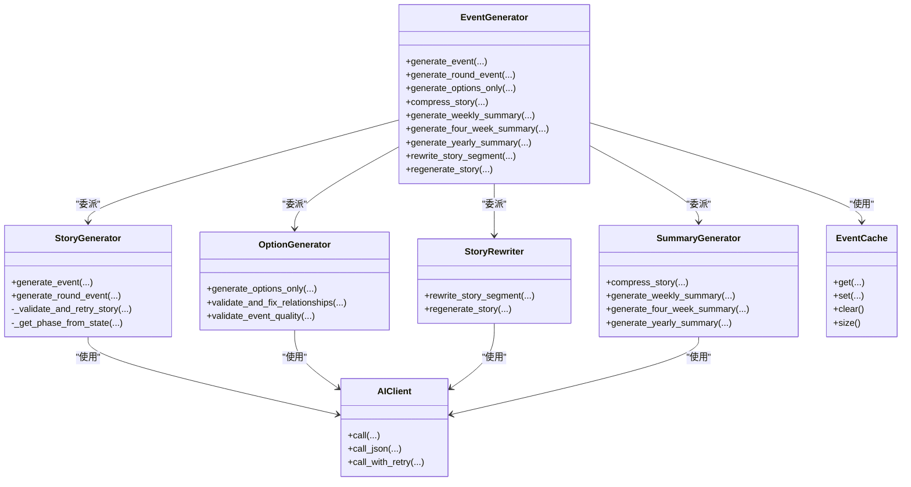
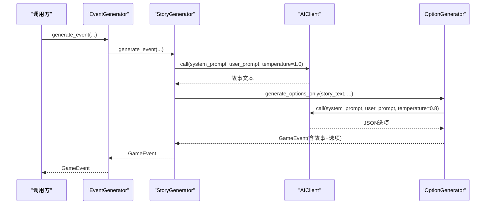
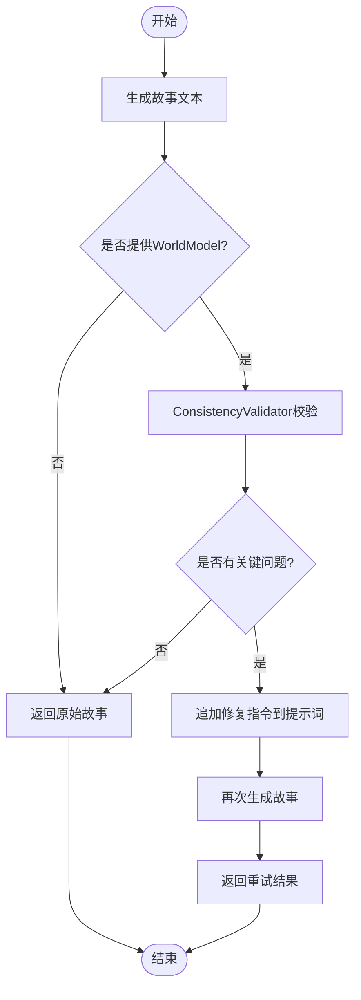
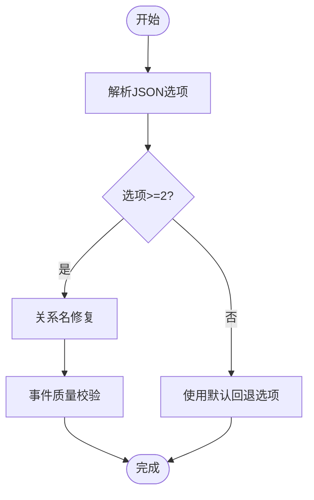
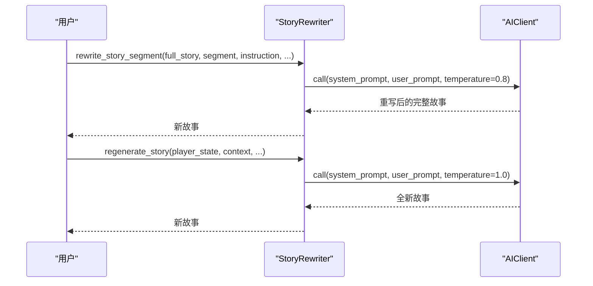
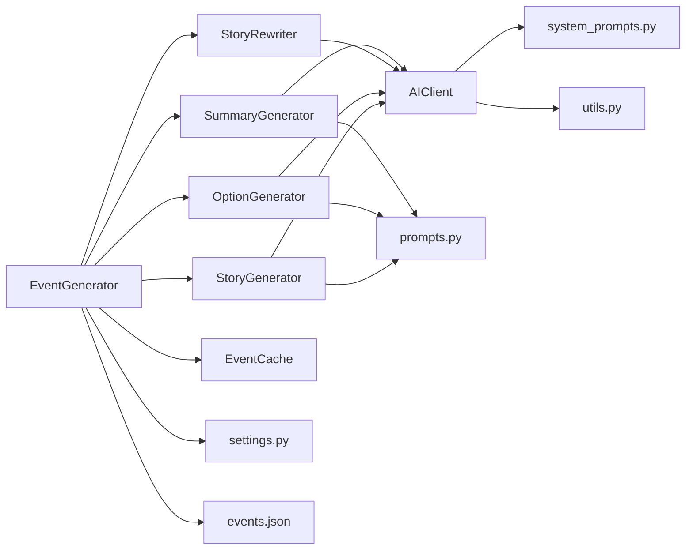

# 事件生成系统

<cite>
**本文档引用的文件**
- [src/ai/generator.py](file://src/ai/generator.py)
- [src/ai/story_generator.py](file://src/ai/story_generator.py)
- [src/ai/option_generator.py](file://src/ai/option_generator.py)
- [src/ai/story_rewriter.py](file://src/ai/story_rewriter.py)
- [src/ai/client.py](file://src/ai/client.py)
- [src/ai/cache.py](file://src/ai/cache.py)
- [src/ai/models.py](file://src/ai/models.py)
- [src/ai/system_prompts.py](file://src/ai/system_prompts.py)
- [src/ai/utils.py](file://src/ai/utils.py)
- [src/ai/summary_generator.py](file://src/ai/summary_generator.py)
- [config/prompts.py](file://config/prompts.py)
- [config/settings.py](file://config/settings.py)
- [data/presets/events.json](file://data/presets/events.json)
- [src/game/game_loop.py](file://src/game/game_loop.py)
</cite>

## 目录
1. [简介](#简介)
2. [项目结构](#项目结构)
3. [核心组件](#核心组件)
4. [架构总览](#架构总览)
5. [详细组件分析](#详细组件分析)
6. [依赖关系分析](#依赖关系分析)
7. [性能考虑](#性能考虑)
8. [故障排除指南](#故障排除指南)
9. [结论](#结论)
10. [附录](#附录)

## 简介
本文件面向事件生成系统，聚焦于故事生成器与重写器的设计架构，系统性阐述两阶段生成流程（第一步：故事文本生成；第二步：选项生成）、故事重写器的功能（段落重写、全文再生、上下文保持）、生成算法与提示词设计、输出格式化、质量控制机制、一致性保证与性能优化策略，并提供配置选项与自定义指导。

## 项目结构
事件生成系统位于 src/ai 目录下，采用模块化分层设计：
- 顶层门面：EventGenerator（统一入口，委派至各子服务）
- 核心服务：
  - StoryGenerator：故事文本生成（两阶段流程 Step 1）
  - OptionGenerator：选项生成与校验（两阶段流程 Step 2）
  - StoryRewriter：段落重写与全文再生
  - SummaryGenerator：故事压缩与周/季度/年度总结
- 基础设施：
  - AIClient：统一的AI调用抽象层
  - EventCache：事件缓存
  - system_prompts：系统提示词注册表
  - utils：JSON提取等工具
- 配置与提示模板：
  - config/prompts.py：提示词模板与上下文构建
  - config/settings.py：全局配置
  - data/presets/events.json：里程碑事件预设

图表来源
- [src/ai/generator.py](file://src/ai/generator.py#L30-L66)
- [src/ai/story_generator.py](file://src/ai/story_generator.py#L24-L28)
- [src/ai/option_generator.py](file://src/ai/option_generator.py#L17-L21)
- [src/ai/story_rewriter.py](file://src/ai/story_rewriter.py#L16-L20)
- [src/ai/summary_generator.py](file://src/ai/summary_generator.py#L17-L21)
- [src/ai/client.py](file://src/ai/client.py#L22-L47)
- [src/ai/cache.py](file://src/ai/cache.py#L13-L26)
- [src/ai/system_prompts.py](file://src/ai/system_prompts.py#L196-L226)
- [src/ai/utils.py](file://src/ai/utils.py#L10-L77)
- [config/prompts.py](file://config/prompts.py#L674-L712)
- [config/settings.py](file://config/settings.py#L30-L100)
- [data/presets/events.json](file://data/presets/events.json#L1-L239)

章节来源
- [src/ai/generator.py](file://src/ai/generator.py#L30-L66)
- [config/settings.py](file://config/settings.py#L16-L27)

## 核心组件
- EventGenerator（门面）：聚合 StoryGenerator、OptionGenerator、StoryRewriter、SummaryGenerator，提供统一接口；支持缓存、预设事件、向后兼容的AI调用方法。
- StoryGenerator：两阶段流程 Step 1，负责故事文本生成；支持一致性校验与重试；提供周事件与回合事件两种生成路径。
- OptionGenerator：两阶段流程 Step 2，负责基于故事生成选项；执行关系名校正与效果合理性校验；提供默认回退选项。
- StoryRewriter：支持段落级重写与全文再生，保持角色设定与上下文一致性。
- SummaryGenerator：故事压缩、周/四周期/年度总结生成。
- AIClient：统一的AI调用抽象，封装流式输出、JSON解析、重试与错误反馈注入。
- EventCache：基于签名的事件缓存，降低API调用成本。
- system_prompts：集中管理各类系统提示词，确保KV缓存前缀稳定与行为一致。
- utils：JSON提取工具，提升鲁棒性。
- config/prompts：构建时间/人物/剧情线/习惯/伏笔等上下文，形成高质量提示词。

章节来源
- [src/ai/generator.py](file://src/ai/generator.py#L30-L66)
- [src/ai/story_generator.py](file://src/ai/story_generator.py#L24-L28)
- [src/ai/option_generator.py](file://src/ai/option_generator.py#L17-L21)
- [src/ai/story_rewriter.py](file://src/ai/story_rewriter.py#L16-L20)
- [src/ai/summary_generator.py](file://src/ai/summary_generator.py#L17-L21)
- [src/ai/client.py](file://src/ai/client.py#L22-L47)
- [src/ai/cache.py](file://src/ai/cache.py#L13-L26)
- [src/ai/system_prompts.py](file://src/ai/system_prompts.py#L196-L226)
- [src/ai/utils.py](file://src/ai/utils.py#L10-L77)
- [config/prompts.py](file://config/prompts.py#L674-L712)

## 架构总览
事件生成系统采用“门面 + 子服务”的分层架构，通过 AIClient 抽象统一调用 OpenAI 接口，Prompts 与 System Prompts 提供稳定的提示词与角色设定，Cache 降低重复生成成本，模型层（GameEvent/EventOption）保障数据结构一致性。

图表来源
- [src/ai/generator.py](file://src/ai/generator.py#L30-L66)
- [src/ai/story_generator.py](file://src/ai/story_generator.py#L24-L28)
- [src/ai/option_generator.py](file://src/ai/option_generator.py#L17-L21)
- [src/ai/story_rewriter.py](file://src/ai/story_rewriter.py#L16-L20)
- [src/ai/summary_generator.py](file://src/ai/summary_generator.py#L17-L21)
- [src/ai/client.py](file://src/ai/client.py#L22-L47)
- [src/ai/cache.py](file://src/ai/cache.py#L13-L26)

## 详细组件分析

### 两阶段生成流程（故事文本生成 + 选项生成）
- Step 1：StoryGenerator.generate_event/generate_round_event
  - 构建提示词（角色设定、时间、剧情线、已建立事实、世界模型约束、伏笔回响、人物习惯、上一轮故事上下文等）
  - 调用 AIClient 生成故事文本（可流式输出）
  - 若提供 WorldModel，则进行一致性校验与必要重试
- Step 2：OptionGenerator.generate_options_only
  - 基于 Step 1 的故事生成选项（JSON 解析 + 校验）
  - 关系名修复（精确匹配、大小写不敏感、角色匹配、上下文就近匹配）
  - 事件质量校验（最少2个选项、动作点成本、效果合理性、真实权衡）

图表来源
- [src/ai/generator.py](file://src/ai/generator.py#L183-L238)
- [src/ai/story_generator.py](file://src/ai/story_generator.py#L32-L175)
- [src/ai/option_generator.py](file://src/ai/option_generator.py#L25-L132)
- [src/ai/client.py](file://src/ai/client.py#L51-L104)

章节来源
- [src/ai/story_generator.py](file://src/ai/story_generator.py#L32-L175)
- [src/ai/option_generator.py](file://src/ai/option_generator.py#L25-L132)
- [config/prompts.py](file://config/prompts.py#L674-L712)

### 一致性校验与重试（Step 1.5）
- 当提供 WorldModel 时，StoryGenerator 在生成故事后调用 ConsistencyValidator 进行校验
- 若存在“关键问题”，注入修复指令并重试一次
- 若仅有“警告问题”，不触发重试，保留原文

图表来源
- [src/ai/story_generator.py](file://src/ai/story_generator.py#L310-L373)

章节来源
- [src/ai/story_generator.py](file://src/ai/story_generator.py#L310-L373)

### 选项生成与质量控制
- 选项数量：至少2个
- 动作点成本：缺失时自动补全
- 效果合理性：对能量、情绪、知识等进行幅度检查
- 关系名修复：多策略匹配，最终若无法匹配则丢弃该关系项，避免错配

图表来源
- [src/ai/option_generator.py](file://src/ai/option_generator.py#L25-L132)
- [src/ai/option_generator.py](file://src/ai/option_generator.py#L136-L280)

章节来源
- [src/ai/option_generator.py](file://src/ai/option_generator.py#L25-L132)
- [src/ai/option_generator.py](file://src/ai/option_generator.py#L136-L280)

### 故事重写器（段落重写与全文再生）
- 段落重写：接收完整故事、待替换段落、用户指令、角色设定、故事上下文，返回重写后的完整故事
- 全文再生：基于当前状态与上下文生成全新故事，保持与之前故事的逻辑一致性

图表来源
- [src/ai/story_rewriter.py](file://src/ai/story_rewriter.py#L24-L116)
- [src/ai/story_rewriter.py](file://src/ai/story_rewriter.py#L118-L200)

章节来源
- [src/ai/story_rewriter.py](file://src/ai/story_rewriter.py#L24-L116)
- [src/ai/story_rewriter.py](file://src/ai/story_rewriter.py#L118-L200)

### 提示词设计与上下文构建
- 角色设定：时代、年龄、性别、世界背景、家庭、关系、个性与能力
- 时间上下文：日期、季节、年龄、周数
- 剧情线：高/中重要性未完结剧情线及其人物
- 已建立事实：角色身份、地点、事务一致性约束
- 世界模型约束：地理、职业、承诺、因果链、身体状态
- 伏笔回响：隐蔽度、回收方式、叙事权重、引入技巧
- 人物习惯：行为/言语/情绪/社交/生活方式类别与强度
- 上一轮故事上下文：未完结强制续写或完结承上启下规则

章节来源
- [config/prompts.py](file://config/prompts.py#L7-L33)
- [config/prompts.py](file://config/prompts.py#L68-L331)
- [config/prompts.py](file://config/prompts.py#L333-L488)
- [config/prompts.py](file://config/prompts.py#L491-L554)
- [config/prompts.py](file://config/prompts.py#L556-L577)
- [config/prompts.py](file://config/prompts.py#L580-L671)
- [config/prompts.py](file://config/prompts.py#L674-L712)

### 输出格式化与JSON提取
- AIClient.call_json：统一解析AI返回的JSON
- utils.extract_json：容错提取（纯JSON、代码块包裹、正则匹配对象）

章节来源
- [src/ai/client.py](file://src/ai/client.py#L108-L136)
- [src/ai/utils.py](file://src/ai/utils.py#L10-L77)

### 质量控制机制与一致性保证
- 事件模型（GameEvent/EventOption）：Pydantic 校验，限制长度与最小选项数
- 选项质量：动作点成本、效果幅度、真实权衡
- 关系名修复：严格匹配策略，避免错配
- 一致性校验：WorldModel驱动的维度检查，关键问题触发重试
- 缓存策略：随机概率命中，保证多样性与成本控制

章节来源
- [src/ai/models.py](file://src/ai/models.py#L7-L27)
- [src/ai/option_generator.py](file://src/ai/option_generator.py#L242-L280)
- [src/ai/story_generator.py](file://src/ai/story_generator.py#L310-L373)
- [src/ai/cache.py](file://src/ai/cache.py#L78-L101)

### 性能优化策略
- 缓存：EventCache 基于签名与随机概率命中，减少重复调用
- 流式输出：支持 StoryGenerator 的流式回调，改善用户体验
- 重试与错误反馈：call_with_retry 注入上次错误，提高成功率
- 并行压缩：SummaryGenerator 支持叙事压缩与世界更新并行执行

章节来源
- [src/ai/cache.py](file://src/ai/cache.py#L78-L101)
- [src/ai/client.py](file://src/ai/client.py#L80-L104)
- [src/ai/client.py](file://src/ai/client.py#L140-L213)
- [src/ai/summary_generator.py](file://src/ai/summary_generator.py#L144-L200)

## 依赖关系分析
- 组件耦合：EventGenerator 作为门面，低耦合地委派给各子服务；子服务均依赖 AIClient，便于统一控制与替换
- 外部依赖：OpenAI SDK；配置来源于环境变量与settings
- 循环依赖：未见循环依赖迹象，模块职责清晰

图表来源
- [src/ai/generator.py](file://src/ai/generator.py#L30-L66)
- [src/ai/story_generator.py](file://src/ai/story_generator.py#L12-L20)
- [src/ai/option_generator.py](file://src/ai/option_generator.py#L9-L12)
- [src/ai/story_rewriter.py](file://src/ai/story_rewriter.py#L9-L11)
- [src/ai/summary_generator.py](file://src/ai/summary_generator.py#L10-L12)
- [src/ai/client.py](file://src/ai/client.py#L14-L17)
- [src/ai/cache.py](file://src/ai/cache.py#L7-L8)
- [config/prompts.py](file://config/prompts.py#L2-L5)
- [config/settings.py](file://config/settings.py#L34-L41)
- [data/presets/events.json](file://data/presets/events.json#L1-L239)

章节来源
- [src/ai/generator.py](file://src/ai/generator.py#L30-L66)
- [src/ai/client.py](file://src/ai/client.py#L14-L17)
- [config/settings.py](file://config/settings.py#L34-L41)

## 性能考虑
- API成本控制：通过 EventCache 与随机命中率降低重复调用；流式输出减少等待时间
- 生成稳定性：call_with_retry 注入错误反馈，提升成功率；一致性校验避免无效重试
- 数据结构约束：Pydantic 校验减少下游异常开销
- 并行化：摘要压缩拆分为叙事压缩与世界更新并行执行

## 故障排除指南
- 生成失败重试：call_with_retry 自动注入上次错误原因，建议检查提示词完整性与格式
- JSON解析失败：utils.extract_json 提供多种提取策略，若仍失败，检查模型输出格式
- 选项不足或格式错误：OptionGenerator 默认回退两个选项，建议检查 Step 1 的故事质量与 Step 2 的提示词
- 关系名错配：启用 validate_and_fix_relationships，若仍报错，确认角色设定与可用人物列表
- 一致性校验失败：关注关键问题列表，按修复指令调整提示词后重试

章节来源
- [src/ai/client.py](file://src/ai/client.py#L140-L213)
- [src/ai/utils.py](file://src/ai/utils.py#L10-L77)
- [src/ai/option_generator.py](file://src/ai/option_generator.py#L118-L132)
- [src/ai/story_generator.py](file://src/ai/story_generator.py#L310-L373)

## 结论
事件生成系统通过两阶段生成流程、完善的提示词上下文构建、一致性校验与重试、关系名修复与质量控制，实现了高质量、可定制、可扩展的故事与选项生成。结合缓存与流式输出等性能优化策略，在保证体验的同时有效降低了成本。故事重写器进一步增强了叙事可控性与一致性，适合在调试、迭代与个性化需求场景中使用。

## 附录

### 配置选项与自定义指导
- 环境变量
  - OPENAI_API_KEY：必填，用于初始化 AIClient
  - OPENAI_MODEL：默认 gpt-4，可覆盖
  - OPENAI_BASE_URL：可选，自定义基础URL
  - DEFAULT_LANGUAGE：默认 zh 或 en
  - CACHE_EVENTS：是否启用事件缓存，默认 true
  - DEBUG_MODE：调试模式开关
- 设置类（Settings）
  - 数据目录：DATA_DIR/PRESETS_DIR/CACHE_DIR
  - 游戏常量：起始年龄、结束年龄、每周轮数、初始资源、衰减等
  - 数据库连接：优先 DATABASE_URL（云），否则本地 SQLite
- 提示词与系统提示
  - system_prompts：集中管理各类系统提示，确保KV缓存前缀稳定
  - prompts：构建角色、时间、剧情线、习惯、伏笔、世界模型等上下文
- 里程碑事件预设
  - data/presets/events.json：支持周数级别的里程碑事件，优先于常规生成

章节来源
- [config/settings.py](file://config/settings.py#L34-L41)
- [config/settings.py](file://config/settings.py#L44-L62)
- [config/settings.py](file://config/settings.py#L69-L81)
- [src/ai/system_prompts.py](file://src/ai/system_prompts.py#L196-L226)
- [config/prompts.py](file://config/prompts.py#L674-L712)
- [data/presets/events.json](file://data/presets/events.json#L1-L239)