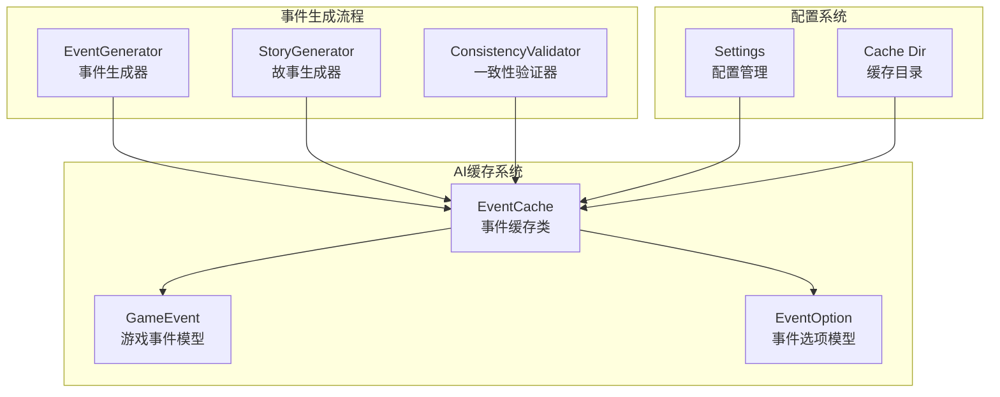
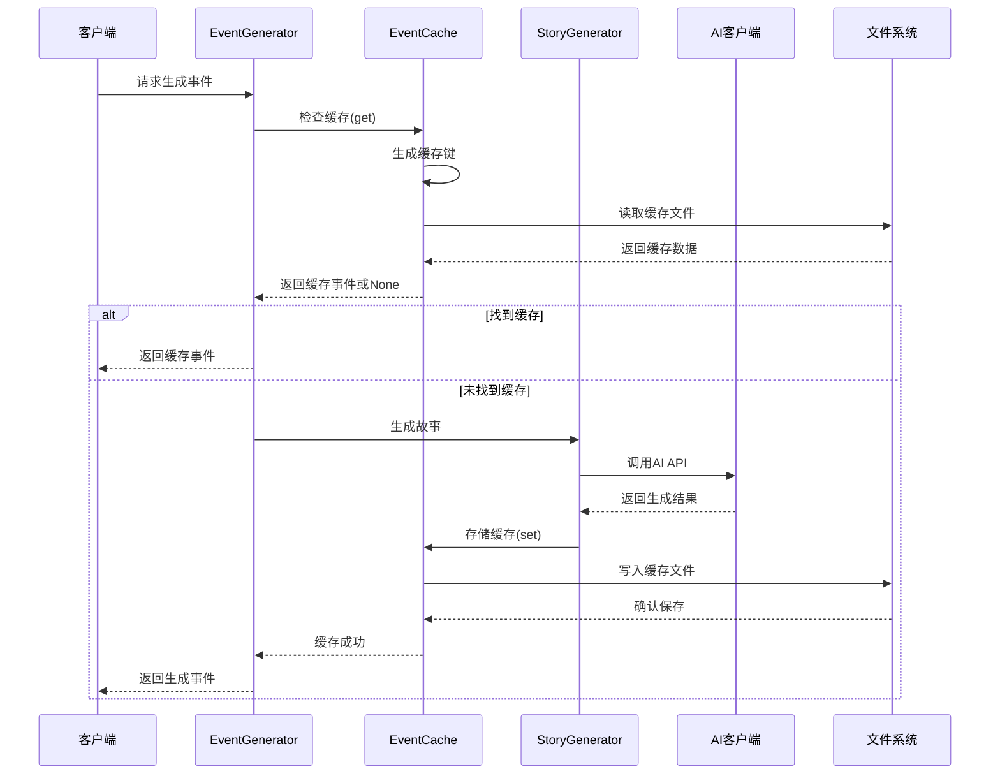
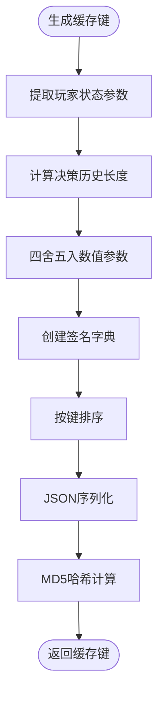
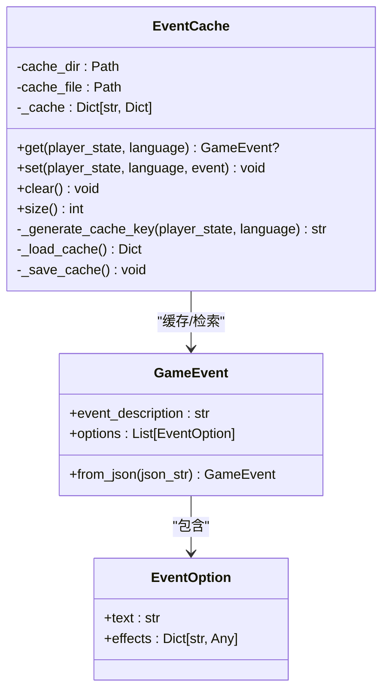
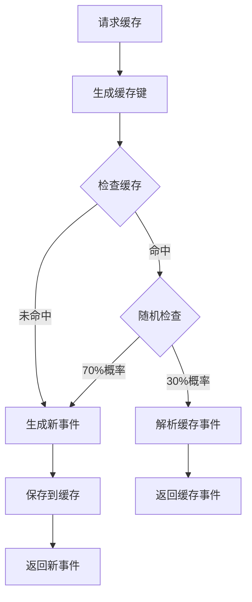
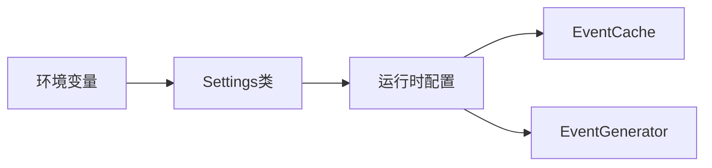
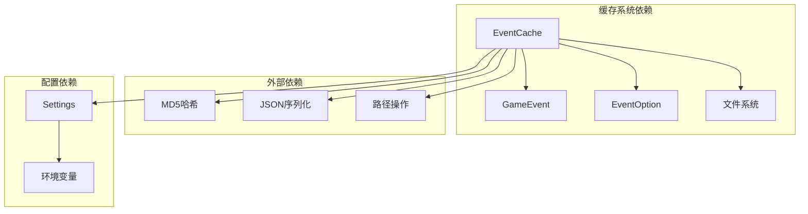

# 缓存机制设计

<cite>
**本文档引用的文件**
- [src/ai/cache.py](file://src/ai/cache.py)
- [src/ai/models.py](file://src/ai/models.py)
- [src/ai/generator.py](file://src/ai/generator.py)
- [src/ai/story_generator.py](file://src/ai/story_generator.py)
- [src/ai/consistency_validator.py](file://src/ai/consistency_validator.py)
- [src/ai/utils.py](file://src/ai/utils.py)
- [config/settings.py](file://config/settings.py)
- [config/prompts.py](file://config/prompts.py)
- [data/cache/events_cache.json](file://data/cache/events_cache.json)
</cite>

## 目录
1. [简介](#简介)
2. [项目结构](#项目结构)
3. [核心组件](#核心组件)
4. [架构概览](#架构概览)
5. [详细组件分析](#详细组件分析)
6. [依赖关系分析](#依赖关系分析)
7. [性能考虑](#性能考虑)
8. [故障排除指南](#故障排除指南)
9. [结论](#结论)
10. [附录](#附录)

## 简介

本文档深入分析了事件缓存系统的设计架构和实现细节。该缓存机制旨在减少AI事件生成的API调用成本，提高系统响应速度，同时确保内容质量和一致性。系统采用基于文件的持久化缓存，结合智能键值设计和随机命中策略，实现了高效的事件缓存管理。

## 项目结构

事件缓存系统位于AI模块的缓存子系统中，与事件生成、一致性验证等核心功能紧密集成：



**图表来源**
- [src/ai/cache.py](file://src/ai/cache.py#L13-L138)
- [src/ai/generator.py](file://src/ai/generator.py#L30-L66)
- [config/settings.py](file://config/settings.py#L16-L27)

**章节来源**
- [src/ai/cache.py](file://src/ai/cache.py#L1-L139)
- [config/settings.py](file://config/settings.py#L1-L100)

## 核心组件

### EventCache 类

EventCache 是缓存系统的核心类，负责事件的缓存、检索和管理。其主要功能包括：

- **缓存键生成**：基于玩家状态和语言生成唯一标识符
- **事件存储**：将GameEvent对象序列化为JSON格式存储
- **缓存检索**：根据键值快速查找和返回缓存事件
- **持久化管理**：自动处理文件读写和错误恢复

### GameEvent 模型

GameEvent 是缓存系统存储的核心数据结构，定义了事件的标准格式：

- **事件描述**：详细的故事内容
- **选项列表**：2-4个可选的决策路径
- **效果映射**：每个选项对属性的影响

### 缓存配置

系统支持灵活的缓存配置，可通过环境变量控制缓存行为：

- `CACHE_EVENTS`：启用/禁用事件缓存
- `CACHE_DIR`：缓存文件存储目录
- 缓存文件：events_cache.json

**章节来源**
- [src/ai/cache.py](file://src/ai/cache.py#L13-L138)
- [src/ai/models.py](file://src/ai/models.py#L14-L27)
- [config/settings.py](file://config/settings.py#L30-L42)

## 架构概览

事件缓存系统采用分层架构设计，与整体AI生成流程无缝集成：



**图表来源**
- [src/ai/generator.py](file://src/ai/generator.py#L212-L217)
- [src/ai/cache.py](file://src/ai/cache.py#L78-L128)
- [src/ai/story_generator.py](file://src/ai/story_generator.py#L152-L154)

## 详细组件分析

### 缓存键设计

缓存键采用MD5哈希算法生成，确保唯一性和稳定性：



**图表来源**
- [src/ai/cache.py](file://src/ai/cache.py#L47-L76)

缓存键包含的关键参数：
- **年龄**：基础属性
- **能量**：按10单位四舍五入
- **情绪**：按10单位四舍五入  
- **知识**：按10单位四舍五入
- **财富**：按10000单位四舍五入
- **周数**：当前游戏周数
- **决策计数**：决策历史长度
- **语言**：目标语言代码

### 过期机制

系统采用基于时间的过期策略：

- **文件级持久化**：缓存存储在events_cache.json文件中
- **手动清理**：提供clear()方法清空所有缓存
- **无自动过期**：当前实现不包含自动过期逻辑
- **版本兼容**：支持缓存文件的错误恢复和降级

### 内存管理

缓存系统采用惰性加载策略：

- **按需加载**：启动时从文件系统加载缓存
- **内存驻留**：缓存数据常驻内存，提高访问速度
- **自动保存**：每次修改后自动保存到文件
- **错误处理**：文件读写异常时提供降级处理

### 数据一致性保证

系统通过多重机制确保数据一致性：



**图表来源**
- [src/ai/cache.py](file://src/ai/cache.py#L13-L138)
- [src/ai/models.py](file://src/ai/models.py#L7-L27)

**章节来源**
- [src/ai/cache.py](file://src/ai/cache.py#L28-L46)
- [src/ai/cache.py](file://src/ai/cache.py#L130-L138)

### 缓存命中策略

系统采用混合命中策略：



**图表来源**
- [src/ai/cache.py](file://src/ai/cache.py#L92-L101)

随机命中策略的目的：
- **多样性保证**：避免过度依赖缓存导致内容重复
- **质量平衡**：在性能和内容新鲜度之间取得平衡
- **用户体验**：提供更丰富的游戏体验

**章节来源**
- [src/ai/cache.py](file://src/ai/cache.py#L92-L101)

### 缓存配置选项

系统支持多种配置选项：

| 配置项 | 默认值 | 描述 |
|--------|--------|------|
| CACHE_EVENTS | true | 启用/禁用事件缓存 |
| CACHE_DIR | data/cache | 缓存文件存储目录 |
| DEBUG_MODE | false | 调试模式开关 |

配置加载流程：



**图表来源**
- [config/settings.py](file://config/settings.py#L34-L42)
- [config/settings.py](file://config/settings.py#L16-L27)

**章节来源**
- [config/settings.py](file://config/settings.py#L30-L42)

## 依赖关系分析

缓存系统与核心组件的依赖关系：



**图表来源**
- [src/ai/cache.py](file://src/ai/cache.py#L1-L10)
- [config/settings.py](file://config/settings.py#L1-L10)

**章节来源**
- [src/ai/cache.py](file://src/ai/cache.py#L1-L10)
- [config/settings.py](file://config/settings.py#L1-L10)

## 性能考虑

### 缓存性能优化

1. **键生成优化**
   - 使用MD5哈希确保键的唯一性
   - 数值参数四舍五入减少缓存碎片
   - 键值排序确保一致性

2. **I/O性能**
   - 单文件存储简化文件管理
   - JSON格式便于人类阅读和调试
   - 异常处理确保系统稳定性

3. **内存效率**
   - 惰性加载避免不必要的内存占用
   - 对象序列化减少内存碎片
   - 自动垃圾回收机制

### 命中率分析

当前实现的命中率受以下因素影响：

- **状态相似性**：相近的状态参数产生相同键
- **随机命中**：30%的命中概率平衡性能和多样性
- **缓存大小**：当前文件包含数千条缓存记录

### 存储优化

- **压缩存储**：JSON格式便于压缩和传输
- **增量更新**：支持部分更新和增量保存
- **备份机制**：文件损坏时的自动恢复

## 故障排除指南

### 常见问题及解决方案

1. **缓存文件损坏**
   - 现象：无法加载缓存文件
   - 解决：调用clear()方法清空缓存
   - 预防：定期备份缓存文件

2. **磁盘空间不足**
   - 现象：缓存保存失败
   - 解决：清理旧缓存或增加磁盘空间
   - 预防：监控磁盘使用情况

3. **权限问题**
   - 现象：无法读写缓存文件
   - 解决：检查文件权限设置
   - 预防：确保应用具有适当权限

4. **内存溢出**
   - 现象：缓存过大导致内存不足
   - 解决：实现缓存清理策略
   - 预防：监控缓存大小

### 调试技巧

- **日志分析**：查看缓存操作日志
- **文件检查**：验证events_cache.json完整性
- **键值验证**：确认缓存键生成正确性
- **性能监控**：跟踪缓存命中率和响应时间

**章节来源**
- [src/ai/cache.py](file://src/ai/cache.py#L34-L45)
- [src/ai/cache.py](file://src/ai/cache.py#L98-L99)

## 结论

事件缓存系统通过精心设计的键生成策略、智能的命中机制和完善的错误处理，实现了高效、可靠的事件缓存管理。系统在保证内容质量的同时，显著减少了API调用成本，提升了用户体验。

未来可以考虑的改进方向：
- 实现自动过期机制
- 添加缓存统计和监控
- 支持分布式缓存
- 优化缓存清理策略

## 附录

### 缓存文件格式

events_cache.json采用标准JSON格式存储，每个键对应一个GameEvent对象：

```json
{
  "cache_key": {
    "event_description": "事件描述",
    "options": [
      {
        "text": "选项文本",
        "effects": {
          "energy": -5,
          "mood": 10,
          "knowledge": 0,
          "wealth": 0
        }
      }
    ]
  }
}
```

### 配置示例

```python
# 启用缓存（默认）
settings.CACHE_EVENTS = True

# 设置缓存目录
settings.CACHE_DIR = Path("data/cache")

# 禁用缓存用于调试
settings.CACHE_EVENTS = False
```