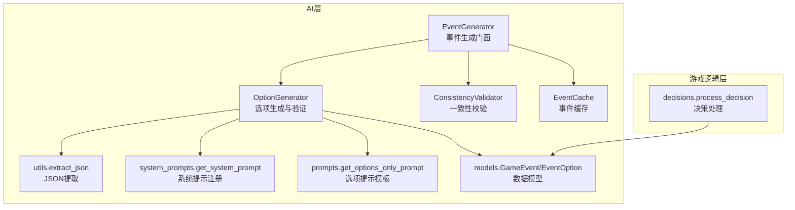
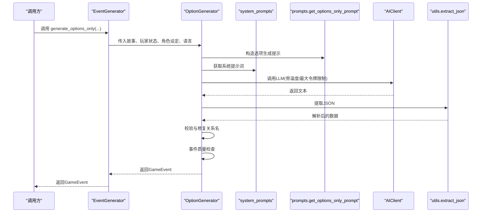
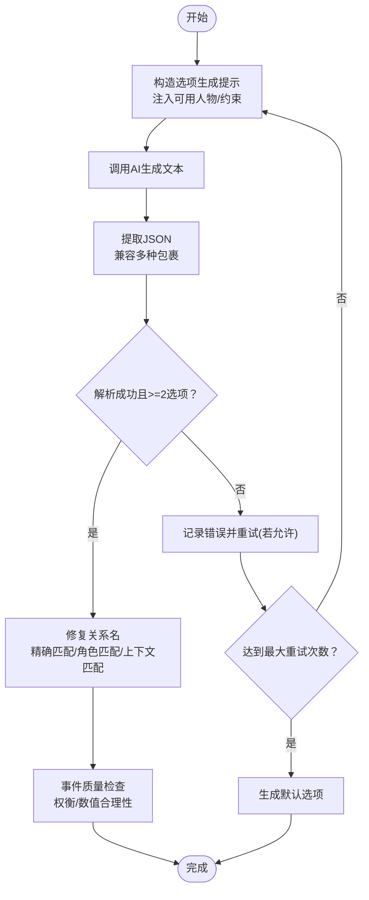
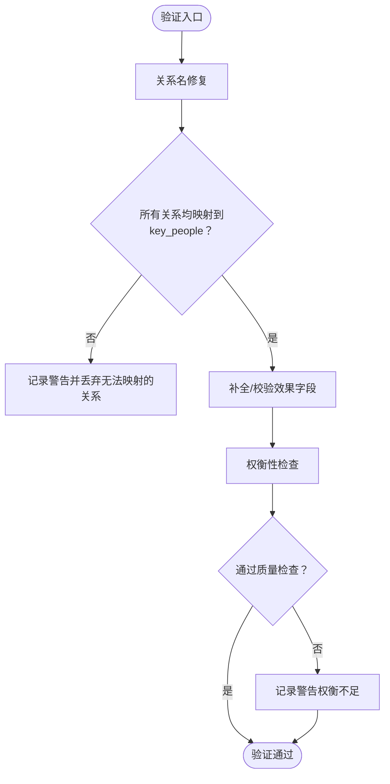
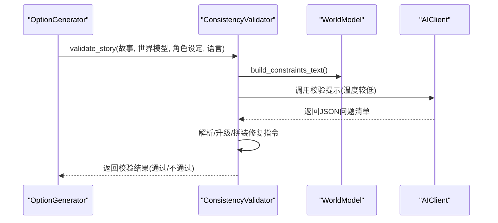
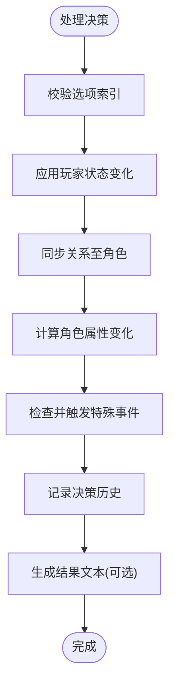
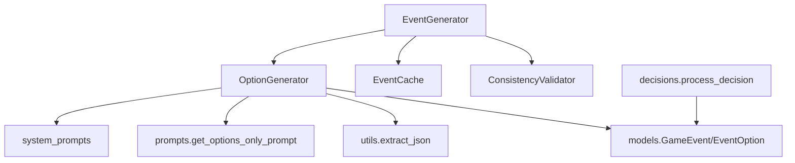

# 选项生成系统

<cite>
**本文档引用的文件**
- [src/ai/option_generator.py](file://src/ai/option_generator.py)
- [src/ai/generator.py](file://src/ai/generator.py)
- [src/ai/models.py](file://src/ai/models.py)
- [src/ai/utils.py](file://src/ai/utils.py)
- [src/ai/system_prompts.py](file://src/ai/system_prompts.py)
- [config/prompts.py](file://config/prompts.py)
- [src/ai/cache.py](file://src/ai/cache.py)
- [src/ai/consistency_validator.py](file://src/ai/consistency_validator.py)
- [src/game/decisions.py](file://src/game/decisions.py)
- [config/settings.py](file://config/settings.py)
</cite>

## 目录
1. [简介](#简介)
2. [项目结构](#项目结构)
3. [核心组件](#核心组件)
4. [架构总览](#架构总览)
5. [详细组件分析](#详细组件分析)
6. [依赖关系分析](#依赖关系分析)
7. [性能考虑](#性能考虑)
8. [故障排查指南](#故障排查指南)
9. [结论](#结论)
10. [附录](#附录)

## 简介
本文件系统性阐述“选项生成系统”的设计与实现，涵盖候选选项的生成、验证与质量控制机制，以及与故事生成、一致性校验、缓存与决策处理的协同关系。重点包括：
- 选项生成算法：基于故事上下文的候选生成策略、语义匹配与约束满足
- 选项验证流程：关系名一致性修复、逻辑一致性检查、可行性与重复性过滤
- 选项质量控制：真实权衡、格式校验、回退策略
- 性能优化：缓存命中率、重试与错误反馈、温度与令牌上限调优
- 扩展方法：系统提示词注册、提示模板模块化、世界模型约束注入

## 项目结构
选项生成系统位于 AI 层，围绕“事件生成门面(EventGenerator)”组织，核心职责由 OptionGenerator 承担；同时与 GameEvent/EventOption 数据模型、JSON 提取工具、系统提示词注册、缓存与一致性校验模块紧密协作。

**图表来源**
- [src/ai/generator.py](file://src/ai/generator.py#L30-L66)
- [src/ai/option_generator.py](file://src/ai/option_generator.py#L17-L23)
- [src/ai/consistency_validator.py](file://src/ai/consistency_validator.py#L42-L59)
- [src/ai/utils.py](file://src/ai/utils.py#L10-L77)
- [src/ai/system_prompts.py](file://src/ai/system_prompts.py#L196-L226)
- [config/prompts.py](file://config/prompts.py#L640-L675)
- [src/ai/models.py](file://src/ai/models.py#L7-L27)
- [src/ai/cache.py](file://src/ai/cache.py#L13-L27)
- [src/game/decisions.py](file://src/game/decisions.py#L134-L239)

**章节来源**
- [src/ai/generator.py](file://src/ai/generator.py#L30-L66)
- [src/ai/option_generator.py](file://src/ai/option_generator.py#L17-L23)
- [src/ai/models.py](file://src/ai/models.py#L7-L27)
- [src/ai/utils.py](file://src/ai/utils.py#L10-L77)
- [src/ai/system_prompts.py](file://src/ai/system_prompts.py#L196-L226)
- [config/prompts.py](file://config/prompts.py#L640-L675)
- [src/ai/cache.py](file://src/ai/cache.py#L13-L27)
- [src/ai/consistency_validator.py](file://src/ai/consistency_validator.py#L42-L59)
- [src/game/decisions.py](file://src/game/decisions.py#L134-L239)

## 核心组件
- OptionGenerator：负责“仅生成选项”的核心逻辑，包括提示词构造、AI调用、JSON解析、关系名修复与事件质量检查。
- EventGenerator：门面类，协调故事生成与选项生成，支持缓存、预设事件与多轮生成。
- GameEvent/EventOption：Pydantic 数据模型，约束选项数量、长度与字段结构。
- utils.extract_json：鲁棒的JSON提取器，兼容多种AI输出包裹形式。
- system_prompts：集中管理各类系统提示词，确保KV缓存稳定与行为一致。
- prompts.get_options_only_prompt：面向“已有故事仅生成选项”的提示模板。
- EventCache：事件级缓存，降低重复请求成本。
- ConsistencyValidator：基于世界模型的二次校验，保障叙事一致性。
- decisions.process_decision：将选项效果应用到玩家状态与角色关系。

**章节来源**
- [src/ai/option_generator.py](file://src/ai/option_generator.py#L17-L23)
- [src/ai/generator.py](file://src/ai/generator.py#L30-L66)
- [src/ai/models.py](file://src/ai/models.py#L7-L27)
- [src/ai/utils.py](file://src/ai/utils.py#L10-L77)
- [src/ai/system_prompts.py](file://src/ai/system_prompts.py#L196-L226)
- [config/prompts.py](file://config/prompts.py#L640-L675)
- [src/ai/cache.py](file://src/ai/cache.py#L13-L27)
- [src/ai/consistency_validator.py](file://src/ai/consistency_validator.py#L42-L59)
- [src/game/decisions.py](file://src/game/decisions.py#L134-L239)

## 架构总览
选项生成在两阶段流水线中承担第二阶段：先生成故事，再为故事生成选项；也可单独为已有故事生成选项。系统通过门面类统一调度，结合缓存与一致性校验，确保生成质量与性能。

**图表来源**
- [src/ai/generator.py](file://src/ai/generator.py#L282-L297)
- [src/ai/option_generator.py](file://src/ai/option_generator.py#L25-L132)
- [src/ai/system_prompts.py](file://src/ai/system_prompts.py#L211-L226)
- [config/prompts.py](file://config/prompts.py#L640-L675)
- [src/ai/utils.py](file://src/ai/utils.py#L10-L77)

## 详细组件分析

### 选项生成算法
- 输入与提示构造
  - 输入：现有故事文本、玩家状态、角色设定、语言
  - 提示模板：get_options_only_prompt，注入可用人物列表、时间/逻辑约束、世界模型约束等
  - 系统提示：option_generator，强调“选项必须直接源自故事情节”，禁止通用选项
- 生成与解析
  - 调用AI客户端，设置温度与最大令牌上限
  - 使用extract_json提取JSON对象，兼容多种包裹形式
  - 将解析结果映射为EventOption列表，封装为GameEvent
- 重试与回退
  - 支持多次尝试，失败时附加上次错误信息
  - 若最终仍无效，返回默认选项（积极面对/保持平常心）

**图表来源**
- [src/ai/option_generator.py](file://src/ai/option_generator.py#L25-L132)
- [src/ai/utils.py](file://src/ai/utils.py#L10-L77)
- [src/ai/system_prompts.py](file://src/ai/system_prompts.py#L33-L64)
- [config/prompts.py](file://config/prompts.py#L640-L675)

**章节来源**
- [src/ai/option_generator.py](file://src/ai/option_generator.py#L25-L132)
- [src/ai/utils.py](file://src/ai/utils.py#L10-L77)
- [src/ai/system_prompts.py](file://src/ai/system_prompts.py#L33-L64)
- [config/prompts.py](file://config/prompts.py#L640-L675)

### 选项验证流程
- 关系名验证与修复
  - 优先使用角色设定中的key_people名单
  - 匹配策略：精确匹配→大小写不敏感→按角色身份匹配→基于故事上下文最近邻匹配→丢弃无法映射的关系项
  - 对于未命中的关系，记录警告并剔除，避免错误映射
- 事件质量检查
  - 至少两个选项
  - 补齐action_points（默认-1）
  - 数值合理性检查（能量/情绪/知识等绝对值阈值）
  - 权衡性检查：各选项总效应差异需足够显著，避免“明显最优选项”

**图表来源**
- [src/ai/option_generator.py](file://src/ai/option_generator.py#L136-L280)

**章节来源**
- [src/ai/option_generator.py](file://src/ai/option_generator.py#L136-L280)

### 一致性校验与回退
- 一致性校验
  - 基于世界模型约束进行二次校验，维度包括地理、职业、个性、时间、承诺、因果链
  - 支持对“已建立行为画像角色”的个性问题升级为严重级别
  - 输出结构化问题清单与修复指令，可用于后续重试注入
- 回退策略
  - 校验失败时可注入“必须修正”指令，引导AI在新一轮生成中修正
  - 解析失败或异常时，默认通过，避免阻断主流程

**图表来源**
- [src/ai/consistency_validator.py](file://src/ai/consistency_validator.py#L60-L118)
- [src/ai/consistency_validator.py](file://src/ai/consistency_validator.py#L119-L231)

**章节来源**
- [src/ai/consistency_validator.py](file://src/ai/consistency_validator.py#L60-L118)
- [src/ai/consistency_validator.py](file://src/ai/consistency_validator.py#L119-L231)

### 决策处理与效果应用
- 选项索引有效性检查
- 应用玩家状态变化（精力、情绪、学识、财富、关系）
- 将关系变化同步到角色系统，计算角色属性变化并触发特殊事件
- 记录决策历史，生成结果文本（可选AI生成或简单回退）

**图表来源**
- [src/game/decisions.py](file://src/game/decisions.py#L134-L239)

**章节来源**
- [src/game/decisions.py](file://src/game/decisions.py#L134-L239)

## 依赖关系分析
- OptionGenerator 依赖
  - AIClient：统一的LLM调用接口
  - system_prompts：系统提示词注册表
  - prompts.get_options_only_prompt：选项生成提示模板
  - utils.extract_json：JSON提取
  - models.GameEvent/EventOption：数据模型
- EventGenerator 协调
  - 作为门面，组合 StoryGenerator、OptionGenerator、SummaryGenerator、StoryRewriter
  - 支持缓存与预设事件
- 与其他模块耦合
  - decisions.process_decision：消费GameEvent选项并应用效果
  - consistency_validator：可选的二次校验
  - cache：事件级缓存

**图表来源**
- [src/ai/option_generator.py](file://src/ai/option_generator.py#L17-L23)
- [src/ai/generator.py](file://src/ai/generator.py#L30-L66)
- [src/ai/system_prompts.py](file://src/ai/system_prompts.py#L196-L226)
- [config/prompts.py](file://config/prompts.py#L640-L675)
- [src/ai/utils.py](file://src/ai/utils.py#L10-L77)
- [src/ai/models.py](file://src/ai/models.py#L7-L27)
- [src/ai/cache.py](file://src/ai/cache.py#L13-L27)
- [src/ai/consistency_validator.py](file://src/ai/consistency_validator.py#L42-L59)
- [src/game/decisions.py](file://src/game/decisions.py#L134-L239)

**章节来源**
- [src/ai/option_generator.py](file://src/ai/option_generator.py#L17-L23)
- [src/ai/generator.py](file://src/ai/generator.py#L30-L66)
- [src/ai/models.py](file://src/ai/models.py#L7-L27)
- [src/ai/utils.py](file://src/ai/utils.py#L10-L77)
- [src/ai/system_prompts.py](file://src/ai/system_prompts.py#L196-L226)
- [config/prompts.py](file://config/prompts.py#L640-L675)
- [src/ai/cache.py](file://src/ai/cache.py#L13-L27)
- [src/ai/consistency_validator.py](file://src/ai/consistency_validator.py#L42-L59)
- [src/game/decisions.py](file://src/game/decisions.py#L134-L239)

## 性能考虑
- 缓存策略
  - EventCache：基于玩家状态签名生成MD5键，定期保存；随机30%概率命中，平衡稳定性与多样性
  - 适用场景：相同或相近状态的重复事件生成
- 重试与错误反馈
  - 选项生成支持多次重试，失败时附加上次错误，减少格式问题
- 温度与令牌上限
  - 选项生成默认温度较高，利于创造性；JSON提取器对格式鲁棒，减少因格式问题导致的重试
- 一次性输出与结构化
  - 通过系统提示词与提示模板，引导模型一次性输出结构化JSON，降低后续解析成本

**章节来源**
- [src/ai/cache.py](file://src/ai/cache.py#L47-L101)
- [src/ai/option_generator.py](file://src/ai/option_generator.py#L64-L132)
- [src/ai/utils.py](file://src/ai/utils.py#L10-L77)

## 故障排查指南
- 选项数量不足或格式错误
  - 现象：解析失败或选项少于2个
  - 排查：检查提示模板是否正确注入可用人物列表与约束；确认系统提示词未被外部修改
  - 处理：启用重试；必要时使用默认回退选项
- 关系名不匹配
  - 现象：日志出现“固定/丢弃关系名”的警告
  - 排查：核对角色设定中的key_people与可用人物列表；检查故事上下文中是否包含可推断的人名
  - 处理：确保角色设定完整；必要时调整提示模板以增强上下文检索
- 一致性校验失败
  - 现象：校验返回严重问题或修复指令
  - 排查：查看世界模型约束文本；确认角色行为画像是否覆盖该角色
  - 处理：将修复指令注入后续生成；必要时放宽约束或调整角色设定
- 决策应用异常
  - 现象：状态校验失败或角色事件未触发
  - 排查：检查选项效果是否合理；确认关系变化是否同步到角色系统
  - 处理：修正选项效果；增加触发条件检查

**章节来源**
- [src/ai/option_generator.py](file://src/ai/option_generator.py#L136-L280)
- [src/ai/consistency_validator.py](file://src/ai/consistency_validator.py#L119-L231)
- [src/game/decisions.py](file://src/game/decisions.py#L191-L206)

## 结论
选项生成系统通过“提示模板+系统提示词+JSON提取+关系修复+质量检查”的闭环，实现了高质量、可复现的选项生成。配合缓存与一致性校验，系统在保证叙事一致性的同时兼顾性能与多样性。未来可在以下方面持续演进：
- 更丰富的提示模板与约束注入（如伏笔回响、习惯一致性）
- 动态权重的选项质量评分与多样性打散
- 选项排序与相关性评分的可插拔策略
- 更细粒度的错误分类与自动修复建议

## 附录

### 配置参数与自定义指导
- 系统提示词注册
  - 位置：system_prompts.get_system_prompt
  - 用途：集中管理各模块系统提示词，确保KV缓存稳定与行为一致
- 选项生成提示模板
  - 位置：prompts.get_options_only_prompt
  - 用途：为“已有故事仅生成选项”定制提示，注入可用人物列表、时间/逻辑/世界模型约束
- 事件缓存
  - 位置：EventCache
  - 用途：事件级缓存，降低重复请求成本；随机30%命中率平衡稳定性与多样性
- 选项生成参数
  - 温度：较高以鼓励创造性
  - 最大令牌：适中以控制成本与延迟
  - 重试次数：建议≥2以提升成功率
- 自定义建议
  - 在角色设定中完善key_people与角色画像，提升关系修复准确率
  - 为复杂世界模型提供动态约束，增强一致性校验覆盖面
  - 为UI层提供“选项描述长度/效果展示”等渲染参数，提升可读性

**章节来源**
- [src/ai/system_prompts.py](file://src/ai/system_prompts.py#L196-L226)
- [config/prompts.py](file://config/prompts.py#L640-L675)
- [src/ai/cache.py](file://src/ai/cache.py#L47-L101)
- [src/ai/option_generator.py](file://src/ai/option_generator.py#L81-L86)
- [config/settings.py](file://config/settings.py#L30-L100)