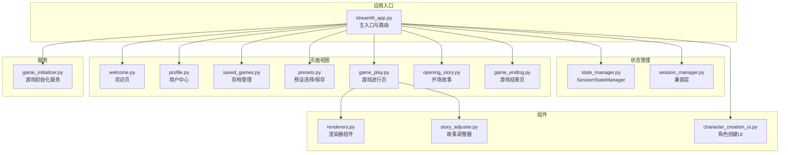
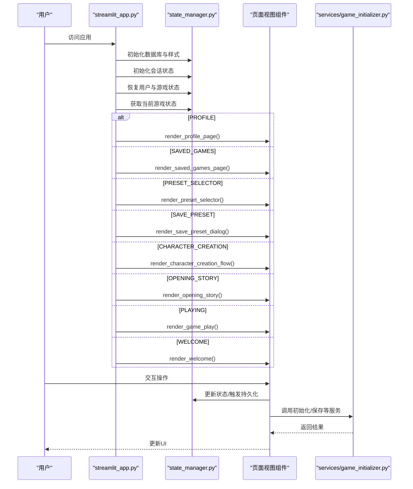
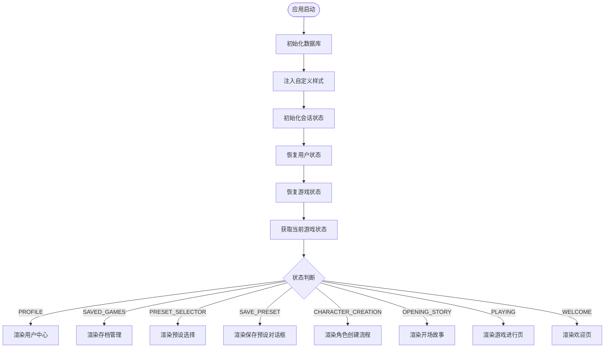
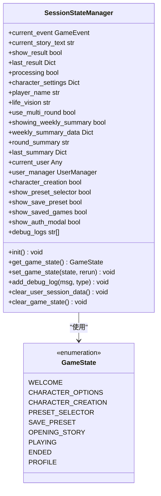
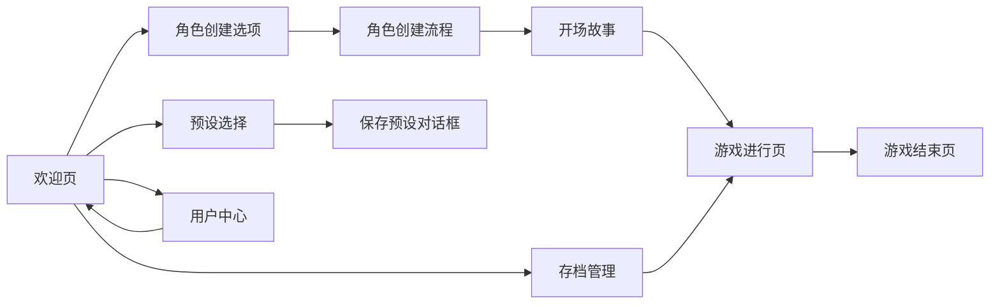
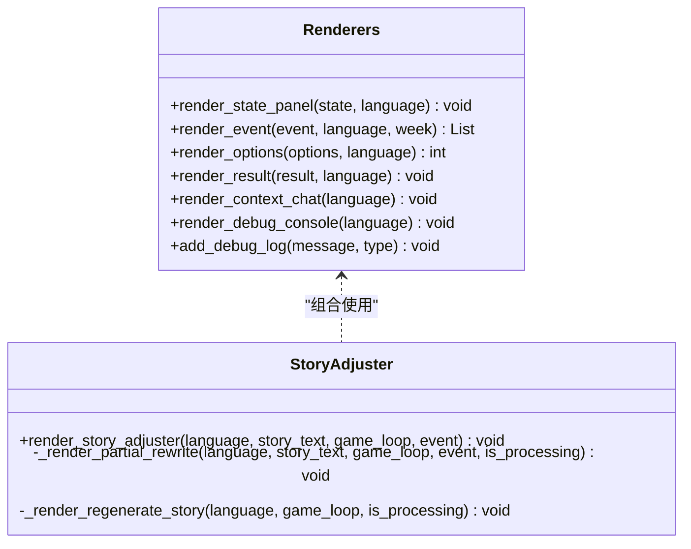
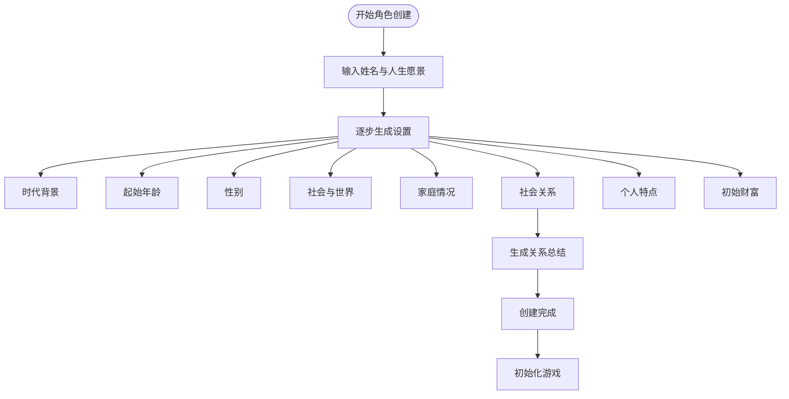
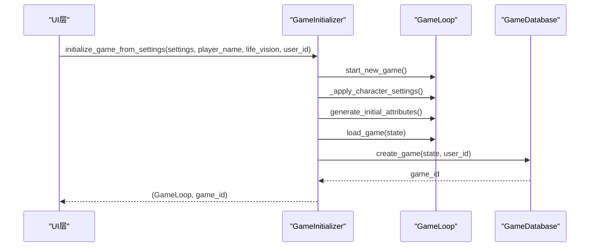
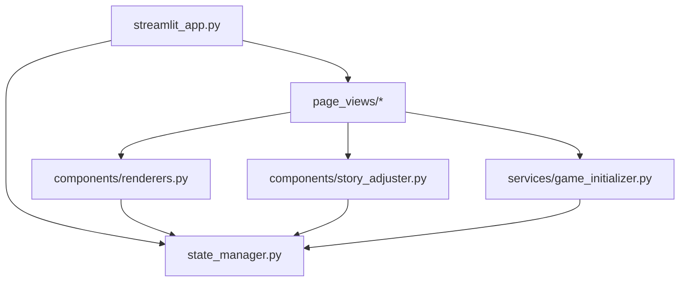

# UI层设计

<cite>
**本文档引用的文件**
- [src/ui/streamlit_app.py](file://src/ui/streamlit_app.py)
- [src/ui/state_manager.py](file://src/ui/state_manager.py)
- [src/ui/session_manager.py](file://src/ui/session_manager.py)
- [src/ui/styles.py](file://src/ui/styles.py)
- [src/ui/page_views/__init__.py](file://src/ui/page_views/__init__.py)
- [src/ui/page_views/welcome.py](file://src/ui/page_views/welcome.py)
- [src/ui/page_views/profile.py](file://src/ui/page_views/profile.py)
- [src/ui/page_views/saved_games.py](file://src/ui/page_views/saved_games.py)
- [src/ui/page_views/presets.py](file://src/ui/page_views/presets.py)
- [src/ui/page_views/game_play.py](file://src/ui/page_views/game_play.py)
- [src/ui/page_views/opening_story.py](file://src/ui/page_views/opening_story.py)
- [src/ui/page_views/game_ending.py](file://src/ui/page_views/game_ending.py)
- [src/ui/components/__init__.py](file://src/ui/components/__init__.py)
- [src/ui/components/renderers.py](file://src/ui/components/renderers.py)
- [src/ui/components/story_adjuster.py](file://src/ui/components/story_adjuster.py)
- [src/ui/character_creation_ui.py](file://src/ui/character_creation_ui.py)
- [src/ui/services/game_initializer.py](file://src/ui/services/game_initializer.py)
</cite>

## 目录
1. [引言](#引言)
2. [项目结构](#项目结构)
3. [核心组件](#核心组件)
4. [架构总览](#架构总览)
5. [详细组件分析](#详细组件分析)
6. [依赖关系分析](#依赖关系分析)
7. [性能考虑](#性能考虑)
8. [故障排除指南](#故障排除指南)
9. [结论](#结论)

## 引言
本设计文档聚焦于Streamlit UI层的架构实现，系统性阐述主应用入口点、状态管理器、页面视图组件以及可复用UI组件的设计与职责边界。文档旨在帮助开发者快速理解UI层的控制流、状态流转与组件交互方式，并提供可视化图表辅助理解。

## 项目结构
UI层采用分层设计：
- 应用入口：负责页面配置、初始化流程、状态管理与路由调度
- 状态管理层：统一管理会话状态、用户状态、游戏状态与持久化
- 页面视图层：包含欢迎页、角色创建页、游戏进行页、存档管理页等
- 组件层：可复用的渲染器组件与故事调整器
- 服务层：游戏初始化服务，封装游戏启动逻辑

**图表来源**
- [src/ui/streamlit_app.py](file://src/ui/streamlit_app.py#L139-L211)
- [src/ui/state_manager.py](file://src/ui/state_manager.py#L42-L538)
- [src/ui/session_manager.py](file://src/ui/session_manager.py#L31-L65)
- [src/ui/page_views/welcome.py](file://src/ui/page_views/welcome.py#L11-L36)
- [src/ui/page_views/game_play.py](file://src/ui/page_views/game_play.py#L18-L67)
- [src/ui/components/renderers.py](file://src/ui/components/renderers.py#L10-L385)
- [src/ui/components/story_adjuster.py](file://src/ui/components/story_adjuster.py#L10-L160)
- [src/ui/character_creation_ui.py](file://src/ui/character_creation_ui.py#L662-L800)
- [src/ui/services/game_initializer.py](file://src/ui/services/game_initializer.py#L49-L138)

**章节来源**
- [src/ui/streamlit_app.py](file://src/ui/streamlit_app.py#L1-L215)
- [src/ui/state_manager.py](file://src/ui/state_manager.py#L1-L773)
- [src/ui/session_manager.py](file://src/ui/session_manager.py#L1-L65)

## 核心组件
- 主应用入口：负责页面配置、数据库初始化、样式注入、会话状态初始化、用户与游戏恢复、状态机路由与页面渲染
- 状态管理器：集中式会话状态管理，提供类型安全的getter/setter、状态初始化、用户状态、事件状态、多回合状态、调试日志与持久化存储
- 页面视图组件：按功能划分的页面渲染器，包含欢迎页、用户中心、存档管理、预设选择/保存、游戏进行、开场故事、游戏结束
- 可复用UI组件：渲染器组件（状态面板、事件渲染、选项渲染、结果渲染、上下文聊天、调试控制台）、故事调整器
- 服务组件：游戏初始化服务，封装从角色设定到游戏实例创建与数据库记录的完整流程

**章节来源**
- [src/ui/streamlit_app.py](file://src/ui/streamlit_app.py#L139-L211)
- [src/ui/state_manager.py](file://src/ui/state_manager.py#L42-L538)
- [src/ui/components/renderers.py](file://src/ui/components/renderers.py#L22-L385)
- [src/ui/components/story_adjuster.py](file://src/ui/components/story_adjuster.py#L10-L160)
- [src/ui/services/game_initializer.py](file://src/ui/services/game_initializer.py#L49-L138)

## 架构总览
UI层采用“状态机路由 + 组件化渲染”的架构模式：
- 应用入口根据当前游戏状态枚举决定渲染哪个页面
- 状态管理器提供全局状态与持久化能力，确保跨页面状态一致性
- 页面视图组件专注于UI渲染与用户交互，业务逻辑委托给底层服务与游戏循环
- 可复用组件通过统一接口提供渲染能力，降低重复开发成本

**图表来源**
- [src/ui/streamlit_app.py](file://src/ui/streamlit_app.py#L139-L211)
- [src/ui/state_manager.py](file://src/ui/state_manager.py#L215-L244)
- [src/ui/page_views/profile.py](file://src/ui/page_views/profile.py#L10-L31)
- [src/ui/page_views/saved_games.py](file://src/ui/page_views/saved_games.py#L12-L50)
- [src/ui/page_views/presets.py](file://src/ui/page_views/presets.py#L15-L41)
- [src/ui/page_views/game_play.py](file://src/ui/page_views/game_play.py#L18-L67)
- [src/ui/page_views/opening_story.py](file://src/ui/page_views/opening_story.py#L11-L31)
- [src/ui/services/game_initializer.py](file://src/ui/services/game_initializer.py#L63-L138)

## 详细组件分析

### 主应用入口设计
- 页面配置：设置页面标题、图标、布局与侧边栏状态
- 初始化流程：数据库初始化、样式注入、会话状态初始化、用户与游戏状态恢复
- 状态机路由：按GameState枚举渲染对应页面，优先级覆盖Profile、Saved Games、Preset Selector、Save Preset、Character Creation、Opening Story、Playing、Welcome
- 角色创建流程：支持玩家姓名与人生愿景输入，调用角色创建UI与游戏初始化服务启动新游戏

**图表来源**
- [src/ui/streamlit_app.py](file://src/ui/streamlit_app.py#L139-L211)

**章节来源**
- [src/ui/streamlit_app.py](file://src/ui/streamlit_app.py#L45-L211)

### 状态管理器职责
- 类型安全的状态访问：通过属性getter/setter统一管理st.session_state
- 状态分类初始化：核心状态、事件状态、角色创建状态、多回合状态、用户状态、UI标志、调试状态
- 游戏状态管理：GameState枚举、状态设置与类型安全获取
- 事件与结果管理：current_event统一来源、current_story_text同步、show_result与last_result
- 用户与持久化：用户信息、用户切换清理、URL与localStorage持久化
- 调试日志：统一的日志收集与上限控制

**图表来源**
- [src/ui/state_manager.py](file://src/ui/state_manager.py#L29-L538)

**章节来源**
- [src/ui/state_manager.py](file://src/ui/state_manager.py#L42-L538)

### 页面视图组件设计
- 欢迎页：主菜单、角色创建入口、预设加载入口、存档加载入口、登录/注册模态框
- 用户中心：登录/注册切换、登出、好友系统（添加、列表、请求）
- 存档管理：列出用户存档、加载与删除
- 预设管理：预设选择、删除、保存预设对话框
- 游戏进行页：事件展示、选项渲染、结果展示、周总结、年度总结、上下文聊天、故事调整器
- 开场故事：流式生成开场故事、缓存与跳转
- 游戏结束页：结局评估、统计展示、成就展示、新游戏按钮

**图表来源**
- [src/ui/page_views/welcome.py](file://src/ui/page_views/welcome.py#L11-L177)
- [src/ui/page_views/profile.py](file://src/ui/page_views/profile.py#L10-L184)
- [src/ui/page_views/saved_games.py](file://src/ui/page_views/saved_games.py#L12-L180)
- [src/ui/page_views/presets.py](file://src/ui/page_views/presets.py#L15-L425)
- [src/ui/page_views/game_play.py](file://src/ui/page_views/game_play.py#L18-L662)
- [src/ui/page_views/opening_story.py](file://src/ui/page_views/opening_story.py#L11-L120)
- [src/ui/page_views/game_ending.py](file://src/ui/page_views/game_ending.py#L8-L96)

**章节来源**
- [src/ui/page_views/welcome.py](file://src/ui/page_views/welcome.py#L11-L177)
- [src/ui/page_views/profile.py](file://src/ui/page_views/profile.py#L10-L184)
- [src/ui/page_views/saved_games.py](file://src/ui/page_views/saved_games.py#L12-L180)
- [src/ui/page_views/presets.py](file://src/ui/page_views/presets.py#L15-L425)
- [src/ui/page_views/game_play.py](file://src/ui/page_views/game_play.py#L18-L662)
- [src/ui/page_views/opening_story.py](file://src/ui/page_views/opening_story.py#L11-L120)
- [src/ui/page_views/game_ending.py](file://src/ui/page_views/game_ending.py#L8-L96)

### 可复用UI组件
- 渲染器组件：状态面板、事件渲染、选项渲染、结果渲染、上下文聊天、调试控制台
- 故事调整器：局部改写与整段重写两种模式，支持AI驱动的故事改写与重新生成

**图表来源**
- [src/ui/components/renderers.py](file://src/ui/components/renderers.py#L22-L385)
- [src/ui/components/story_adjuster.py](file://src/ui/components/story_adjuster.py#L10-L160)

**章节来源**
- [src/ui/components/renderers.py](file://src/ui/components/renderers.py#L22-L385)
- [src/ui/components/story_adjuster.py](file://src/ui/components/story_adjuster.py#L10-L160)

### 角色创建流程
- 分步生成：时代背景、年龄、性别、世界、家庭、关系、个人特点、初始财富
- 交互式与自动式结合：前4步可交互确认或反馈重生成，后3步自动生成
- 关系人物生成：逐一生成关键人物，支持逐人确认或反馈重生成
- 总结生成：汇总关系人物生成关系描述
- 完成后进入游戏初始化流程

**图表来源**
- [src/ui/character_creation_ui.py](file://src/ui/character_creation_ui.py#L662-L800)

**章节来源**
- [src/ui/character_creation_ui.py](file://src/ui/character_creation_ui.py#L8-L800)

### 游戏初始化服务
- 职责：从角色设定创建GameLoop、应用角色设置、生成初始属性、加载关系、保存字符设定与玩家信息、创建数据库记录
- 关系加载：从角色设定中提取关键人物与家庭成员，初始化关系亲密度
- 语言与数据库：支持多语言与数据库持久化

**图表来源**
- [src/ui/services/game_initializer.py](file://src/ui/services/game_initializer.py#L63-L138)

**章节来源**
- [src/ui/services/game_initializer.py](file://src/ui/services/game_initializer.py#L49-L138)

## 依赖关系分析
- 应用入口依赖状态管理器与页面视图组件，通过状态机路由解耦页面渲染
- 页面视图组件依赖渲染器组件与故事调整器，实现UI复用与功能扩展
- 游戏进行页依赖游戏循环与数据库服务，实现事件生成、选择处理与状态保存
- 角色创建流程依赖角色创建器与游戏初始化服务，实现角色设定生成与游戏启动
- 状态管理器提供统一的持久化接口，贯穿用户、游戏与调试日志

**图表来源**
- [src/ui/streamlit_app.py](file://src/ui/streamlit_app.py#L13-L21)
- [src/ui/page_views/__init__.py](file://src/ui/page_views/__init__.py#L1-L20)
- [src/ui/components/__init__.py](file://src/ui/components/__init__.py#L1-L23)

**章节来源**
- [src/ui/page_views/__init__.py](file://src/ui/page_views/__init__.py#L1-L20)
- [src/ui/components/__init__.py](file://src/ui/components/__init__.py#L1-L23)

## 性能考虑
- 流式渲染：事件与故事采用流式回调，提升用户体验与感知性能
- 状态缓存：开场故事与事件文本缓存至会话状态，避免重复生成
- 持久化策略：URL参数与localStorage双通道持久化，支持断线重连恢复
- 多回合优化：多回合系统按周推进，减少一次性计算压力
- UI组件复用：渲染器与故事调整器组件化，降低重复渲染开销

## 故障排除指南
- API配置错误：当OPENAI_API_KEY缺失或无效时，初始化与事件生成会报错，需检查环境变量与配置文件
- 会话状态异常：若processing标记卡死，可在游戏进行页安全重置以恢复按钮可用
- 游戏恢复失败：URL参数或localStorage中的game_id与game_state不匹配时，会清理存储并回退到欢迎页
- 用户恢复失败：URL参数与localStorage均无法恢复用户时，会尝试重定向以写入localStorage并刷新

**章节来源**
- [src/ui/state_manager.py](file://src/ui/state_manager.py#L662-L773)
- [src/ui/page_views/game_play.py](file://src/ui/page_views/game_play.py#L29-L36)
- [src/ui/page_views/presets.py](file://src/ui/page_views/presets.py#L196-L202)

## 结论
UI层通过集中式状态管理、明确的页面路由与可复用组件设计，实现了高内聚、低耦合的前端架构。状态管理器作为单一真相源，确保了跨页面状态一致性；页面视图组件与可复用UI组件的分离，提升了代码复用率与可维护性；服务层封装复杂业务逻辑，使UI层保持简洁。该设计为后续功能扩展与性能优化提供了良好的基础。