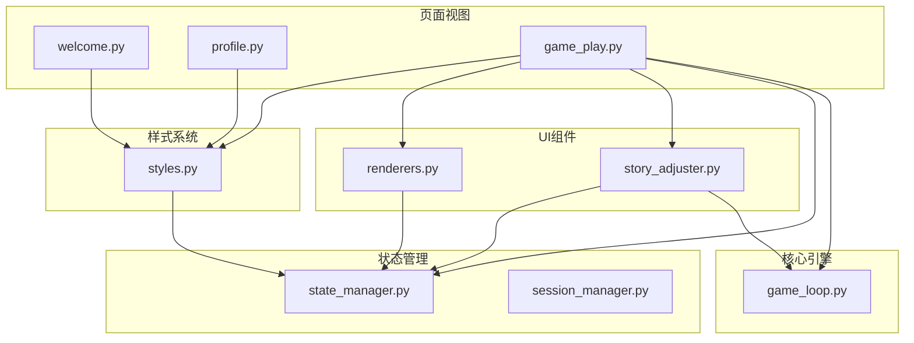
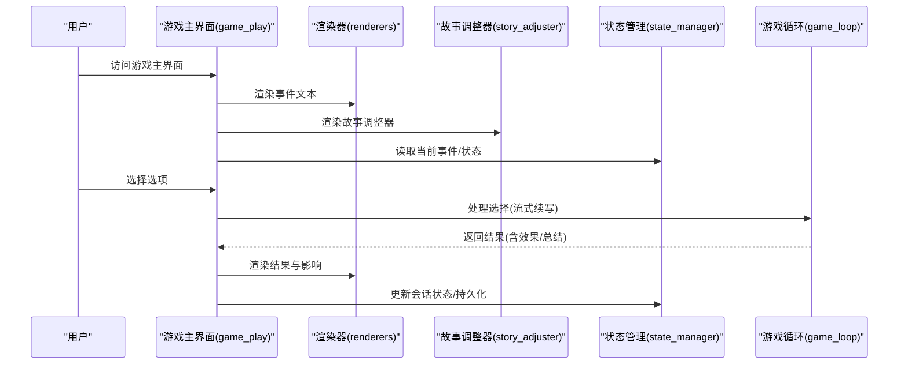
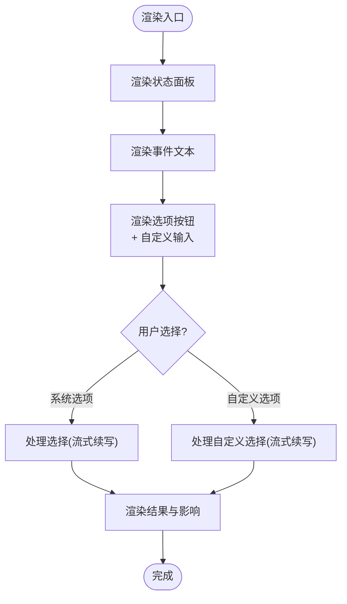
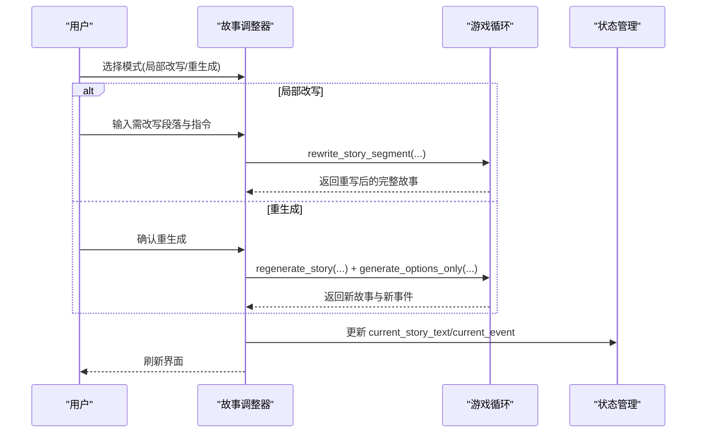
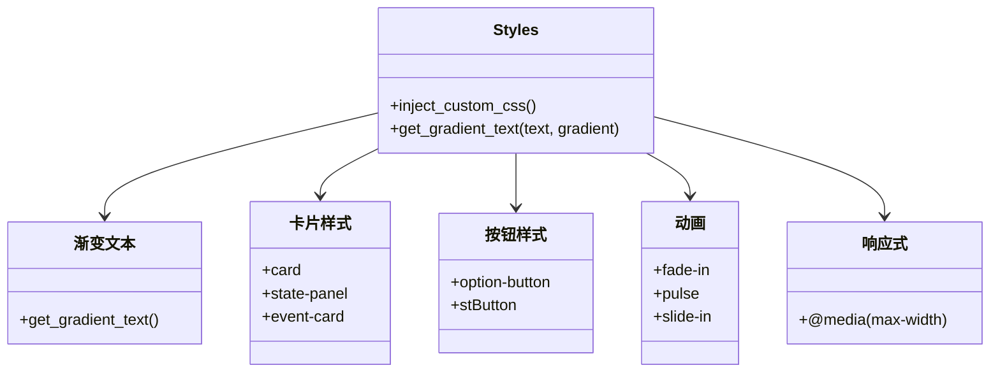
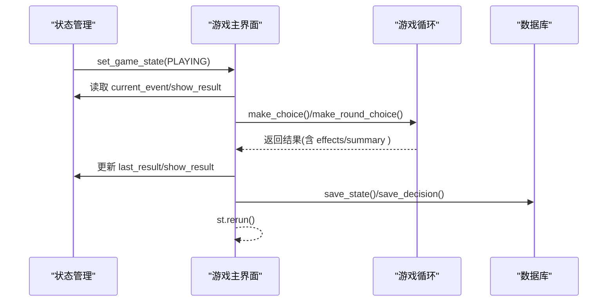
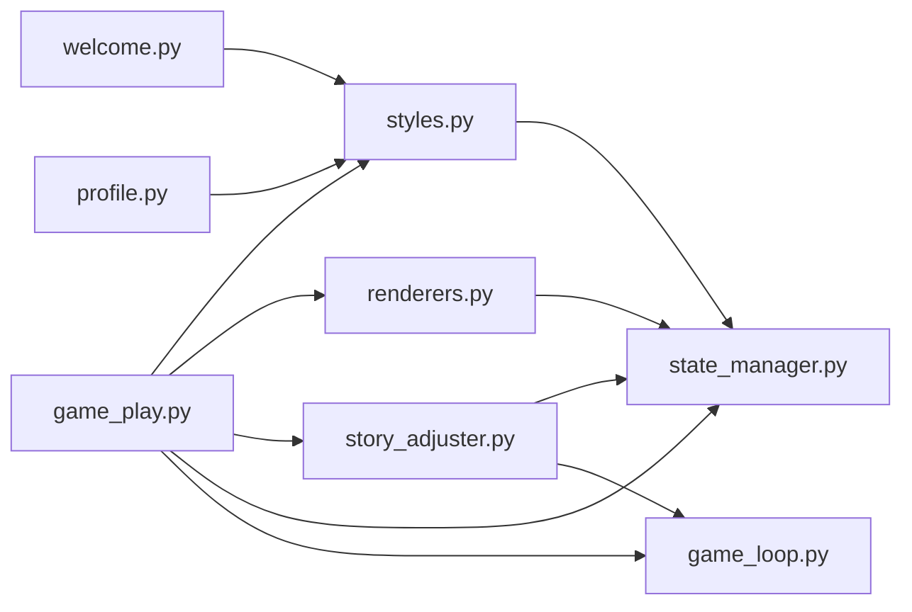

# UI组件架构

<cite>
**本文档引用的文件**
- [src/ui/components/renderers.py](file://src/ui/components/renderers.py)
- [src/ui/components/story_adjuster.py](file://src/ui/components/story_adjuster.py)
- [src/ui/styles.py](file://src/ui/styles.py)
- [src/ui/streamlit_app.py](file://src/ui/streamlit_app.py)
- [src/ui/state_manager.py](file://src/ui/state_manager.py)
- [src/ui/session_manager.py](file://src/ui/session_manager.py)
- [src/ui/page_views/game_play.py](file://src/ui/page_views/game_play.py)
- [src/ui/page_views/welcome.py](file://src/ui/page_views/welcome.py)
- [src/ui/page_views/profile.py](file://src/ui/page_views/profile.py)
- [src/game/game_loop.py](file://src/game/game_loop.py)
</cite>

## 目录
1. [简介](#简介)
2. [项目结构](#项目结构)
3. [核心组件](#核心组件)
4. [架构总览](#架构总览)
5. [详细组件分析](#详细组件分析)
6. [依赖关系分析](#依赖关系分析)
7. [性能考虑](#性能考虑)
8. [故障排查指南](#故障排查指南)
9. [结论](#结论)
10. [附录](#附录)

## 简介
本文件系统性梳理了UI组件架构，重点覆盖：
- 渲染器组件(renderers)的通用渲染逻辑（文本渲染、卡片组件、按钮组件、表单元素）
- 故事调整器组件(story_adjuster)的动态内容处理机制（故事片段渲染、选项生成、交互响应）
- 自定义CSS样式系统（主题定制、响应式布局、组件样式隔离）
- 组件间通信机制、事件传递与状态同步
- 组件架构图、复用模式示例与最佳实践

## 项目结构
UI层采用分层与模块化组织：
- 页面视图(page_views)：负责路由与页面级布局
- 组件(components)：提供可复用的渲染器与工具组件
- 样式(styles)：注入全局样式与主题
- 状态管理(state_manager/session_manager)：统一会话状态与持久化
- 核心游戏循环(game_loop)：驱动事件生成与决策处理

图表来源
- [src/ui/page_views/welcome.py](file://src/ui/page_views/welcome.py#L1-L285)
- [src/ui/page_views/profile.py](file://src/ui/page_views/profile.py#L1-L184)
- [src/ui/page_views/game_play.py](file://src/ui/page_views/game_play.py#L1-L662)
- [src/ui/components/renderers.py](file://src/ui/components/renderers.py#L1-L385)
- [src/ui/components/story_adjuster.py](file://src/ui/components/story_adjuster.py#L1-L160)
- [src/ui/styles.py](file://src/ui/styles.py#L1-L710)
- [src/ui/state_manager.py](file://src/ui/state_manager.py#L1-L773)
- [src/ui/session_manager.py](file://src/ui/session_manager.py#L1-L65)
- [src/game/game_loop.py](file://src/game/game_loop.py#L1-L800)

章节来源
- [src/ui/streamlit_app.py](file://src/ui/streamlit_app.py#L1-L215)

## 核心组件
- 渲染器组件(renderers)：封装事件文本渲染、选项按钮、结果展示、调试控制台、上下文聊天等通用UI逻辑
- 故事调整器(story_adjuster)：提供局部改写与整段重生成能力，连接AI生成器与当前事件
- 样式系统(styles)：注入深色主题、渐变文字、动画、响应式布局与组件样式隔离
- 状态管理(state_manager/session_manager)：集中式会话状态、游戏状态机、持久化与恢复
- 页面视图(page_views)：欢迎页、个人中心、游戏主界面等页面级渲染与路由

章节来源
- [src/ui/components/renderers.py](file://src/ui/components/renderers.py#L1-L385)
- [src/ui/components/story_adjuster.py](file://src/ui/components/story_adjuster.py#L1-L160)
- [src/ui/styles.py](file://src/ui/styles.py#L1-L710)
- [src/ui/state_manager.py](file://src/ui/state_manager.py#L1-L773)
- [src/ui/session_manager.py](file://src/ui/session_manager.py#L1-L65)
- [src/ui/page_views/game_play.py](file://src/ui/page_views/game_play.py#L1-L662)

## 架构总览
UI采用“页面视图 + 组件 + 样式 + 状态管理 + 核心引擎”的分层架构：
- 页面视图负责路由与布局，调用渲染器与故事调整器
- 渲染器与故事调整器通过状态管理器访问全局状态与游戏循环
- 样式系统统一注入主题与组件样式
- 核心游戏循环负责事件生成、决策处理与状态推进

图表来源
- [src/ui/page_views/game_play.py](file://src/ui/page_views/game_play.py#L1-L662)
- [src/ui/components/renderers.py](file://src/ui/components/renderers.py#L1-L385)
- [src/ui/components/story_adjuster.py](file://src/ui/components/story_adjuster.py#L1-L160)
- [src/ui/state_manager.py](file://src/ui/state_manager.py#L1-L773)
- [src/game/game_loop.py](file://src/game/game_loop.py#L1-L800)

## 详细组件分析

### 渲染器组件(renderers)通用渲染逻辑
- 状态面板渲染：根据语言与角色设置渲染年龄、周数、精力、情绪、学识、财富与关系
- 事件渲染：返回事件选项列表，供选项渲染函数使用
- 选项渲染：渲染系统生成的选项按钮与自定义输入框，支持禁用态与自定义提交
- 结果渲染：渲染决策结果文本与影响描述，按属性维度构建人类可读描述
- 调试控制台：侧边栏展开调试日志，支持清空
- 上下文聊天：底部展开聊天区，支持用户提问、AI回复与清空

图表来源
- [src/ui/components/renderers.py](file://src/ui/components/renderers.py#L22-L144)
- [src/ui/components/renderers.py](file://src/ui/components/renderers.py#L146-L275)
- [src/ui/components/renderers.py](file://src/ui/components/renderers.py#L277-L385)

章节来源
- [src/ui/components/renderers.py](file://src/ui/components/renderers.py#L1-L385)

### 故事调整器(story_adjuster)动态内容处理机制
- 模式选择：局部改写与整段重生成两种模式
- 局部改写：粘贴段落、输入改写指令，调用AI生成替换后的完整故事，并更新当前事件
- 重生成：基于当前状态与最近轮次总结，重新生成整段故事并生成新选项
- 错误处理：捕获异常并记录调试日志，向用户反馈失败原因

图表来源
- [src/ui/components/story_adjuster.py](file://src/ui/components/story_adjuster.py#L10-L160)
- [src/ui/state_manager.py](file://src/ui/state_manager.py#L247-L300)
- [src/game/game_loop.py](file://src/game/game_loop.py#L1-L800)

章节来源
- [src/ui/components/story_adjuster.py](file://src/ui/components/story_adjuster.py#L1-L160)

### 自定义CSS样式系统
- 主题定制：深色背景、渐变文字、卡片与按钮统一风格
- 响应式布局：针对移动端的滚动条与间距优化
- 组件样式隔离：通过类名限定作用域，避免全局污染
- 动画效果：淡入、脉冲、滑入等动画提升交互体验

图表来源
- [src/ui/styles.py](file://src/ui/styles.py#L5-L710)

章节来源
- [src/ui/styles.py](file://src/ui/styles.py#L1-L710)

### 组件间通信机制、事件传递与状态同步
- 会话状态集中管理：通过状态管理器统一读写st.session_state，确保单一真相源
- 游戏状态机：枚举GameState驱动页面切换，配合持久化URL参数与localStorage恢复
- 事件与结果同步：渲染器读取current_event与last_result，处理完成后写回并持久化
- 选择处理链路：页面视图触发选择，游戏循环处理并返回结果，渲染器再渲染

图表来源
- [src/ui/state_manager.py](file://src/ui/state_manager.py#L215-L244)
- [src/ui/page_views/game_play.py](file://src/ui/page_views/game_play.py#L468-L550)
- [src/game/game_loop.py](file://src/game/game_loop.py#L258-L300)

章节来源
- [src/ui/state_manager.py](file://src/ui/state_manager.py#L1-L773)
- [src/ui/page_views/game_play.py](file://src/ui/page_views/game_play.py#L1-L662)

## 依赖关系分析
- 页面视图依赖渲染器与故事调整器，同时依赖状态管理器与游戏循环
- 渲染器依赖状态管理器与样式工具，间接依赖游戏循环提供的数据
- 故事调整器依赖状态管理器与游戏循环的AI生成接口
- 样式系统独立注入，被所有页面与组件共享
- 状态管理器作为中央枢纽，被所有模块依赖

图表来源
- [src/ui/page_views/welcome.py](file://src/ui/page_views/welcome.py#L1-L285)
- [src/ui/page_views/profile.py](file://src/ui/page_views/profile.py#L1-L184)
- [src/ui/page_views/game_play.py](file://src/ui/page_views/game_play.py#L1-L662)
- [src/ui/components/renderers.py](file://src/ui/components/renderers.py#L1-L385)
- [src/ui/components/story_adjuster.py](file://src/ui/components/story_adjuster.py#L1-L160)
- [src/ui/styles.py](file://src/ui/styles.py#L1-L710)
- [src/ui/state_manager.py](file://src/ui/state_manager.py#L1-L773)
- [src/game/game_loop.py](file://src/game/game_loop.py#L1-L800)

章节来源
- [src/ui/streamlit_app.py](file://src/ui/streamlit_app.py#L1-L215)

## 性能考虑
- 流式渲染：事件与结果采用流式回调逐步展示，减少一次性渲染压力
- 处理锁：processing标志位防止重复生成与中断恢复导致的状态错乱
- 缓存与持久化：事件文本与状态即时保存，避免长时间中断导致的重复生成
- 动画与样式：合理使用CSS动画与渐变，避免过度复杂动画影响性能

## 故障排查指南
- 事件生成失败：检查OPENAI_API_KEY配置；查看调试日志与错误信息
- 选择处理卡住：确认processing标志位被正确清理；必要时手动重置
- 会话恢复异常：检查URL参数与localStorage中的game_id/game_state；验证用户权限
- 样式异常：确认inject_custom_css在应用启动时被调用；检查类名冲突

章节来源
- [src/ui/page_views/game_play.py](file://src/ui/page_views/game_play.py#L369-L381)
- [src/ui/state_manager.py](file://src/ui/state_manager.py#L662-L773)
- [src/ui/components/renderers.py](file://src/ui/components/renderers.py#L277-L290)

## 结论
该UI组件架构通过“页面视图 + 组件 + 样式 + 状态管理 + 核心引擎”的分层设计，实现了高内聚、低耦合的可复用UI体系。渲染器与故事调整器提供了标准化的交互与内容处理能力，样式系统保障了主题一致性与响应式体验，状态管理器确保了跨组件的数据一致性与可恢复性。建议在后续迭代中进一步抽象公共UI模式，增强单元测试覆盖率，并持续优化流式渲染与错误处理策略。

## 附录
- 复用模式示例
  - 渲染器：事件文本、选项按钮、结果展示、调试控制台、上下文聊天
  - 故事调整器：局部改写、整段重生成、错误处理与日志记录
  - 样式：渐变文字、卡片与按钮样式、动画与响应式布局
- 最佳实践
  - 使用状态管理器统一读写会话状态
  - 在处理过程中设置processing标志位，防止重复操作
  - 采用流式回调逐步渲染长文本，提升用户体验
  - 为每个页面/组件提供最小化的依赖集合，避免循环依赖