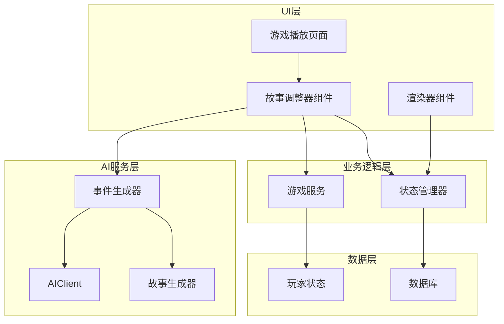
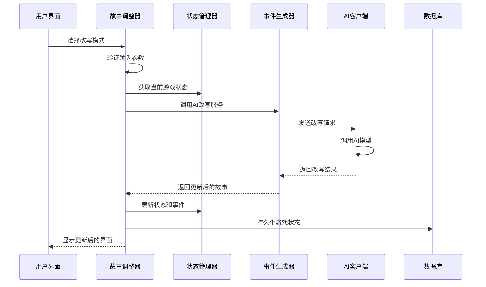
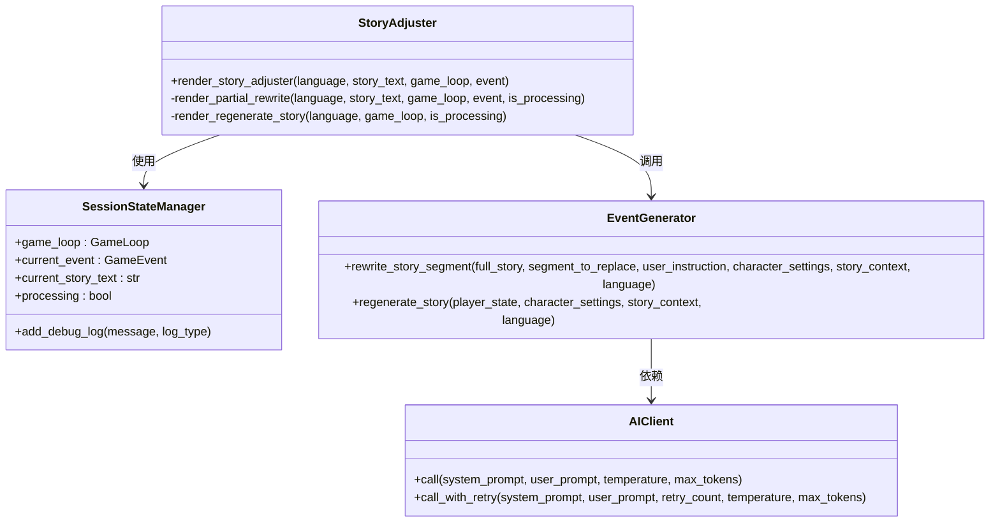
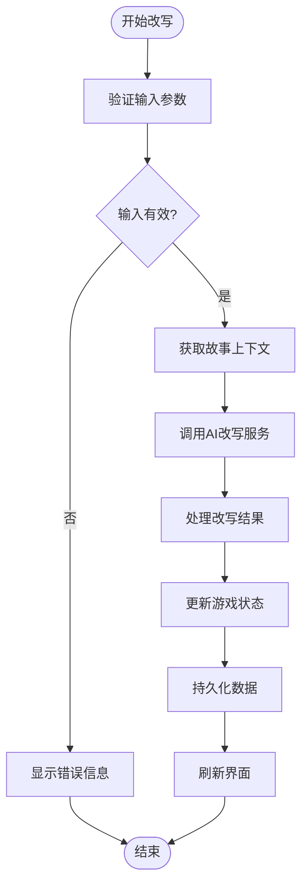
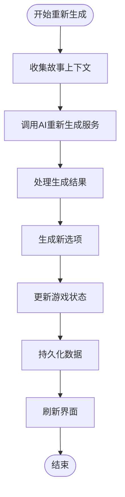
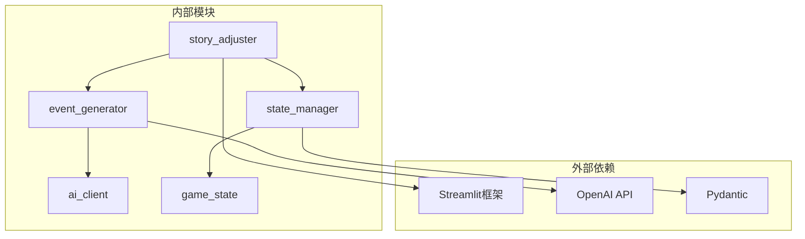

# 故事调整器组件

<cite>
**本文档引用的文件**
- [story_adjuster.py](file://src/ui/components/story_adjuster.py)
- [renderers.py](file://src/ui/components/renderers.py)
- [game_play.py](file://src/ui/page_views/game_play.py)
- [state_manager.py](file://src/ui/state_manager.py)
- [generator.py](file://src/ai/generator.py)
- [client.py](file://src/ai/client.py)
- [story_generator.py](file://src/ai/story_generator.py)
- [story_service.py](file://src/game/story_service.py)
- [state.py](file://src/game/state.py)
- [settings.py](file://config/settings.py)
</cite>

## 目录
1. [简介](#简介)
2. [项目结构](#项目结构)
3. [核心组件](#核心组件)
4. [架构概览](#架构概览)
5. [详细组件分析](#详细组件分析)
6. [依赖关系分析](#依赖关系分析)
7. [性能考虑](#性能考虑)
8. [故障排除指南](#故障排除指南)
9. [结论](#结论)

## 简介

故事调整器组件是人生模拟游戏中的关键交互组件，为用户提供动态故事内容的改写和重新生成能力。该组件实现了"人生调整器"功能，允许玩家对当前故事进行局部改写或整篇重新生成，同时保持游戏状态的一致性和完整性。

该组件采用Streamlit框架构建，集成了AI驱动的故事生成服务，提供了流畅的用户体验和强大的内容编辑功能。通过智能的状态管理和错误处理机制，确保用户能够在各种情况下安全地修改故事内容。

## 项目结构

故事调整器组件位于UI层的组件模块中，与游戏核心逻辑、AI服务层和状态管理系统紧密集成：

**图表来源**
- [story_adjuster.py](file://src/ui/components/story_adjuster.py#L1-L160)
- [state_manager.py](file://src/ui/state_manager.py#L1-L773)
- [generator.py](file://src/ai/generator.py#L1-L463)

**章节来源**
- [story_adjuster.py](file://src/ui/components/story_adjuster.py#L1-L160)
- [state_manager.py](file://src/ui/state_manager.py#L1-L773)

## 核心组件

故事调整器组件包含两个主要功能模块：

### 1. 局部改写模式
- **功能**：允许用户选择特定段落进行改写
- **输入**：用户粘贴需要改写的段落和改写指令
- **输出**：更新后的完整故事文本
- **适用场景**：微调特定情节或修复不理想的内容

### 2. 整篇重新生成模式
- **功能**：完全重新生成当前轮次的故事
- **输入**：保留用户之前的设定和选择
- **输出**：全新的故事内容和选项
- **适用场景**：当整体故事方向不符合预期时

**章节来源**
- [story_adjuster.py](file://src/ui/components/story_adjuster.py#L10-L160)

## 架构概览

故事调整器组件采用分层架构设计，确保各层职责清晰分离：

**图表来源**
- [story_adjuster.py](file://src/ui/components/story_adjuster.py#L70-L101)
- [state_manager.py](file://src/ui/state_manager.py#L245-L300)
- [generator.py](file://src/ai/generator.py#L401-L441)

## 详细组件分析

### 组件类图

**图表来源**
- [story_adjuster.py](file://src/ui/components/story_adjuster.py#L10-L160)
- [state_manager.py](file://src/ui/state_manager.py#L42-L547)
- [generator.py](file://src/ai/generator.py#L401-L441)

### 局部改写流程

**图表来源**
- [story_adjuster.py](file://src/ui/components/story_adjuster.py#L70-L101)
- [state_manager.py](file://src/ui/state_manager.py#L292-L300)

### 整篇重新生流程

**图表来源**
- [story_adjuster.py](file://src/ui/components/story_adjuster.py#L122-L155)
- [generator.py](file://src/ai/generator.py#L422-L441)

### 用户交互处理机制

故事调整器组件实现了完善的用户交互处理机制：

#### 输入验证
- **段落验证**：确保用户粘贴的改写段落非空
- **指令验证**：验证改写指令的合理性和可执行性
- **状态检查**：防止并发操作和重复提交

#### 事件绑定
- **按钮禁用**：在处理过程中自动禁用相关按钮
- **状态同步**：实时同步处理状态到UI
- **错误处理**：捕获并显示详细的错误信息

#### 状态管理
- **会话状态**：使用Streamlit会话状态管理组件状态
- **全局状态**：通过状态管理器维护跨组件状态
- **持久化**：自动保存游戏状态以防止数据丢失

**章节来源**
- [story_adjuster.py](file://src/ui/components/story_adjuster.py#L41-L160)
- [state_manager.py](file://src/ui/state_manager.py#L176-L332)

### 文本格式化和视觉效果

组件实现了丰富的文本格式化和视觉效果：

#### 动态内容渲染
- **渐进式显示**：支持故事内容的渐进式渲染
- **加载指示器**：提供明确的处理状态反馈
- **响应式布局**：适配不同屏幕尺寸

#### 用户体验优化
- **语言切换**：支持中英文双语界面
- **图标标识**：使用直观的图标增强可读性
- **提示信息**：提供详细的使用指导

**章节来源**
- [renderers.py](file://src/ui/components/renderers.py#L1-L385)

## 依赖关系分析

故事调整器组件的依赖关系体现了清晰的分层架构：

**图表来源**
- [story_adjuster.py](file://src/ui/components/story_adjuster.py#L1-L8)
- [generator.py](file://src/ai/generator.py#L1-L27)
- [state_manager.py](file://src/ui/state_manager.py#L1-L27)

### 直接依赖

- **Streamlit**：用于构建用户界面和状态管理
- **状态管理器**：提供统一的状态访问接口
- **事件生成器**：封装AI服务调用逻辑
- **AI客户端**：抽象底层AI服务调用

### 间接依赖

- **游戏状态**：通过状态管理器访问玩家状态
- **配置设置**：读取应用配置参数
- **日志系统**：记录调试信息和错误日志

**章节来源**
- [story_adjuster.py](file://src/ui/components/story_adjuster.py#L1-L8)
- [generator.py](file://src/ai/generator.py#L1-L27)

## 性能考虑

### 内存优化策略

1. **状态最小化**：只在必要时存储完整故事文本
2. **增量更新**：避免不必要的UI重绘
3. **缓存机制**：利用事件缓存减少重复计算
4. **资源清理**：及时释放临时数据和回调函数

### 处理效率优化

1. **异步处理**：AI调用采用异步模式避免阻塞
2. **流式渲染**：支持渐进式故事显示
3. **错误恢复**：实现自动重试和降级策略
4. **连接池**：复用AI服务连接提高效率

### 内存使用监控

组件实现了内存使用监控机制：
- **日志记录**：跟踪内存使用峰值
- **状态清理**：定期清理过期状态数据
- **异常处理**：捕获内存不足异常并优雅降级

**章节来源**
- [story_adjuster.py](file://src/ui/components/story_adjuster.py#L70-L101)
- [state_manager.py](file://src/ui/state_manager.py#L488-L509)

## 故障排除指南

### 常见问题及解决方案

#### AI服务调用失败
- **症状**：改写或重新生成操作超时
- **原因**：网络连接问题或AI服务不可用
- **解决**：检查API密钥配置和网络连接

#### 状态同步问题
- **症状**：界面状态与实际状态不一致
- **原因**：并发操作导致的状态冲突
- **解决**：使用状态管理器的原子操作

#### 内存泄漏
- **症状**：长时间使用后内存占用持续增长
- **原因**：未正确清理回调函数和临时数据
- **解决**：确保在finally块中清理资源

### 调试方法

#### 日志记录
- **调试日志**：记录详细的操作步骤和状态变化
- **性能日志**：监控AI调用时间和内存使用
- **错误日志**：捕获和记录异常信息

#### 状态检查
- **会话状态**：检查Streamlit会话状态的完整性
- **全局状态**：验证状态管理器的数据一致性
- **数据库状态**：确认持久化数据的正确性

**章节来源**
- [story_adjuster.py](file://src/ui/components/story_adjuster.py#L98-L101)
- [state_manager.py](file://src/ui/state_manager.py#L495-L509)

## 结论

故事调整器组件作为人生模拟游戏的核心交互组件，成功实现了以下目标：

### 技术成就
- **模块化设计**：清晰的分层架构和职责分离
- **用户体验**：流畅的交互流程和直观的界面设计
- **可靠性**：完善的错误处理和状态管理机制
- **可扩展性**：灵活的配置选项和插件接口

### 功能特性
- **智能改写**：基于AI的高质量故事改写能力
- **状态同步**：确保游戏状态的一致性和完整性
- **性能优化**：高效的内存管理和处理机制
- **调试支持**：全面的日志记录和错误诊断功能

### 应用价值
该组件为玩家提供了强大的故事编辑能力，增强了游戏的沉浸感和可玩性。通过智能的AI集成和优雅的用户界面设计，实现了技术与艺术的完美结合。

未来可以进一步优化的方向包括：增强AI改写算法的准确性、扩展更多的改写模板、提供更丰富的视觉效果选项等。