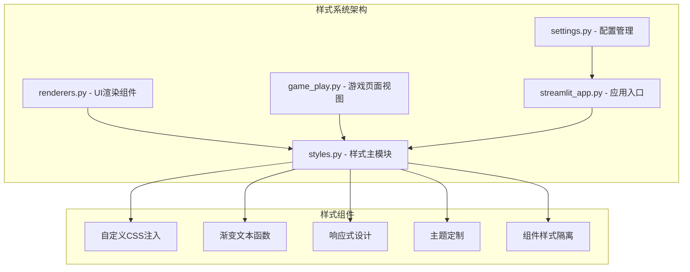
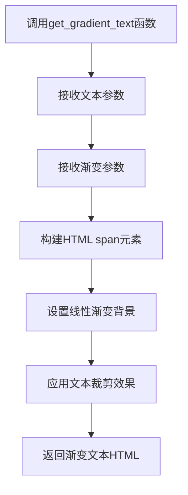
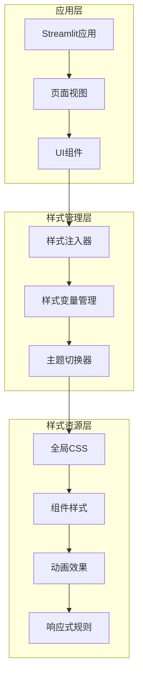
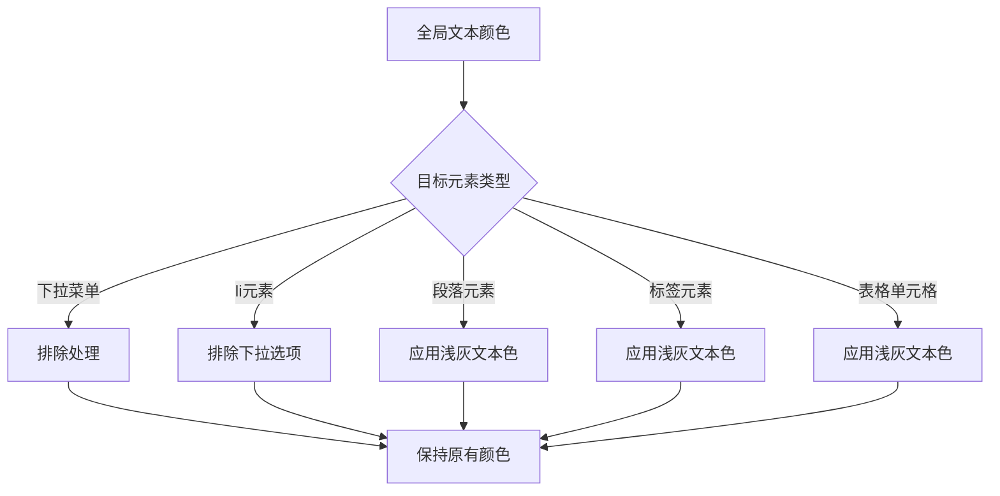
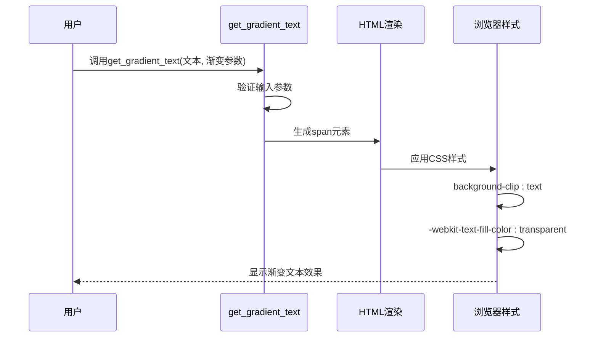
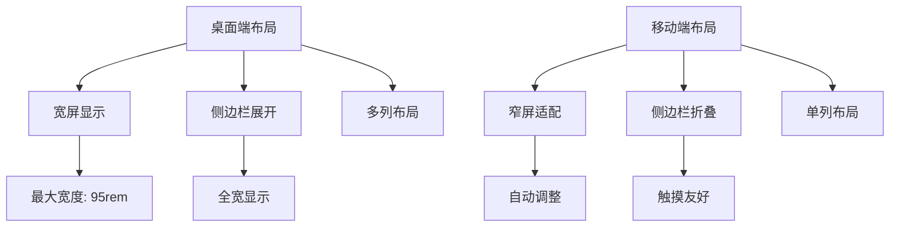
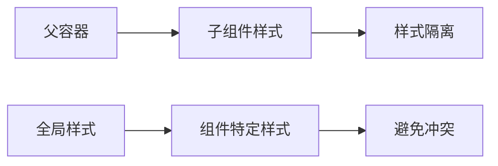
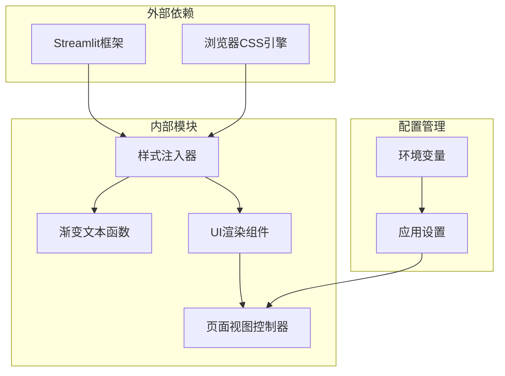

# 样式系统

<cite>
**本文档引用的文件**
- [styles.py](file://src/ui/styles.py)
- [renderers.py](file://src/ui/components/renderers.py)
- [game_play.py](file://src/ui/page_views/game_play.py)
- [streamlit_app.py](file://src/ui/streamlit_app.py)
- [settings.py](file://config/settings.py)
</cite>

## 目录
1. [简介](#简介)
2. [项目结构](#项目结构)
3. [核心组件](#核心组件)
4. [架构概览](#架构概览)
5. [详细组件分析](#详细组件分析)
6. [依赖关系分析](#依赖关系分析)
7. [性能考虑](#性能考虑)
8. [故障排除指南](#故障排除指南)
9. [结论](#结论)

## 简介

本项目采用基于Streamlit的Web界面，实现了完整的样式系统。该样式系统包含自定义CSS注入、渐变文本效果、响应式布局、组件样式隔离和主题定制机制。系统通过统一的样式管理模块，为整个游戏UI提供了视觉一致性和良好的用户体验。

## 项目结构

样式系统主要分布在以下文件中：

**图表来源**
- [styles.py](file://src/ui/styles.py#L1-L710)
- [renderers.py](file://src/ui/components/renderers.py#L1-L385)
- [game_play.py](file://src/ui/page_views/game_play.py#L1-L662)
- [streamlit_app.py](file://src/ui/streamlit_app.py#L1-L215)

**章节来源**
- [styles.py](file://src/ui/styles.py#L1-L710)
- [streamlit_app.py](file://src/ui/streamlit_app.py#L139-L144)

## 核心组件

### 样式注入系统

样式系统的核心是`inject_custom_css()`函数，负责注入全局CSS样式到Streamlit应用中。该函数包含以下关键特性：

- **深色主题背景**：使用渐变背景色营造沉浸式体验
- **全局文本颜色管理**：确保深色主题下的文本可读性
- **组件样式统一**：为各种Streamlit组件提供一致的视觉风格

### 渐变文本系统

`get_gradient_text()`函数实现了渐变文本效果，支持自定义渐变参数：

**图表来源**
- [styles.py](file://src/ui/styles.py#L707-L710)

**章节来源**
- [styles.py](file://src/ui/styles.py#L5-L710)

## 架构概览

样式系统的整体架构采用分层设计：

**图表来源**
- [streamlit_app.py](file://src/ui/streamlit_app.py#L139-L144)
- [styles.py](file://src/ui/styles.py#L5-L710)

## 详细组件分析

### 样式注入器分析

样式注入器负责将自定义CSS注入到Streamlit应用中，包含以下功能模块：

#### 全局样式管理
- **头部隐藏**：隐藏默认的Streamlit头部元素
- **空白元素清理**：移除可能产生视觉空白的元素
- **背景设计**：使用径向渐变创造星空般的背景效果

#### 文本颜色管理系统
系统实现了智能的文本颜色分配策略：

**图表来源**
- [styles.py](file://src/ui/styles.py#L43-L59)

#### 组件样式定制

系统为各种Streamlit组件提供了专门的样式定制：

| 组件类型 | 样式特点 | 颜色方案 |
|---------|----------|----------|
| 按钮 | 渐变背景、圆角设计、阴影效果 | 紫色渐变主题 |
| 输入框 | 半透明背景、边框聚焦效果 | 深色主题配色 |
| 下拉菜单 | 双主题支持（深色/浅色） | 侧边栏深色，主区域浅色 |
| 进度条 | 渐变填充效果 | 蓝紫色渐变 |

**章节来源**
- [styles.py](file://src/ui/styles.py#L135-L285)

### 渐变文本实现分析

渐变文本功能通过CSS的`background-clip`属性实现：

**图表来源**
- [styles.py](file://src/ui/styles.py#L707-L710)
- [renderers.py](file://src/ui/components/renderers.py#L94-L96)

#### 渐变文本视觉效果

渐变文本效果的关键在于CSS属性组合：
- `background: linear-gradient(...)` - 定义渐变色彩
- `-webkit-background-clip: text` - 将背景裁剪为文本形状
- `-webkit-text-fill-color: transparent` - 使文本变为透明以显示背景渐变

**章节来源**
- [styles.py](file://src/ui/styles.py#L684-L691)
- [renderers.py](file://src/ui/components/renderers.py#L94-L153)

### 响应式布局设计

系统实现了基础的响应式布局支持：

**图表来源**
- [styles.py](file://src/ui/styles.py#L693-L702)

#### 响应式断点实现

系统在768px断点处提供移动端优化：
- 减少内边距以适应小屏幕
- 优化触摸交互尺寸
- 调整布局密度

**章节来源**
- [styles.py](file://src/ui/styles.py#L693-L702)

### 组件样式隔离

系统通过多种方式实现组件间的样式隔离：

#### 类名系统
- `.card` - 卡片组件样式
- `.option-button` - 选项按钮样式  
- `.result-box` - 结果展示样式
- `.state-panel` - 状态面板样式

#### 作用域限定
每个组件样式都限定在特定的DOM结构内，避免样式污染：

**图表来源**
- [styles.py](file://src/ui/styles.py#L583-L627)

**章节来源**
- [styles.py](file://src/ui/styles.py#L583-L627)

### 主题切换机制

系统支持深色主题的完整实现：

#### 主题色彩体系

| 组件 | 主要颜色 | 辅助颜色 | 状态色 |
|------|----------|----------|--------|
| 背景 | #0e1117 | 径向渐变 | 渐变背景 |
| 文本 | #e2e8f0 | #f0f0f0 | #a0aec0 |
| 强调 | #667eea | #764ba2 | 渐变主题色 |
| 边框 | rgba(102, 126, 234, 0.3) | rgba(45, 55, 72, 0.9) | 半透明边框 |

#### 主题一致性保证

系统通过以下机制确保主题一致性：
- 统一的颜色变量定义
- 组件样式的继承关系
- 状态变化的视觉反馈

**章节来源**
- [styles.py](file://src/ui/styles.py#L25-L40)
- [styles.py](file://src/ui/styles.py#L42-L59)

## 依赖关系分析

样式系统的依赖关系呈现清晰的层次结构：

**图表来源**
- [streamlit_app.py](file://src/ui/streamlit_app.py#L1-L215)
- [styles.py](file://src/ui/styles.py#L1-L710)

### 样式变量管理

系统通过集中管理的方式维护样式变量：

#### 颜色系统
- **主色调**：#667eea 到 #764ba2 的紫色渐变
- **辅助色**：#e2e8f0 (浅灰)、#f0f0f0 (中灰)、#a0aec0 (浅蓝灰)
- **背景色**：#0e1117 (深蓝黑)，配合径向渐变
- **强调色**：#fbbf24 (橙色)，用于重要信息提示

#### 字体配置
系统采用系统默认字体，确保跨平台兼容性：
- 主要字体：系统默认字体族
- 字体权重：300-700范围内的粗细变化
- 字体大小：1rem基线，按需缩放

**章节来源**
- [styles.py](file://src/ui/styles.py#L62-L78)
- [styles.py](file://src/ui/styles.py#L42-L59)

## 性能考虑

### 样式加载优化

系统采用一次性注入的方式优化性能：
- 避免重复的样式计算
- 减少DOM操作次数
- 利用CSS缓存机制

### 渲染性能

渐变文本的实现考虑了渲染性能：
- 使用硬件加速的CSS属性
- 避免复杂的JavaScript计算
- 最小化DOM节点数量

### 内存管理

系统通过以下方式管理内存使用：
- 样式注入只执行一次
- 组件样式复用机制
- 避免不必要的样式重计算

## 故障排除指南

### 常见样式问题

#### 文本颜色不正确
**症状**：某些文本显示为深色背景上的深色文字
**解决方案**：
1. 检查选择器优先级
2. 确认`:not()`选择器的排除逻辑
3. 验证下拉菜单的特殊处理

#### 渐变文本失效
**症状**：文本显示为普通黑色而非渐变色
**解决方案**：
1. 确认浏览器对`-webkit-background-clip`的支持
2. 检查`-webkit-text-fill-color`属性
3. 验证字体权重设置

#### 响应式布局异常
**症状**：移动端显示效果不佳
**解决方案**：
1. 检查媒体查询断点设置
2. 验证容器宽度限制
3. 确认触摸交互尺寸

**章节来源**
- [styles.py](file://src/ui/styles.py#L43-L59)
- [styles.py](file://src/ui/styles.py#L684-L691)

## 结论

本样式系统通过精心设计的架构实现了以下目标：

1. **视觉一致性**：统一的色彩体系和布局规范
2. **用户体验**：流畅的动画效果和响应式设计
3. **可维护性**：模块化的样式管理和清晰的代码结构
4. **性能优化**：高效的样式加载和渲染机制

系统的核心优势在于其深度集成的渐变文本效果、完善的响应式支持和灵活的主题定制能力。通过合理的依赖管理和性能优化，为用户提供了一个既美观又实用的交互界面。

未来可以考虑的功能扩展包括：
- 更丰富的主题选项
- 动态样式变量系统
- 更精细的响应式断点
- 样式组件的模块化重构