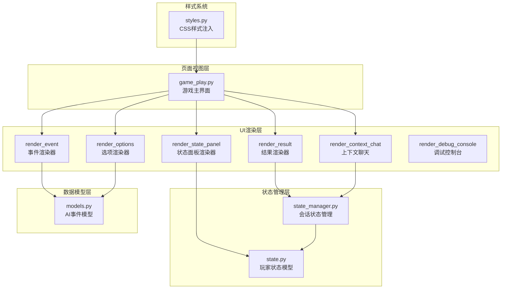
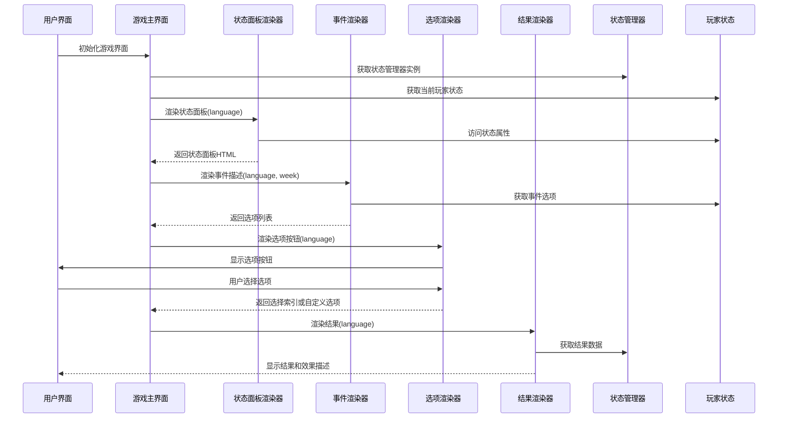
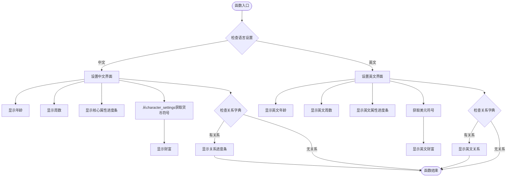
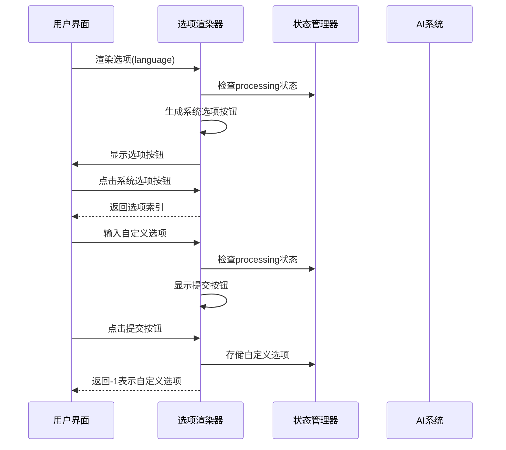
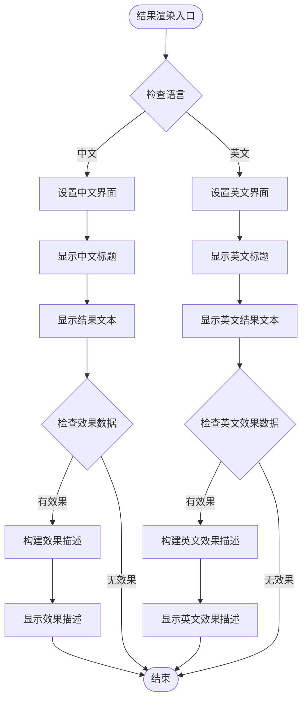
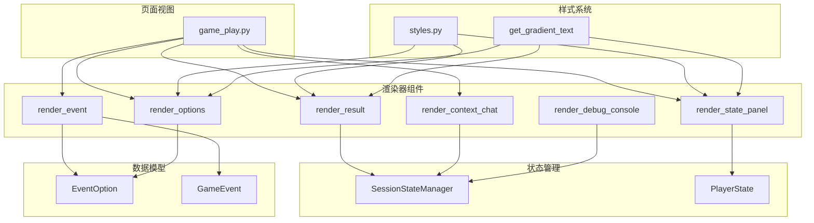

# 渲染器组件

<cite>
**本文档引用的文件**
- [renderers.py](file://src/ui/components/renderers.py)
- [game_play.py](file://src/ui/page_views/game_play.py)
- [state_manager.py](file://src/ui/state_manager.py)
- [state.py](file://src/game/state.py)
- [models.py](file://src/ai/models.py)
- [styles.py](file://src/ui/styles.py)
- [streamlit_app.py](file://src/ui/streamlit_app.py)
- [cli.py](file://src/ui/cli.py)
</cite>

## 目录
1. [简介](#简介)
2. [项目结构](#项目结构)
3. [核心组件](#核心组件)
4. [架构概览](#架构概览)
5. [详细组件分析](#详细组件分析)
6. [依赖关系分析](#依赖关系分析)
7. [性能考虑](#性能考虑)
8. [故障排除指南](#故障排除指南)
9. [结论](#结论)

## 简介
本文档深入解析了游戏UI渲染器组件的设计模式和实现机制，重点涵盖四个核心渲染器：状态面板渲染器(render_state_panel)、事件渲染器(render_event)、选项渲染器(render_options)和结果渲染器(render_result)。这些组件构成了游戏界面的核心渲染层，负责将游戏状态、事件描述、选项和结果以用户友好的方式呈现，并支持多语言国际化。

渲染器组件采用模块化设计，通过Streamlit框架实现响应式UI，结合状态管理器提供统一的状态访问接口。每个渲染器都实现了特定的功能职责，同时通过标准化的参数传递和返回值确保组件间的松耦合集成。

## 项目结构
渲染器组件位于UI子系统的components目录中，与页面视图、状态管理和样式系统协同工作：

**图表来源**
- [renderers.py](file://src/ui/components/renderers.py#L1-L385)
- [game_play.py](file://src/ui/page_views/game_play.py#L1-L662)
- [state_manager.py](file://src/ui/state_manager.py#L1-L773)
- [state.py](file://src/game/state.py#L244-L709)
- [models.py](file://src/ai/models.py#L7-L26)
- [styles.py](file://src/ui/styles.py#L1-L710)

**章节来源**
- [renderers.py](file://src/ui/components/renderers.py#L1-L385)
- [game_play.py](file://src/ui/page_views/game_play.py#L1-L662)

## 核心组件
渲染器组件系统包含六个主要渲染器，每个都有明确的职责分工：

### 状态面板渲染器(render_state_panel)
负责渲染左侧边栏的状态面板，显示玩家的核心属性和关系状态。支持中英文双语切换，动态货币符号识别，以及进度条可视化展示。

### 事件渲染器(render_event)
处理事件描述的渲染和选项提取，作为事件系统与UI层的桥梁，确保事件数据正确传递到选项渲染器。

### 选项渲染器(render_options)
实现选项按钮的渲染和用户交互处理，支持系统生成选项和自定义选项输入，提供完整的决策界面。

### 结果渲染器(render_result)
展示决策结果和效果描述，构建人性化的影响说明，提升用户体验和反馈质量。

### 上下文聊天渲染器(render_context_chat)
提供剧情助手功能，允许用户与AI助手对话获取游戏相关信息。

### 调试控制台渲染器(render_debug_console)
在调试模式下提供开发工具，显示和管理调试日志。

**章节来源**
- [renderers.py](file://src/ui/components/renderers.py#L22-L385)

## 架构概览
渲染器组件采用分层架构设计，通过清晰的职责分离实现高内聚低耦合：

**图表来源**
- [game_play.py](file://src/ui/page_views/game_play.py#L18-L662)
- [renderers.py](file://src/ui/components/renderers.py#L22-L385)
- [state_manager.py](file://src/ui/state_manager.py#L176-L332)

## 详细组件分析

### 状态面板渲染器(render_state_panel)
状态面板渲染器是玩家状态的可视化入口，提供全面的属性概览：

#### 多语言支持机制
- **条件分支**: 基于language参数选择中文或英文界面
- **动态标题**: 根据语言设置不同的面板标题
- **货币符号**: 从character_settings中动态获取货币符号
- **进度条文本**: 支持中英文的进度条标签

#### 状态属性展示
- **基础属性**: 年龄、周数、精力、情绪、学识
- **财富显示**: 动态货币符号和千分位分隔符
- **关系面板**: NPC关系的进度条展示
- **边界处理**: 关系字典为空时的安全检查

**图表来源**
- [renderers.py](file://src/ui/components/renderers.py#L22-L62)

**章节来源**
- [renderers.py](file://src/ui/components/renderers.py#L22-L62)
- [state.py](file://src/game/state.py#L244-L419)

### 事件渲染器(render_event)
事件渲染器负责将GameEvent对象转换为用户可读的界面内容：

#### 事件描述处理
- **参数验证**: 接收GameEvent对象、语言代码和周数
- **选项提取**: 直接返回event.options列表
- **数据完整性**: 确保事件对象包含有效的选项数组

#### 与AI系统的集成
- **数据模型**: 基于Pydantic的EventOption和GameEvent模型
- **选项数量**: 最少2个，最多4个选项的标准约束
- **效果描述**: 支持多种属性变化的组合

**章节来源**
- [renderers.py](file://src/ui/components/renderers.py#L64-L76)
- [models.py](file://src/ai/models.py#L7-L26)

### 选项渲染器(render_options)
选项渲染器实现完整的决策界面，支持系统选项和自定义输入：

#### 按钮组件实现
- **动态生成**: 基于选项列表动态创建按钮
- **键值管理**: 使用复合键确保按钮唯一性和状态持久化
- **禁用状态**: 基于processing标志控制交互可用性
- **样式定制**: 使用CSS类名实现统一的视觉风格

#### 自定义选项输入
- **输入区域**: 提供自定义选择的文本输入框
- **提交按钮**: 验证输入有效性后的确认按钮
- **状态管理**: 通过session_state存储自定义选项
- **交互反馈**: 实时的启用/禁用状态切换

**图表来源**
- [renderers.py](file://src/ui/components/renderers.py#L79-L143)

**章节来源**
- [renderers.py](file://src/ui/components/renderers.py#L79-L143)

### 结果渲染器(render_result)
结果渲染器提供决策反馈的完整展示：

#### 效果描述构建
- **多属性支持**: 精力、情绪、学识、财富、关系
- **情感化描述**: 基于数值范围生成相应的情感化文本
- **语言适配**: 中英文双语的效果描述
- **动态拼接**: 将多个效果描述组合为流畅的文本

#### 动态效果展示
- **渐进式展示**: 使用CSS动画效果
- **视觉层次**: 不同的颜色和字体大小区分重要信息
- **响应式布局**: 适配不同屏幕尺寸
- **用户体验**: 提供清晰的视觉反馈

**图表来源**
- [renderers.py](file://src/ui/components/renderers.py#L146-L171)
- [renderers.py](file://src/ui/components/renderers.py#L173-L274)

**章节来源**
- [renderers.py](file://src/ui/components/renderers.py#L146-L171)
- [renderers.py](file://src/ui/components/renderers.py#L173-L274)

### 上下文聊天渲染器(render_context_chat)
提供智能剧情助手功能：

#### 对话界面设计
- **展开式容器**: 使用expander组件实现可折叠的聊天界面
- **历史记录**: 完整的消息历史展示
- **用户消息**: 蓝色主题的用户消息样式
- **助手消息**: 紫色主题的AI助手回复

#### AI集成机制
- **上下文构建**: 基于角色设定和当前故事生成系统提示
- **异步处理**: 使用processing标志防止重复请求
- **错误处理**: 完善的异常捕获和用户提示
- **状态同步**: 与游戏状态实时同步

**章节来源**
- [renderers.py](file://src/ui/components/renderers.py#L292-L385)

### 调试控制台渲染器(render_debug_console)
开发辅助工具：

#### 日志管理系统
- **历史显示**: 最近20条日志的滚动显示
- **清理功能**: 一键清空调试日志
- **状态持久化**: 通过状态管理器维护日志状态
- **条件渲染**: 仅在调试模式下显示

#### 开发工具集成
- **实时监控**: 运行时状态的实时跟踪
- **问题诊断**: 快速定位和诊断问题
- **性能分析**: 调试运行时性能指标

**章节来源**
- [renderers.py](file://src/ui/components/renderers.py#L277-L289)
- [state_manager.py](file://src/ui/state_manager.py#L495-L509)

## 依赖关系分析

**图表来源**
- [renderers.py](file://src/ui/components/renderers.py#L1-L385)
- [state_manager.py](file://src/ui/state_manager.py#L1-L773)
- [state.py](file://src/game/state.py#L244-L709)
- [models.py](file://src/ai/models.py#L7-L26)
- [styles.py](file://src/ui/styles.py#L707-L710)
- [game_play.py](file://src/ui/page_views/game_play.py#L1-L662)

### 组件耦合分析
渲染器组件展现了良好的内聚性和低耦合特性：

- **单一职责**: 每个渲染器专注于特定的UI功能
- **参数驱动**: 通过标准化参数实现组件间通信
- **状态隔离**: 通过状态管理器统一访问游戏状态
- **样式解耦**: 样式系统独立于业务逻辑

### 外部依赖
- **Streamlit框架**: 提供UI组件和状态管理
- **Pydantic模型**: 确保数据结构的完整性和类型安全
- **CSS样式系统**: 提供统一的视觉设计规范
- **AI服务**: 事件生成和结果计算的后端支持

**章节来源**
- [renderers.py](file://src/ui/components/renderers.py#L1-L385)
- [state_manager.py](file://src/ui/state_manager.py#L1-L773)

## 性能考虑
渲染器组件在设计时充分考虑了性能优化：

### 渲染效率
- **增量更新**: 使用st.empty()和占位符实现增量渲染
- **状态缓存**: 通过session_state避免重复计算
- **条件渲染**: 基于状态的条件显示减少DOM操作
- **流式处理**: 支持事件生成和结果展示的流式更新

### 内存管理
- **状态清理**: 及时清理不再使用的session_state变量
- **对象复用**: 重用渲染器实例避免频繁创建
- **数据压缩**: 通过模型验证确保数据最小化存储

### 用户体验优化
- **加载指示**: 提供明确的加载状态反馈
- **交互响应**: 即时的按钮状态更新
- **错误处理**: 友好的错误提示和恢复机制
- **性能监控**: 内置调试日志支持性能分析

## 故障排除指南

### 常见问题诊断
1. **界面不显示**: 检查language参数和状态管理器初始化
2. **按钮无响应**: 验证processing标志和session_state状态
3. **数据不更新**: 确认状态管理器的set_game_state调用
4. **样式异常**: 检查CSS注入和get_gradient_text函数

### 调试技巧
- **日志分析**: 使用render_debug_console查看详细日志
- **状态检查**: 通过add_debug_log函数添加关键状态信息
- **参数验证**: 确保所有渲染器参数的类型和范围正确
- **网络监控**: 检查AI服务的响应时间和错误码

### 性能优化建议
- **批量更新**: 合理使用st.rerun()避免频繁刷新
- **延迟加载**: 对于大型数据集采用分页或懒加载
- **缓存策略**: 利用session_state缓存计算结果
- **资源管理**: 及时释放不再使用的资源和监听器

**章节来源**
- [renderers.py](file://src/ui/components/renderers.py#L10-L20)
- [state_manager.py](file://src/ui/state_manager.py#L495-L509)

## 结论
渲染器组件系统展现了优秀的软件工程实践，通过模块化设计、清晰的职责分离和完善的错误处理机制，为游戏UI提供了稳定可靠的基础。各渲染器组件相互协作，形成了完整的用户交互闭环。

系统的主要优势包括：
- **可扩展性**: 易于添加新的渲染器和功能模块
- **可维护性**: 清晰的代码结构和文档注释
- **用户体验**: 流畅的交互和及时的反馈机制
- **国际化支持**: 完善的多语言适配机制

未来可以考虑的改进方向：
- **组件测试**: 增加单元测试覆盖率
- **性能监控**: 集成更详细的性能指标收集
- **主题系统**: 扩展样式系统的灵活性
- **无障碍支持**: 增强辅助功能的兼容性