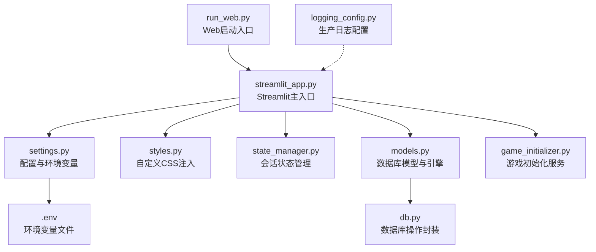
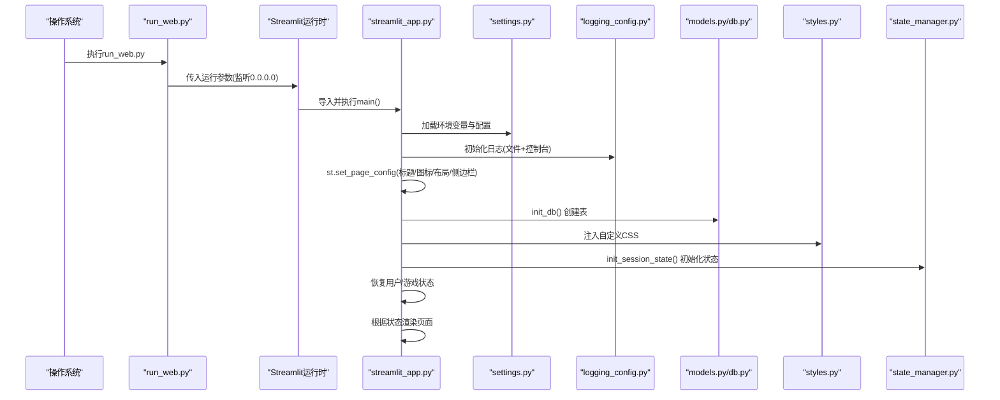
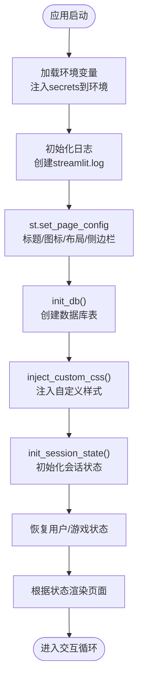
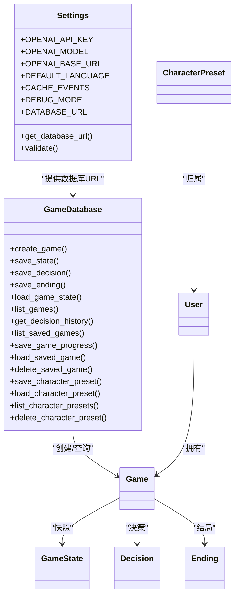
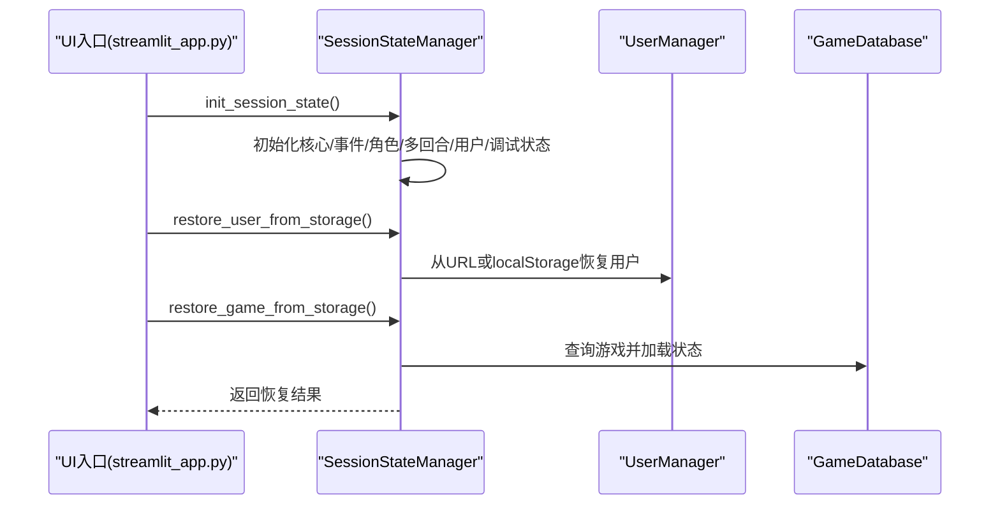
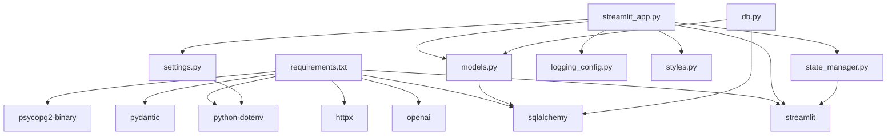

# 主应用入口设计

<cite>
**本文引用的文件**
- [run_web.py](file://run_web.py)
- [streamlit_app.py](file://src/ui/streamlit_app.py)
- [settings.py](file://config/settings.py)
- [logging_config.py](file://config/logging_config.py)
- [styles.py](file://src/ui/styles.py)
- [session_manager.py](file://src/ui/session_manager.py)
- [state_manager.py](file://src/ui/state_manager.py)
- [models.py](file://src/database/models.py)
- [db.py](file://src/database/db.py)
- [game_initializer.py](file://src/ui/services/game_initializer.py)
- [.env](file://.env)
- [requirements.txt](file://requirements.txt)
</cite>

## 目录
1. [简介](#简介)
2. [项目结构](#项目结构)
3. [核心组件](#核心组件)
4. [架构总览](#架构总览)
5. [详细组件分析](#详细组件分析)
6. [依赖关系分析](#依赖关系分析)
7. [性能考虑](#性能考虑)
8. [故障排查指南](#故障排查指南)
9. [结论](#结论)

## 简介
本文档深入解析Streamlit应用的主入口设计与启动流程，涵盖应用配置、数据库初始化、CSS样式注入、环境变量加载、错误处理机制、生命周期管理、日志记录与调试模式等关键环节。文档以循序渐进的方式呈现启动序列，并提供可视化图表帮助读者快速理解系统架构与数据流。

## 项目结构
应用采用模块化分层组织：
- 启动入口：run_web.py负责以Streamlit运行时参数启动UI入口
- UI入口：streamlit_app.py作为Streamlit主应用入口，负责页面配置、初始化、路由与渲染
- 配置层：settings.py集中管理环境变量与全局常量；logging_config.py提供生产级日志配置
- 数据层：models.py定义ORM模型与数据库引擎；db.py封装数据库操作
- 状态层：state_manager.py统一管理会话状态；session_manager.py保持向后兼容
- 服务层：game_initializer.py封装游戏初始化逻辑
- 资源层：styles.py注入自定义CSS样式

**图表来源**
- [run_web.py](file://run_web.py#L1-L11)
- [streamlit_app.py](file://src/ui/streamlit_app.py#L1-L215)
- [settings.py](file://config/settings.py#L1-L100)
- [styles.py](file://src/ui/styles.py#L1-L710)
- [state_manager.py](file://src/ui/state_manager.py#L1-L773)
- [models.py](file://src/database/models.py#L1-L171)
- [db.py](file://src/database/db.py#L1-L517)
- [game_initializer.py](file://src/ui/services/game_initializer.py#L1-L155)
- [.env](file://.env#L1-L9)
- [logging_config.py](file://config/logging_config.py#L1-L78)

**章节来源**
- [run_web.py](file://run_web.py#L1-L11)
- [streamlit_app.py](file://src/ui/streamlit_app.py#L1-L215)
- [settings.py](file://config/settings.py#L1-L100)
- [styles.py](file://src/ui/styles.py#L1-L710)
- [state_manager.py](file://src/ui/state_manager.py#L1-L773)
- [models.py](file://src/database/models.py#L1-L171)
- [db.py](file://src/database/db.py#L1-L517)
- [game_initializer.py](file://src/ui/services/game_initializer.py#L1-L155)
- [.env](file://.env#L1-L9)
- [logging_config.py](file://config/logging_config.py#L1-L78)

## 核心组件
- 启动入口与运行参数
  - run_web.py通过subprocess调用Streamlit运行时，设置服务器监听地址为0.0.0.0，允许局域网访问
- 页面配置与初始化
  - streamlit_app.py在导入阶段完成环境变量注入、日志初始化、页面配置、数据库与样式初始化、会话状态初始化
- 配置与环境变量
  - settings.py加载.env并提供Settings类，支持OpenAI API、语言、缓存、调试模式、数据库URL等配置
- 数据库与模型
  - models.py定义ORM模型与数据库引擎，支持SQLite与云数据库（PostgreSQL/MySQL），init_db()创建表
- 状态管理
  - state_manager.py提供类型安全的会话状态管理，统一初始化、读取、设置与清理
- 样式注入
  - styles.py注入深色主题与自定义UI样式，覆盖默认Streamlit外观
- 错误处理与日志
  - 在OpenAI API密钥缺失时抛出异常并提示；logging_config.py提供生产级日志轮转与第三方库日志抑制

**章节来源**
- [run_web.py](file://run_web.py#L1-L11)
- [streamlit_app.py](file://src/ui/streamlit_app.py#L1-L215)
- [settings.py](file://config/settings.py#L1-L100)
- [models.py](file://src/database/models.py#L1-L171)
- [state_manager.py](file://src/ui/state_manager.py#L1-L773)
- [styles.py](file://src/ui/styles.py#L1-L710)
- [logging_config.py](file://config/logging_config.py#L1-L78)

## 架构总览
应用启动流程遵循“入口 -> 配置 -> 初始化 -> 路由渲染”的顺序，关键步骤如下：
- 启动入口：run_web.py传递运行参数给Streamlit
- UI入口：streamlit_app.py执行环境变量注入、日志初始化、页面配置、数据库与样式初始化、会话状态初始化
- 状态恢复：从URL参数或localStorage恢复用户与游戏状态
- 路由渲染：根据当前状态渲染对应页面视图

**图表来源**
- [run_web.py](file://run_web.py#L1-L11)
- [streamlit_app.py](file://src/ui/streamlit_app.py#L1-L215)
- [settings.py](file://config/settings.py#L1-L100)
- [logging_config.py](file://config/logging_config.py#L1-L78)
- [models.py](file://src/database/models.py#L1-L171)
- [db.py](file://src/database/db.py#L1-L517)
- [styles.py](file://src/ui/styles.py#L1-L710)
- [state_manager.py](file://src/ui/state_manager.py#L1-L773)

## 详细组件分析

### 启动入口与运行参数
- run_web.py通过subprocess调用Streamlit运行时，将服务器地址设置为0.0.0.0，便于局域网访问
- 该入口确保以标准方式启动Streamlit，避免直接调用导致的参数丢失

**章节来源**
- [run_web.py](file://run_web.py#L1-L11)

### 页面配置与初始化
- 环境变量注入：从Streamlit secrets读取敏感配置并写入os.environ，兼容云端部署
- 日志初始化：创建streamlit.log文件，同时输出到控制台，记录应用启动
- 页面配置：设置页面标题、图标、布局为宽屏、侧边栏初始展开
- 数据库与样式：调用init_db()创建表，注入自定义CSS
- 会话状态：初始化状态管理器，恢复用户与游戏状态

**图表来源**
- [streamlit_app.py](file://src/ui/streamlit_app.py#L1-L215)

**章节来源**
- [streamlit_app.py](file://src/ui/streamlit_app.py#L1-L215)

### 配置与环境变量加载
- settings.py加载.env文件，提供Settings类，包含：
  - OpenAI API配置：API密钥、基础URL、模型
  - 游戏配置：默认语言、事件缓存开关、调试模式
  - 游戏常量：起始/结束年龄、周数、资源上下限、衰减等
  - 数据库配置：优先使用DATABASE_URL（云），否则回退SQLite路径
  - 校验方法：validate()在缺少OPENAI_API_KEY时抛出异常
- .env示例包含DeepSeek API配置与语言、缓存开关

**章节来源**
- [settings.py](file://config/settings.py#L1-L100)
- [.env](file://.env#L1-L9)

### 数据库初始化与模型
- models.py定义User、Friendship、Game、GameState、Decision、Ending、CharacterPreset等模型
- 支持SQLite与云数据库（PostgreSQL/MySQL），通过settings.get_database_url()动态选择
- init_db()创建所有表，get_db()提供会话管理
- db.py封装增删改查操作，支持游戏状态快照、决策历史、结局记录与角色预设

**图表来源**
- [settings.py](file://config/settings.py#L1-L100)
- [models.py](file://src/database/models.py#L1-L171)
- [db.py](file://src/database/db.py#L1-L517)

**章节来源**
- [models.py](file://src/database/models.py#L1-L171)
- [db.py](file://src/database/db.py#L1-L517)
- [settings.py](file://config/settings.py#L1-L100)

### 状态管理与会话持久化
- state_manager.py提供类型安全的状态管理，包含：
  - 核心状态：game_loop、current_game_id、language、game_state
  - 事件与结果：current_event、current_story_text、show_result、last_result、processing
  - 角色创建：character_creation、character_settings、player_name、life_vision
  - 多回合系统：showing_weekly_summary、weekly_summary_data、round_summary、last_summary、use_multi_round
  - 用户系统：current_user、user_manager、登录/注册模态、保存/恢复游戏
  - 调试：debug_logs
- session_manager.py向后兼容，重新导出state_manager的接口
- 会话持久化：通过URL参数与localStorage保存/恢复用户ID与游戏ID、状态值

**图表来源**
- [streamlit_app.py](file://src/ui/streamlit_app.py#L1-L215)
- [state_manager.py](file://src/ui/state_manager.py#L1-L773)

**章节来源**
- [state_manager.py](file://src/ui/state_manager.py#L1-L773)
- [session_manager.py](file://src/ui/session_manager.py#L1-L65)

### 样式注入与主题定制
- styles.py注入深色主题与自定义UI样式，覆盖默认Streamlit外观
- 包含按钮、输入框、下拉菜单、侧边栏、进度条、表格、代码块等组件的样式
- 通过CSS类名与选择器适配不同组件，确保深色主题下的可读性与一致性

**章节来源**
- [styles.py](file://src/ui/styles.py#L1-L710)

### 错误处理与异常捕获
- OpenAI API密钥检查：
  - settings.validate()在缺少OPENAI_API_KEY时抛出异常
  - streamlit_app.py在字符创建流程中捕获ValueError并提示设置API密钥
  - CLI版本在GameLoop初始化失败时打印错误并退出
- 异常捕获与提示：
  - 字符创建流程中捕获ValueError并显示错误消息
  - CLI版本中捕获ValueError并提示设置API密钥
- 日志记录：
  - logging_config.py提供生产级日志轮转与第三方库日志抑制
  - streamlit_app.py在启动时记录应用启动日志

**章节来源**
- [settings.py](file://config/settings.py#L84-L90)
- [streamlit_app.py](file://src/ui/streamlit_app.py#L131-L135)
- [logging_config.py](file://config/logging_config.py#L1-L78)

### 生命周期管理与调试模式
- 生命周期：
  - 启动：run_web.py -> streamlit_app.py -> 初始化 -> 渲染
  - 运行：根据状态切换页面，支持自动恢复
  - 关闭：Streamlit进程终止
- 调试模式：
  - settings.DEBUG_MODE控制是否显示调试控制台
  - state_manager提供debug_logs存储最近100条日志
  - logging_config支持生产环境日志轮转

**章节来源**
- [streamlit_app.py](file://src/ui/streamlit_app.py#L161-L163)
- [state_manager.py](file://src/ui/state_manager.py#L495-L509)
- [logging_config.py](file://config/logging_config.py#L72-L78)

## 依赖关系分析
- 运行时依赖：openai、httpx、streamlit、python-dotenv、pydantic、sqlalchemy、psycopg2-binary
- 应用内部依赖：UI入口依赖配置、日志、数据库、状态管理、样式；数据库层依赖SQLAlchemy与配置；状态层依赖Streamlit会话

**图表来源**
- [requirements.txt](file://requirements.txt#L1-L9)
- [streamlit_app.py](file://src/ui/streamlit_app.py#L1-L215)
- [state_manager.py](file://src/ui/state_manager.py#L1-L773)
- [models.py](file://src/database/models.py#L1-L171)
- [db.py](file://src/database/db.py#L1-L517)
- [logging_config.py](file://config/logging_config.py#L1-L78)
- [styles.py](file://src/ui/styles.py#L1-L710)
- [settings.py](file://config/settings.py#L1-L100)

**章节来源**
- [requirements.txt](file://requirements.txt#L1-L9)
- [streamlit_app.py](file://src/ui/streamlit_app.py#L1-L215)

## 性能考虑
- 数据库连接池与预检：models.py针对PostgreSQL启用pool_pre_ping，提升连接稳定性
- 日志轮转：logging_config.py限制单文件大小与备份数量，避免磁盘占用过大
- 缓存策略：settings.CACHE_EVENTS控制事件缓存，减少重复生成开销
- UI渲染优化：styles.py统一样式，减少重复计算与DOM节点

[本节为通用建议，无需特定文件引用]

## 故障排查指南
- OpenAI API密钥缺失
  - 症状：初始化GameLoop或字符创建时报错，提示设置OPENAI_API_KEY
  - 处理：在.env中设置OPENAI_API_KEY，或在部署平台的环境变量中配置
  - 参考：settings.validate()、streamlit_app.py字符创建异常捕获
- 数据库连接失败
  - 症状：init_db()或数据库操作报错
  - 处理：确认DATABASE_URL或SQLite路径有效；云环境使用PostgreSQL/MySQL
  - 参考：models.py get_database_url()、db.py数据库操作
- 会话恢复失败
  - 症状：URL参数或localStorage中的game_id无效
  - 处理：清除URL参数与localStorage中的游戏状态，重新开始
  - 参考：state_manager.restore_game_from_storage()

**章节来源**
- [settings.py](file://config/settings.py#L84-L90)
- [streamlit_app.py](file://src/ui/streamlit_app.py#L131-L135)
- [models.py](file://src/database/models.py#L74-L82)
- [db.py](file://src/database/db.py#L1-L517)
- [state_manager.py](file://src/ui/state_manager.py#L662-L773)

## 结论
本应用通过run_web.py与streamlit_app.py形成清晰的启动链路，结合settings.py的集中配置、models.py与db.py的数据库抽象、state_manager.py的会话状态管理以及styles.py的样式注入，构建了稳定、可扩展的Streamlit应用入口。通过严格的错误处理与日志配置，应用在开发与生产环境中均具备良好的可观测性与可维护性。建议在部署时明确配置DATABASE_URL与OPENAI相关环境变量，并根据需要开启调试模式辅助定位问题。