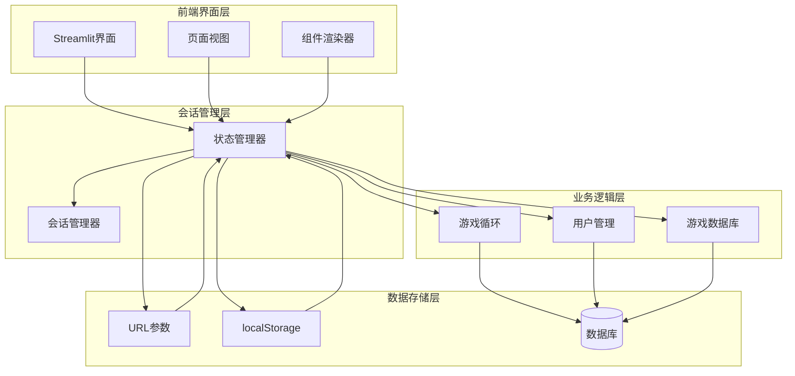
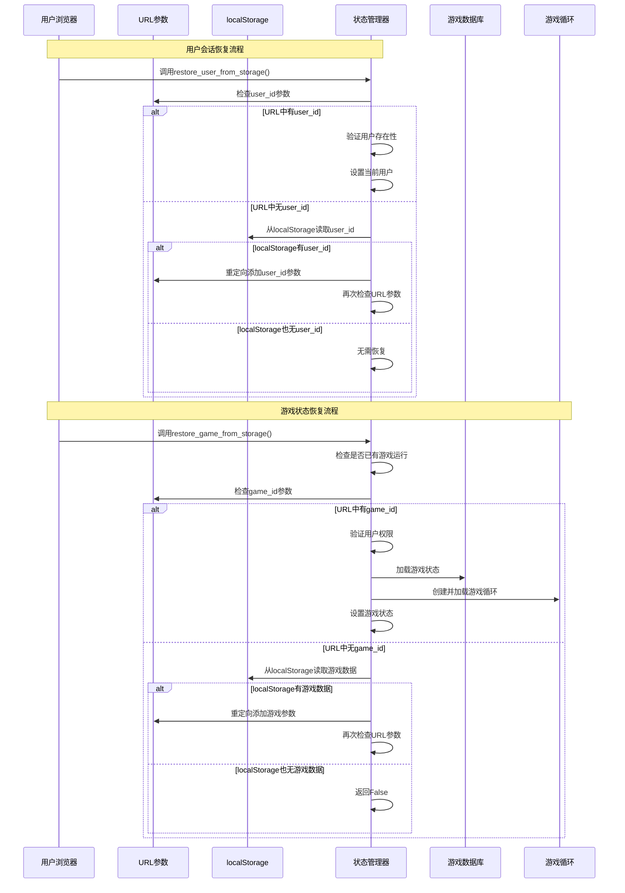
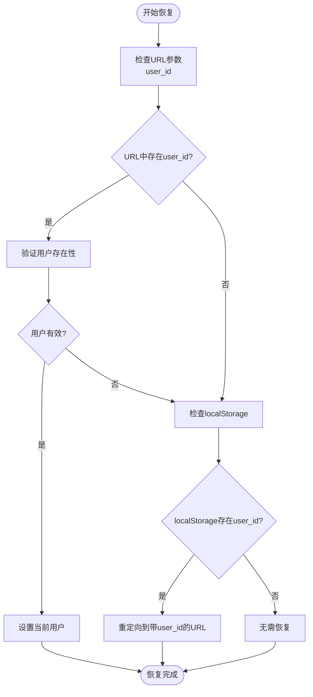
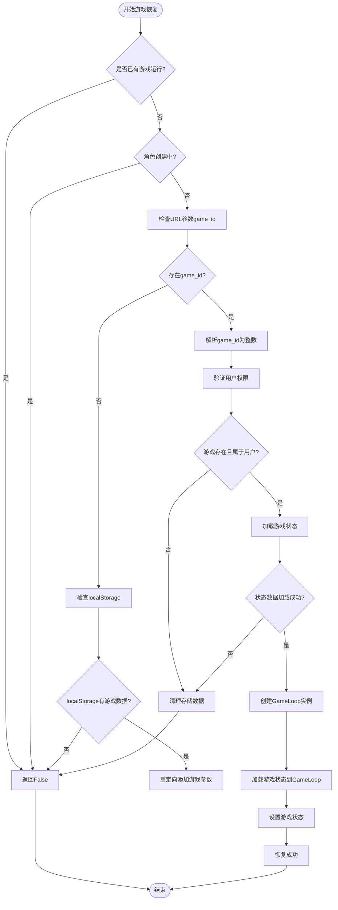
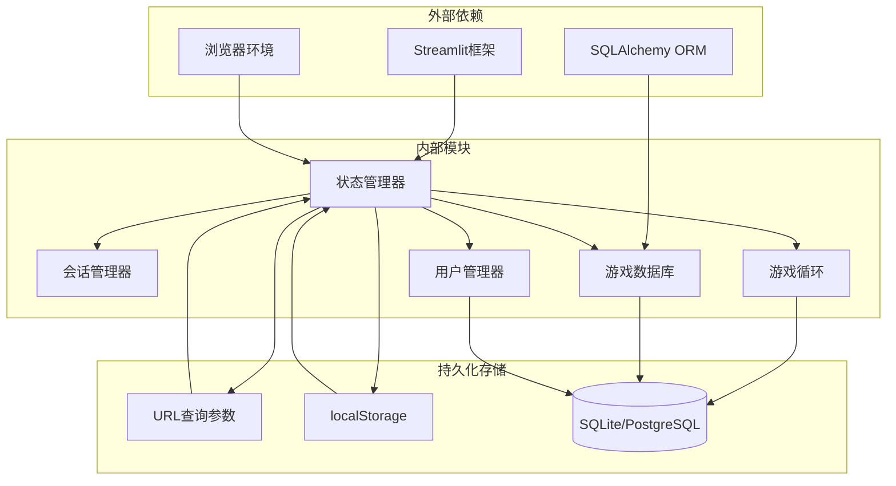

# 会话持久化机制

<cite>
**本文档引用的文件**
- [src/ui/state_manager.py](file://src/ui/state_manager.py)
- [src/ui/session_manager.py](file://src/ui/session_manager.py)
- [src/database/db.py](file://src/database/db.py)
- [src/game/game_loop.py](file://src/game/game_loop.py)
- [src/ui/streamlit_app.py](file://src/ui/streamlit_app.py)
- [src/ui/page_views/saved_games.py](file://src/ui/page_views/saved_games.py)
- [src/ui/page_views/opening_story.py](file://src/ui/page_views/opening_story.py)
</cite>

## 目录
1. [简介](#简介)
2. [项目结构](#项目结构)
3. [核心组件](#核心组件)
4. [架构概览](#架构概览)
5. [详细组件分析](#详细组件分析)
6. [依赖关系分析](#依赖关系分析)
7. [性能考虑](#性能考虑)
8. [故障排除指南](#故障排除指南)
9. [结论](#结论)

## 简介

本文档深入解析Story2项目的会话持久化机制，重点阐述用户会话和游戏状态的双重持久化策略。该系统采用URL参数和localStorage的组合方式，确保用户在会话中断后能够可靠地恢复到之前的状态。

系统的核心功能包括：
- 用户会话持久化：通过URL参数和localStorage双重机制保持用户登录状态
- 游戏状态持久化：支持游戏ID和状态数据的跨会话保存与恢复
- 智能恢复策略：优先使用URL参数，回退到localStorage的容错机制
- 权限验证：确保恢复的游戏状态仅对合法用户可见

## 项目结构

**图表来源**
- [src/ui/state_manager.py](file://src/ui/state_manager.py#L1-L773)
- [src/ui/session_manager.py](file://src/ui/session_manager.py#L1-L65)
- [src/database/db.py](file://src/database/db.py#L1-L200)

**章节来源**
- [src/ui/state_manager.py](file://src/ui/state_manager.py#L1-L773)
- [src/ui/session_manager.py](file://src/ui/session_manager.py#L1-L65)

## 核心组件

### 会话状态管理器

SessionStateManager是整个会话持久化的中枢，负责：
- 统一管理所有会话状态变量
- 提供类型安全的状态访问接口
- 实现状态的自动初始化和清理
- 协调用户会话和游戏状态的持久化

### 用户持久化函数

系统提供三个核心用户会话持久化函数：

#### save_user_to_storage函数
实现URL参数和localStorage的双重持久化：
- 主要持久化：设置URL查询参数中的user_id
- 备份持久化：同时保存到localStorage的story2_user_id键
- 双重保障：确保即使URL参数丢失，仍可通过localStorage恢复

#### clear_user_storage函数
清理用户会话数据：
- 删除URL查询参数中的user_id
- 清空localStorage中的用户ID
- 完整清理用户会话痕迹

#### restore_user_from_storage函数
智能恢复用户会话：
- 优先检查URL参数中的user_id
- 验证用户存在性并设置当前用户
- 若URL无用户信息，尝试从localStorage恢复
- 使用重定向机制将localStorage数据注入URL

### 游戏持久化函数

#### save_game_to_storage函数
实现游戏状态的双重持久化：
- 保存game_id到URL参数
- 保存game_state到URL参数
- 同步保存到localStorage对应的键值对
- 记录详细的持久化日志

#### clear_game_storage函数
清理游戏会话数据：
- 移除URL参数中的game_id和game_state
- 清空localStorage中的游戏相关数据
- 防止残留数据影响新游戏会话

#### restore_game_from_storage函数
复杂的恢复逻辑：
- 检查是否已有游戏在进行
- 避免在角色创建期间恢复旧游戏
- 优先从URL参数恢复，必要时从localStorage恢复
- 执行严格的权限验证和数据完整性检查

**章节来源**
- [src/ui/state_manager.py](file://src/ui/state_manager.py#L552-L772)

## 架构概览

**图表来源**
- [src/ui/state_manager.py](file://src/ui/state_manager.py#L587-L772)
- [src/database/db.py](file://src/database/db.py#L145-L193)

## 详细组件分析

### 用户会话持久化机制

#### URL参数持久化策略

URL参数作为主要持久化介质，具有以下优势：
- **可靠性高**：URL参数随页面请求传递，不易丢失
- **兼容性强**：支持书签分享和深度链接
- **即时生效**：无需额外的异步操作

#### localStorage备份机制

localStorage提供双重保障：
- **数据持久性**：即使页面刷新也能保持
- **离线可用**：网络中断时仍可恢复会话
- **快速访问**：本地存储访问速度更快

#### 恢复优先级策略

系统采用智能的恢复策略：

**图表来源**
- [src/ui/state_manager.py](file://src/ui/state_manager.py#L587-L625)

### 游戏状态持久化机制

#### 数据存储结构

游戏状态持久化包含两个关键数据：

| 存储位置 | 键名 | 数据类型 | 描述 |
|---------|------|----------|------|
| URL参数 | game_id | 整数 | 游戏唯一标识符 |
| URL参数 | game_state | 字符串枚举 | 游戏当前UI状态 |
| localStorage | story2_game_id | 整数 | 游戏ID备份 |
| localStorage | story2_game_state | 字符串枚举 | 游戏状态备份 |

#### 恢复逻辑详解

恢复过程包含多层验证和保护：

**图表来源**
- [src/ui/state_manager.py](file://src/ui/state_manager.py#L662-L772)
- [src/database/db.py](file://src/database/db.py#L145-L172)

### 异常处理和容错机制

系统实现了多层次的异常处理：

#### 输入验证
- URL参数类型转换异常处理
- 用户ID格式验证
- 游戏ID有效性检查

#### 权限控制
- 用户身份验证
- 游戏所有权验证
- 数据访问权限检查

#### 数据完整性
- 游戏状态数据验证
- 必需字段检查
- 状态一致性保证

#### 自动清理
- 失败后的数据清理
- 防止脏数据污染
- 系统状态恢复

**章节来源**
- [src/ui/state_manager.py](file://src/ui/state_manager.py#L662-L772)
- [src/database/db.py](file://src/database/db.py#L145-L193)

## 依赖关系分析

**图表来源**
- [src/ui/state_manager.py](file://src/ui/state_manager.py#L1-L773)
- [src/database/db.py](file://src/database/db.py#L1-L200)

### 关键依赖关系

1. **状态管理依赖**：SessionStateManager依赖于Streamlit的session_state和query_params
2. **数据库访问**：GameDatabase提供统一的数据访问接口
3. **游戏循环集成**：GameLoop负责游戏状态的实际加载和执行
4. **用户管理集成**：UserManager处理用户认证和授权

**章节来源**
- [src/ui/state_manager.py](file://src/ui/state_manager.py#L1-L773)
- [src/database/db.py](file://src/database/db.py#L1-L200)

## 性能考虑

### 存储效率优化

1. **增量更新**：只保存必要的状态数据，避免全量复制
2. **压缩存储**：对复杂对象进行序列化存储
3. **缓存策略**：合理利用浏览器缓存机制

### 访问性能优化

1. **延迟加载**：按需加载游戏状态，减少初始开销
2. **异步处理**：使用异步操作避免阻塞UI线程
3. **批量操作**：合并多个状态更新操作

### 内存管理

1. **及时清理**：不再使用的状态及时从内存中移除
2. **弱引用**：对大型对象使用弱引用避免内存泄漏
3. **垃圾回收**：定期触发垃圾回收机制

## 故障排除指南

### 常见问题及解决方案

#### 用户会话无法恢复

**症状**：用户重新进入页面后需要重新登录
**可能原因**：
- URL参数被清理工具删除
- 浏览器禁用了localStorage
- 用户ID格式错误

**解决步骤**：
1. 检查URL参数是否正确设置
2. 验证localStorage功能是否正常
3. 确认用户ID格式和有效性

#### 游戏状态恢复失败

**症状**：游戏无法恢复到之前的进度
**可能原因**：
- 游戏ID不存在或已被删除
- 用户权限验证失败
- 游戏状态数据损坏

**解决步骤**：
1. 验证游戏ID的有效性
2. 检查用户与游戏的关联关系
3. 确认游戏状态数据的完整性

#### 恢复循环问题

**症状**：页面不断重定向循环
**可能原因**：
- localStorage和URL参数不一致
- 恢复逻辑出现递归调用

**解决步骤**：
1. 清理冲突的存储数据
2. 检查恢复逻辑的终止条件
3. 添加防循环保护机制

### 调试技巧

1. **启用调试模式**：查看详细的日志输出
2. **检查存储状态**：验证URL参数和localStorage的内容
3. **监控网络请求**：确认数据库访问的正确性
4. **验证权限检查**：确保用户权限验证逻辑正常

**章节来源**
- [src/ui/state_manager.py](file://src/ui/state_manager.py#L662-L772)

## 结论

Story2项目的会话持久化机制通过URL参数和localStorage的双重持久化策略，实现了可靠的用户会话和游戏状态恢复功能。该系统具有以下特点：

1. **高可靠性**：双重持久化机制确保即使一种存储方式失效，仍能通过另一种方式恢复
2. **智能优先级**：URL参数作为主要存储介质，localStorage作为备份，体现了合理的优先级策略
3. **完善的异常处理**：多层次的验证和清理机制确保系统的稳定性和安全性
4. **良好的用户体验**：无缝的会话恢复过程提升了用户的使用体验

通过本文档的详细分析，开发者可以更好地理解和维护这个会话持久化系统，并在此基础上进行进一步的功能扩展和性能优化。