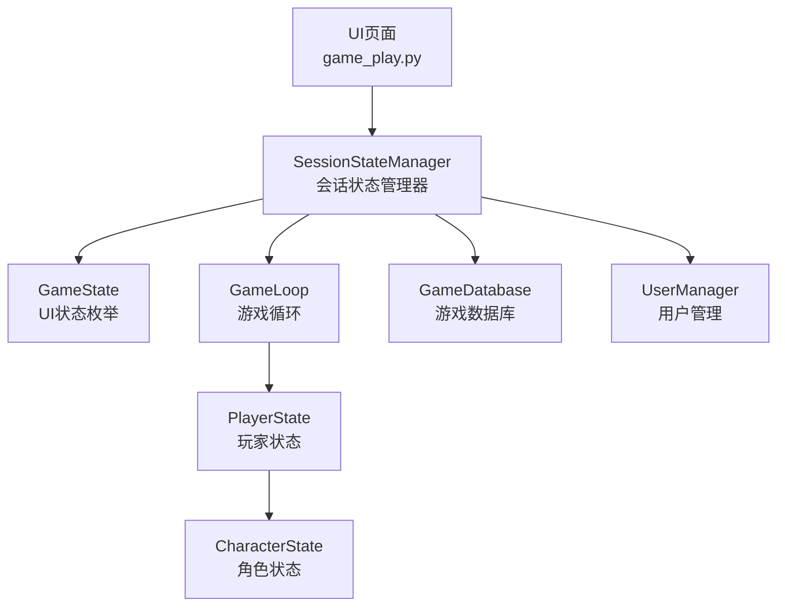
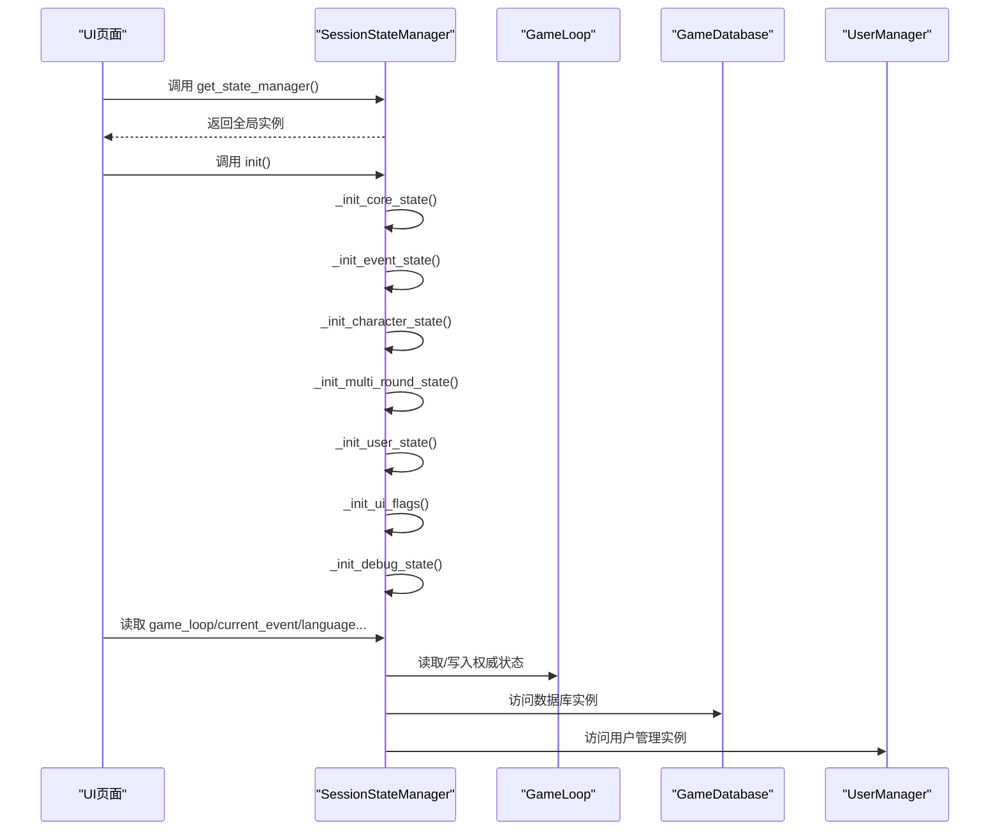
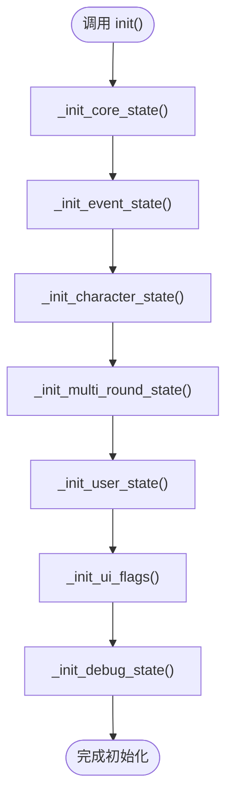
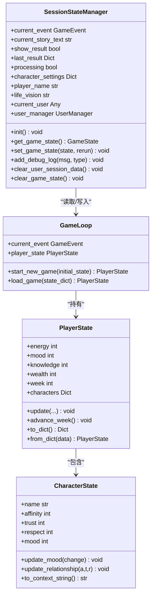
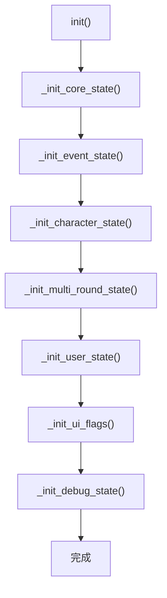

# 会话状态管理

<cite>
**本文档引用的文件**
- [src/ui/state_manager.py](file://src/ui/state_manager.py)
- [src/ui/session_manager.py](file://src/ui/session_manager.py)
- [src/game/state.py](file://src/game/state.py)
- [src/game/game_loop.py](file://src/game/game_loop.py)
- [src/ui/page_views/game_play.py](file://src/ui/page_views/game_play.py)
- [tests/test_state.py](file://tests/test_state.py)
- [tests/test_ui_modules.py](file://tests/test_ui_modules.py)
- [config/settings.py](file://config/settings.py)
</cite>

## 目录
1. [简介](#简介)
2. [项目结构](#项目结构)
3. [核心组件](#核心组件)
4. [架构总览](#架构总览)
5. [详细组件分析](#详细组件分析)
6. [依赖关系分析](#依赖关系分析)
7. [性能考虑](#性能考虑)
8. [故障排除指南](#故障排除指南)
9. [结论](#结论)
10. [附录](#附录)

## 简介
本文件聚焦于会话状态管理，深入解析 SessionStateManager 类的设计架构与实现细节，涵盖初始化机制、类型安全的状态访问模式、状态变量分类管理，并提供状态初始化流程图、状态变量映射表以及常用 API 调用示例。该状态管理器统一了 Streamlit 应用中的会话状态，消除了分散的直接访问，提供了类型安全的 getter/setter 属性与自动初始化功能。

## 项目结构
围绕会话状态管理的关键文件与职责如下：
- src/ui/state_manager.py：集中式会话状态管理器，提供类型安全的属性访问与初始化流程
- src/ui/session_manager.py：向后兼容层，重新导出新接口以维持现有导入
- src/game/state.py：游戏核心状态模型（PlayerState、CharacterState），为会话状态提供深层数据结构
- src/game/game_loop.py：主游戏循环，持有 PlayerState 与当前事件，作为会话状态的权威来源之一
- src/ui/page_views/game_play.py：页面渲染逻辑，展示如何通过状态管理器读取与更新状态
- tests/test_state.py、tests/test_ui_modules.py：状态与 UI 模块的单元测试
- config/settings.py：全局配置常量，影响状态边界与默认值

图表来源
- [src/ui/state_manager.py](file://src/ui/state_manager.py#L42-L546)
- [src/game/game_loop.py](file://src/game/game_loop.py#L24-L61)
- [src/game/state.py](file://src/game/state.py#L244-L709)
- [src/ui/page_views/game_play.py](file://src/ui/page_views/game_play.py#L18-L67)

章节来源
- [src/ui/state_manager.py](file://src/ui/state_manager.py#L1-L773)
- [src/ui/session_manager.py](file://src/ui/session_manager.py#L1-L65)
- [src/game/state.py](file://src/game/state.py#L1-L709)
- [src/game/game_loop.py](file://src/game/game_loop.py#L1-L200)
- [src/ui/page_views/game_play.py](file://src/ui/page_views/game_play.py#L1-L200)
- [config/settings.py](file://config/settings.py#L30-L100)

## 核心组件
- SessionStateManager：统一的会话状态中心，负责初始化、类型安全访问、清理与持久化辅助函数
- GameState：UI 状态枚举，定义欢迎、角色创建、游戏进行、结束等状态
- GameLoop：主游戏循环，维护 PlayerState 与当前事件，是会话状态的权威来源之一
- PlayerState/CharacterState：基于 Pydantic 的强类型状态模型，提供边界校验与序列化

章节来源
- [src/ui/state_manager.py](file://src/ui/state_manager.py#L29-L59)
- [src/game/game_loop.py](file://src/game/game_loop.py#L24-L61)
- [src/game/state.py](file://src/game/state.py#L244-L709)

## 架构总览
SessionStateManager 将会话状态划分为多个类别，每个类别由独立的初始化方法负责默认值设置；同时通过属性包装器提供类型安全的访问。UI 页面通过 get_state_manager() 获取全局实例，统一读取与更新状态。

图表来源
- [src/ui/state_manager.py](file://src/ui/state_manager.py#L67-L76)
- [src/ui/state_manager.py](file://src/ui/state_manager.py#L77-L175)
- [src/ui/page_views/game_play.py](file://src/ui/page_views/game_play.py#L18-L67)

## 详细组件分析

### 初始化机制与执行顺序
SessionStateManager 的 init() 方法按以下顺序调用各初始化方法，确保状态变量的正确默认值与依赖注入：
- _init_core_state：核心游戏状态（game_loop、game_db、current_game_id、language、game_state）
- _init_event_state：事件与结果显示状态（show_result、last_result、current_event、current_story_text、processing）
- _init_character_state：角色创建状态（character_creation、show_preset_selector、show_save_preset、show_character_options、character_settings、current_setting_step、current_setting_step_index、player_name、life_vision）
- _init_multi_round_state：多轮系统状态（showing_weekly_summary、weekly_summary_data、round_summary、use_multi_round、last_summary）
- _init_user_state：用户系统状态（current_user、show_login、show_register_success、new_user_private_id、user_manager、show_login_tab、show_auth_modal、auth_mode、show_saved_games、user_restored）
- _init_ui_flags：UI 特定标志（opening_story、context_chat_history）
- _init_debug_state：调试状态（debug_logs）

图表来源
- [src/ui/state_manager.py](file://src/ui/state_manager.py#L67-L76)
- [src/ui/state_manager.py](file://src/ui/state_manager.py#L77-L175)

章节来源
- [src/ui/state_manager.py](file://src/ui/state_manager.py#L67-L175)

### 类型安全的状态访问模式
SessionStateManager 使用 Python 属性装饰器提供类型安全的 getter/setter：
- 核心状态：game_loop、game_db、current_game_id、language 等，通过 st.session_state.get()/赋值实现类型安全访问
- 游戏状态：get_game_state()/set_game_state() 对 GameState 枚举进行类型校验与转换
- 事件状态：current_event/current_story_text/show_result/last_result/processing，统一从 GameLoop 读取，必要时回退到 session_state
- 角色创建状态：character_settings、player_name、life_vision 等字典/字符串属性
- 多轮系统状态：showing_weekly_summary、weekly_summary_data、round_summary、last_summary 等
- 用户状态：current_user、user_manager、认证相关标志
- UI 标志：opening_story、context_chat_history
- 调试状态：debug_logs，提供日志追加与容量限制

章节来源
- [src/ui/state_manager.py](file://src/ui/state_manager.py#L178-L509)

### 状态变量分类管理
- 核心状态：game_loop、game_db、current_game_id、language、game_state
- 事件状态：current_event、current_story_text、show_result、last_result、processing
- 角色创建状态：character_creation、show_preset_selector、show_save_preset、show_character_options、character_settings、current_setting_step、current_setting_step_index、player_name、life_vision
- 多轮系统状态：showing_weekly_summary、weekly_summary_data、round_summary、use_multi_round、last_summary
- 用户状态：current_user、show_login、show_register_success、new_user_private_id、user_manager、show_login_tab、show_auth_modal、auth_mode、show_saved_games、user_restored
- UI 标志：opening_story、context_chat_history
- 调试状态：debug_logs

章节来源
- [src/ui/state_manager.py](file://src/ui/state_manager.py#L77-L175)

### 与 GameLoop 的协作
- current_event 属性是“单一真相来源”，优先从 game_loop.current_event 读取，回退到 session_state 以保证兼容
- current_event.setter 同时更新 game_loop 与 session_state，确保一致性
- clear_current_event() 清理 game_loop 与 player_state 中的 current_event_data，避免陈旧状态

章节来源
- [src/ui/state_manager.py](file://src/ui/state_manager.py#L247-L290)
- [src/game/game_loop.py](file://src/game/game_loop.py#L24-L61)

### 常用 API 调用示例
- 获取状态管理器：get_state_manager()
- 初始化：state.init()
- 设置 UI 状态：state.set_game_state(GameState.PLAYING, rerun=True)
- 读取/设置核心状态：state.game_loop、state.current_game_id、state.language
- 读取/设置事件状态：state.current_event、state.current_story_text、state.show_result、state.last_result、state.processing
- 读取/设置角色创建状态：state.character_settings、state.player_name、state.life_vision
- 读取/设置多轮系统状态：state.showing_weekly_summary、state.weekly_summary_data、state.round_summary、state.last_summary
- 读取/设置用户状态：state.current_user、state.user_manager
- 读取/设置 UI 标志：state.opening_story、state.context_chat_history
- 调试：state.add_debug_log("消息", "info")
- 清理：state.clear_user_session_data()、state.clear_game_state()

章节来源
- [src/ui/state_manager.py](file://src/ui/state_manager.py#L541-L546)
- [src/ui/state_manager.py](file://src/ui/state_manager.py#L233-L243)
- [src/ui/state_manager.py](file://src/ui/state_manager.py#L495-L509)
- [src/ui/page_views/game_play.py](file://src/ui/page_views/game_play.py#L18-L67)

## 依赖关系分析
- SessionStateManager 依赖：
  - GameLoop：通过 game_loop.current_event 统一事件状态
  - GameDatabase/UserManager：通过 st.session_state 注入实例
  - Streamlit：st.session_state、st.query_params、st.rerun
- PlayerState/CharacterState 依赖：
  - Pydantic BaseModel：字段验证与序列化
  - config.settings：资源边界与初始值
- UI 页面依赖：
  - get_state_manager() 获取状态管理器
  - 通过状态管理器读取/更新会话状态

图表来源
- [src/ui/state_manager.py](file://src/ui/state_manager.py#L42-L546)
- [src/game/game_loop.py](file://src/game/game_loop.py#L24-L61)
- [src/game/state.py](file://src/game/state.py#L244-L709)

章节来源
- [src/ui/state_manager.py](file://src/ui/state_manager.py#L42-L546)
- [src/game/game_loop.py](file://src/game/game_loop.py#L24-L61)
- [src/game/state.py](file://src/game/state.py#L244-L709)

## 性能考虑
- 单例模式：get_state_manager() 提供全局唯一实例，减少重复初始化开销
- 属性访问：通过 st.session_state.get() 与直接赋值，避免不必要的对象拷贝
- 日志容量：debug_logs 最多保留 100 条，防止内存膨胀
- UI 状态切换：set_game_state(rerun=True) 在必要时触发重新渲染，避免频繁 rerun

## 故障排除指南
- 事件状态不一致：检查 current_event 的 getter/setter 是否同时更新 game_loop 与 session_state
- 用户持久化异常：restore_user_from_storage() 优先从 URL 恢复，其次尝试 localStorage，确认 URL 参数与 localStorage 数据一致性
- 游戏恢复失败：restore_game_from_storage() 需要 game_loop、game_db、current_game_id 等状态齐全，检查数据库连接与游戏数据完整性
- 状态清理：clear_user_session_data() 与 clear_game_state() 用于用户切换与重新开始，确保关键键被正确删除

章节来源
- [src/ui/state_manager.py](file://src/ui/state_manager.py#L512-L535)
- [src/ui/state_manager.py](file://src/ui/state_manager.py#L587-L773)

## 结论
SessionStateManager 通过集中化、类型安全与自动初始化，有效提升了会话状态管理的可靠性与可维护性。其与 GameLoop 的紧密协作确保了事件状态的一致性，而清晰的状态分类与完善的清理机制则降低了状态污染的风险。建议在新开发中统一使用 get_state_manager() 与属性访问，逐步迁移旧接口。

## 附录

### 状态初始化流程图（补充）

图表来源
- [src/ui/state_manager.py](file://src/ui/state_manager.py#L67-L76)

### 状态变量映射表（节选）
- 核心状态
  - game_loop: GameLoop 实例
  - game_db: GameDatabase 实例
  - current_game_id: int
  - language: str
  - game_state: GameState
- 事件状态
  - current_event: GameEvent
  - current_story_text: str
  - show_result: bool
  - last_result: Dict[str, Any]
  - processing: bool
- 角色创建状态
  - character_creation: bool
  - show_preset_selector: bool
  - show_save_preset: bool
  - show_character_options: bool
  - character_settings: Dict[str, Any]
  - current_setting_step: str
  - current_setting_step_index: int
  - player_name: str
  - life_vision: str
- 多轮系统状态
  - showing_weekly_summary: bool
  - weekly_summary_data: Dict[str, Any]
  - round_summary: str
  - use_multi_round: bool
  - last_summary: Dict[str, Any]
- 用户状态
  - current_user: Any
  - show_login: bool
  - show_register_success: bool
  - new_user_private_id: Any
  - user_manager: UserManager
  - show_login_tab: bool
  - show_auth_modal: bool
  - auth_mode: str
  - show_saved_games: bool
  - user_restored: bool
- UI 标志
  - opening_story: Any
  - context_chat_history: List[Any]
- 调试状态
  - debug_logs: List[str]

章节来源
- [src/ui/state_manager.py](file://src/ui/state_manager.py#L77-L175)