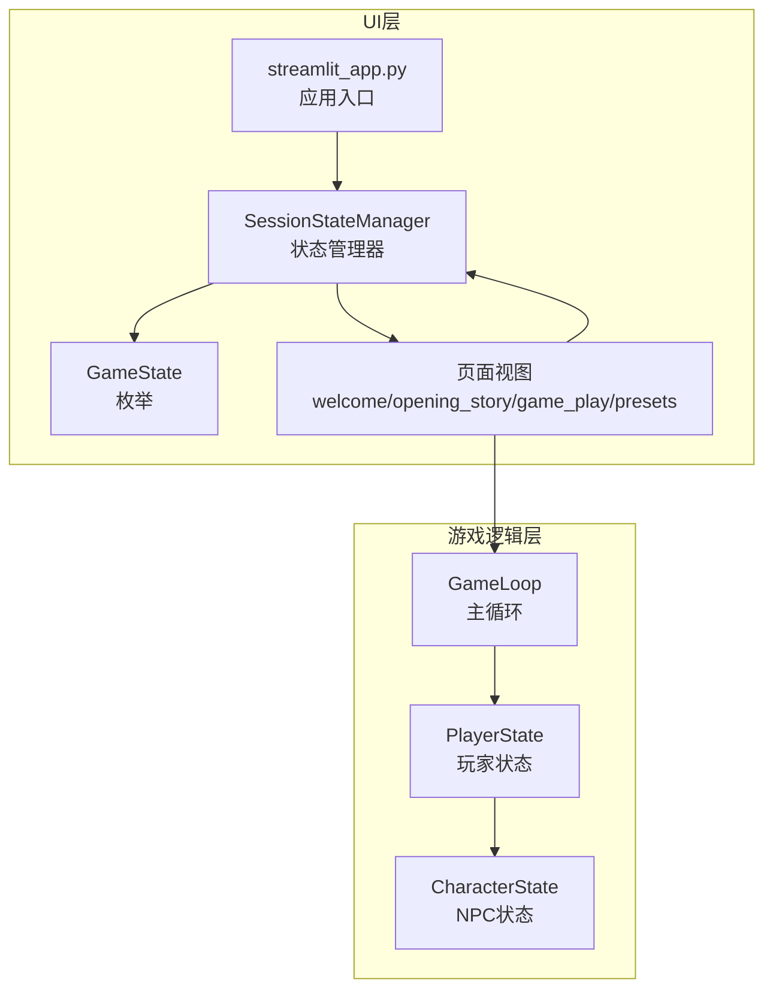
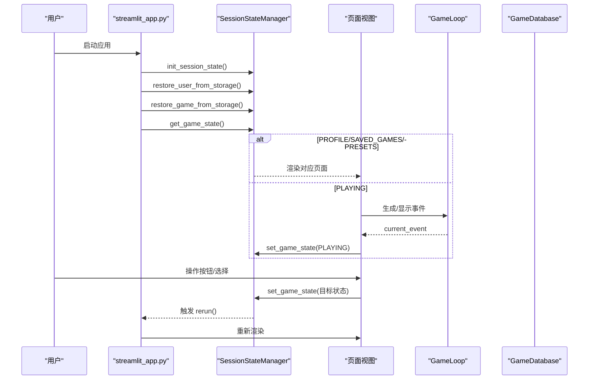
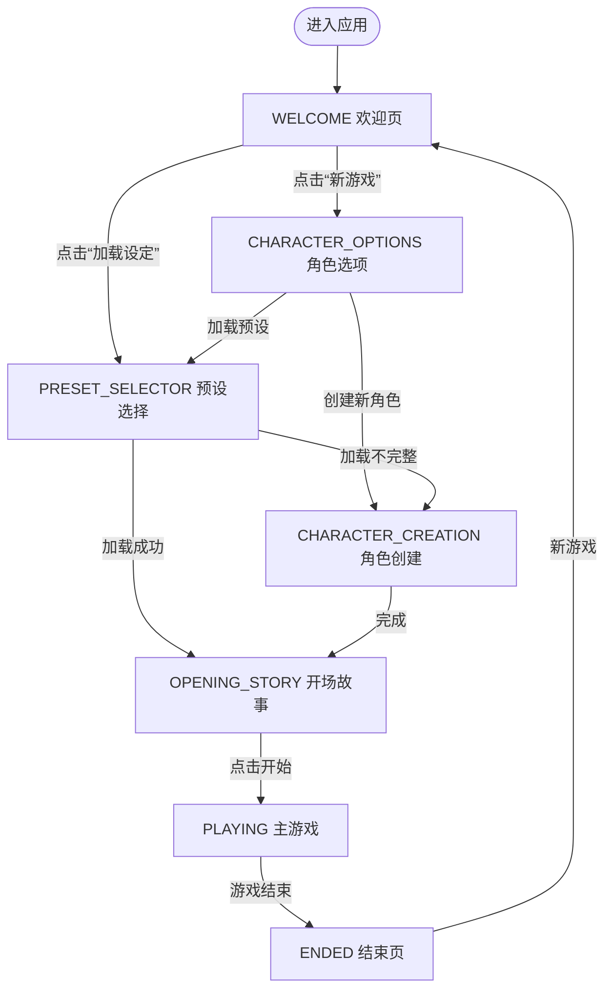
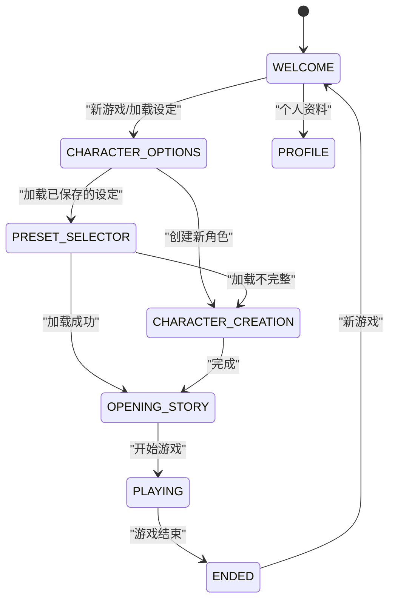
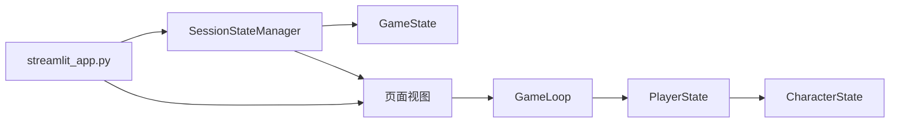

# 全局状态控制器

<cite>
**本文引用的文件**
- [src/ui/state_manager.py](file://src/ui/state_manager.py)
- [src/ui/session_manager.py](file://src/ui/session_manager.py)
- [src/game/state.py](file://src/game/state.py)
- [src/game/game_loop.py](file://src/game/game_loop.py)
- [src/ui/page_views/welcome.py](file://src/ui/page_views/welcome.py)
- [src/ui/page_views/opening_story.py](file://src/ui/page_views/opening_story.py)
- [src/ui/page_views/game_play.py](file://src/ui/page_views/game_play.py)
- [src/ui/page_views/presets.py](file://src/ui/page_views/presets.py)
- [src/ui/streamlit_app.py](file://src/ui/streamlit_app.py)
- [config/settings.py](file://config/settings.py)
- [test_state_machine.py](file://test_state_machine.py)
</cite>

## 目录
1. [简介](#简介)
2. [项目结构](#项目结构)
3. [核心组件](#核心组件)
4. [架构总览](#架构总览)
5. [详细组件分析](#详细组件分析)
6. [依赖关系分析](#依赖关系分析)
7. [性能考量](#性能考量)
8. [故障排查指南](#故障排查指南)
9. [结论](#结论)
10. [附录](#附录)

## 简介
本文件系统性梳理全局状态控制器的设计与实现，重点围绕 GameState 枚举的状态定义、状态转换逻辑与安全机制展开。文档覆盖以下内容：
- GameState 的全部状态及其职责边界
- 状态转换条件与触发路径
- 核心API：get_game_state、set_game_state、clear_current_event 的使用方式与参数说明
- 安全性保障与错误处理策略
- 状态转换流程图、状态机图与实际应用场景

## 项目结构
全局状态控制器位于 UI 层，通过统一的状态管理器集中维护所有会话状态，并在各页面视图之间进行状态流转。核心文件组织如下：
- UI 状态管理：src/ui/state_manager.py（定义 GameState 枚举与 SessionStateManager 类）
- 向后兼容封装：src/ui/session_manager.py（导出旧接口）
- 游戏状态模型：src/game/state.py（包含 PlayerState、CharacterState 等）
- 游戏主循环：src/game/game_loop.py（驱动事件生成与状态推进）
- 页面视图：src/ui/page_views/*（根据 GameState 渲染对应页面）
- 应用入口：src/ui/streamlit_app.py（状态机路由与页面调度）
- 配置：config/settings.py（游戏常量与资源边界）

图表来源
- [src/ui/state_manager.py](file://src/ui/state_manager.py#L29-L40)
- [src/ui/streamlit_app.py](file://src/ui/streamlit_app.py#L175-L200)
- [src/game/game_loop.py](file://src/game/game_loop.py#L24-L61)
- [src/game/state.py](file://src/game/state.py#L244-L292)

章节来源
- [src/ui/state_manager.py](file://src/ui/state_manager.py#L29-L40)
- [src/ui/streamlit_app.py](file://src/ui/streamlit_app.py#L175-L200)

## 核心组件
- GameState 枚举：定义 UI 状态集合，包括 WELCOME、CHARACTER_OPTIONS、CHARACTER_CREATION、PRESET_SELECTOR、SAVE_PRESET、OPENING_STORY、PLAYING、ENDED、PROFILE。
- SessionStateManager：集中式会话状态管理器，提供类型安全的 getter/setter、事件统一源、调试日志、持久化恢复等功能。
- GameLoop：游戏主循环，负责事件生成、回合推进、周推进与结束判定。
- PlayerState/CharacterState：游戏内玩家与 NPC 的状态模型，承载资源、关系、事件与历史数据。

章节来源
- [src/ui/state_manager.py](file://src/ui/state_manager.py#L29-L40)
- [src/ui/state_manager.py](file://src/ui/state_manager.py#L42-L535)
- [src/game/game_loop.py](file://src/game/game_loop.py#L24-L61)
- [src/game/state.py](file://src/game/state.py#L244-L292)

## 架构总览
全局状态控制器采用“UI 状态机 + 游戏状态模型”的双层架构：
- UI 状态机：以 GameState 为核心，通过 SessionStateManager 在页面间进行状态流转，保证单一真相源（current_event）与类型安全。
- 游戏状态模型：PlayerState/CharacterState 提供资源、关系、事件与历史数据，GameLoop 驱动事件生成与周推进，最终触发状态机转换。

图表来源
- [src/ui/streamlit_app.py](file://src/ui/streamlit_app.py#L139-L200)
- [src/ui/state_manager.py](file://src/ui/state_manager.py#L215-L244)
- [src/ui/page_views/game_play.py](file://src/ui/page_views/game_play.py#L18-L67)

## 详细组件分析

### GameState 状态定义与职责
- WELCOME：欢迎页，提供“新游戏”“加载设定”“继续游戏”等入口；在该状态下可进入 CHARACTER_OPTIONS 或 PRESET_SELECTOR。
- CHARACTER_OPTIONS：角色创建选项页，提供“创建新角色”“加载已保存的设定”。
- CHARACTER_CREATION：角色创建流程，完成后进入 OPENING_STORY 或 SAVE_PRESET。
- PRESET_SELECTOR：预设选择页，支持加载/删除预设，加载不完整预设时回退到角色创建。
- SAVE_PRESET：保存预设对话框，支持仅保存或保存并开始游戏。
- OPENING_STORY：开场故事页，展示生成的开场故事，点击后进入 PLAYING。
- PLAYING：主游戏页，事件展示、选项选择、结果呈现与周/年度总结。
- ENDED：游戏结束页，展示结局与统计。
- PROFILE：个人资料页。

章节来源
- [src/ui/state_manager.py](file://src/ui/state_manager.py#L29-L40)
- [src/ui/page_views/welcome.py](file://src/ui/page_views/welcome.py#L116-L176)
- [src/ui/page_views/opening_story.py](file://src/ui/page_views/opening_story.py#L11-L119)
- [src/ui/page_views/game_play.py](file://src/ui/page_views/game_play.py#L18-L67)
- [src/ui/page_views/presets.py](file://src/ui/page_views/presets.py#L15-L41)

### 状态转换流程图
以下流程图展示了从欢迎页到主游戏的关键转换路径，以及预设加载与角色创建的分支逻辑。

图表来源
- [src/ui/page_views/welcome.py](file://src/ui/page_views/welcome.py#L116-L176)
- [src/ui/page_views/presets.py](file://src/ui/page_views/presets.py#L170-L202)
- [src/ui/page_views/opening_story.py](file://src/ui/page_views/opening_story.py#L107-L119)
- [src/ui/page_views/game_play.py](file://src/ui/page_views/game_play.py#L69-L98)

### 状态机图（基于页面路由）
应用入口根据当前 GameState 路由到不同页面视图，形成状态机。

图表来源
- [src/ui/streamlit_app.py](file://src/ui/streamlit_app.py#L175-L200)
- [src/ui/page_views/game_play.py](file://src/ui/page_views/game_play.py#L69-L98)

### 核心API详解

- get_game_state()
  - 功能：获取当前 UI 状态，具备类型安全与容错处理（当值为枚举实例或字符串时分别尝试转换，否则回退到 WELCOME）。
  - 返回：GameState 枚举值。
  - 适用场景：页面路由判断、条件渲染。
  
  章节来源
  - [src/ui/state_manager.py](file://src/ui/state_manager.py#L215-L232)

- set_game_state(state, rerun=False)
  - 功能：设置新的 UI 状态，并可选择是否触发页面重绘。
  - 参数：
    - state：目标 GameState 枚举值
    - rerun：是否调用 st.rerun()
  - 适用场景：按钮点击、流程推进、错误恢复。
  
  章节来源
  - [src/ui/state_manager.py](file://src/ui/state_manager.py#L233-L244)

- clear_current_event()
  - 功能：清理当前事件相关的所有状态（session_state/current_event/current_story_text，以及 GameLoop.player_state.current_event_data）。
  - 适用场景：事件处理完成后的清理、异常恢复。
  
  章节来源
  - [src/ui/state_manager.py](file://src/ui/state_manager.py#L280-L290)

- 向后兼容封装（session_manager.py）
  - 提供 get_game_state、set_game_state、get_current_user_id、clear_user_session_data、add_debug_log 等函数，内部委托至 SessionStateManager。
  - 适用场景：旧模块迁移与兼容。
  
  章节来源
  - [src/ui/session_manager.py](file://src/ui/session_manager.py#L31-L65)

### 状态转换安全性与错误处理
- 单一真相源（current_event）：SessionStateManager 的 current_event 属性优先从 GameLoop.current_event 读取，回退到 session_state，确保事件状态的一致性与唯一性。
- 类型安全与容错：get_game_state 对传入值进行类型检查与枚举转换，无效值自动回退到 WELCOME。
- 异常恢复：页面入口在异常情况下（如 GameLoop 不存在）自动回退到 WELCOME，并清理持久化存储。
- 一致性规则测试：test_state_machine.py 对互斥状态、角色创建与游戏循环的约束进行验证，确保状态机一致性。

章节来源
- [src/ui/state_manager.py](file://src/ui/state_manager.py#L247-L290)
- [src/ui/state_manager.py](file://src/ui/state_manager.py#L215-L232)
- [src/ui/page_views/game_play.py](file://src/ui/page_views/game_play.py#L22-L27)
- [test_state_machine.py](file://test_state_machine.py#L145-L169)

### 实际应用场景
- 欢迎页到角色创建：用户点击“新游戏”，设置 CHARACTER_OPTIONS，再进入 CHARACTER_CREATION；完成后进入 OPENING_STORY。
- 预设加载：用户进入 PRESET_SELECTOR，加载不完整的预设时回退到 CHARACTER_CREATION，完整预设直接进入 OPENING_STORY。
- 主游戏流程：PLAYING 页根据事件生成与选择处理，结束后进入 ENDED。
- 个人资料：PROFILE 页优先级最高，覆盖其他页面。

章节来源
- [src/ui/page_views/welcome.py](file://src/ui/page_views/welcome.py#L116-L176)
- [src/ui/page_views/presets.py](file://src/ui/page_views/presets.py#L117-L202)
- [src/ui/page_views/opening_story.py](file://src/ui/page_views/opening_story.py#L107-L119)
- [src/ui/page_views/game_play.py](file://src/ui/page_views/game_play.py#L69-L98)
- [src/ui/streamlit_app.py](file://src/ui/streamlit_app.py#L175-L200)

## 依赖关系分析
- UI 状态机依赖：
  - GameState 枚举作为状态标识
  - SessionStateManager 提供类型安全的 getter/setter 与事件统一源
  - 页面视图根据 GameState 渲染对应 UI
- 游戏逻辑依赖：
  - GameLoop 驱动事件生成与周推进
  - PlayerState/CharacterState 承载资源与关系数据
- 应用入口依赖：
  - streamlit_app.py 根据 GameState 路由到页面视图，并处理用户/游戏恢复

图表来源
- [src/ui/state_manager.py](file://src/ui/state_manager.py#L42-L535)
- [src/ui/streamlit_app.py](file://src/ui/streamlit_app.py#L175-L200)
- [src/game/game_loop.py](file://src/game/game_loop.py#L24-L61)
- [src/game/state.py](file://src/game/state.py#L244-L292)

章节来源
- [src/ui/state_manager.py](file://src/ui/state_manager.py#L42-L535)
- [src/ui/streamlit_app.py](file://src/ui/streamlit_app.py#L175-L200)
- [src/game/game_loop.py](file://src/game/game_loop.py#L24-L61)
- [src/game/state.py](file://src/game/state.py#L244-L292)

## 性能考量
- 事件统一源：current_event 仅从 GameLoop 读取，减少重复计算与状态不一致带来的开销。
- 类型安全与容错：get_game_state 的快速类型检查与回退逻辑，避免异常传播导致的额外开销。
- 页面重绘控制：set_game_state 支持按需触发 st.rerun()，避免不必要的重绘。
- 数据持久化：URL 参数与 localStorage 的组合持久化，减少数据库访问频率。

## 故障排查指南
- 状态回退到 WELCOME
  - 可能原因：GameLoop 未初始化、current_event 缺失、状态值非法
  - 处理建议：检查页面入口逻辑与 set_game_state 调用，确认 GameLoop 生命周期
- 事件状态不一致
  - 可能原因：同时修改 session_state 与 GameLoop.current_event
  - 处理建议：使用 SessionStateManager 的 current_event setter，确保两者同步
- 预设加载失败
  - 可能原因：预设数据不完整或数据库异常
  - 处理建议：检查预设完整性与数据库连接，必要时回退到 CHARACTER_CREATION
- 游戏恢复失败
  - 可能原因：URL 参数缺失或用户权限不足
  - 处理建议：清理持久化存储并重新登录/创建角色

章节来源
- [src/ui/page_views/game_play.py](file://src/ui/page_views/game_play.py#L22-L27)
- [src/ui/state_manager.py](file://src/ui/state_manager.py#L247-L290)
- [src/ui/page_views/presets.py](file://src/ui/page_views/presets.py#L130-L167)
- [src/ui/state_manager.py](file://src/ui/state_manager.py#L662-L773)

## 结论
全局状态控制器通过 GameState 枚举与 SessionStateManager 实现了清晰、类型安全且可恢复的状态机。其设计强调：
- 单一真相源（current_event）
- 类型安全与容错处理
- 一致性规则与测试保障
- 与游戏逻辑（GameLoop/PlayerState）的解耦与协作

这些特性共同确保了复杂交互场景下的稳定性与可维护性。

## 附录

### API 速查
- get_game_state()：获取当前 GameState
- set_game_state(state, rerun=False)：设置 GameState 并可选重绘
- clear_current_event()：清理当前事件状态
- 向后兼容：session_manager.py 提供等价函数

章节来源
- [src/ui/state_manager.py](file://src/ui/state_manager.py#L215-L290)
- [src/ui/session_manager.py](file://src/ui/session_manager.py#L31-L65)