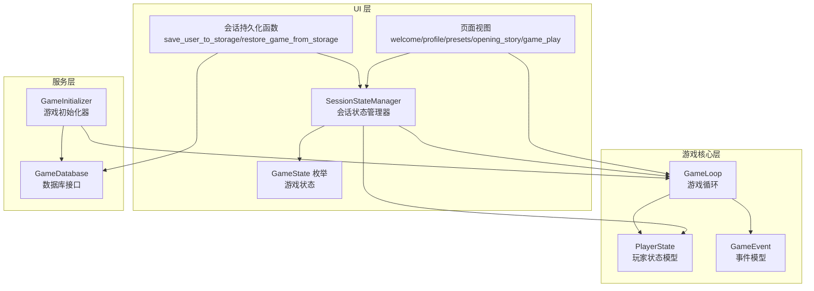
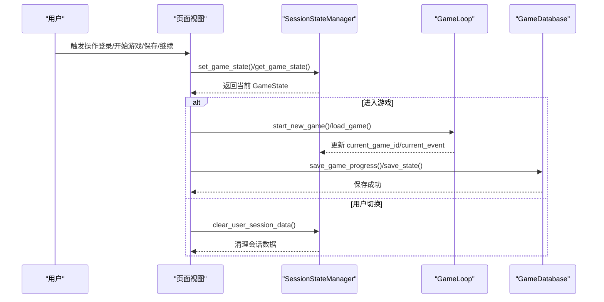
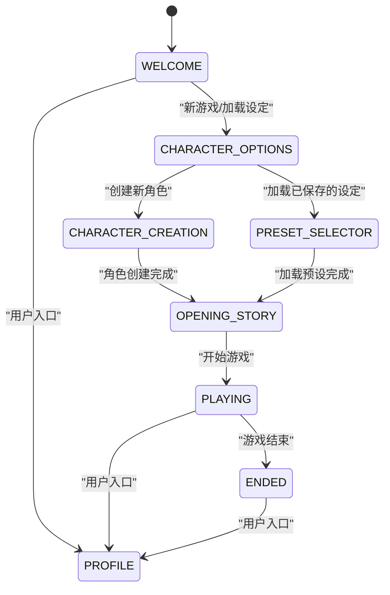
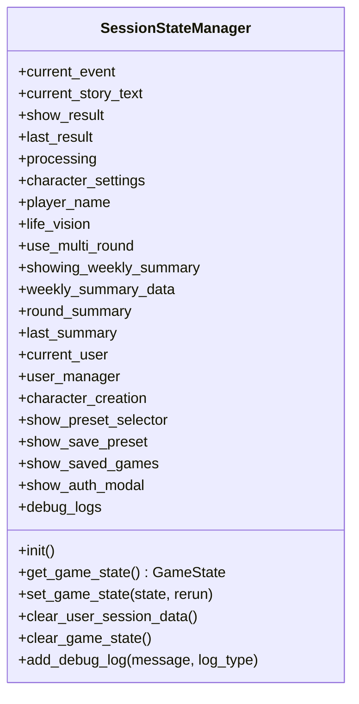
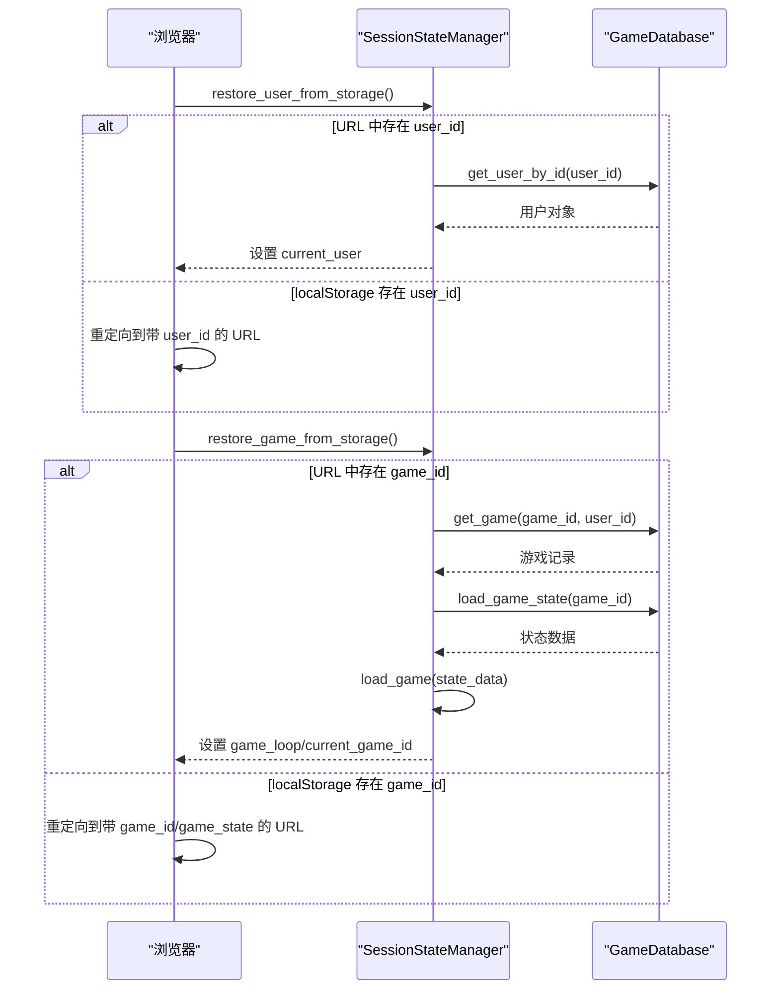
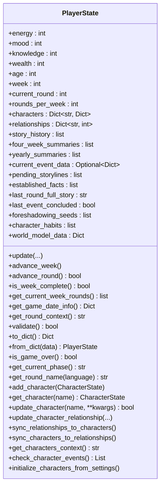
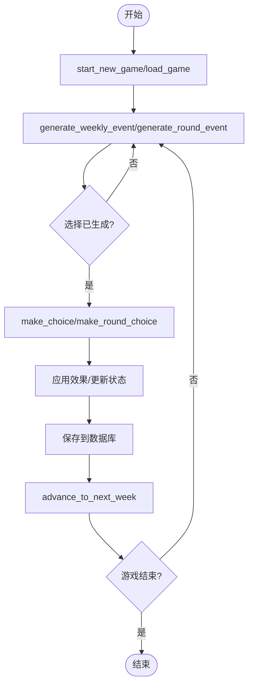
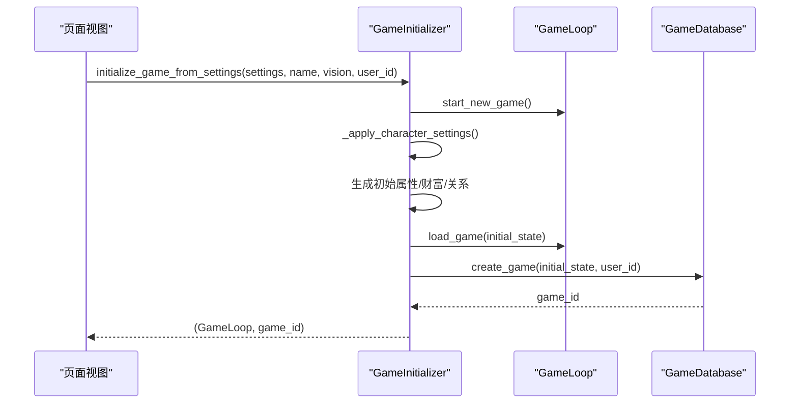
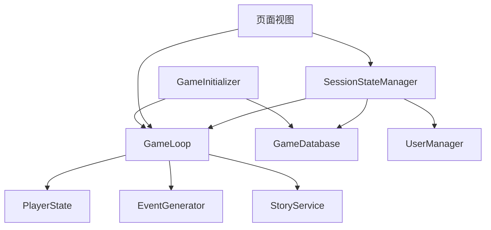

# 状态管理系统

<cite>
**本文档引用的文件**
- [src/ui/state_manager.py](file://src/ui/state_manager.py)
- [src/ui/session_manager.py](file://src/ui/session_manager.py)
- [src/game/state.py](file://src/game/state.py)
- [src/game/game_loop.py](file://src/game/game_loop.py)
- [src/ui/page_views/profile.py](file://src/ui/page_views/profile.py)
- [src/ui/page_views/presets.py](file://src/ui/page_views/presets.py)
- [src/ui/page_views/welcome.py](file://src/ui/page_views/welcome.py)
- [src/ui/page_views/opening_story.py](file://src/ui/page_views/opening_story.py)
- [src/ui/page_views/game_play.py](file://src/ui/page_views/game_play.py)
- [src/ui/services/game_initializer.py](file://src/ui/services/game_initializer.py)
- [src/ui/streamlit_app.py](file://src/ui/streamlit_app.py)
- [tests/test_state.py](file://tests/test_state.py)
- [tests/test_system_flow.py](file://tests/test_system_flow.py)
</cite>

## 目录
1. [简介](#简介)
2. [项目结构](#项目结构)
3. [核心组件](#核心组件)
4. [架构总览](#架构总览)
5. [详细组件分析](#详细组件分析)
6. [依赖关系分析](#依赖关系分析)
7. [性能考虑](#性能考虑)
8. [故障排除指南](#故障排除指南)
9. [结论](#结论)
10. [附录](#附录)

## 简介
本文件系统性阐述本项目的**状态管理系统**，重点覆盖以下方面：
- 会话状态管理与全局状态控制器的设计与实现
- GameState 枚举的状态定义与状态转换逻辑
- SessionManager 类的会话持久化机制（用户状态恢复、游戏进度保存、自动重连）
- StateManager 类的全局状态协调机制（状态同步、事件通知、状态变更监听）
- 状态管理架构图、状态转换流程图以及关键 API 使用示例

本系统采用 Streamlit 应用与 Pydantic 数据模型相结合的方式，确保状态的类型安全、可序列化与跨页面一致性。

## 项目结构
状态管理相关的代码主要分布在以下模块：
- UI 层：状态管理器、页面视图、会话持久化工具
- 游戏核心层：玩家状态模型、游戏循环与事件处理
- 服务层：游戏初始化器、数据库交互

图表来源
- [src/ui/state_manager.py](file://src/ui/state_manager.py#L29-L39)
- [src/ui/page_views/welcome.py](file://src/ui/page_views/welcome.py#L11-L285)
- [src/ui/page_views/opening_story.py](file://src/ui/page_views/opening_story.py#L11-L120)
- [src/ui/page_views/game_play.py](file://src/ui/page_views/game_play.py#L18-L662)
- [src/game/state.py](file://src/game/state.py#L244-L709)
- [src/game/game_loop.py](file://src/game/game_loop.py#L24-L800)
- [src/ui/services/game_initializer.py](file://src/ui/services/game_initializer.py#L49-L155)

章节来源
- [src/ui/state_manager.py](file://src/ui/state_manager.py#L1-L773)
- [src/game/state.py](file://src/game/state.py#L1-L709)
- [src/game/game_loop.py](file://src/game/game_loop.py#L1-L1216)

## 核心组件
本节概述状态管理的关键组件及其职责。

- GameState 枚举：定义 UI 层的全部状态，包括欢迎页、角色创建、预设选择、开场故事、游戏进行、结束、个人资料等。
- SessionStateManager：集中式会话状态管理器，提供类型安全的 getter/setter、初始化、清理、持久化与恢复功能。
- GameLoop：游戏主循环，负责事件生成、决策处理、周/轮推进、总结生成与持久化。
- PlayerState：玩家状态模型，承载资源、关系、事件、总结、世界模型等数据，并提供验证与序列化。
- GameInitializer：统一的游戏初始化服务，将角色设定应用到初始状态并创建数据库记录。
- 页面视图：根据当前 GameState 渲染对应页面，驱动状态转换。

章节来源
- [src/ui/state_manager.py](file://src/ui/state_manager.py#L29-L39)
- [src/ui/state_manager.py](file://src/ui/state_manager.py#L42-L536)
- [src/game/game_loop.py](file://src/game/game_loop.py#L24-L800)
- [src/game/state.py](file://src/game/state.py#L244-L709)
- [src/ui/services/game_initializer.py](file://src/ui/services/game_initializer.py#L49-L155)

## 架构总览
状态管理采用“UI 状态 + 游戏状态”的双层架构：
- UI 状态：由 SessionStateManager 统一管理，保证页面间状态一致与类型安全。
- 游戏状态：由 PlayerState 与 GameLoop 协同维护，支持事件流、决策流与总结流。

图表来源
- [src/ui/state_manager.py](file://src/ui/state_manager.py#L215-L244)
- [src/ui/page_views/welcome.py](file://src/ui/page_views/welcome.py#L138-L177)
- [src/ui/page_views/game_play.py](file://src/ui/page_views/game_play.py#L100-L127)
- [src/game/game_loop.py](file://src/game/game_loop.py#L62-L92)

## 详细组件分析

### GameState 枚举与状态转换逻辑
GameState 定义了 UI 层的全部状态，涵盖从欢迎页到游戏结束的完整流程。各状态职责如下：
- WELCOME：欢迎页，提供新游戏、加载设定、继续游戏、加载存档等入口。
- CHARACTER_OPTIONS：角色创建入口，支持新建角色或加载预设。
- CHARACTER_CREATION：角色创建流程（由 UI 控制器渲染）。
- PRESET_SELECTOR：预设选择与管理页面。
- SAVE_PRESET：保存预设对话框。
- OPENING_STORY：开场故事页面，展示生成的故事并引导进入 PLAYING。
- PLAYING：主游戏页面，事件展示、选项选择、结果反馈与周/轮推进。
- ENDED：游戏结束页面，展示结局与统计。
- PROFILE：个人资料页，登录/注册/好友管理。

状态转换流程（简化）：
- WELCOME → CHARACTER_OPTIONS → CHARACTER_CREATION 或 PRESET_SELECTOR
- CHARACTER_CREATION → OPENING_STORY → PLAYING
- PRESET_SELECTOR → OPENING_STORY → PLAYING
- PLAYING → ENDED（游戏结束）
- 任意状态 → PROFILE（用户入口）

图表来源
- [src/ui/state_manager.py](file://src/ui/state_manager.py#L29-L39)
- [src/ui/page_views/welcome.py](file://src/ui/page_views/welcome.py#L138-L177)
- [src/ui/page_views/opening_story.py](file://src/ui/page_views/opening_story.py#L105-L119)
- [src/ui/page_views/game_play.py](file://src/ui/page_views/game_play.py#L69-L98)

章节来源
- [src/ui/state_manager.py](file://src/ui/state_manager.py#L29-L39)
- [src/ui/page_views/welcome.py](file://src/ui/page_views/welcome.py#L11-L285)
- [src/ui/page_views/opening_story.py](file://src/ui/page_views/opening_story.py#L11-L120)
- [src/ui/page_views/game_play.py](file://src/ui/page_views/game_play.py#L18-L662)

### SessionStateManager：会话状态管理器
SessionStateManager 提供类型安全的会话状态访问与管理，核心能力包括：
- 初始化：按类别初始化核心状态、事件状态、角色创建状态、多轮系统状态、用户状态、UI 标志与调试状态。
- 状态访问：提供属性访问器与 setter，统一读写 st.session_state。
- 事件管理：current_event 的单一可信来源，确保与 GameLoop 同步。
- 用户与游戏持久化：保存/恢复用户 ID 与游戏 ID/状态至 URL 参数与 localStorage，支持断线重连。
- 清理：按需清理用户会话数据或游戏状态，便于重新开始。

图表来源
- [src/ui/state_manager.py](file://src/ui/state_manager.py#L42-L536)

章节来源
- [src/ui/state_manager.py](file://src/ui/state_manager.py#L67-L175)
- [src/ui/state_manager.py](file://src/ui/state_manager.py#L215-L290)
- [src/ui/state_manager.py](file://src/ui/state_manager.py#L512-L535)
- [src/ui/state_manager.py](file://src/ui/state_manager.py#L549-L773)

### 会话持久化机制：用户与游戏恢复
系统提供两套持久化策略，确保断线重连与跨页面恢复：
- 用户持久化：将用户 ID 写入 URL 查询参数与 localStorage，支持从 URL 或 localStorage 恢复。
- 游戏持久化：将游戏 ID 与目标状态值写入 URL 与 localStorage，支持从 URL 或 localStorage 恢复。

图表来源
- [src/ui/state_manager.py](file://src/ui/state_manager.py#L587-L773)

章节来源
- [src/ui/state_manager.py](file://src/ui/state_manager.py#L587-L773)

### StateManager：全局状态协调
全局状态协调体现在以下方面：
- 单一可信来源：current_event 仅由 GameLoop 提供，SessionStateManager 在设置时同步更新 GameLoop。
- 状态同步：set_game_state 支持触发 st.rerun()，确保 UI 立即响应状态变化。
- 事件通知：通过回调与状态字段（如 show_result、last_result、current_event）实现事件驱动的 UI 更新。
- 状态变更监听：通过 st.session_state 的键值变化触发 rerun，实现响应式状态管理。

章节来源
- [src/ui/state_manager.py](file://src/ui/state_manager.py#L247-L290)
- [src/ui/state_manager.py](file://src/ui/state_manager.py#L233-L244)

### PlayerState：玩家状态模型
PlayerState 是游戏状态的核心载体，包含：
- 基础属性：能量、情绪、知识、财富、年龄、周数等
- 关系系统：NPC 角色集合与亲密度、信任度、尊重度等
- 时间与回合：周数、每轮回合数、回合历史与周总结
- 事件与故事：当前事件数据、故事历史、四周期与年度总结
- 世界模型：地点、职业、承诺、因果链、身体状态等结构化数据
- 伏笔系统：草蛇灰线引擎的种子与指标

图表来源
- [src/game/state.py](file://src/game/state.py#L244-L709)

章节来源
- [src/game/state.py](file://src/game/state.py#L244-L709)

### GameLoop：游戏循环与事件处理
GameLoop 负责：
- 启动/加载游戏：start_new_game/load_game
- 事件生成：generate_weekly_event/generate_round_event
- 决策处理：make_choice/make_round_choice/make_custom_choice
- 周/轮推进：advance_to_next_week
- 总结生成：四周期与年度总结
- 世界模型与关系事件：构建世界模型、检测关系事件并标记触发

图表来源
- [src/game/game_loop.py](file://src/game/game_loop.py#L62-L153)
- [src/game/game_loop.py](file://src/game/game_loop.py#L154-L257)
- [src/game/game_loop.py](file://src/game/game_loop.py#L258-L300)
- [src/game/game_loop.py](file://src/game/game_loop.py#L301-L351)
- [src/game/game_loop.py](file://src/game/game_loop.py#L352-L497)

章节来源
- [src/game/game_loop.py](file://src/game/game_loop.py#L24-L800)

### GameInitializer：游戏初始化服务
GameInitializer 将角色设定应用到初始状态，生成初始属性与关系，并创建数据库记录，最后加载到 GameLoop 中。

图表来源
- [src/ui/services/game_initializer.py](file://src/ui/services/game_initializer.py#L63-L138)

章节来源
- [src/ui/services/game_initializer.py](file://src/ui/services/game_initializer.py#L49-L155)

### 页面视图与状态转换
页面视图根据 GameState 渲染对应内容，并通过 set_game_state 驱动状态转换：
- welcome：提供新游戏、加载设定、继续游戏、加载存档等入口；支持登录/注册模态框。
- profile：个人资料页，支持登出与好友管理。
- presets：预设选择与保存对话框。
- opening_story：开场故事生成与展示，完成后进入 PLAYING。
- game_play：主游戏页面，事件展示、选项选择、结果反馈、周/轮推进与总结生成。

章节来源
- [src/ui/page_views/welcome.py](file://src/ui/page_views/welcome.py#L11-L285)
- [src/ui/page_views/profile.py](file://src/ui/page_views/profile.py#L10-L184)
- [src/ui/page_views/presets.py](file://src/ui/page_views/presets.py#L15-L425)
- [src/ui/page_views/opening_story.py](file://src/ui/page_views/opening_story.py#L11-L120)
- [src/ui/page_views/game_play.py](file://src/ui/page_views/game_play.py#L18-L662)

## 依赖关系分析
状态管理系统的依赖关系如下：
- SessionStateManager 依赖 GameLoop、GameDatabase、UserManager 等组件，统一管理 st.session_state。
- 页面视图依赖 SessionStateManager 与 GameLoop，驱动状态转换与 UI 更新。
- GameLoop 依赖 PlayerState、EventGenerator、StoryService、YearlySummaryGenerator 等，处理事件与总结。
- GameInitializer 依赖 GameLoop 与 GameDatabase，完成初始化与持久化。

图表来源
- [src/ui/state_manager.py](file://src/ui/state_manager.py#L82-L83)
- [src/ui/state_manager.py](file://src/ui/state_manager.py#L150-L152)
- [src/game/game_loop.py](file://src/game/game_loop.py#L44-L56)
- [src/ui/services/game_initializer.py](file://src/ui/services/game_initializer.py#L90-L138)

章节来源
- [src/ui/state_manager.py](file://src/ui/state_manager.py#L1-L773)
- [src/game/game_loop.py](file://src/game/game_loop.py#L1-L1216)
- [src/ui/services/game_initializer.py](file://src/ui/services/game_initializer.py#L1-L155)

## 性能考虑
- 事件生成与决策处理采用流式回调，减少一次性渲染压力，提升用户体验。
- 状态持久化采用数据库批量保存，避免频繁 IO。
- 多轮系统通过回合计数与周推进控制事件生成频率，防止重复生成。
- 会话状态清理与持久化函数避免内存泄漏与冗余数据。

## 故障排除指南
常见问题与解决建议：
- 事件生成失败：检查 OPENAI_API_KEY 配置，查看日志输出，必要时启用回退事件。
- 会话恢复失败：确认 URL 参数与 localStorage 中的 user_id/game_id/game_state 是否匹配，清理无效存储后重试。
- 状态不一致：确保 current_event 仅通过 GameLoop 提供，避免直接修改 st.session_state 中的 current_event。
- 游戏结束未正确触发：检查 PlayerState.week 与 settings.TOTAL_WEEKS 的比较逻辑。

章节来源
- [src/ui/page_views/game_play.py](file://src/ui/page_views/game_play.py#L369-L381)
- [src/ui/state_manager.py](file://src/ui/state_manager.py#L662-L773)
- [src/game/state.py](file://src/game/state.py#L562-L566)

## 结论
本状态管理系统通过类型安全的 SessionStateManager、可序列化的 PlayerState 与事件驱动的 GameLoop，实现了 UI 状态与游戏状态的协同管理。会话持久化与自动重连机制提升了用户体验，而清晰的状态转换与依赖关系图有助于系统的扩展与维护。

## 附录

### 关键 API 使用示例（路径引用）
- 初始化会话状态
  - [init_session_state](file://src/ui/session_manager.py#L31-L35)
- 获取/设置游戏状态
  - [get_game_state](file://src/ui/session_manager.py#L37-L41)
  - [set_game_state](file://src/ui/session_manager.py#L43-L47)
- 用户与游戏持久化
  - [save_user_to_storage](file://src/ui/state_manager.py#L552-L567)
  - [restore_user_from_storage](file://src/ui/state_manager.py#L587-L626)
  - [save_game_to_storage](file://src/ui/state_manager.py#L628-L642)
  - [restore_game_from_storage](file://src/ui/state_manager.py#L662-L773)
- 清理会话数据
  - [clear_user_session_data](file://src/ui/state_manager.py#L512-L524)
  - [clear_game_state](file://src/ui/state_manager.py#L525-L535)
- 游戏初始化
  - [initialize_game_from_settings](file://src/ui/services/game_initializer.py#L63-L138)
- 页面渲染与状态转换
  - [render_welcome](file://src/ui/page_views/welcome.py#L11-L285)
  - [render_opening_story](file://src/ui/page_views/opening_story.py#L11-L120)
  - [render_game_play](file://src/ui/page_views/game_play.py#L18-L662)