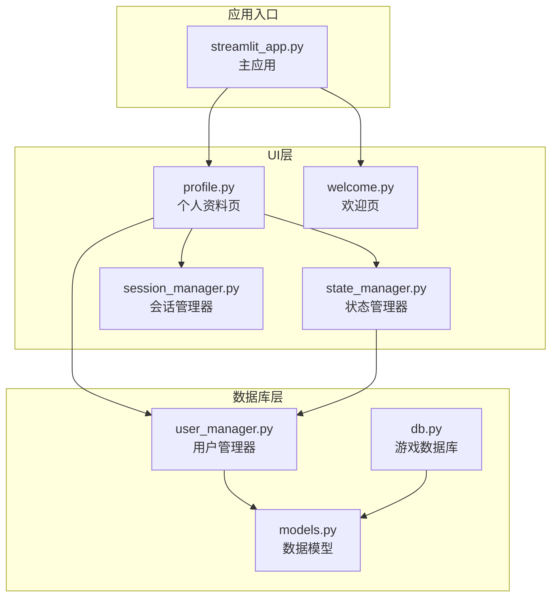
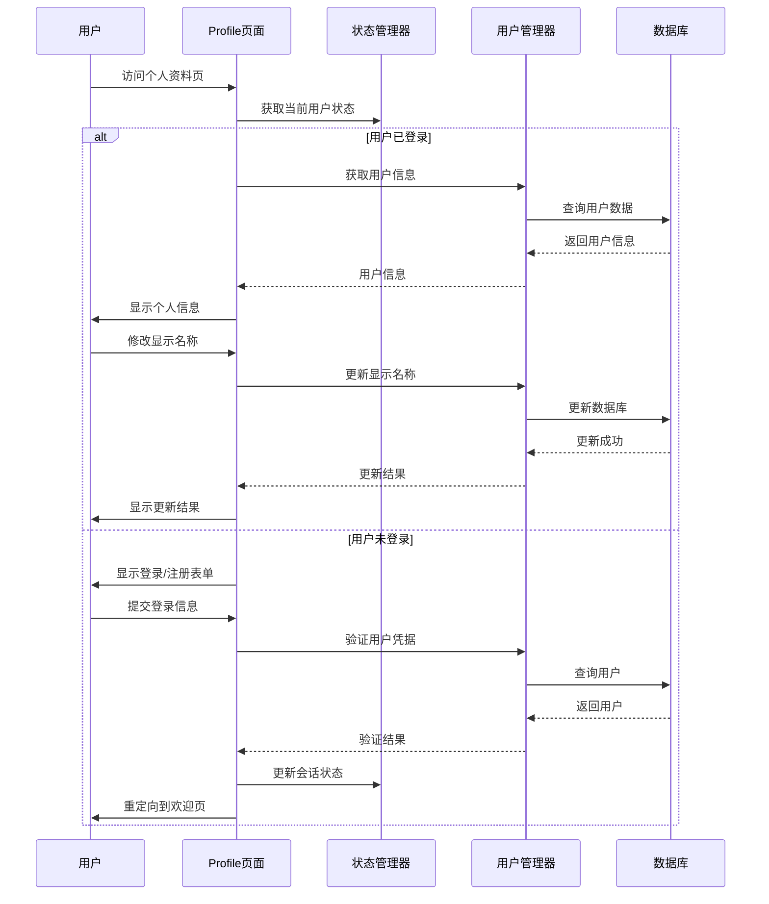
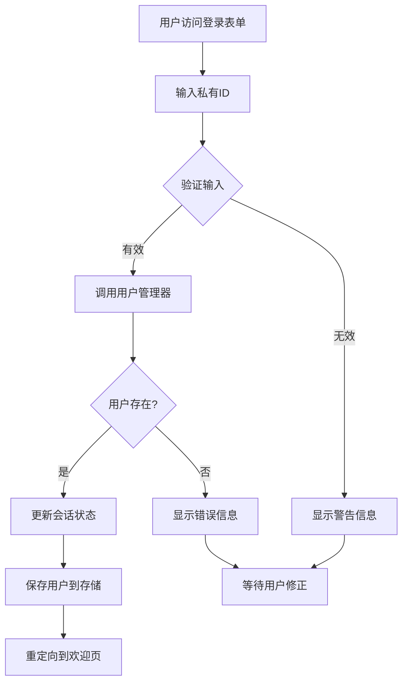
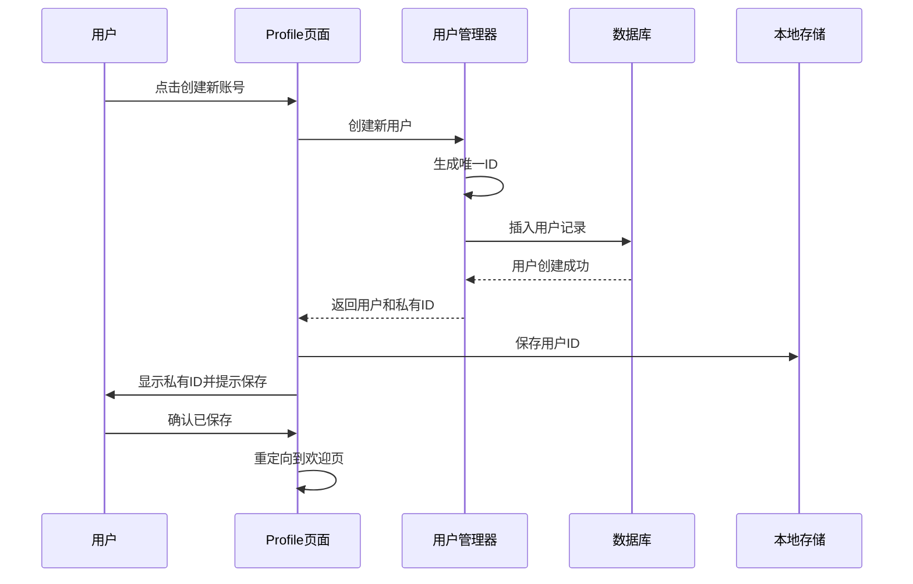
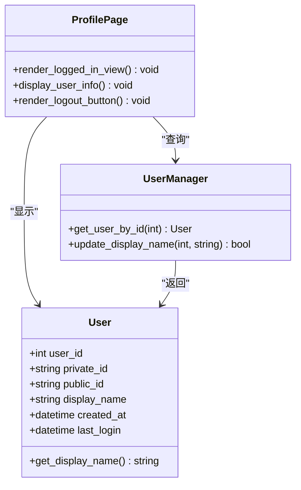
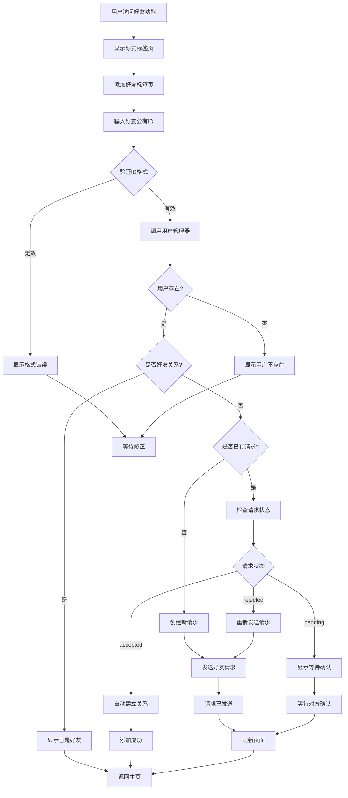
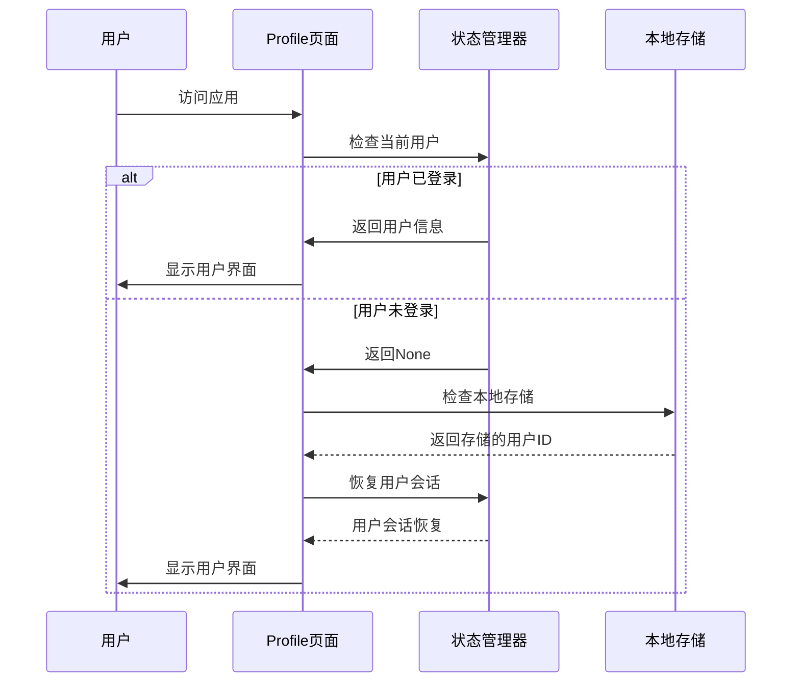
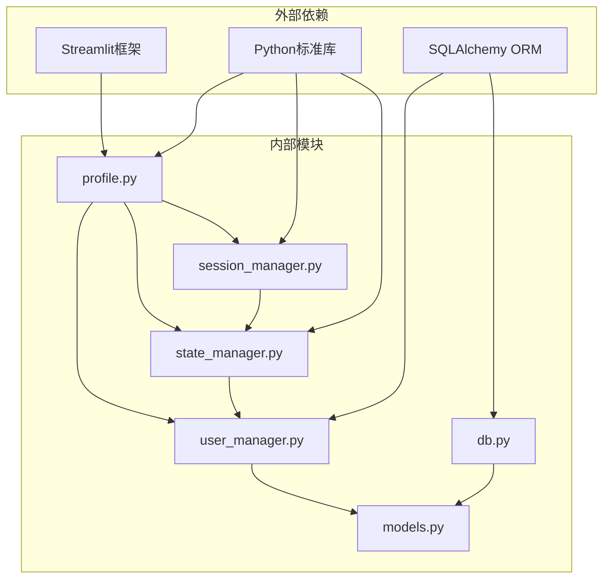

# 个人资料页

<cite>
**本文档引用的文件**
- [src/ui/page_views/profile.py](file://src/ui/page_views/profile.py)
- [src/database/user_manager.py](file://src/database/user_manager.py)
- [src/database/models.py](file://src/database/models.py)
- [src/ui/state_manager.py](file://src/ui/state_manager.py)
- [src/ui/session_manager.py](file://src/ui/session_manager.py)
- [src/ui/streamlit_app.py](file://src/ui/streamlit_app.py)
- [src/ui/page_views/welcome.py](file://src/ui/page_views/welcome.py)
- [src/database/db.py](file://src/database/db.py)
</cite>

## 目录
1. [简介](#简介)
2. [项目结构](#项目结构)
3. [核心组件](#核心组件)
4. [架构概览](#架构概览)
5. [详细组件分析](#详细组件分析)
6. [依赖关系分析](#依赖关系分析)
7. [性能考虑](#性能考虑)
8. [故障排除指南](#故障排除指南)
9. [结论](#结论)

## 简介

个人资料页是故事2项目中的核心用户界面组件，负责管理用户信息和配置设置。该页面实现了完整的用户认证系统、个人信息管理、好友社交功能以及数据持久化机制。

本文档深入分析了个人资料页的实现细节，包括用户信息编辑表单、设置配置页面设计、头像上传和图片处理功能，以及数据持久化机制。同时提供了关键实现代码示例和最佳实践指导。

## 项目结构

个人资料页位于UI层的page_views模块中，采用模块化设计，与其他组件保持松耦合关系：

**图表来源**
- [src/ui/page_views/profile.py](file://src/ui/page_views/profile.py#L1-L184)
- [src/database/user_manager.py](file://src/database/user_manager.py#L1-L401)
- [src/database/models.py](file://src/database/models.py#L1-L171)

**章节来源**
- [src/ui/page_views/profile.py](file://src/ui/page_views/profile.py#L1-L184)
- [src/ui/streamlit_app.py](file://src/ui/streamlit_app.py#L1-L215)

## 核心组件

个人资料页由多个核心组件构成，每个组件都有明确的职责分工：

### 用户认证组件
- **登录/注册表单**：处理用户身份验证
- **会话管理**：维护用户登录状态
- **权限控制**：基于用户状态显示相应内容

### 个人信息管理组件
- **用户信息展示**：显示用户基本信息
- **显示名称编辑**：允许用户修改显示名称
- **好友管理系统**：支持添加好友、管理好友关系

### 数据持久化组件
- **URL参数持久化**：通过查询参数保持用户状态
- **localStorage备份**：提供浏览器本地存储支持
- **数据库同步**：确保用户数据的一致性

**章节来源**
- [src/ui/page_views/profile.py](file://src/ui/page_views/profile.py#L33-L104)
- [src/database/user_manager.py](file://src/database/user_manager.py#L68-L161)

## 架构概览

个人资料页采用分层架构设计，确保各层职责清晰分离：

**图表来源**
- [src/ui/page_views/profile.py](file://src/ui/page_views/profile.py#L10-L31)
- [src/database/user_manager.py](file://src/database/user_manager.py#L104-L126)
- [src/ui/state_manager.py](file://src/ui/state_manager.py#L552-L566)

## 详细组件分析

### 用户认证系统

个人资料页实现了完整的用户认证流程，包括登录、注册和会话管理：

#### 登录表单实现
登录表单采用简洁直观的设计，支持私有ID登录：

**图表来源**
- [src/ui/page_views/profile.py](file://src/ui/page_views/profile.py#L145-L166)
- [src/database/user_manager.py](file://src/database/user_manager.py#L104-L126)

#### 注册流程设计
注册流程确保用户获得唯一的私有ID，并提供安全提醒：

**图表来源**
- [src/ui/page_views/profile.py](file://src/ui/page_views/profile.py#L169-L183)
- [src/database/user_manager.py](file://src/database/user_manager.py#L68-L102)

**章节来源**
- [src/ui/page_views/profile.py](file://src/ui/page_views/profile.py#L145-L183)
- [src/database/user_manager.py](file://src/database/user_manager.py#L68-L126)

### 个人信息管理

#### 用户信息展示
个人资料页为已登录用户提供完整的信息展示：

**图表来源**
- [src/database/models.py](file://src/database/models.py#L11-L38)
- [src/ui/page_views/profile.py](file://src/ui/page_views/profile.py#L33-L54)

#### 显示名称编辑功能
用户可以修改自己的显示名称，系统提供长度限制和验证：

**章节来源**
- [src/ui/page_views/profile.py](file://src/ui/page_views/profile.py#L33-L54)
- [src/database/user_manager.py](file://src/database/user_manager.py#L145-L161)

### 好友社交系统

个人资料页集成了完整的社交功能，包括好友添加、管理和请求处理：

**图表来源**
- [src/ui/page_views/profile.py](file://src/ui/page_views/profile.py#L60-L104)
- [src/database/user_manager.py](file://src/database/user_manager.py#L165-L224)

**章节来源**
- [src/ui/page_views/profile.py](file://src/ui/page_views/profile.py#L57-L104)
- [src/database/user_manager.py](file://src/database/user_manager.py#L165-L224)

### 数据持久化机制

个人资料页实现了多层数据持久化策略，确保用户体验的连续性：

#### URL参数持久化
系统通过URL查询参数保持用户状态：

**图表来源**
- [src/ui/state_manager.py](file://src/ui/state_manager.py#L587-L625)

#### 本地存储备份
提供localStorage作为URL参数的备份机制：

**章节来源**
- [src/ui/state_manager.py](file://src/ui/state_manager.py#L552-L566)
- [src/ui/state_manager.py](file://src/ui/state_manager.py#L587-L625)

### 错误处理和验证

个人资料页实现了全面的错误处理机制：

#### 输入验证
- **私有ID格式验证**：自动标准化输入格式
- **显示名称长度限制**：防止过长的用户名
- **好友ID有效性检查**：确保公有ID格式正确

#### 错误反馈
- **实时验证反馈**：即时显示输入错误
- **友好错误消息**：提供清晰的错误说明
- **状态恢复**：错误发生时保持界面状态

**章节来源**
- [src/database/user_manager.py](file://src/database/user_manager.py#L104-L126)
- [src/database/user_manager.py](file://src/database/user_manager.py#L145-L161)

## 依赖关系分析

个人资料页的依赖关系体现了清晰的分层架构：

**图表来源**
- [src/ui/page_views/profile.py](file://src/ui/page_views/profile.py#L1-L8)
- [src/database/user_manager.py](file://src/database/user_manager.py#L1-L12)

### 关键依赖点

1. **状态管理依赖**：Profile页面依赖状态管理器获取用户状态
2. **数据库访问依赖**：用户管理器提供数据库操作接口
3. **会话管理依赖**：会话管理器处理用户会话生命周期

**章节来源**
- [src/ui/page_views/profile.py](file://src/ui/page_views/profile.py#L1-L8)
- [src/database/user_manager.py](file://src/database/user_manager.py#L1-L12)

## 性能考虑

个人资料页在设计时充分考虑了性能优化：

### 数据库查询优化
- **索引使用**：用户ID和公有ID字段建立索引
- **查询缓存**：常用查询结果进行缓存
- **批量操作**：好友列表查询使用批量获取

### 前端性能优化
- **懒加载**：非关键功能延迟加载
- **状态缓存**：用户状态在内存中缓存
- **防抖处理**：输入验证防抖处理

### 内存管理
- **及时清理**：不再使用的状态及时清理
- **循环引用避免**：避免状态管理器之间的循环引用

## 故障排除指南

### 常见问题及解决方案

#### 登录失败问题
**症状**：用户输入正确私有ID但仍无法登录
**原因分析**：
- 私有ID格式不正确
- 数据库连接问题
- 会话状态异常

**解决步骤**：
1. 检查私有ID格式（8组4位字符，用-分隔）
2. 验证数据库连接状态
3. 清除浏览器缓存和Cookie
4. 重启应用服务

#### 好友添加失败
**症状**：添加好友时显示"用户不存在"
**解决方法**：
1. 确认好友公有ID格式正确
2. 检查网络连接
3. 验证好友ID是否已被使用

#### 页面刷新丢失状态
**症状**：页面刷新后用户状态丢失
**解决步骤**：
1. 检查localStorage是否启用
2. 验证浏览器Cookie设置
3. 确认URL参数是否正确传递

**章节来源**
- [src/database/user_manager.py](file://src/database/user_manager.py#L104-L126)
- [src/ui/state_manager.py](file://src/ui/state_manager.py#L587-L625)

## 结论

个人资料页作为故事2项目的核心组件，展现了优秀的软件工程实践：

### 设计优势
1. **模块化设计**：清晰的职责分离和依赖管理
2. **用户体验**：直观的界面设计和流畅的操作流程
3. **数据安全**：多重验证和错误处理机制
4. **性能优化**：合理的缓存策略和查询优化

### 技术亮点
- 完整的用户认证体系
- 实时的社交功能集成
- 稳健的数据持久化机制
- 友好的错误处理和反馈

### 改进建议
1. **头像上传功能**：当前版本未实现头像上传功能，可在未来版本中添加
2. **配置备份**：增加用户配置的云端备份功能
3. **多语言支持**：扩展国际化支持范围
4. **性能监控**：添加详细的性能指标监控

个人资料页为整个故事2项目奠定了坚实的基础，其设计原则和实现模式可作为其他Web应用开发的参考模板。