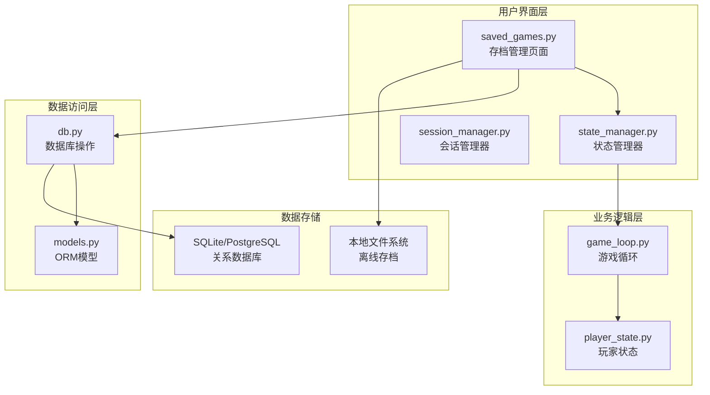
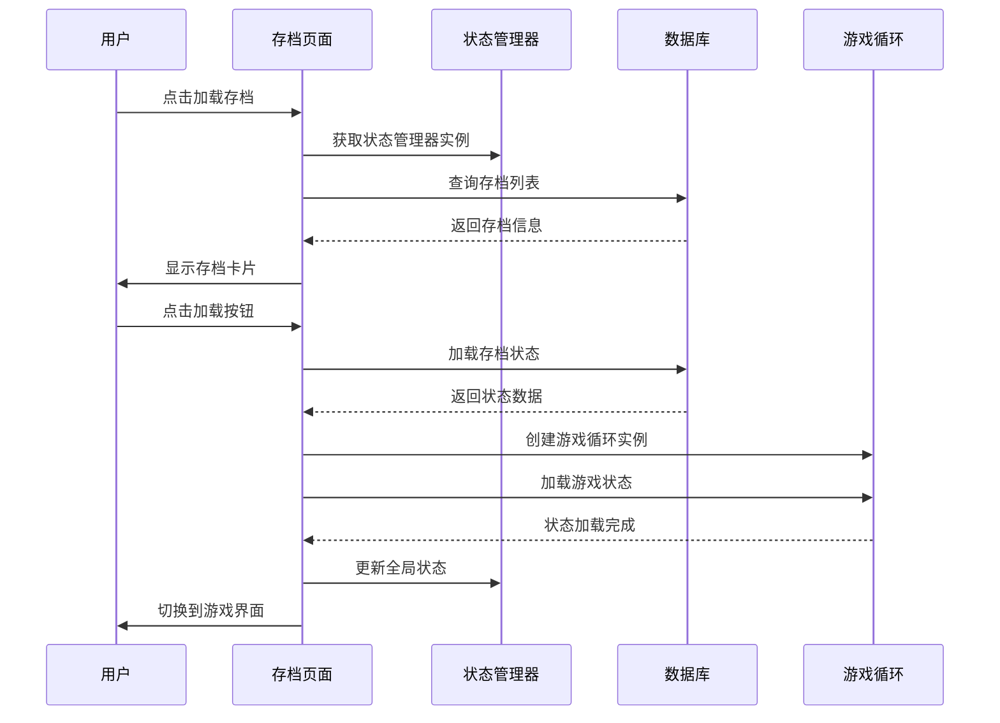
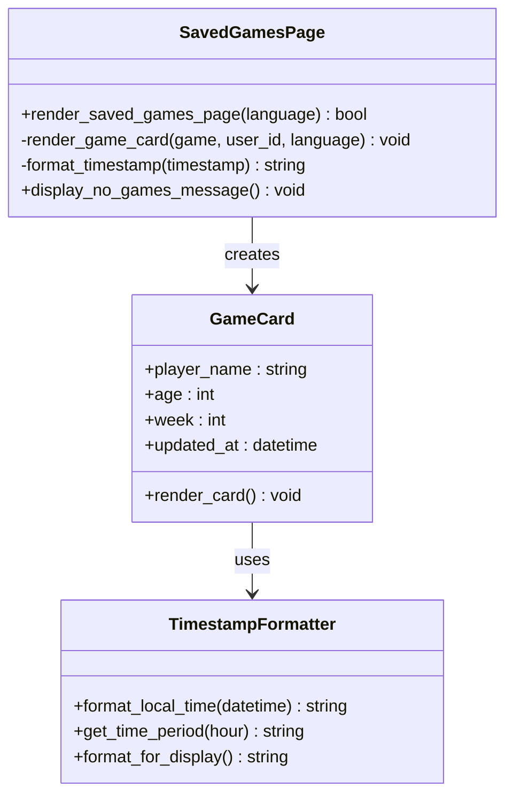
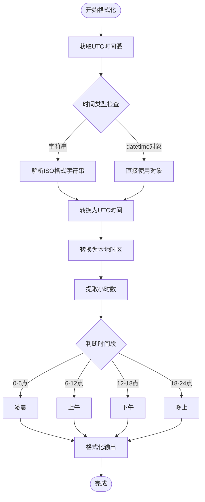
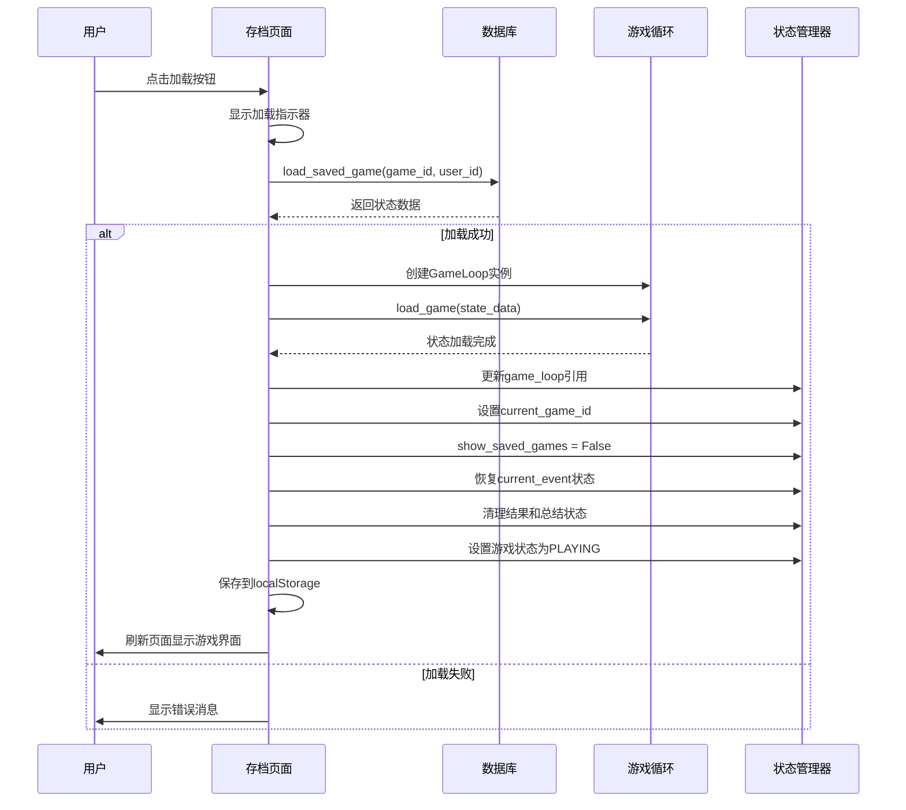
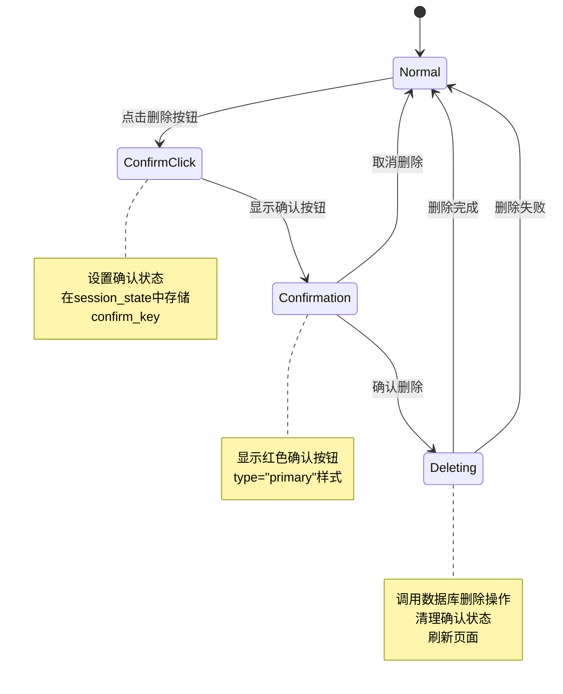
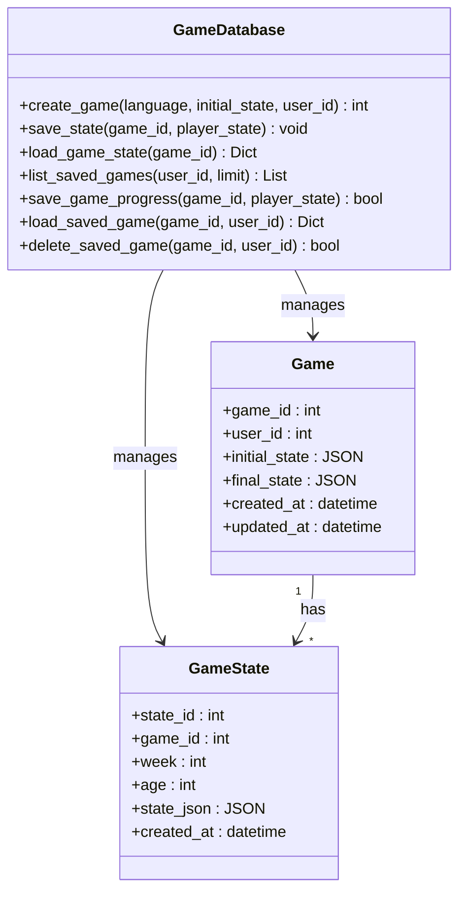
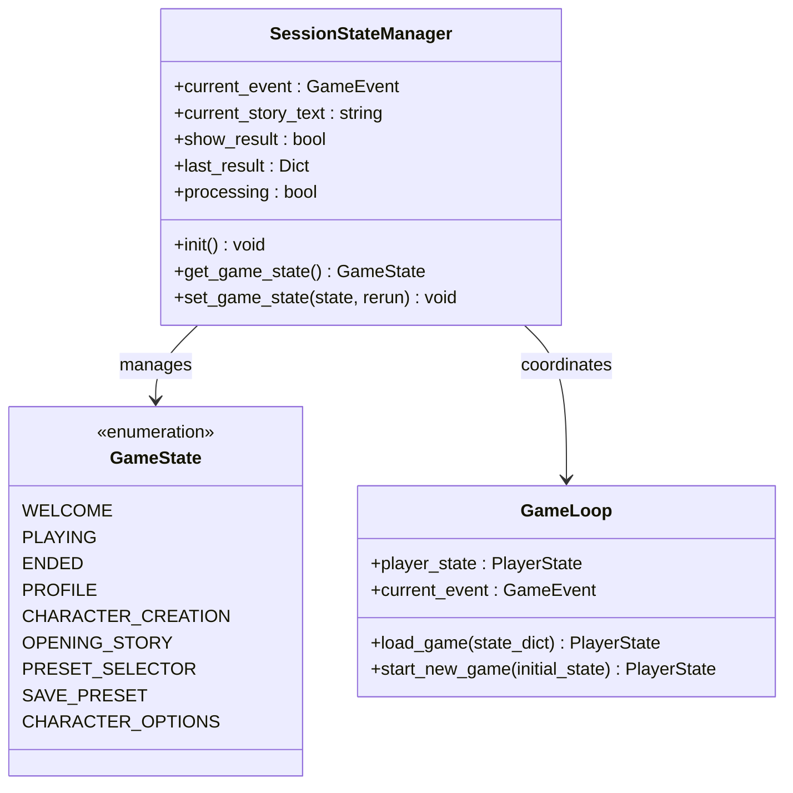
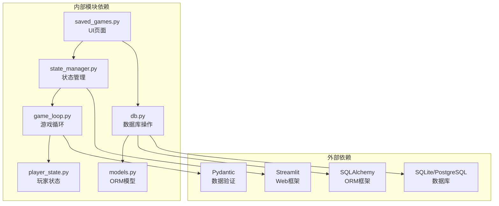

# 存档管理页

<cite>
**本文档引用的文件**
- [saved_games.py](file://src/ui/page_views/saved_games.py)
- [db.py](file://src/database/db.py)
- [models.py](file://src/database/models.py)
- [state_manager.py](file://src/ui/state_manager.py)
- [session_manager.py](file://src/ui/session_manager.py)
- [game_loop.py](file://src/game/game_loop.py)
- [state.py](file://src/game/state.py)
- [cli.py](file://src/ui/cli.py)
- [test_database.py](file://tests/test_database.py)
</cite>

## 目录
1. [简介](#简介)
2. [项目结构](#项目结构)
3. [核心组件](#核心组件)
4. [架构概览](#架构概览)
5. [详细组件分析](#详细组件分析)
6. [依赖分析](#依赖分析)
7. [性能考虑](#性能考虑)
8. [故障排除指南](#故障排除指南)
9. [结论](#结论)

## 简介

存档管理页是游戏进度保存和加载机制的核心界面，为用户提供了一个直观的界面来管理他们的游戏进度。该页面实现了完整的存档生命周期管理，包括存档列表展示、进度恢复、状态重建、删除确认等功能。

本系统采用分层架构设计，将用户界面、业务逻辑和数据持久化清晰分离。通过Streamlit框架实现响应式用户界面，使用SQLAlchemy进行数据持久化，结合Pydantic模型确保数据完整性。

## 项目结构

存档管理功能分布在多个模块中，形成了清晰的职责分离：

**图表来源**
- [saved_games.py](file://src/ui/page_views/saved_games.py#L1-L180)
- [db.py](file://src/database/db.py#L1-L517)
- [models.py](file://src/database/models.py#L1-L171)

**章节来源**
- [saved_games.py](file://src/ui/page_views/saved_games.py#L1-L180)
- [db.py](file://src/database/db.py#L1-L517)
- [models.py](file://src/database/models.py#L1-L171)

## 核心组件

### 存档管理页面组件

存档管理页面是用户交互的主要入口，提供了完整的存档管理功能：

- **存档列表展示**：显示用户的可用存档，包括玩家名称、年龄、周数和最后更新时间
- **加载功能**：从数据库恢复游戏状态，重建游戏循环实例
- **删除功能**：提供安全的删除确认机制，防止误删重要存档
- **导航功能**：返回主菜单，关闭存档管理界面

### 数据库操作组件

数据库层负责存档的持久化存储，提供了完整的CRUD操作：

- **存档查询**：按用户ID和时间顺序查询存档列表
- **状态加载**：从数据库恢复最新的游戏状态
- **状态保存**：将当前游戏状态保存到数据库
- **存档删除**：删除指定的存档及其关联数据

### 状态管理组件

状态管理层协调各个组件之间的状态同步：

- **全局状态管理**：统一管理应用的所有状态变量
- **用户会话管理**：处理用户登录状态和会话持久化
- **游戏状态跟踪**：维护当前游戏的运行状态

**章节来源**
- [saved_games.py](file://src/ui/page_views/saved_games.py#L12-L50)
- [db.py](file://src/database/db.py#L222-L272)
- [state_manager.py](file://src/ui/state_manager.py#L42-L536)

## 架构概览

存档管理系统采用分层架构，每层都有明确的职责分工：

**图表来源**
- [saved_games.py](file://src/ui/page_views/saved_games.py#L107-L153)
- [db.py](file://src/database/db.py#L323-L365)
- [state_manager.py](file://src/ui/state_manager.py#L732-L772)

系统架构的关键特性：

1. **分层设计**：清晰的职责分离，便于维护和扩展
2. **状态隔离**：每个组件维护自己的状态，减少耦合
3. **持久化策略**：支持数据库和文件系统的双重持久化
4. **安全性保障**：用户权限验证和数据完整性检查

## 详细组件分析

### 存档列表展示组件

存档列表组件负责显示用户的可用存档，并提供基本的存档信息：

**图表来源**
- [saved_games.py](file://src/ui/page_views/saved_games.py#L53-L105)

存档信息显示功能包括：

- **玩家基本信息**：显示玩家名称和年龄
- **进度信息**：显示当前周数和总周数
- **时间信息**：显示最后更新时间，支持本地化格式
- **样式设计**：使用CSS样式美化存档卡片外观

时间格式化逻辑：

**图表来源**
- [saved_games.py](file://src/ui/page_views/saved_games.py#L58-L86)

**章节来源**
- [saved_games.py](file://src/ui/page_views/saved_games.py#L53-L105)

### 存档加载功能组件

存档加载功能是整个系统的核心，负责从数据库恢复游戏状态并重建游戏环境：

**图表来源**
- [saved_games.py](file://src/ui/page_views/saved_games.py#L107-L153)
- [db.py](file://src/database/db.py#L323-L365)

加载过程的关键步骤：

1. **权限验证**：确保用户有权访问指定的存档
2. **状态检索**：从数据库获取最新的游戏状态
3. **状态重建**：使用GameLoop重新构建游戏环境
4. **状态同步**：同步相关的事件和故事状态
5. **界面切换**：切换到游戏主界面

**章节来源**
- [saved_games.py](file://src/ui/page_views/saved_games.py#L107-L153)
- [db.py](file://src/database/db.py#L323-L365)

### 存档删除功能组件

删除功能提供了安全的确认机制，防止误删重要存档：

**图表来源**
- [saved_games.py](file://src/ui/page_views/saved_games.py#L155-L179)

删除流程的安全机制：

1. **双阶段确认**：第一次点击设置确认状态，第二次确认执行删除
2. **视觉反馈**：使用不同的按钮样式区分正常和确认状态
3. **状态清理**：删除成功后清理确认状态，防止状态泄漏
4. **错误处理**：删除失败时保持原有状态不变

**章节来源**
- [saved_games.py](file://src/ui/page_views/saved_games.py#L155-L179)

### 数据库操作组件

数据库层提供了完整的存档管理功能：

**图表来源**
- [db.py](file://src/database/db.py#L10-L517)
- [models.py](file://src/database/models.py#L61-L95)

关键数据库操作：

1. **存档查询**：按用户ID和创建时间查询存档
2. **状态保存**：将玩家状态保存为JSON格式
3. **状态加载**：从数据库恢复游戏状态
4. **权限验证**：确保用户只能访问自己的存档

**章节来源**
- [db.py](file://src/database/db.py#L222-L391)
- [models.py](file://src/database/models.py#L61-L95)

### 状态管理组件

状态管理层协调各个组件之间的状态同步：

**图表来源**
- [state_manager.py](file://src/ui/state_manager.py#L29-L536)

状态管理的关键功能：

1. **全局状态维护**：统一管理应用的所有状态变量
2. **状态持久化**：支持URL参数和localStorage的持久化
3. **状态恢复**：从持久化存储恢复应用状态
4. **状态同步**：确保各组件间的状态一致性

**章节来源**
- [state_manager.py](file://src/ui/state_manager.py#L42-L536)

## 依赖分析

存档管理系统的依赖关系体现了清晰的分层架构：

**图表来源**
- [saved_games.py](file://src/ui/page_views/saved_games.py#L1-L10)
- [db.py](file://src/database/db.py#L1-L8)
- [state_manager.py](file://src/ui/state_manager.py#L1-L26)

主要依赖关系：

1. **UI层依赖**：存档页面依赖状态管理和数据库操作
2. **业务层依赖**：游戏循环依赖玩家状态模型
3. **数据层依赖**：数据库操作依赖ORM模型和SQLAlchemy
4. **外部依赖**：各层都依赖相应的Python库

**章节来源**
- [saved_games.py](file://src/ui/page_views/saved_games.py#L1-L10)
- [db.py](file://src/database/db.py#L1-L8)
- [state_manager.py](file://src/ui/state_manager.py#L1-L26)

## 性能考虑

存档管理系统的性能优化策略：

### 数据库查询优化

1. **索引优化**：在user_id和created_at字段上建立索引
2. **查询限制**：限制返回的存档数量，避免大量数据传输
3. **懒加载**：只在需要时加载完整的存档状态

### 内存管理

1. **状态清理**：及时清理不再使用的状态数据
2. **对象复用**：复用GameLoop实例，避免频繁创建销毁
3. **缓存策略**：缓存常用的查询结果

### 网络优化

1. **异步加载**：使用Streamlit的异步特性提升用户体验
2. **增量更新**：只更新发生变化的部分UI
3. **压缩传输**：对JSON数据进行适当的压缩

## 故障排除指南

### 常见问题及解决方案

#### 存档加载失败

**问题现象**：点击加载按钮后出现错误消息

**可能原因**：
1. 数据库连接异常
2. 存档数据损坏
3. 权限不足

**解决步骤**：
1. 检查数据库连接状态
2. 验证存档数据的完整性
3. 确认用户权限

#### 存档列表为空

**问题现象**：显示"暂无存档"消息

**可能原因**：
1. 用户没有创建任何游戏
2. 存档已被删除
3. 查询条件过滤

**解决步骤**：
1. 确认用户已创建游戏
2. 检查数据库中的游戏记录
3. 验证查询条件

#### 删除操作无效

**问题现象**：点击删除按钮后存档仍然存在

**可能原因**：
1. 确认机制未正确触发
2. 数据库删除失败
3. 状态未刷新

**解决步骤**：
1. 确认删除确认流程
2. 检查数据库删除操作
3. 强制刷新页面状态

**章节来源**
- [saved_games.py](file://src/ui/page_views/saved_games.py#L155-L179)
- [db.py](file://src/database/db.py#L366-L391)

### 调试技巧

1. **日志分析**：检查应用日志中的错误信息
2. **数据库检查**：直接查询数据库验证数据状态
3. **状态监控**：使用浏览器开发者工具监控状态变化

## 结论

存档管理页实现了完整的存档生命周期管理，具有以下特点：

1. **用户友好**：直观的界面设计和清晰的操作流程
2. **功能完整**：支持存档的创建、加载、删除和管理
3. **安全可靠**：完善的权限验证和数据保护机制
4. **性能优化**：合理的架构设计和性能优化策略
5. **易于维护**：清晰的代码结构和模块化设计

该系统为用户提供了可靠的存档管理功能，确保游戏进度的安全保存和快速恢复。通过分层架构设计和严格的状态管理，系统具备良好的可扩展性和维护性。