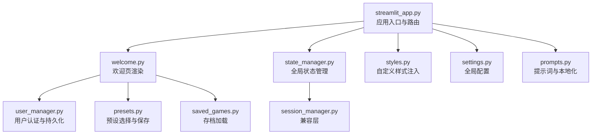
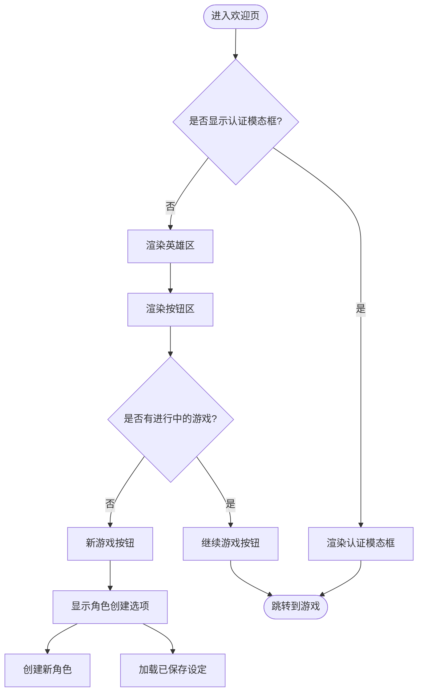
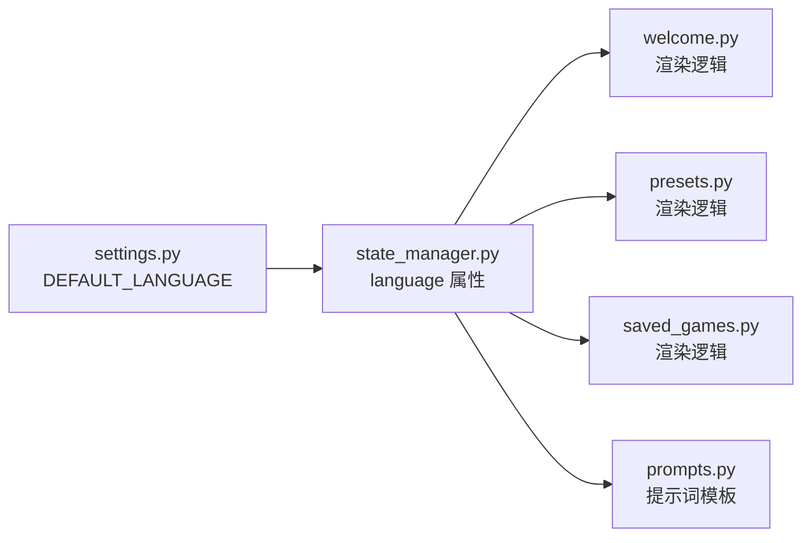
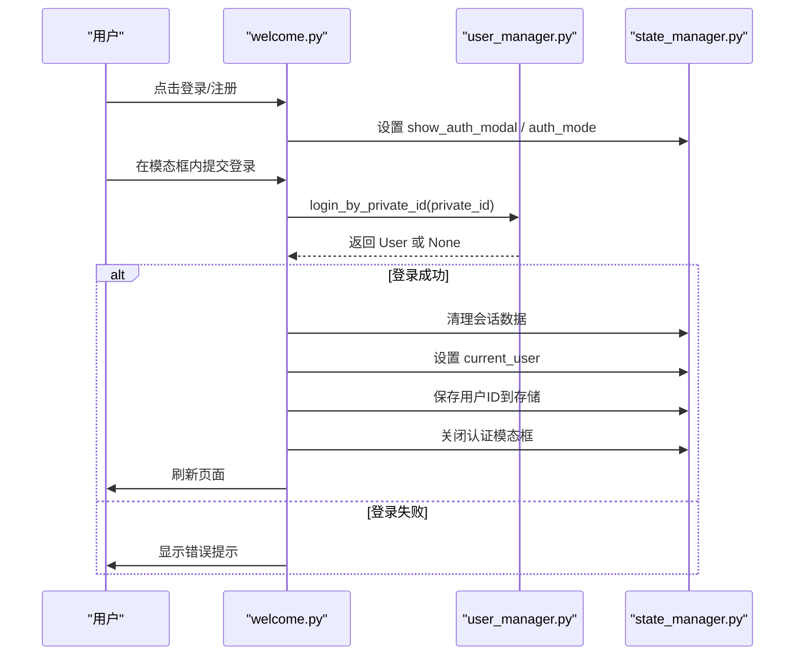
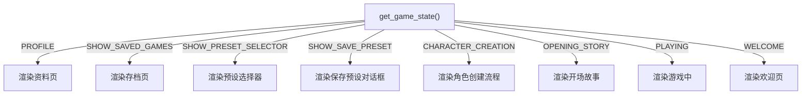
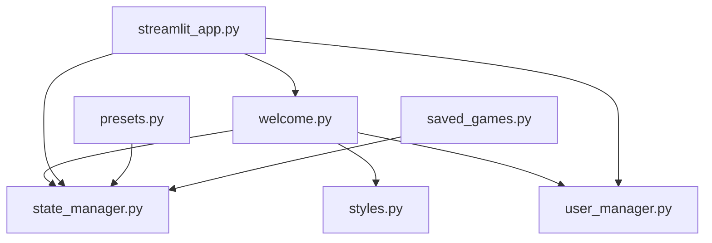

# 欢迎页设计

<cite>
**本文引用的文件**
- [welcome.py](file://src/ui/page_views/welcome.py)
- [streamlit_app.py](file://src/ui/streamlit_app.py)
- [state_manager.py](file://src/ui/state_manager.py)
- [session_manager.py](file://src/ui/session_manager.py)
- [styles.py](file://src/ui/styles.py)
- [user_manager.py](file://src/database/user_manager.py)
- [presets.py](file://src/ui/page_views/presets.py)
- [saved_games.py](file://src/ui/page_views/saved_games.py)
- [settings.py](file://config/settings.py)
- [prompts.py](file://config/prompts.py)
</cite>

## 目录
1. [简介](#简介)
2. [项目结构](#项目结构)
3. [核心组件](#核心组件)
4. [架构总览](#架构总览)
5. [详细组件分析](#详细组件分析)
6. [依赖关系分析](#依赖关系分析)
7. [性能考虑](#性能考虑)
8. [故障排查指南](#故障排查指南)
9. [结论](#结论)

## 简介
本文件聚焦于欢迎页（Welcome Page）的设计与实现，涵盖用户引导流程、交互设计、语言选择与本地化、认证流程、导航与路由、布局与响应式设计以及关键实现代码示例。目标是帮助开发者与产品人员快速理解欢迎页如何驱动用户进入游戏世界，并提供可操作的优化建议。

## 项目结构
欢迎页位于 UI 层的页面视图模块中，配合状态管理、样式注入、用户管理与路由控制共同构成完整的用户旅程。

图表来源
- [streamlit_app.py](file://src/ui/streamlit_app.py#L139-L215)
- [welcome.py](file://src/ui/page_views/welcome.py#L11-L36)
- [state_manager.py](file://src/ui/state_manager.py#L29-L40)
- [styles.py](file://src/ui/styles.py#L5-L710)
- [user_manager.py](file://src/database/user_manager.py#L34-L102)
- [presets.py](file://src/ui/page_views/presets.py#L15-L42)
- [saved_games.py](file://src/ui/page_views/saved_games.py#L12-L51)
- [settings.py](file://config/settings.py#L30-L100)
- [prompts.py](file://config/prompts.py#L1-L200)

章节来源
- [streamlit_app.py](file://src/ui/streamlit_app.py#L139-L215)
- [welcome.py](file://src/ui/page_views/welcome.py#L11-L36)

## 核心组件
- 欢迎页渲染器：负责主界面布局、按钮区、用户入口与模态框渲染。
- 状态管理器：统一管理语言、游戏状态、用户会话、UI 标志等。
- 用户管理器：提供用户创建、登录、好友、存档查询等能力。
- 页面路由：根据状态决定渲染欢迎页、角色创建、预设选择、存档加载等。
- 样式系统：注入深色主题、动画、按钮与输入框样式，支持响应式布局。
- 本地化与提示词：通过语言参数驱动界面文案与提示词模板。

章节来源
- [welcome.py](file://src/ui/page_views/welcome.py#L11-L285)
- [state_manager.py](file://src/ui/state_manager.py#L29-L535)
- [user_manager.py](file://src/database/user_manager.py#L34-L102)
- [streamlit_app.py](file://src/ui/streamlit_app.py#L139-L215)
- [styles.py](file://src/ui/styles.py#L5-L710)
- [settings.py](file://config/settings.py#L30-L100)
- [prompts.py](file://config/prompts.py#L1-L200)

## 架构总览
欢迎页采用“状态驱动”的渲染策略：应用入口根据全局状态决定当前页面；欢迎页根据语言与用户状态渲染不同的 UI 片段；认证流程通过模态框与状态切换实现；导航通过状态枚举与路由函数完成。

```mermaid
sequenceDiagram
participant U as "用户"
participant APP as "streamlit_app.py"
participant SM as "state_manager.py"
participant W as "welcome.py"
participant UM as "user_manager.py"
U->>APP : 访问应用
APP->>SM : 初始化会话状态
APP->>SM : 恢复用户/游戏状态
APP->>SM : 读取语言设置
APP->>W : 渲染欢迎页(render_welcome)
alt 用户未登录
W->>U : 显示登录/注册按钮
U->>W : 点击登录/注册
W->>SM : 设置 show_auth_modal / auth_mode
W->>U : 显示认证模态框
U->>W : 在模态框内提交登录/注册
W->>UM : 调用登录/注册接口
UM-->>W : 返回用户对象/错误
W->>SM : 更新 current_user / 清理模态框
W->>U : 刷新页面
else 用户已登录
W->>U : 显示个人资料按钮
U->>W : 点击资料按钮
W->>SM : 设置游戏状态为 PROFILE
SM-->>APP : 触发 rerun
APP->>U : 渲染资料页
end
```

图表来源
- [streamlit_app.py](file://src/ui/streamlit_app.py#L139-L215)
- [welcome.py](file://src/ui/page_views/welcome.py#L11-L285)
- [state_manager.py](file://src/ui/state_manager.py#L213-L244)
- [user_manager.py](file://src/database/user_manager.py#L68-L127)

## 详细组件分析

### 欢迎页渲染与用户引导流程
- 主入口函数：render_welcome 根据状态决定是否显示认证模态框，否则渲染欢迎英雄区与按钮区。
- 用户入口：右上角显示登录/注册按钮或当前用户的简要信息按钮，点击进入资料页。
- 英雄区：包含标题、副标题、图标与装饰动画，营造沉浸感。
- 按钮区：
  - 若存在进行中的游戏：显示“继续游戏”按钮。
  - “新游戏”：进入角色创建选项（创建新角色/加载已保存设定）。
  - “加载设定”：进入预设选择器。
  - 登录用户显示“加载存档”。

图表来源
- [welcome.py](file://src/ui/page_views/welcome.py#L11-L177)

章节来源
- [welcome.py](file://src/ui/page_views/welcome.py#L11-L177)

### 语言选择与本地化机制
- 语言来源：应用启动时从状态管理器读取语言设置，默认为中文。
- 本地化覆盖点：
  - 欢迎页按钮文案与提示（如“✨ 创建新角色”、“📚 加载已保存的设定”）。
  - 预设选择器与存档页面的文案切换。
  - 提示词模板按语言选择中文或英文版本。
- 配置来源：默认语言由配置模块提供，可在环境变量中调整。

图表来源
- [settings.py](file://config/settings.py#L39-L95)
- [state_manager.py](file://src/ui/state_manager.py#L204-L211)
- [welcome.py](file://src/ui/page_views/welcome.py#L101-L114)
- [presets.py](file://src/ui/page_views/presets.py#L74-L83)
- [saved_games.py](file://src/ui/page_views/saved_games.py#L34-L37)
- [prompts.py](file://config/prompts.py#L196-L225)

章节来源
- [settings.py](file://config/settings.py#L39-L95)
- [state_manager.py](file://src/ui/state_manager.py#L204-L211)
- [welcome.py](file://src/ui/page_views/welcome.py#L101-L114)
- [presets.py](file://src/ui/page_views/presets.py#L74-L83)
- [saved_games.py](file://src/ui/page_views/saved_games.py#L34-L37)
- [prompts.py](file://config/prompts.py#L196-L225)

### 用户认证流程与状态管理
- 认证模态框：包含登录/注册切换、表单输入与提交反馈。
- 登录流程：
  - 输入私有ID，调用用户管理器登录接口。
  - 成功后清理会话数据、设置当前用户、持久化用户ID并关闭模态框。
- 注册流程：
  - 调用用户管理器创建用户，返回用户与私有ID明文。
  - 将新用户信息写入状态，显示“注册成功”提示与私有ID，用户确认后关闭提示并进入首页。
- 状态切换：通过设置 show_auth_modal、auth_mode 与 current_user 实现。

图表来源
- [welcome.py](file://src/ui/page_views/welcome.py#L179-L285)
- [user_manager.py](file://src/database/user_manager.py#L104-L127)
- [state_manager.py](file://src/ui/state_manager.py#L552-L566)

章节来源
- [welcome.py](file://src/ui/page_views/welcome.py#L179-L285)
- [user_manager.py](file://src/database/user_manager.py#L104-L127)
- [state_manager.py](file://src/ui/state_manager.py#L552-L566)

### 导航功能与路由管理
- 状态枚举：GameState 定义欢迎、角色创建、预设选择、保存预设、开场故事、游戏中、结束、资料等状态。
- 路由逻辑：应用入口根据当前状态与页面优先级渲染对应页面（资料页优先，其次存档页、预设选择、保存预设对话框、角色创建、开场故事、游戏中，最后欢迎页）。
- 状态切换：通过 set_game_state 触发 rerun，实现页面跳转与状态同步。

图表来源
- [streamlit_app.py](file://src/ui/streamlit_app.py#L175-L210)
- [state_manager.py](file://src/ui/state_manager.py#L29-L40)

章节来源
- [streamlit_app.py](file://src/ui/streamlit_app.py#L175-L210)
- [state_manager.py](file://src/ui/state_manager.py#L29-L40)

### 布局设计与响应式优化
- 布局容器：使用 Streamlit 容器隔离布局，保证内容区域的统一风格。
- 英雄区：居中标题、副标题与图标，配合动画与阴影增强视觉层次。
- 按钮区：三列布局，中间列放置主要按钮，左右列用于登录/注册或资料入口。
- 样式系统：深色主题、渐变按钮、输入框焦点高亮、滚动条美化、响应式断点适配移动端。
- 动画与过渡：淡入、脉冲、滑入等动画提升交互体验。

章节来源
- [welcome.py](file://src/ui/page_views/welcome.py#L23-L93)
- [styles.py](file://src/ui/styles.py#L5-L710)

### 关键实现代码示例（路径引用）
- 欢迎页主渲染函数：[render_welcome](file://src/ui/page_views/welcome.py#L11-L36)
- 用户入口按钮渲染：[render_user_buttons](file://src/ui/page_views/welcome.py#L38-L61)
- 英雄区渲染：[render_welcome_hero](file://src/ui/page_views/welcome.py#L64-L93)
- 角色创建选项渲染与状态更新：[render_character_options](file://src/ui/page_views/welcome.py#L96-L136)
- 主按钮渲染与状态切换：[render_main_buttons](file://src/ui/page_views/welcome.py#L138-L177)
- 认证模态框渲染与切换：[render_auth_modal](file://src/ui/page_views/welcome.py#L179-L232)
- 登录表单处理：[render_login_form_inline](file://src/ui/page_views/welcome.py#L234-L261)
- 注册表单处理与成功提示：[render_register_form_inline](file://src/ui/page_views/welcome.py#L263-L285)
- 应用入口与路由：[main](file://src/ui/streamlit_app.py#L139-L215)
- 全局状态初始化与语言设置：[init_session_state](file://src/ui/session_manager.py#L31-L35), [language 属性](file://src/ui/state_manager.py#L204-L211)
- 用户管理与登录注册：[UserManager.create_user](file://src/database/user_manager.py#L68-L102), [UserManager.login_by_private_id](file://src/database/user_manager.py#L104-L127)
- 预设选择器与存档加载：[render_preset_selector](file://src/ui/page_views/presets.py#L15-L42), [render_saved_games_page](file://src/ui/page_views/saved_games.py#L12-L51)
- 样式注入与动画：[inject_custom_css](file://src/ui/styles.py#L5-L710)

## 依赖关系分析
- 欢迎页依赖状态管理器以获取语言、用户与游戏状态；依赖样式系统以渲染统一风格；依赖用户管理器以处理认证。
- 应用入口负责初始化与路由，协调各页面视图的渲染顺序。
- 预设与存档页面与欢迎页共享语言与用户状态，形成闭环的用户旅程。

图表来源
- [welcome.py](file://src/ui/page_views/welcome.py#L11-L36)
- [streamlit_app.py](file://src/ui/streamlit_app.py#L139-L215)
- [state_manager.py](file://src/ui/state_manager.py#L29-L535)
- [styles.py](file://src/ui/styles.py#L5-L710)
- [user_manager.py](file://src/database/user_manager.py#L34-L102)
- [presets.py](file://src/ui/page_views/presets.py#L15-L42)
- [saved_games.py](file://src/ui/page_views/saved_games.py#L12-L51)

章节来源
- [welcome.py](file://src/ui/page_views/welcome.py#L11-L36)
- [streamlit_app.py](file://src/ui/streamlit_app.py#L139-L215)
- [state_manager.py](file://src/ui/state_manager.py#L29-L535)
- [styles.py](file://src/ui/styles.py#L5-L710)
- [user_manager.py](file://src/database/user_manager.py#L34-L102)
- [presets.py](file://src/ui/page_views/presets.py#L15-L42)
- [saved_games.py](file://src/ui/page_views/saved_games.py#L12-L51)

## 性能考虑
- 状态集中管理：通过 SessionStateManager 统一访问与更新，减少重复初始化与分散更新带来的开销。
- 条件渲染：根据状态与用户登录情况动态渲染，避免不必要的组件初始化。
- 存储与恢复：用户与游戏状态通过 URL 参数与本地存储持久化，减少重复计算与网络请求。
- 样式注入：一次性注入全局样式，避免重复渲染导致的样式抖动。

## 故障排查指南
- 登录失败：检查私有ID格式与大小写，确认数据库中是否存在该用户。
- 注册异常：查看注册过程中的异常捕获与错误提示，确认环境变量 OPENAI_API_KEY 是否正确配置。
- 语言切换无效：确认状态管理器 language 属性是否被正确设置，以及渲染逻辑是否根据语言参数分支。
- 页面跳转异常：检查 GameState 的枚举值与路由判断顺序，确保优先级正确。
- 存档/预设加载失败：检查用户权限与数据完整性，确认游戏状态数据结构与字段名一致。

章节来源
- [user_manager.py](file://src/database/user_manager.py#L104-L127)
- [welcome.py](file://src/ui/page_views/welcome.py#L263-L285)
- [state_manager.py](file://src/ui/state_manager.py#L204-L211)
- [streamlit_app.py](file://src/ui/streamlit_app.py#L175-L210)
- [presets.py](file://src/ui/page_views/presets.py#L117-L202)
- [saved_games.py](file://src/ui/page_views/saved_games.py#L107-L153)

## 结论
欢迎页通过清晰的状态驱动与模块化设计，实现了从用户引导到游戏入口的顺畅过渡。语言本地化、认证流程与导航路由均围绕状态管理器展开，确保一致性与可维护性。结合样式系统的统一视觉与响应式优化，欢迎页为用户提供了沉浸且直观的初始体验。后续可在国际化文案完善、错误提示细化与性能监控方面持续优化。