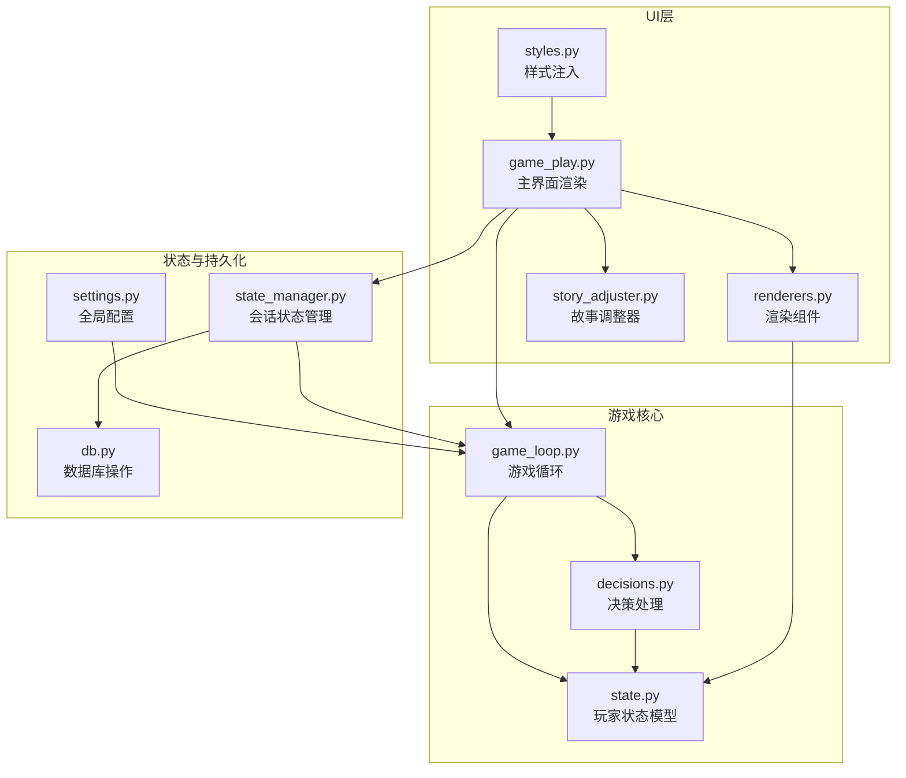
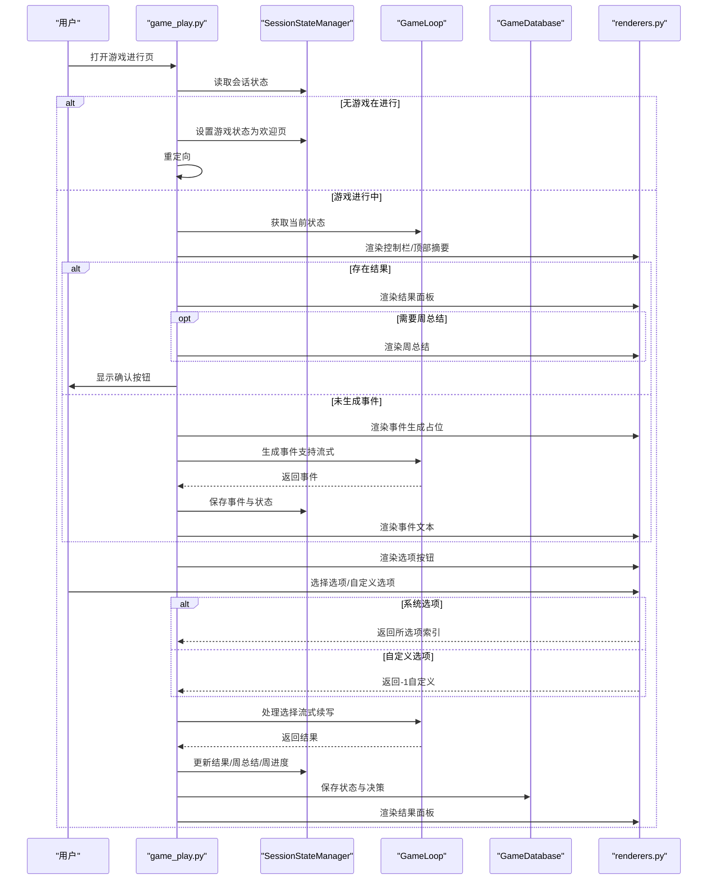
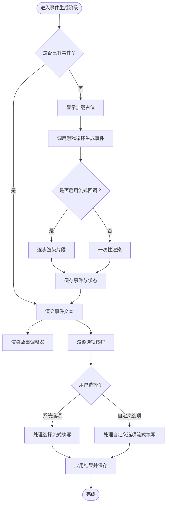
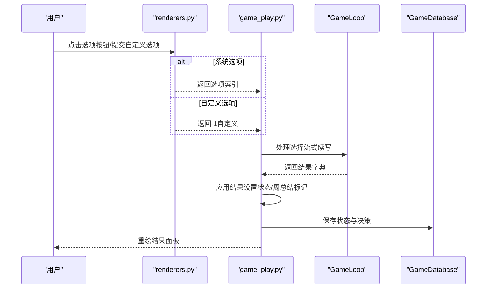
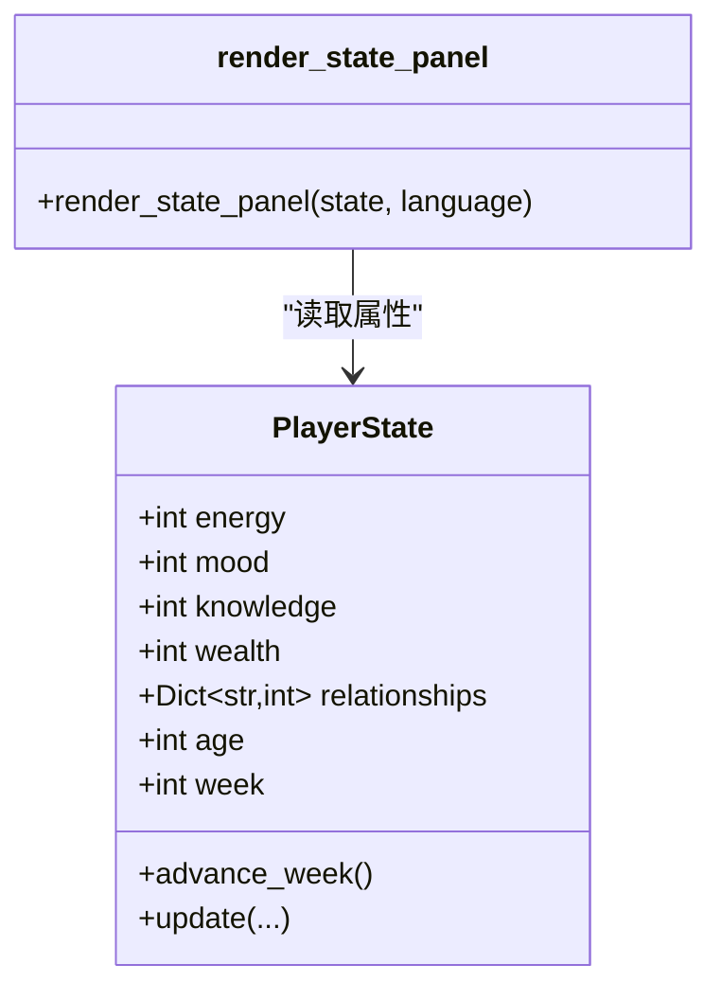
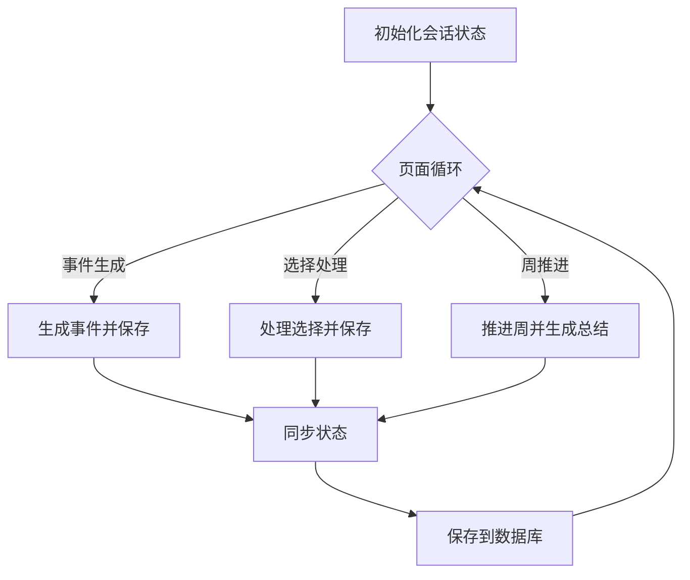
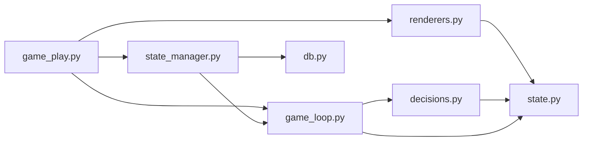

# 游戏进行页

<cite>
**本文引用的文件**
- [src/ui/page_views/game_play.py](file://src/ui/page_views/game_play.py)
- [src/ui/state_manager.py](file://src/ui/state_manager.py)
- [src/game/game_loop.py](file://src/game/game_loop.py)
- [src/ui/components/renderers.py](file://src/ui/components/renderers.py)
- [src/game/state.py](file://src/game/state.py)
- [src/ui/components/story_adjuster.py](file://src/ui/components/story_adjuster.py)
- [src/game/decisions.py](file://src/game/decisions.py)
- [src/ui/styles.py](file://src/ui/styles.py)
- [src/database/db.py](file://src/database/db.py)
- [config/settings.py](file://config/settings.py)
- [src/ui/session_manager.py](file://src/ui/session_manager.py)
</cite>

## 目录
1. [简介](#简介)
2. [项目结构](#项目结构)
3. [核心组件](#核心组件)
4. [架构总览](#架构总览)
5. [详细组件分析](#详细组件分析)
6. [依赖关系分析](#依赖关系分析)
7. [性能考量](#性能考量)
8. [故障排查指南](#故障排查指南)
9. [结论](#结论)
10. [附录](#附录)

## 简介
本文件面向“游戏进行页”的实现与使用，聚焦于事件展示系统、选项选择与结果处理、资源显示面板、状态更新与持久化机制，以及实时渲染与交互体验。文档以循序渐进的方式，先给出整体架构，再深入到关键组件与数据流，最后提供性能优化建议与故障排查要点，帮助开发者与运营人员快速理解并维护该页面。

## 项目结构
游戏进行页位于 UI 层的页面视图模块中，围绕 Streamlit 页面渲染与状态管理展开；同时与游戏核心逻辑（GameLoop）、状态模型（PlayerState）、数据库持久化（GameDatabase）紧密协作，并通过统一的状态管理器（SessionStateManager）集中管理会话状态。

**图表来源**
- [src/ui/page_views/game_play.py](file://src/ui/page_views/game_play.py#L1-L662)
- [src/ui/components/renderers.py](file://src/ui/components/renderers.py#L1-L385)
- [src/ui/components/story_adjuster.py](file://src/ui/components/story_adjuster.py#L1-L160)
- [src/ui/state_manager.py](file://src/ui/state_manager.py#L1-L773)
- [src/game/game_loop.py](file://src/game/game_loop.py#L1-L800)
- [src/game/state.py](file://src/game/state.py#L1-L709)
- [src/game/decisions.py](file://src/game/decisions.py#L1-L270)
- [src/database/db.py](file://src/database/db.py#L1-L517)
- [config/settings.py](file://config/settings.py#L1-L100)

**章节来源**
- [src/ui/page_views/game_play.py](file://src/ui/page_views/game_play.py#L1-L662)
- [src/ui/state_manager.py](file://src/ui/state_manager.py#L1-L773)

## 核心组件
- 主界面渲染器：负责事件生成、选项展示、结果呈现、周推进与总结生成等全流程。
- 渲染组件：事件文本渲染、选项按钮渲染、结果面板渲染、调试控制台、上下文聊天。
- 故事调整器：支持局部改写与整段重写，增强叙事可控性。
- 会话状态管理器：集中管理所有会话状态变量，确保类型安全与单一真相源。
- 游戏循环：事件生成、决策处理、周推进、周/年总结生成、多轮系统。
- 玩家状态模型：四维属性（能量、情绪、学识、财富）、关系、NPC角色系统、时间与回合管理。
- 数据库：游戏状态快照、决策记录、结局记录、角色预设等持久化。
- 样式系统：深色主题、渐变按钮、动画效果、响应式布局。

**章节来源**
- [src/ui/page_views/game_play.py](file://src/ui/page_views/game_play.py#L1-L662)
- [src/ui/components/renderers.py](file://src/ui/components/renderers.py#L1-L385)
- [src/ui/components/story_adjuster.py](file://src/ui/components/story_adjuster.py#L1-L160)
- [src/ui/state_manager.py](file://src/ui/state_manager.py#L1-L773)
- [src/game/game_loop.py](file://src/game/game_loop.py#L1-L800)
- [src/game/state.py](file://src/game/state.py#L1-L709)
- [src/database/db.py](file://src/database/db.py#L1-L517)
- [src/ui/styles.py](file://src/ui/styles.py#L1-L710)

## 架构总览
游戏进行页采用“页面渲染 + 统一状态管理 + 游戏循环 + 数据持久化”的分层架构。页面渲染器根据当前状态决定渲染路径（事件生成、选项展示、结果呈现、周推进、总结生成），并通过状态管理器协调 UI 与业务逻辑；游戏循环负责事件生成与决策处理；数据库负责状态快照与历史记录持久化；样式系统提供一致的视觉体验与交互反馈。

**图表来源**
- [src/ui/page_views/game_play.py](file://src/ui/page_views/game_play.py#L18-L550)
- [src/ui/state_manager.py](file://src/ui/state_manager.py#L176-L332)
- [src/game/game_loop.py](file://src/game/game_loop.py#L154-L299)
- [src/database/db.py](file://src/database/db.py#L48-L104)
- [src/ui/components/renderers.py](file://src/ui/components/renderers.py#L64-L144)

## 详细组件分析

### 事件展示系统
- 事件生成与流式渲染
  - 在“未生成事件”阶段，页面显示加载占位与周/轮次信息，随后调用游戏循环生成事件，并通过回调函数将生成片段逐步渲染到页面，实现“流式故事”体验。
  - 生成完成后，事件与故事文本会被保存至会话状态与玩家状态，以便中断后恢复。
- 事件文本渲染
  - 使用富文本容器渲染事件描述，配合渐变边框与阴影，突出故事氛围。
  - 支持“人生调整器”扩展，允许局部改写或整段重写，增强叙事可控性。
- 动画与反馈
  - 使用 CSS 动画类（如淡入、脉冲、滑入）提升页面切换与内容出现的流畅感。
  - 通过禁用按钮与加载提示，避免并发操作导致的状态错乱。

**图表来源**
- [src/ui/page_views/game_play.py](file://src/ui/page_views/game_play.py#L276-L550)
- [src/ui/components/story_adjuster.py](file://src/ui/components/story_adjuster.py#L10-L160)
- [src/ui/components/renderers.py](file://src/ui/components/renderers.py#L64-L144)

**章节来源**
- [src/ui/page_views/game_play.py](file://src/ui/page_views/game_play.py#L276-L550)
- [src/ui/components/renderers.py](file://src/ui/components/renderers.py#L64-L144)
- [src/ui/components/story_adjuster.py](file://src/ui/components/story_adjuster.py#L10-L160)
- [src/ui/styles.py](file://src/ui/styles.py#L539-L582)

### 选项选择功能
- 选项渲染
  - 渲染系统选项按钮与自定义输入框，自定义选项通过返回特殊索引（-1）标识，便于后续分支处理。
  - 选项按钮与自定义提交按钮均受“处理中”标志控制，防止重复提交。
- 选择处理
  - 系统选项：调用游戏循环的“做选择”接口，支持流式续写故事，返回结果字典（包含效果、周总结标记等）。
  - 自定义选项：调用“自定义选择”接口，同样支持流式续写。
- 结果应用
  - 将结果写入会话状态，设置“显示结果”标志，清理当前事件，保存状态与决策记录，触发页面重绘。

**图表来源**
- [src/ui/components/renderers.py](file://src/ui/components/renderers.py#L79-L144)
- [src/ui/page_views/game_play.py](file://src/ui/page_views/game_play.py#L468-L550)
- [src/game/game_loop.py](file://src/game/game_loop.py#L258-L299)
- [src/database/db.py](file://src/database/db.py#L73-L104)

**章节来源**
- [src/ui/components/renderers.py](file://src/ui/components/renderers.py#L79-L144)
- [src/ui/page_views/game_play.py](file://src/ui/page_views/game_play.py#L468-L550)
- [src/game/decisions.py](file://src/game/decisions.py#L134-L239)

### 资源显示面板
- 面板位置与内容
  - 侧边栏状态面板展示年龄、周数、四维属性（能量、情绪、学识）与财富，以及关系亲密度。
  - 财富货币符号根据角色设定动态选择。
- 实时更新
  - 面板由渲染组件直接读取玩家状态模型，随每次页面重绘自动刷新。
  - 进度条组件使用 Streamlit 原生进度条，自动映射属性到百分比。

**图表来源**
- [src/ui/components/renderers.py](file://src/ui/components/renderers.py#L22-L62)
- [src/game/state.py](file://src/game/state.py#L244-L420)

**章节来源**
- [src/ui/components/renderers.py](file://src/ui/components/renderers.py#L22-L62)
- [src/game/state.py](file://src/game/state.py#L244-L420)

### 状态更新机制
- 单一真相源
  - 会话状态管理器将“当前事件”作为单一真相源，优先从游戏循环读取，回退到会话状态，保证一致性。
  - 提供类型安全的 getter/setter，避免分散访问 st.session_state 导致的错误。
- 处理中标志
  - 通过“处理中”标志控制 UI 禁用与重绘时机，防止脚本中断导致的重复生成或选择。
- 实时数据同步
  - 事件生成与选择处理均通过回调与流式渲染，确保用户看到最新内容。
  - 会话状态与玩家状态双向同步（如关系值变更同步到 NPC 角色模型）。
- 缓存与持久化
  - 事件与故事文本保存至会话状态与玩家状态，避免中断后丢失。
  - 数据库定期保存状态快照与决策记录，支持断点续玩与历史回溯。
- 性能优化
  - 流式渲染减少首屏等待时间。
  - 仅在必要时触发重绘（如生成完成、选择完成、周推进）。
  - 限制调试日志数量，避免内存膨胀。

**图表来源**
- [src/ui/state_manager.py](file://src/ui/state_manager.py#L67-L105)
- [src/ui/page_views/game_play.py](file://src/ui/page_views/game_play.py#L324-L381)
- [src/database/db.py](file://src/database/db.py#L48-L104)

**章节来源**
- [src/ui/state_manager.py](file://src/ui/state_manager.py#L176-L332)
- [src/ui/page_views/game_play.py](file://src/ui/page_views/game_play.py#L324-L381)
- [src/database/db.py](file://src/database/db.py#L48-L104)

### 关键实现代码示例（路径）
- 事件生成与流式渲染
  - [事件生成入口与流式回调](file://src/ui/page_views/game_play.py#L324-L381)
  - [事件渲染与故事调整器](file://src/ui/page_views/game_play.py#L383-L406)
  - [故事调整器（局部改写/整段重写）](file://src/ui/components/story_adjuster.py#L10-L160)
- 选项选择与处理
  - [选项渲染与自定义选项](file://src/ui/components/renderers.py#L79-L144)
  - [系统选项处理](file://src/ui/page_views/game_play.py#L468-L550)
  - [自定义选项处理](file://src/ui/page_views/game_play.py#L552-L589)
  - [决策处理与效果应用](file://src/game/decisions.py#L134-L239)
- 结果展示与周推进
  - [结果面板渲染](file://src/ui/components/renderers.py#L146-L171)
  - [周推进与周总结](file://src/ui/page_views/game_play.py#L591-L662)
- 状态管理与持久化
  - [会话状态管理器](file://src/ui/state_manager.py#L42-L535)
  - [数据库保存状态与决策](file://src/database/db.py#L48-L104)
  - [数据库保存进度](file://src/database/db.py#L274-L322)
- 样式与动画
  - [CSS 注入与动画类](file://src/ui/styles.py#L5-L710)

**章节来源**
- [src/ui/page_views/game_play.py](file://src/ui/page_views/game_play.py#L324-L662)
- [src/ui/components/renderers.py](file://src/ui/components/renderers.py#L79-L171)
- [src/ui/components/story_adjuster.py](file://src/ui/components/story_adjuster.py#L10-L160)
- [src/game/decisions.py](file://src/game/decisions.py#L134-L239)
- [src/ui/state_manager.py](file://src/ui/state_manager.py#L42-L535)
- [src/database/db.py](file://src/database/db.py#L48-L322)
- [src/ui/styles.py](file://src/ui/styles.py#L5-L710)

## 依赖关系分析
- 页面渲染器依赖渲染组件与游戏循环，间接依赖状态模型与数据库。
- 渲染组件依赖状态模型与样式系统。
- 会话状态管理器依赖数据库与游戏循环，提供类型安全的访问接口。
- 游戏循环依赖状态模型、决策处理与 AI 生成器。
- 数据库提供状态快照、决策记录与结局记录的持久化能力。

**图表来源**
- [src/ui/page_views/game_play.py](file://src/ui/page_views/game_play.py#L1-L662)
- [src/ui/components/renderers.py](file://src/ui/components/renderers.py#L1-L385)
- [src/ui/state_manager.py](file://src/ui/state_manager.py#L1-L773)
- [src/game/game_loop.py](file://src/game/game_loop.py#L1-L800)
- [src/game/state.py](file://src/game/state.py#L1-L709)
- [src/game/decisions.py](file://src/game/decisions.py#L1-L270)
- [src/database/db.py](file://src/database/db.py#L1-L517)

**章节来源**
- [src/ui/page_views/game_play.py](file://src/ui/page_views/game_play.py#L1-L662)
- [src/ui/state_manager.py](file://src/ui/state_manager.py#L1-L773)

## 性能考量
- 流式渲染：事件与结果采用流式回调，显著降低首屏等待时间，提升交互流畅度。
- 重绘控制：通过“处理中”标志与条件渲染，避免不必要的重绘与并发操作。
- 状态同步：将事件与故事文本保存至会话状态与玩家状态，减少重复生成与网络请求。
- 日志管理：限制调试日志数量，避免内存占用过高。
- 数据库写入：批量保存状态快照与决策记录，减少频繁 IO 操作。

[本节为通用指导，无需特定文件引用]

## 故障排查指南
- 事件生成失败
  - 现象：生成过程中抛出异常并显示错误信息。
  - 排查：检查 API 配置（OPENAI_API_KEY）、网络连通性与模型可用性；查看调试日志与错误堆栈。
  - 参考路径：[事件生成异常处理](file://src/ui/page_views/game_play.py#L369-L381)
- 选择处理中断
  - 现象：脚本中断导致状态不一致或重复生成。
  - 排查：确认“处理中”标志正确设置与清理；检查备份事件的恢复逻辑。
  - 参考路径：[选择处理与备份恢复](file://src/ui/page_views/game_play.py#L468-L550)
- 断点续玩失败
  - 现象：恢复游戏状态时找不到存档或权限不足。
  - 排查：验证 game_id 与用户权限；检查数据库连接与存档完整性。
  - 参考路径：[断点续玩与恢复](file://src/ui/state_manager.py#L662-L773)
- 资源边界异常
  - 现象：属性越界或负值。
  - 排查：检查更新逻辑与边界校验；确认衰减与更新参数。
  - 参考路径：[状态更新与校验](file://src/game/state.py#L372-L552)

**章节来源**
- [src/ui/page_views/game_play.py](file://src/ui/page_views/game_play.py#L369-L381)
- [src/ui/page_views/game_play.py](file://src/ui/page_views/game_play.py#L468-L550)
- [src/ui/state_manager.py](file://src/ui/state_manager.py#L662-L773)
- [src/game/state.py](file://src/game/state.py#L372-L552)

## 结论
游戏进行页通过“流式渲染 + 统一状态管理 + 游戏循环 + 数据持久化”的架构，实现了流畅的事件展示、直观的选项交互与稳定的实时更新。其设计兼顾了用户体验与工程可维护性，适合在多轮叙事与角色关系复杂的游戏中长期演进。

[本节为总结性内容，无需特定文件引用]

## 附录
- 配置项与常量
  - 全局配置：语言、API、数据库、资源上下限、衰减参数等。
  - 参考路径：[配置管理](file://config/settings.py#L30-L100)
- 会话状态迁移
  - 旧版会话管理器已迁移至新模块，保持向后兼容。
  - 参考路径：[会话状态迁移](file://src/ui/session_manager.py#L1-L65)

**章节来源**
- [config/settings.py](file://config/settings.py#L30-L100)
- [src/ui/session_manager.py](file://src/ui/session_manager.py#L1-L65)