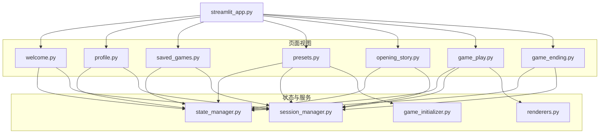
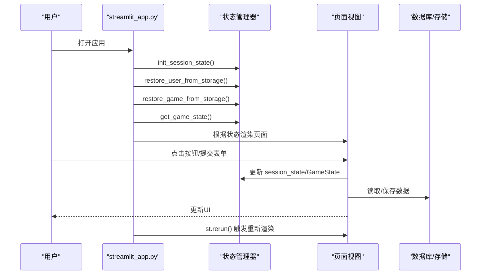
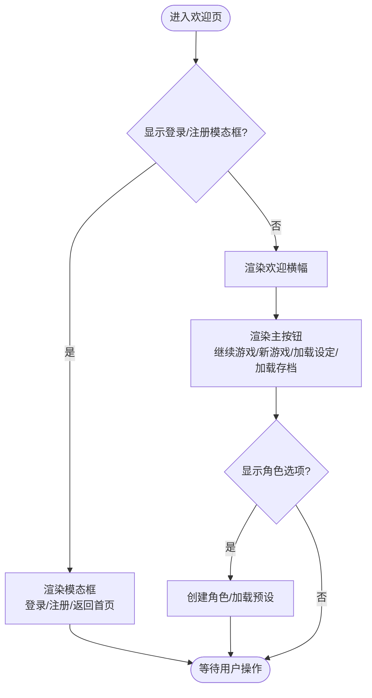
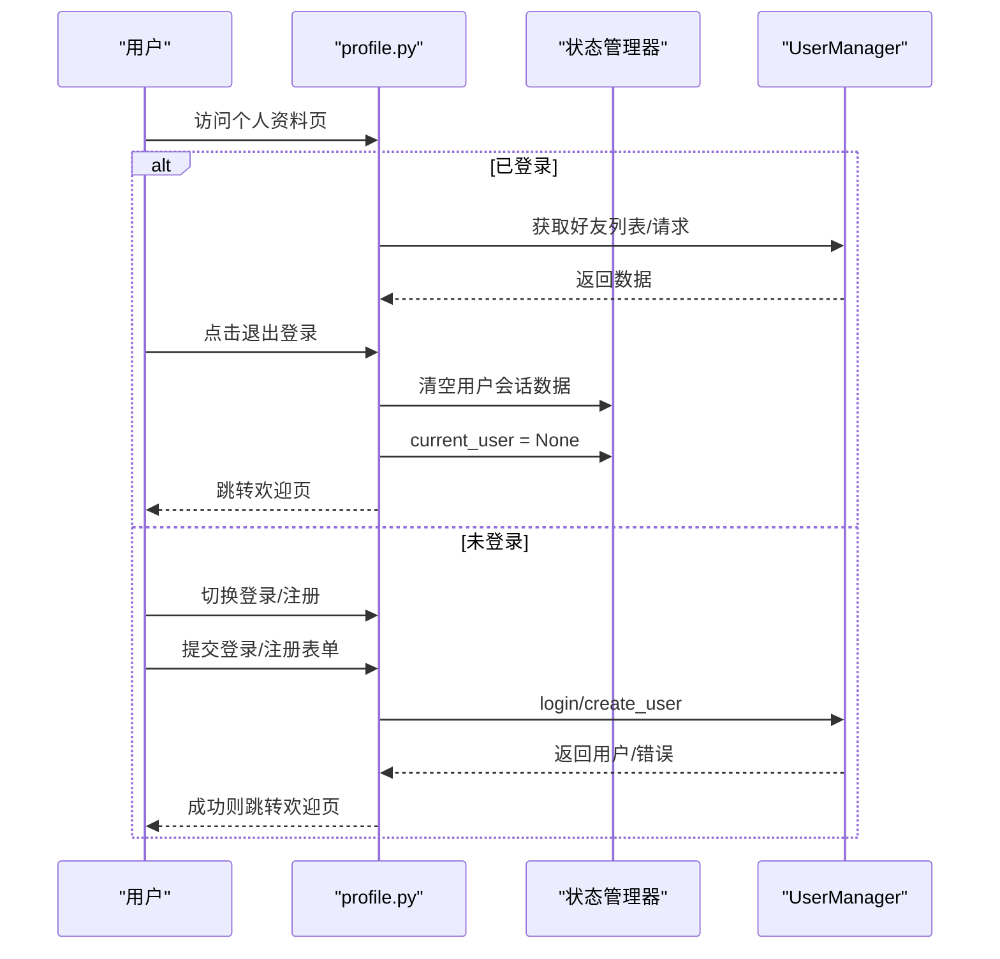
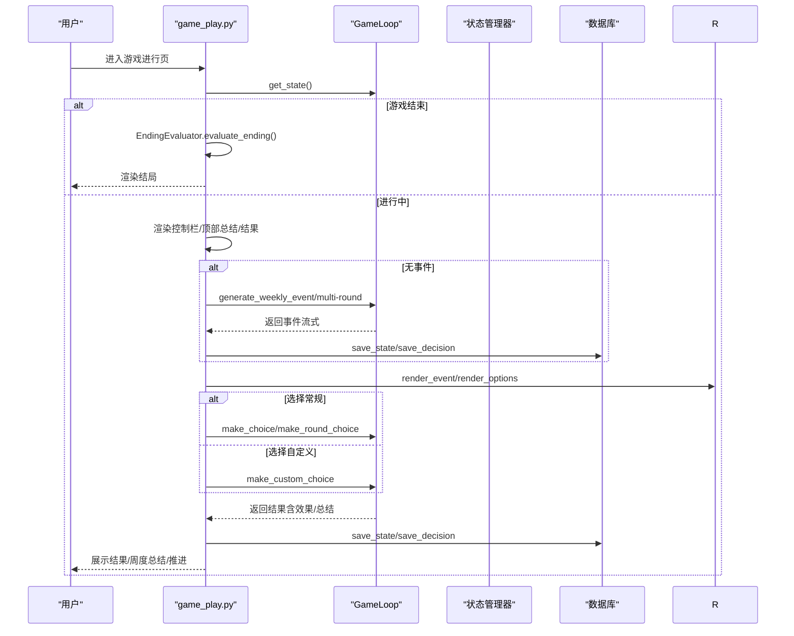
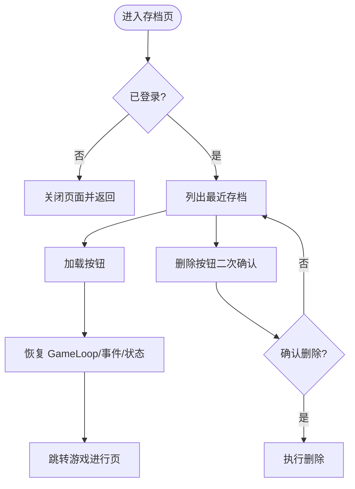
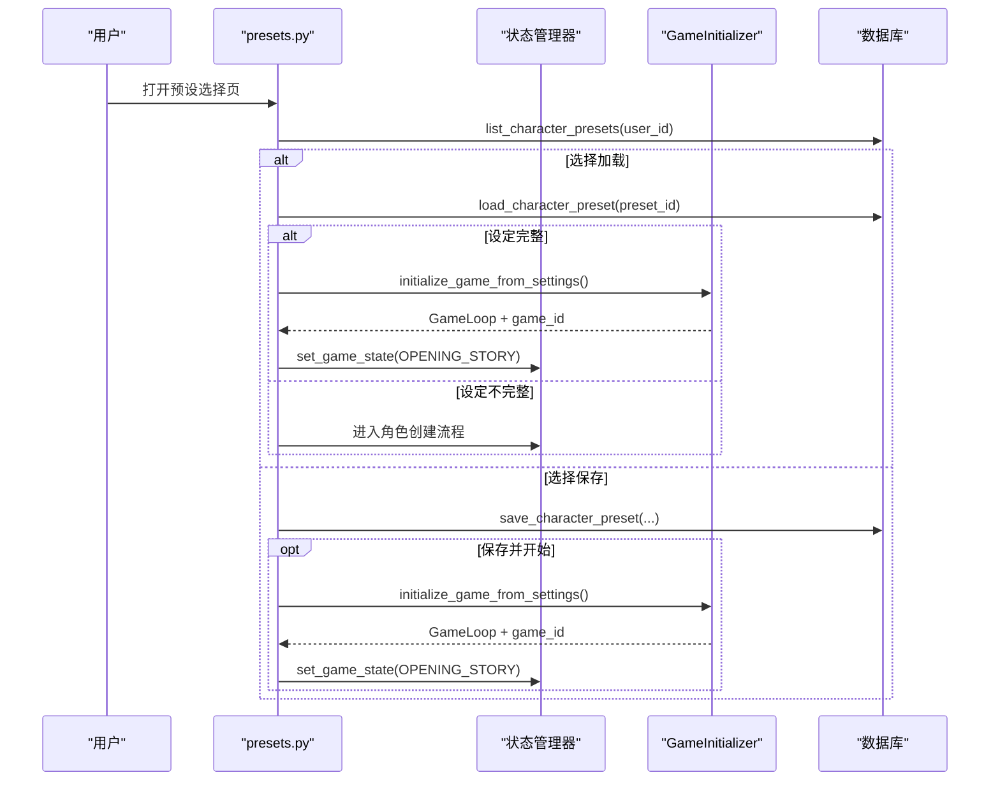
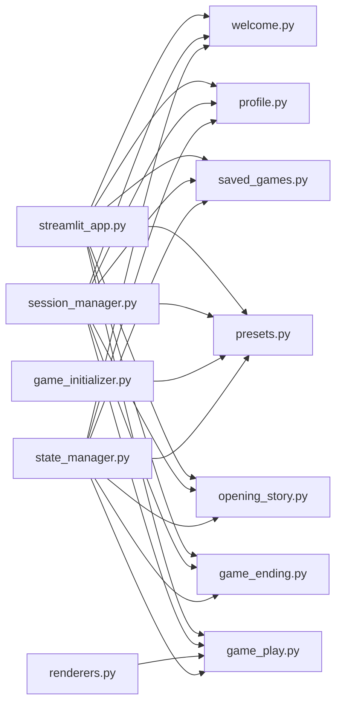

# 页面视图组件

<cite>
**本文引用的文件**
- [welcome.py](file://src/ui/page_views/welcome.py)
- [profile.py](file://src/ui/page_views/profile.py)
- [game_play.py](file://src/ui/page_views/game_play.py)
- [saved_games.py](file://src/ui/page_views/saved_games.py)
- [presets.py](file://src/ui/page_views/presets.py)
- [state_manager.py](file://src/ui/state_manager.py)
- [session_manager.py](file://src/ui/session_manager.py)
- [renderers.py](file://src/ui/components/renderers.py)
- [game_initializer.py](file://src/ui/services/game_initializer.py)
- [opening_story.py](file://src/ui/page_views/opening_story.py)
- [game_ending.py](file://src/ui/page_views/game_ending.py)
- [streamlit_app.py](file://src/ui/streamlit_app.py)
</cite>

## 目录
1. [简介](#简介)
2. [项目结构](#项目结构)
3. [核心组件](#核心组件)
4. [架构总览](#架构总览)
5. [详细组件分析](#详细组件分析)
6. [依赖分析](#依赖分析)
7. [性能考虑](#性能考虑)
8. [故障排除指南](#故障排除指南)
9. [结论](#结论)

## 简介
本文档系统性梳理“页面视图组件”的实现架构与功能设计，覆盖欢迎页、个人资料页、游戏进行页、存档管理页、预设选择页等五大页面视图。重点阐述：
- 欢迎页的用户引导流程（语言选择、用户认证、导航功能）
- 个人资料页的用户信息管理（个人信息编辑、设置配置、账户管理）
- 游戏进行页的核心交互逻辑（事件展示、选项选择、资源显示、状态更新）
- 存档管理页的进度保存与加载机制
- 预设选择页的角色设定管理与模板应用功能
同时提供组件结构图、交互流程图与关键实现代码示例路径，帮助开发者快速理解与扩展。

## 项目结构
页面视图位于 src/ui/page_views 目录，配合 state_manager/session_manager 提供统一的状态管理，components/renderers 提供通用渲染组件，services/game_initializer 提供游戏初始化服务。

图表来源
- [streamlit_app.py](file://src/ui/streamlit_app.py#L139-L215)
- [welcome.py](file://src/ui/page_views/welcome.py#L1-L285)
- [profile.py](file://src/ui/page_views/profile.py#L1-L184)
- [game_play.py](file://src/ui/page_views/game_play.py#L1-L662)
- [saved_games.py](file://src/ui/page_views/saved_games.py#L1-L180)
- [presets.py](file://src/ui/page_views/presets.py#L1-L425)
- [state_manager.py](file://src/ui/state_manager.py#L29-L547)
- [session_manager.py](file://src/ui/session_manager.py#L1-L65)
- [renderers.py](file://src/ui/components/renderers.py#L1-L385)
- [game_initializer.py](file://src/ui/services/game_initializer.py#L1-L155)
- [opening_story.py](file://src/ui/page_views/opening_story.py#L1-L120)
- [game_ending.py](file://src/ui/page_views/game_ending.py#L1-L96)

章节来源
- [streamlit_app.py](file://src/ui/streamlit_app.py#L139-L215)

## 核心组件
- 状态管理器（SessionStateManager/GameState）：集中管理游戏状态、用户状态、事件状态、多回合状态、UI标志位等，提供类型安全的访问与持久化能力。
- 页面视图：以函数式渲染为主，按 GameState 分发到对应页面；通过 session_state 控制页面可见性与交互。
- 渲染组件：提供事件展示、选项渲染、结果展示、上下文聊天、状态面板等通用 UI 组件。
- 初始化服务：封装从角色设定创建游戏的完整流程，避免重复代码。

章节来源
- [state_manager.py](file://src/ui/state_manager.py#L29-L547)
- [session_manager.py](file://src/ui/session_manager.py#L1-L65)
- [renderers.py](file://src/ui/components/renderers.py#L1-L385)
- [game_initializer.py](file://src/ui/services/game_initializer.py#L1-L155)

## 架构总览
页面视图采用“状态机路由 + 统一状态管理”的模式：
- 应用启动后初始化数据库与样式，读取语言设置，尝试从存储恢复用户与游戏状态。
- 根据 GameState 决定渲染哪个页面视图。
- 页面内部通过 session_state 控制子页面（如欢迎页的登录模态、预设选择、存档列表等）。
- 游戏主循环（GameLoop）贯穿游戏进行页，负责事件生成、选项处理、状态更新与存档。

图表来源
- [streamlit_app.py](file://src/ui/streamlit_app.py#L139-L215)
- [state_manager.py](file://src/ui/state_manager.py#L67-L175)
- [session_manager.py](file://src/ui/session_manager.py#L31-L65)

## 详细组件分析

### 欢迎页（welcome）
- 用户引导流程
  - 顶部右上角显示用户入口（未登录显示登录/注册按钮，已登录显示简要头像按钮）
  - 主体区域包含欢迎横幅与功能按钮区
  - 当 show_character_options 为真时，显示“创建角色/加载已保存设定”
  - 当存在进行中的游戏时，显示“继续游戏”按钮
  - 登录/注册按钮触发 show_auth_modal，弹出模态框
- 认证与导航
  - 支持登录/注册两种模式切换
  - 登录使用私有ID，注册生成新用户并提示保存私有ID
  - 登录成功后清理会话数据并保存用户ID到URL与localStorage，以便后续恢复
- 关键实现路径
  - [render_welcome](file://src/ui/page_views/welcome.py#L11-L36)
  - [用户按钮渲染](file://src/ui/page_views/welcome.py#L38-L61)
  - [主按钮渲染](file://src/ui/page_views/welcome.py#L138-L176)
  - [登录/注册模态框](file://src/ui/page_views/welcome.py#L179-L285)
  - [用户持久化](file://src/ui/session_manager.py#L552-L642)

图表来源
- [welcome.py](file://src/ui/page_views/welcome.py#L11-L176)

章节来源
- [welcome.py](file://src/ui/page_views/welcome.py#L11-L285)
- [session_manager.py](file://src/ui/session_manager.py#L552-L642)

### 个人资料页（profile）
- 登录态显示
  - 显示用户名/公有ID，提供“退出登录”按钮，清空用户会话数据并跳转欢迎页
  - 好友功能：添加好友、查看好友列表、处理好友请求（同意/拒绝）
- 未登录态显示
  - 提供登录/注册切换按钮
  - 登录/注册表单，注册成功后提示保存私有ID并自动跳转欢迎页
- 关键实现路径
  - [渲染个人资料页](file://src/ui/page_views/profile.py#L10-L31)
  - [已登录视图](file://src/ui/page_views/profile.py#L33-L104)
  - [未登录视图](file://src/ui/page_views/profile.py#L106-L143)
  - [登录表单](file://src/ui/page_views/profile.py#L145-L167)
  - [注册表单](file://src/ui/page_views/profile.py#L169-L184)

图表来源
- [profile.py](file://src/ui/page_views/profile.py#L10-L184)

章节来源
- [profile.py](file://src/ui/page_views/profile.py#L1-L184)

### 游戏进行页（game_play）
- 核心交互逻辑
  - 安全检查：若无 game_loop，跳回欢迎页并清理游戏存储
  - 游戏结束检测：调用 EndingEvaluator 计算结局并渲染结局页
  - 控制栏：保存、返回主菜单
  - 结果展示：展示上次决策结果，支持周度/轮次小结
  - 事件生成：多回合/单周模式，流式展示故事，支持强制重生成
  - 选项处理：常规选项与自定义选项（流式续写），保存决策与状态
  - 上下文聊天：基于当前事件与角色设定的剧情助手
  - 顶部/底部总结：近期/过去一年总结，支持关闭与生成
- 关键实现路径
  - [主渲染入口](file://src/ui/page_views/game_play.py#L18-L67)
  - [控制栏](file://src/ui/page_views/game_play.py#L100-L127)
  - [结果展示](file://src/ui/page_views/game_play.py#L167-L190)
  - [周度/轮次总结](file://src/ui/page_views/game_play.py#L192-L243)
  - [事件生成（流式）](file://src/ui/page_views/game_play.py#L276-L381)
  - [选项渲染与处理](file://src/ui/page_views/game_play.py#L383-L406)
  - [常规选择处理](file://src/ui/page_views/game_play.py#L468-L549)
  - [自定义选择处理](file://src/ui/page_views/game_play.py#L552-L588)
  - [底部总结与推进](file://src/ui/page_views/game_play.py#L591-L662)
  - [结局处理](file://src/ui/page_views/game_play.py#L69-L98)

图表来源
- [game_play.py](file://src/ui/page_views/game_play.py#L18-L662)
- [renderers.py](file://src/ui/components/renderers.py#L64-L144)

章节来源
- [game_play.py](file://src/ui/page_views/game_play.py#L1-L662)
- [renderers.py](file://src/ui/components/renderers.py#L1-L385)

### 存档管理页（saved_games）
- 功能要点
  - 仅在用户登录且 show_saved_games 为真时渲染
  - 列出用户最近保存的存档（最多10条），显示角色名、年龄、周数与更新时间
  - 支持加载与删除（二次确认）
  - 加载成功后恢复 GameLoop、当前事件与故事文本，清理结果与总结状态
- 关键实现路径
  - [渲染存档页](file://src/ui/page_views/saved_games.py#L12-L50)
  - [存档卡片渲染](file://src/ui/page_views/saved_games.py#L53-L98)
  - [加载按钮处理](file://src/ui/page_views/saved_games.py#L107-L153)
  - [删除按钮处理](file://src/ui/page_views/saved_games.py#L155-L179)

图表来源
- [saved_games.py](file://src/ui/page_views/saved_games.py#L12-L179)

章节来源
- [saved_games.py](file://src/ui/page_views/saved_games.py#L1-L180)

### 预设选择页（presets）
- 功能要点
  - 列出用户保存的角色设定（最多20条），支持加载与删除
  - 加载时校验设定完整性：若缺失必要字段，进入角色创建流程补齐
  - 支持保存当前角色设定（可仅保存或保存并开始游戏）
  - 未登录时提供登录/注册入口
- 关键实现路径
  - [渲染预设选择器](file://src/ui/page_views/presets.py#L15-L42)
  - [预设列表渲染](file://src/ui/page_views/presets.py#L72-L115)
  - [加载预设处理](file://src/ui/page_views/presets.py#L117-L168)
  - [从预设启动游戏](file://src/ui/page_views/presets.py#L170-L202)
  - [保存预设对话框](file://src/ui/page_views/presets.py#L238-L272)
  - [保存仅保存](file://src/ui/page_views/presets.py#L318-L357)
  - [保存并开始游戏](file://src/ui/page_views/presets.py#L359-L410)

图表来源
- [presets.py](file://src/ui/page_views/presets.py#L15-L202)
- [game_initializer.py](file://src/ui/services/game_initializer.py#L63-L138)

章节来源
- [presets.py](file://src/ui/page_views/presets.py#L1-L425)
- [game_initializer.py](file://src/ui/services/game_initializer.py#L1-L155)

### 开场故事页（opening_story）
- 功能要点
  - 在角色创建完成后展示开场故事，支持流式渲染
  - 若未生成过开场故事，则生成并缓存到 session_state
  - 提供“开始我的人生”按钮，切换到游戏进行页
- 关键实现路径
  - [渲染开场故事](file://src/ui/page_views/opening_story.py#L11-L120)

章节来源
- [opening_story.py](file://src/ui/page_views/opening_story.py#L1-L120)

### 结局页（game_ending）
- 功能要点
  - 展示结局名称、摘要、最终状态（能量、情绪、学识、财富、关系）
  - 展示成就列表
  - 提供“新游戏”按钮，清理游戏状态并回到欢迎页
- 关键实现路径
  - [渲染结局](file://src/ui/page_views/game_ending.py#L8-L56)
  - [结局页入口](file://src/ui/page_views/game_ending.py#L58-L96)

章节来源
- [game_ending.py](file://src/ui/page_views/game_ending.py#L1-L96)

## 依赖分析
- 页面视图与状态管理
  - 所有页面视图均依赖 state_manager 的 SessionStateManager 提供的统一状态接口
  - 通过 GameState 枚举控制页面流转
- 页面视图与渲染组件
  - game_play 依赖 renderers 提供的事件/选项/结果/聊天等组件
- 页面视图与服务
  - presets 依赖 game_initializer 进行从设定启动游戏
- 页面视图与数据库
  - welcome/profile/saved_games/presets 均通过 state_manager 的 game_db 访问数据库
- 应用入口
  - streamlit_app 作为唯一入口，负责初始化、恢复状态、路由分发

图表来源
- [state_manager.py](file://src/ui/state_manager.py#L29-L547)
- [session_manager.py](file://src/ui/session_manager.py#L1-L65)
- [renderers.py](file://src/ui/components/renderers.py#L1-L385)
- [game_initializer.py](file://src/ui/services/game_initializer.py#L1-L155)
- [streamlit_app.py](file://src/ui/streamlit_app.py#L139-L215)

章节来源
- [state_manager.py](file://src/ui/state_manager.py#L29-L547)
- [session_manager.py](file://src/ui/session_manager.py#L1-L65)
- [renderers.py](file://src/ui/components/renderers.py#L1-L385)
- [game_initializer.py](file://src/ui/services/game_initializer.py#L1-L155)
- [streamlit_app.py](file://src/ui/streamlit_app.py#L139-L215)

## 性能考虑
- 流式渲染：事件与结果采用流式增量渲染，减少一次性渲染压力，提升交互流畅度
- 状态持久化：通过 save_game_to_storage 与 restore_game_from_storage 实现断线重连与会话恢复
- 事件缓存：game_play 对当前事件与故事文本进行缓存，避免重复生成
- UI禁用：processing 标志位在处理过程中禁用按钮，防止重复提交与并发问题
- 数据库访问：批量保存（save_state/save_decision）与查询（list_saved_games/list_character_presets）需注意索引与分页

## 故障排除指南
- 登录/注册失败
  - 检查 OPENAI_API_KEY 配置，确保环境变量正确
  - 查看调试日志（Debug Console）定位异常
- 事件生成失败
  - 检查网络与API可用性，查看错误堆栈
  - 尝试强制重生成（force_generate）
- 存档加载失败
  - 确认存档归属当前用户，检查 game_id 是否有效
  - 清理 localStorage/URL参数后重试恢复
- 自定义选项处理异常
  - 确保备份事件存在（_choice_backup_event），必要时手动恢复
  - 检查 make_custom_choice 的返回结构

章节来源
- [game_play.py](file://src/ui/page_views/game_play.py#L369-L380)
- [state_manager.py](file://src/ui/state_manager.py#L662-L773)

## 结论
该页面视图组件体系以统一的状态管理为核心，结合流式渲染与数据库持久化，实现了从用户引导、角色设定、游戏进行到结局与存档管理的完整闭环。通过清晰的页面职责划分与稳定的交互流程，既保证了良好的用户体验，也为后续扩展（如更多结局、社交功能、多语言增强）提供了坚实基础。