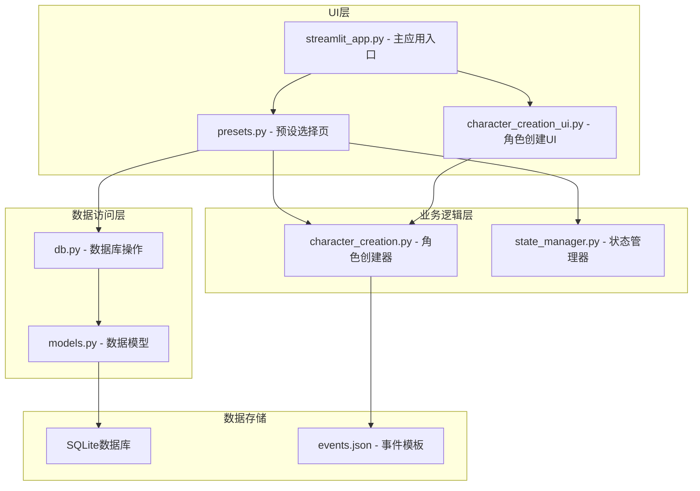
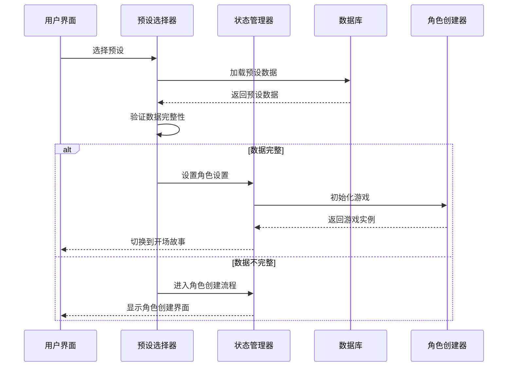
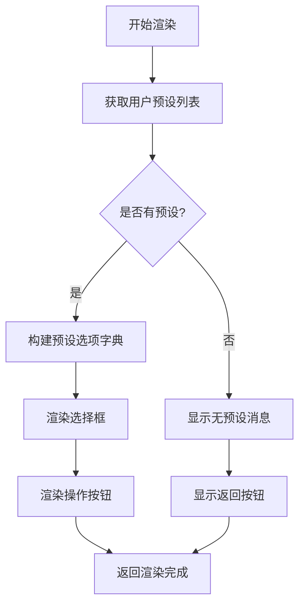
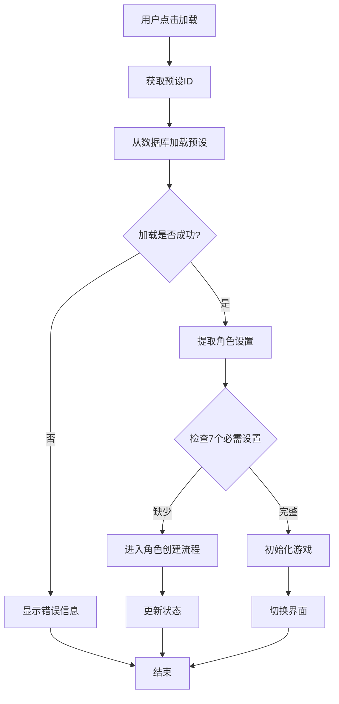
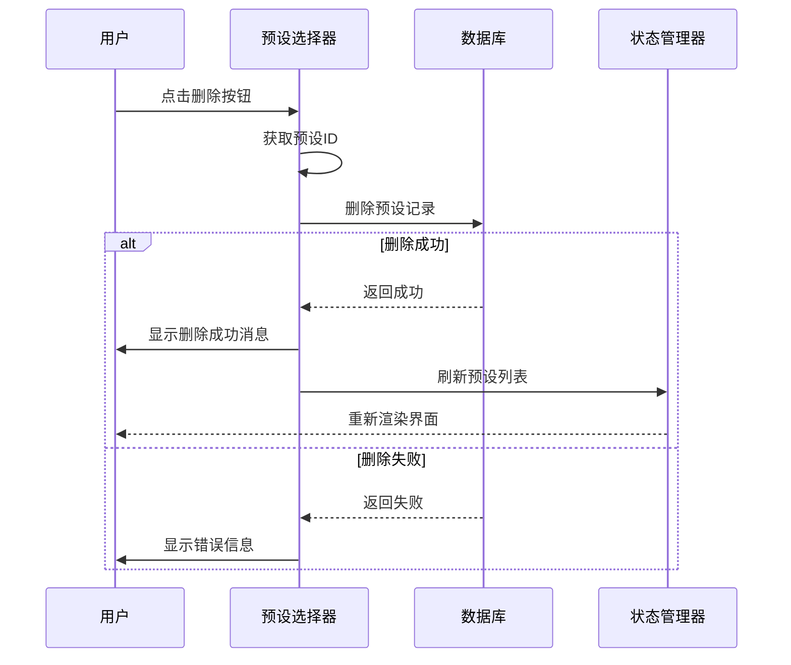
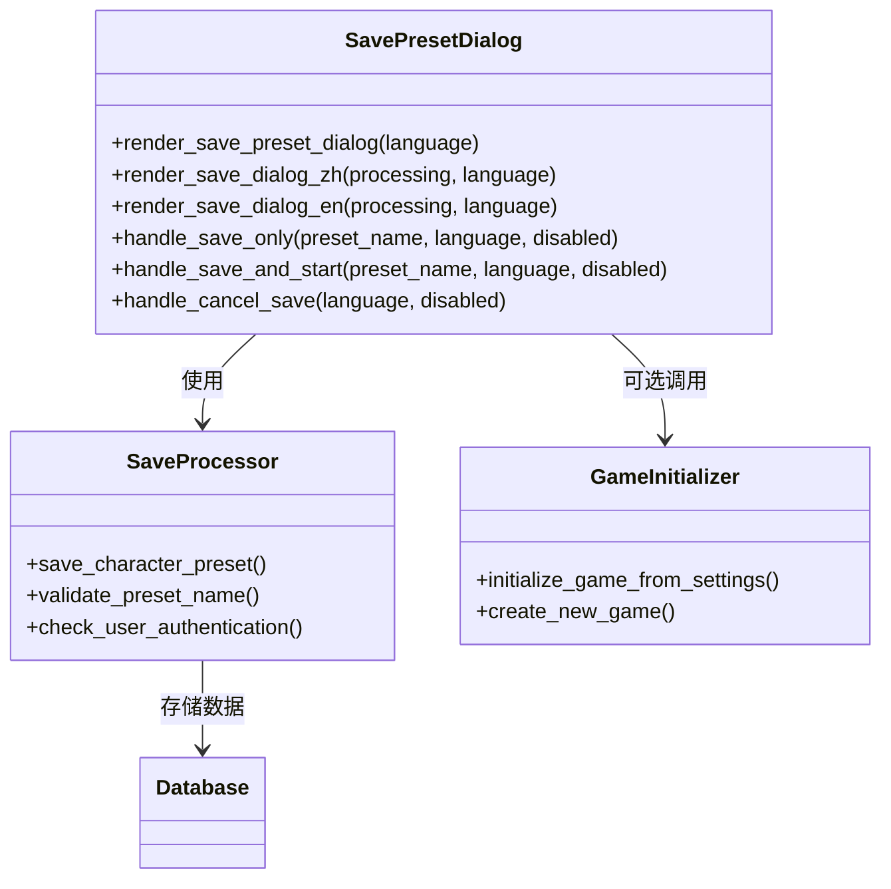
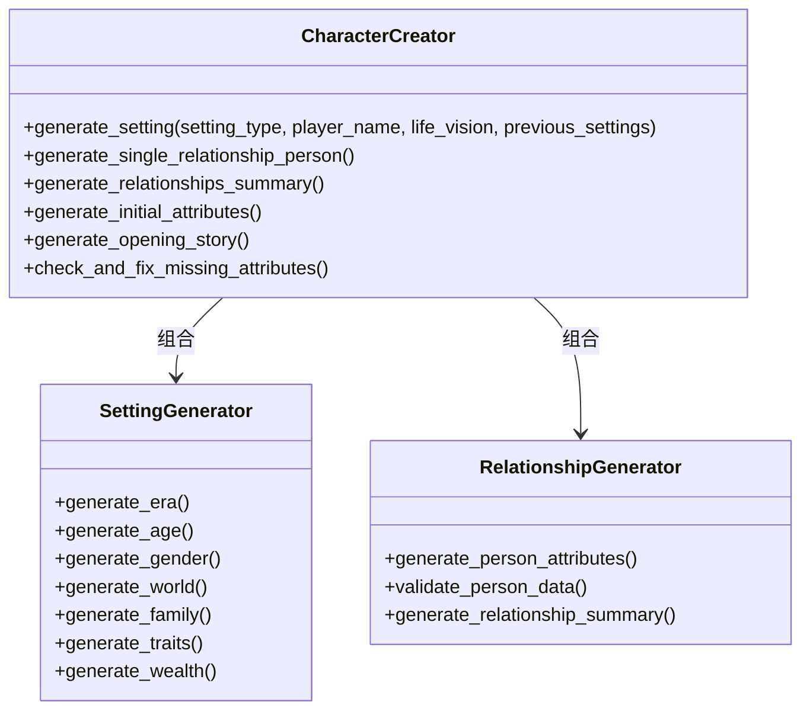
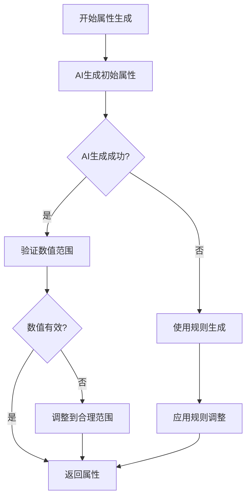
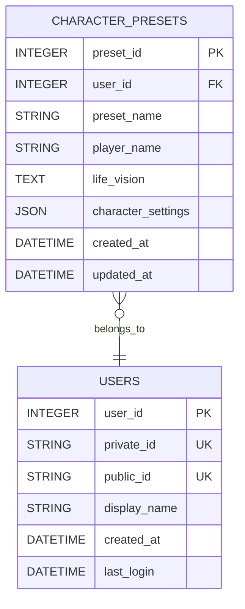
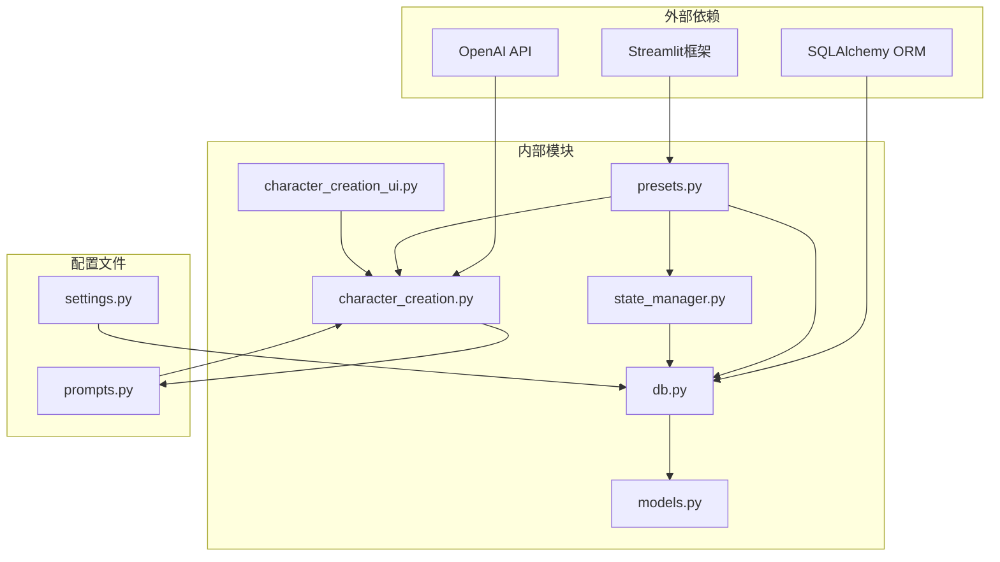

# 预设选择页

<cite>
**本文档引用的文件**
- [presets.py](file://src/ui/page_views/presets.py)
- [character_creation.py](file://src/game/character_creation.py)
- [character_creation_ui.py](file://src/ui/character_creation_ui.py)
- [models.py](file://src/database/models.py)
- [db.py](file://src/database/db.py)
- [state_manager.py](file://src/ui/state_manager.py)
- [streamlit_app.py](file://src/ui/streamlit_app.py)
- [events.json](file://data/presets/events.json)
</cite>

## 目录
1. [简介](#简介)
2. [项目结构](#项目结构)
3. [核心组件](#核心组件)
4. [架构概览](#架构概览)
5. [详细组件分析](#详细组件分析)
6. [依赖关系分析](#依赖关系分析)
7. [性能考虑](#性能考虑)
8. [故障排除指南](#故障排除指南)
9. [结论](#结论)

## 简介

预设选择页是故事游戏系统中的核心功能模块，负责管理角色设定的保存、加载和应用。该模块实现了完整的预设生命周期管理，包括预设模板的展示、选择、保存、删除等功能，为用户提供便捷的角色设定管理体验。

预设系统采用分层架构设计，结合了AI驱动的角色生成、数据库持久化存储和Streamlit前端界面，形成了完整的角色设定管理系统。系统支持多语言界面、用户认证、游戏状态恢复等高级功能。

## 项目结构

预设选择页位于UI层的页面视图模块中，与游戏逻辑、数据库操作和状态管理紧密集成：

**图表来源**
- [presets.py](file://src/ui/page_views/presets.py#L1-L425)
- [character_creation.py](file://src/game/character_creation.py#L1-L702)
- [db.py](file://src/database/db.py#L1-L200)

**章节来源**
- [presets.py](file://src/ui/page_views/presets.py#L1-L425)
- [streamlit_app.py](file://src/ui/streamlit_app.py#L1-L215)

## 核心组件

预设选择页由多个核心组件构成，每个组件负责特定的功能职责：

### 预设选择器组件
- **渲染器**: 负责预设列表的展示和用户交互
- **加载处理器**: 处理预设加载逻辑和完整性检查
- **删除处理器**: 实现预设删除功能
- **用户界面**: 提供中英文双语支持

### 预设保存对话框
- **保存处理器**: 实现预设保存逻辑
- **保存并开始处理器**: 支持保存后直接开始游戏
- **取消处理器**: 处理用户取消操作

### 数据模型组件
- **CharacterPreset模型**: 定义预设数据结构
- **数据库操作**: 提供CRUD操作接口
- **数据验证**: 确保数据完整性和一致性

**章节来源**
- [presets.py](file://src/ui/page_views/presets.py#L15-L425)
- [models.py](file://src/database/models.py#L129-L144)
- [db.py](file://src/database/db.py#L408-L516)

## 架构概览

预设选择页采用分层架构设计，各层职责明确，耦合度低：

**图表来源**
- [presets.py](file://src/ui/page_views/presets.py#L117-L202)
- [state_manager.py](file://src/ui/state_manager.py#L41-L53)

系统架构特点：
- **分层清晰**: UI层、业务逻辑层、数据访问层职责分明
- **状态统一**: 通过状态管理器集中管理应用状态
- **数据持久化**: 使用SQLite数据库存储预设数据
- **扩展性强**: 支持插件化扩展和功能模块化

## 详细组件分析

### 预设选择器实现

预设选择器是用户与预设系统交互的主要界面，提供了完整的预设管理功能：

#### 预设列表渲染

**图表来源**
- [presets.py](file://src/ui/page_views/presets.py#L72-L115)

#### 预设加载处理流程
预设加载过程包含严格的数据完整性验证：

**图表来源**
- [presets.py](file://src/ui/page_views/presets.py#L117-L167)

#### 删除功能实现
删除操作采用安全验证机制：

**图表来源**
- [presets.py](file://src/ui/page_views/presets.py#L204-L218)

### 预设保存功能

预设保存功能提供了灵活的保存选项：

#### 保存对话框设计

**图表来源**
- [presets.py](file://src/ui/page_views/presets.py#L238-L425)

#### 保存流程验证
保存过程包含多重验证机制：

1. **名称验证**: 确保预设名称非空
2. **用户认证**: 验证用户登录状态
3. **数据完整性**: 检查角色设置的完整性
4. **数据库操作**: 原子性事务处理

**章节来源**
- [presets.py](file://src/ui/page_views/presets.py#L274-L425)

### 角色设定管理

角色设定管理是预设系统的核心功能，负责角色属性的配置和验证：

#### 角色创建器架构

**图表来源**
- [character_creation.py](file://src/game/character_creation.py#L37-L540)

#### 属性配置系统
角色属性配置采用AI驱动和规则混合的方式：

**图表来源**
- [character_creation.py](file://src/game/character_creation.py#L325-L487)

**章节来源**
- [character_creation.py](file://src/game/character_creation.py#L1-L702)

### 数据模型设计

预设系统使用标准化的数据模型设计：

#### 预设数据模型

**图表来源**
- [models.py](file://src/database/models.py#L129-L144)

#### 数据库操作接口
数据库层提供了完整的CRUD操作接口：

**章节来源**
- [models.py](file://src/database/models.py#L1-L171)
- [db.py](file://src/database/db.py#L408-L516)

## 依赖关系分析

预设选择页的依赖关系体现了清晰的分层架构：

**图表来源**
- [presets.py](file://src/ui/page_views/presets.py#L1-L12)
- [character_creation.py](file://src/game/character_creation.py#L1-L13)

### 模块间耦合度分析

- **UI层与业务逻辑层**: 通过状态管理器解耦，降低直接依赖
- **业务逻辑层与数据访问层**: 通过接口抽象，支持测试和替换
- **数据模型与数据库**: 使用ORM映射，简化数据库操作

**章节来源**
- [state_manager.py](file://src/ui/state_manager.py#L1-L773)
- [streamlit_app.py](file://src/ui/streamlit_app.py#L1-L215)

## 性能考虑

预设系统在设计时充分考虑了性能优化：

### 数据缓存策略
- **预设列表缓存**: 用户预设列表在会话期间缓存
- **AI生成缓存**: 避免重复的AI调用
- **状态持久化**: 使用数据库减少内存占用

### 异步处理机制
- **加载进度指示**: 使用Spinner提供用户反馈
- **批量操作**: 支持批量预设操作
- **错误恢复**: 自动重试机制

### 内存管理
- **及时清理**: 操作完成后及时清理临时数据
- **状态重置**: 在适当时机重置会话状态
- **资源释放**: 确保数据库连接正确关闭

## 故障排除指南

### 常见问题及解决方案

#### 预设加载失败
**症状**: 加载预设时出现错误提示
**可能原因**:
- 数据库连接异常
- 预设数据损坏
- 用户权限不足

**解决步骤**:
1. 检查数据库连接状态
2. 验证预设数据完整性
3. 确认用户拥有预设访问权限

#### 预设保存失败
**症状**: 保存预设时出现异常
**可能原因**:
- 网络连接中断
- OpenAI API配置错误
- 数据库写入权限不足

**解决步骤**:
1. 检查API密钥配置
2. 验证网络连接
3. 确认数据库写入权限

#### 角色创建异常
**症状**: 角色创建过程中断
**可能原因**:
- AI生成服务不可用
- 输入参数验证失败
- 状态管理异常

**解决步骤**:
1. 检查AI服务状态
2. 验证输入参数格式
3. 重置应用状态

**章节来源**
- [presets.py](file://src/ui/page_views/presets.py#L117-L202)
- [character_creation.py](file://src/game/character_creation.py#L137-L152)

## 结论

预设选择页作为故事游戏系统的核心功能模块，展现了优秀的软件架构设计。系统通过分层架构、状态管理、数据持久化等技术手段，实现了完整的角色设定管理功能。

### 主要优势
- **用户体验友好**: 提供直观的预设管理和操作界面
- **功能完整性**: 支持预设的创建、加载、保存、删除等完整生命周期
- **数据安全性**: 采用严格的验证和权限控制机制
- **扩展性强**: 模块化设计便于功能扩展和维护

### 技术亮点
- **AI驱动的角色生成**: 利用大模型生成高质量的角色设定
- **多语言支持**: 完整的中英文界面支持
- **状态管理**: 统一的状态管理确保应用稳定性
- **数据库设计**: 合理的表结构设计支持数据持久化

预设选择页不仅满足了当前的功能需求，还为未来的功能扩展奠定了坚实的技术基础。通过持续的优化和完善，该系统将成为故事游戏体验的重要组成部分。