# 分层架构设计

<cite>
**本文档引用的文件**
- [README.md](file://README.md)
- [src/ui/streamlit_app.py](file://src/ui/streamlit_app.py)
- [src/ui/state_manager.py](file://src/ui/state_manager.py)
- [src/ui/page_views/game_play.py](file://src/ui/page_views/game_play.py)
- [src/ui/page_views/opening_story.py](file://src/ui/page_views/opening_story.py)
- [src/game/game_loop.py](file://src/game/game_loop.py)
- [src/game/state.py](file://src/game/state.py)
- [src/ai/client.py](file://src/ai/client.py)
- [src/ai/generator.py](file://src/ai/generator.py)
- [src/ai/models.py](file://src/ai/models.py)
- [src/database/db.py](file://src/database/db.py)
- [src/database/models.py](file://src/database/models.py)
- [config/settings.py](file://config/settings.py)
</cite>

## 目录
1. [项目概述](#项目概述)
2. [架构总览](#架构总览)
3. [UI层设计](#ui层设计)
4. [游戏引擎层设计](#游戏引擎层设计)
5. [AI服务层设计](#ai服务层设计)
6. [数据管理层设计](#数据管理层设计)
7. [依赖关系分析](#依赖关系分析)
8. [性能考虑](#性能考虑)
9. [故障排除指南](#故障排除指南)
10. [结论](#结论)

## 项目概述

"人生草稿本"是一个基于文本的生涯模拟游戏，采用四层架构设计。游戏允许玩家通过AI生成的个性化事件体验不同的人生轨迹，包含资源管理、决策制定和多重结局等核心玩法。

**项目特性**：
- AI驱动的动态事件生成
- 多层次资源管理系统（能量、情绪、知识、财富）
- 决策影响的人生轨迹
- 中英文双语支持
- 多种结局路径

## 架构总览

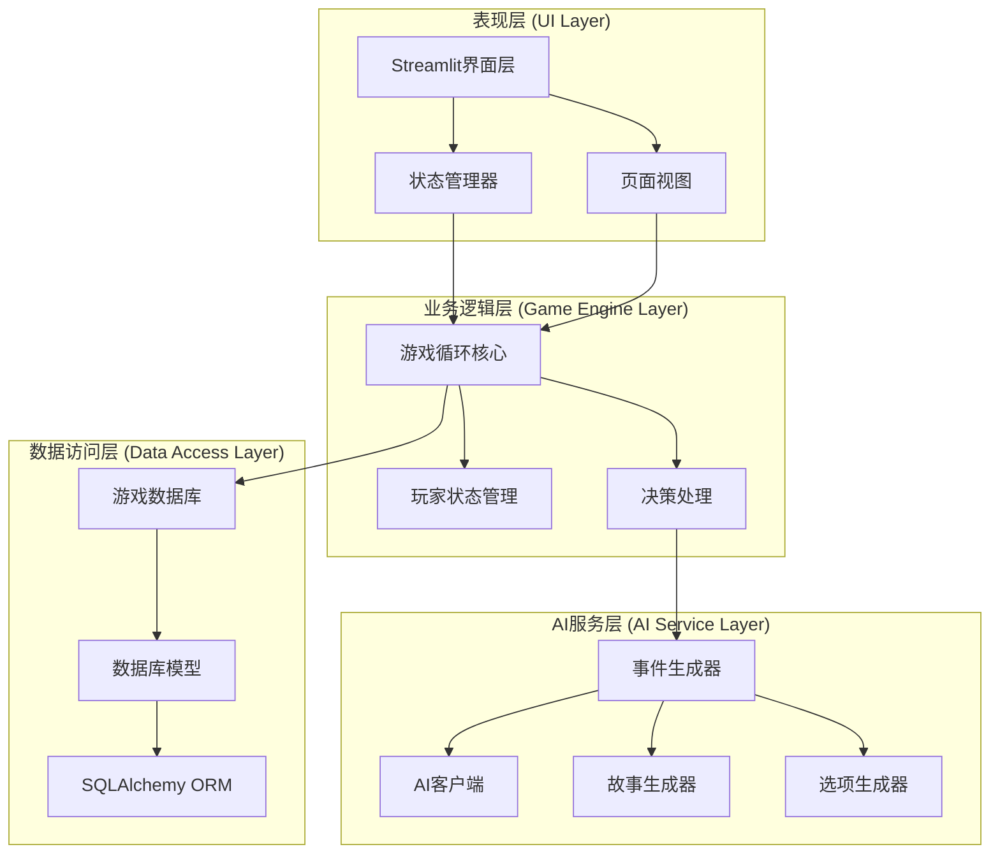

**图表来源**
- [src/ui/streamlit_app.py](file://src/ui/streamlit_app.py#L1-L215)
- [src/game/game_loop.py](file://src/game/game_loop.py#L23-L60)
- [src/ai/generator.py](file://src/ai/generator.py#L30-L66)
- [src/database/db.py](file://src/database/db.py#L10-L16)

## UI层设计

### 页面路由机制

UI层采用基于状态机的页面路由系统，通过`GameState`枚举管理不同的游戏状态：

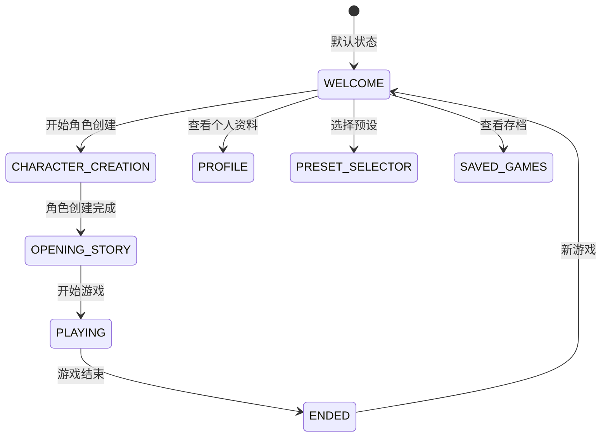

**图表来源**
- [src/ui/state_manager.py](file://src/ui/state_manager.py#L29-L40)

### 状态管理架构

UI层的核心是`SessionStateManager`类，提供统一的状态管理接口：

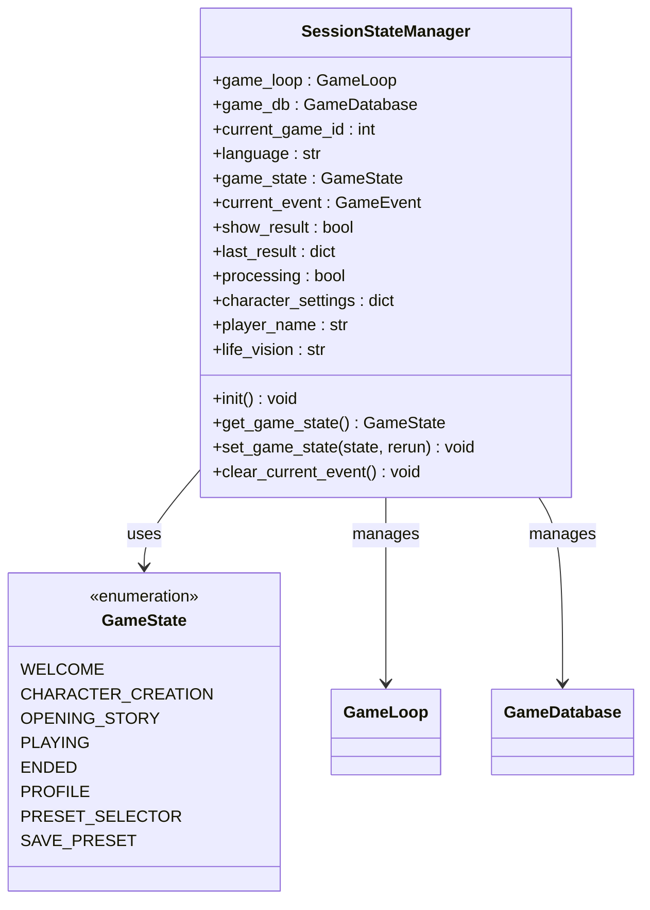

**图表来源**
- [src/ui/state_manager.py](file://src/ui/state_manager.py#L42-L539)

### 组件复用策略

UI层实现了高度的组件复用：

1. **渲染器组件** (`src/ui/components/renderers.py`)：提供统一的事件渲染、选项渲染、结果展示功能
2. **故事调整器** (`src/ui/components/story_adjuster.py`)：支持用户自定义故事内容
3. **样式系统** (`src/ui/styles.py`)：统一的CSS样式管理

### 页面视图模块

主要页面视图包括：

- **游戏主界面** (`src/ui/page_views/game_play.py`)：事件展示、选项处理、结果反馈
- **开场故事** (`src/ui/page_views/opening_story.py`)：个性化开场故事生成
- **欢迎页面** (`src/ui/page_views/welcome.py`)：游戏入口和导航
- **角色创建** (`src/ui/page_views/profile.py`)：角色设置和预设管理

**章节来源**
- [src/ui/streamlit_app.py](file://src/ui/streamlit_app.py#L139-L215)
- [src/ui/state_manager.py](file://src/ui/state_manager.py#L29-L539)
- [src/ui/page_views/game_play.py](file://src/ui/page_views/game_play.py#L18-L662)

## 游戏引擎层设计

### GameLoop核心架构

游戏引擎层的核心是`GameLoop`类，负责整个游戏的生命周期管理：

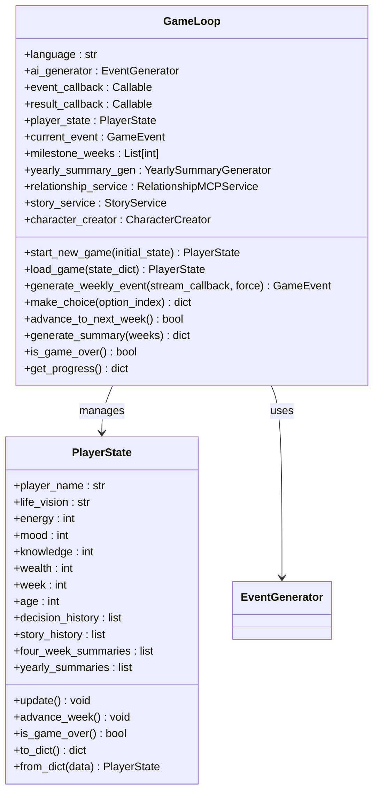

**图表来源**
- [src/game/game_loop.py](file://src/game/game_loop.py#L23-L60)
- [src/game/state.py](file://src/game/state.py#L244-L292)

### 游戏循环管理

GameLoop实现了完整的游戏循环管理：

1. **事件生成**：每周生成AI驱动的个性化事件
2. **决策处理**：处理玩家选择并更新状态
3. **状态转换**：管理游戏进度和里程碑
4. **总结生成**：定期生成周度和年度总结

### 事件处理机制

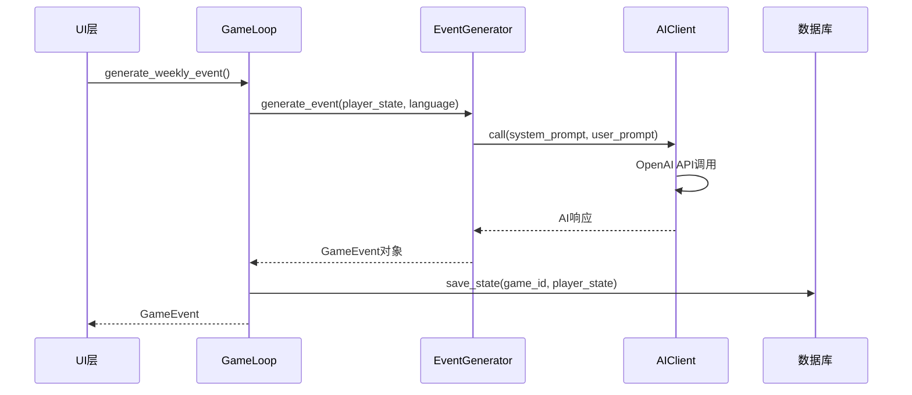

**图表来源**
- [src/game/game_loop.py](file://src/game/game_loop.py#L153-L256)
- [src/ai/generator.py](file://src/ai/generator.py#L183-L238)

### 决策处理流程

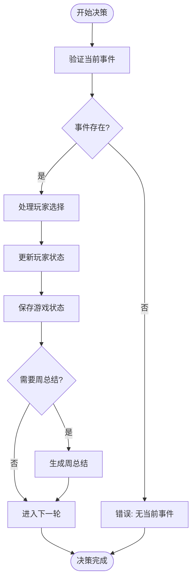

**图表来源**
- [src/game/game_loop.py](file://src/game/game_loop.py#L257-L298)

**章节来源**
- [src/game/game_loop.py](file://src/game/game_loop.py#L23-L1193)
- [src/game/state.py](file://src/game/state.py#L1-L709)

## AI服务层设计

### 门面模式架构

AI服务层采用门面模式设计，通过`EventGenerator`类提供统一的AI调用接口：

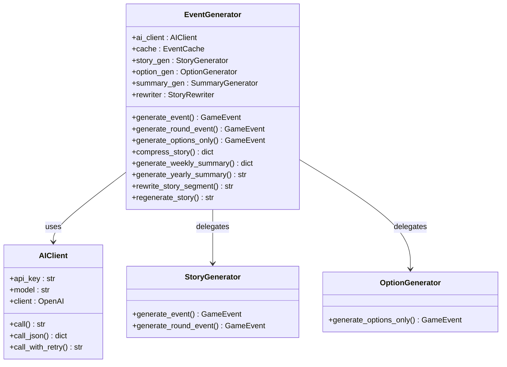

**图表来源**
- [src/ai/generator.py](file://src/ai/generator.py#L30-L66)
- [src/ai/client.py](file://src/ai/client.py#L22-L48)

### 服务抽象设计

AI服务层实现了清晰的服务抽象：

1. **AIClient**：统一的AI调用抽象，封装OpenAI SDK
2. **StoryGenerator**：故事生成服务
3. **OptionGenerator**：选项生成和验证服务
4. **SummaryGenerator**：总结生成服务
5. **StoryRewriter**：故事重写服务

### 错误处理和重试机制

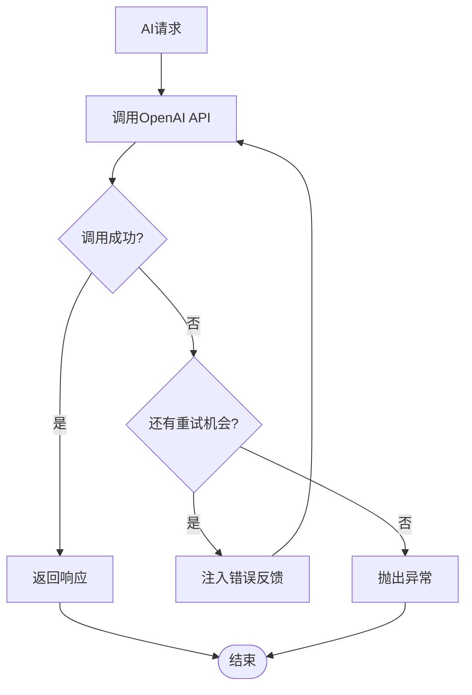

**图表来源**
- [src/ai/client.py](file://src/ai/client.py#L140-L213)

**章节来源**
- [src/ai/client.py](file://src/ai/client.py#L1-L214)
- [src/ai/generator.py](file://src/ai/generator.py#L1-L431)
- [src/ai/models.py](file://src/ai/models.py#L1-L27)

## 数据管理层设计

### 数据库架构

数据管理层采用SQLAlchemy ORM设计，提供完整的数据持久化服务：

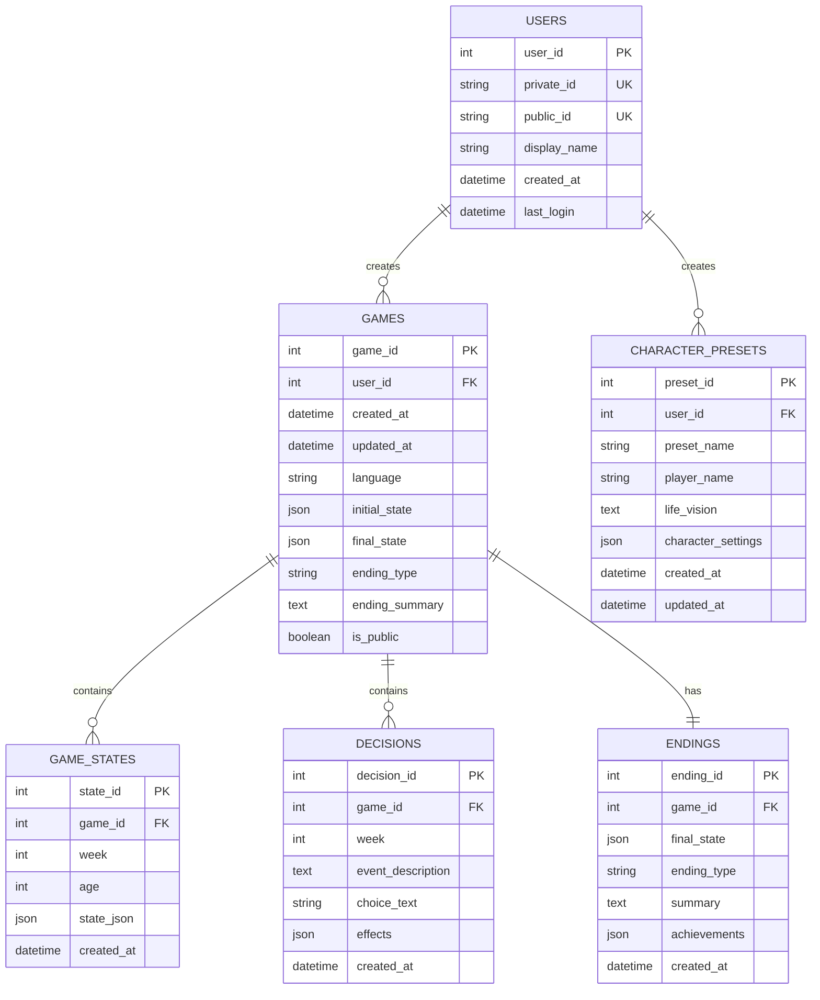

**图表来源**
- [src/database/models.py](file://src/database/models.py#L11-L144)

### 数据库操作封装

`GameDatabase`类提供统一的数据访问接口：

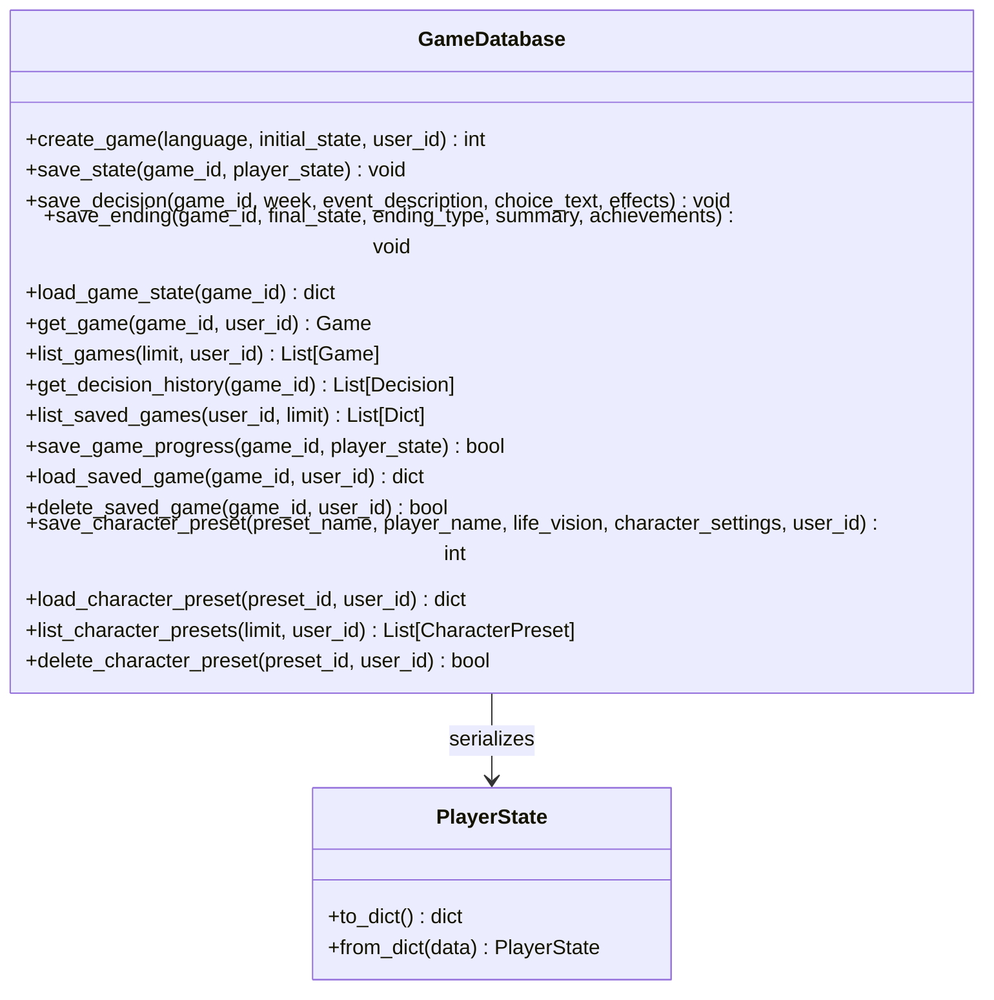

**图表来源**
- [src/database/db.py](file://src/database/db.py#L10-L517)

### 事务管理策略

数据管理层实现了完善的事务管理：

1. **自动事务**：每个数据库操作都在独立的事务中执行
2. **异常处理**：数据库异常自动回滚
3. **连接管理**：使用SessionLocal确保连接正确关闭
4. **级联删除**：游戏删除时自动清理相关数据

**章节来源**
- [src/database/db.py](file://src/database/db.py#L1-L517)
- [src/database/models.py](file://src/database/models.py#L1-L171)

## 依赖关系分析

### 层间依赖图

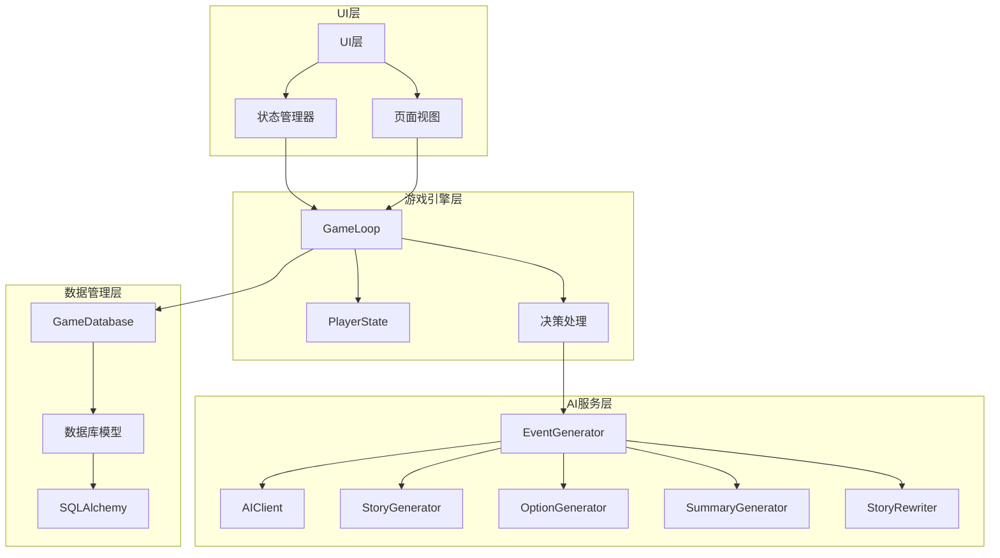

**图表来源**
- [src/ui/streamlit_app.py](file://src/ui/streamlit_app.py#L1-L215)
- [src/game/game_loop.py](file://src/game/game_loop.py#L1-L1193)
- [src/ai/generator.py](file://src/ai/generator.py#L1-L431)
- [src/database/db.py](file://src/database/db.py#L1-L517)

### 关键依赖关系

1. **UI层依赖游戏引擎层**：UI通过GameLoop访问游戏状态和执行游戏逻辑
2. **游戏引擎层依赖AI服务层**：GameLoop通过EventGenerator调用AI服务
3. **游戏引擎层依赖数据管理层**：GameLoop通过GameDatabase进行数据持久化
4. **AI服务层依赖配置层**：AI服务通过Settings获取配置参数

**章节来源**
- [src/ui/state_manager.py](file://src/ui/state_manager.py#L1-L773)
- [src/game/game_loop.py](file://src/game/game_loop.py#L1-L1193)
- [config/settings.py](file://config/settings.py#L1-L100)

## 性能考虑

### 缓存策略

1. **事件缓存**：AI生成的事件会被缓存，避免重复生成
2. **数据库连接池**：使用SQLAlchemy连接池提高数据库访问性能
3. **状态序列化**：PlayerState使用Pydantic进行高效的数据序列化

### 并发处理

1. **流式生成**：支持AI响应的流式处理，提升用户体验
2. **异步操作**：数据库操作使用异步模式减少等待时间
3. **状态同步**：通过SessionStateManager确保状态一致性

### 内存管理

1. **对象生命周期**：合理管理GameLoop和PlayerState对象的创建和销毁
2. **缓存限制**：事件缓存大小限制，防止内存溢出
3. **垃圾回收**：及时清理不再使用的中间数据

## 故障排除指南

### 常见问题及解决方案

1. **OpenAI API配置错误**
   - 检查`.env`文件中的`OPENAI_API_KEY`
   - 验证API密钥的有效性和配额
   - 确认网络连接正常

2. **数据库连接问题**
   - 检查数据库URL配置
   - 验证数据库文件权限
   - 确认数据库版本兼容性

3. **游戏状态异常**
   - 使用`SessionStateManager.clear_game_state()`清理状态
   - 检查PlayerState的验证规则
   - 验证游戏循环的完整性

4. **UI状态同步问题**
   - 确保通过`SessionStateManager`访问状态
   - 检查状态变更后的`st.rerun()`调用
   - 验证事件对象的正确性

**章节来源**
- [src/ui/state_manager.py](file://src/ui/state_manager.py#L510-L535)
- [src/game/state.py](file://src/game/state.py#L531-L551)

## 结论

"人生草稿本"项目采用清晰的四层架构设计，每层都有明确的职责边界和接口定义：

1. **UI层**：提供用户交互界面和状态管理
2. **游戏引擎层**：实现核心游戏逻辑和状态管理
3. **AI服务层**：提供AI驱动的事件生成服务
4. **数据管理层**：实现数据持久化和访问控制

这种架构设计具有以下优势：
- **高内聚低耦合**：每层职责明确，依赖关系清晰
- **可扩展性强**：新增功能只需在相应层级实现
- **可维护性好**：代码结构清晰，便于调试和维护
- **用户体验佳**：流式处理和状态管理提升交互体验

通过门面模式、状态机和ORM等设计模式的应用，项目实现了良好的架构平衡，在保证功能完整性的同时兼顾了性能和可维护性。