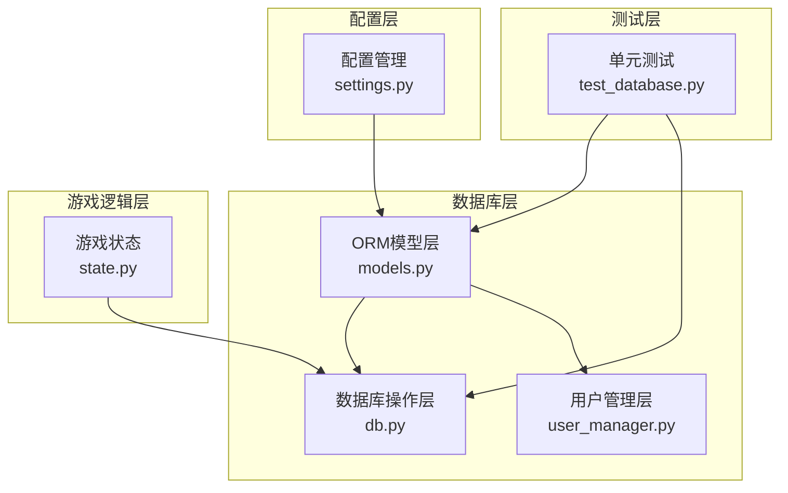
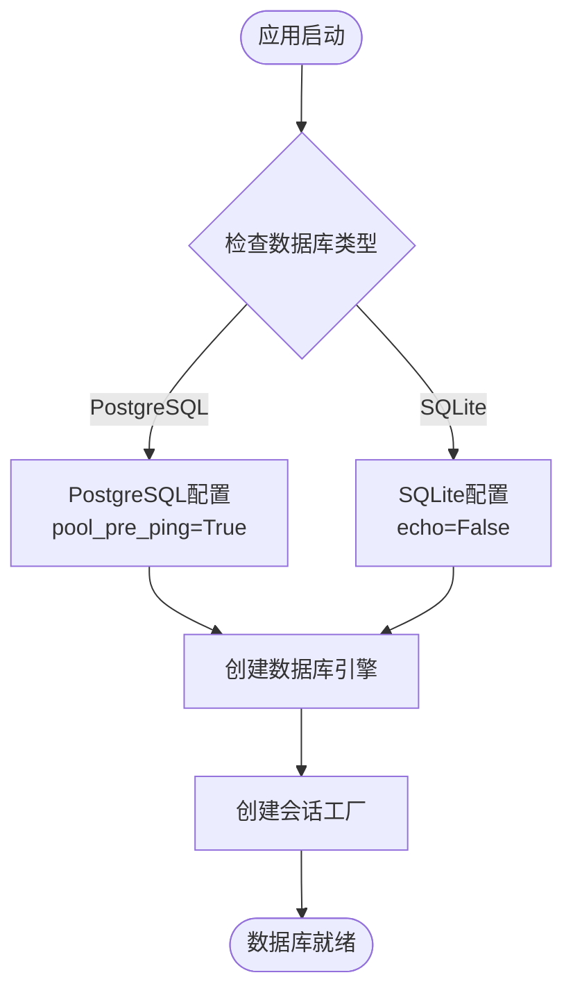
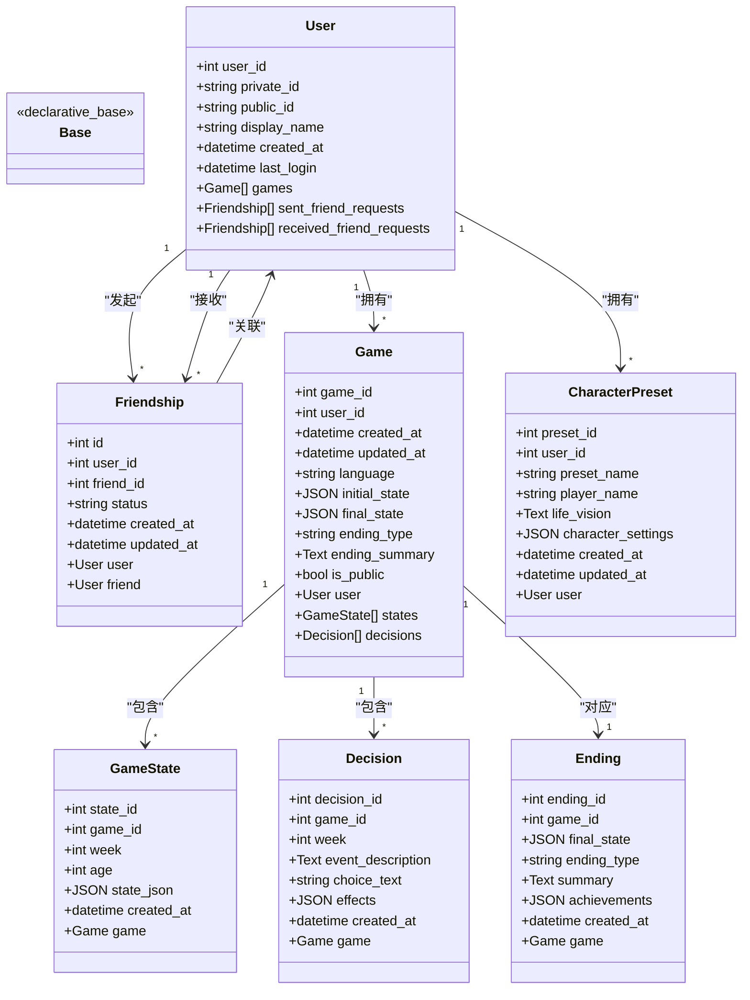
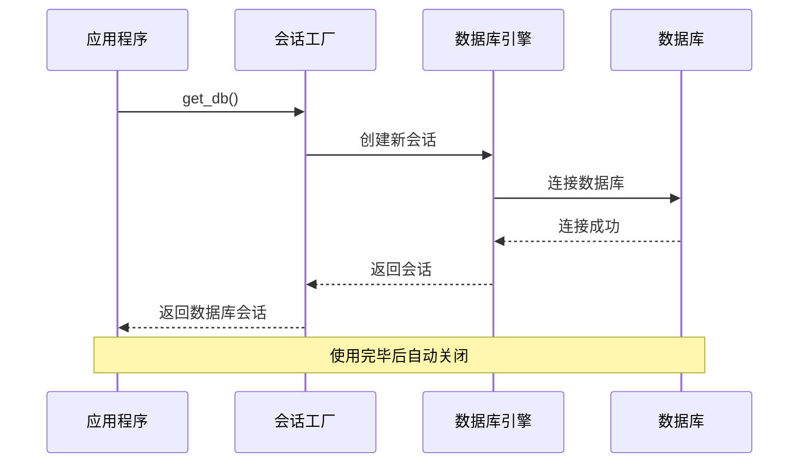
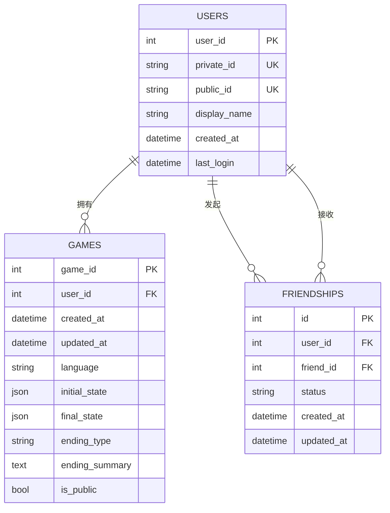
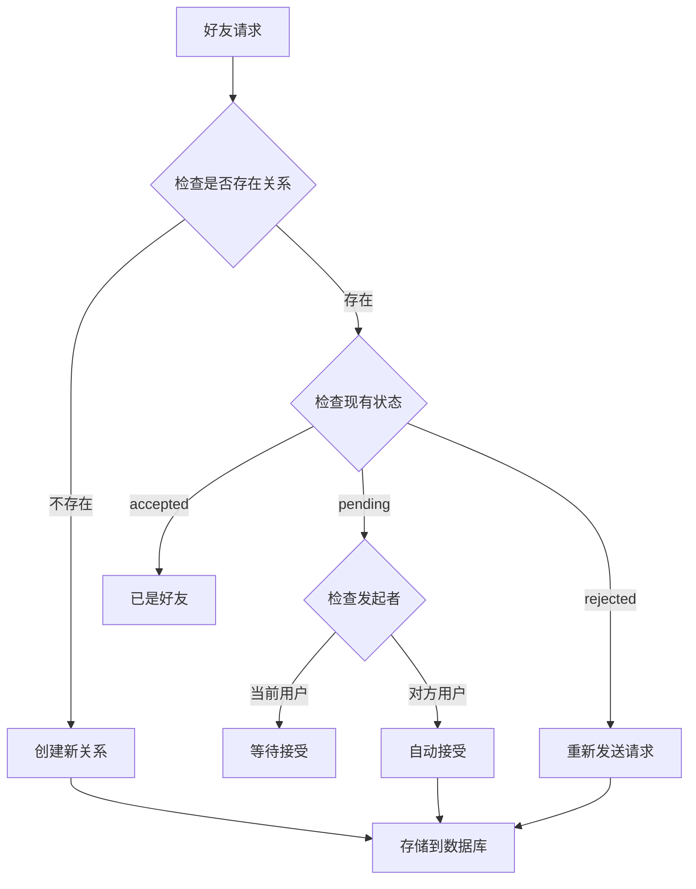
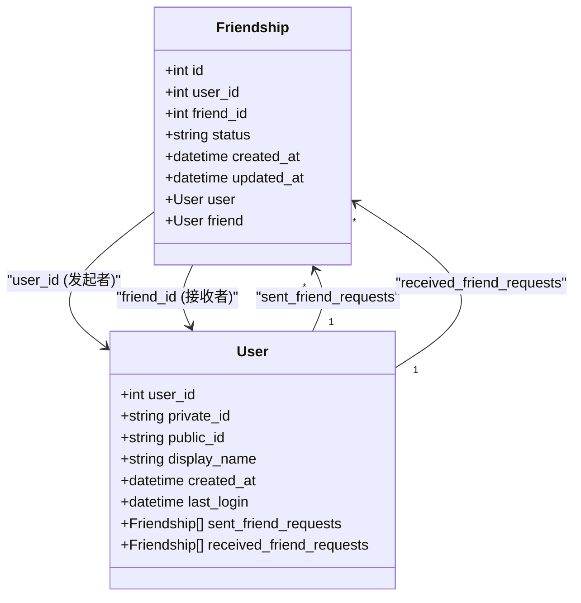
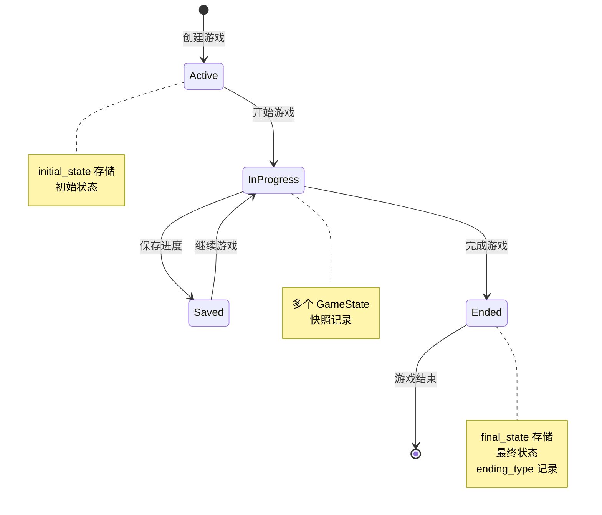
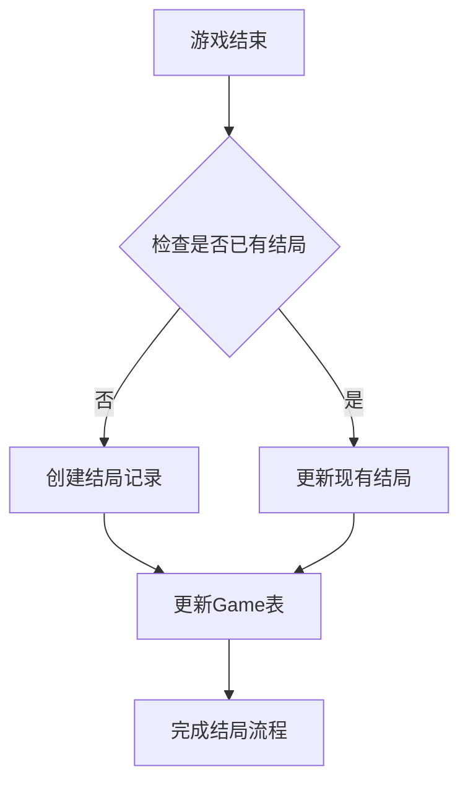
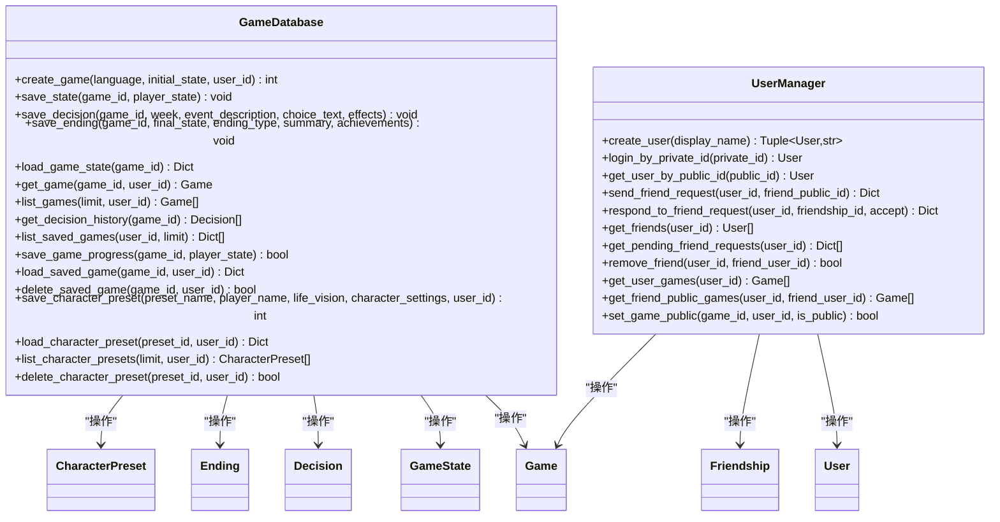

# ORM模型设计

<cite>
**本文档引用的文件**
- [models.py](file://src/database/models.py)
- [db.py](file://src/database/db.py)
- [user_manager.py](file://src/database/user_manager.py)
- [settings.py](file://config/settings.py)
- [state.py](file://src/game/state.py)
- [__init__.py](file://src/database/__init__.py)
- [test_database.py](file://tests/test_database.py)
</cite>

## 目录
1. [简介](#简介)
2. [项目结构](#项目结构)
3. [核心组件](#核心组件)
4. [架构概览](#架构概览)
5. [详细组件分析](#详细组件分析)
6. [依赖关系分析](#依赖关系分析)
7. [性能考虑](#性能考虑)
8. [故障排除指南](#故障排除指南)
9. [结论](#结论)

## 简介

本文件详细分析了Story2项目的SQLAlchemy ORM模型设计，这是一个基于Python的叙事驱动游戏系统。该系统通过精心设计的数据库模型实现了用户管理、游戏状态持久化、决策记录和结局管理等功能。本文档深入解释了每个数据模型的字段定义、数据类型、约束规则和索引设计，阐述了实体关系映射，分析了外键约束、级联删除、唯一性约束等数据库完整性保证机制，并提供了模型类的使用示例和最佳实践。

## 项目结构

该项目采用模块化的数据库架构设计，主要包含以下核心组件：



**图表来源**
- [models.py](file://src/database/models.py#L1-L171)
- [db.py](file://src/database/db.py#L1-L517)
- [user_manager.py](file://src/database/user_manager.py#L1-L401)

**章节来源**
- [models.py](file://src/database/models.py#L1-L171)
- [db.py](file://src/database/db.py#L1-L517)
- [user_manager.py](file://src/database/user_manager.py#L1-L401)

## 核心组件

### 数据库引擎配置

系统支持多种数据库后端，通过统一的配置接口实现：



**图表来源**
- [models.py](file://src/database/models.py#L146-L156)

### 主要数据模型

系统包含7个核心数据模型，每个模型都经过精心设计以满足特定的业务需求：

| 模型名称 | 表名 | 主要用途 | 关键特性 |
|---------|------|----------|----------|
| User | users | 用户账户管理 | 唯一ID、显示名称、登录时间 |
| Friendship | friendships | 好友关系管理 | 双向关系、状态跟踪 |
| Game | games | 游戏会话管理 | 用户关联、状态持久化 |
| GameState | game_states | 游戏状态快照 | 时间序列、JSON存储 |
| Decision | decisions | 决策记录 | 事件描述、效果追踪 |
| Ending | endings | 游戏结局管理 | 唯一性约束、成就记录 |
| CharacterPreset | character_presets | 角色预设管理 | 用户关联、JSON配置 |

**章节来源**
- [models.py](file://src/database/models.py#L11-L144)

## 架构概览

### 整体架构设计



**图表来源**
- [models.py](file://src/database/models.py#L11-L144)

### 数据库连接管理

系统采用会话工厂模式管理数据库连接，确保资源的有效管理和释放：



**图表来源**
- [models.py](file://src/database/models.py#L164-L170)

**章节来源**
- [models.py](file://src/database/models.py#L1-L171)

## 详细组件分析

### User模型 - 用户账户管理

User模型是整个系统的核心实体，负责用户身份认证和账户管理。

#### 字段定义与约束

| 字段名 | 数据类型 | 约束条件 | 描述 |
|--------|----------|----------|------|
| user_id | Integer | PRIMARY KEY, AUTO_INCREMENT | 自增主键 |
| private_id | String(32) | UNIQUE, NOT NULL, INDEX | 私有ID，用于登录认证 |
| public_id | String(8) | UNIQUE, NOT NULL, INDEX | 公有ID，用于展示和添加好友 |
| display_name | String(50) | NULLABLE | 用户自定义显示名称 |
| created_at | DateTime | DEFAULT UTCNOW | 账户创建时间 |
| last_login | DateTime | NULLABLE | 最后登录时间 |

#### 关系映射

User模型建立了复杂的一对多关系：



**图表来源**
- [models.py](file://src/database/models.py#L11-L37)

#### 关键特性

1. **双重ID系统**：同时维护私有ID和公有ID，分别用于安全认证和社交展示
2. **索引优化**：对唯一字段建立索引，提升查询性能
3. **级联删除**：用户删除时自动清理相关游戏和好友请求

**章节来源**
- [models.py](file://src/database/models.py#L11-L37)

### Friendship模型 - 好友关系管理

Friendship模型实现了复杂的好友关系系统，支持请求、接受、拒绝等多种状态。

#### 字段定义与业务逻辑

| 字段名 | 数据类型 | 约束条件 | 描述 |
|--------|----------|----------|------|
| id | Integer | PRIMARY KEY, AUTO_INCREMENT | 关系记录主键 |
| user_id | Integer | NOT NULL, FOREIGN KEY | 发起好友请求的用户ID |
| friend_id | Integer | NOT NULL, FOREIGN KEY | 接收好友请求的用户ID |
| status | String(20) | DEFAULT "pending" | 关系状态：pending/accepted/rejected |
| created_at | DateTime | DEFAULT UTCNOW | 请求创建时间 |
| updated_at | DateTime | DEFAULT UTCNOW, ON UPDATE | 最后更新时间 |

#### 唯一性约束

系统通过复合索引确保同一用户对之间的关系唯一性：



**图表来源**
- [user_manager.py](file://src/database/user_manager.py#L165-L224)

#### 关系映射策略

Friendship模型使用了特殊的外键映射策略：



**图表来源**
- [models.py](file://src/database/models.py#L40-L58)

**章节来源**
- [models.py](file://src/database/models.py#L40-L58)
- [user_manager.py](file://src/database/user_manager.py#L165-L224)

### Game模型 - 游戏会话管理

Game模型是游戏状态持久化的核心，负责存储游戏的基本信息和元数据。

#### 字段设计与业务含义

| 字段名 | 数据类型 | 约束条件 | 描述 |
|--------|----------|----------|------|
| game_id | Integer | PRIMARY KEY, AUTO_INCREMENT | 游戏会话主键 |
| user_id | Integer | FOREIGN KEY, NULLABLE, INDEX | 关联的用户ID（可为空） |
| created_at | DateTime | DEFAULT UTCNOW | 游戏创建时间 |
| updated_at | DateTime | DEFAULT UTCNOW, ON UPDATE | 最后更新时间 |
| language | String(10) | DEFAULT "en" | 游戏语言设置 |
| initial_state | JSON | NOT NULL | 游戏初始状态 |
| final_state | JSON | NULLABLE | 游戏最终状态 |
| ending_type | String(50) | NULLABLE | 游戏结局类型 |
| ending_summary | Text | NULLABLE | 结局摘要说明 |
| is_public | Boolean | DEFAULT FALSE | 是否公开给好友查看 |

#### 状态管理策略



**图表来源**
- [models.py](file://src/database/models.py#L61-L80)

#### 关系设计

Game模型与多个子模型建立了复杂的关联关系：

**章节来源**
- [models.py](file://src/database/models.py#L61-L80)

### GameState模型 - 游戏状态快照

GameState模型专门负责存储游戏的时间序列状态，支持游戏进度的精确追踪。

#### 字段定义与时间序列设计

| 字段名 | 数据类型 | 约束条件 | 描述 |
|--------|----------|----------|------|
| state_id | Integer | PRIMARY KEY, AUTO_INCREMENT | 状态快照主键 |
| game_id | Integer | NOT NULL, FOREIGN KEY | 关联的游戏ID |
| week | Integer | NOT NULL | 游戏周数 |
| age | Integer | NOT NULL | 角色年龄 |
| state_json | JSON | NOT NULL | 完整的状态JSON |
| created_at | DateTime | DEFAULT UTCNOW | 快照创建时间 |

#### 查询优化策略

系统通过以下策略优化状态查询：

1. **索引设计**：对game_id和week字段建立复合索引
2. **时间序列优化**：按周数降序排列，快速获取最新状态
3. **回退机制**：当快照缺失时自动回退到初始状态

**章节来源**
- [models.py](file://src/database/models.py#L82-L95)

### Decision模型 - 决策记录

Decision模型记录玩家在游戏中做出的所有重要决策。

#### 字段设计与决策追踪

| 字段名 | 数据类型 | 约束条件 | 描述 |
|--------|----------|----------|------|
| decision_id | Integer | PRIMARY KEY, AUTO_INCREMENT | 决策记录主键 |
| game_id | Integer | NOT NULL, FOREIGN KEY | 关联的游戏ID |
| week | Integer | NOT NULL | 决策发生的周数 |
| event_description | Text | NOT NULL | 事件描述 |
| choice_text | String(200) | NOT NULL | 选择的文本描述 |
| effects | JSON | NOT NULL | 决策产生的效果 |
| created_at | DateTime | DEFAULT UTCNOW | 决策记录时间 |

#### 决策历史分析

系统通过决策历史实现以下功能：

1. **游戏回放**：重现玩家的游戏历程
2. **统计分析**：分析玩家决策模式
3. **成就系统**：基于决策历史解锁成就

**章节来源**
- [models.py](file://src/database/models.py#L97-L111)

### Ending模型 - 游戏结局管理

Ending模型专门管理游戏的结局信息，确保每个游戏只有一个最终结局。

#### 唯一性约束设计

| 字段名 | 数据类型 | 约束条件 | 描述 |
|--------|----------|----------|------|
| ending_id | Integer | PRIMARY KEY, AUTO_INCREMENT | 结局记录主键 |
| game_id | Integer | NOT NULL, UNIQUE, FOREIGN KEY | 关联的游戏ID（唯一） |
| final_state | JSON | NOT NULL | 最终状态数据 |
| ending_type | String(50) | NOT NULL | 结局类型标识 |
| summary | Text | NOT NULL | 结局摘要 |
| achievements | JSON | NULLABLE | 解锁的成就 |
| created_at | DateTime | DEFAULT UTCNOW | 结局创建时间 |

#### 结局系统架构



**图表来源**
- [models.py](file://src/database/models.py#L113-L127)

**章节来源**
- [models.py](file://src/database/models.py#L113-L127)

### CharacterPreset模型 - 角色预设管理

CharacterPreset模型允许用户保存和管理角色创建的预设配置。

#### 字段设计与用户关联

| 字段名 | 数据类型 | 约束条件 | 描述 |
|--------|----------|----------|------|
| preset_id | Integer | PRIMARY KEY, AUTO_INCREMENT | 预设主键 |
| user_id | Integer | FOREIGN KEY, NULLABLE, INDEX | 关联用户ID（可为空） |
| preset_name | String(100) | NOT NULL | 预设名称 |
| player_name | String(100) | NOT NULL | 玩家名称 |
| life_vision | Text | NULLABLE | 人生愿景 |
| character_settings | JSON | NOT NULL | 角色设置JSON |
| created_at | DateTime | DEFAULT UTCNOW | 创建时间 |
| updated_at | DateTime | DEFAULT UTCNOW, ON UPDATE | 更新时间 |

#### 用户权限控制

系统通过user_id字段实现灵活的权限控制：

1. **匿名用户**：user_id为NULL的预设可被所有人访问
2. **登录用户**：只能访问自己的预设
3. **权限验证**：所有操作都包含用户权限检查

**章节来源**
- [models.py](file://src/database/models.py#L129-L144)

## 依赖关系分析

### 数据库操作层设计

GameDatabase类作为数据库操作的主要入口，封装了所有数据持久化操作：



**图表来源**
- [db.py](file://src/database/db.py#L10-L517)
- [user_manager.py](file://src/database/user_manager.py#L34-L401)

### 外键约束与级联删除

系统通过外键约束确保数据完整性：

```mermaid
erDiagram
USERS {
int user_id PK
}
FRIENDSHIPS {
int id PK
int user_id FK
int friend_id FK
}
GAMES {
int game_id PK
int user_id FK
}
GAME_STATES {
int state_id PK
int game_id FK
}
DECISIONS {
int decision_id PK
int game_id FK
}
ENDINGS {
int ending_id PK
int game_id FK UK
}
CHARACTER_PRESETS {
int preset_id PK
int user_id FK
}
USERS ||--o{ FRIENDSHIPS : "user_id"
USERS ||--o{ FRIENDSHIPS : "friend_id"
USERS ||--o{ GAMES : "user_id"
GAMES ||--o{ GAME_STATES : "game_id"
GAMES ||--o{ DECISIONS : "game_id"
GAMES ||--|| ENDINGS : "game_id"
USERS ||--o{ CHARACTER_PRESETS : "user_id"
```

**图表来源**
- [models.py](file://src/database/models.py#L40-L144)

**章节来源**
- [db.py](file://src/database/db.py#L1-L517)
- [user_manager.py](file://src/database/user_manager.py#L1-L401)

## 性能考虑

### 查询优化策略

1. **索引设计**：为高频查询字段建立适当索引
   - User模型：private_id、public_id、user_id
   - Friendship模型：user_id、friend_id、(user_id, friend_id)复合索引
   - Game模型：user_id、game_id
   - GameState模型：game_id、week

2. **查询缓存**：利用SQLAlchemy的查询缓存机制减少重复查询

3. **批量操作**：使用批量插入和更新减少数据库往返

### 连接池管理

系统采用连接池管理数据库连接：

```python
# PostgreSQL配置
engine = create_engine(
    database_url, 
    echo=False, 
    pool_pre_ping=True,
    pool_size=20,
    max_overflow=30,
    pool_recycle=3600
)
```

### 内存优化

1. **懒加载**：使用relationship的lazy参数控制关联对象的加载时机
2. **分页查询**：对大量数据使用LIMIT和OFFSET进行分页
3. **选择性字段**：使用columns_only参数只加载必要字段

## 故障排除指南

### 常见问题诊断

1. **数据库连接失败**
   - 检查DATABASE_URL环境变量配置
   - 验证数据库服务可用性
   - 确认网络连接和防火墙设置

2. **迁移失败**
   - 检查数据库权限
   - 验证表结构兼容性
   - 确认数据类型转换正确

3. **性能问题**
   - 分析慢查询日志
   - 检查索引使用情况
   - 优化查询语句

### 错误处理机制

系统实现了完善的错误处理：

```python
def save_game_progress(self, game_id: int, player_state: 'PlayerState') -> bool:
    try:
        # 保存逻辑
        db.commit()
        return True
    except Exception as e:
        db.rollback()
        logger.error(f"保存失败: {e}")
        return False
    finally:
        db.close()
```

**章节来源**
- [db.py](file://src/database/db.py#L285-L321)

## 结论

Story2项目的ORM模型设计体现了现代Web应用的最佳实践，通过精心设计的数据模型和关系映射，实现了：

1. **清晰的职责分离**：模型层、业务逻辑层、数据访问层职责明确
2. **强大的数据完整性**：通过外键约束、唯一性约束确保数据一致性
3. **灵活的扩展性**：模块化设计支持功能扩展和性能优化
4. **良好的用户体验**：通过索引优化和查询缓存提升响应速度

该设计为叙事驱动游戏系统的数据库层提供了坚实的基础，既满足了当前的功能需求，也为未来的扩展预留了充足的空间。