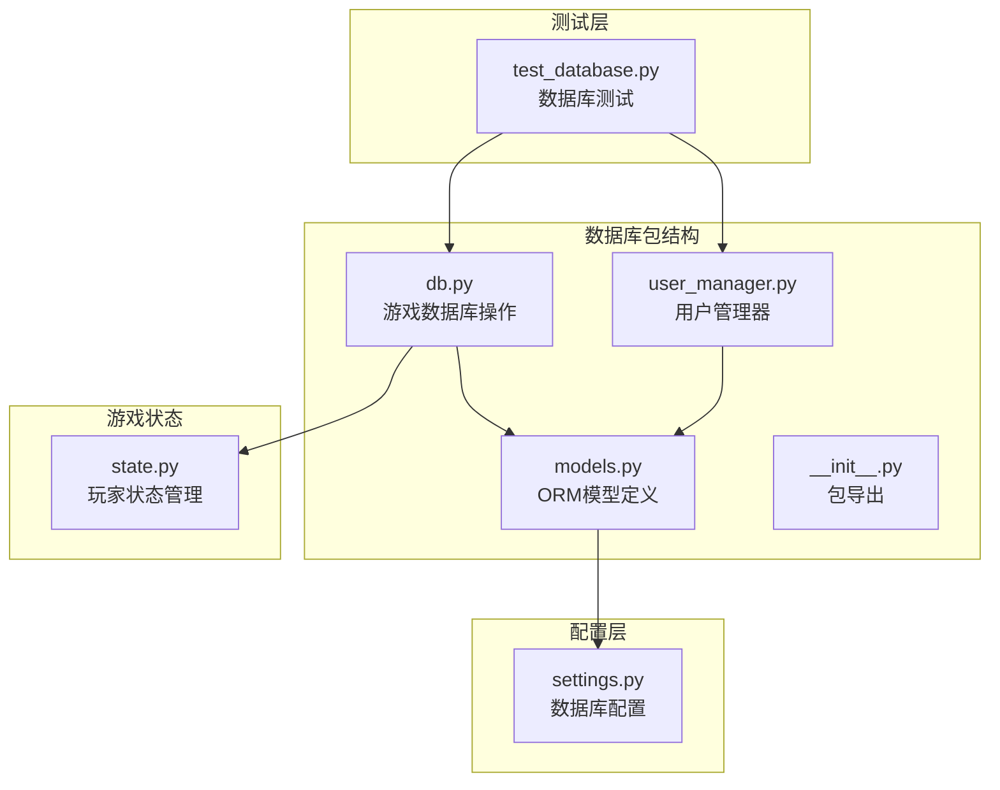
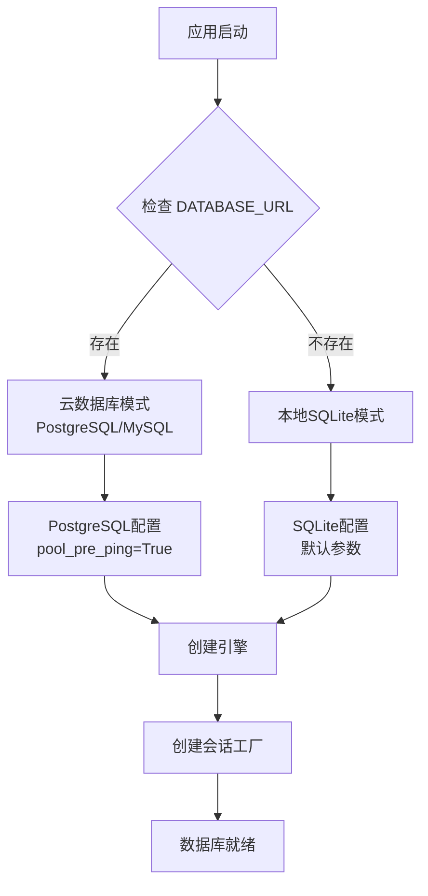
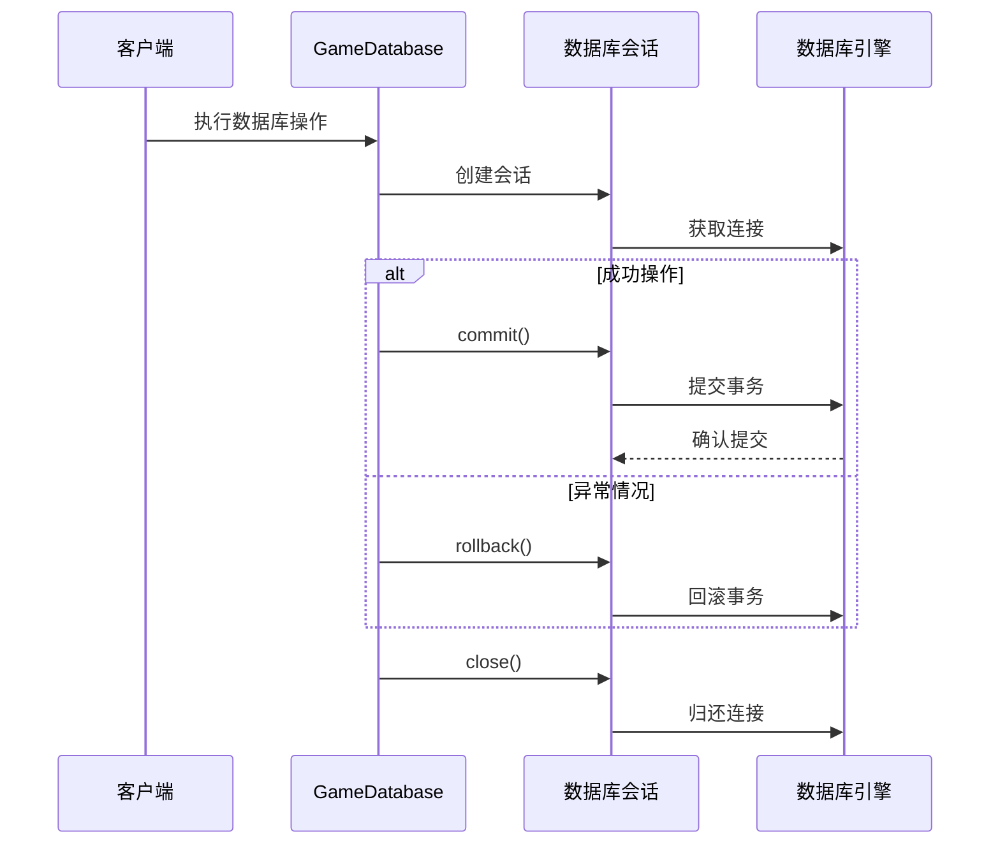
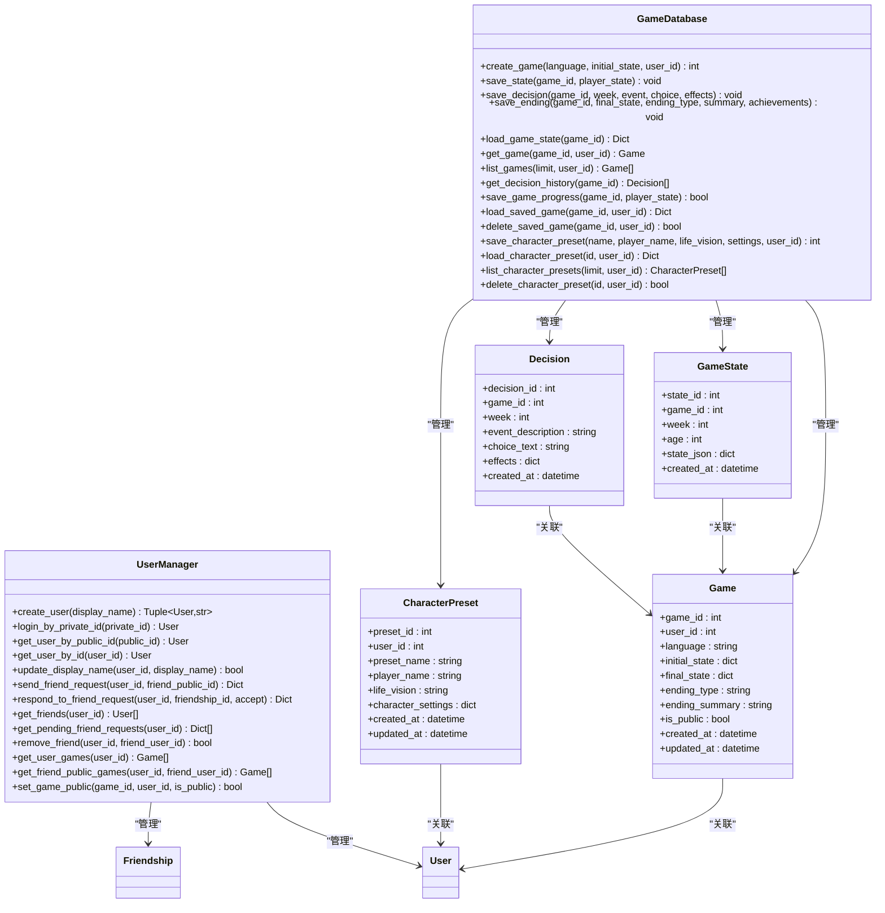
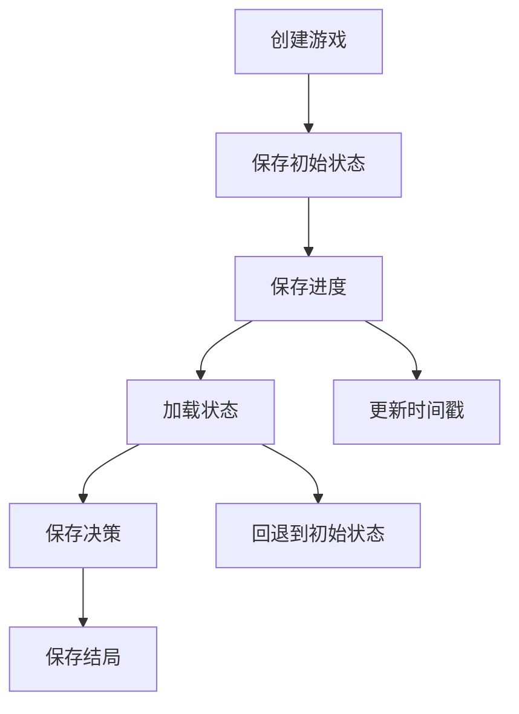
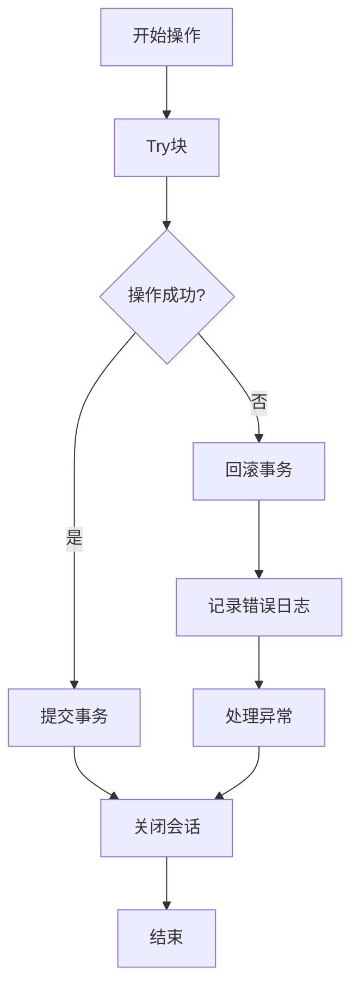
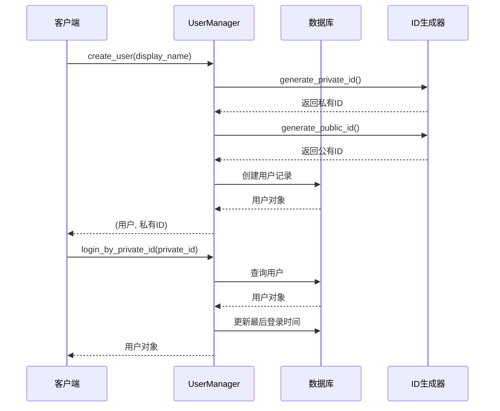
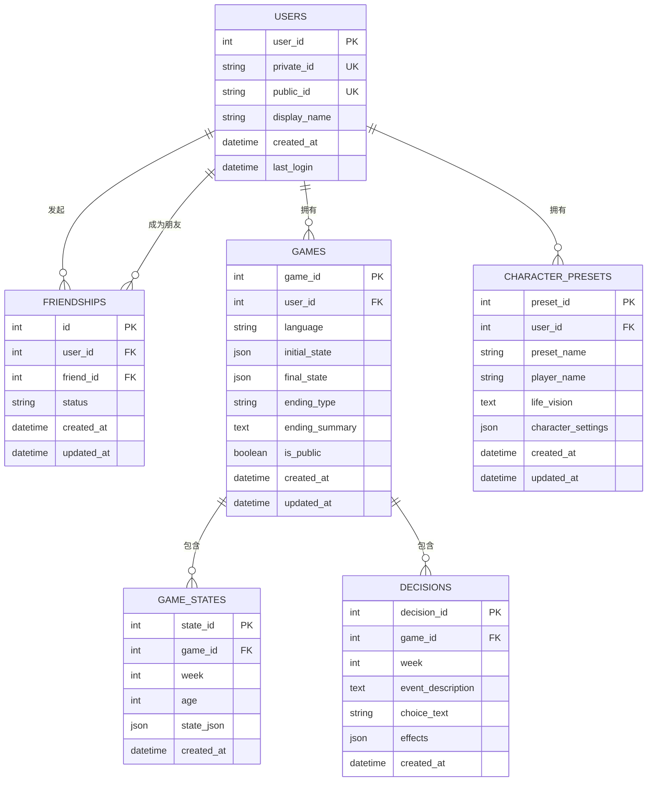
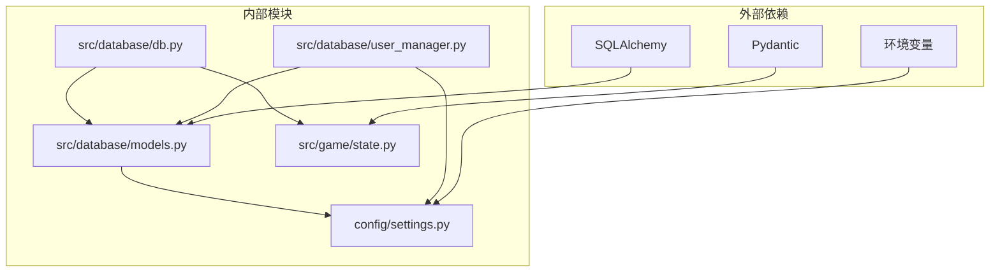
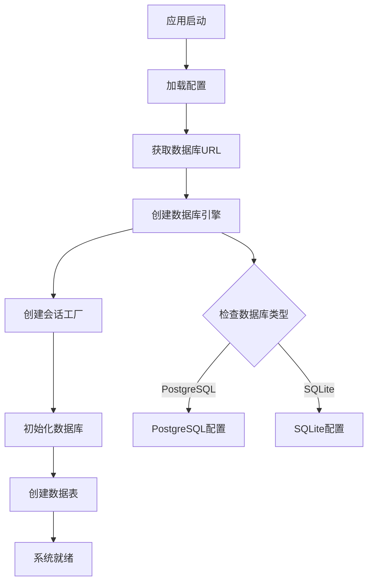

# 数据库操作接口

<cite>
**本文档引用的文件**
- [src/database/db.py](file://src/database/db.py)
- [src/database/models.py](file://src/database/models.py)
- [src/database/user_manager.py](file://src/database/user_manager.py)
- [src/database/__init__.py](file://src/database/__init__.py)
- [config/settings.py](file://config/settings.py)
- [tests/test_database.py](file://tests/test_database.py)
- [src/game/state.py](file://src/game/state.py)
- [migrate_add_user_id.py](file://migrate_add_user_id.py)
</cite>

## 目录
1. [简介](#简介)
2. [项目结构](#项目结构)
3. [核心组件](#核心组件)
4. [架构概览](#架构概览)
5. [详细组件分析](#详细组件分析)
6. [依赖关系分析](#依赖关系分析)
7. [性能考虑](#性能考虑)
8. [故障排除指南](#故障排除指南)
9. [结论](#结论)
10. [附录](#附录)

## 简介

本项目实现了完整的数据库操作接口，基于 SQLAlchemy ORM 提供了游戏数据持久化的完整解决方案。系统支持 SQLite 和 PostgreSQL 两种数据库引擎，具备完善的连接管理、事务处理和会话生命周期控制机制。

数据库层主要负责以下核心功能：
- 游戏状态持久化和恢复
- 用户身份管理和认证
- 好友关系系统
- 角色预设管理
- 数据库初始化和迁移

## 项目结构

**图表来源**
- [src/database/db.py](file://src/database/db.py#L1-L517)
- [src/database/models.py](file://src/database/models.py#L1-L171)
- [src/database/user_manager.py](file://src/database/user_manager.py#L1-L401)
- [config/settings.py](file://config/settings.py#L1-L100)

**章节来源**
- [src/database/db.py](file://src/database/db.py#L1-L50)
- [src/database/models.py](file://src/database/models.py#L1-L50)
- [src/database/user_manager.py](file://src/database/user_manager.py#L1-L50)

## 核心组件

### 数据库引擎配置

系统采用统一的数据库引擎配置策略，支持多种数据库后端：

**图表来源**
- [src/database/models.py](file://src/database/models.py#L146-L156)
- [config/settings.py](file://config/settings.py#L68-L82)

### 连接池管理

系统实现了标准的 SQLAlchemy 连接池管理机制：

- **SQLite 模式**：使用默认连接池配置，适合单机应用
- **PostgreSQL 模式**：启用 `pool_pre_ping=True` 参数，自动检测和重建失效连接
- **会话管理**：每个操作创建独立的数据库会话，确保线程安全

### 事务处理机制

所有数据库操作都遵循严格的事务处理原则：

**图表来源**
- [src/database/db.py](file://src/database/db.py#L34-L46)
- [src/database/db.py](file://src/database/db.py#L294-L321)

**章节来源**
- [src/database/models.py](file://src/database/models.py#L146-L171)
- [src/database/db.py](file://src/database/db.py#L34-L46)

## 架构概览

**图表来源**
- [src/database/db.py](file://src/database/db.py#L10-L517)
- [src/database/models.py](file://src/database/models.py#L61-L144)
- [src/database/user_manager.py](file://src/database/user_manager.py#L34-L401)

## 详细组件分析

### GameDatabase 类详解

GameDatabase 是数据库操作的核心接口，提供了完整的 CRUD 操作和业务逻辑封装。

#### 游戏状态管理

**图表来源**
- [src/database/db.py](file://src/database/db.py#L17-L143)
- [src/database/db.py](file://src/database/db.py#L274-L321)

#### 数据访问模式

系统实现了多种数据访问模式以满足不同场景需求：

1. **单记录查询**：使用 `get_game()` 方法进行精确匹配
2. **列表查询**：使用 `list_games()` 和 `list_character_presets()` 进行分页查询
3. **历史查询**：使用 `get_decision_history()` 获取完整决策历史
4. **复合查询**：结合多个条件进行复杂查询（如用户权限验证）

#### 异常处理机制

**图表来源**
- [src/database/db.py](file://src/database/db.py#L294-L321)

**章节来源**
- [src/database/db.py](file://src/database/db.py#L10-L517)

### 用户管理系统

UserManager 提供了完整的用户身份管理和社交功能：

#### 用户身份管理

**图表来源**
- [src/database/user_manager.py](file://src/database/user_manager.py#L68-L127)

#### 好友关系系统

系统实现了完整的社交网络功能：

- **请求管理**：支持发送、接受、拒绝好友请求
- **关系维护**：自动处理互相关注和双向关系
- **状态跟踪**：支持 pending、accepted、rejected 三种状态
- **权限验证**：确保用户只能操作自己的好友关系

**章节来源**
- [src/database/user_manager.py](file://src/database/user_manager.py#L34-L401)

### 数据模型设计

系统采用标准化的 ORM 模型设计，支持完整的数据关系映射：

#### 核心数据模型

**图表来源**
- [src/database/models.py](file://src/database/models.py#L11-L144)

**章节来源**
- [src/database/models.py](file://src/database/models.py#L1-L171)

## 依赖关系分析

**图表来源**
- [src/database/db.py](file://src/database/db.py#L1-L8)
- [src/database/models.py](file://src/database/models.py#L1-L6)
- [src/database/user_manager.py](file://src/database/user_manager.py#L1-L12)

### 数据库初始化流程

**图表来源**
- [src/database/models.py](file://src/database/models.py#L146-L161)
- [config/settings.py](file://config/settings.py#L68-L82)

**章节来源**
- [src/database/models.py](file://src/database/models.py#L146-L171)
- [config/settings.py](file://config/settings.py#L68-L82)

## 性能考虑

### 连接池优化

系统在 PostgreSQL 模式下启用了连接池预检查机制：

- **pool_pre_ping=True**：自动检测连接有效性，避免使用失效连接
- **自动重连**：连接失效时自动重建连接
- **资源回收**：及时释放数据库连接资源

### 查询优化策略

1. **索引设计**：为常用查询字段建立索引
   - `games.user_id`：用户游戏查询
   - `character_presets.user_id`：用户预设查询
   - `users.private_id/public_id`：用户身份查询

2. **查询优化**：
   - 使用 `order_by().limit()` 实现分页查询
   - 避免 N+1 查询问题，使用 `joinedload` 或 `selectinload`
   - 合理使用 `filter()` 条件查询

3. **缓存策略**：
   - 游戏状态采用增量保存，避免全量更新
   - 使用 `updated_at` 字段跟踪数据变更

### 批量操作

系统支持高效的批量数据操作：

- **批量插入**：使用 `add_all()` 方法进行批量插入
- **批量查询**：使用 `in_()` 方法进行批量条件查询
- **批量更新**：使用 `bulk_update_mappings()` 进行高效更新

## 故障排除指南

### 常见问题及解决方案

#### 连接问题

**问题**：数据库连接失败
**原因**：
- 数据库服务未启动
- 连接字符串配置错误
- 权限不足

**解决方案**：
1. 检查数据库服务状态
2. 验证 `DATABASE_URL` 环境变量
3. 确认数据库用户权限

#### 数据库迁移

**问题**：数据库版本不匹配
**解决方案**：
1. 检查现有数据库结构
2. 运行迁移脚本 `migrate_add_user_id.py`
3. 验证迁移结果

#### 性能问题

**问题**：查询响应缓慢
**解决方案**：
1. 检查数据库索引
2. 优化查询语句
3. 考虑添加适当的索引

**章节来源**
- [migrate_add_user_id.py](file://migrate_add_user_id.py#L42-L77)

### 日志监控

系统实现了完善的日志记录机制：

- **操作日志**：记录所有数据库操作
- **错误日志**：捕获和记录异常信息
- **性能日志**：监控数据库性能指标

## 结论

本数据库操作接口实现了完整的数据持久化解决方案，具有以下特点：

1. **架构清晰**：采用分层设计，职责明确
2. **扩展性强**：支持多种数据库后端
3. **事务安全**：严格的事务处理机制
4. **性能优化**：合理的查询和连接池设计
5. **易于维护**：清晰的代码结构和文档

系统为游戏应用提供了可靠的数据存储基础，支持复杂的用户管理和社交功能，能够满足从单机应用到云端部署的各种需求。

## 附录

### 最佳实践建议

1. **连接管理**
   - 始终使用 try-finally 或 with 语句确保连接正确关闭
   - 在高并发场景下合理配置连接池大小

2. **事务处理**
   - 将相关操作放在同一个事务中
   - 及时处理异常并进行回滚

3. **查询优化**
   - 为常用查询字段建立索引
   - 避免 SELECT *
   - 使用分页查询处理大量数据

4. **数据完整性**
   - 使用外键约束保证引用完整性
   - 实施适当的业务规则验证

5. **安全性**
   - 防止 SQL 注入攻击
   - 实施适当的访问控制
   - 定期备份重要数据