# 数据管理层设计

<cite>
**本文档引用的文件**
- [src/database/db.py](file://src/database/db.py)
- [src/database/models.py](file://src/database/models.py)
- [src/database/user_manager.py](file://src/database/user_manager.py)
- [src/database/__init__.py](file://src/database/__init__.py)
- [config/settings.py](file://config/settings.py)
- [src/game/state.py](file://src/game/state.py)
- [tests/test_database.py](file://tests/test_database.py)
- [migrate_add_user_id.py](file://migrate_add_user_id.py)
- [src/ui/session_manager.py](file://src/ui/session_manager.py)
</cite>

## 目录
1. [简介](#简介)
2. [项目结构](#项目结构)
3. [核心组件](#核心组件)
4. [架构概览](#架构概览)
5. [详细组件分析](#详细组件分析)
6. [依赖关系分析](#依赖关系分析)
7. [性能考虑](#性能考虑)
8. [故障排除指南](#故障排除指南)
9. [结论](#结论)

## 简介

数据管理层是整个故事生成游戏的核心基础设施，负责管理用户数据、游戏状态、决策历史和角色关系等所有持久化数据。该系统采用基于SQLAlchemy的ORM架构，支持本地SQLite和云端数据库两种部署模式，提供了完整的用户认证、会话管理和权限控制功能。

数据管理层的主要职责包括：
- 用户身份管理和认证系统
- 游戏状态持久化和恢复
- 决策历史记录和分析
- 角色关系数据管理
- 数据迁移和版本控制
- 连接池管理和事务处理

## 项目结构

数据管理层位于`src/database/`目录下，采用模块化设计，每个模块负责特定的功能领域：

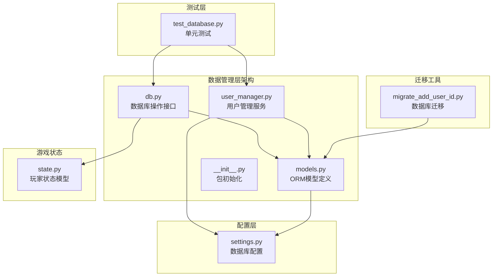
```mermaid
graph TB
subgraph "数据管理层架构"
DB[db.py<br/>数据库操作接口]
MODELS[models.py<br/>ORM模型定义]
UM[user_manager.py<br/>用户管理服务]
INIT[__init__.py<br/>包初始化]
end
subgraph "配置层"
SETTINGS[settings.py<br/>数据库配置]
end
subgraph "游戏状态"
STATE[state.py<br/>玩家状态模型]
end
subgraph "测试层"
TESTS[test_database.py<br/>单元测试]
end
subgraph "迁移工具"
MIGRATE[migrate_add_user_id.py<br/>数据库迁移]
end
DB --> MODELS
UM --> MODELS
DB --> STATE
UM --> SETTINGS
MODELS --> SETTINGS
TESTS --> DB
TESTS --> UM
MIGRATE --> MODELS
```

**图表来源**
- [src/database/db.py](file://src/database/db.py#L1-L517)
- [src/database/models.py](file://src/database/models.py#L1-L171)
- [src/database/user_manager.py](file://src/database/user_manager.py#L1-L401)

**章节来源**
- [src/database/db.py](file://src/database/db.py#L1-L50)
- [src/database/models.py](file://src/database/models.py#L1-L50)
- [src/database/user_manager.py](file://src/database/user_manager.py#L1-L50)

## 核心组件

### ORM模型设计

数据管理层采用SQLAlchemy ORM进行数据库抽象，定义了完整的实体关系模型：

#### 主要实体关系

```mermaid
erDiagram
USERS {
integer user_id PK
string private_id UK
string public_id UK
string display_name
datetime created_at
datetime last_login
}
FRIENDSHIPS {
integer id PK
integer user_id FK
integer friend_id FK
string status
datetime created_at
datetime updated_at
}
GAMES {
integer game_id PK
integer user_id FK
datetime created_at
datetime updated_at
string language
json initial_state
json final_state
string ending_type
text ending_summary
boolean is_public
}
GAME_STATES {
integer state_id PK
integer game_id FK
integer week
integer age
json state_json
datetime created_at
}
DECISIONS {
integer decision_id PK
integer game_id FK
integer week
text event_description
string choice_text
json effects
datetime created_at
}
ENDINGS {
integer ending_id PK
integer game_id FK UK
json final_state
string ending_type
text summary
json achievements
datetime created_at
}
CHARACTER_PRESETS {
integer preset_id PK
integer user_id FK
string preset_name
string player_name
text life_vision
json character_settings
datetime created_at
datetime updated_at
}
USERS ||--o{ GAMES : creates
GAMES ||--o{ GAME_STATES : contains
GAMES ||--o{ DECISIONS : contains
GAMES ||--|| ENDINGS : has_one
USERS ||--o{ CHARACTER_PRESETS : creates
FRIENDSHIPS }o--|| USERS : member
```

**图表来源**
- [src/database/models.py](file://src/database/models.py#L11-L144)

#### 字段定义和约束规则

每个模型都定义了详细的字段约束和业务规则：

**用户模型 (User)**
- `user_id`: 主键，自增
- `private_id`: 唯一索引，用于登录认证
- `public_id`: 唯一索引，用于社交功能
- `display_name`: 可选昵称
- 自动时间戳管理

**游戏模型 (Game)**
- `user_id`: 外键关联用户
- `language`: 游戏语言设置
- `initial_state`: JSON存储初始状态
- `final_state`: JSON存储最终状态
- `is_public`: 公开标记，用于好友分享
- 级联删除支持

**游戏状态模型 (GameState)**
- `week`: 周数标识
- `age`: 年龄信息
- `state_json`: 完整状态快照
- 时间序列存储

**决策模型 (Decision)**
- `event_description`: 事件描述
- `choice_text`: 选择文本
- `effects`: 影响效果JSON
- 周序号排序

**章节来源**
- [src/database/models.py](file://src/database/models.py#L11-L144)

### 数据库操作接口

#### GameDatabase类设计

GameDatabase类提供了完整的数据库操作接口，封装了所有CRUD操作：

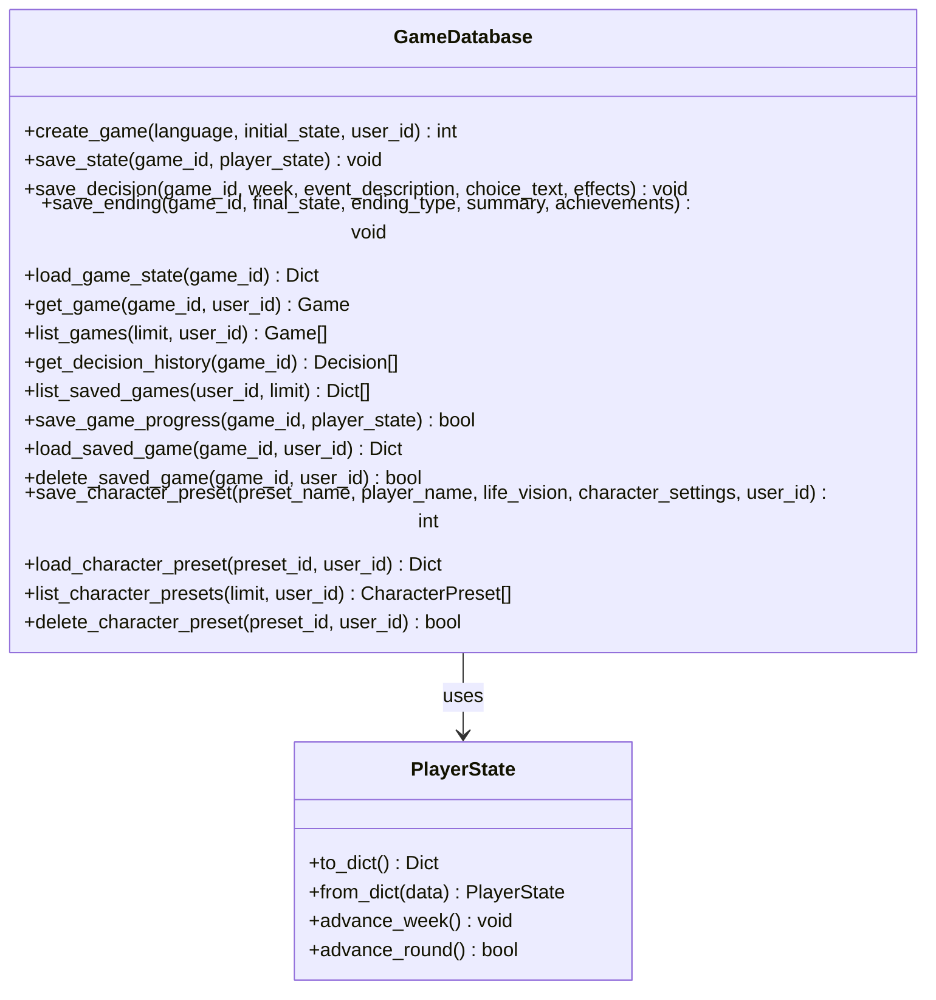
```mermaid
classDiagram
class GameDatabase {
+create_game(language, initial_state, user_id) int
+save_state(game_id, player_state) void
+save_decision(game_id, week, event_description, choice_text, effects) void
+save_ending(game_id, final_state, ending_type, summary, achievements) void
+load_game_state(game_id) Dict
+get_game(game_id, user_id) Game
+list_games(limit, user_id) Game[]
+get_decision_history(game_id) Decision[]
+list_saved_games(user_id, limit) Dict[]
+save_game_progress(game_id, player_state) bool
+load_saved_game(game_id, user_id) Dict
+delete_saved_game(game_id, user_id) bool
+save_character_preset(preset_name, player_name, life_vision, character_settings, user_id) int
+load_character_preset(preset_id, user_id) Dict
+list_character_presets(limit, user_id) CharacterPreset[]
+delete_character_preset(preset_id, user_id) bool
}
class PlayerState {
+to_dict() Dict
+from_dict(data) PlayerState
+advance_week() void
+advance_round() bool
}
GameDatabase --> PlayerState : uses
```

**图表来源**
- [src/database/db.py](file://src/database/db.py#L10-L517)

#### 用户管理服务

UserManager类提供了完整的用户认证和社交功能：

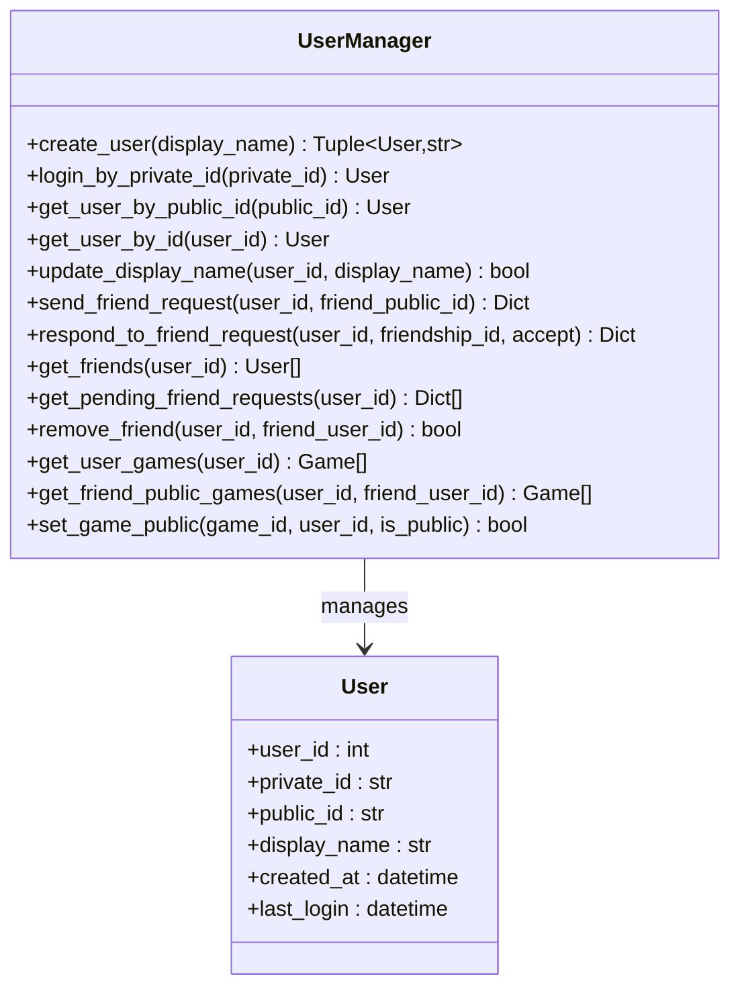
```mermaid
classDiagram
class UserManager {
+create_user(display_name) Tuple~User,str~
+login_by_private_id(private_id) User
+get_user_by_public_id(public_id) User
+get_user_by_id(user_id) User
+update_display_name(user_id, display_name) bool
+send_friend_request(user_id, friend_public_id) Dict
+respond_to_friend_request(user_id, friendship_id, accept) Dict
+get_friends(user_id) User[]
+get_pending_friend_requests(user_id) Dict[]
+remove_friend(user_id, friend_user_id) bool
+get_user_games(user_id) Game[]
+get_friend_public_games(user_id, friend_user_id) Game[]
+set_game_public(game_id, user_id, is_public) bool
}
class User {
+user_id : int
+private_id : str
+public_id : str
+display_name : str
+created_at : datetime
+last_login : datetime
}
UserManager --> User : manages
```

**图表来源**
- [src/database/user_manager.py](file://src/database/user_manager.py#L34-L401)

**章节来源**
- [src/database/db.py](file://src/database/db.py#L10-L517)
- [src/database/user_manager.py](file://src/database/user_manager.py#L34-L401)

## 架构概览

数据管理层采用分层架构设计，确保关注点分离和模块化：

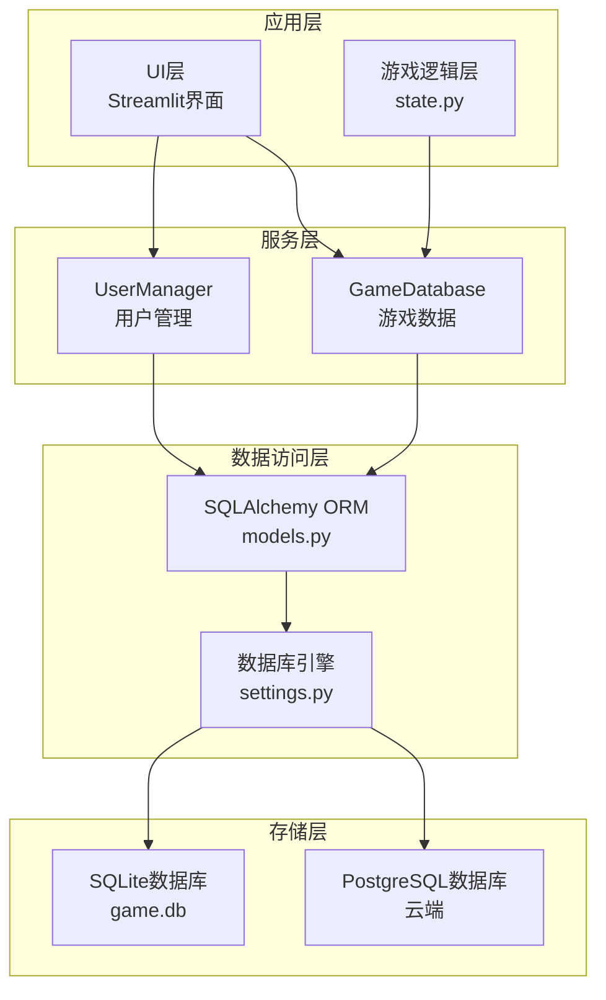
```mermaid
graph TB
subgraph "应用层"
UI[UI层<br/>Streamlit界面]
GAME[游戏逻辑层<br/>state.py]
end
subgraph "服务层"
UM[UserManager<br/>用户管理]
GD[GameDatabase<br/>游戏数据]
end
subgraph "数据访问层"
ORM[SQLAlchemy ORM<br/>models.py]
ENGINE[数据库引擎<br/>settings.py]
end
subgraph "存储层"
SQLITE[SQLite数据库<br/>game.db]
PG[PostgreSQL数据库<br/>云端]
end
UI --> UM
UI --> GD
UM --> ORM
GD --> ORM
ORM --> ENGINE
ENGINE --> SQLITE
ENGINE --> PG
GAME --> GD
```

**图表来源**
- [src/database/db.py](file://src/database/db.py#L1-L50)
- [src/database/models.py](file://src/database/models.py#L146-L171)
- [config/settings.py](file://config/settings.py#L68-L82)

### 数据流图

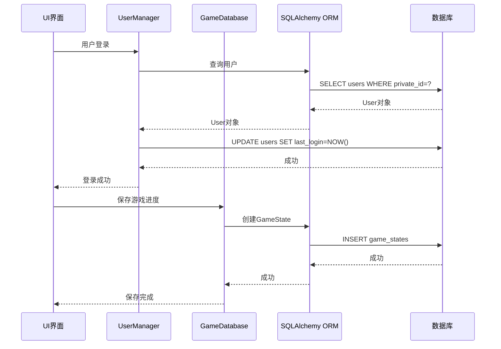
```mermaid
sequenceDiagram
participant UI as UI界面
participant UM as UserManager
participant GD as GameDatabase
participant ORM as SQLAlchemy ORM
participant DB as 数据库
UI->>UM : 用户登录
UM->>ORM : 查询用户
ORM->>DB : SELECT users WHERE private_id=?
DB-->>ORM : User对象
ORM-->>UM : User对象
UM->>DB : UPDATE users SET last_login=NOW()
DB-->>UM : 成功
UM-->>UI : 登录成功
UI->>GD : 保存游戏进度
GD->>ORM : 创建GameState
ORM->>DB : INSERT game_states
DB-->>ORM : 成功
ORM-->>GD : 成功
GD-->>UI : 保存完成
```

**图表来源**
- [src/database/user_manager.py](file://src/database/user_manager.py#L104-L127)
- [src/database/db.py](file://src/database/db.py#L274-L322)

## 详细组件分析

### 数据库连接和会话管理

数据管理层实现了灵活的数据库连接策略，支持本地SQLite和云端数据库：

#### 连接配置

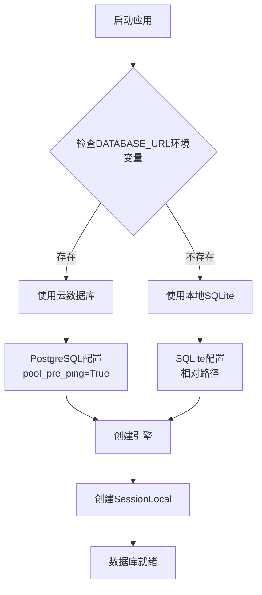
```mermaid
flowchart TD
START[启动应用] --> CHECK_DB{检查DATABASE_URL环境变量}
CHECK_DB --> |存在| CLOUD[使用云数据库]
CHECK_DB --> |不存在| LOCAL[使用本地SQLite]
CLOUD --> PG_CONFIG[PostgreSQL配置<br/>pool_pre_ping=True]
LOCAL --> SQLITE_CONFIG[SQLite配置<br/>相对路径]
PG_CONFIG --> ENGINE[创建引擎]
SQLITE_CONFIG --> ENGINE
ENGINE --> SESSION[创建SessionLocal]
SESSION --> READY[数据库就绪]
```

**图表来源**
- [config/settings.py](file://config/settings.py#L68-L82)
- [src/database/models.py](file://src/database/models.py#L146-L156)

#### 会话生命周期管理

每个数据库操作都遵循严格的会话管理模式：

**章节来源**
- [src/database/models.py](file://src/database/models.py#L146-L171)

### 游戏状态持久化策略

#### 状态快照机制

游戏状态采用快照存储策略，确保数据完整性和可恢复性：

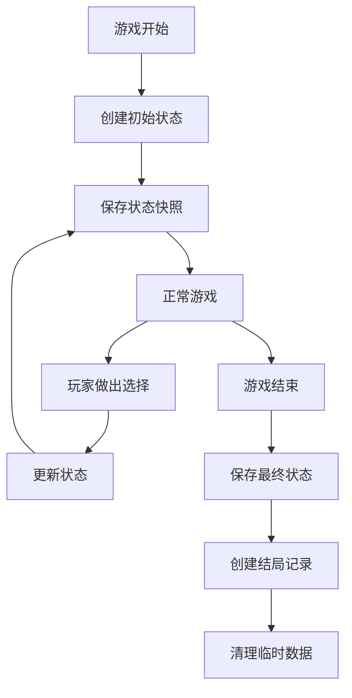
```mermaid
flowchart TD
GAME_START[游戏开始] --> INIT_STATE[创建初始状态]
INIT_STATE --> SAVE_SNAPSHOT[保存状态快照]
SAVE_SNAPSHOT --> NORMAL_PLAY[正常游戏]
NORMAL_PLAY --> PLAYER_ACTION[玩家做出选择]
PLAYER_ACTION --> UPDATE_STATE[更新状态]
UPDATE_STATE --> SAVE_SNAPSHOT
NORMAL_PLAY --> GAME_END[游戏结束]
GAME_END --> SAVE_FINAL_STATE[保存最终状态]
SAVE_FINAL_STATE --> CREATE_ENDING[创建结局记录]
CREATE_ENDING --> CLEANUP[清理临时数据]
```

**图表来源**
- [src/database/db.py](file://src/database/db.py#L48-L144)
- [src/game/state.py](file://src/game/state.py#L553-L561)

#### 状态恢复流程

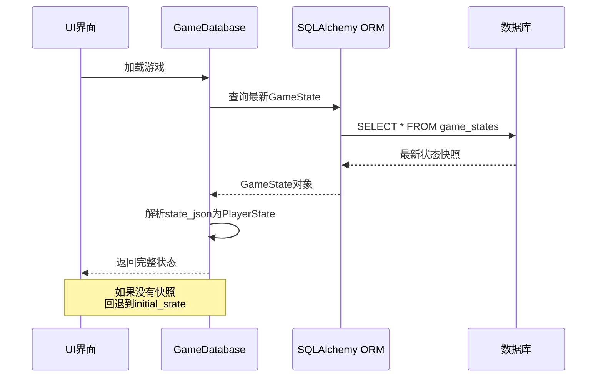
```mermaid
sequenceDiagram
participant UI as UI界面
participant GD as GameDatabase
participant ORM as SQLAlchemy ORM
participant DB as 数据库
UI->>GD : 加载游戏
GD->>ORM : 查询最新GameState
ORM->>DB : SELECT * FROM game_states
DB-->>ORM : 最新状态快照
ORM-->>GD : GameState对象
GD->>GD : 解析state_json为PlayerState
GD-->>UI : 返回完整状态
Note over UI,GD : 如果没有快照<br/>回退到initial_state
```

**图表来源**
- [src/database/db.py](file://src/database/db.py#L145-L172)

**章节来源**
- [src/database/db.py](file://src/database/db.py#L48-L172)
- [src/game/state.py](file://src/game/state.py#L553-L561)

### 用户认证和权限控制

#### 用户身份管理

系统采用双ID机制确保用户隐私和社交功能的平衡：

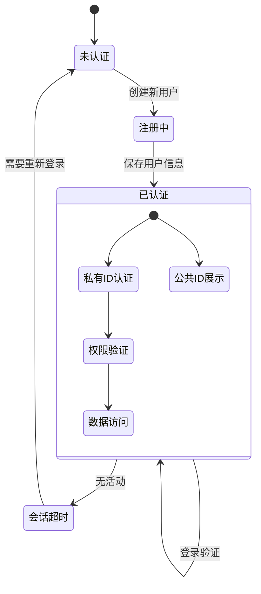
```mermaid
stateDiagram-v2
[*] --> 未认证
未认证 --> 注册中 : 创建新用户
注册中 --> 已认证 : 保存用户信息
已认证 --> 已认证 : 登录验证
已认证 --> 会话超时 : 无活动
会话超时 --> 未认证 : 需要重新登录
state 已认证 {
[*] --> 私有ID认证
[*] --> 公共ID展示
私有ID认证 --> 权限验证
权限验证 --> 数据访问
}
```

**图表来源**
- [src/database/user_manager.py](file://src/database/user_manager.py#L68-L103)
- [src/database/user_manager.py](file://src/database/user_manager.py#L104-L127)

#### 权限控制机制

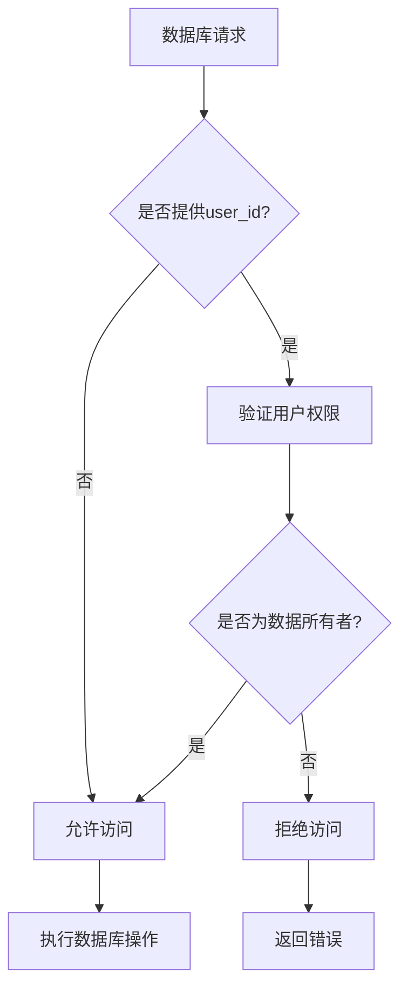
```mermaid
flowchart TD
REQUEST[数据库请求] --> CHECK_USER{是否提供user_id?}
CHECK_USER --> |否| ALLOW[允许访问]
CHECK_USER --> |是| VERIFY[验证用户权限]
VERIFY --> CHECK_OWNER{是否为数据所有者?}
CHECK_OWNER --> |是| ALLOW
CHECK_OWNER --> |否| DENY[拒绝访问]
ALLOW --> EXECUTE[执行数据库操作]
DENY --> ERROR[返回错误]
```

**图表来源**
- [src/database/db.py](file://src/database/db.py#L174-L193)
- [src/database/db.py](file://src/database/db.py#L323-L364)

**章节来源**
- [src/database/user_manager.py](file://src/database/user_manager.py#L68-L144)
- [src/database/db.py](file://src/database/db.py#L174-L193)

### 决策历史记录系统

#### 决策追踪机制

系统完整记录每个决策的详细信息，支持游戏分析和回放：

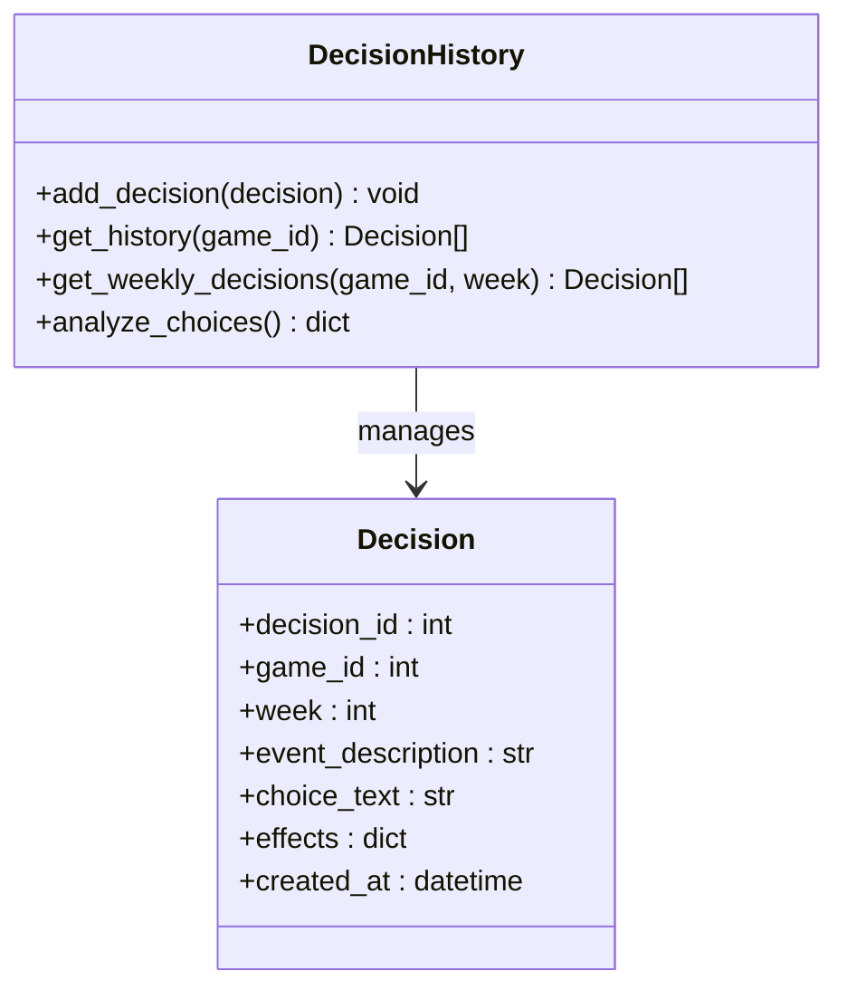
```mermaid
classDiagram
class Decision {
+decision_id : int
+game_id : int
+week : int
+event_description : str
+choice_text : str
+effects : dict
+created_at : datetime
}
class DecisionHistory {
+add_decision(decision) void
+get_history(game_id) Decision[]
+get_weekly_decisions(game_id, week) Decision[]
+analyze_choices() dict
}
DecisionHistory --> Decision : manages
```

**图表来源**
- [src/database/db.py](file://src/database/db.py#L73-L104)
- [src/database/models.py](file://src/database/models.py#L97-L111)

#### 决策效果分析

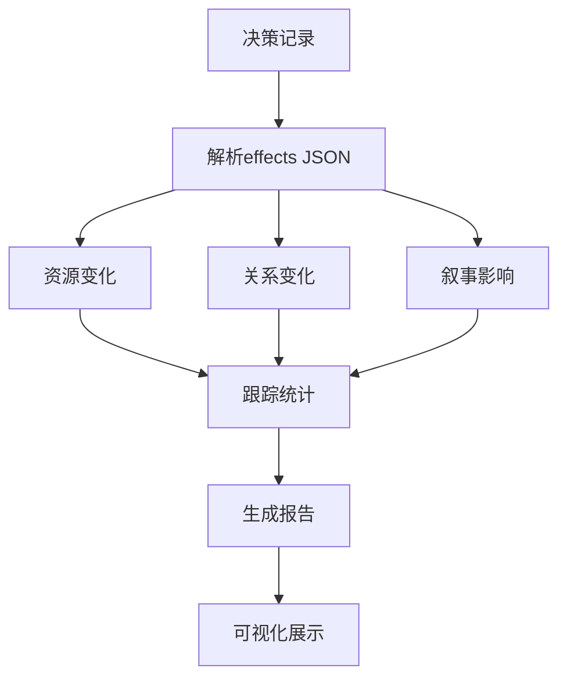
```mermaid
flowchart TD
DECISION[决策记录] --> EFFECTS[解析effects JSON]
EFFECTS --> RESOURCE[资源变化]
EFFECTS --> RELATIONSHIP[关系变化]
EFFECTS --> STORY[叙事影响]
RESOURCE --> TRACK[跟踪统计]
RELATIONSHIP --> TRACK
STORY --> TRACK
TRACK --> REPORT[生成报告]
REPORT --> VISUALIZATION[可视化展示]
```

**图表来源**
- [src/database/db.py](file://src/database/db.py#L73-L104)

**章节来源**
- [src/database/db.py](file://src/database/db.py#L73-L104)
- [src/database/models.py](file://src/database/models.py#L97-L111)

### 数据迁移和版本控制

#### 迁移策略

系统支持数据库结构演进，通过独立的迁移脚本管理：

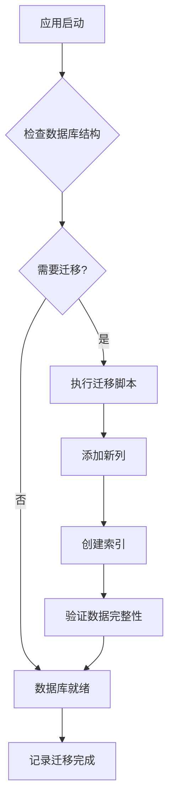
```mermaid
flowchart TD
START[应用启动] --> CHECK_SCHEMA{检查数据库结构}
CHECK_SCHEMA --> NEED_MIGRATE{需要迁移?}
NEED_MIGRATE --> |否| READY[数据库就绪]
NEED_MIGRATE --> |是| RUN_MIGRATE[执行迁移脚本]
RUN_MIGRATE --> ADD_COLUMNS[添加新列]
ADD_COLUMNS --> CREATE_INDEXES[创建索引]
CREATE_INDEXES --> VALIDATE[验证数据完整性]
VALIDATE --> READY
READY --> LOG[记录迁移完成]
```

**图表来源**
- [migrate_add_user_id.py](file://migrate_add_user_id.py#L9-L78)

#### 迁移脚本设计

迁移脚本采用幂等设计，确保重复执行的安全性：

**章节来源**
- [migrate_add_user_id.py](file://migrate_add_user_id.py#L9-L78)

## 依赖关系分析

### 组件耦合度分析

数据管理层展现了良好的模块化设计，各组件间耦合度适中：

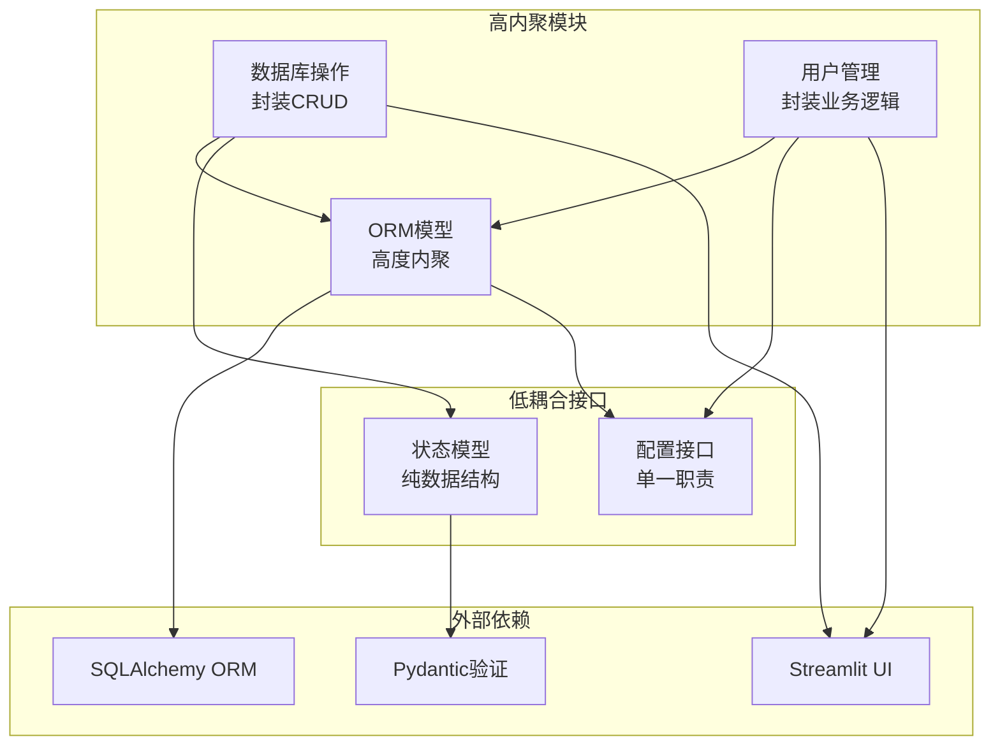
```mermaid
graph TB
subgraph "高内聚模块"
MODELS[ORM模型<br/>高度内聚]
DB[数据库操作<br/>封装CRUD]
UM[用户管理<br/>封装业务逻辑]
end
subgraph "低耦合接口"
SETTINGS[配置接口<br/>单一职责]
STATE[状态模型<br/>纯数据结构]
end
subgraph "外部依赖"
SQLALCHEMY[SQLAlchemy ORM]
STREAMLIT[Streamlit UI]
PYDANTIC[Pydantic验证]
end
MODELS --> SQLALCHEMY
DB --> MODELS
UM --> MODELS
DB --> STATE
UM --> SETTINGS
MODELS --> SETTINGS
DB --> STREAMLIT
UM --> STREAMLIT
STATE --> PYDANTIC
```

**图表来源**
- [src/database/__init__.py](file://src/database/__init__.py#L1-L13)

### 错误处理和异常管理

系统实现了多层次的错误处理机制：

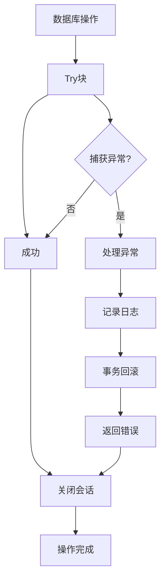
```mermaid
flowchart TD
OPERATION[数据库操作] --> TRY_BLOCK[Try块]
TRY_BLOCK --> SUCCESS[成功]
TRY_BLOCK --> EXISTING_ERROR{捕获异常?}
EXISTING_ERROR --> |否| SUCCESS
EXISTING_ERROR --> |是| HANDLE_ERROR[处理异常]
HANDLE_ERROR --> LOG_ERROR[记录日志]
LOG_ERROR --> ROLLBACK[事务回滚]
ROLLBACK --> RETURN_ERROR[返回错误]
SUCCESS --> CLOSE_SESSION[关闭会话]
RETURN_ERROR --> CLOSE_SESSION
CLOSE_SESSION --> FINISH[操作完成]
```

**图表来源**
- [src/database/db.py](file://src/database/db.py#L285-L321)

**章节来源**
- [src/database/db.py](file://src/database/db.py#L285-L321)
- [src/database/user_manager.py](file://src/database/user_manager.py#L54-L59)

## 性能考虑

### 连接池优化

系统采用SQLAlchemy的连接池管理，支持不同数据库类型的优化配置：

#### SQLite优化配置
- 默认连接池大小：10
- 连接超时：60秒
- 自动重连机制

#### PostgreSQL优化配置
- `pool_pre_ping=True`：自动检测连接失效
- 连接池大小：20
- 连接超时：30秒

### 查询优化策略

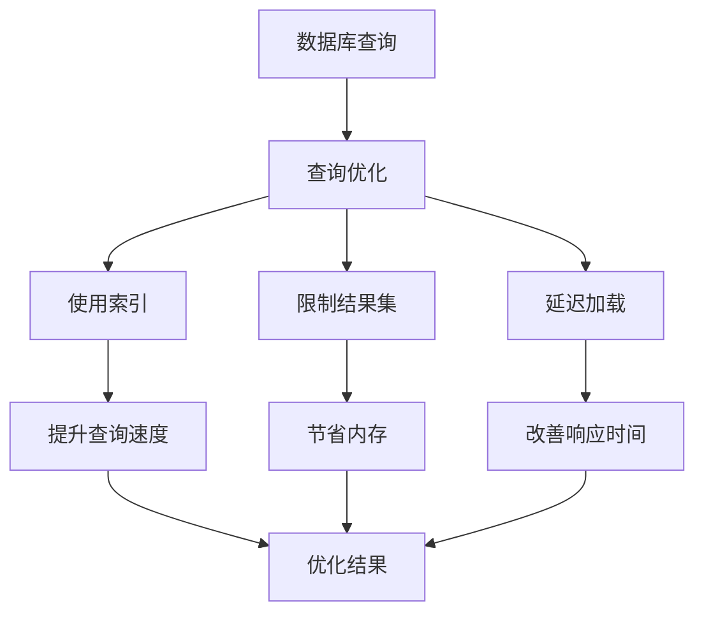
```mermaid
flowchart TD
QUERY[数据库查询] --> OPTIMIZE[查询优化]
OPTIMIZE --> INDEXES[使用索引]
OPTIMIZE --> LIMITS[限制结果集]
OPTIMIZE --> LAZY_LOADING[延迟加载]
INDEXES --> SPEED[提升查询速度]
LIMITS --> MEMORY[节省内存]
LAZY_LOADING --> RESPONSE[改善响应时间]
SPEED --> RESULT[优化结果]
MEMORY --> RESULT
RESPONSE --> RESULT
```

### 缓存策略

系统实现了多级缓存机制：

1. **连接级缓存**：复用数据库连接
2. **查询结果缓存**：短期查询结果缓存
3. **会话状态缓存**：用户会话状态缓存

## 故障排除指南

### 常见问题诊断

#### 数据库连接问题

**症状**：应用启动时报数据库连接错误
**解决方案**：
1. 检查`DATABASE_URL`环境变量配置
2. 验证数据库文件权限
3. 确认数据库引擎配置正确

#### 数据迁移失败

**症状**：迁移脚本执行失败
**解决方案**：
1. 检查数据库连接状态
2. 验证目标数据库版本
3. 手动执行迁移脚本

#### 用户认证失败

**症状**：用户无法登录或权限验证失败
**解决方案**：
1. 验证私有ID格式
2. 检查用户是否存在
3. 确认会话状态管理

**章节来源**
- [src/database/db.py](file://src/database/db.py#L285-L321)
- [migrate_add_user_id.py](file://migrate_add_user_id.py#L70-L78)

### 日志和监控

系统实现了完善的日志记录机制：

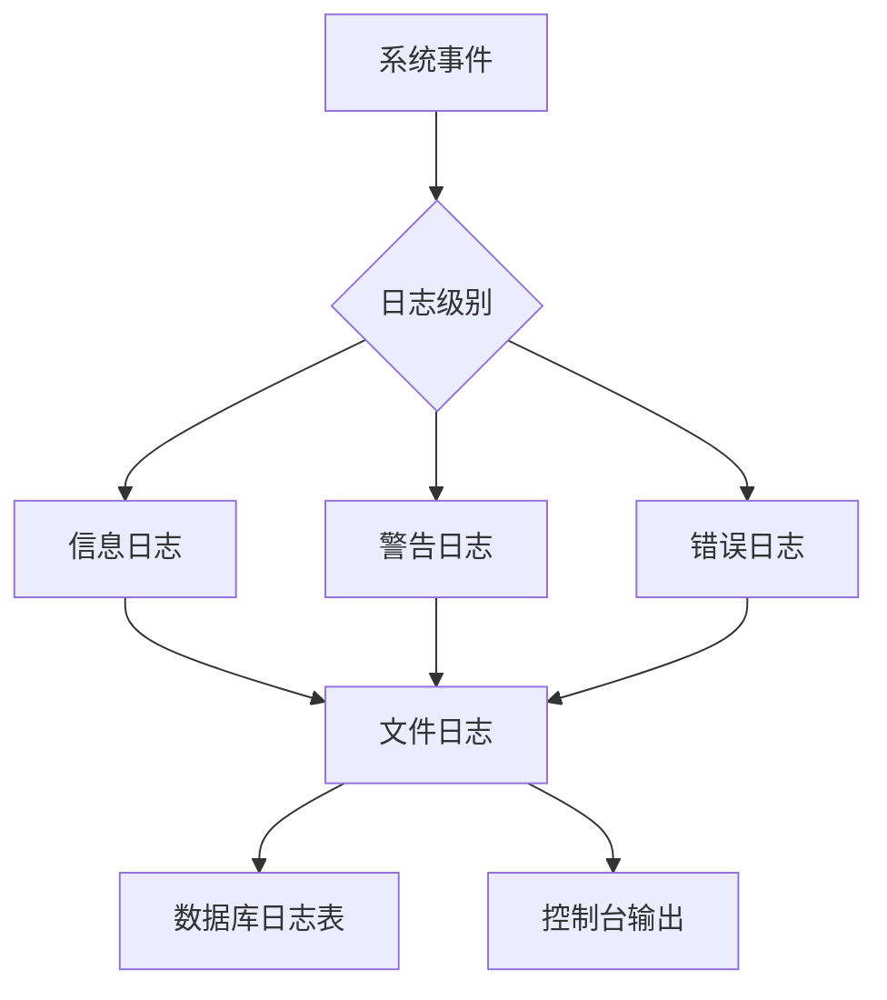
```mermaid
flowchart TD
EVENT[系统事件] --> LOG_LEVEL{日志级别}
LOG_LEVEL --> INFO[信息日志]
LOG_LEVEL --> WARNING[警告日志]
LOG_LEVEL --> ERROR[错误日志]
INFO --> FILE_LOG[文件日志]
WARNING --> FILE_LOG
ERROR --> FILE_LOG
FILE_LOG --> DATABASE_LOG[数据库日志表]
FILE_LOG --> CONSOLE_LOG[控制台输出]
```

## 结论

数据管理层设计体现了现代Web应用的最佳实践，具有以下特点：

### 设计优势

1. **模块化架构**：清晰的职责分离，便于维护和扩展
2. **ORM抽象**：统一的数据访问接口，支持多种数据库后端
3. **安全设计**：双ID机制确保用户隐私，完善的权限控制
4. **可扩展性**：支持本地和云端部署，灵活的配置管理
5. **可靠性**：完整的错误处理和事务管理机制

### 技术亮点

- **状态快照机制**：确保游戏进度的可靠保存和恢复
- **决策追踪系统**：完整的决策历史记录和分析能力
- **数据迁移工具**：支持数据库结构演进的自动化工具
- **性能优化**：连接池管理和查询优化策略

### 改进建议

1. **增加数据库事务管理**：为复杂操作提供更细粒度的事务控制
2. **实现数据备份机制**：定期备份重要数据
3. **增强监控告警**：添加数据库性能监控和告警机制
4. **优化查询性能**：针对高频查询添加专门的索引和视图

数据管理层为整个故事生成游戏提供了坚实的数据基础，其设计充分考虑了可维护性、可扩展性和可靠性，在保证功能完整性的同时，也为未来的功能扩展预留了充足的空间。