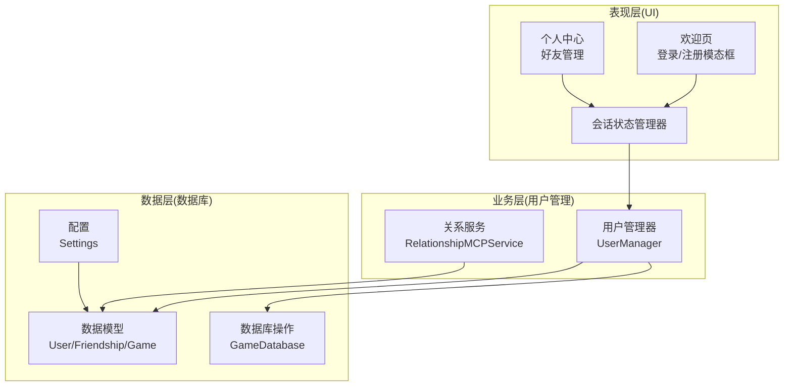
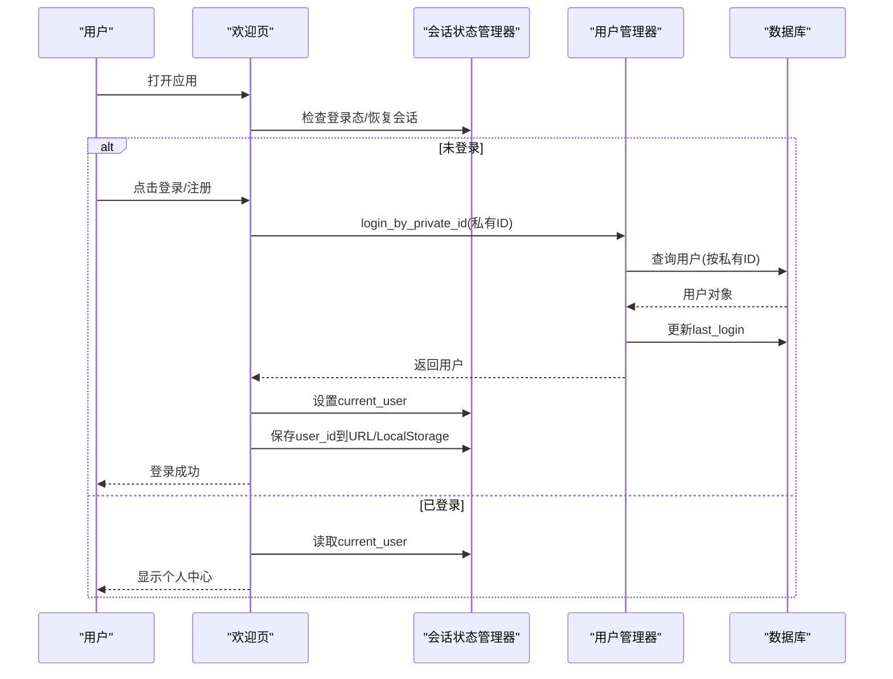
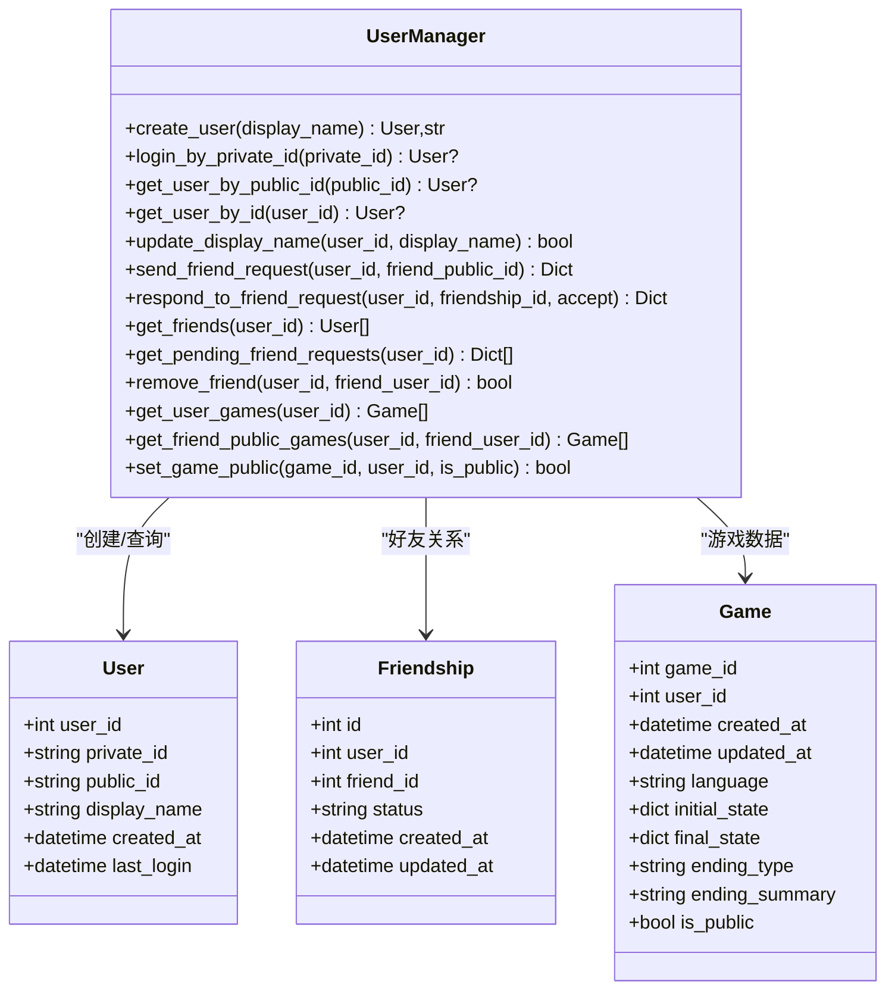
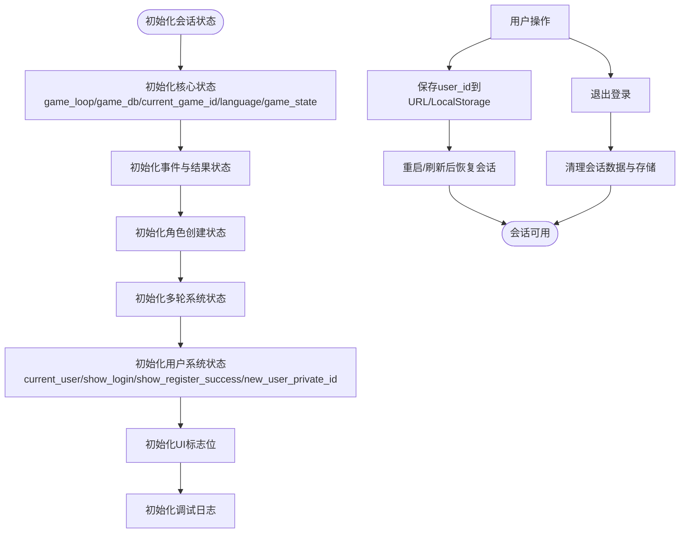
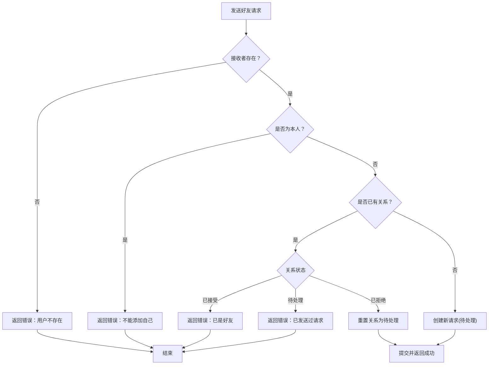
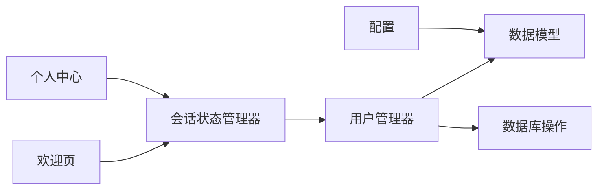

# 用户管理系统

<cite>
**本文档引用的文件**
- [src/database/user_manager.py](file://src/database/user_manager.py)
- [src/database/models.py](file://src/database/models.py)
- [src/ui/state_manager.py](file://src/ui/state_manager.py)
- [src/ui/session_manager.py](file://src/ui/session_manager.py)
- [src/ui/page_views/welcome.py](file://src/ui/page_views/welcome.py)
- [src/ui/page_views/profile.py](file://src/ui/page_views/profile.py)
- [src/database/db.py](file://src/database/db.py)
- [config/settings.py](file://config/settings.py)
- [tests/test_database.py](file://tests/test_database.py)
- [tests/test_ui_modules.py](file://tests/test_ui_modules.py)
</cite>

## 目录
1. [简介](#简介)
2. [项目结构](#项目结构)
3. [核心组件](#核心组件)
4. [架构总览](#架构总览)
5. [详细组件分析](#详细组件分析)
6. [依赖关系分析](#依赖关系分析)
7. [性能考虑](#性能考虑)
8. [故障排除指南](#故障排除指南)
9. [结论](#结论)
10. [附录](#附录)

## 简介
本文件面向用户管理系统，围绕用户认证、会话管理与权限控制展开，详细说明以下内容：
- 用户注册、登录、注销流程，含私有ID与公有ID的双重身份验证机制
- 用户状态管理（最后登录时间、活跃状态等）
- 好友关系系统（请求、接受/拒绝、好友列表）
- 用户数据的安全存储与隐私保护
- 用户管理API的使用示例与错误处理策略

## 项目结构
用户管理系统主要由三层构成：
- 数据层：负责用户与好友关系的数据模型与持久化操作
- 业务层：封装用户管理与好友关系的核心逻辑
- 表现层：基于Streamlit的状态管理与页面交互

**图表来源**
- [src/ui/page_views/welcome.py](file://src/ui/page_views/welcome.py#L179-L285)
- [src/ui/page_views/profile.py](file://src/ui/page_views/profile.py#L10-L184)
- [src/ui/state_manager.py](file://src/ui/state_manager.py#L42-L175)
- [src/database/user_manager.py](file://src/database/user_manager.py#L34-L144)
- [src/database/models.py](file://src/database/models.py#L11-L80)
- [src/database/db.py](file://src/database/db.py#L10-L50)
- [config/settings.py](file://config/settings.py#L30-L100)

**章节来源**
- [src/database/user_manager.py](file://src/database/user_manager.py#L1-L401)
- [src/database/models.py](file://src/database/models.py#L1-L171)
- [src/ui/state_manager.py](file://src/ui/state_manager.py#L1-L773)
- [src/ui/session_manager.py](file://src/ui/session_manager.py#L1-L65)
- [src/ui/page_views/welcome.py](file://src/ui/page_views/welcome.py#L1-L285)
- [src/ui/page_views/profile.py](file://src/ui/page_views/profile.py#L1-L184)
- [src/database/db.py](file://src/database/db.py#L1-L517)
- [config/settings.py](file://config/settings.py#L1-L100)

## 核心组件
- 用户管理器（UserManager）：负责用户创建、登录、显示名称更新、好友关系管理、游戏相关查询等
- 数据模型（User/Friendship/Game）：定义用户、好友关系、游戏会话等实体及其关系
- 会话状态管理器（SessionStateManager）：集中管理UI状态、用户登录态、URL/LocalStorage持久化
- 页面视图（welcome/profile）：提供登录/注册、好友管理等用户交互入口
- 数据库操作（GameDatabase）：封装游戏存档、决策、结局等数据的读写

**章节来源**
- [src/database/user_manager.py](file://src/database/user_manager.py#L34-L401)
- [src/database/models.py](file://src/database/models.py#L11-L127)
- [src/ui/state_manager.py](file://src/ui/state_manager.py#L42-L547)
- [src/ui/page_views/welcome.py](file://src/ui/page_views/welcome.py#L179-L285)
- [src/ui/page_views/profile.py](file://src/ui/page_views/profile.py#L10-L184)
- [src/database/db.py](file://src/database/db.py#L10-L517)

## 架构总览
用户认证采用“私有ID+公有ID”的双标识体系：
- 私有ID：32位分组格式，仅在创建时明文返回，用于登录
- 公有ID：8位字母数字组合，用于展示与添加好友

登录流程通过私有ID标准化后查询用户，成功后更新最后登录时间；注销时清理会话与持久化存储。

**图表来源**
- [src/ui/page_views/welcome.py](file://src/ui/page_views/welcome.py#L234-L261)
- [src/ui/state_manager.py](file://src/ui/state_manager.py#L587-L626)
- [src/database/user_manager.py](file://src/database/user_manager.py#L104-L127)

**章节来源**
- [src/database/user_manager.py](file://src/database/user_manager.py#L104-L127)
- [src/ui/state_manager.py](file://src/ui/state_manager.py#L552-L626)
- [src/ui/page_views/welcome.py](file://src/ui/page_views/welcome.py#L234-L261)

## 详细组件分析

### 用户管理器（UserManager）
职责与接口：
- 生成唯一ID：私有ID（32位分组）与公有ID（8位）
- 用户创建：返回用户对象与私有ID明文（仅创建时可见）
- 登录：通过标准化后的私有ID查找用户并更新最后登录时间
- 好友功能：发送/响应好友请求、获取好友列表、获取待处理请求、删除好友
- 游戏相关：获取用户游戏、获取好友公开游戏、设置游戏公开性

**图表来源**
- [src/database/user_manager.py](file://src/database/user_manager.py#L34-L401)
- [src/database/models.py](file://src/database/models.py#L11-L80)

**章节来源**
- [src/database/user_manager.py](file://src/database/user_manager.py#L68-L102)
- [src/database/user_manager.py](file://src/database/user_manager.py#L104-L127)
- [src/database/user_manager.py](file://src/database/user_manager.py#L165-L225)
- [src/database/user_manager.py](file://src/database/user_manager.py#L226-L254)
- [src/database/user_manager.py](file://src/database/user_manager.py#L255-L336)
- [src/database/user_manager.py](file://src/database/user_manager.py#L339-L401)

### 会话状态管理（SessionStateManager）
职责与特性：
- 类型安全的状态变量访问与初始化
- 用户登录态维护（current_user）
- URL参数与LocalStorage的用户ID持久化与恢复
- 清理会话数据（用户切换/退出登录）

**图表来源**
- [src/ui/state_manager.py](file://src/ui/state_manager.py#L67-L175)
- [src/ui/state_manager.py](file://src/ui/state_manager.py#L552-L626)

**章节来源**
- [src/ui/state_manager.py](file://src/ui/state_manager.py#L67-L175)
- [src/ui/state_manager.py](file://src/ui/state_manager.py#L552-L626)

### 好友关系系统
流程说明：
- 发送好友请求：校验接收者存在性、防止重复/自加、互相关注自动接受、拒绝后可重新发送
- 响应好友请求：仅限接收者处理，支持接受/拒绝
- 好友列表：仅返回已接受的关系
- 待处理请求：列出当前用户收到的待处理请求

**图表来源**
- [src/database/user_manager.py](file://src/database/user_manager.py#L165-L225)

**章节来源**
- [src/database/user_manager.py](file://src/database/user_manager.py#L165-L225)
- [src/database/user_manager.py](file://src/database/user_manager.py#L226-L254)
- [src/database/user_manager.py](file://src/database/user_manager.py#L255-L336)
- [src/ui/page_views/profile.py](file://src/ui/page_views/profile.py#L68-L103)

### 用户状态管理
- 最后登录时间：登录成功后更新
- 活跃状态：可通过最后登录时间与系统时间差评估
- 会话持久化：URL参数与LocalStorage同步保存user_id，支持跨页面/刷新恢复

**章节来源**
- [src/database/user_manager.py](file://src/database/user_manager.py#L119-L121)
- [src/ui/state_manager.py](file://src/ui/state_manager.py#L587-L626)

### 安全与隐私
- 私有ID仅在创建时明文返回，建议用户妥善保存
- 登录采用私有ID标准化匹配，避免格式差异导致的错误
- 数据库连接支持本地SQLite与云数据库（PostgreSQL/MySQL），通过配置切换
- 好友公开游戏需双方为好友且目标游戏为公开

**章节来源**
- [src/database/user_manager.py](file://src/database/user_manager.py#L78-L102)
- [src/database/user_manager.py](file://src/database/user_manager.py#L114-L116)
- [config/settings.py](file://config/settings.py#L68-L82)
- [src/database/user_manager.py](file://src/database/user_manager.py#L351-L377)

## 依赖关系分析
- UserManager依赖数据库会话与模型（User/Friendship/Game）
- 会话状态管理器持有UserManager实例，统一管理UI状态
- 页面视图通过状态管理器调用UserManager执行业务操作
- 数据库操作封装在GameDatabase中，供游戏存档/读档使用

**图表来源**
- [src/ui/page_views/welcome.py](file://src/ui/page_views/welcome.py#L1-L285)
- [src/ui/page_views/profile.py](file://src/ui/page_views/profile.py#L1-L184)
- [src/ui/state_manager.py](file://src/ui/state_manager.py#L14-L175)
- [src/database/user_manager.py](file://src/database/user_manager.py#L34-L144)
- [src/database/db.py](file://src/database/db.py#L10-L50)
- [config/settings.py](file://config/settings.py#L30-L100)

**章节来源**
- [src/database/user_manager.py](file://src/database/user_manager.py#L34-L144)
- [src/ui/state_manager.py](file://src/ui/state_manager.py#L14-L175)
- [src/database/db.py](file://src/database/db.py#L10-L50)

## 性能考虑
- ID生成采用随机算法并循环校验唯一性，冲突概率极低
- 登录与好友查询使用索引字段（private_id/public_id），查询效率高
- 会话状态集中管理，减少全局变量分散带来的性能与一致性问题
- 数据库连接池与事务提交在各操作中正确使用，避免长事务

[本节为通用指导，无需特定文件引用]

## 故障排除指南
常见问题与处理：
- 登录失败：检查私有ID格式（大小写、空格、分隔符），确认标准化后仍可匹配
- 注册成功但未保存私有ID：确保在注册成功提示后妥善保存私有ID
- 好友请求异常：确认接收者公有ID正确、未重复发送、未自加
- 退出登录后仍显示登录态：检查URL/LocalStorage是否清理干净

测试参考：
- 用户创建与登录、ID唯一性、输入格式规范化
- 好友请求发送/接受/拒绝、待处理请求列表
- 会话状态初始化与持久化恢复

**章节来源**
- [tests/test_database.py](file://tests/test_database.py#L433-L500)
- [tests/test_database.py](file://tests/test_database.py#L529-L592)
- [tests/test_ui_modules.py](file://tests/test_ui_modules.py#L227-L253)
- [tests/test_ui_modules.py](file://tests/test_ui_modules.py#L365-L391)

## 结论
本用户管理系统以“私有ID+公有ID”双标识为核心，结合会话状态管理与数据库模型，实现了：
- 安全可控的用户认证与会话持久化
- 完整的好友关系生命周期管理
- 可扩展的用户数据与游戏数据分离设计
配合完善的测试与错误处理策略，系统具备良好的可用性与可维护性。

[本节为总结，无需特定文件引用]

## 附录

### 用户管理API使用示例（路径指引）
- 创建用户
  - 路径：[src/database/user_manager.py](file://src/database/user_manager.py#L68-L102)
  - 用法：调用 create_user(display_name)，返回用户对象与私有ID明文
- 通过私有ID登录
  - 路径：[src/database/user_manager.py](file://src/database/user_manager.py#L104-L127)
  - 用法：login_by_private_id(private_id)，返回用户或None
- 发送好友请求
  - 路径：[src/database/user_manager.py](file://src/database/user_manager.py#L165-L225)
  - 用法：send_friend_request(user_id, friend_public_id)
- 响应好友请求
  - 路径：[src/database/user_manager.py](file://src/database/user_manager.py#L226-L254)
  - 用法：respond_to_friend_request(user_id, friendship_id, accept)
- 获取好友列表
  - 路径：[src/database/user_manager.py](file://src/database/user_manager.py#L255-L336)
  - 用法：get_friends(user_id)
- 获取待处理请求
  - 路径：[src/database/user_manager.py](file://src/database/user_manager.py#L283-L309)
  - 用法：get_pending_friend_requests(user_id)
- 设置游戏公开性
  - 路径：[src/database/user_manager.py](file://src/database/user_manager.py#L379-L401)
  - 用法：set_game_public(game_id, user_id, is_public)

**章节来源**
- [src/database/user_manager.py](file://src/database/user_manager.py#L68-L102)
- [src/database/user_manager.py](file://src/database/user_manager.py#L104-L127)
- [src/database/user_manager.py](file://src/database/user_manager.py#L165-L225)
- [src/database/user_manager.py](file://src/database/user_manager.py#L226-L254)
- [src/database/user_manager.py](file://src/database/user_manager.py#L255-L336)
- [src/database/user_manager.py](file://src/database/user_manager.py#L379-L401)